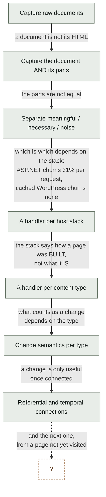
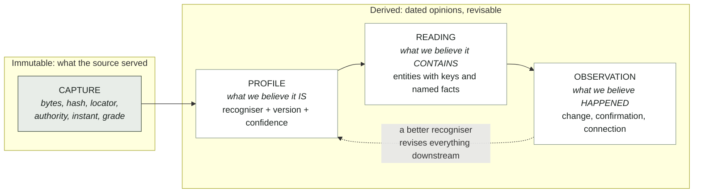
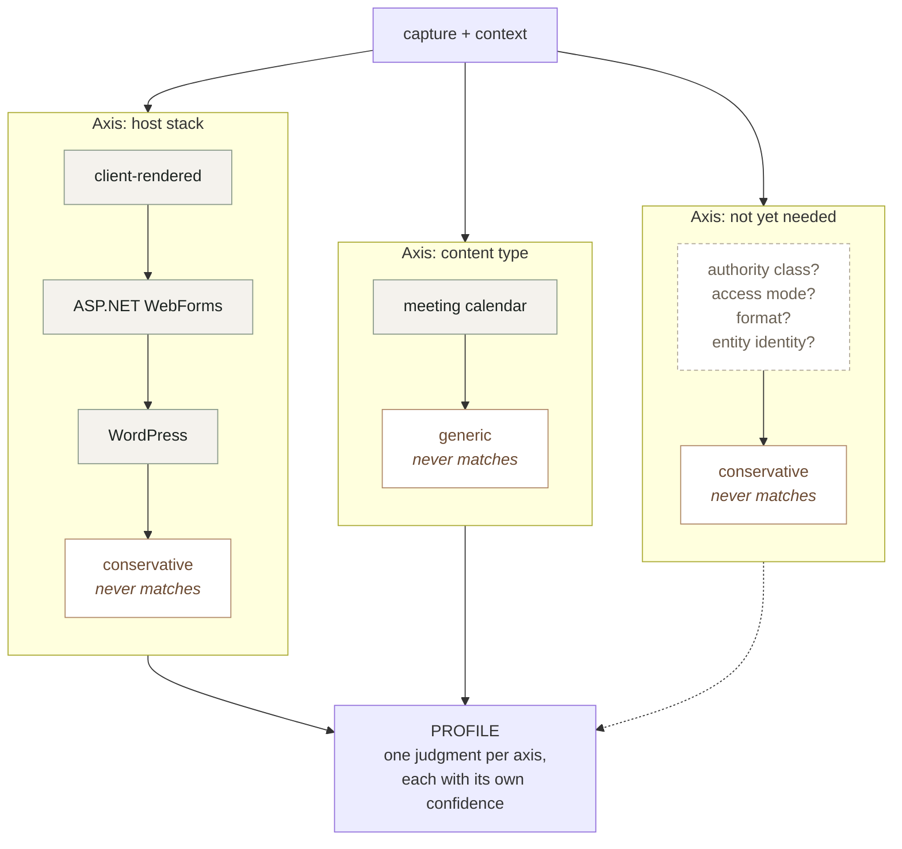
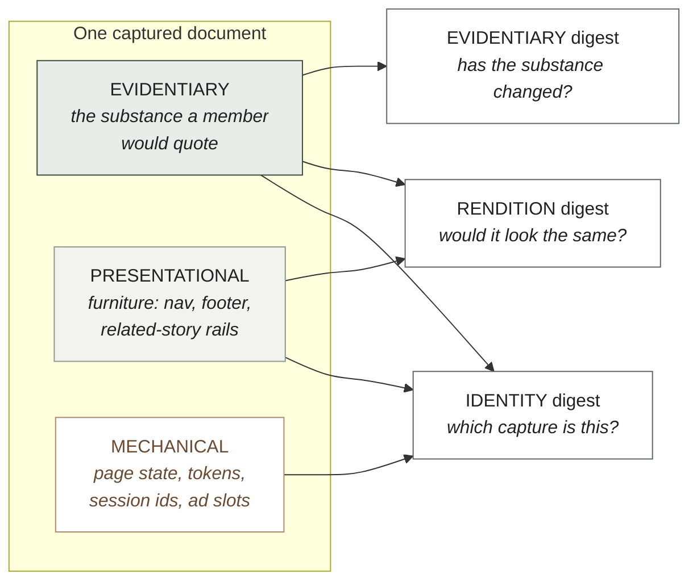
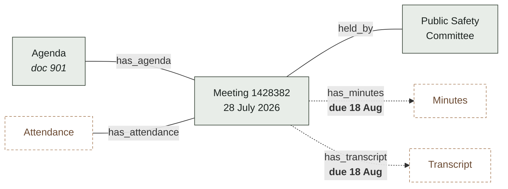
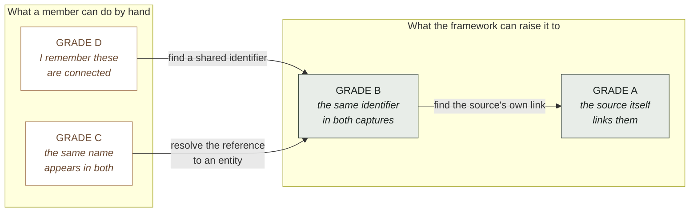
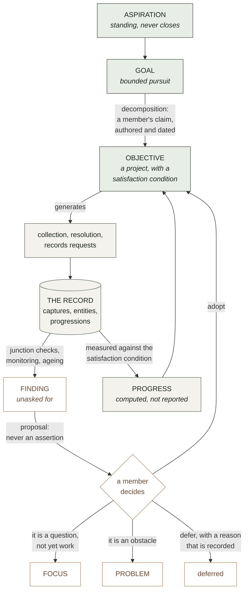
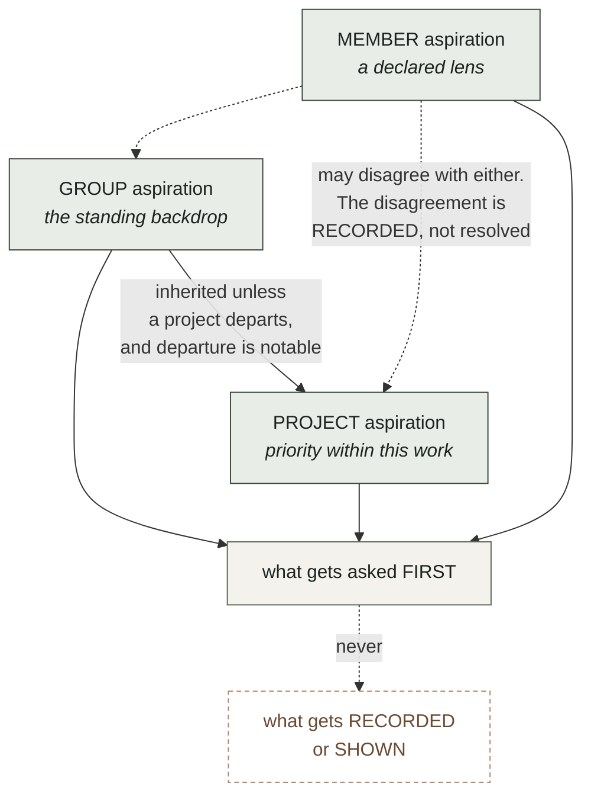
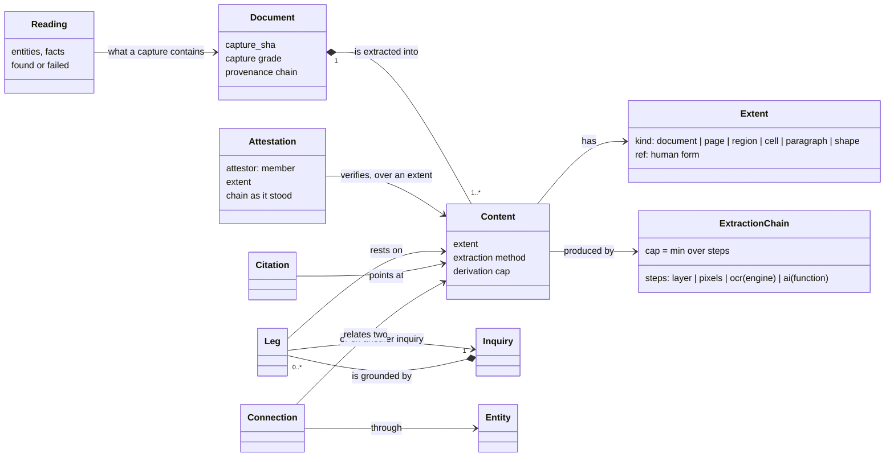

# BIO Content Framework

**Status** · The content framework, in two parts. **Part I (§§1–13)** — the extraction substrate: recognisers, regions and digests, change layers, content types, connections and their grade, progressions, identifier spaces, intent, declared bias, provenance of judgments — ARCHITECTURE APPROVED by Bob at v0.10 on 2026-07-30 and unchanged since. **Part II (§§14–19)** — content as the unit the record points at: role and model, the forms of content, the extraction process as built, organization and access, the central gap stated once, and who defers to this document — added 2026-09-15 as v0.11, rewritten for readability at v0.12 and **REVIEWED BY BOB on 2026-09-14** — his comments (fidelity rising through a person's act; an explicit link is not a hunch; the office and Google Drive formats named; an authored edge never re-pointed) are folded in at v0.12–v0.13, and he closed the review with "those are the only comments I have on Part II"; it rules nothing new of its own, and §18 names the six pieces still to be designed. The file keeps its `v0_10` name so `framework:LINE` citations in code and record resolve; **this front matter shifted every body line by the length of this block once, on 2026-09-14 — a citation written before that date points that many lines early; the fix is to cite the section (`CORPUS-STANDARD.md` §4.6)**. **§14.2 AND §14.5 MOVED ON 2026-09-18 BY REC-87 (IC-127, IC-128)**: member TRANSCRIPTION goes from *no step kind implements* to its PLANE HALF BUILT — the `typed(member)` step kind, `op=transcribe`, a second member's `op=transcriptionattest`, the typist's own attestation refused by name (C-52.9); the UI act is delegated and unbuilt. The Incomplete bullet's sentence calling NARROW and TRANSCRIBE absent was stale since REC-86 for NARROW and is corrected in place. Part I complete and approved at its level; Part II a draft with an explicit frontier. **Part II §§14.4, 14.5, 17 and 18 were updated on 2026-09-14 by FW-17** (IC-86, D-161) when readings gained POSITION and connections gained the DETERMINING REFERENCE PAIR: three statements in those sections — that nothing records where a reference was read, that a connection throws its reference away, and that content-grain connections are impossible — became false at that landing and are corrected in the same commit per `CORPUS-STANDARD.md` §4.1. Part I is UNTOUCHED and remains frozen. **§14.4's stated completeness MOVED again on 2026-09-14**: SK-7 built the MACHINE half of Bob's 5.7 — a machine credential may MINT a content row (`op=contentmint`, the `ai` class under FL-6's cascade), every content-row projection carries the plane's own MINT LABEL, the minter may never attest (C-35.10, and that fence is now REACHED by every machine credential rather than only by one that named itself), and such a row enters a finding only when a member's own leg cites it. The ASSISTANT side of the same sentence is still unbuilt and stays so in §14.5. **ONE ROW OF APPENDIX A.4 WAS CORRECTED ON 2026-09-15 BY REC-99 and nothing else in this document moved**: the row calling the three fixed-key meaning-layer reads "uncapped (D-225)" had been false since REC-60 capped them on 2026-08-07 under IC-25, and it is corrected IN PLACE rather than deleted — the gap it recorded was real and its closing is the news. No section's stated completeness changes: the correction is to the evidence appendix, not to the design, and Part II's frontier is where it was **§15 AND §16 MOVED TWICE on 2026-09-15 (COFF-11 then COFF-12, IC-100, closing D-359)**: the structure-shape row, the content-extent-primitive row and §16's persistence paragraph all said a sheet's grid and a slide's shape count are COMPUTED BY THE PRODUCERS AND RETURNED BY NEITHER, and then — for the hours between the two landings — that the ACQUIRE WIRE DROPS THEM. Both became false the same day and both are corrected in place rather than deleted. The four container entries return the figures, the wire reads all five keys onto the persisted reading, and the INNER bound of both office container arms is LIVE: an impossible address is refused C-45.1 BY NAME with the figure in the refusal, while an EMPTY cell inside the grid still mints, which is the decision that travels with the contract — a container's bound is the format's CAPACITY and never the capture's used range, the used range riding beside it under its own name and fencing nothing, and a format that fixes no maximum (OpenDocument) carrying an honestly NULL bound rather than a borrowed one. COFF-12 also closed a defect nothing had rowed and no assertion could see: the wire's slide map was keyed on ARRAY POSITION, so a deck with an unreadable slide bounded one slide by another's shape count. What remains unstored is named there and not left to be inferred: no entry emits a DECK LENGTH, so a deck whose trailing slides are unreadable reads shorter than it is. **§15 AND §16 MOVED AGAIN ON 2026-09-23 BY COFF-13 (IC-207), and that sentence is now history rather than state**: the deck entries emit `deckLength` and the persisted reading carries it beside a slide list as long as the DECK, so a deck whose trailing slides are unreadable is recorded as long as it is — both sections are corrected in place, and no section's stated completeness otherwise moves. **§18's ITEM 6 AND THE §18 BULLET BELOW WERE CORRECTED ON 2026-09-17 BY M0-57 AND NOTHING ELSE IN THIS DOCUMENT MOVED**: both listed the CLAIM OBJECT among the pieces designed nowhere, while `BIO_Case_Making_v0_1.md` had designed it on 2026-08-03 — and a session told Bob the claim class was undesigned on the strength of this table. The row now POINTS at that design the way items 1–4 already point at theirs. No section's stated completeness changes: this was a second authority restating a status, not a gap. **§18's ITEM 5 AND THE SAME §18 BULLET WERE CORRECTED ON 2026-09-18 BY M0-62, AND NOTHING ELSE MOVED**: item 5 restated the member's lead's design status, which `BIO_System_Design.md` §3 construct 10 owns, so it now POINTS there — keeping the ruling it carries, since *ruled but still without a home* is a fact and only its second copy was removed — and the bullet's *doctrine, Bob's*, stale since the 2026-09-14 ruling, now says the doctrine is ruled. No section's stated completeness changes. **§14.5, §17 AND §18 WERE CORRECTED ON 2026-09-18 BY FW-21 — A SEPARATE ACT FROM M0-62's, MERGED BESIDE IT BY CONDUCT #4**: all three, and the front-matter line below, said the ON-POINT choice of a connection's pair was "rowed (REC-86)". It is not — REC-86 narrows a LEG — and FW-21 measured that FW-17's pair is the strongest-graded mention (M-51, D-161's open half). FW-21 raises no section's stated completeness; §14.5's connection-pair row states what the pair is NOT. **§15 MOVED ON 2026-09-18 BY FW-19 (IC-124, IC-125; `EXTRACTION-BREADTH-DESIGN.md` §3.2)**: the **tables** and **images** rows go from GESTURED to BUILT for office containers — the `sheet-range` and `doc-table` arms and the `image` reference exist, the office entries emit them, and the content row admits them with `covers` per arm and a `cited_as` column that keeps an image cited as its own bytes (no chain, no cap, by meaning) apart from an undetermined transcription. The content-extent-primitive row gains the three kinds. What stays unbuilt is named in those rows (D-415; the PDF `image {page, rect}` producer). **§14.5's connection-pair row MOVED ON 2026-09-18 BY REC-120 (IC-129, D-161 acts 1 and 2)**: the pair now states it is the strongest-graded mention, not a chosen one, and a portion's connection grade no longer answers a definite `outside` (or a tie-won reach) that rests on that machine selection — it answers UNDETERMINED, C-49.4. The on-point CHOICE is still unbuilt, so the row's completeness moves from *overclaiming* to *honestly partial*, not to built. **§14.5's connection-pair row MOVED AGAIN ON 2026-09-23 BY REC-122 (IC-232, D-161 act 3)**: a member may now CHOOSE the on-point mention on one end of a connection and a portion's connection grade answers from that choice; the row's plane half is BUILT and its member surface is not. `reading.text_tier` is a document-level FLOOR and the CHAIN is the authority for any per-page claim (BOB #17, 2026-09-19, D-284; Part I's three-tier section). §12.1's CONTACT is stated as deferred in the Incomplete sections (D-80; BOB #22, 2026-09-21). **§8.4 THEMES added 2026-09-21 on Bob's ruling (D-162)** — Part I's one amendment since its approval — **and its PLANE HALF BUILT on 2026-09-23 by D-162 (IC-241, C-81)**: the theme with its test, a member's placement and a machine's hunch, and fence 4's refusal at every leg grammar; the member surface (UI-76) is not built, and one design gap (the cover, fence 1) is stated in the Incomplete sections. **§12, §13 AND §13.1 DISPOSED 2026-09-21 BY BOB #25** (SCHEDULER #10's group of three) in the Incomplete sections, without touching Part I's text: the intent layer's objects and §13.1's measure are stated deferrals with their trigger, and §13's lens obligation is carried by the run. **SCHEDULER #11's Q1 AND Q2 ANSWERED 2026-09-22 BY BOB #26**: DEC-4's image-region clause is read at the leg as a CAP, never a refusal (§14.4, D-152), and D-164 is CLOSED — Bob's reopening condition of 2026-09-15 is met (§18). D-129's state set is §14.3's table and BUILT at the observation; only its graded retention is deferred, with a trigger (§14.3, BOB #29). **§15's render-companion row gained ONE SENTENCE on 2026-09-23 (D-192)** stating the view-time guarantee that a captured page runs no script, now pinned by a suite; no section's stated completeness changes. **§8.3 GAINED ONE MEASURED PARAGRAPH ON 2026-09-23 (D-74, `measurements/M-119.md`)** and nothing else in Part I moved: its sentence *Oakland's shared identifiers have not been measured*, false from that day, is corrected in place to *until 2026-09-23 … had not been*, and followed by what the first sample found — project number, fund code and C.M.S. number seen in two Oakland systems, contract/PO number and APN UNDETERMINED. It is a record of a measurement, not a change to the approved design; the construct (`6.identifier-spaces`) stays ABSENT. **§18.1's version chain gained its first CORRECTING read 2026-09-23 (D-256, IC-233, on BOB #31's ruling of 22:22Z that the bodies stay as written and the correction is the read)**: `op=changedfromaudit` classes every pre-D-221 "changed from" sentence wrong, right or undetermined through the chain, the three totals apart, and rewrites no body. A Google Drive `.ods` export now carries a §5 evidentiary digest over its container's `content.xml`, so C-18.3 folds re-exports of an unchanged Sheet; `.odt` and `.odp` do not (§16's Incomplete entry, D-351). §8.2: a proposal disposition names the definition version it judged (REC-184), and **since REC-211 (IC-273) the ACT binds the version the MEMBER SAW** — `definitionVersion` on `op=proposedispose`, `DEFINITION_MOVED` (C-33.43) when it is not the one standing and `NO_DEFINITION_VERSION` (C-33.42) when the act names none, on BOB #32's ruling of 2026-09-24 that authored acts bind what was authored; §8.2's own *NOT BUILT* sentence about the read-then-revise window is corrected in place rather than deleted. **§16's TIER-2 AND TIER-3 ROWS MOVED ON 2026-09-24 BY D-514 and nothing else in this document changes**: the tier-2 row stated D-501's GLYPH award for the per-page winner but not for the ROUTING that reaches it, and the tier-3 row stated neither the layer attribution nor the base judgment — three reader sites that were still measuring raw character length, two of which made the record claim what it does not hold (a whitespace-only page attributed to a `layer` derivation; a merge refusing a whitespace-only base while saying it *already holds N decoded character(s)*). Both rows now carry the rule. No section's stated completeness moves: this is the extraction path stated correctly, not a capability gained, and `counts.chars` is unchanged, so no interface moves either. Both that version and a revision's BASIS now reach a member (UI-99, 2026-09-24): the queue renders `op=queue`'s `disposed` block and the progressions screen renders every version the record holds with its basis beside it, `not recorded` stated in words where the record holds none. **§16 MOVED ON 2026-09-24 BY D-517 (M-145) and nothing else in this document changed**: the section described ONE word-gap rule where Tier 1 has TWO — the second, a `TJ` array displacement inside one shown run, went unmentioned while its threshold sat at a hand-picked figure 2.5x from the measured one. The second population is now measured, that figure is CONFIRMED as its valley's midpoint rather than replaced, the two constants are kept apart with the cost of unifying them measured in both directions, and the two rules' EMITTER is unified. §16 gains that bullet; the bullet above it is unchanged and stays true, since what it states about a positioning operator's jump is what was measured for it. No section's stated completeness moves: this is a design that described less than the code did. **§16 GAINED READING PROVENANCE on 2026-09-24 (D-536, BOB #33's ruling of 21:25Z folded)**: a reading carries its tier and member per page, the pages transcribed and a SHA-256 of the exact text it classified; every reading of a capture is kept; a re-read that disagrees is attributed to a tier and a member; a reading from before reads UNDETERMINED. §6: a Drive-linked bundle whose baseline is a capture of Google's shell (a pre-CAP-8 acquire) is named by `op=driveshells` with its remedy, a re-acquire through the export filed beside it (D-525). as of 2026-09-25.

**Place in the system** · The single authoritative content design and the home of constructs 4, 5 and 6 of `BIO_System_Design.md` §3 (content — the heart of the system; document profile and the extraction substrate; meaning). `CONSTRUCTS.md` is the inventory and evidence beneath Part I; `docs/development/CONTENT-EXTENT-DESIGN-SPACE.md` is the design-space study for Part II §18's first piece; `CONTENT-SEARCH-DESIGN.md`, `OBSERVATION-LOG-DESIGN.md` and `EXTRACTION-BREADTH-DESIGN.md` are the designs for its pieces 2, 3 and 4; `STORE-AS-CACHE.md`'s three-axis and four-level tables are adopted in §14.2–14.3; `CLAUDE.md`'s content section points here; DEBT D-164 and INTERFACES I2 cite it. It does not own retrieval, the investigative session, the bias doctrine, the interface contracts, or any ruling.

**Incomplete sections** ·
- §8.4 — THEMES (Bob's ruling, D-162, 2026-09-21): the PLANE HALF is BUILT (D-162, 2026-09-23, IC-241; `node tools/status.mjs 6.themes`). NOT BUILT: the member surface (UI-76). **DESIGN GAP, routed to BOB:** fence 1 says every reading shows the declarer's COVER, and `BIO_Membership_Architecture_v2.md` §3 says only administrators see cover and handle together; built PROVISIONALLY as the declarer's member id and handle on every reading, never the cover (IC-241 states the reversal cost).
- §14.5 — the AI EXTRACT role is **HALF BUILT, and the half that is missing is the assistant**. SK-7 landed the PLANE half on 2026-09-14: `op=contentmint` admits a machine credential, `content.minted_by` now holds one, every projection of a content row carries a four-state MINT LABEL whose sentence is published through `vocabularies.content_mint_states`, and a machine-minted row is absent from `earned.content` until a member's leg names it. **No assistant calls it.** `ASSISTANT-PILOT.md` §5 exclusion 1 excludes EXTRACT from the pilot BY NAME and its §§2–3 are [DESIGNED-not-built] in full, so there is no EXTRACT run anywhere in `agent-worker/` to make the call — the role has a door and no caller, which is stated here rather than read as built. **The content object is no longer absent: REC-82 landed it on 2026-09-14** as the `content` table (IC-83, I5 1.11.0), content-addressed by `hash(capture_sha, canonical extent, chain)`, with the WRITER on the `pdf-page` and `document` arms of the basis leg and `inquiry_basis.content_id` / `inquiry_basis_version_legs.content_id` arriving NULLABLE. **REC-83 landed the READS on 2026-09-14** (IC-84, I3 14.1.0): `earnedBasisRegistry` answers per content row, `op=earnedbasis` states a portion leg's connection axis as UNDETERMINED with the empty level named (§14.4's ruling — a portion refers only to its portion, and readings carry no position), a new fixed-key `op=content` resolves one row by `content_id`, and the legacy backfill is wired to the first read. **REC-84 landed the EDGE's own half the same day** (IC-84's (1) and (2)): a basis leg — and a version leg — names its extent in `bundle.md` frontmatter as IC-1's union flattened onto the leg, or names an already-minted part outright by `content_id`; an ABSENT extent means the whole document and never `unstated` (§14.4's ruling); the grammar runs at BOTH gates through ONE checker, at C-2.8 for `basis[]` and at C-25.10 for a version's legs, and a kind the plane cannot yet evaluate is refused BY NAME as unlanded rather than silently accepted; `inquiry_basis_version_legs.content_id` now has the writer it deliberately arrived without, keyed by the same content address, so a version leg and a basis leg citing one passage share ONE row; and the investigative run's suggested legs state `document` in the bytes. **REC-85 landed the OTHER THREE ARMS the same day** (no new IC — they are IC-1's union): `sheet-cell`, `doc-para` and `slide-shape` each mint on an in-range address and each refuse an out-of-range one BY NAME as C-45.1 — the same code and the same fact as the page-set refusal, whose canned translation was WIDENED to every container rather than a fifth code minted. **And that landing established a fact this design did not state, which §15 and §16 now carry: THE CONTAINER'S OWN EXTENT IS PERSISTED NOWHERE.** I2 produces the sheet walk, the paragraph list and the shape sequence at acquire and nothing carries any of it onto the reading or into any table, so all three container arms are BUILT, CORRECT AND UNFED — the refusal is skipped, never guessed, and an out-of-range address MINTS today with the absence STATED and the empty level NAMED (the page-set arm's own rule: refusing for a bound nobody measured pushes a member toward citing the whole document, which claims MORE). Persisting it at acquire is CAPTURE's act — the CAP-9 shape for D-345's page count — and is DEBT (D-354) and a DELEGATION. **CAP-12 persisted it on 2026-09-14 and the OUTER bound of all three arms went live; COFF-11 landed the PRODUCER half of the INNER bound on 2026-09-15 (IC-100) with the decision that a sheet's bound is the format's CAPACITY and never its used range; and COFF-12 landed the acquire wire the same day, so the INNER bound is FED AND LIVE and D-359 is CLOSED — a cell past a workbook's grid and a shape past a slide's list are each refused C-45.1 BY NAME with the figure in the refusal, an empty cell inside the grid still mints, and `.ods` carries an honestly NULL bound. That landing also closed a defect nothing had rowed: the wire's slide map was keyed on ARRAY POSITION, so a deck with an unreadable slide mis-attributed every later shape count.** What was absent here and is now BUILT on the plane: the two authored acts — NARROW (REC-86, IC-123) and TRANSCRIBE (REC-87, IC-127/IC-128, 2026-09-18); each one's UI affordance is DELEGATED in `CLAIMS.md` and unbuilt. A version leg's referent is written but served only on `op=promote`'s own response — no read op answers it yet, which is DEBT (D-350) and is named there. `dom` is REFUSED BY NAME until CONTENT-HTML produces one. D-164 closes when those land. **AND REC-97 MADE THE PRIMITIVE REACHABLE FROM THE SURFACE THAT CITES, the same day** (IC-90, I3): `op=cite` — the ONE act that writes a basis leg — read seven named parameters and DROPPED an `extent_kind` sent beside them IN SILENCE, so a member who chose a page got a leg resting on the whole document and the composer could not emit an extent at all; it now carries the flattened extent scalars or a `content_id` onto the leg it splices, judged by the SAME `checkLegExtentGrammar`, with a field it does not carry REFUSED BY NAME (C-45.7), an extent on a case's citation edge refused (C-45.8), one extent across a selection that would write several legs refused (C-45.9) and a value the restricted grammar cannot carry refused (C-45.10) — and a cite that names no part byte-identical, measured on two trees. **What is still absent on the SURFACE, stated because the IC's own RESOLUTION says otherwise: no composer emits an extent yet** — the picker needs a page set the record does not persist (D-354) and a page canvas `app.html` does not have, and it is UI's item. What was absent here and is now BUILT on the plane: the two authored acts — NARROW (REC-86, IC-123) and TRANSCRIBE (REC-87, IC-127/IC-128, 2026-09-18); each one's UI affordance is DELEGATED in `CLAIMS.md` and unbuilt. A version leg's referent is written but served only on `op=promote`'s own response — no read op answers it yet, which is DEBT (D-350) and is named there. `dom` is REFUSED BY NAME until CONTENT-HTML produces one. D-164 closes when those land. What was absent here and is now BUILT on the plane: the two authored acts — NARROW (REC-86, IC-123) and TRANSCRIBE (REC-87, IC-127/IC-128, 2026-09-18); each one's UI affordance is DELEGATED in `CLAIMS.md` and unbuilt. A version leg's referent is written but served only on `op=promote`'s own response — no read op answers it yet, which is DEBT (D-350) and is named there. `dom` is REFUSED BY NAME until CONTENT-HTML produces one. D-164 closes when those land. **AND REC-97 MADE THE PRIMITIVE REACHABLE FROM THE SURFACE THAT CITES, the same day** (IC-90, I3): `op=cite` — the ONE act that writes a basis leg — read seven named parameters and DROPPED an `extent_kind` sent beside them IN SILENCE, so a member who chose a page got a leg resting on the whole document and the composer could not emit an extent at all; it now carries the flattened extent scalars or a `content_id` onto the leg it splices, judged by the SAME `checkLegExtentGrammar`, with a field it does not carry REFUSED BY NAME (C-45.7), an extent on a case's citation edge refused (C-45.8), one extent across a selection that would write several legs refused (C-45.9) and a value the restricted grammar cannot carry refused (C-45.10) — and a cite that names no part byte-identical, measured on two trees. **What is still absent on the SURFACE, stated because the IC's own RESOLUTION says otherwise: no composer emits an extent yet** — the picker needs a page set the record does not persist (D-354) and a page canvas `app.html` does not have, and it is UI's item. What was absent here and is now BUILT on the plane: the two authored acts — NARROW (REC-86, IC-123) and TRANSCRIBE (REC-87, IC-127/IC-128, 2026-09-18); each one's UI affordance is DELEGATED in `CLAIMS.md` and unbuilt. A version leg's referent is written but served only on `op=promote`'s own response — no read op answers it yet, which is DEBT (D-350) and is named there. `dom` is REFUSED BY NAME until CONTENT-HTML produces one. D-164 closes when those land. **AND THE CAPTURE AXIS STOPPED CLAIMING MORE THAN THIS DOCUMENT'S OWN APPENDIX A.1 ALLOWS, 2026-09-15 (REC-88, IC-96, closing D-349).** A.1's ruling row — *"fidelity bounds the capture axis as its weakest link, no third scale"* (DEC-4, CPDF-10) — was carried in code by `textchain.mjs`'s `captureBound` and CALLED BY NOTHING, so a leg citing a document this plane had itself OCR'd at C could be written at capture grade B. `earnedBasisRegistry`'s capture arm now calls it per capture and `checkEarnedLeg` compares against the result: a measured fidelity caps the letter, an UNMEASURED transcription reads UNDETERMINED with the empty level named and a leg claiming any letter on one is refused for CLAIMING rather than for being unmeasured, and publisher-typed text is byte-identical to the pre-item answer (measured on two checkouts). **AND REC-105 CLOSED THAT RESIDUE THE SAME DAY (IC-102, closing D-373), BY CORRECTING THE SECOND READ AND REVERTING NOTHING.** `op=inquirystrength`'s ordinary walk reported a leg's AUTHORED letter from the stored column and never asked the registry, so for a leg written before REC-88 the two reads disagreed and the one a member looked at was the stronger. `strengthOf()` now builds ONE bounded map from `earnedBasisRegistry` over the walk's whole target set and carries it down the recursion: a capture leg's letter is CAPPED at what the record can earn, an unmeasured transcription reads UNDETERMINED and the leg is INERT with its empty level named, and a document the record holds no bytes of states no ceiling and is left alone. Publisher-typed text and an ungraded leg are byte-identical across two checkouts. **One line reached SIX consumers** — the op, the publication bar gate, the pair frozen into a signed case, `op=inquiryground`'s report, `op=reevaluations`' strength block and the projection cache's writer — because `strengthOf()` was the authority all along; the VERSION path is structurally unreachable from the change and stays REC-12/REC-42's. **What is STILL not reached, stated so this frontier is not mistaken for completeness either: the projection CACHE `bundles.inquiry_capture_strength`, which `query.mjs`'s `capture:` selector seeks, answers the letter computed at each question's last promotion — a THIRD reader, found by probing rather than assumed, and rowed as D-379.**. as of 2026-09-15
- §14.4, §14.5, §17, §18 — **READING POSITION and the DETERMINING REFERENCE PAIR landed 2026-09-14 (FW-17, IC-86, D-161)**, and these four sections are updated to it rather than left saying what was true the day before. What the landing does NOT reach, stated here so the frontier is not mistaken for completeness: a position exists only where the container ITEMISED its own text, so a PDF's pages and an office container's paragraphs carry one while the HTML path (read back as a single decoded string) carries none and `dom` has no producer at all; `rect` is always NULL on a reading's `pdf-page` position, because Tier-1/Tier-2 text is a flat per-page string with no geometry; the `sheet-cell` and `slide-shape` arms have no per-cell or per-shape text in the I2 text shape, so a reading over an xlsx or pptx honestly answers nothing; and the ON-POINT CHOICE among several mentions of one entity — Bob's second-pass ruling of 2026-09-14 that specificity is worked for, not merely permitted — is NOT BUILT: **FW-21 measured on 2026-09-18 that FW-17's pair is the STRONGEST-GRADED mention** (`Store.deriveConnections`' grade collapse, ties unspecified), not a chosen one, and that a portion citing a genuine but non-determining mention is told a definite `outside` where the truth is UNDETERMINED. This line said "rowed as REC-86" and that was wrong: REC-86 is NARROW of a basis LEG and a connection is not a leg. **REC-120 closed the OVERCLAIM on 2026-09-18 (IC-129, D-161 acts 1 and 2):** the pair states it is strongest-graded with its tie-break named and `chosen: false`, and a portion whose answer would rest on that machine selection among several mentions is told UNDETERMINED (C-49.4) rather than a definite `outside` or reach. **REC-122 built the CHOICE (act 3) on 2026-09-23 (IC-232):** `op=connectionchoose`, member-only, and the portion's connection grade answers from the chosen mention where one exists; its surface is UI's and unbuilt, and one reference string read on several pages is still ONE mention (`reading_refs`' single position).
- §16 — the Google Drive paragraphs are SILENT on the one thing CAP-8 measured that matters most: the export is Google's conversion at fetch time and the conversion is NOT reproducible — three consecutive exports of one unchanged document produced three distinct `capture_sha` (D-351, MEASUREMENTS.md 2026-09-14 §4) — which puts C-18.3's corroboration fold and `resolveLinks`' identity bracket out of reach for Drive material; a design that makes the export the harvest owes a sentence about what that costs the record (a DESIGN GAP reported by CAP-8, folded here at integration, unwritten). **NARROWED 2026-09-24 by D-351 (built, not yet written into §16's body):** C-18.3's fold now reaches `.ods` exports — `profile.digests.evidentiary` is the sha256 of the package's `content.xml`, measured byte-stable across exports (M-123), with `capture_sha` still the envelope's (§5's three digests, the container arm of `substanceDigests`). STILL OUT OF REACH: `.odt` (its content.xml moves on every export — M-123 found a random `xml:id` on `text:list` on 2 documents, and the normalisation is not measured) and `.odp` (unmeasured), both recorded UNDETERMINED with the reason; `resolveLinks`' bracket (keys on the raw capture sha, D-59). **CORRECTED IN PLACE 2026-09-24 BY D-472** (this bullet's last clause read *and `op=monitor` over a Drive LINK, which fetches the link rather than composing its export address*, and that became false at D-472's landing): the tick now routes `source.locator` through the same recogniser `op=acquire` uses and fetches the OpenDocument export under the governor, so an unchanged `.ods` reads `unchanged` on the container digest where it read `modified` on every tick before; Google's application shell is refused BY NAME on the declared type (C-48.8) and on the bytes (C-48.9) with the look logged LOOKED_INDETERMINATE and the document's own status untouched, and a folder, a kind-less file id and an unread Drive shape are refused before the network. WHAT THE CORRECTION DOES NOT REACH, so the frontier is not read as closed: `.odt` and `.odp` still carry no measured container digest, so a Doc or a Slides deck compares RAW and still reads `modified` whenever Google's conversion differs — which is this bullet's own unreproducible-conversion finding, unchanged.
- §16 — the closing table's ABSENT row: table and image extraction, the AI EXTRACT role, read-time re-extraction to tier 3 (D-319), the content-axis frontier (the per-page tier-2 rule, D-283, is NOT absent and is struck from this list by CONDUCT #20 at c20-batch22: `index.mjs` merges tier 2 through `textchain.mjs` `mergeTier2Text`, per page, and D-501 made its award count glyphs — §16's tier table states the rule) — each with a design as of 2026-09-14 (`EXTRACTION-BREADTH-DESIGN.md`; the frontier in `OBSERVATION-LOG-DESIGN.md` §4.2) and none built — **except IMAGE extraction, built for office containers by FW-19 and for PDF pages by CPDF-18 on 2026-09-18 (table extraction on PDF measured NO-GO, M-55; office tables built by FW-19), and except the AI EXTRACT role, whose PLANE half SK-7 built on 2026-09-14** (the door, the label and the fence; no assistant calls it, so the role's own row in §16's closing table reads PARTLY BUILT rather than ABSENT). **CORRECTED 2026-09-18 by CPDF-19: read-time re-extraction to tier 3 (D-319) is BUILT, opt-in behind `op=pdfstructure&ocr=1`, exactly as `EXTRACTION-BREADTH-DESIGN.md` §5.1 decided** — this bullet listed it as unbuilt. The §16 table body is the as-built snapshot at the shas it names and is not rewritten; this bullet is where its ABSENT row is corrected for D-319. (The per-page tier-2 rule and the content-axis frontier have since landed too — CPDF-20/REC-98 and REC-94 — and this worker did not re-verify their standing beyond noting it; the owner of this document re-reads the row.)
- §16 — **READING PROVENANCE (D-536, 2026-09-24) is BUILT with five stated limits** (its bullet in §16): a caller-carried provenance is persisted as carried; tier 2's member version is not recorded; a container with no page grain is attributed at document grain; a re-read is compared with the reading immediately before it only; and FW-23's CSV `reading.dialect` (REC-218) is the named seam beside it, not built here.
- §18 — **D-164 CLOSED 2026-09-22 (BOB #26): Bob's reopening condition is met, and §18's body says how.** Six pieces "named here, designed nowhere in this document": the content object and extent-carrying edge (D-164 — **DESIGNED 2026-09-14 in `CONTENT-EXTENT-DESIGN-SPACE.md` §6 under Bob's rulings §5.1–5.8, contracted as IC-83, and PARTLY BUILT: REC-82 landed the table and the writer on two arms, REC-83 the reads at content grain, and REC-84 the extent-carrying EDGE — the frontmatter grammar at both leg grains and the version-leg writer; and REC-85 the other three arms, which also MEASURED that the container extent those arms compare against is persisted nowhere (D-354); and REC-86 (2026-09-18, IC-123) the member's NARROW act at the plane — a new basis version one leg narrower, the old retained, chosen from machine proposals labelled as machine work — with the UI affordance and narrowing a LIVE-basis leg still unbuilt**); content-grain search, the general observation log and extraction breadth (**each DESIGNED 2026-09-14 by BOB #11** in `docs/development/CONTENT-SEARCH-DESIGN.md`, `OBSERVATION-LOG-DESIGN.md` and `EXTRACTION-BREADTH-DESIGN.md`, decomposed into the BOB INBOX; their build state is `node tools/status.mjs 5` and `9`'s to say, and this bullet read *none built* until 2026-09-22); homes for the member's lead and firsthand observation (**the doctrine is RULED, 2026-09-14, §14.4; the lead's design status is `BIO_System_Design.md` §3 construct 10's to state and the observation's is D-184's row, and §18's row points at both** — corrected 2026-09-18 by M0-62: this bullet read *doctrine, Bob's* four days after Bob ruled it); **the claim object DESIGNED 2026-08-03 in `BIO_Case_Making_v0_1.md` — a FIELD of an inquiry, not an object — with only the standards-by-audience catalogue still owed, and that is RESEARCH rather than design (corrected 2026-09-17 by M0-57; this bullet and §18's row both read *doctrine, Bob's* for six weeks after the design existed, and a session told Bob the class was undesigned on the strength of them). `BIO_System_Design.md` §3 construct 8 is the single authority on that status; §18 now points at it.**
- §18.1 — **the cross-version relation's PROPOSED half is BUILT AT THE PLANE, 2026-09-23 (D-394, IC-239)**: `op=versionnotice` states a newer capture at a cited document's address with certainty where the version chain was read, and offers the extent-match CANDIDATE or UNDETERMINED with its reason, writing nothing (`node tools/status.mjs 4.cross-version`). NOT built: the member surface that shows it where the member meets the citation (4.cross-version-ui, ABSENT); the office extent arms are reached by the same checker and are UNDRIVEN by its suite; and the section's own open question — whether the notice reaches a member whose case is already PUBLISHED — is still undecided. The build added one state the design's table does not list, *the chain could not be read*, recorded under §18.1's "As built".
- §19 — two owners' acts remain rowed (CPDF-17): the schema comments that should cite Part II, and the stale self-descriptions in the plane and the type registry.
- §11 — seven declared bends; the first (documents that are not pages) has partly arrived with the non-text path and the OCR member, and Part I's text is frozen by design, so the bend is not updated in place.
- §1.1 — "entities that outlive documents" named as the primary missing capability; the entity axis is since built at document grain (Part II §15).
- §12.2 and §13.1 — "What is deliberately not modelled yet" and "What is missing" are self-marked and both are overtaken, which Part I's frozen text cannot say (BOB #25, 2026-09-21): the claim is DESIGNED in `BIO_Case_Making_v0_1.md` and carried on basis versions (construct 8), and `object_type: bias` is BUILT (PL-12, construct 7).
- §12 — **"This is not a new hierarchy" names `focus` and `problem` with their states, and since REC-10 (DATA-MODEL §2.7) the two are ONE object, the `inquiry`**, whose legal states are `open` (with `surfaced` its legal alias), `deferred`, `dismissed`, `concluded` and `divided`; `project` and `action` stand as written. Read *focus* and *problem* there as *inquiry* (BOB #25, 2026-09-21, SCHEDULER #10's Q1).
- §12, §12.1, §12.2 — **THE INTENT LAYER'S OBJECTS ARE A STATED DEFERRAL, with the trigger that schedules them** (BOB #25, 2026-09-21; D-75, D-76, D-81, and D-77's guard). ASPIRATION and GOAL as objects, an objective's SATISFACTION CONDITION with the evaluator that derives its progress, and the PURSUIT RECORD are designed here at concept level and absent at the code (`node tools/status.mjs 8.goals`; `store.mjs` names no aspiration, satisfaction condition or pursuit record). **Trigger:** SCHEDULER schedules their design act when a member can walk a question to a published case from the member surface — `node tools/status.mjs 12` reads the publication ceremony and the accept surface BUILT, both ABSENT today — or earlier on Bob's word. The intent layer orders which questions are asked first, and it orders nothing a member cannot finish. That design act carries three required clauses: invariant 7 as the ACCEPTANCE of the first row that lets any goal or aspiration order anything (D-77; nothing orders findings by a goal today because no goal exists, and a member's deferral already records its reason — `proposal_dispositions.reason` and `finding_dispositions.reason` are NOT NULL); §12.1's CONTACT (D-80, below); and a satisfaction-condition vocabulary scoped to what the record then holds as VALUES — entity, progression, stage, grade, and an amount or a fund only once the budget-or-dataset type exists (`EXTRACTION-BREADTH-DESIGN.md` §2 row 5).
- §12 — **"Aggregate, do not multiply" and "age rather than vanish" (D-79) are BUILT for DERIVED findings and FENCED for an assistant's questions** (BOB #25, 2026-09-21). Derived: `op=proposals` is one proposal per progression and stage carrying its instances (REC-6), `proposal_dispositions` ages one only by a member's recorded decision (REC-7), and a derived proposal is recomputed at every read, so it cannot vanish. An assistant's question: an inquiry a machine credential creates is stamped `surfaced_by: agent` (D-78) and nothing aggregates, caps or ages it — and no deployed role creates one. `INVESTIGATIVE-SESSION.md` §11 item 5 confines it to a running run the credential holds, capped by that run's `surfaces` bound. The aggregation key and the interval-ageing job are DEFERRED to their producer: when SCHEDULER places the first role whose output is a new inquiry, they are built before it or with it.
- §13 — **"An assistant-surfaced focus must carry the bias manifest in force" (D-85) is carried by the RUN and reached through it** (BOB #25, 2026-09-21, SCHEDULER #10's Q2). `INVESTIGATIVE-SESSION.md` §3 ruled that the run carries the manifest and §11 records it (`ai_runs.bias_manifest`, read back with whether the lens has since moved, PL-12); no production carries its own copy (D-21). What was owed is the LINK and its soundness, ruled in §11 item 5: a production names a running run its caller holds; an assistant's new question names one and the plane records it; the run records the lens in force at its open beside the one it was handed.
- §13.1 — **evidence accruing to a bias statement (D-87) and a statement's MEASURABLE FORM (D-88) are a STATED DEFERRAL with §12's evaluator** (BOB #25, 2026-09-21). D-88 is the same construct as a satisfaction condition and is built once, with it, under the intent layer's trigger above; D-87's mechanical half is that measure taken over time. The `measure-decay` finding is catalogued (`queuestate.mjs`) with no producer until then. What needs no build is §13.1's own path from decay to a block: a member reads a statement's grounds and amends it, an authored act that generates ordinary bias debt.
- §12.1 — CONTACT between aspirations is NAMED (the same entities, the same progressions, the same queue ordered differently) and NOT SPECIFIED, DEFERRED rather than forgotten (D-80; re-disposed by BOB #19, stated here by BOB #22, 2026-09-21). An aspiration is not an object in the plane (`node tools/status.mjs 8.goals` reads ABSENT), so specifying how two of them come into contact would design a dependent ahead of its substrate; the specification is a required clause of the design act that makes an aspiration an object. Bob's ruling stands and is not reopened: no arbiter, and a contradiction is found, never prevented.
- §8.2 — the declared flow's REVISIONS are BUILT (D-128, 2026-09-23: append-only versions with basis, and the version named on every instance and finding); the member surface for a revision's basis BUILT IN BOTH HALVES — AUTHORING by UI-83 (2026-09-24: the progression form offers the statement and citation on a held key and sends both; the refusal a member meets without them carries no canned translation, a DEC-49 row owed on the plane) and READING by UI-99 (2026-09-24: the progressions screen shows every version the record holds with its author, date and basis beside it, an absent basis stated `not recorded` in words). **This bullet said only "the member surface … BUILT by UI-83" for a day, and that read as both halves when only the SENDING one was built — corrected in place, per `CORPUS-STANDARD.md` §4.1, by the landing that built the other.** A proposal disposition names the version it was decided against and governs no later one (REC-184, 2026-09-24), and that version reaches a member on the queue (UI-99), `not recorded` stated in words where the record holds none; and the proposal a revision REOPENS carries that earlier decision on `op=queue`'s own finding item and not only on the unread `op=proposals` (D-527, 2026-09-24; the member surface renders it in a later row). NOT BUILT: the deferred third shape (a stage out of order) with institution scoping, which waits on §8.2's stated trigger.
- §8.1 — grade D's label CORRECTED 2026-09-23 by BOB #30 (D-219); the stored method string and `schema.mjs`'s two comments still read the old wording (NOT BUILT, a row).
- §8.2, §12 — **a decided finding CARRIES its decision on the progression reads and is never hidden by it (D-552, 2026-09-24, IC-290)**: `op=instance` (with its `op=thread` / `op=discharge` echoes) and `op=captureprogressions` publish, on every finding, the decision about its (progression, stage) — state, reason, decider, instant, the version it judged, whether it governs — or `null`, and `op=instance` counts `open_finding_count` beside `finding_count`. NOT BUILT: the member surface that paints it (UI-108, civicos-ui `progPaintInstance`), so a member on the progression page still reads a dismissed finding as open until that lands.

**Contents**
  - [1. Why this document exists, and what it is FOR](#1-why-this-document-exists-and-what-it-is-for)
  - [1.1 What this is FOR: case development](#11-what-this-is-for-case-development)
    - [Two directions, and where they must meet](#two-directions-and-where-they-must-meet)
    - [The two success measures](#the-two-success-measures)
  - [2. Invariants](#2-invariants)
  - [3. The core objects](#3-the-core-objects)
  - [4. One extension shape: the RECOGNISER](#4-one-extension-shape-the-recogniser)
    - [The axes we know about](#the-axes-we-know-about)
  - [5. A document's anatomy: regions and digests](#5-a-documents-anatomy-regions-and-digests)
  - [6. Change: layers, and one entry point](#6-change-layers-and-one-entry-point)
  - [7. Content types: what a document contains, and what its changes mean](#7-content-types-what-a-document-contains-and-what-its-changes-mean)
  - [8. Connections: referential and temporal, as DATA](#8-connections-referential-and-temporal-as-data)
  - [8.1 Connection GRADE](#81-connection-grade)
    - [The connection table](#the-connection-table)
  - [9. The cost of absorbing the next surprise](#9-the-cost-of-absorbing-the-next-surprise)
  - [8.2 Progressions: the many shapes a happening takes](#82-progressions-the-many-shapes-a-happening-takes)
    - [The missing predecessor](#the-missing-predecessor)
    - [The progression table](#the-progression-table)
    - [Legitimate skips need an exception document](#legitimate-skips-need-an-exception-document)
    - [Junction checks](#junction-checks)
    - [Progressions are threaded by entities](#progressions-are-threaded-by-entities)
    - [The declared flow, and its revisions — D-128, RULED 2026-09-22 by BOB #27 (SCHEDULER #13's LED-7 question)](#the-declared-flow-and-its-revisions-d-128-ruled-2026-09-22-by-bob-27-scheduler-13s-led-7-question)
  - [8.3 Identifier spaces, and where grade collapses](#83-identifier-spaces-and-where-grade-collapses)
  - [8.4 Themes: a connection through an IDEA — RULED BY BOB 2026-09-21 (D-162), Part I's one amendment since approval](#84-themes-a-connection-through-an-idea-ruled-by-bob-2026-09-21-d-162-part-is-one-amendment-since-approval)
  - [9.1 The workload this is meant to remove](#91-the-workload-this-is-meant-to-remove)
  - [12. Intent: goals, objectives, aspirations, and the discovery loop](#12-intent-goals-objectives-aspirations-and-the-discovery-loop)
    - [Three things, and they behave differently](#three-things-and-they-behave-differently)
    - [This is not a new hierarchy](#this-is-not-a-new-hierarchy)
    - [Satisfaction conditions: the meeting point](#satisfaction-conditions-the-meeting-point)
    - [The discovery loop: "everything discovered along the way"](#the-discovery-loop-everything-discovered-along-the-way)
    - [An assistant may open a focus unattended](#an-assistant-may-open-a-focus-unattended)
  - [12.1 Aspirations are scoped](#121-aspirations-are-scoped)
  - [12.2 The pursuit record](#122-the-pursuit-record)
    - [What is deliberately not modelled yet](#what-is-deliberately-not-modelled-yet)
  - [13. Declared bias, and where it meets this framework](#13-declared-bias-and-where-it-meets-this-framework)
    - [The subject registry and the entity axis are the same construct](#the-subject-registry-and-the-entity-axis-are-the-same-construct)
    - [An assistant working unattended works under a lens](#an-assistant-working-unattended-works-under-a-lens)
    - [Bias debt and the ageing machinery are the same shape](#bias-debt-and-the-ageing-machinery-are-the-same-shape)
  - [13.1 Evidence accrues to bias statements](#131-evidence-accrues-to-bias-statements)
    - [The inverse of bias debt](#the-inverse-of-bias-debt)
    - [A statement may carry a measurable form](#a-statement-may-carry-a-measurable-form)
    - [Decay is loud and never blocking](#decay-is-loud-and-never-blocking)
    - [This is the legitimate form of what a verdict would be](#this-is-the-legitimate-form-of-what-a-verdict-would-be)
    - [And it settles the monitoring question](#and-it-settles-the-monitoring-question)
    - [Where bias enters this framework's own judgments](#where-bias-enters-this-frameworks-own-judgments)
    - [What is missing](#what-is-missing)
  - [10. Provenance of judgments, so learning can revise](#10-provenance-of-judgments-so-learning-can-revise)
  - [11. Where this framework will bend](#11-where-this-framework-will-bend)
- [PART II · CONTENT AS THE UNIT](#part-ii-content-as-the-unit)
  - [14. What content is, and how the record models it](#14-what-content-is-and-how-the-record-models-it)
    - [14.1 The definition](#141-the-definition)
    - [14.2 The model](#142-the-model)
    - [14.3 The three axes and the four-level search](#143-the-three-axes-and-the-four-level-search)
    - [14.4 Who may do what](#144-who-may-do-what)
    - [14.5 Where it stands](#145-where-it-stands)
  - [15. The forms content takes today](#15-the-forms-content-takes-today)
  - [16. How content is extracted today](#16-how-content-is-extracted-today)
  - [17. How content is organized and reached](#17-how-content-is-organized-and-reached)
  - [18. The central gap, and the six pieces to design](#18-the-central-gap-and-the-six-pieces-to-design)
    - [18.1 THE CROSS-VERSION RELATION — D-394 DESIGNED, 2026-09-17; PLANE HALF BUILT, 2026-09-23](#181-the-cross-version-relation-d-394-designed-2026-09-17-plane-half-built-2026-09-23)
  - [19. Where this document is the authority, and who defers to it](#19-where-this-document-is-the-authority-and-who-defers-to-it)
  - [Appendix A · The evidence, as measured at `origin/main` `51d128a`](#appendix-a-the-evidence-as-measured-at-originmain-51d128a)
    - [A.1 The rulings](#a1-the-rulings)
    - [A.2 The forms (§15), by file](#a2-the-forms-15-by-file)
    - [A.3 The extraction path (§16), by file](#a3-the-extraction-path-16-by-file)
    - [A.4 Organization and access (§17), by file](#a4-organization-and-access-17-by-file)

---

**Version 0.13 — 2026-09-14 — Part I (§§1–13) ARCHITECTURE APPROVED by Bob at v0.10 and unchanged line for line; Part II (§§14–19 and Appendix A) the content design, REVIEWED by Bob on 2026-09-14 with his comments folded in. The file keeps its `v0_10` name; citations into it name the section.**

Status: this is the framework document Bob called for after observing that the
development work had diffused across many elements at once. It supersedes nothing
yet; `docs/architecture/CONSTRUCTS.md` is the inventory and the evidence behind it,
and this is the shape those constructs should take.

Diagrams are Mermaid, which renders in GitHub and most Markdown viewers, and which
stays as text so it diffs like the rest of the document. All six were validated
against the Mermaid parser itself rather than eyeballed, since a diagram that fails
to render is worse than no diagram: it leaves a block of syntax where an explanation
should be.

Changelog:
- v0.13, 2026-09-14. Bob reviewed Part II and closed the review. Folded: a person's reading is
  the route fidelity rises (§14.2); an explicit link or textual reference is an earned
  connection, not a hunch (§14.4); the office formats named and Google Drive stated (§16);
  RULED: an authored edge is never re-pointed to a newer capture without a member's act
  (§14.4, §18); RULED: a link to a Google Drive file keeps the link and the harvest is the
  OpenDocument export, from which content is extracted (§16).
- v0.12, 2026-09-14. Bob: Part II "appears to be a changelog. It's not readable nor
  informative." Rewritten as a design document: each section states the design first in
  plain language, the status marks sit in one table per section, the content model gains a
  UML class diagram, and every file-and-line citation moves to Appendix A. No assertion
  changed; the v0.11 changelog paragraph that opened Part II is folded here.
- v0.11, 2026-09-15. Adds Part II (§§14–19), the content doctrine ruled between 2026-08-03
  and 2026-09-14 (DEC-23, DEC-24, DEC-4 as amended, D-164) and the extraction path as built,
  folded into this document so it is the single authoritative content design. Part I
  unchanged line for line. DRAFT awaiting Bob's review.
- v0.10, 2026-07-30. Bob settled the open question by pointing at the principle already
  written: the measure never edits the statement. A measure that may not edit a
  statement certainly may not BLOCK work resting on it, so decay is loud and never
  blocking. Generalised into invariant 9, since the same line runs through assistant
  proposals, connection grades and recogniser confidence: derived things inform,
  authored acts bind.
- v0.9, 2026-07-30. Bob reframed an open question into a better one: a side-effect of
  this framework's work should be that evidentiary comments accrue to bias records,
  measuring the extent to which a bias is JUSTIFIED. §13.1 works that through. It is the
  inverse of bias debt, it makes a `pattern` statement a standing claim the record
  continuously tests, it reuses §12's satisfaction condition as the statement's
  measurable form, and it resolves v0.8's open question about monitoring and bias by
  removing the coupling rather than documenting it.
- v0.8, 2026-07-30. Bob observed that the declared bias construct was missing from this
  framework. It was, and worse: v0.6 and v0.7 cited it twice in support of a claim that
  reading it does not sustain. §12.1 is CORRECTED — a member-scoped aspiration is not a
  declared bias — and §13 integrates the doctrine properly. The load-bearing finding is
  that the doctrine's SUBJECT REGISTRY and this framework's entity axis are the same
  construct arriving from two directions, and building them separately would repeat
  exactly the error CONSTRUCTS.md exists to prevent.
- v0.7, 2026-07-30. Bob ruled that contradicting aspirations are WELCOMED, for two
  reasons that change the design rather than soften it: we may not realise that they
  contradict, and we learn from trying to achieve aspirations whether they are achieved
  or not. §12.1 is rewritten accordingly — the absence of an arbiter is now a
  deliberate position rather than an unfinished mechanism, what the system looks for is
  CONTACT between aspirations rather than semantic contradiction it cannot establish,
  and §12.2 adds the pursuit record, since learning that survives an unachieved
  aspiration has to live somewhere. Also ruled: an assistant-surfaced focus must LOOK
  like one.
- v0.6, 2026-07-30. Two rulings from Bob. An ASSISTANT MAY OPEN A FOCUS unattended,
  because that level of support is central to what BIO should offer and because a focus
  is informative and advisory rather than committing; §12 now says so, with the volume
  and ageing rules that unattended surfacing requires, and records that the check
  catalogue already permits `surfaced_by: agent` while both writers hardcode `human`.
  And an ASPIRATION IS SCOPED to the group, a project, or a member; §12.1 works through
  what each scope means, why conflicts between scopes are information rather than
  errors, and why a member-scoped aspiration is a declared lens in the sense
  `BIO_Declared_Bias_v0_1.md` already means.
- v0.5, 2026-07-30. Bob added the top of the model: the system must support humans and
  their AI assistants defining goals at a high level, turning them into objectives and
  aspirations, and working to achieve them AND everything discovered along the way.
  Adds §1.2, the two directions that must meet; §12, intent, which deliberately maps
  onto the existing focus / problem / project / action catalogue rather than inventing
  a parallel hierarchy, and which makes an objective's SATISFACTION CONDITION
  expressible in this framework's own vocabulary so that progress is computed from the
  record instead of asserted by whoever is doing the work; the discovery loop, by
  which a finding becomes a proposal and a member's adoption makes it an objective;
  and invariant 8, which is the guard against goal-directed work quietly becoming
  goal-directed collection.
- v0.4, 2026-07-30. Bob generalised the meeting chain: scheduled meeting to agenda to
  minutes is ONE form of connected data, and the system must be ready for many types
  of happenings and progressions, his example being need, budget request, budget
  approval, RFP, responses, award, signed contract. Adds §8.2, progressions as data,
  which generalises the connection table rather than sitting beside it; introduces the
  MISSING PREDECESSOR as a finding distinct from and often sharper than a missing
  successor; adds cardinality, exception documents, and junction checks; and adds §8.3
  on identifier spaces, since a progression that crosses source systems is where
  connection grade collapses and where the framework has to work hardest.
- v0.3, 2026-07-30. Bob approved the architecture and restated BIO's purpose:
  supporting members in ALL aspects of case development. That exposed a gap, since
  every object in v0.2 was about documents and none was about cases. Adds §1.1 stating
  the purpose and the two success measures; promotes ENTITY to a core object in §3;
  adds §8.1, connection GRADE, on the model of capture grade, because Bob's phrase
  "improve the grade of connections" is the right one and grade already means
  something precise here; adds §9.1, the workload the framework is meant to remove;
  and moves entities-across-documents in §11 from "where this will bend" to the
  planned third axis. Ruling recorded: the upfront work is the full §4, not a
  deduplication.
- v0.2, 2026-07-30. Six diagrams added where a diagram carries what prose was
  labouring at: the evolution of the goal, the four core objects, the recogniser and
  registry shape that is the extensibility claim, regions against digests, the change
  cascade and its exits, and the two connection kinds over Bob's own meeting example.
  No change to the framework itself.
- v0.1, 2026-07-30. First draft. Pulls together the constructs discovered between
  0.36.0 and the 2026-07-30 UI sessions: document regions, three digests, host-stack
  handlers, content types, the layered change pipeline, monitoring contracts, and
  referential and temporal connections. Written to be extended rather than to be
  complete.

---

## 1. Why this document exists, and what it is FOR

The goal has moved six times in a few days, and every move was forced by something a
real page did rather than by a decision anyone made:

| We thought the job was | Then a page taught us |
| --- | --- |
| capture raw documents | a document is not its HTML: it needs its stylesheets and images to be the document the source served |
| capture a document and its parts | the parts are not equal. Some are meaningful, some are necessary for rendering, some are noise |
| separate meaningful from necessary from noise | which is which depends on the HOST STACK. ASP.NET churns 31% of its bytes per request; cached WordPress churns none |
| write a handler per host stack | the stack tells you how a page is BUILT, not what it IS. Change management needs to know it is looking at a calendar and not an article |
| write a handler per content type | what counts as a change depends on the type, and a calendar's window moves on its own |
| recognise change | change is only useful when connected: to related content, and to other moments in time |

That is not a story about six mistakes. It is a story about a domain that reveals
itself only on contact, and it is nowhere near finished. Sites yet unvisited will
have stacks, structures, content types and failure modes not listed anywhere below.

**So the measure of this framework is not coverage. It is the cost of absorbing the
next surprise.** Section 9 states that cost explicitly for each kind of new thing,
and that table is the framework's actual specification. Everything else exists to
keep those numbers small.

## 1.1 What this is FOR: case development

RULED by Bob, 2026-07-30. **BIO exists to support members in all aspects of case
development.** Every construct in this document is instrumental to that and none is
an end in itself. A capture nobody can build a case on is waste, however faithfully
it was hashed.

That has a consequence v0.2 missed. Every object in this framework was about
documents — capture, profile, reading, observation — and none was about the thing a
member is actually assembling. The framework described the machinery and not its
purpose, which is why entities and claims kept appearing in §11 as things that would
one day strain it. They are not strains. They are the top of the model and it was
missing.

### Two directions, and where they must meet

Everything from §2 to §11 runs BOTTOM UP: bytes become a capture, a capture gets a
profile, a profile permits a reading, readings resolve to entities, entities thread
progressions, and junctions produce findings. That direction is driven by what the
sources happen to publish.

A member does not work that way. A member starts from something they want to be true
about their city and works DOWN: a goal becomes objectives, objectives become
collection and analysis, and the analysis is supposed to answer the question they
started with.

Both are necessary and neither subsumes the other. A purely bottom-up system produces
a beautifully graded pile nobody asked for. A purely top-down system collects only
what confirms the plan, which is worse. **§12 is about where they meet**, and the
meeting point is specific rather than philosophical: an objective states what would
satisfy it IN THIS FRAMEWORK'S OWN TERMS, so progress is computed from the record
rather than asserted by whoever is doing the work.

### The two success measures

Also Bob's, and they are measurable rather than aspirational:

**1. Raise the GRADE of connections.** Connecting entities across documents is
ordinarily manual, and manual work of this kind is not merely slow: it is done from
memory and left incomplete, which means a case rests on connections a member believes
rather than connections the record can demonstrate. §8.1 grades them, and BIO's
contribution is converting connections a member would have asserted from knowledge
into connections the source itself asserted and the record holds both ends of.

**2. Reduce members' workload.** Named concretely in §9.1, because a framework that
cannot say which work it removes cannot be held to removing any.

These two pull in the same direction and that is not a coincidence: the work that is
most tedious for a member is exactly the work of chasing identifiers between
documents, and that is the work a machine can do at a higher grade than a person
reading by hand.

## 2. Invariants

The short list of things that have not changed across all six shifts and should not
change in the next six. A proposal that violates one of these is wrong, not novel.

1. **Raw bytes are never rewritten.** A capture's identity is the hash of exactly
   what the source served. Every classification, normalisation and judgment happens
   on copies and derived values.
2. **A classification is reversible and reclassifiable.** Chrome detection, volatile
   regions, document boundaries, content types: all are judgments with a basis and a
   date, never deletions.
3. **The failure asymmetry governs every default.** Reporting a change that did not
   happen costs a member attention. Failing to report one that did puts a false
   claim in the record, discovered — if ever — by the party the claim is aimed at.
   When uncertain, be noisy.
4. **A rule requires a measurement.** No pattern, region, type or expectation is
   written from what a document probably looks like. The comment above a rule names
   the page it was measured on.
5. **Uncertainty is carried, not resolved.** Every judgment records how sure it was
   and on what signal. Confidence below the bar changes the ANSWER, not just a log
   line.
6. **Technical complications are the system's problem.** The audience is
   non-technical and the workflow exists to remove them from logistics. A surface
   that asks a member to arbitrate a subrequest ceiling or a viewstate diff has
   failed, and it will feel like honesty while doing so.
7. **Goal-directed work must not become goal-directed collection.** A goal may
   direct what is SOUGHT. It must never filter what is recorded, retained, or shown
   about what was found, and a finding that cuts against a goal is surfaced at least
   as prominently as one that supports it. This is the invariant that keeps a case
   from becoming a brief, and it is the one most likely to be violated by accident,
   because helpfulness looks exactly like it from the inside. See
   `BIO_Declared_Bias_v0_1.md`: the honest system makes the lens part of the record
   rather than pretending to be lensless.
8. **Derived things inform; authored acts bind.** A measure, a grade, a confidence, an
   assistant's proposal: all of these report and none of them decides. What blocks a
   state transition, commits the group, or changes doctrine is always a member's
   authored act. The rule is not deference for its own sake — it is that a derived
   value is a description of the world, and the world does not get a vote on what a
   group is willing to assert.
9. **The negative result is a finding.** "Nothing changed" is dated first-party
   evidence, not the absence of news, and it must be stored rather than discarded.

## 3. The core objects

Only four, and every construct in the inventory is a property of one of them or a
function between them.

**CAPTURE.** Bytes, a hash, a locator, an authority, an instant, a grade. Immutable.
The thing the record holds.

**PROFILE.** What we believe a capture IS. Produced by recognisers (§4), recorded ON
the capture, versioned and confidence-bearing so that a later, better recogniser can
find and revise every judgment made by a worse one. A profile is not a fact about the
document; it is a dated opinion about it, and must be stored as such.

**READING.** What we believe a capture CONTAINS: entities with stable keys and named
facts, plus document-level facts such as a calendar's visible window. Produced by a
content type. Derived, cheap to recompute, never authoritative over the bytes.

**ENTITY.** A thing the case is about, which OUTLIVES any document that mentions it:
a person, a body, an ordinance, a parcel, a contract, a fund. Entities are what make a
case a case rather than a pile of captures. An entity has an identity, one or more
REFERENCES in readings that resolve to it, and a resolution confidence per reference
(§8.1). Crucially an entity is not extracted from a document; it is RESOLVED across
documents, and the resolution is a judgment with a grade like any other.

**OBSERVATION.** What we believe happened, between two captures or at one moment. A
change, a confirmation, or a connection. Always dated, always attributed to the
recogniser and reading that produced it.

The pipeline is just: capture → profile → reading → observation, with entities
resolved ACROSS readings and connections drawn between entities and documents. The
dashed edge is section 10 and it is what makes the framework safe to be wrong.

A **CASE** is then a selected, ordered set of entities, observations and connections
with a claim attached. Nothing in this document models a claim yet, and the
case-building rungs will need one; what matters here is that the objects a case is
built FROM are all present and graded.

## 4. One extension shape: the RECOGNISER

The inventory's worst finding was that we invented two confidence ladders, two diff
functions and three entry points in a day, because each new axis grew its own
apparatus. The fix is that every axis uses the same shape.

A **recogniser** answers one question about a capture and declares how sure it is:

    detect(ctx) -> { match, confidence, signals[] }
    version                      // so a judgment can be found when the rule improves
    key, label                   // machine name, and words for a member

One confidence ladder for all axes: `certain` (a signal only this thing produces),
`likely` (consistent but not conclusive), `possible`, `none`. **Confidence below
`certain` changes the answer**, per invariant 5: a recogniser that is merely likely
declines to narrow, and the conservative default applies.

A **recogniser registry** holds recognisers for one axis, ordered, most specific
first, first `certain` wins, with a fallback that never matches and is reached only
by falling through. The fallback is always the conservative one.

That is the whole extension mechanism. Adding a handler, a content type, or a member
of an axis nobody has thought of yet is the same act: write a recogniser, register
it.

Every box in every registry has the same interface. That is the whole claim: a third
axis is a third column, not a rewrite.

### The axes we know about

| Axis | Question | Registry | Members today |
| --- | --- | --- | --- |
| **stack** | how was this built? | `stacks` | client-rendered, ASP.NET WebForms, WordPress, conservative |
| **content type** | what is this? | `types` | meeting calendar, generic |

Two axes, and the framework treats "which axes exist" as itself extensible: a third
axis is a third registry of the same shape. Candidates already visible: **authority
class** (is this the issuing body's own publication or a mirror?), **access mode**
(public, paywalled, login-walled, rate-limited), **format** (HTML, PDF, dataset,
scanned image needing OCR).

## 5. A document's anatomy: regions and digests

**Three region kinds**, and the middle one is what a flat "volatile vs stable" model
kept getting wrong:

- **evidentiary** — the substance. What a member would quote or put before a council.
- **presentational** — furniture. Really on the page, captured and rendered, and not
  the document's claim about its own subject.
- **mechanical** — per-render machinery. Page state, security tokens, session ids,
  cache stamps, ad and analytics slots.

A stack recogniser declares regions in one of two shapes, and the second is
preferred:

- **pattern rules**, listing what to discount. Anything unlisted silently counts as
  substance.
- **a boundary**, naming the document itself. Anything outside it is furniture in one
  stroke, and a theme change cannot quietly reclassify substance. A boundary that
  does not match normalises NOTHING and records that it missed.

**Three digests**, because "would it look the same" and "has the substance changed"
are different questions and one hash cannot answer both:

| Digest | Normalises | Answers |
| --- | --- | --- |
| identity | nothing | which capture is this? |
| rendition | mechanical | would it look the same? |
| evidentiary | mechanical + presentational | has the substance changed? |

Measured: on `oakland.legistar.com/Calendar.aspx` the mechanical region is 115,980
bytes, 31.4% of the document, and the identity digest moves on every single fetch
because of it while the evidentiary digest does not move at all.

**Fidelity** is the claim the record can make about showing a capture: `faithful`,
`degraded` (only decoration missing, named on screen not hidden), `insufficient`
(render-critical missing, render refused). Which parts are render-critical is the
stack recogniser's judgment; under the conservative fallback all of them are.

## 6. Change: layers, and one entry point

Recognising change is layered, each layer cheap relative to the next and able to
settle the question. **One public function** — `assess(before, after, ctx)` — and
every result carries a trail recording where reasoning stopped, because a verdict
whose depth is invisible cannot be audited.

| Layer | Question | Settles when |
| --- | --- | --- |
| L1 | which stack? | never; nothing below is trustworthy without it |
| L2 | anything different at all? | identical bytes → a CONFIRMATION |
| L3 | is the difference noteworthy? | only mechanical, or only presentational, moved |
| L4 | what type of content? | never; selects who answers L5 |
| L5 | is the change meaningful for that type? | usually |
| L6 | what does it connect to? | terminal |

Most checks on a monitored source exit at L2 or L3, and every one of those exits
produces a confirmation rather than a shrug.

L2 is not a fast path. It is the layer that produces most of the system's evidence,
because on a monitored source most checks find nothing and invariant 7 says that is
a finding.

**Outcomes** are graded once and the boolean derived, never carried twice:

- `event` — a member should look.
- `notice` — recorded, shown on request.
- `routine` — the source doing its normal business.

Event types come from a **shared catalogue**, not from strings invented inside each
content type. The check catalogue already taught the plane this lesson; the second
content type would otherwise reinvent `removed` under a different name.

**Monitoring contract** is a property a content type declares, not a function of the
stack: `substance` for a record, `membership` for a list, `unmonitorable` for a shell
whose delivered bytes are stable and whose content is absent. Contract also sets the
expected check frequency, because a delisting is time-sensitive and a regulation is
not.

**RULED 2026-09-23 by BOB #31 — WHICH FREQUENCY A MONITOR RUNS AT (SCHEDULER #17's set 1; D-65).** An address's OWN
authored frequency governs when it has one. Otherwise the frequency is the one the contract of the address's CURRENT
VERSION sets. The default contract intervals are **`membership` daily** (a delisting is time-sensitive) and **`substance`
weekly**. The fallback therefore needs the contract as the tick last read it: the plane keeps each bundle's content type
or contract from the tick (a derived value, cleared by `purge`) and falls back to the contract's default interval.
NOT BUILT: `#monitorCadencePlan` reads only the authored frequency (D-65's worker, 2026-09-23; rowed).

**A SHELL BASELINE ON A DRIVE LINK, and the sweep that names it — BUILT 2026-09-24 by D-525.** A bundle acquired
from a Google Drive link before CAP-8 (2026-09-14) holds a capture of Google's application page, the §6 shell, not
the document; once D-472 made the tick fetch the export, that baseline can never agree with what the tick fetches,
and the bundle reads `modified` on every tick. `op=driveshells` is a read that lists every Drive-linked bundle
whose baseline — the register row op=monitor compares against — was fetched from the document address rather than
the export, judged first by the plane's OWN retrieval record and then by the register's profile, and `undetermined`
when those disagree or neither speaks. The stack's handler key is reported and is NOT the discriminator: every
stack docprofile registers is an HTML stack, and an OpenDocument export profiles as `conservative` too. The remedy
is a re-acquire of the document address, which CAP-8 routes through the export and files as a NEW capture beside
the shell's; nothing is overwritten. NOT BUILT: a re-acquire the plane performs on its own.

## 7. Content types: what a document contains, and what its changes mean

A content type is a recogniser (§4) plus three functions:

    parse(ctx)        -> reading: entities[] + document facts
    assess(a, b, ctx) -> observations: events[] + confirmation
    connections(a, b) -> connections[]

**Entities** carry a `key` that must be stable across fetches — an id in a URL is a
key, a position in a list is not — a `kind`, a `label` for a member, and named
`facts`. Named facts are what let an observation say WHICH thing moved rather than
that the entity differs, and they are why a diff should exist once.

**A reading that finds nothing is a failed reader, never an emptied document.** This
has already nearly produced a mass-delisting report and is the single most dangerous
error available to this layer.

**Document facts can make an absence expected.** A calendar's visible window is
relative to now, measured: "This Month". A meeting that scrolled out of range is not
a delisting, and no amount of care about bytes or regions can tell those apart,
because the distinction is about what a calendar IS.

## 8. Connections: referential and temporal, as DATA

Two kinds, not one, because people and their assistants reason about them
differently and the UI must show them apart:

**Referential** — two things are ABOUT each other. Followed to understand SCOPE.

**Temporal** — one thing happened after another and the sequence matters. Strictly
directional, followed to understand a STORY. Its most valuable form is an **absence
with a due date**: minutes that have not appeared three weeks after a meeting are a
fact about the body, not a gap in the record.

Bob's own example, drawn. Solid edges are referential and answer "what is this part
of"; dashed edges are temporal and answer "what should have happened by now".

The two dashed edges pointing at documents the record does not hold are the framework
at its most useful: not a gap in the record, but a dated fact about the body.

**THE STATED LIMIT OF PAIRWISE CONNECTIONS (D-224; BOB #32, 2026-09-23, verified at `store.mjs` `#maxEndsForPairs`
and MEASUREMENTS "D-224 — THE CONNECTION CURVE").** A connection is one row per PAIR of documents concerning an entity,
so k documents make k(k−1)/2 rows. Derivation is bounded by pairs, 500 by default and 5,000 at the ceiling, and the
document bound is the inverse of that quadratic: 32 documents at 500 pairs, 100 at 5,000. The two bounds can never
disagree. What stays OPEN is whether pairs should be materialised at all above some k. The model is reopened when a
single entity is concerned by more than 32 documents in a live record. Until then the bound makes the cost knowable and
refusable; it does not decide the model.

## 8.1 Connection GRADE

Bob's phrase was "improve the grade of connections overall", and grade already means
something exact in this system: a capture's grade states how its provenance was
established, not how much anyone likes it. A connection deserves the same treatment,
because a case is only as strong as the weakest link a member is relying on and today
nothing tells them which link that is.

Grade states **how the connection was established**, and nothing else:

| Grade | Established by | Example |
| --- | --- | --- |
| **A** | the SOURCE's own identifier, with both ends captured and hashed | `MeetingDetail.aspx?ID=1428382` links to `View.ashx?M=M&ID=801`: the publisher says these belong together and the record holds both |
| **B** | an identifier the source uses, matched exactly in captured content at both ends | an agenda item naming "Ordinance 13579" and a captured ordinance whose own number is 13579 |
| **C** | correspondence rather than identity: a name, a title, a date proximity | "Sheng Thao" in two documents. Plausible, never presented as established, and flagged for a member to confirm |
| **D** | asserted on the member's stated basis, with no captured document | a member's own knowledge, or a source that no longer serves the page. Recorded as testimony, with an author, a date and the basis she stated |

**Grade D's label — CORRECTED 2026-09-23 by BOB #30 (D-219, SCHEDULER #15's question).** The cell read *"asserted with no
captured basis"*, and a member reads that as *no basis*, while `testifyResolution` refuses a testimony without one
(`NO_BASIS`: the member's stated basis, with an author and a date). What grade D lacks is a captured DOCUMENT, not a
basis, so the label says that. The stored method string and `schema.mjs`'s two comments follow this wording; rows already
written keep theirs (D-256's shape: a stored string is a fact about when it was written).

Two things this is NOT. Grade is not credibility: a Grade D connection from a member
who was in the room may be the most valuable thing in a case, and it is labelled by
its author rather than discounted. And grade is not the same as `asserted_by`: the
author says who claims it, the grade says what would be needed to check it. A case
file shows both.

**The whole point is that grade is improvable.** A member's Grade C hunch that two
documents concern the same contract becomes Grade B the moment the system finds the
contract number in both, and Grade A if the source links them itself. Raising grade
is work a machine does well and a person does slowly, and it is the clearest thing
this framework can offer a case.

Entity resolution is therefore the grading mechanism for referential connections, and
that is why it is the planned third axis rather than a future concern: matching a
reference to an entity by a source-assigned identifier produces Grade A or B, while
matching by name produces Grade C, and the difference is the whole value.

### The connection table

Bob's requirement: a table mapping the connections to look for between content, used
by tasks actively looking for connections, and viewable and editable through a UI
surface. It is DATA in the record, not cases in a `switch`.

    from_kind    to_kind      relation                connection   timing
    meeting      agenda       has_agenda              referential  before the meeting
    meeting      attendees    has_attendance          referential  after
    meeting      minutes      has_minutes             temporal     after, within N days
    meeting      transcript   has_transcript          temporal     after, within N days
    meeting      body         held_by                 referential  —
    agenda_item  regulation   proposes_amendment_to   referential  —
    person       body         serves_on               referential  —

Three things the table forces, all of them decisions rather than code:

1. **`asserted_by` needs three values, not one.** `links_to` today means the SOURCE
   said so. A connection this table implies is asserted by the SYSTEM on a rule a
   member can edit. A member can also assert one directly. Three authors, three
   evidentiary weights.
2. **Rule and instance are different objects.** "Minutes follow a meeting within N
   days" is a row in this table. "The minutes for meeting 1428383 were due 8/18 and
   have not appeared" is an instance that has come due. The table holds rules;
   something else ages instances.
3. **A rule a member edits is a claim the group is making** about how its
   institutions ought to behave, and it belongs in the record with an author and a
   date like any other claim.

## 9. The cost of absorbing the next surprise

**This table is the framework's specification.** Every design choice above exists to
keep these numbers small, and a proposal that raises one of them needs to justify
itself.

| A new… | Should cost | Why that is achievable |
| --- | --- | --- |
| host stack | one recogniser file, one registry line | regions and digests are stack-independent |
| content type | one recogniser file, one registry line | the change pipeline and the event catalogue are type-independent |
| connection kind to look for | **one row of data**, no code | §8 makes the table data |
| region rule for a known stack | one entry in that stack's rule list | rules are declarative |
| event type | one entry in the shared catalogue | significance is graded centrally |
| **axis of variation** | one registry of the recogniser shape | §4 makes registries uniform |
| **invariant** | a framework revision | invariants are the thing that should be expensive |

The last two rows are the ones history says will actually be exercised. Six axes
appeared in a few days. The seventh should cost a registry, not a rewrite.

## 8.2 Progressions: the many shapes a happening takes

RULED by Bob, 2026-07-30. The meeting chain — scheduled meeting, agenda, attendance,
minutes — is ONE form of connected data and not the general case. His example of
another: a mention of a need, a budget request, a budget approval, an RFP, responses
to it, a contract award, a signed contract with terms, and onward through amendments
and payments. The system must be ready for many types of happenings and progressions.

The two differ in almost every dimension, which is what makes the generalisation
worth making rather than assuming:

| | meeting chain | procurement chain |
| --- | --- | --- |
| span | days | months to years |
| bodies | one | department, council, contractor |
| source systems | one | often three or four |
| stages | 3 to 4 | 8 to 12 |
| shape | linear | branching, with one-to-many and legitimate skips |
| what is usually missing | the SUCCESSOR: minutes not yet posted | the PREDECESSOR: an award with no solicitation |

That last row is the important one and it is a new construct.

### The missing predecessor

A temporal connection so far has meant an expected successor: minutes are due after a
meeting. Bob's example inverts it. A signed contract implies an award; an award
implies a solicitation or a documented reason there was none; a budget approval
implies a request. **When a later stage exists and an earlier one does not, that is a
finding, and it is usually sharper than a missing successor**, because late minutes
are an administrative lapse while an award with no solicitation is a question about
how public money was committed.

It is also epistemically stronger. A missing successor might simply not have happened
yet; the absence is provisional. A missing predecessor is an absence in the past,
where the document either exists somewhere or does not exist at all, and either answer
is worth having. The first is a records request; the second is the case.

### The progression table

A generalisation of the connection table in §8.3, not a second table beside it. A
connection row is a progression of two stages; nothing needs both.

    progression: procurement
    stage  key            typical content        after      cardinality  within    required
    1      need           staff report           —          0..n         —         sometimes
    2      budget_request budget document        need        0..n         —         usually
    3      budget_approval council action        request     1            1 year    always
    4      solicitation   RFP / RFQ / IFB        approval    0..1         —         unless exception
    5      responses      bid list / proposals   solicitation 0..n        by due date usually
    6      recommendation staff report           responses   0..1         —         usually
    7      award          council resolution     recommendation 1         —         always
    8      contract       signed agreement       award        1           90 days   always
    9      amendment      change order           contract     0..n        —         never

Each row carries what the rules need and nothing more:

- **after** — the stage this one presupposes. Read forwards it predicts; read
  backwards it accuses.
- **cardinality** — `1`, `0..1`, `0..n`. An RFP has many responses; an award has one
  contract. Cardinality is where several of the sharpest questions live.
- **within** — the interval that makes an absence overdue rather than pending.
- **required** — `always`, `usually`, `sometimes`, `never`, and the crucial
  `unless exception`.

### Legitimate skips need an exception document

A sole-source award skips the solicitation stage lawfully, and the thing that makes it
lawful is a justification the institution is supposed to publish. So a skipped stage
is not automatically a finding: **a skipped stage with no exception document is.** The
table records which document discharges which skip, and the framework's question
becomes not "why is this missing" but "where is the document that says it may be
missing", which is a question with a records-request answer.

### Junction checks

A progression's value is concentrated at its junctions, and these are the questions a
member is trying to answer anyway:

- an **award with no solicitation** and no exception document
- a solicitation with **exactly one response**, which is lawful and interesting
- a **signed amount that differs from the awarded amount**
- **amendments accumulating** past a threshold of the original
- **payments past the contract term**
- a **budget approval with no traceable request**

Junction checks are rules over a progression instance, they are DATA like the table,
and they are the point at which this framework stops describing documents and starts
supporting a case.

### Progressions are threaded by entities

An instance of a progression is assembled by following an entity: a contract number, a
project identifier, a parcel, a fund. That is why the entity axis is Step 4 and the
progression table is Step 5 and not the other way round. It also means a progression
instance inherits the WEAKEST connection grade along its chain, and a case built on it
should say so, because a nine-stage chain assembled by name correspondence is not
evidence of anything.

### The declared flow, and its revisions — D-128, RULED 2026-09-22 by BOB #27 (SCHEDULER #13's LED-7 question)

Bob, 2026-08-01: *"differentiating between how things are supposed to flow and how they really flow (and the
implications of those differences)."* A progression definition IS the declared flow — the group's claim about how a
body ought to behave, authored and dated; its instances are the observed flow; and two shapes of their difference are
BUILT, the missing predecessor and the overdue successor (`node tools/status.mjs progression`). **Until D-128 landed
(2026-09-23) the declared flow could not evolve: `op=progressiondefine` UPSERTED** (`progression_defs` `ON CONFLICT … DO
UPDATE`, and the stages deleted and rewritten), so a group's earlier understanding disappeared silently and a finding read
against it lost its basis — the record keeping less than it held, and a correction that moves nothing forward (DEC-19).
**Placed (door 2, keeping D-128's id), and BUILT by D-128:** a definition is APPEND-ONLY. A revision writes a new version carrying its author, date
and BASIS — where the declared flow comes from, as the member's statement and a citation, the anatomy exception documents
already carry — the prior version stands and reads back, and an instance read and each finding name the version they
were read against. **Deferred, with its trigger:** the third shape, a stage observed OUT OF ORDER, needs each placed
document's OWN date (threading and capture times are not it); it is designed when a placed document carries one — a
doctype reader's extracted date or a member's stated date with its source — and scoping a definition to an institution
waits on the same use. Home: this section.

**As built (D-128, 2026-09-23).** Every version is a row of `progression_def_versions` / `progression_stage_versions`;
`progression_defs` / `progression_stages` hold the CURRENT version, the one every instance is assembled against. A
re-definition that changes anything is a revision, refused `NO_BASIS` without the member's statement and `NO_CITATION`
without its citation — judged after every stage, so a bad stage is still heard first — and a re-definition identical to
the current version writes nothing. The first version may state a basis and is not refused for lacking one; it reads back
`stated: false`. `op=progression&version=N` reads any version back with its author, date and basis, and every read lists
the versions held. An instance, each `missing_predecessor` and `overdue_successor` finding, each discharge, `op=proposals`
and `op=captureprogressions` carry `definition_version`. A definition declared before D-128 reads as version 1 with its
basis NOT RECORDED, and its first revision writes it into the history verbatim before writing version 2. **The member surface
(UI-83, 2026-09-24):** the progression form offers the basis statement and its citation when the key names a
progression the record already holds (read by `op=progression`, never guessed), sends both, and its receipt names the
version written and the one standing beside it; a refusal reads through `refusalWords(r)`, and the no-basis and
no-citation refusals carry NO canned translation yet (no DEC-49 row; the citation code is minted at three sites), so
a member reads the store's own detail.

**A decision about a proposal judges the version it was read against (REC-184, 2026-09-24, IC-255).** `op=proposedispose`
stamps `proposal_dispositions.definition_version` with the version in force, from the store and never the caller, and
`op=proposals` lets a disposition age its proposal only while that version is current. After a revision the proposal is
OPEN again at the new version, carrying the earlier decision as `prior_disposition`, and the decision stays in
`dispositions[]` with `applies: false` — aged, never deleted. A disposition recorded before the column reads its version
`not recorded`, never back-filled; it governs only while the definition has not been declared since the decision was
taken (the definition's declaration instant against the decision's), because that ORDER is in the record when the number
is not. `op=queue`'s disposed block carries the same fields. **The member surface (UI-99, 2026-09-24):** the queue renders that block — which NO surface read at all until this landing — and every set-aside finding on it names the definition version it judged, says whether that version is still the one standing, and reads `not recorded` IN WORDS, with no number put in its place, for a decision taken before the record kept the column. (REC-211's `queueDispositionVersion` is the other direction and is not this: it reads an OPEN item's `disposition` block so the ACT can bind what the member saw.) The progressions screen renders the same honesty on the other side: every version `op=progression` returns, with its author, its date and its basis, and an absent basis stated rather than left blank. **NOT BUILT, and it is UI-99's own residue:** `op=proposals`' `prior_disposition` — the earlier decision the plane carries beside a proposal a revision REOPENED — reaches no page and cannot from a surface, because UI-14 retired `op=proposals` from every surface in favour of `op=queue`, whose FINDING items carry `subject.definition_version` but not `prior_disposition`. A member meeting a reopened question is not shown that somebody already decided it once; they are shown that decision in the set-aside block, under its own heading, which is a weaker join than the plane can make. **AND SINCE D-527 (2026-09-24) THE REOPENED QUESTION CARRIES ITS EARLIER ANSWER ON THE ITEM ITSELF**: until that landing `prior_disposition` rode only on `op=proposals`, which NO surface reads (UI-14 retired it for `op=queue`), so a member meeting the reopened question on the one feed they open was shown a question nobody has answered while the record held a decision — and the disposed block beside it is a JOIN bounded at sixty-four standing decisions, which is not the same fact reaching the item. The FINDING item now publishes the object `proposalsFeed` already builds, unchanged and with no second derivation, `null` where nobody has ever decided. The member SURFACE does not render it yet; that is a UI row and it is stated here rather than implied.

**AND THE ACT NOW BINDS THE VERSION THE MEMBER SAW (REC-211, 2026-09-24, IC-273), on BOB #32's ruling of that day —
*authored acts bind what was authored*.** Until this landed, the sentence here read *NOT BUILT: the act does not take
the version the member SAW, so a revision landing between a member's read and their decision is judged as the newer
version*, and that was the hole REC-184's own stamp hid: the version is read from the store AT THE WRITE, so a revision
arriving in that window is stamped onto a decision nobody made of it, and the read half above compares the stamp with
the current version, finds them EQUAL and publishes `applies: true`. No read-side rule can recover it — the two numbers
it has to compare are the same number — so the ACT carries the missing fact. `op=proposedispose`'s instance-keyed shape
takes `definitionVersion`, the version the member was reading; an act naming none is refused `NO_DEFINITION_VERSION`
(C-33.42) and one naming a version that is not the one standing is refused `DEFINITION_MOVED` (C-33.43), in BOTH
directions and asserting no revision — the plane knows only that the named version is not current — and the member
re-reads and acts again. Both are asked after `NO_SUCH_PROGRESSION` and `BAD_STAGE` and before any write, so a refusal
records no disposition and moves no proposal. `op=queue` publishes the version beside the key it advertises, and the
member surface sends it from that block. The judgment-layer shape (`{project, finding}`) is untouched: no declared flow
governs it and there is no version to name.

**A DECIDED FINDING CARRIES ITS DECISION WHEREVER IT IS READ (D-552, 2026-09-24, IC-290).** Until this landed,
`proposalsFeed` was the only reader of `proposal_dispositions`, so `op=instance` — the progression page's read — and
`op=captureprogressions` — the document page's — listed a finding a member had dismissed as a bare open question: the
record holding a decision and the read saying nothing about it, which §12's *age rather than vanish* forbids from the
other side. Each finding on both ops (and on the `op=thread` / `op=discharge` echoes, which are `op=instance`'s read)
now carries `disposition`: `null` where nobody has decided, else the decision about its (progression, stage) — `state`,
`reason`, `decided_by`, `at`, the `definition_version` it judged with its `definition_version_state`, and `applies` /
`applies_because` from the same version rule `op=proposals` uses. It is PUBLISHED and never used to hide a finding: a
dismissed finding stays listed, `finding_count` still counts it, and `op=instance` adds `open_finding_count`, the
findings no decision governs. The object is the one `op=proposals` publishes as `prior_disposition` (and `op=queue`'s
finding item with it), key for key; it is named `disposition` here because on these reads it may still govern, where
`prior_disposition` is by construction a decision that no longer does. The decision is instance-wide (DEC-16), a fact
about the shared record and not a project's thinking, so the viewer scoping that withholds a project's bundle ids
(REC-30) withholds nothing in it, and every viewer these reads admit reads `decided_by` as `op=proposals` publishes it
— a member id, or `class:<cls>` for a machine credential.

## 8.3 Identifier spaces, and where grade collapses

A progression that stays inside one system can reach Grade A, because that system
assigns identifiers and links its own stages: Legistar does this for legislation. A
progression that crosses systems usually cannot, because a procurement portal, a
finance system and a legislative record each maintain their own identifier space and
none of them links to the others.

This is where connection grade collapses to C, and it is where the framework has to
work hardest, because it is also where the most consequential progressions live.

The lever is that institutions DO reuse certain identifiers across their systems, and
finding which ones is empirical work exactly like measuring a stack:

- a contract or purchase order number
- a project or capital improvement number
- a resolution or ordinance number
- an APN for a parcel
- a fund or account code

Each such identifier, once found in two systems, converts an entire progression from
Grade C to Grade B. **Discovering an institution's shared identifiers is therefore one
of the highest-value pieces of measurement this project can do**, and it should be
recorded per institution the way stack measurements are recorded per host. Until
2026-09-23 Oakland's shared identifiers had not been measured.

**Measured once, 2026-09-23 (D-74, `measurements/M-119.md`) — a first sample, not a census.**
The corpus was what the record already held (one inquiry's captures: Legistar, Finance
Department publications, the Open Data budget, the City Auditor); the container could reach
no Oakland host. In that sample: a **project number** is shared by the budget and Legistar's
award resolutions (7 values, every referent agreeing, carrying budget line → award →
contractor); a **fund code** by the budget and Legistar (3 values), and the code is stable in
the budget across ten years (34 values) — but the audited ACFRs carry no fund codes at all;
a **resolution/ordinance number** by the Auditor and Legistar (1 value), with the ACFRs and
budget books citing Legistar's C.M.S. numbers in the same form. A **contract/PO number** and
an **APN** are UNDETERMINED: the systems that assign them (procurement, the county assessor,
permits) were not read. Seven values in one inquiry is a lead, not a shared space; M-119
names the four measurements owed and what a match must show to count.

**RULED 2026-09-23 by BOB #32 — WHAT MAKES A SHARED IDENTIFIER COUNT (D-74's worker, M-119; SCHEDULER #17).**
1. **A match counts when the REFERENT agrees in two INDEPENDENT systems.** Two publications of one source are ONE
   system, however many documents carry the number (`CLAUDE.md` §5: several documents agreeing is usually one source
   copied). The same string naming different things is not a match, so each space carries the check that its referent
   agrees. **A fund code, for one, counts only when the fund NAME agrees too**, because the bare code collides with years.
2. **A space may run in SEVERAL FORMS AT ONCE — AMENDED 2026-09-24 by BOB #32 on M-132 (D-453).** A space's forms are
   told apart by their SHAPE, never by DATE: M-132 measured Oakland's project numbers over the whole Legistar corpus
   (32,976 matters) and found the `C######` form running 2000–2026 and the `100xxxx` form 2015–2026, ELEVEN YEARS
   CONCURRENT and both current (M-119's "format changed in 2016–17" was an artefact of its sample). Each form has its own
   recogniser; the two new-form series interleave, so they are ONE allocator. An identifier matches ACROSS forms only
   through a CROSSWALK that is itself a captured document with provenance, never through a pattern we infer, and a
   document naming both forms is not a crosswalk (M-132 read the one candidate by hand: two different projects).
3. **Oakland's spaces, MEASURED (M-132, 2026-09-24) and NOT BUILT:**
   - **The C.M.S. number** (a resolution or ordinance, cited from any document ↔ its Legistar matter by
     `MatterEnactmentNumber`), the best-evidenced space: 38 of 41 citations resolve. Its recogniser MUST check the
     REFERENT — a budget book cites "Resolution No. 87751" for the OPEB funding policy, which is 87551; 87751 is a Head
     Start matter, and joining on the number alone would assert a false edge — and MUST carry the record's COVERAGE FLOOR
     (Legistar's ordinances begin at 12274, its resolutions at 75950): a citation below it reads OUTSIDE THE RECORD'S
     REACH, never NOT FOUND (§2 of `CLAUDE.md`: say which).
   - **The project number**, under rule 2's concurrent forms.
   - **The fund code**, counted only when the fund NAME agrees (rule 1).
   - **The APN** (assessor's parcel number): normalised to the roll's own canonical key (`apn_sort`), because Legistar
     pads every part and the roll does not; and a parcel absent from the CURRENT roll reads RETIRED (merged, split or
     taken), never NO SUCH PARCEL — 33 of 102 Legistar APNs are retired, including exactly the takings a case documents.
     The roll read is Oakland's republication, whose provenance the portal does not state: an APN pair is
     cross-institution only once the county's own roll is captured.
   The contract/PO space is UNPUBLISHED AT SOURCE (Oakland's own systems catalogue, M-132), not undetermined.

## 8.4 Themes: a connection through an IDEA — RULED BY BOB 2026-09-21 (D-162), Part I's one amendment since approval

Bob, 2026-09-21: *"Reporters are connecting disparate ideas all the time. That's part of their job. Sometimes this is
done as a hunch that doesn't pan out."* Connecting ideas is therefore a feature, and because *"these fuzzy ideas could
become a narrative without basis"*, a THEME is fenced four ways (his ruling, with BOB #23's guardrails he accepted):

1. **Declared by a member, and every reading of the theme shows the declarer's HANDLE** (corrected 2026-09-24 by BOB #32,
   D-162's finding: Membership v2 §3 lets only administrators see cover, so the member id and cover reach administrators
   alone, through the administer projection). No theme is anonymous, and no machine declares one.
2. **It carries its TEST**: an inclusion criterion its declarer writes, a sentence a document or a portion passes or
   fails, so any member can check a membership against it. A theme without its test cannot be declared.
3. **Membership is graded like any connection (§8.1).** Placing a document or a portion in a theme is an attributed
   member's act; a machine's proposal is a HUNCH until a member confirms it, and a hunch is never membership.
4. **A theme is never the basis of a claim.** It may be searched, shown and followed to find material; no basis leg,
   version leg or action-basis leg may rest on a theme or on membership in one, refused BY NAME as a member's lead is
   (`MEMBER-KNOWLEDGE-DESIGN.md` §5). What a finding rests on stays content, so nothing published rests on a theme.

A theme is not an entity: the named-entity kinds stay named things, and two reports about *deferred maintenance* are
connected THROUGH a member's declared lens, visibly theirs. **BUILT, plane half (D-162, 2026-09-23; IC-241):** `op=themedeclare`, `op=themeplace` (membership, graded D), `op=themepropose` (a hunch, graded C, never membership until a member places it), `op=themeread`, the `themes` and `theme_placements` tables, and C-81.1 `THEME_NOT_EVIDENCE` at the basis, version and action-basis leg grammars; `theme` is not an entity kind. `node tools/status.mjs 6.themes` is the status authority; the member surface is UI-76's and is not built.

## 9.1 The workload this is meant to remove

Stated concretely, because a framework that cannot name the work it removes cannot be
held to removing any. Each row is work a member does today, by hand, from memory, and
usually incompletely.

| Work a member does by hand | What the framework does instead | Status |
| --- | --- | --- |
| finding the other documents that concern this person, body, ordinance or fund | resolve references to entities and hold the reverse index | needs the entity axis |
| assembling a procurement or legislative chain from end to end | progression instances threaded by an entity | needs the entity axis and the progression table |
| noticing that a stage of such a chain was skipped without justification | missing-predecessor findings and exception documents | designed, not built |
| noticing that a document which should exist does not | temporal connections with a due date | emitted, nothing ages them |
| keeping a timeline of what happened when | observations are dated by construction | partly; nothing assembles them |
| re-checking whether a source still says what it said | layered change assessment plus stored confirmations | built, plane has not adopted it |
| noticing a document quietly delisted or swapped | membership monitoring and the replaced/withdrawn events | built, plane has not adopted it |
| judging whether a capture can be shown as evidence | fidelity levels | built |
| judging whether two versions of a page differ meaningfully | three digests and the change layers | built |

Read down the status column and the priority is not a matter of taste: almost
everything is built and unadopted, and the one genuinely missing capability is the
entity axis, which is also the one carrying both success measures.

## 12. Intent: goals, objectives, aspirations, and the discovery loop

RULED by Bob, 2026-07-30. The system must support humans and their AI assistants
defining goals at a high level, turning them into objectives and aspirations, and
working to achieve the goals **and everything discovered along the way**.

### Three things, and they behave differently

| | closes? | what it does | example |
| --- | --- | --- | --- |
| **Aspiration** | never | sets standing priority and shapes judgment | "Oakland's procurement should be traceable end to end" |
| **Goal** | eventually, maybe in years | bounds a pursuit | "Account for the sewer fund transfers, FY2019 to FY2026" |
| **Objective** | yes, checkably | states a condition the record can be measured against | "Hold a Grade B or better progression instance for every contract over $250k drawn on fund 3100 since FY2019" |

Conflating these is the ordinary failure. An aspiration written as an objective is
never finished and demoralises; an objective written as an aspiration is never
checked and quietly abandons itself.

### This is not a new hierarchy

The record already has the object types this needs, and the framework's job is to
CONNECT to them rather than to invent a parallel set:

- an **objective** is what a `project` carries; the catalogue already gives a project
  an `objective` field and the states `forming → investigating → matured → closed`
- an open question is a `focus`, with `surfaced → elevated → deferred → dismissed`
- a discovered obstacle is a `problem`, with the same states
- a step someone takes is an `action`, with `planned → active → awaiting_response →
  resolved → abandoned`

**Aspiration and goal are the two that do not exist yet.** Everything below them does.
That is the honest summary of the gap: this framework was written for six sections
without ever touching the catalogue that already models intent, and the connection has
to be made in both directions.

### Satisfaction conditions: the meeting point

This is the load-bearing idea of the section. **An objective states what would satisfy
it in the vocabulary of this framework**, which makes progress computable:

    objective: every contract over $250k on fund 3100 since FY2019
               is held as a progression instance at Grade B or better
    expressed as:
      entity        fund 3100
      progression   procurement
      filter        award amount > 250000, award date >= 2019-07-01
      required      instance grade >= B, stages 3..8 present
      satisfied     when 100% of matched instances meet it

Three consequences, all of them the point:

1. **Progress is derived, not reported.** "41 of 58 contracts are at Grade B; 12 are
   Grade C for want of a shared identifier; 5 have no solicitation and no exception
   document" is computed from the record. Nobody has to be trusted to say how it is
   going.
2. **The gaps are the work list.** The 12 Grade C instances name exactly what
   measurement would raise them, and the 5 missing solicitations are records requests
   with the request already specified.
3. **An AI assistant can be checked.** An assistant working an objective produces
   captures, resolutions and proposals, all of which carry provenance and grade, so
   its contribution is auditable in the same terms as anyone's.

### The discovery loop: "everything discovered along the way"

The framework generates findings that nobody asked for: a delisted meeting, an award
with no solicitation, a contract amended past its original value. Bob's phrase makes
these first-class rather than noise, and the loop has to be explicit or they are lost:

The rules that make the loop safe:

- **A finding is a PROPOSAL, never an assertion.** It arrives with its grade and its
  basis, and it becomes part of the plan only when a member adopts it. Adoption is an
  authored, dated act like any other claim.
- **A deferral is recorded with its reason.** "Not now" is a decision about the case
  and belongs in the record; a finding that silently disappears is indistinguishable
  from one that was never made.
- **A finding that contradicts the goal takes the same path.** Invariant 7 exists
  because this is the step where a case turns into a brief, and it turns by omission
  rather than by decision.
- **An assistant may propose at any point in the loop and adopt at none of them.**
  It can draft the decomposition, run the junction checks, assemble the progression
  and write the records request. The member's adoption is what makes any of it the
  group's position.

### An assistant may open a focus unattended

RULED by Bob, 2026-07-30. This level of support is central to what a member should
expect from BIO, and it is safe for a specific structural reason: **a focus is
informative, advisory and supportive of a project's development. It commits nobody.**
Its states are `surfaced → elevated → deferred → dismissed`, and `surfaced` means
precisely "noticed, not yet judged".

The catalogue anticipated this. C-2.8 already permits `surfaced_by` to be `agent` or
`human`, and both writers in the codebase hardcode `human`, so the doctrine was
allowed for at the check level years before any surface could express it.

What stays a member's act, and the line is exactly where advisory ends:

| act | who | why |
| --- | --- | --- |
| open a focus at `surfaced` | assistant or member | advisory; commits nobody |
| **elevate** a focus | member only | elevation is the group taking a question seriously |
| open a `problem` | assistant or member | also advisory: an obstacle noticed is not an obstacle accepted |
| **adopt into an objective** | member only | this makes it the group's work |
| dismiss | member only | dismissal is a judgment about the question |

Unattended surfacing needs two disciplines it would not need from a human, because a
machine can produce hundreds where a person produces one:

- **Aggregate, do not multiply.** One junction check firing across 58 contracts is ONE
  focus with 58 instances, not 58 focuses. A focus is a question, and "why do these 58
  awards have no solicitation" is one question. Getting this wrong does not corrupt the
  record; it drowns it, which for an advisory object is the same failure.
- **Age rather than vanish.** A machine-surfaced focus nobody has acted on after some
  interval moves to `deferred` with the reason recorded — "surfaced by assistant, no
  member acted within N days" — and never silently disappears. A finding that
  disappears is indistinguishable from one that was never made, and that rule does not
  relax because the finder was a machine.

**An assistant-surfaced focus must LOOK like one.** RULED by Bob, 2026-07-30. The
record carries `surfaced_by: agent` either way; the ruling is that the surface has to
communicate it too. This is not a discount applied to the question. A good question
stands on its merits whoever asked it, and a member weighing one needs to know that
nobody has yet judged it worth asking — which is precisely the difference between a
machine noticing a pattern and a member deciding it matters. Marking it is what lets a
member give it the reading it deserves rather than assuming a colleague already
thought it through.

Invariant 7 binds harder here, not less. An assistant that can surface unattended must
surface the findings that cut against the goal on exactly the same terms as the ones
that support it, and being unattended is what removes the human who would otherwise
have noticed the omission.

## 12.1 Aspirations are scoped

RULED by Bob, 2026-07-30: an aspiration may be scoped at the group, the project, or
the member level.

| scope | whose commitment | what it shapes | changing it |
| --- | --- | --- | --- |
| **group** | the collective's standing position | the default backdrop for all work | a group act, with the weight that implies |
| **project** | this line of work | priority within the project, for everyone working it | the project's own record |
| **member** | this person's lens | that member's queue and attention | theirs alone, and visible |

Three consequences worth stating because each could be got wrong quietly.

**A project inherits the group's aspirations unless it declares otherwise, and
declaring otherwise is notable.** A project that departs from a group commitment is
making a statement about the work, and it should read as one rather than as
configuration.

**Contradicting aspirations are WELCOMED.** RULED by Bob, 2026-07-30, and for two
reasons that are stronger than tolerance:

- **We may not realise that they contradict.** The contradiction is the discovery. A
  group that finds two of its own commitments pulling apart has learned something
  about itself that no amount of planning would have produced, and the system's job is
  to make that visible rather than to prevent it.
- **We learn from trying to achieve aspirations whether they are achieved or not.**
  An aspiration is not a task that succeeds or fails. Pursuing one produces knowledge
  regardless of the outcome, which means an aspiration that is never achieved can
  still have been worth holding, and §12.2 gives that knowledge somewhere to live.

So there is **no arbiter and no precedence, by design rather than by omission**.
Narrower scope does not override wider; aspirations coexist; a member whose aspiration
pulls against the group's is a fact about the group and not a configuration error. A
system that silently let the narrower win would let one member quietly redirect a
group's work by writing a preference, and one that forced resolution would suppress
exactly the discovery Bob is pointing at.

**What the system looks for is CONTACT, not contradiction.** Judging whether two
prose commitments contradict each other is not something this framework can establish,
and inventing a verdict it cannot support would violate invariant 5. What it can
establish is that two aspirations are in contact: they direct work at the same
entities, they touch the same progressions, or they order the same queue differently.
Contact is detectable and is worth surfacing. Whether the contact is a contradiction,
a tension worth living with, or a misunderstanding is a human judgment, and the system
presents the evidence for it in the same terms as any other finding.

**A member-scoped aspiration is NOT a declared bias.** v0.6 and v0.7 of this document
said it was, twice, and that was wrong. The claim was made from the first paragraph of
`BIO_Declared_Bias_v0_1.md` without reading the rest, and the rest does not sustain
it. The two constructs differ in every particular that matters:

| | aspiration | declared bias |
| --- | --- | --- |
| says | what someone wants to be true | how evidence must be TREATED |
| form | prose | a set of statements, closed at three kinds: scrutiny, inference, pattern |
| discipline | none needed | the malformedness rule: it may never issue a verdict on a source |
| scopes | group, project, member | instance and project. No member scope |
| effect | sets priority | binds evaluations, and travels as a manifest with published work |

An aspiration expresses intent and orders attention. A bias statement constrains what
may be concluded and from whom. "I believe the transfers were improper" is an
aspiration or a hypothesis; "anything from this office needs cross-checking before it
bears load, because it has misstated three times" is a bias statement, and it is
useless as an aspiration and unacceptable as one without its justification and its
evidence.

The relationship is real but it is adjacency, not identity: a member pursuing an
aspiration is a good moment to ASK whether they hold a declared bias about the sources
that pursuit will lean on. §13 says what actually follows.

## 12.2 The pursuit record

Follows directly from Bob's second reason. If we learn from trying to achieve an
aspiration whether or not it is achieved, the learning has to survive somewhere, and
an object that never closes has no natural moment at which anyone writes down what it
taught.

So an aspiration accumulates a **pursuit record**: the objectives opened under it, the
findings adopted and deferred, the records requests made and what came back, the
measurements taken, and the dead ends. Three properties matter:

- **A dead end is kept.** "We assumed the fund code would appear in the procurement
  portal and it does not" is the kind of thing every member relearns individually and
  nobody writes down. It is also exactly the kind of thing that makes the next
  member's work cheaper.
- **It is not a progress bar.** An aspiration has no completion, so the record shows
  what was attempted and learned rather than how far along it is. Objectives beneath
  it have satisfaction conditions and derived progress; the aspiration itself does not.
- **It survives abandonment.** An aspiration set down after two years of work leaves
  its pursuit record behind, and the record is the point. Retiring an aspiration should
  therefore be an act that captures what it taught, not one that archives a folder.

Aspirations set PRIORITY and never filter evidence. Invariant 7 applies to them with
full force: an aspiration may shape which questions get asked first, and it may not
shape which answers get recorded or shown.

### What is deliberately not modelled yet

A **claim** — "the city moved $2.1m from the sewer fund without authorisation" — is
what a case ultimately asserts, and it is neither an objective nor a finding. It is
the thing the objectives were in service of. §11 has listed it as unmodelled since
v0.1 and it stays unmodelled here, because a claim needs a standard of proof attached
and that is doctrine rather than architecture. It is the next design conversation, not
this one.

## 13. Declared bias, and where it meets this framework

`BIO_Declared_Bias_v0_1.md` predates this document by three days and is more finished
than anything here. It defines a bias as a set of statements of three kinds —
**scrutiny** (a source's claims need corroboration before they bear load),
**inference** (a specific inference pattern is licensed or blocked), and **pattern**
(an evidenced empirical claim about a source's behaviour, which must cite the record)
— governed by a **malformedness rule** that refuses any statement pre-assigning a
truth value to a source. Bias sets are bundles, scoped at instance and project, with
override-by-effect, locks, and five layered safeguards against masking. Every work
product cites a **bias manifest**; a changed manifest leaves **bias debt** on prior
analysis; and **regrade** and **rerun** let one group's conclusions be re-derived
under another group's lens.

None of that is restated here. What follows is only the places the two constructs
touch, and the first one changes a plan.

### The subject registry and the entity axis are the same construct

The doctrine's fourth safeguard requires that statements reference a **subject
registry**: a bundle of entries for sources, institutions, offices and movements, each
with its aliases, plus declared relations between them (`proxy_for`, `member_of`,
`overlaps`), each relation justified and citable.

That is an entity registry. Restricted to sources rather than covering ordinances and
parcels, and carrying member-declared relations rather than derived ones, but the same
object: a stable identity, its aliases, and its relationships, maintained as a bundle.

Building it twice would be precisely the failure `CONSTRUCTS.md` was written to stop.
**Step 4, the entity axis, must produce the registry the bias doctrine needs**, and the
requirement flows both ways:

- **the bias doctrine constrains the entity axis.** Aliases and declared relations must
  be first-class, editable by members, justified, and citable. An entity model that
  only ever derives identity from source identifiers cannot express "the registry
  relates MAGA to Trump" and would leave safeguard 4 unbuildable.
- **the entity axis serves the bias doctrine's prerequisite.** The doctrine names one:
  "for bias to bind mechanically rather than remain guidance humans apply by hand,
  evidence items need source attribution the system can match". Resolving a reference
  in a reading to a registered entity IS that attribution. The entity axis is therefore
  not merely adjacent to mechanical bias binding, it is the thing that unblocks it.

One caution on grade. A declared relation in the registry is not a Grade D testimonial
connection, and grading it that way would be a category error. The group declaring that
two subjects are related is **constitutive** rather than evidentiary: it is not a claim
about the world that could be checked, it is the group fixing what its own statements
mean. Constitutive acts carry an author and a justification like everything else, and
they sit outside the A-to-D scale.

### An assistant working unattended works under a lens

Bob ruled this session that an assistant may open a focus without a member. The
doctrine says any BIO work done under bias carries the fully declared bias as part of
that work's evidentiary record. Put together, a consequence follows that the doctrine
predates and did not anticipate:

**An assistant-surfaced focus must carry the bias manifest in force when it was
surfaced.** The assistant is doing BIO work; the effective statement set shaped what it
scrutinised and what inferences it was permitted to draw; and unlike a member it will
not remember. Without the manifest, a focus surfaced under one lens is indistinguishable
later from one surfaced under another, and bias debt cannot be computed against it.

This also gives the honest answer to a question the doctrine leaves open. An
assistant has no bias of its own to declare; what it has is the effective set it was
run under, plus the objective it was pursuing. Both are recordable, and recording them
is the whole of the assistant's obligation.

### Bias debt and the ageing machinery are the same shape

Bias debt says: the lens changed, so this analysis owes a re-run. §8.2's temporal
expectations say: this stage is due and has not arrived. Both are an obligation with a
clock, attached to an object, and settleable in batches. They should share mechanism
rather than growing two schedulers, and Step 7 of the plan is where that is decided.

> **CORRECTED 2026-08-05 (DEC-20, D-188).** This read *"and it may not advance or be
> ratified until the debt is settled"*, and listed *blocking a state transition* among
> the shared properties. **Ordinary bias debt blocks nothing** — it is DISCLOSED and
> travels with the work; only an uncleared HUNCH refuses publication. **The shared shape
> D-86 identified survives untouched**, because blocking was never the load-bearing part
> of it: an obligation with a clock, attached to an object, settleable in batches is
> still one mechanism with two consumers. What differs is what each consumer DOES when
> the clock runs out — the temporal half blocks, the bias half surfaces.

## 13.1 Evidence accrues to bias statements

Bob's reframing, 2026-07-30, of a question v0.8 had asked badly: a side-effect of the
work this framework does should be that **evidentiary comments accrue to bias records,
measuring the extent to which the bias is justified.**

The doctrine already requires a `pattern` statement to cite evidence and refuses to let
one leave draft without a citation. What it does not yet have is TIME. A pattern
statement declared in March, cited to three instances, is a different object by August:
either those three have become forty, or they have stayed three while sixty instances
went the other way. Nothing today notices either.

This framework notices things like that continuously. It is what monitoring, temporal
expectations and junction checks produce. So the connection is not a new capability but
a routing decision: **the observations the record generates should attach to the bias
statements they bear on.**

### The inverse of bias debt

Bias debt says: the LENS changed, so this analysis owes a re-run. This says: the
EVIDENCE changed, so this lens owes a re-examination. Same shape, opposite direction,
and the second is the one nobody builds because it is uncomfortable.

A scrutiny statement resting on three misstatements in 2024, against an office that has
since been accurate in sixty observed instances, is a bias that has outlived its
justification. The group may keep it anyway and say why — that is their prerogative and
the justification field exists for it — but the system should not let the decay go
unremarked, because an undeclared bias is what this whole doctrine exists to prevent
and a bias whose grounds have quietly evaporated is undeclared in the way that matters.

### A statement may carry a measurable form

Most pattern statements are not mechanically measurable, and pretending otherwise would
be the same error as claiming to detect contradiction between aspirations. "The Oakland
Auditor uses its discretion to control the narrative" is analysis and stays analysis.

But some are, and those should say so. A statement may optionally carry a **measurable
form** expressed in this framework's vocabulary — exactly the construct §12 gives an
objective as its satisfaction condition, and the symmetry is not decoration: both are a
prose commitment paired with a machine-checkable rendering of what would bear it out.

    statement   this office publishes minutes late
    subject     Public Works and Transportation Committee (registry entry)
    measurable  over the `procurement`... no: over meetings of this body since 2024-01,
                the proportion whose minutes appeared later than 21 days after the meeting
    standing    38 of 41 (93%), last computed 2026-07-30

Three properties keep it honest:

- **The measure never edits the statement.** Text and justification remain a member's
  authored act; the standing measure is a derived, dated attachment. A machine that
  could rewrite doctrine would be a worse problem than the one this solves.
- **The scope is registry-defined, never hand-picked.** The measure runs over an entity
  or a progression named in the subject registry, not over a set someone chose. A
  cherry-picked denominator would let a group manufacture authority for a bias, which is
  precisely the distortion the malformedness rule fights, arriving by the back door.
- **It is reported whichever way it cuts.** Invariant 7, and this is the case where it
  costs something: a group will welcome the measures confirming its statements, and the
  value of the feature is entirely in the ones refuting them.

### Decay is loud and never blocking

> **CORRECTED 2026-08-05 (DEC-20, D-188, DEC-46 (d)). This section was written
> against the blanket rule that ordinary bias debt BLOCKS. It does not, and has
> not since 2026-08-02.** Only **HUNCH DEBT** disqualifies. The section's
> argument survives intact — decay is loud and never blocking, because nothing
> was DECIDED — but its contrast partner was wrong, and the table below is
> corrected to three rows rather than two. The reasoning is now sharper, not
> weaker: what makes something blocking is not that a lens changed, it is that a
> member asserted a GRADE the evidence does not yet support.

The question this raised: HUNCH DEBT blocks, since a work product carrying an uncleared
hunch cannot be ratified for publication until it is cleared. Should a statement whose
measure has collapsed block the analysis resting on it?

No, and the principle two paragraphs up already decided it. **The measure never edits
the statement**, and a measure that may not edit a statement certainly may not block
work resting on one. Invariant 8 is the general form.

The asymmetry is exact and worth seeing clearly, because it looks arbitrary until it
does not — and it takes THREE rows, not two, which is the correction DEC-20 forces:

| | what changed | who changed it | blocks publication? |
| --- | --- | --- | --- |
| **HUNCH DEBT** | a GRADE, asserted ahead of its evidence | the member, by an authored act | **yes**: publishing over it states a strength that is not true |
| **bias debt** | the lens | the group, by an authored act | **no**: it is DISCLOSED and travels with the case |
| **measure decay** | the world | nobody | **no**: nothing has been decided |

**The discriminator is not "was it authored" — rows 1 and 2 are both authored acts.
It is whether the thing left unsettled makes the record CLAIM MORE THAN IT CAN
SUPPORT.** A hunch does: it carries a grade the evidence has not earned, so a case
published over one overclaims, and that is the half of this project's threat model it
treats as dangerous. A changed lens does not: it frames interpretation, and a reader
told what the lens was can apply or discount it for themselves at no cost. Measure
decay does not either, and for a further reason: nobody decided anything, and an
institution improving its behaviour is not an act by the group and must not be able to
freeze the group's in-flight work.

The path from decay to a block therefore runs THROUGH a person, which is exactly right:
the measure reports; a member reads it and amends or retires the statement; that
amendment is an authored act; and it generates bias debt in the ordinary way — which is
DISCLOSED on the work and shown to the reader rather than blocking it. If the amendment
leaves some connection resting on a hunch, THAT is what refuses publication, by name.
The machine never blocks on its own, and a group that looks at a collapsed measure and
decides to keep the statement anyway has done something legitimate and recorded, not
something it needs permission for.

### This is the legitimate form of what a verdict would be

The malformedness rule refuses "this office lies". A measured pattern statement is what
that impulse looks like when it is made accountable: "minutes appeared later than 21
days in 38 of 41 meetings since 2024" is checkable, is bounded, decays if the behaviour
changes, and survives being read aloud by an adversary. The doctrine's two-audience
choice gets easier, not harder, when a statement carries its own current measure.

### And it settles the monitoring question

v0.8 asked whether monitoring configuration should carry a bias manifest, since a
pattern statement's evidence comes from monitoring and monitoring might itself have been
configured under a lens. The right answer is not to document the coupling but to forbid
it: **bias never shapes what is captured or monitored, only how conclusions are
weighed.** A scrutiny statement must not cause the system to collect less from that
source, or more.

That is invariant 7 applied to the doctrine itself, and it is what keeps §13.1 from
being circular. A measure computed over collection that the bias itself shaped would
prove only that the bias had been thorough.

### Where bias enters this framework's own judgments

The doctrine governs analysis and conclusions. This framework produces judgments of a
different kind — that a page is WordPress, that a difference is mechanical, that two
references resolve to one entity — and those are not bias-bearing in the doctrine's
sense. They carry their own provenance under §10 and are revised by improving a
recogniser rather than by declaring a lens.

The boundary is worth stating exactly, because blurring it in either direction is
costly. A recogniser's judgment is about how a document was made. A bias statement is
about how a source's claims should be weighed. A pattern statement such as "this office
publishes minutes late" looks like it lives on the boundary and does not: the framework
can supply the evidence for it from monitoring, and the statement itself remains a
member's analysis, cited to that evidence, subject to the malformedness rule.

### What is missing

`object_type: bias` does not exist in the check catalogue. The catalogue carries
information, focus, problem, project and action; a bias bundle is designed and cannot
be written. That is the first concrete gap, and it is small.

## 10. Provenance of judgments, so learning can revise

Every classification records: which recogniser, which version, what confidence, on
what signals, at what time, and what it normalised or extracted. Written onto the
capture, not held in memory.

This is what makes the framework safe to be wrong. When a stack recogniser turns out
to have mis-scoped a boundary, the record can be queried for every capture that
recogniser touched at that version, and every observation derived from it can be
recomputed. Without it, a bad rule silently poisons a growing body of conclusions and
there is no way to find them again.

**A recogniser's version is bumped whenever its judgment could change.** That is the
handle everything else hangs from.

## 11. Where this framework will bend

Entities that outlive documents WAS the first item on this list. It has been promoted
out of it: §1.1 makes it the framework's primary missing capability and §8.1 makes it
the grading mechanism for connections, so it is the planned third axis rather than a
future strain. The rest remain.

Stated so the bend is recognised as a bend and not as a bug:

- **Documents that are not pages.** PDFs, spreadsheets, scanned images. Regions and
  boundaries are HTML-shaped ideas; a PDF's evidentiary region is a page range or a
  table, and OCR introduces a confidence that is about READING rather than about
  recognition.
- **Documents assembled in a browser.** Recognised today and not capturable as
  evidence. Whatever captures them will produce a capture whose bytes never existed
  on the wire, which strains "raw bytes are what the source served".
- **Content types that overlap.** A meeting minutes document is also a record, an
  attendance list, and a set of votes. One type per document may not survive.
- **Change that is not between two captures of one address.** A regulation superseded
  by one at a different URL; a department renamed. Temporal connections gesture at
  this and do not yet model it.
- **Progressions that fork or merge.** One budget approval covering many contracts,
  one contract amended into a different scope, a project split between two funds.
  §8.2 models a chain and not a graph, and the first real procurement case will
  probably need the graph.
- **Aggregate claims.** "The city moved $2.1m from the sewer fund" is a claim across
  documents. Nothing here models a claim as an object, and §12 explains why it is
  being left alone: a claim needs a standard of proof attached, which is doctrine
  rather than architecture.
- **Detecting CONTACT between aspirations.** §12.1 rules that contradiction is
  welcomed and that the system should surface contact rather than judge contradiction.
  What counts as contact — shared entities, shared progressions, competing order on one
  queue — is named and not specified, and the surface that shows it is undesigned. **[audited 2026-09-17: STILL TRUE — named, unspecified, no surface]**

None of these needs solving now. They need to be visible so that the day one arrives,
the response is a registry entry and not a rewrite.

---

# PART II · CONTENT AS THE UNIT

Part II is the content design. It says what content IS, how the record models it, the
forms it takes today, how it is extracted, how it can be reached, and what remains to be
designed — in that order, each stated once. Part I above is the substrate the content sits
on and is unchanged. A build session that needs the file and line behind a claim finds it
in Appendix A; the body is written for the reader who has to understand the design, not
build from it. Rewritten to that end at v0.12 (2026-09-14) after Bob found the v0.11 text
unreadable; nothing it asserts changed.

Four status marks are used, always in a table's status column and never inline: **BUILT**
(in `main`, driven by the battery), **DESIGNED** (ruled or specified, no code), **GESTURED**
(named as wanted, neither specified nor built), **ABSENT** (nothing names it, or the record
says it does not exist).

One word needs disambiguating before anything else. Part I uses "content type" for a
recogniser axis — *what kind of document is this?* (meeting calendar, agenda, generic). Part
II uses bare "content" in DEC-23's sense — *a piece of information extracted from a
document, up to and including the whole document*. The two are never the same thing: one
classifies documents, the other is a unit of address. Part II always writes the qualifier
for the first and never for the second. Likewise, "L3 content" and "L7 claim" below refer to
the ownership ladder (bytes, structure, content, intent, record, retrieval, claim), not to
Part I §6's change layers, which share the L-numbers and nothing else.

## 14. What content is, and how the record models it

### 14.1 The definition

**Content is the unit the record points at, and a whole document is simply its widest
extent.** Bob ruled this on 2026-08-03 (DEC-23), reversing the provisional that had run
until then, under which a leg, a citation and a connection each addressed a whole capture.
In his words: *"a target can be a document — but it can also be a piece of content extracted
from a document… a piece of content can be broad enough that it refers to the entire
document."* The reason was already in the stack: the ownership ladder runs structure →
content → intent, so content was the named layer between bytes-with-shape and meaning, and
*"pointing at a 300-page PDF is not pointing."*

Three sentences follow from it and are rules (they are also in `CLAUDE.md`, the file every
session loads): **documents are what is HARVESTED; content is what is EXTRACTED; meaning
derives from both, and neither one alone.** A store full of captured documents nobody has
read is a pile of noise with good provenance. Finding the document is the cheap half.

### 14.2 The model

A document — a capture, identified by its bytes — is extracted into one or more pieces of
content. Each piece carries two intrinsic facts: its **extent** (which part of the document)
and its **extraction method** (how the text was produced — the publisher's own text layer, a
machine reading, OCR, a member's transcription). A member may **attest** that a piece of
content matches the page over a stated extent; that is verification, not extraction, and it
is the only route to the top of the grade ladder. The record's **edges** — a leg grounding
an inquiry, a citation, a connection between two documents through an entity — point at
content. A **reading** is what the machine believes a whole capture contains (entities,
facts) and is one of the forms content takes, not content's definition.

**Two graded facts, and neither is the other.** The document's **capture grade** says how
the bytes' provenance was established (Part I §8.1's sense of grade). The content's
**derivation cap** says the strongest fidelity its extraction chain can support — the
minimum over the chain's steps, because every derivation step weakens and none strengthens.
A leg citing the content may claim no more than the weaker of the two. Where a step's
fidelity was never measured the cap is undetermined and is *stated* as such, never resolved
into a letter (Part I's invariant 5, in a column). OCR never raises a capture grade.

**"Every derivation step weakens" is a rule about machines transforming a machine's output,
and it is the reason a human is the route up, not an exception to it.** A derivation step
works on the previous step's output, so it cannot recover what that output lost — an AI
that cleans a garbled OCR line produced more readable text, not more reliable text. A person
reading the page IMAGE does something else: Bob's case is a hundred-year-old property title,
a photocopy of a mimeograph, its terms in cursive no OCR or vision model can read, that a
person can. That reading is not a step downstream of the machine's failure; it is a new
transcription from the source, and its fidelity is bounded by the person's competence and
honesty rather than by any measurement — which is exactly why the record treats it as an
AUTHORED act and not a derivation. Today that act is **attestation**: a member states that
text matches the page over a stated extent, and what a leg citing that extent may claim
rises to B (the ceiling for an earned act; A is the record's own byte proof and is never
reached by a person's word), and nothing outside the extent inherits it. The case where the person SUPPLIES the text rather than confirming a machine's — member
transcription, which DEC-23 names among the extraction methods — is doctrine item 5.2 of the
D-164 design-space study, RULED 2026-09-14 in Bob's framing: the transcription is authored text
whose fidelity is undetermined and stated until a second member attests it, so fidelity rises
through people and never through a machine's confidence in itself. **Its plane half is BUILT
(REC-87, 2026-09-18, IC-127 on I2 and IC-128 on I3):** the chain grammar's `typed(member)` step
kind — a DERIVATION, its cap undetermined by the kind's own declaration so no machine letter on
other text can bound it, and a letter on it refused (C-35.14); `op=transcribe` mints the typed
portion as a content row whose chain is that one step; `op=transcriptionattest` lets a SECOND
member attest it, raising what a leg citing it may claim exactly as any attestation does; and the
typist attesting their own typing is refused by name (C-52.9) and excluded again at every read.
The capture's own attestations do not raise a typing, and a typing's do not raise the capture's
machine text. The UI act — a portion selection and a text field, nothing prefilled — is UI's,
delegated. Where reading ends and INTERPRETING
begins — what an archaic term means — is the meaning axis (§14.3), derived over the
transcription and graded on its own.

### 14.3 The three axes and the four-level search

The store is a **read-through cache at three altitudes**, and the same pattern repeats at
each: a question, a repair, a frontier, and a set of honest states.

| axis | the question | a miss repairs by | who can repair it | its states |
| --- | --- | --- | --- | --- |
| **document** | do we hold the bytes? | FETCH, from the outside world | only the outside world | never looked · looked, absent · looked, indeterminate · present |
| **content** | have we extracted what is IN the bytes? | EXTRACT, over bytes we hold | us, alone | not extracted · partial · extracted · unextractable |
| **meaning** | have we resolved and connected what was extracted? | DERIVE, over content we hold | us, alone | unresolved · resolved · undetermined |

The content axis is the one with a cache-invalidation key the others lack: **the engine
version.** Re-extracting bytes we already hold under a better engine is the one place where
re-deriving is a legitimate improvement rather than a costs-nothing equality — which is why
CALIBRATION (a dated fidelity measurement of a named engine) is the content axis's staleness
rule.

**D-129 — *we do not know* versus *there is positively none* — is this table, and it is BUILT at
the observation (ruled 2026-09-23 by BOB #29, SCHEDULER #14's LED-7 question).** The state set is
the one above, and the plane records it as data rather than inferring it from missing rows:
`observation_log.state` carries `LOOKED_ABSENT`, `LOOKED_INDETERMINATE`, `partial` and `PRESENT`,
with `NEVER_LOOKED` the ABSENCE of a row (`schema.mjs`; the vocabulary is `airun.mjs`
`OBSERVATION_STATES`, the definitive pair `DEFINITIVE_STATES`), and every row names its actor and its
authority, so an absence nobody can attribute is not recordable. D-129's own example is separated at
the content level by REC-91's writer (`store.mjs`, the capture-text observation): text read but over
the bound is `partial`; a reader that produced no unit carrying text is `LOOKED_ABSENT` under the
current chain (a better engine is the staleness rule above, never a retry); text present with no unit
arm is `LOOKED_INDETERMINATE`; and `op=contentaxis` publishes `not_extracted` for a capture nobody
tried. **What is NOT built, and is deferred with its trigger:** GRADED RETENTION — how long each state
holds before the record looks again, with the one rule already fixed: *an indeterminate result never
inherits a definitive lifetime* (`STORE-AS-CACHE.md` §ABSENCE AS DATA, RFC 2308). No consumer re-looks
a subject by its state today (every read of `observation_log` is a frontier or tally read for a
caller), so a lifetime would govern nothing. Trigger: the first unattended consumer that re-looks a
subject from its latest observation — its lifetimes per state are designed with it, under that rule.

Bob's correction of 2026-08-04 governs how any of this is searched: **all four levels —
meaning, content, documents, and the open internet — may need to be searched, in any order,
because absence at one level is not evidence of absence at the next.** Nothing derived may
only mean nothing was extracted; nothing extracted may only mean the document was never
read; no document may only mean nobody looked. Saying *which* of those is true is a
first-class obligation. And it is one process: the same searching that grows the document
set is what identifies content within documents and connects it. **A search that returns
documents has not finished.**

### 14.4 Who may do what

The machine may **EXTRACT** — document → content, and resolve what it names to the registry
— and this is the role that makes everything else addressable (DEC-24). Its work is
labelled and graded as machine work: machine-read text is never presented as publisher text
(DEC-4, structural and not a convention), and a machine-proposed connection carries the
grade the record can EARN for it from how it was established (Part I §8.1) — the source's
own link between two captured documents earns A; the same identifier in both, an ordinance
number or a meeting id, earns B; a name or a date in common is C, plausible and flagged for a
member to confirm; and the machine never mints D. **An explicit link or an explicit textual
reference is therefore not a hunch; it is an earned connection of grade A or B.** A HUNCH, in
Bob's own definition (DEC-15), is a suspicion AUTHORED with no captured basis — temporary
declared bias that lets the graph be traversed before the evidence exists, and debt that
must be cleared before anything is published. DEC-24's summary sentence ("a machine-proposed
connection is a HUNCH until earned") reads loosely because the record earns most machine
connections at the moment it proposes them; only a proposal the record cannot ground is
held at the hunch's grade and labelled so. What the machine may never do is fixed by the
attestation fence: a machine credential cannot attest text, and no machine credential
performs an attested act. The member does the concluding.

**DEC-4's *"an OCR citation carries its image region"*, read at the LEG (BOB #26, 2026-09-22,
D-152): it is met by a CAP, never by a refusal.** A leg resting on OCR'd text that names its
page and rect is checkable against the pixels, and it is the extent a member's attestation can
cover (`extentCovers`), which is the one way it rises past the engine's measured letter. A leg
that names no rect is ADMITTED: it is bounded at the engine's letter for what it cites, or at
undetermined where no step measured it (`captureBound` at the write, `gradeCeiling` per content
row), and it inherits no region's attestation. It is not refused for the missing region, because
a gate that demanded one would press a member to invent a referent to get past it (`CLAUDE.md`
§4), and the capped leg already claims no more than the chain supports — the same line
`checkEarnedLeg` holds for an unmeasured transcription, which is refused for CLAIMING a letter and
never for being unmeasured. The region clause was the BOB session's own determination under
Bob's ruling of 2026-08-01, so reading it is this lane's.

One consequence is ruled and belongs here because it governs every edge: **the record never
moves an authored edge's target without a member's act, even when the passage is
byte-identical** (Bob, 2026-09-14). When a publisher updates a document the monitor captures
the new bytes as a new capture; the record may DERIVE that a cited passage is carried forward
(byte-identical A, same text at a new position B, similar text C) and PROPOSE the
re-anchoring; accepting it is a member's act that writes a new basis version and keeps the
old. A leg is what a member stood behind, and nothing the machine learns later changes that
silently.

Five more rulings of the same day, each folded here because it governs an edge or a writer.
**A citation that points at a portion refers only to that portion** — like a highlight link
into a web page — so a content-grain leg earns, on every axis, only from what is in its portion;
such a leg's connection grade is undetermined and stated, never borrowed from the whole
document, wherever the record cannot place the reference that established the connection.
**Since FW-17 (IC-86, D-161) it can place it where the container itemised its own text**:
readings carry WHERE a reference was read and a connection carries the determining reference
pair, so a portion whose extent contains that reference answers a grade, and a portion whose
does not earns nothing — refused by name rather than silently dropped, which makes it a
finding about the citation that a member can act on. Where a reading could not say where, the
answer stays UNDETERMINED and STATED, per pair and never assumed for the connection as a
whole. **A citation that names no
portion means the whole document**, and a member may narrow it later by an authored act.
**A connection points at the specific reference in each document** that established it, and a
member may narrow either end. **A member may select a portion of a document and type their
transcription of it** — an authored act whose fidelity is undetermined until a second member
attests it. **The assistant may mark passages as citable on its own**, every such row labelled
as machine work, never attested by it, and part of a finding only when a member cites it. And
**a member's firsthand observation is evidence** — authored content standing on that member's
trust, graded as testimony. **Its attribution in a published case is the attesting member's
choice** among four levels — the group, the project, the member's cover, or the member by name —
and a source who spoke off the record to preserve their anonymity is valid; the record carries the
chosen level with the act (designed with the member's lead, §18 piece 5). **Specificity of
reference is worked for, not merely permitted:** where an edge points at a whole document, the
assistant, a member, or another means tries to find the specific passages; where the target
mentions the entity more than once, only the passages ON-POINT to the point being made at the
referring end are referred to — a machine's proposal of relevance is labelled machine work, the
member's choice is the authored act.

### 14.5 Where it stands

| | status |
| --- | --- |
| the definition and the model (DEC-23, DEC-24, DEC-4) | RULED |
| machine extraction by recognisers, format entries and fleet members (§16) | BUILT |
| the AI EXTRACT role — an assistant extracting on a member's objective | **PARTLY BUILT** — the PLANE half landed 2026-09-14 (SK-7): a machine credential MINTS content rows (`op=contentmint`), every surface LABELS them as machine work, the minter may never attest (C-35.10), and such a row enters a finding only when a member cites it. The ASSISTANT half is ABSENT: `ASSISTANT-PILOT.md` §5 excludes EXTRACT from the pilot by name and nothing calls the door |
| the content OBJECT — something an edge can point at that is smaller than a document | BUILDING — the `content` table and its writer on the `pdf-page` and `document` arms landed 2026-09-14 (IC-83, REC-82); the reads, the frontmatter, the other arms and the member acts are rowed (§18 piece 1). **The two member acts' PLANE halves are BUILT: NARROW (REC-86, IC-123) and TRANSCRIBE (REC-87, 2026-09-18, IC-127/IC-128 — §14.2); neither's UI affordance is** |
| READING POSITION — where in a document a reference was read | BUILT where the container itemises its own text, 2026-09-14 (IC-86, FW-17): `parse()` entities and `reading_refs` carry IC-1's element reference, nullable, every absence stated, and each reader declares in its own header whether it can say. A PDF's pages and an office container's paragraphs produce one; HTML does not, and `dom` is refused by name |
| the CONNECTION's determining reference pair | BUILT 2026-09-14 (FW-17, D-161, Bob's 5.4) — the reference on each end that determined the grade, with each end's position where the reading could say, so a PORTION answers a connection grade (Bob's 5.1) instead of the UNDETERMINED it was owed. **The pair is the STRONGEST-GRADED mention, not the ON-POINT one Bob ruled** (FW-21, 2026-09-18, driven): the ON-POINT choice is a member's act, is NOT BUILT and is NOT REC-86's (REC-86 narrows a leg, not a connection). **REC-120 (2026-09-18, IC-129) built D-161's acts (1) and (2), NOT the choice:** the pair now SAYS it is the strongest-graded mention (`determining_pair.selection`, `chosen: false`, its tie-break named and recorded on the row as `connections.pair_rule`), and a portion's connection grade answers UNDETERMINED (C-49.4) wherever a definite answer would rest on a machine selection among several mentions — a pair outside the part while another mention is inside or unplaced, or a pair inside it that won only a tie. **REC-122 (2026-09-23, IC-232) built act 3, THE CHOICE:** a member records WHICH mention of the subject is on point on one end of one connection (`op=connectionchoose`, a signed-in member only — a machine credential is refused by name, C-74.1; a mention the document does not carry, C-74.3; a re-choice retains the old), and a portion's connection grade answers FROM THE CHOSEN MENTION where one exists — a definite reach at the chosen mention's grade, a definite outside, or UNDETERMINED under C-49.2 when the chosen mention has no position — while a connection nobody chose on keeps REC-120's UNDETERMINED byte for byte. The machine's strongest-graded pair is kept beside the choice and never rewritten (`on_point` is the member's, `determining_pair` the machine's). Still NOT built: the member SURFACE (UI's, owed), and any way to choose between two occurrences of ONE reference string, which `reading_refs` holds at one position per `(capture, ref)`. **REC-86 (2026-09-18, IC-123) built the LEG-side narrow — `op=narrowcandidates` / `op=narrow`, a new basis version one leg narrower — and that does NOT choose a connection's pair; merged beside FW-21's correction by CONDUCT #4, which declined REC-86's draft of this cell because it claimed the connection-side choice built** |

## 15. The forms content takes today

Every form the record holds today is a **projection keyed by the capture**. None is an
object with an identity of its own that an edge could hold. That single sentence is D-164,
and the table shows it form by form.

| form | what it is | its grain | can an edge point at it? | status |
| --- | --- | --- | --- | --- |
| **reading** | what a capture CONTAINS: entities with stable keys, named facts, document facts; `found` is false for a failed or empty reader, never backfilled | whole document | no | BUILT |
| **entity reference** | a raw `kind:key` a reading carries, as it appears in the document, not yet resolved | whole document — no position | no | BUILT |
| **term index** | every normalised term of a reference's label, ref and key, so a name is never satisfied by a mix of two strings | whole document | no; returns documents as candidates | BUILT |
| **transcription chain** | how the text was produced: `pixels → ocr(engine, version) → …`, `layer` as a step like any other; the cap is the minimum over steps | per capture; per page only for a mixed document | no | BUILT (the `ai(function)` step is DESIGNED — nothing emits it) |
| **member text attestation** | a person says this text matches the page image, over a stated extent | region · page · document (PDF-shaped) | it is verification OF text, not citable content | BUILT — the only built form with a positional extent |
| **calibration** | a dated fidelity measurement of a named engine and version; `cap` or an honest NULL | — (not content; content's staleness rule) | — | BUILT as a construct; no real probe yet |
| **structured dataset** | an information bundle's data file, hashed whole | whole file | at the file only | BUILT — the pre-DEC-23 sense of "content" |
| **structure shape (interface I2)** | what a container yields at acquire — PDF, XLSX, DOCX, PPTX: per-page text, paragraphs, cells, shapes, links in four partitions, the evidentiary envelope (tracked changes, comments, formulas beside values, hidden rows, columns, sheets and slides) | page · paragraph · cell · shape | **PARTLY STORED since 2026-09-14 (CAP-12):** the sheet LIST, the paragraph COUNT and the slide LIST ride the persisted reading at `op=acquire`; everything else is still recoverable only by re-running the structure op, which stops at tier 2 | BUILT as a wire shape. **This row was load-bearing rather than descriptive (REC-85, 2026-09-14) and CAP-12 fed half of it the same day.** REC-85 measured that because none of it was persisted, the content-extent primitive's `sheet-cell` / `doc-para` / `slide-shape` arms could check that an address was WELL FORMED and not that THIS document held it. CAP-12 persisted what the entries itemise, so the **OUTER** bound of all three is now live and driven — an unknown sheet name, a paragraph past the count, a slide past the deck, each refused C-45.1 BY NAME with the figure in the refusal. The **INNER** bounds are not fed and are stated rather than implied: `walkSheetXml` and `walkSlide` COMPUTE a sheet's used range and a slide's shape count and return neither, so a cell outside a real workbook's range and a shape past a real slide's list still MINT — asserted in the suite so the cost is measured rather than described. That is **D-359**, CONTENT-OFFICE's, and it carried a decision rather than only a patch. **COFF-11 took that decision and landed the PRODUCER half on 2026-09-15 (IC-100): the four container entries now RETURN what they compute** — each sheet's `rows`/`cols` and `usedRows`/`usedCols`, each slide's `shapes`. **THE DECISION: the bound is the format's CAPACITY, never the capture's USED RANGE.** A slide needed none — a shape list is exhaustive, so a shape past it is impossible. A sheet did: a cell EXISTS in the grid whether or not it holds a value, so bounding by the walked range would refuse a TRUE statement about an EMPTY cell, and would push the member up to the whole document, which claims MORE. The used range is emitted BESIDE the bound under its own name so the two facts stay distinguishable. The OOXML grid is MEASURED (`MEASUREMENTS.md` M-21) and OpenDocument fixes no maximum at all, so `.ods` emits an honestly NULL bound. **AND THE WIRE READS THEM FROM 2026-09-15 (COFF-12), SO THE INNER BOUND IS STORED AND LIVE.** This row said `op=acquire`'s wire DROPS the figures — it read which LEVELS a container itemises by key presence and then wrote the inner figures as LITERAL nulls — and that was TRUE and MEASURED when COFF-11 wrote it hours earlier. The three-line passthrough landed, so all five keys ride the persisted reading and the INNER bound of both container arms fires: a cell one row past the measured OOXML grid and a shape past a real slide's list are each refused C-45.1 BY NAME with the figure in the refusal, while a cell INSIDE the grid still mints — the decision behaving as designed, because that cell exists and was empty at capture. `.ods` carries its honestly NULL bound through the wire unchanged. **A SECOND DEFECT WAS FOUND AND CLOSED IN THE SAME EDIT and is recorded because nothing in this design said it: the wire's SLIDE MAP WAS KEYED ON ARRAY POSITION.** A deck entry OMITS a slide whose part cannot be read while the survivors keep their true numbers, so such a deck had every later shape count mis-attributed — bounding a slide the record could not read by ANOTHER slide's figure and refusing a TRUE citation of the last slide as past the deck. It is keyed on the slide's own number now. **THE DECK LENGTH IS STORED FROM 2026-09-23 (COFF-13, IC-207).** This row said *no entry emits one, so a deck whose TRAILING slides are unreadable is recorded shorter than it is and under-reports in the refusing direction* — true and measured until then, and corrected in place because its closing is the news. Both deck entries now emit `deckLength`, the slots the deck DECLARES whether or not this reader could open them (`.pptx`: the `<p:sldIdLst>` slots, read from `ppt/presentation.xml` even over the text size bound; `.odp`: the `<draw:page>` count, which equals the slide list because every page lives in the one `content.xml`), and an honestly NULL length when the format cannot answer (the PPTX deck order unreadable; the ODP body unread). The wire carries it beside the slide list and makes the list AS LONG AS THE DECK, the unreadable trailing slides in their own `shapes: null` slots: a citation of the last slide mints, one past the real deck is refused C-45.1 BY NAME with the deck's figure, and an over-the-bound deck — which before this held no slide list at all — is now bounded at the outer edge. The length only ever LENGTHENS the record: it joins the COFF-12 floor (unit count, highest slide number) rather than replacing it |
| **element reference (interface IC-1)** | an address INSIDE a document: `pdf-page` (page + rect), `sheet-cell`, `slide-shape`, `doc-para`, `dom`; a required kind and a required human form | below the document | **emitted by four extractors, consumed by no edge** | BUILT — emitted; `dom` has no producer |
| **subresources and the render companion** | a page's stylesheets and images as their own captures; a derived rendition that says it is derived | — | no; a rendition, not content | BUILT — and at view time a captured page runs NO SCRIPT: every frame that renders a capture, the render companion's included, carries an EMPTY `sandbox` attribute, which grants neither scripts nor a same-origin, so the frame has an opaque origin whatever script bytes the record holds (D-192, pinned by `civicos-ui/test/artifact-fetch.test.mjs` on the value, not the presence) |
| **rendition and evidentiary digests** | per-region sameness judgments over HTML | region — but the boundary is not stored as an extent | no | BUILT |
| **the entity axis** | registry, aliases, constitutive relations, graded resolutions, connections | capture throughout until 2026-09-14; since FW-17 (IC-86, D-161) a reading carries WHERE a reference was read and a connection carries its determining reference pair, where the container itemises its own text | at the document; at the reference pair's positions where the reading could say | BUILT |
| **the content-extent primitive** | the object and the edge that carries it: the `content` table, first-class rows minted lazily on first edge and content-addressed by `hash(capture, extent, chain)`, `stale` one-way, purge both arms | document · page+rect · cell · paragraph · shape, all five from 2026-09-14; sheet range · table · image from 2026-09-18 (FW-19) | YES, from 2026-09-14 — a basis leg holds a `content_id`, and from SK-7 a row may also be minted with no edge on it at all | PARTLY BUILT — REC-82 (IC-83), reads REC-83, all five ADDRESS arms REC-85; frontmatter REC-84; the MINT ACT and its LABEL SK-7; NARROW/TRANSCRIBE REC-86/87. **The three office arms' out-of-range refusal is FED AT BOTH BOUNDS from 2026-09-15 and D-359 is CLOSED.** CAP-12 fed the OUTER bound on 2026-09-14; COFF-11 landed the producers (IC-100 — see the row above, which also carries the decision that a sheet's bound is the format's CAPACITY and never its used range) and COFF-12 the acquire wire that had been writing those figures as literal nulls, both on 2026-09-15. All five arms of the primitive now refuse an out-of-range address BY NAME with the figure in the refusal, and an address INSIDE the container mints — including an EMPTY cell that exists, which in this product is routinely the finding** |
| **the AI EXTRACT role** | an assistant proposing content worth citing | the extent it marks | YES, once a member cites it | PARTLY BUILT — SK-7 (2026-09-14) gives the machine the door and the label; no assistant calls it |
| **tables** | a table as content | `sheet-range` (a workbook range, or a sheet as a unit) · `doc-table` (a word-processing table, optionally one cell) | YES — a content row, `covers` per arm | BUILT for office containers (FW-19, 2026-09-18, `EXTRACTION-BREADTH-DESIGN.md` §3.2; IC-124/IC-125); a workbook's defined tables are not yet emitted as units (D-415); a table on a PDF page is a `pdf-page` rectangle — the one table step the runtime can run was MEASURED NO-GO on 2026-09-18 (CPDF-18, `MEASUREMENTS.md` M-55: blind to a ruled table), so no `table(engine)` step exists |
| **images** | a figure, map, signature or photograph cited as itself, not as text read off it | `image` — the embedded part's content hash (office), or page + rect (PDF) | YES — a content row with `cited_as: bytes`, no chain and no cap BY MEANING | BUILT for office containers (FW-19, 2026-09-18) and for PDF pages (CPDF-18, 2026-09-18): the structure op emits `{page, rect}` for every image a page paints and a row mints from it; the crop is a derived rendition reachable by no op yet (D-419), and the page form is bounded by the page set rather than by what the page paints (D-420) |

Read down the two right-hand columns and the shape of the estate is plain: **every
extraction is built or specified, every address is emitted, and no addressable object
exists for any of it.**

**RULED 2026-09-23 by BOB #31 — ONE SHAPE FOR "ADMITTED, BOUND NOT HELD" (CPDF-22).** Every mint answer that admits a
reference whose bound the record cannot check carries ONE field, `undetermined: {level, why}` (the record's UNDETERMINED
primitive; D-440's shape). D-420's `image_bound: {determined:false, …}` is withdrawn through one IC before any client reads it.

## 16. How content is extracted today

The path from bytes to a stored reading runs at acquire and is persisted at promote.
Everything in this section is BUILT unless the table at the end says otherwise.

**Identify.** The document profile recognises the host stack and always returns a handler
— an unrecognised document gets the conservative one, with a stated confidence of none and
a reason. A second registry recognises the content TYPE over the same engine. Digests are
computed only when the stack was identified with certainty.

**Read.** For a document readable as text, the content type's reader runs over the captured
text. A reader that is absent, cannot run, or finds nothing yields a *failed reading*,
recorded as such with the reason — never an emptied document, never backfilled with
invented entities. References are carried as they appear and are not resolved here.

**The office formats.** Spreadsheets (XLSX), word-processing documents (DOCX) and slide
decks (PPTX) are read, end to end, since 2026-08-10 (COFF-1 through COFF-7, the CONTENT-OFFICE
area; `docs/development/OFFICE-FORMATS.md` is the design and carries its own built status).
One dependency-free reader opens the shared container; each format's entry produces the
text, the outbound and internal links, and an element reference for every piece — a cell,
a paragraph, a shape — and, because Bob ruled these public documents' revision history IS
evidence (DEC-5), the **evidentiary envelope**: formulas beside their cached values, tracked
changes with author and date, comments, speaker notes, hidden rows, columns, sheets and
slides, and the file's core properties. The text bound was measured on a census of 43,282
city assets rather than picked; legacy binary formats (0.32% of assets) and ODF (zero found)
are deliberately not built, each with its trigger recorded. What the office path does NOT do
yet: it extracts no TABLE as a table and no IMAGE as content (§15), only the meeting-agenda
reader mints a reference over its text, and — as for every other format — nothing an edge
can point at is minted from the element references it emits.

**FW-18 WIDENED THE READERS, 2026-09-15, and the sentence above about "only the meeting-agenda
reader" is now one of FOUR.** `EXTRACTION-BREADTH-DESIGN.md` §7 row 2, in M0-32's measured
census order (`MEASUREMENTS.md` M-18): **meeting minutes**, the **staff report** and the
**ordinance or resolution** are registered content types beside `meeting_calendar` and
`meeting_agenda`, each written from a real Oakland document fetched and read through Tier-1,
and each emitting its references with POSITION through FW-17's `ctx.locate`. The FOURTH class
of the order, a **staff directory**, is NOT written, and the reason is a capture-tier
measurement rather than a content-tier judgment: every directory this item could fetch was
Tier-1 undecodable, so `readText` refuses the document and no content type is ever consulted —
which is `DOCUMENT-PROFILES.md`'s own front matter to carry and is recorded there. **Two facts
this section did not state and now must.** (1) THE REGISTRY CANNOT SAY A DOCUMENT IS TWO KINDS:
`recognise` breaks on the first CERTAIN detection, while M0-32 measured 52 of 600 sampled
documents satisfying more than one class — an Oakland agenda packet genuinely contains an
agenda, its staff reports and its draft resolutions. `doctypes/registry.mjs` now answers this
BESIDE the engine, with an additive pass that asks every type independently and changes no
verdict, and a reader carries the answer into the reading's own facts. (2) THE AGENDA READER
WAS WRONG ABOUT A WHOLE CLASS until this item: it took the word *Agenda* anywhere in the text
as self-naming, and both real sets of Oakland minutes read as `meeting_agenda` at CERTAIN
confidence because minutes say *on the July 21 City Council Agenda* of nearly every item. That
is M0-32's one defect class — a REFERENCE read as MEMBERSHIP — and the correction is that
self-naming is a RATE (a masthead is page furniture and recurs per page) rather than a
presence.

**Google Drive formats — not supported, and measured 2026-09-14.** Nothing in the record or the
code names Google Docs, Sheets or Slides (grepped 2026-09-14). They are not file formats: a
shared Drive link serves a client-rendered application shell whose bytes carry no document
(Part I §6's UNWATCHABLE case), and the honest routes to the bytes are Google's export
endpoints, which yield DOCX, XLSX, PPTX or PDF that the format axis already reads, or the
static HTML of "publish to the web". Supporting them is therefore a CAPTURE-side act — a
host-stack handler that recognises a Drive address and acquires the export, recording the hop's
THREE facts — the export ADDRESS, the export FORMAT and the PRODUCER — with the file id and the
kind carried beside them so the three are re-derivable (as CAP-8 built it, 2026-09-14; this sentence
first named "the file id and the export format" and was narrower than the row it produced) — not a
new format. What happens
today when a source links to a Sheet: the link is recorded in the deferred partition; acquiring
the Sheet's own address stores the shell, which the client-rendered handler recognises and
reports as a shell that cannot be evidence (D-64, D-55); acquiring the EXPORT address by hand
works now — the plane follows the redirect, detects the spreadsheet by its bytes, and reads it
fully with an honest hop. The gap is the one step of recognition between the two. Google's
export endpoint offers the open formats too — OpenDocument (`.odt`, `.ods`, `.odp`), CSV and
TSV, PDF, HTML, plain text — without a credential when the file is shared with anyone who has
the link or published; every export is Google's CONVERSION at fetch time, none is the original,
so the hop records the export format and Google as the producer (D-251's sense). OpenDocument
and OOXML are both open ISO standards and preserve the same evidence (formulas beside values,
hidden sheets, comments, tracked changes, notes); the axis reads OOXML **and, since 2026-09-14,
reads OpenDocument too** — the flavour row went into the container reader at COFF-9 (`d791aa7`)
and the three registry entries at COFF-10, so this sentence's former "designed for and not
built" is CORRECTED rather than deleted: what it recorded was the design bet that the flavour
table is a PARAMETER, and the bet paid. **RULED by Bob, 2026-09-14: a link to a Google Drive file KEEPS THE LINK, and the harvest is
the OpenDocument export, from which the content is extracted.** So the record holds the Drive
address as the citation of where the document lives, the ODF bytes as the capture with an
honest hop (export address, format, Google as producer, time), and the content extracted from
those bytes. **What the conversion is worth is DEC-4 applied, decided 2026-09-14 (DEC-75): the hop
keeps capture grade B for the fetch path, and the conversion is a derivation step in the chain —
`convert(google-export, <format>)` ahead of `layer`, cap undetermined and stated until calibrated —
so a leg on a Drive export claims no more than that weakest link (REC-88's bound). No third scale,
no new letter; a calibration of the export step raises it later without a migration.** (The step is BUILT as of 2026-09-18 — CAP-10, IC-122: `STEP_KINDS.convert` in `textchain.mjs`, emitted by `op=acquire` for every Drive export; an unmeasured conversion keeps the document's derivation cap undetermined even when a later step is measured, and a letter on it is refused without a calibration, C-35.13. The calibration itself is CAP-11's measurement.) Building it was two acts on the format axis, **and both are DONE as of 2026-09-14**:
the OpenDocument flavour row in the container reader (COFF-9, `d791aa7` — `ODF_FLAVOURS` in
`ooxml.mjs`, discriminating on the first-and-stored `mimetype`), and the three OpenDocument
readers (`.ods`, `.odt`, `.odp` — one `content.xml` part each, smaller than their OOXML
counterparts) producing the same I2 shape and evidentiary envelope (COFF-10 — `odf.mjs`, three
`registerFormat` calls, `sheet-cell` / `doc-para` / `slide-shape` references and no new IC-1
member). What `content.xml` cannot reach is stated by the entries rather than left silent: the
core properties live in `meta.xml` and embedded objects in `META-INF/manifest.xml`, so both are
carried as named undetermineds. **No act remains on the capture side — CAP-8 landed the Drive
host-stack handler on 2026-09-14** (`bio-plane/src/drive.mjs`, a pure recogniser, and `op=acquire`'s two
DEC-49 regions): the address is recognised by shape, the OpenDocument export is acquired under the
governor and filed as the capture with the Drive link KEPT as the document address, and the shell is
refused BY NAME at two sites (C-48.5 on the declared type, C-48.7 on the bytes). *The sentence that
stood here until CAP-8 said "one act remains"; it recorded the gap, and the gap closing is the news
(corrected at CAP-8's integration, the way COFF-9 and COFF-10 corrected the sentences before it).* **CAP-7's count now sets priority, not whether, and it was taken on 2026-09-14 over the same
city census the office bound rests on** (`MEASUREMENTS.md` M-13 carries the instrument, both
commands and the blind spots): **50 Drive links — 22 distinct targets in 16 documents — 16 Docs,
16 `/file/d/`, 12 Sheets, 6 other, and zero Slides, zero folders; every one of them inside a
document's body, and not one of them an asset or a Legistar attachment in its own right**, a
FLOOR rather than a ceiling because the PDF half of the corpus was read as a 1,000-of-27,783
sample and a shortened link that resolves to Drive is not followed. OpenDocument (`.odt`, `.ods`, `.odp`) **is [BUILT] as of 2026-09-14**
(COFF-9's flavour row, COFF-10's three entries). This sentence previously read "designed for and
deliberately not built: zero were found among 43,282 city assets", and the CENSUS half of it is
unrevised and still true — COFF-6 found zero NATIVE ODF assets in the wild, and on that evidence
alone the deliberate non-build was right. What overturned the conclusion is not a re-count but a
change of SOURCE: Bob's ruling the same day makes the Drive EXPORT the harvest, so ODF arrives as
the format we produce the bytes in rather than one a body publishes. The entries are warranted by
the ruling, not by the census.

**The non-text path, in three tiers.** A PDF or an office container may need its text
produced before anything can read it, and the intent layer runs over text from anywhere:

| tier | where | when | what it does |
| --- | --- | --- | --- |
| 1 | in the plane | always, when the format entry can produce text or structure | the office shape from the container's parts; the PDF shape whose structure carries the text |
| 2 | the `pdf-worker` fleet member | when tier 1's text is more undetermined than determined — **the comparison is markers against GLYPHS, not against the raw character count (D-514, 2026-09-24): a page of whitespace reports characters and holds no decoded text, so under the old comparison a document whose text was whitespace read as though tier 1 had recovered something and was never sent to the member that could read it. The direction is always towards escalating, since glyphs are never more than characters, and an extra escalation can lose nothing because the per-page award below still requires tier 2 to decode MORE glyphs.** `counts.chars`, the figure I2 reports, is unchanged and still raw: what moved is which number a JUDGMENT reads — and never for a scan, which tier 2 cannot help | decodes the same bytes with a second engine; carries tier 1's producer marker forward rather than re-deriving it; merges PAGE BY PAGE (`perPageTierWinner`), awarding a page to tier 2 only when tier 2 admits fewer undetermined characters AND decodes more GLYPHS — non-whitespace code points, never raw length, so no newline or whitespace policy of either engine can move an award (D-501, M-140: on every fixture page tier 1 read in full the two tiers decode the identical glyph count, and the whole of every margin the old length comparison weighed was whitespace) |
| 3 | the `ocr-worker` fleet member | when a page has no text layer, unless the file is encrypted | renders one page, transcribes it, answers per-line regions each carrying its image rectangle; the plane merges page-wise and composes the chain from the parts. **WHETHER A PAGE HOLDS TEXT AT ALL IS A GLYPH QUESTION AT EVERY SITE THAT ASKS IT (D-514, 2026-09-24), and two of those sites were making the record claim what it does not hold.** A whitespace-only page was attributed to the `layer` part of the chain, so the record named a tier-1 derivation for a page from which nothing was derived — `legistar-73550` p1 is the real witness, 39 characters and ZERO glyphs (M-140); it now belongs to neither part, which is what this section's own rule already said about a page nobody produced anything for. And both page-wise merges refused a whitespace-only base while SAYING it *already holds N decoded character(s)*, a false sentence in the record's own words; a base holding no glyph now has nothing to lose and takes the tier, and the refusal, where it still fires, is counted and worded in glyphs |

Tier 3 is **connected and taken on the project's own instance** as of release 0.58.0 — a
real Oakland scan runs through the real member with a chain of `pixels → ocr(tesseract-wasm
0.11.0)` and both steps capped at C with the measurement named. The engine was chosen by
measurement, not preference: two vision-model routes were NO-GO (one because the region
anchor itself did not reproduce), tesseract-wasm was GO on the deployed runtime. A sovereign
group's instance has no OCR member until the fleet is deployed to it, and takes the honest
branch that claims nothing about a scan's text. Some code comments still describe tier 3 as
untaken; they are stale and rowed for correction.

**FOUR STATED LIMITS AND ONE DESIGN (BOB #32, 2026-09-23; the fourth D-481, 2026-09-24 — and the fourth is now CLOSED by D-502 the same day, restated in place below rather than deleted, because the gap was real and its closing is the news).**
- **The image-only page is RARE AND CLUMPED (D-313).** CPDF-15 censused 1,377 Legistar pages twice and found ZERO
  image-only pages; CPDF-14 had found 13 of 1,458 on the same surface weeks earlier, in TWO documents. So a corpus arm
  that needs image-only pages cannot rely on harvesting them, and an n=0 is a statement about recent traffic, not about
  the engine. This is a MEASUREMENT, not a capability, and a probe states its named fallback.
- **The OCR per-page costs are denominated in the wrong runtime (D-391 part 1).** CONTENT-PDF's "CPU per page" row
  converts node-proxy milliseconds and compares them with a ceiling measured on a deployed Worker. Against FL-1's
  deployed 1,071 ms, every per-page share is UNDERSTATED by **1.43×** (page 1 `best_int` reads 134% of the window and is
  193%). The row's verdict survives: one page per invocation is at the ceiling's order. The figure stays as its authors
  wrote it; this is its stated correction, and wasm was measured in neither runtime.
- **Positional text, designed (CPDF-3's gap; M-120).** Tier-1 text units carry no position, and a LinkRecord carries
  no anchor text, so an agenda item's membership in a file exists today only as rectangles an instrument co-locates.
  I2 gains a page and rect on each tier-1 text unit, and anchor text plus a rect on each LinkRecord. An agenda item's
  membership in a file is then DERIVED from containment: labelled as machine work, graded as inferred, and never
  presented as the publisher's own link. NOT BUILT (REC-206, I2 PROVISIONAL).
- **A tier-1 LINE is a baseline, and same-baseline runs are SEPARATED BY THE PEN — D-481's stated cost CLOSED by
  D-502, 2026-09-24 (M-133, M-141).** Tier-1 PDF text breaks a line when the baseline moves. This bullet read
  *two runs sharing a baseline and separated only by a horizontal jump are concatenated, because glyph advance
  widths are not read* — table columns and a two-part footer could glue, measured at 0.32% of an agenda's tokens.
  **The widths ARE read now**: `/Widths` with `/FirstChar` and the descriptor's `/MissingWidth` for a simple font,
  `/W` and `/DW` for a composite one, a Type3 font's own `/FontMatrix` for its glyph space; the pen is tracked
  through the text matrix with character spacing, word spacing and horizontal scaling; and a jump on a live
  baseline wider than a quarter em, in either direction, separates the two runs. On M-133's own agenda the glue
  falls 13 → 5 and the five are the document's own words, with **no non-whitespace character and no line gained
  or lost on any document in the corpus**. **THREE THINGS THIS STILL DOES NOT DO, stated rather than left to be
  found.** (1) **A font that declares NO widths is read exactly as D-481 left it** — the pen goes UNKNOWN and
  nothing is judged, because a break placed on an invented width is an invented break; so is a composite font
  whose `/Encoding` is not Identity, whose code→CID mapping this reader does not do. (2) **A CELL BOUNDARY IS
  STILL NOT MARKED**: two table columns on one baseline read as two tokens separated by a space, and nothing
  says they were two cells — that is §15's table question, not this one. (3) The threshold is a measured
  figure and its corpus is nine Oakland PDFs from two producers (M-141), whose sweep shows the reading flat
  across a factor of thirty in that figure and collapsing only at zero.
- **THERE ARE TWO WORD-GAP RULES, NOT ONE, AND SINCE D-517 (2026-09-24, M-145) BOTH CONSTANTS ARE MEASURED.**
  The bullet above states the rule for a jump a POSITIONING OPERATOR makes between two runs, at a quarter em. A
  second rule reads a displacement the producer writes INSIDE one shown run — a number in a `TJ` array — and this
  section did not mention it, so the design described one rule where the reader has two, and they disagreed by
  2.5x: the second was a hand-picked -100 thousandths, 0.1 em (D-481). **The second population is now measured
  and the hand-picked figure is CONFIRMED rather than replaced.** Over 14,067 TJ numeric elements in the same
  nine documents, the ones where a space is a claim about a word boundary — the 3,904 following a letter or digit
  — sit 3,818 at or below 0.020 em (intra-word kerning) and 86 at or above 0.180 em (the producers' own word
  gaps), with NOTHING between; the valley is (0.020, 0.180] em and **0.100 is its midpoint**, and the reading is
  flat in tokens, words and glue across the whole of it, collapsing at zero as the other rule's does and decaying
  above it. **So the two constants stay two, and that is a measured refusal rather than an untidiness**: 75 of
  those 86 real word gaps lie in (0.180, 0.25], so unifying at the run gap's figure loses 75 words and gains 9
  glue tokens on one document. Unifying the other way was measured too, is nearly free (+2 tokens), and is
  declined with its reason recorded in M-145 — it would move 297 jumps M-141 classified as kerning into the
  word-gap class. **What IS unified is the EMITTER**: the TJ rule pushed its separator straight onto the piece
  list and so alone escaped the withdrawal rule above, and on the shared emitter the corpus loses 122 space
  characters and 12 whitespace-only lines **while not one token, word, glue token or non-whitespace character
  moves** — the record stops carrying 122 separators it could not support. **TWO THINGS THIS STATES RATHER THAN
  LEAVES TO BE FOUND.** (a) The rule is FORWARD-ONLY where the other is two-sided, because a backward
  displacement inside one shown run is the producer tightening or overprinting, never a new run; the corpus
  cannot decide it (of 5,635 backward elements none exceeds 0.075 em, so the two forms are byte-identical there —
  an equality that costs nothing to produce), so the reading is structural and is pinned by a suite arm rather
  than by a figure. (b) **The two rules act on DISJOINT DOCUMENTS in this corpus**: both Legistar agendas and
  Budget Basics — the three the bullet above moved — carry ZERO TJ numeric elements, so M-133's agenda is unmoved
  here for a structural reason and not because the threshold suits it. A producer that writes word gaps as TJ
  numbers AND the footer shape D-502 fixed would test both rules at once and is not represented.

**EVERY CORPUS-SCALE FIDELITY FIGURE IS AGREEMENT, NOT ACCURACY — A STATED, PERMANENT LIMITATION AS OF
2026-09-19 (BOB #17, D-306), and the purchase that would close it is NOT FUNDED on DEC-74's own pattern.**
Human ground truth exists for exactly ONE page in this project (`GT_PAGE2`, 2,687 normalised characters,
hand-transcribed 2026-08-03). So one page carries true character and digit ACCURACY, and **every other page
carries AGREEMENT WITH A LOCAL TESSERACT READING THE SAME CROP** — a different claim wearing similar digits.
**Where both engines are wrong the same way, the agreement figure reads high and nothing notices.** A reader
meeting any corpus-scale fidelity number must read it as agreement unless its own column says accuracy.
CPDF-14 handles this correctly at the instrument — it names its columns apart (`agree w/ floor`, `digits
DIVERGING from the floor`) and never mixes them — and this paragraph exists so the honest handling does not
depend on each future reader rediscovering it from a probe's output. **WHY NOT FUNDED:** closing it costs
roughly an hour of adjudicated hand transcription PER PAGE and buys a MEASUREMENT rather than a capability a
member uses; the population where it bites is 13 image-only pages of 1,458 censused; and nothing over-claims
today. This is DEC-74's answer applied to the same shape of purchase. **REOPENED WHEN — and the trigger is
precise, not "if it matters":** a GO/NO-GO that needs accuracy and agreement AT ONCE, which is exactly what
cannot be had today. Concretely, an engine comparison that would change a deployed tier, or an image-only
document becoming load-bearing evidence (DEC-74's own trigger). Until then n=1 on accuracy and n>1 on
agreement is the honest state, stated here rather than rediscovered.

**`reading.text_tier` IS A DOCUMENT-LEVEL FLOOR, NOT A PER-PAGE FACT — RULED by BOB #17 (D-284).**
The limitation is stated HERE because as of 2026-09-19 it was stated in no governed design at all. A merged
document is stamped with the HIGHEST tier that contributed, so a document whose single scanned page went
through tier 3 reads `text_tier: 3` while its other pages came through tier 1. **Option (a) — the value as
it runs today — STANDS, and it is not a compromise: it is DEC-32's composition rule applied to a document
over its pages.** A document's text is the conjunction of its pages' text, weakest governs across AND, so
the document-level summary takes the weakest page. It therefore errs in the SAFE direction — it says the
document is no better than its worst page, and never that it is better than it is. **Option (b), `null` for
a mixed document, is REJECTED**: it destroys a conservative bound that consumers correctly rely on, breaks
every consumer reading a number, and misapplies "undetermined is first-class", which is for a fact that is
NOT KNOWN — this one is known and summarisable. **THE LIMITATION, which is the part that was missing: a
consumer reading only `text_tier` learns the document's floor and nothing about any particular page. THE
CHAIN IS THE AUTHORITY** — each derivation step names the pages it covers and `derivationCap(chain, {page})`
answers per page. Anything making a per-page claim reads the chain, never this field. IC-39 froze
`text_tier` and `text_container`; this ruling keeps them frozen, so no interface change is owed and no
consumer moves.

**READING PROVENANCE — A READING SAYS WHO READ WHAT, AND A RE-READ THAT DISAGREES IS ATTRIBUTED. RULED by
BOB #33, 2026-09-24 21:25Z; BUILT by D-536 the same day.** The measured failure is M-143's: two walks of one
sample escalated the same documents to the plane and the classes of several moved, because tiers 2 and 3
did not return the same text twice — and the record could not say WHICH tier's text had moved, because a
reading stated only the document-level `text_tier` above and the store REPLACED one reading of a capture
with the next. The ruling, and how it is held:
- **A reading carries its provenance** (`reading.provenance`, scheme `reading-provenance/1`,
  `bio-plane/src/readingprov.mjs`): its TIER and PRODUCING MEMBER per page, the PAGES TRANSCRIBED per
  producer (the tier-3 engine named, tier 1 carrying the plane's version), and a **SHA-256 of the exact
  text it classified** — taken over the same flatten the content-type reader is handed
  (`docprofile/readtext.mjs`'s `flattenText`), never over a second spelling of it — with a digest per page
  beside it. A page's tier is read off THE CHAIN first, because the chain is the authority for a per-page
  question (the ruling above): a `pixels` step covering the page is tier 3, else the covering `layer`
  step's own tier; only a page no chain speaks for falls back to the tier-2 merge's stamp, then the
  document's tier. The member is the wiring's, a table: tier 1 the plane, tier 2 `pdf-worker`, tier 3
  `ocr-worker`. An empty text or page is NOT digested — two empty strings agree on nothing. A reading
  that classified no text carries the key with a null digest and its reason; text read at intake (an HTML
  page) is on no tier of the ladder and names the plane as its producer. The acquire path, the read path's
  re-extraction (D-319) and `op=pdfstructure`'s served text compose it by the one function.
- **Both readings are kept, and neither overwrites.** `reading_history` keeps every DISTINCT reading of a
  capture in the order it arrived, written in promote's transaction BEFORE the `readings` row is replaced.
  A reading equal byte for byte to the latest kept one is not kept again — an ordinary revision
  re-submits the same provenance document, and that is not a re-read. A capture whose reading predates the
  history has that reading KEPT FIRST when a new one arrives, so the table built to prevent the overwrite
  does not commit it. `op=reading` serves the kept readings (`reading_history`, bounded, newest first).
- **A re-read is compared with the reading before it, and a disagreement is ATTRIBUTED** — in the ruling's
  own sentence shape, *tier 3 on ocr-worker returned different text for page 1*, or *page 1 was read by
  tier 1 on plane before and by tier 3 on ocr-worker now, and the text differs* — with the pages and the
  producer on both sides as structure beside the sentence. The comparison is STORED with the newer reading
  at the moment it arrives, and answered on the re-extraction's own result.
- **A reading from before D-536 reads provenance UNDETERMINED, never inferred** — not from `text_tier`, not
  from the chain. A comparison against one says the difference cannot be attributed.
- **Until this landed, M-143's rule governed and it still governs any figure taken before it:** compare two
  census runs only on the tier-1 layer or on named documents. `tools/m032-class-census.py`'s `reread` mode
  is the instrument that re-reads a walk's escalated documents through the plane and attributes each moved
  class by `compareProvenance`. Its first run (M-152, 2026-09-25) re-read D-66's 332 escalated documents: 0 moved class and each of
  the 218 carrying text agreed by digest, so M-143's disagreement did not recur on that occasion; and it found D-557 —
  the census judges `op=pdfstructure`'s plain text, which never carries tier 3.
- **WHAT IT DOES NOT DO, stated.** (1) A provenance a CALLER hands `op=promote` inside
  `data/provenance.json` is persisted as carried — the same trust boundary the reading and its chain
  already sit behind, and the re-extraction's is the only one the plane composes AND writes. (2) Tier 2's
  member VERSION is not recorded: `pdf-worker` does not report one on its answer. (3) A container with no
  page grain (the office formats, a bare string) is attributed at DOCUMENT grain: which paragraph moved is
  not said. (4) The comparison is against the reading immediately before, not every earlier one. (5) A
  seam, not a build: a re-read of a CSV will want its `reading.dialect` (FW-23's delimiter and encoding,
  REC-218) beside this provenance — the dialect is a decoding choice that changes the text classified, so
  it belongs on the reading as a sibling key and its value can be folded into what the comparison reports.

**A CONTENT LEG MAY CARRY NO PAGE COUNT, AND THAT IS PERMANENT AND STATED RATHER THAN A BACKFILL
ANYBODY OWES — RULED 2026-09-19 by BOB #17 (D-356).** A reading written before CAP-9 has no
`page_count`, so `#pageSetForCapture` falls back to the union derived from the chain — and for a wholly
text-layer or wholly scanned document that union is EMPTY, so the leg mints with `page_count` NULL and is
deliberately NOT refused. **That is the correct behaviour, not a gap:** NULL here means UNDETERMINED,
STATED, which is what this record does with a fact it does not hold, and refusing the leg would lose a true
citation to protect a summary. **A backfill is refused as the answer** because it would repair a
population that is empty — measured on this instance 2026-09-19: 31 bundles, 88 distinct `capture_sha`,
**none lacking a page count** — while leaving the live path that produces NULL exactly as it is. The path
is what a reader needs to know about, and a backfill would not touch it. **What a consumer must therefore
not do:** read a NULL `page_count` as zero pages, or as an error. It means the record does not know, and
the chain is where a per-page question is answered.

**The chain, composed as the path walks.** The chain starts null and stays null until a text
surface answers, so a document that never reached one carries no chain rather than one
claiming a layer it lacks. A mixed document's chain is the concatenation of its parts, each
step scoped to its pages, and its document-level cap is *undetermined* — because letting an
OCR pass's letter stand for pages the text layer produced would resolve a null into a
letter. Four rules govern every chain, each enforced by a refusal in the check catalog:

1. **A chain, never a token.** "ocr" as a label loses which engine, and an engine is what a
   calibration is OF.
2. **Every derivation step weakens, never strengthens.** The cap is computed by the module,
   never declared by a caller; an AI that cleans a garbled line produced more readable text,
   not more reliable text.
3. **Confidence where the engine supplies it, `none` stated otherwise; pseudo-confidence is
   refused by basis**, because a self-reported 0.99 and a computed 0.99 are the same bytes.
4. **A region below the floor reads undetermined, never a best guess**, and its text is
   discarded rather than carried beside a flag.

**Attestation is verification, not derivation.** It sits outside the cap arithmetic, is
scoped to its extent, and is a member's act — refused to any machine credential.

**Promote-time projection.** The reading rides the acquire document and is persisted only
when the capture is promoted, inside the promote transaction: the capture's previous
references, terms and text-source row are deleted first, so a revised reader never leaves a
stale reference behind, and a revised reading that no longer names OCR never leaves a row
saying the document was OCR'd. The text-source projection writes **no row for an absent or
malformed chain**, because "this document's text provenance was never recorded" and "this
document's text was not transcribed" are different facts, and no absence may stand in for
another. **Since 2026-09-14 (CAP-9, IC-87) the persisted reading also carries `page_count`, the page count I2 reports at acquire, so the content row's out-of-range refusal (C-45.1) reaches every captured PDF and not only a document whose scoped chain happens to name pages — present-and-null when the producer answered nothing, absent when nothing ever counted, never zero; this paragraph had enumerated what the reading persists without it, and the requirement lived only in IC-83's Rules until CAP-9 reported the gap.** **CAP-12 carried the container extents the same way on 2026-09-14** — the sheet list, the paragraph count and the slide list, read off the I2 shape the entries already return and recognised by KEY PRESENCE rather than by a list of container names, so a seventh entry in the same shape is fed with no edit; present-and-null when the wire ran and nothing itemised a container, ABSENT when nothing ever tried, never a zero, and a level a container has no NOTION of is not an empty level in it. **And COFF-11 and COFF-12 closed the rest of it on 2026-09-15, which is what this sentence used to say was missing.** It read *what is still not persisted is what the producers compute and do not return — a sheet's used range, a slide's shape count — which bounds the three office arms at the outer edge only*, and it is corrected in place rather than deleted because the gap was real and its closing is the news. The entries now RETURN each sheet's grid `rows`/`cols` beside its measured `usedRows`/`usedCols` and each slide's `shapes`, and the wire READS all five onto the persisted reading, so the INNER bound fires too. The BOUND is the format's CAPACITY and never the capture's used range — the used range rides beside it under its own name and fences nothing, so *empty at capture* and *outside the grid* stay two readable facts — and a format that fixes no grid (OpenDocument fixes no maximum table size) carries an honestly NULL bound rather than a borrowed one. The slide figures are keyed on each unit's own SLIDE NUMBER and never on its array position, because an unreadable slide is omitted from the list while the survivors keep their numbers. This sentence ended *what is still not persisted is a DECK LENGTH, so a deck whose trailing slides are unreadable reads shorter than it is (D-359's named residue, not rowed)*; **COFF-13 closed it on 2026-09-23 (IC-207)**: the deck entries emit `deckLength` and the reading carries it beside a slide list as long as the deck — see §15's structure-shape row.

**What is specified, delegated, and absent:**

| | status |
| --- | --- |
| the path's order and predicates; the chain grammar and its four rules; the OCR producer contract; the page-wise merge; the promote-time projection; the attestation grammar and its two fences; a reading's own provenance, the kept readings and the attributed re-read (D-536) | BUILT, specified by the plane |
| what a document CONTAINS — delegated to content-type readers; three exist, and over container text only the meeting-agenda reader mints a reference | BUILT, three readers |
| what TEXT a container yields — delegated to format entries and the two fleet members | BUILT |
| extraction of tables or images (**corrected 2026-09-18: images now BUILT for office containers (FW-19) and PDF pages (CPDF-18), office tables BUILT (FW-19), PDF tables MEASURED NO-GO (M-55) — this row's ABSENT holds for the rest**); the AI EXTRACT role; read-time re-extraction reaching tier 3 (an instance that installs the fleet later has no route to the text of what it captured before, short of re-acquiring); a per-page rule for tier-2 replacement; an enumeration of the content-axis frontier — documents held but unextracted, or extracted below what is now available | ABSENT |

## 17. How content is organized and reached

Two retrieval routes exist. **Route 1** is the query compiler over bundle rows — thirty-four
filterable fields, full text over the bundle's own columns, one compilation point. **Route
2** is the meaning tables, reached by fixed-key operations. Route 1 carries scalar summaries
of the meaning layer onto the bundle row (a strength number, a leg count), so *the meaning
layer is visible as a number and unreachable as a structure* — except that the compiler's
MEANING arm now reaches legs and resolutions, and nothing else.

| capability | at document grain | at reference or meaning grain | at content grain |
| --- | --- | --- | --- |
| **ADD** | BUILT — acquire → the register (the trust root) → promote; the deferred-link frontier is derived. The AUTHORED frontier — a member's lead, *"there should be a contract between X and Y — look for it"* — has no home **[audited 2026-09-17: STILL TRUE, D-194 open]** (D-194) | BUILT — readings, references, terms and the chain written at promote; resolutions and connections by their ops. **WHERE a reference was read is recorded since FW-17 (IC-86), where the container itemised its own text**: `reading_refs` carries `pos_kind`/`pos`/`pos_ref` in IC-1's element-reference vocabulary, NULLABLE, and a reading that cannot say writes anyway with the absence STATED on its basis. A PDF's pages and an office container's paragraphs produce a position; HTML read back as one decoded string does not, and `dom` is refused by name while no producer exists. That a reading was attempted and found nothing is still not recorded | BUILT in part — the `content` table (REC-82) |
| **SEARCH** | BUILT — the compiler. Full text over EXTRACTED text is not established: the reading is an opaque blob and per-page text is not stored | BUILT, partial — the MEANING arm reaches legs (by source, role, axis, grade, ground, target) and resolutions; readings, references, terms and connections are reachable only by fixed key, with no predicate, projection, sort or paging | ABSENT — *"which passages mention X"*, *"every leg citing page 14"*, *"every OCR'd region below cap C"* are unaskable |
| **REFER** (an edge points at) | BUILT — bundle to bundle; legs and citations address whole bundles; the one sub-document address any edge stores is the SOURCE's URL fragment, not ours | BUILT at capture grain, and since FW-17 **a connection keeps the DETERMINING REFERENCE PAIR** (Bob's 5.4, D-161): the reference on each end that determined the grade — taken at the same collapse that chose the grade, so the two cannot disagree — with each end's position where the reading could say. Following a connection no longer necessarily lands the reader on a whole document. A member's NARROW of a leg is BUILT at the plane (REC-86, IC-123, 2026-09-18 — the UI affordance is not yet); the ON-POINT choice of a connection's pair among several mentions is NOT built and is NOT REC-86's — the pair is the strongest-graded mention today (FW-21, D-161's open half, rowed as `REC-120`) | BUILT in part — a basis leg addresses a content row (REC-82), and a PORTION of a document answers a connection grade where the determining reference was read inside it (FW-17, Bob's 5.1); UNDETERMINED and stated where the pair cannot be placed |
| **CONSUME** | BUILT — the bundle page; the render companion with verified-bytes substitution | BUILT — the fixed-key reads; a document's chain and attestations; earned basis | PARTLY BUILT — a member can attest a region and see attested extents; no surface shows a passage AS content; the assistant's FIND is designed to name the level it searched, and reads only |
| **OBSERVE** (record that a look happened) | ABSENT — the observation log, including looks that returned nothing new; designed as separate from the record with its own lifecycle | BUILT for one consumer — the investigative run's log carries level × subject × state × governed, and is the shape the general log needs | ABSENT — the content-axis states are named and stored nowhere; a reading's basis string and a `tier3_candidate` flag are the only trace |

A member's **firsthand observation** — the reporter who attended the meeting — has no home **[audited 2026-09-17: STILL TRUE, D-184 open]**
as a basis leg either (D-184); the honest path today (author a witness statement, capture
it, cite that) exists and is unnamed. The lead and the observation are the same member
knowledge, unrepresentable before the search and after it, and are designed together.

## 18. The central gap, and the six pieces to design

**The address exists. No edge carries it.** The element reference is a tagged union with a
required kind and a required human form, in five container arms; four of the five are
emitted by the extractors that know them. Every edge in the record — a citation, a leg, a
basis version, a connection — addresses a bundle or a capture, and the schema says so in the
places a column would go, on purpose: *a nullable extent column nothing writes would be the
record advertising a precision it does not have.* That is D-164, which supersedes the three
rows that saw the same gap from three sides (a connection discards its anchor; a citation
cannot point inside a document; the reference was PDF-shaped), because the primitive must be
solved once or it gets built three times and drifts. Bob reopened it on 2026-09-15.
**His condition is MET, and D-164 CLOSED on 2026-09-22 (BOB #26, SCHEDULER #11's Q2).** He asked
that content be understood, then architected, then inventoried, and its missing pieces designed,
and only then a build plan: it is understood and architected here (§14, and construct 4's row in
`BIO_System_Design.md` §3), inventoried (§15, §17), reviewed by Bob in full on 2026-09-14, and each
of the six pieces below is designed in its home. The build came after, and the primitive is BUILT
(`node tools/status.mjs 4`: basis and version legs carry a `content_id`, `op=cite` accepts one, and
a connection keeps its determining reference pair). What remains of content is rowed work, not
this gap: the ON-POINT choice for a connection (REC-122), the cross-version relation (D-394,
§18.1 — its plane half BUILT 2026-09-23, its member surface not), and the TRANSCRIBE surface
(4.transcribe-ui, delegated to UI).

**Its twin is the claim.** Nothing in this framework has modelled a claim since v0.1; the
ownership ladder names L7 with no owner; a claim needs a standard of proof, which is
doctrine. DEC-23 found the two absences are one: *a claim that could cite a passage is
exactly what neither layer can express.* Everything else Part II marks ABSENT or DESIGNED is
downstream of these two.

The pieces to be designed, named here and designed nowhere in this document:

| # | piece | what it is | whose |
| --- | --- | --- | --- |
| 1 | **the content object and the extent-carrying edge** | the object, its identity, the extent grammar across containers (the five kinds plus page sets), what a leg, a citation and a connection point at, and the writer that arrives with the column. The design-space study is `docs/development/CONTENT-EXTENT-DESIGN-SPACE.md`; the doctrine was ruled 2026-09-14 (§14.4); the mechanism is option (c), PROPOSED as IC-83 (I5, the `content` table) and IC-84 (I3, the leg names its extent) on 2026-09-14 | RECORD, through the interface protocol |
| 2 | **content-grain search** | the compiler's stage C, after the uncapped reads are capped; whether extracted text is indexed at all. **DESIGNED 2026-09-14 by BOB #11 in `docs/development/CONTENT-SEARCH-DESIGN.md`** — one indexed unit per element reference, the `content:` and `passage:` arms on the one compiler, the answer names its level and the content-axis state; six items in the BOB INBOX, the storage measurement first; none built | the architect |
| 3 | **the general observation log** | every look, including the ones that returned nothing; shared across the three axes; the investigative run's log as the precedent; the completeness statement as its first publisher. **DESIGNED 2026-09-14 by BOB #11 in `docs/development/OBSERVATION-LOG-DESIGN.md`** — one table generalising the run log, the frontier as a view over it, writers at every level in `STORE-AS-CACHE.md`'s order, edge-triggered against sweep growth; four items in the BOB INBOX; none built | the architect |
| 4 | **extraction breadth** | readers beyond three (a type is written from a measured page); tables and images as content; the AI EXTRACT role; read-time re-extraction to tier 3; the per-page tier-2 rule; the external OCR tier. **DESIGNED 2026-09-14 by BOB #11 in `docs/development/EXTRACTION-BREADTH-DESIGN.md`** — the class census sets the reader order, two extent arms and an image reference with `cited_as: text | bytes`, the EXTRACT role's productions and their chains, D-319 opt-in and listed from the frontier, D-283 per page behind a measurement; seven items in the BOB INBOX; none built; the external tier's premise has narrowed (§6) | the architect; the external tier: DEC-74 answered 2026-09-14 at Bob's delegation — not funded, reopened only when an image-only document is load-bearing and C is below the bar |
| 5 | **homes for the member's lead and firsthand observation** | D-194 and D-184, designed together. **This row POINTS rather than restates: `BIO_System_Design.md` §3 construct 10 is the single authority on the design status of the member's LEAD** (Bob, 2026-09-17), **and D-184's row in `DEBT.md` carries the FIRSTHAND-OBSERVATION half, which no §3 row states** — this cell restated the lead's status beside the map until 2026-09-18 (M0-62). What is RULED, and binds whichever home is built (§14.4, 2026-09-14): the observation is evidence, authored, grade D on the member's trust; its attribution in a published case is the attesting member's choice among the group, the project, the member's cover, or the member by name, and an off-the-record source's anonymity is valid | the architect, under the ruling; Program B |
| 6 | **the claim object** | **DESIGNED 2026-08-03 in `BIO_Case_Making_v0_1.md`, §What a CLAIM is, and why it is a field rather than an object** — a claim is a FIELD of an inquiry, not an object, and concluding is the inquiry ADOPTING it as its answer. **This row POINTS rather than restates: `BIO_System_Design.md` §3 construct 8 is the single authority on that status** (Bob, 2026-09-17), and this cell said *designed nowhere* for six weeks after the design existed — on the strength of which a session told Bob the claim class was undesigned. Bob's direction of 2026-09-14, confirmed against the record: the burden of proof attaches to the PRODUCTION and is set by the project's bar and the audience's needs, so no separate claim object is required for it to vary; the research owed is the catalogue of standards by audience and output act | the architect; Program B |

### 18.1 THE CROSS-VERSION RELATION — D-394 DESIGNED, 2026-09-17; PLANE HALF BUILT, 2026-09-23

**§18's ruling below says the correspondence is *proposed and never applied*. The never-applied
half was ruled and built; THE PROPOSED HALF WAS DESIGNED NOWHERE**, measured 2026-09-17: zero
occurrences of any cross-capture content relation in `store.mjs`, and no row anywhere. Bob asked
the question that opened it — *is content updated when a refreshed version of a document is
obtained* — and D-394 names the three decisions. They are decided here.

**THE GAP IS NOT AN OVERCLAIM, WHICH IS WHY NO INSTRUMENT HERE CATCHES IT.** A member's citation
stays honestly pointed at the capture it was made against, every grade stays earned, and nothing
claims more than it can support — **while a case may rest on a passage the publisher has since
revised, with the record holding BOTH captures and saying nothing.** Every gate in this estate
watches the record claiming too much. **This is the record KNOWING something and not telling
anyone**, and it is the first gap of that shape to be designed.

#### The decomposition that makes it tractable: the valuable half does not need the hard half

**The trustworthiness gap is *never told a newer version exists*. That is answerable TODAY with
certainty** — `op=versionchain` already answers for a document address and captures carry their
shas. **Which PASSAGE survives into the new version is a separate, harder, and much less valuable
question**, and collapsing the two is what has kept both unbuilt. So they are split, and the
first ships without the second.

#### WHEN — lazily, at READ, never at capture

**A correspondence derived at capture is a STORED CLAIM, and a stored claim goes stale the moment
either extraction improves** — the failure this corpus has met more than any other. A read-time
answer is computed against the current state of both captures and cannot go stale. It also costs
nothing for the overwhelming majority of refreshed captures, which nobody ever cites. **The
question is only ever asked about a passage a member is actually resting on.**

#### WHAT — a read-time ANSWER about a pair, attached to nothing

Not the content row: §14.4 puts the capture inside the row's identity, so hanging a cross-capture
relation on it corrupts the thing the rule protects. Not the edge: an edge that gains a pointer to
a newer capture **is** the re-pointing, whatever it is called.

**So it is attached to NOTHING PERSISTENT, and that is the mechanism rather than an omission: the
strongest guarantee that a proposal is never mistaken for a re-pointing is to make it impossible
to persist one.** A proposal that cannot be stored cannot be followed by accident, re-projected on
promotion, or inherited by a later reader as fact.

#### HOW — a NOTICE on the citation, in three states, one of which is UNDETERMINED

Shown where the member meets the citation, naming both captures, and stating that only a member's
act can move anything:

| state | when | what it says |
| --- | --- | --- |
| **no newer capture** | the version chain has nothing after this one | nothing; silence here is earned |
| **newer capture, passage MATCHED** | the extent test holds across the two captures | *a newer version exists and a passage at the same extent is in it* — a candidate, never a move |
| **newer capture, passage UNDETERMINED** | a newer capture exists and the extent test does not hold | **the honest and most common answer** — *a newer version of this document exists; whether your passage survives into it is undetermined* |

**THE THIRD ROW IS THE DESIGN.** D-394 observes that `REC-82`'s extent-match test *is NOT
obviously right across versions, where a revision may move a passage between pages* — and that is
correct, so **extent-match is admitted as a SUFFICIENT signal for a candidate and never as
evidence of identity.** Where it fails, the answer is UNDETERMINED rather than a guess.

**And undetermined is not a degraded answer here, it is nearly the whole value.** *A newer version
exists and I cannot tell you whether your passage is in it* is exactly what a member needs in
order to go and look — which is the act the doctrine reserves to them anyway. A guessed
correspondence would be worth less and could mislead a published case.

#### What this does not decide

**RULED 2026-09-24 by Bob (option D of five BOB #32 put to him): a PUBLISHED case's OWNERS are told ONCE.**
When a document a published case cites has a newer version at its address, the case's owners, the members who can
publish a new edition, receive ONE notice. Other members and the public are not told. The published case is never
marked or altered (DEC-19), and a new edition stays the owners' choice (DEC-69). Anyone may still ASK, through
the cross-version read D-394 built (on its way to `main`). NOT BUILT: the owners' notice and its surface (4.cross-version-ui). Nothing above changes §14.4, the row's identity,
or the rule that an authored edge moves only by a member's act.

#### As built — 2026-09-23 (D-394, IC-239)

`op=versionnotice` (`Store#versionNotice`) answers for one question's cited passages (`target=`) or one
passage (`content=`). WHETHER a newer capture exists is asked of `op=versionchain`'s own method, anchored
on the content row's capture, at every address that capture was retrieved from — never a second copy of
the chain. The candidate is REC-82's extent test (`checkContentExtent`) asked of the NEWEST capture, and
admitted as a match only where the record HOLDS the bound the test compares against: the checker skips a
bound nobody measured, and reading that skip as a fit would turn a fence's permissiveness into a claim.
Nothing is minted; a content row that somebody already cited at that extent of the newer capture is NAMED.
The suite (`test/versionnotice.test.mjs`) hashes every table of the store across the reads.

**Two facts the table above does not separate, and the build keeps apart.** (1) *The chain could not be
read* — the capture has no recorded address, or is not a version the chain holds for this caller — is a
FOURTH state, `chain_unread`, with `newer: null`: it is not the first row's earned silence, and answering
"no newer capture" there would be the record claiming more than it read. (2) Within UNDETERMINED, *the
extent is outside the newer capture* (the passage may have moved) is a fact about the DOCUMENT, while
*nobody has read the newer capture* is a fact about US; the notice names which. A newer version inside a
project the caller was never invited to is not in the chain that caller reads, so the answer says the
chains are the ones visible to the caller.

---

Two rulings to carry into every option for piece 1. An authored edge is never re-pointed to a
newer capture without a member's act (§14.4) — so the content row's identity includes the
capture, a new capture is a new row, and "the same passage across versions" is a derived
relation between rows, proposed and never applied **(the PROPOSED half is designed in §18.1
above, 2026-09-17, as a read-time notice attached to nothing)**. **The same rule bit at the first landing,
one level down:** the row's identity also includes the extraction CHAIN, so re-extracting a
document under a better engine yields a new row for the same extent — and because the record
re-projects a bundle's legs on every promotion, a naive projection would have silently moved
every authored citation onto the new row at the first re-read, exactly the forbidden move. The
landed writer carries the prior referent forward when target and extent match, marks it
`stale`, and leaves the move to a member's act; the control that proves it can fail is in the
suite (REC-82). Content-grain **connections** were impossible until readings recorded *where*
a reference was read — a change to the structure interface (I2) on the framework's side —
and **that change landed on 2026-09-14 as FW-17 under IC-86**: `parse()` entities and
`reading_refs` carry the position in IC-1's element-reference vocabulary, nullable and with
every absence stated, and `connections` carry the determining reference pair (D-161, Bob's
5.4), so a portion leg answers a connection grade where the pair falls inside its extent and
UNDETERMINED where it cannot be placed. What that change does NOT settle, and is the piece's
remaining frontier: only a container that itemises its own text produces a position (a PDF's
pages, an office container's paragraphs), so the HTML path and the `dom` arm carry none; and
the ON-POINT choice among several mentions of one entity — Bob's second-pass ruling that
specificity is worked for rather than merely permitted — is a member's authored act. **ON THE LEG SIDE it is BUILT AT
THE PLANE on 2026-09-18** (REC-86, IC-123: `op=narrowcandidates` proposes, labelled machine work;
`op=narrow` writes a new basis version one leg narrower, the old retained, the narrowed leg
ungraded until it earns). Not yet reached: the surface affordance (UI), and narrowing a leg of
the LIVE `basis:` block, which is not a version and carries no partition to copy. **ON THE
CONNECTION SIDE it is NOT built:** FW-17 took the STRONGEST-GRADED mention as the pair, and FW-21
(2026-09-18) drove the consequence: a portion citing a real mention the collapse did not keep is
told `outside` rather than UNDETERMINED — D-161's open half, rowed as `REC-120`.

## 19. Where this document is the authority, and who defers to it

From v0.11 this document is the single authoritative content design. Part I is the
substrate, approved by Bob on 2026-07-30. Part II is the content doctrine ruled between
2026-08-03 and 2026-09-14, stated once with its build status. A session asking what content
is, what forms it takes, how it is extracted, how it can be reached and what is missing
reads this document and follows its citations out (Appendix A); it does not reconstruct the
answer from the ledgers. Part II rules nothing new: every ruling stays in the ledger it was
ruled in and is cited from here.

The documents that carried the doctrine loose now point here: `CLAUDE.md`'s content
section, DEBT's D-164 row, the structure interface's status, the retrieval research, the
architecture README and the constructs inventory. Two remain as owners' acts, rowed: the
schema comments that should cite Part II rather than Part I, and the stale self-descriptions
in the plane and the type registry (CPDF-17). What this document does NOT own, and says so:
the retrieval design (`STORE-AS-CACHE.md`), the investigative session, the declared-bias
doctrine, the interface contracts, and every ruling.

## Appendix A · The evidence, as measured at `origin/main` `51d128a`

The body above states the design; this appendix carries the file-and-line evidence behind
it, measured on 2026-09-14 against `51d128a` (`store.mjs` 29,465 lines, `index.mjs` 7,390).
A line number here is a measurement at that sha and will drift; cite the section above,
not the line. The builder who needs the exact site reads this table; nobody else needs to.

### A.1 The rulings

| claim in the body | where it is ruled |
| --- | --- |
| content is the unit; a whole document is its widest extent; the consequent shape (leg, connection, citation point at content; content carries extent and method; capture grade stays the document's) | DEC-23, `docs/archive/ledgers/DECISIONS-2026-08.md:1593-1638`; enacted `5318b53` as REC-11/REC-18 provisionals |
| the machine may EXTRACT; the member concludes; machine work is labelled; no machine credential performs an attested act | DEC-24, `DECISIONS-2026-08.md:1640-1698` |
| OCR text never indistinguishable from publisher text; OCR never raises a capture grade; an OCR citation carries its image region | DEC-4, `DECISIONS-2026-08.md:104-135` |
| fidelity bounds the capture axis as its weakest link, no third scale | CPDF-10's scope, `QUEUE.md:873`; `textchain.mjs:92-99`, `:797-806` |
| the three axes and the four-level search | `STORE-AS-CACHE.md:523-611` (Bob, 2026-08-04) |
| a chain, never a token; every step weakens; confidence by basis; below the floor reads undetermined; attestation is verification | `textchain.mjs:24-70` |
| "no extent column, stated rather than left to be noticed" | `schema.mjs:1989-1993`; restated `bio-checks.mjs:6843-6847` |
| D-164 supersedes D-161, D-163, D-123 | `DEBT.md:133`; `MILESTONES.md:709` |

### A.2 The forms (§15), by file

| form | schema | producer | reader / op | checks |
| --- | --- | --- | --- | --- |
| reading | `schema.mjs:655-672` | `index.mjs:4943-4972` (HTML), `:5201-5238` (the wire); `store.mjs:10795-10827` | `op=reading` `index.mjs:815`; `store.readingFor` `:11072-11083` | rule at `schema.mjs:658-661` |
| entity reference | `schema.mjs:674-692` | `store.mjs:10828-10841` | `op=readingref` `index.mjs:816` | — |
| term index | `schema.mjs:693-766` | `store.mjs:10842-10853` | `op=readingname` `index.mjs:817-842` | — |
| transcription chain | projection `schema.mjs:2446-2470`; `store.mjs:10880-10900` | built as the wire walks `index.mjs:5001-5007`, `:5195-5196`; `layerChainFor` `:2562` | `op=textprovenance`, `op=textattest` `index.mjs:864-865`; `store.transcribedDocuments` `:11116` | C-35.1–C-35.9, C-35.12 `bio-checks.mjs:8915-9020` |
| member text attestation | `schema.mjs:2431-2444` (`attestor` a member id, `:2425-2427`) | `op=attesttext` `index.mjs:866`; `store.attestText` `:10919` | `store.attestationsFor` `:10954-10992`; `gradeCeiling` `:10987`; `extentCovers` `textchain.mjs:727-744` | C-35.10 machine refused `bio-checks.mjs:8990-8997`; C-35.11 extent required `:8999-9005` |
| calibration | `schema.mjs:2641-2652`; `calibration.mjs` | CPDF-13 `QUEUE.md:894-924`; joined `index.mjs:5094-5128` | `op=calibrations` `index.mjs:896` | C-42 family `bio-checks.mjs:9022+` |
| structured dataset | `data/dataset.json` | — | `hash:` in `query.mjs:65` | C-2.7 `bio-checks.mjs:1314-1328` |
| I2 structure shape | `INTERFACES.md:301-349` (2.0.0) | `pdfstructure.mjs`; `formats.mjs`, `ooxml.mjs`, `docx.mjs`, `formats-xlsx.mjs`, `pptx.mjs`; pdf-worker | `docprofile/readtext.mjs:101` | not stored; `op=pdfstructure` stops at tier 2 (D-319) |
| element reference IC-1 | `INTERFACES.md:311-316` | `pdf-page` `index.mjs:2788-2790`, `store.mjs:10976`; `sheet-cell` `formats-xlsx.mjs:148-152`; `slide-shape` `pptx.mjs:127-132`; `doc-para` `docx.mjs:97-105`; `dom` none (grepped) | none | `checkAnchor` `textchain.mjs:648-666` accepts only `pdf-page`; regions without one dropped `index.mjs:2859-2870` |
| subresources / companion | `site_assets` `schema.mjs:315-321` | `subresources.mjs:1-33` | the viewer's substitution | — |
| digests | — | `index.mjs:4897-4911` | — | — |
| entity axis | `schema.mjs:794-802`, `:811-820`, `:838-849`, `:886-900`, `:961-969`; grade index `:901-918` | `deriveConnections` `store.mjs:12856-12890` | `op=entity`/`entitybyalias` `index.mjs:914-915`; `op=resolve`/`resolvetestify`/`resolutions`/`concerns` `:926-929`; `op=connect`/`connections` `:939-940`; `op=thread`/`instance` `:949-950` | REC-66 bounds growth (D-224) |

### A.3 The extraction path (§16), by file

| step | where |
| --- | --- |
| identify | `docprofile/index.mjs:248-265`; `docprofile/doctypes/registry.mjs:24-39`; digests only when certain `index.mjs:4897-4911` |
| read | `index.mjs:4913-4980` (failed reader, never emptied document; facts never invented) |
| the non-text path | `readText` `docprofile/readtext.mjs:87-112`; tier 1 `index.mjs:5009-5028`; tier 2 `needsTier2` `:2470-2481`, `:5029-5052`; tier 3 `needsTier3` `:2602-2606`, `tier3Pages` `:2630`, the branch `:5064-5182` |
| tier 3 producer and its verification | `ocrTextFromMember` `index.mjs:2847-2856`; `ocr-worker/src/index.mjs:1-19`, `tessengine.mjs:35`; binding `bio-plane/wrangler.jsonc:90-111` (I9, IC-78 `INTERFACE-CHANGES.md:5697-5723`); release `release/RELEASE.json:2,29-51`; deploys DS-4 `QUEUE.md:984`, `e67e275`; the landed line `QUEUE.md:871-878`, `698a07b`; CPDF-12/14/15 verdicts `QUEUE.md:761`, `:871` |
| stale self-descriptions (CPDF-17) | `index.mjs:5055-5063`, `:5102-5105`; `docprofile/doctypes/registry.mjs:8-15` |
| the chain as the wire walks | `index.mjs:5001-5007`, `:5146-5169` (`mergedChain`), `:5186-5196`; calibration join `:5094-5128` fails open to null |
| promote-time projection | `store.#writeReadings` `store.mjs:10787-10856`; `store.#writeTextSource` `:10868-10900` |
| the limits filed with tier 3 | D-319 `DEBT.md:268`; D-320 `:269`; D-321 `:270`; D-283 `:241`; D-284 `:242`; DEC-74 `DECISIONS.md:1090-1118` |

### A.4 Organization and access (§17), by file

| capability | where |
| --- | --- |
| route 1 | `query.mjs:47-99` (`FIELDS`), `:349` (`FTS_COLUMNS`), `:353-354`; strength scalars `:80-82`; `op=searchfields` `index.mjs:433` |
| the MEANING arm (D-222 option A) | `query.mjs:101-103`, `:241-283`; `op=meaningrows` `index.mjs:429`, stamped `:6610-6617` |
| fixed-key reads, **CAPPED — this row read "uncapped (D-225)" until 2026-09-15 and is CORRECTED IN PLACE rather than deleted, because what it recorded was a real gap and the gap CLOSING is the news** | `documentsConcerning`, `resolutionsForCapture`, `connectionsFor` in `store.mjs`, named by SYMBOL and not by line (`CORPUS-STANDARD.md` §4.6). Each clamps to `Store.#MEANING_LIMIT_DEFAULT` 500 / `#MEANING_LIMIT_MAX` 5000 and publishes `limit` AFTER clamping beside `truncated`. **The caps landed at REC-60 on 2026-08-07 under `IC-25`** (SETTLED, I3 8.1.0 → 9.0.0 → 10.0.0) — the same day D-225 was raised — and D-225 was closed on 2026-09-14 by REC-89, which BUILT NOTHING and found the remedy 38 days old. Corrected by REC-99, 2026-09-15. **The three line numbers this row carried (`:12685`, `:12712`, `:12944`) were NOT stale and are not replaced for being so:** re-measured at this appendix's own declared sha `51d128a`, all three land EXACTLY on the three method signatures, so they were an honest measurement at their sha exactly as the appendix preamble says. They are replaced by symbols because a symbol does not drift at all — and REC-89's delegation, which reported them "stale by about three thousand lines", had measured them against the working tree instead of against the sha the appendix declares. **What is still open here is not the bound but the INSTRUMENT that watches it:** D-365 measured that removing the SQL `LIMIT` from any of the three left every bounds suite green, and REC-99 graded the census on 2026-09-15 so it now fails by name (`bio-plane/test/derivation-bounds.test.mjs`). |
| refs and legs at bundle grain | `schema.mjs:76-81`; `:1242`; `:1989-1993`; `links.citation_norm` `:396-405` |
| the observation record | `STORE-AS-CACHE.md:564-567`, `:646`, `:653-675`; `ai_run_log` `schema.mjs:1898-1911`; `OBSERVATION_LEVELS` `airun.mjs:99-123`; D-196 `DEBT.md:151`; D-194 `:153`; D-184 `:150` |
| the assistant's FIND | `ASSISTANT-PILOT.md:58`, `:143-149`, `:170` |
| D-222's staging and D-225's caps | `INVESTIGATIVE-SESSION.md` §14c; `DEBT.md:176`, `:179` |
