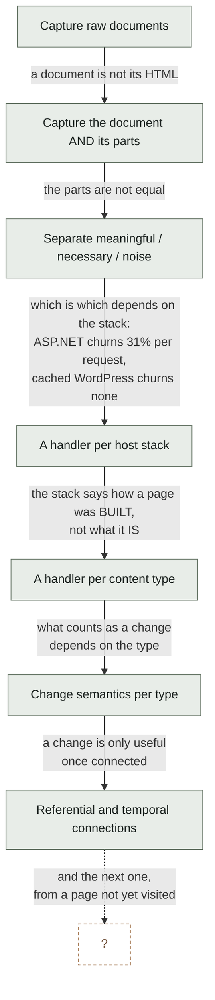
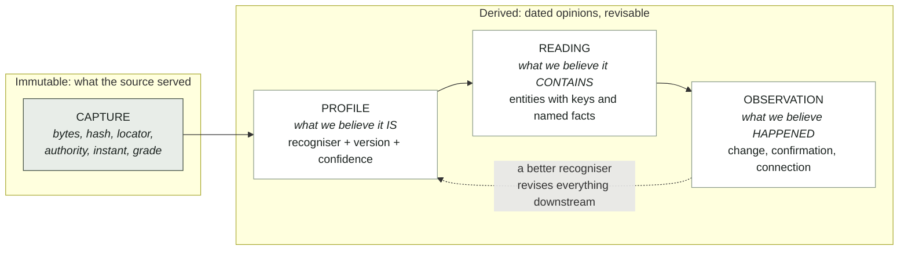
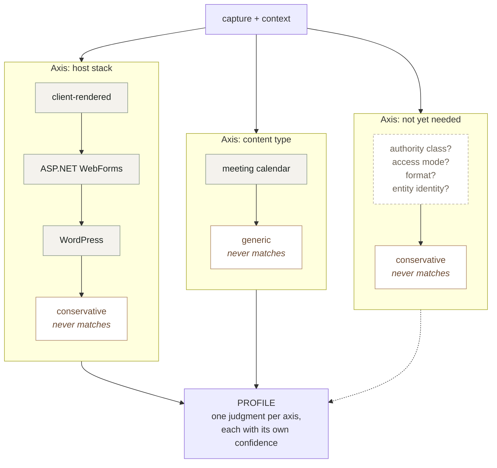
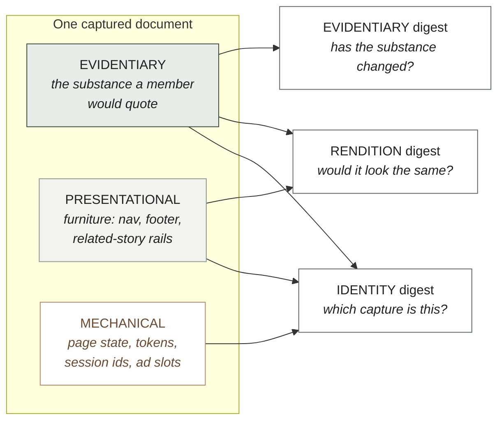
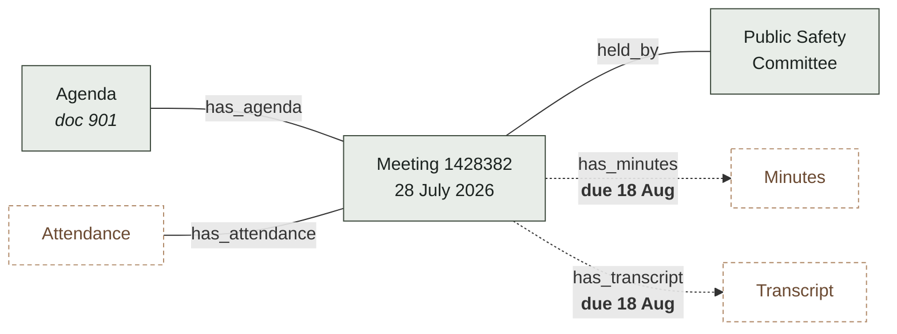
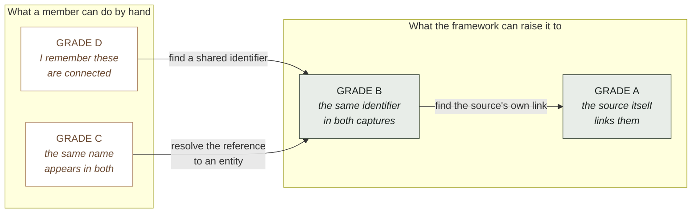
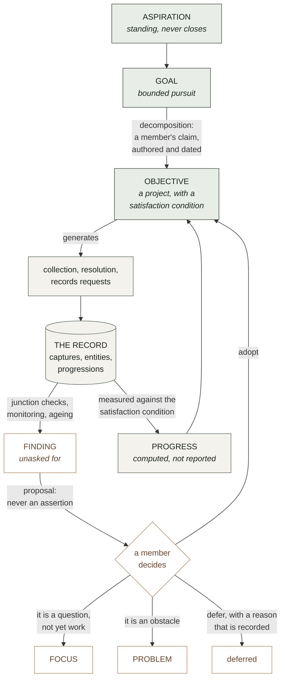
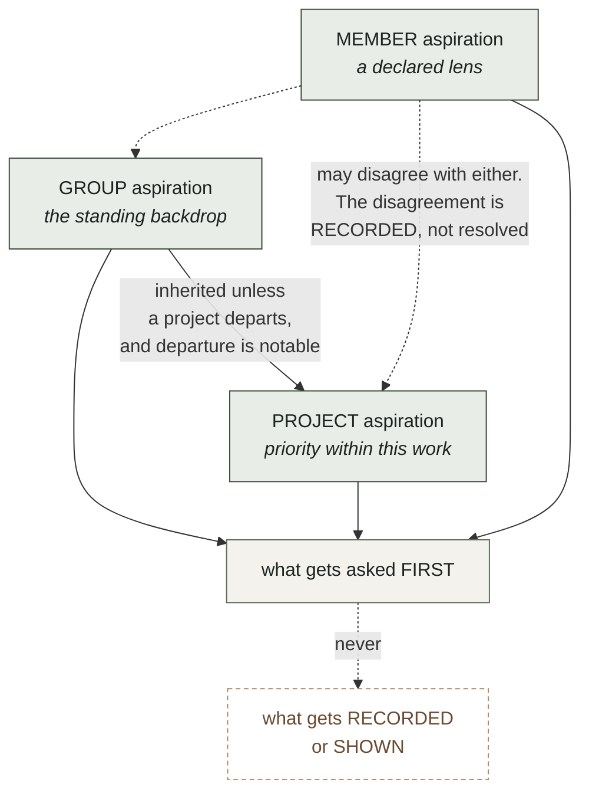

# BIO Content Framework

**Status** · The content framework, in two parts. **Part I (§§1–13)** — the extraction substrate: recognisers, regions and digests, change layers, content types, connections and their grade, progressions, identifier spaces, intent, declared bias, provenance of judgments — ARCHITECTURE APPROVED by Bob at v0.10 on 2026-07-30 and unchanged since. **Part II (§§14–19)** — content as the unit the record points at: role and model, the forms of content, the extraction process as built, organization and access, the central gap stated once, and who defers to this document — added 2026-09-15 as v0.11, rewritten for readability at v0.12 and **REVIEWED BY BOB on 2026-09-14** — his comments (fidelity rising through a person's act; an explicit link is not a hunch; the office and Google Drive formats named; an authored edge never re-pointed) are folded in at v0.12–v0.13, and he closed the review with "those are the only comments I have on Part II"; it rules nothing new of its own, and §18 names the six pieces still to be designed. The file keeps its `v0_10` name so `framework:LINE` citations in code and record resolve; **this front matter shifted every body line by the length of this block once, on 2026-09-14 — a citation written before that date points that many lines early; the fix is to cite the section (`CORPUS-STANDARD.md` §4.6)**. Part I complete and approved at its level; Part II a draft with an explicit frontier. as of 2026-09-14.

**Place in the system** · The single authoritative content design and the home of constructs 4, 5 and 6 of `BIO_System_Design.md` §3 (content — the heart of the system; document profile and the extraction substrate; meaning). `CONSTRUCTS.md` is the inventory and evidence beneath Part I; `docs/development/CONTENT-EXTENT-DESIGN-SPACE.md` is the design-space study for Part II §18's first piece; `STORE-AS-CACHE.md`'s three-axis and four-level tables are adopted in §14.2–14.3; `CLAUDE.md`'s content section points here; DEBT D-164 and INTERFACES I2 cite it. It does not own retrieval, the investigative session, the bias doctrine, the interface contracts, or any ruling.

**Incomplete sections** ·
- §14.5 — the AI EXTRACT role is designed as a role and absent as an item. **The content object is no longer absent: REC-82 landed it on 2026-09-14** as the `content` table (IC-83, I5 1.11.0), content-addressed by `hash(capture_sha, canonical extent, chain)`, with the WRITER on the `pdf-page` and `document` arms of the basis leg and `inquiry_basis.content_id` / `inquiry_basis_version_legs.content_id` arriving NULLABLE. What is still absent, and is what §18's first piece now names: the READS keyed by content row (REC-83), the frontmatter and version-leg grammar that lets a member NAME an extent (REC-84), and the `sheet-cell` / `slide-shape` / `doc-para` arms' `covers` (REC-85). `dom` is REFUSED BY NAME until CONTENT-HTML produces one. D-164 closes when those land.
- §16 — the closing table's ABSENT row: table and image extraction, the AI EXTRACT role, read-time re-extraction to tier 3 (D-319), the per-page tier-2 rule (D-283), the content-axis frontier.
- §18 — six pieces "named here, designed nowhere in this document": the content object and extent-carrying edge (D-164 — **DESIGNED 2026-09-14 in `CONTENT-EXTENT-DESIGN-SPACE.md` §6 under Bob's rulings §5.1–5.8, contracted as IC-83, and PARTLY BUILT: REC-82 landed the table and the writer on two arms; the reads, the grammar and the other three arms are REC-83..85**); content-grain search; the general observation log; extraction breadth; homes for the member's lead and firsthand observation (doctrine, Bob's); the claim object (doctrine, Bob's).
- §19 — two owners' acts remain rowed (CPDF-17): the schema comments that should cite Part II, and the stale self-descriptions in the plane and the type registry.
- §11 — seven declared bends; the first (documents that are not pages) has partly arrived with the non-text path and the OCR member, and Part I's text is frozen by design, so the bend is not updated in place.
- §1.1 — "entities that outlive documents" named as the primary missing capability; the entity axis is since built at document grain (Part II §15).
- §12.2 and §13.1 — "What is deliberately not modelled yet" and "What is missing" are self-marked; the claim object has been absent since v0.1.

**Contents**
  - [1. Why this document exists, and what it is FOR](#1-why-this-document-exists-and-what-it-is-for)
  - [1.1 What this is FOR: case development](#11-what-this-is-for-case-development)
    - [Two directions, and where they must meet](#two-directions-and-where-they-must-meet)
    - [The two success measures](#the-two-success-measures)
  - [2. Invariants](#2-invariants)
  - [3. The core objects](#3-the-core-objects)
  - [4. One extension shape: the RECOGNISER](#4-one-extension-shape-the-recogniser)
    - [The axes we know about](#the-axes-we-know-about)
  - [5. A document's anatomy: regions and digests](#5-a-documents-anatomy-regions-and-digests)
  - [6. Change: layers, and one entry point](#6-change-layers-and-one-entry-point)
  - [7. Content types: what a document contains, and what its changes mean](#7-content-types-what-a-document-contains-and-what-its-changes-mean)
  - [8. Connections: referential and temporal, as DATA](#8-connections-referential-and-temporal-as-data)
  - [8.1 Connection GRADE](#81-connection-grade)
    - [The connection table](#the-connection-table)
  - [9. The cost of absorbing the next surprise](#9-the-cost-of-absorbing-the-next-surprise)
  - [8.2 Progressions: the many shapes a happening takes](#82-progressions-the-many-shapes-a-happening-takes)
    - [The missing predecessor](#the-missing-predecessor)
    - [The progression table](#the-progression-table)
    - [Legitimate skips need an exception document](#legitimate-skips-need-an-exception-document)
    - [Junction checks](#junction-checks)
    - [Progressions are threaded by entities](#progressions-are-threaded-by-entities)
  - [8.3 Identifier spaces, and where grade collapses](#83-identifier-spaces-and-where-grade-collapses)
  - [9.1 The workload this is meant to remove](#91-the-workload-this-is-meant-to-remove)
  - [12. Intent: goals, objectives, aspirations, and the discovery loop](#12-intent-goals-objectives-aspirations-and-the-discovery-loop)
    - [Three things, and they behave differently](#three-things-and-they-behave-differently)
    - [This is not a new hierarchy](#this-is-not-a-new-hierarchy)
    - [Satisfaction conditions: the meeting point](#satisfaction-conditions-the-meeting-point)
    - [The discovery loop: "everything discovered along the way"](#the-discovery-loop-everything-discovered-along-the-way)
    - [An assistant may open a focus unattended](#an-assistant-may-open-a-focus-unattended)
  - [12.1 Aspirations are scoped](#121-aspirations-are-scoped)
  - [12.2 The pursuit record](#122-the-pursuit-record)
    - [What is deliberately not modelled yet](#what-is-deliberately-not-modelled-yet)
  - [13. Declared bias, and where it meets this framework](#13-declared-bias-and-where-it-meets-this-framework)
    - [The subject registry and the entity axis are the same construct](#the-subject-registry-and-the-entity-axis-are-the-same-construct)
    - [An assistant working unattended works under a lens](#an-assistant-working-unattended-works-under-a-lens)
    - [Bias debt and the ageing machinery are the same shape](#bias-debt-and-the-ageing-machinery-are-the-same-shape)
  - [13.1 Evidence accrues to bias statements](#131-evidence-accrues-to-bias-statements)
    - [The inverse of bias debt](#the-inverse-of-bias-debt)
    - [A statement may carry a measurable form](#a-statement-may-carry-a-measurable-form)
    - [Decay is loud and never blocking](#decay-is-loud-and-never-blocking)
    - [This is the legitimate form of what a verdict would be](#this-is-the-legitimate-form-of-what-a-verdict-would-be)
    - [And it settles the monitoring question](#and-it-settles-the-monitoring-question)
    - [Where bias enters this framework's own judgments](#where-bias-enters-this-frameworks-own-judgments)
    - [What is missing](#what-is-missing)
  - [10. Provenance of judgments, so learning can revise](#10-provenance-of-judgments-so-learning-can-revise)
  - [11. Where this framework will bend](#11-where-this-framework-will-bend)
- [PART II · CONTENT AS THE UNIT](#part-ii-content-as-the-unit)
  - [14. What content is, and how the record models it](#14-what-content-is-and-how-the-record-models-it)
    - [14.1 The definition](#141-the-definition)
    - [14.2 The model](#142-the-model)
    - [14.3 The three axes and the four-level search](#143-the-three-axes-and-the-four-level-search)
    - [14.4 Who may do what](#144-who-may-do-what)
    - [14.5 Where it stands](#145-where-it-stands)
  - [15. The forms content takes today](#15-the-forms-content-takes-today)
  - [16. How content is extracted today](#16-how-content-is-extracted-today)
  - [17. How content is organized and reached](#17-how-content-is-organized-and-reached)
  - [18. The central gap, and the six pieces to design](#18-the-central-gap-and-the-six-pieces-to-design)
  - [19. Where this document is the authority, and who defers to it](#19-where-this-document-is-the-authority-and-who-defers-to-it)
  - [Appendix A · The evidence, as measured at `origin/main` `51d128a`](#appendix-a-the-evidence-as-measured-at-originmain-51d128a)
    - [A.1 The rulings](#a1-the-rulings)
    - [A.2 The forms (§15), by file](#a2-the-forms-15-by-file)
    - [A.3 The extraction path (§16), by file](#a3-the-extraction-path-16-by-file)
    - [A.4 Organization and access (§17), by file](#a4-organization-and-access-17-by-file)

---

**Version 0.13 — 2026-09-14 — Part I (§§1–13) ARCHITECTURE APPROVED by Bob at v0.10 and unchanged line for line; Part II (§§14–19 and Appendix A) the content design, REVIEWED by Bob on 2026-09-14 with his comments folded in. The file keeps its `v0_10` name; citations into it name the section.**

Status: this is the framework document Bob called for after observing that the
development work had diffused across many elements at once. It supersedes nothing
yet; `docs/architecture/CONSTRUCTS.md` is the inventory and the evidence behind it,
and this is the shape those constructs should take.

Diagrams are Mermaid, which renders in GitHub and most Markdown viewers, and which
stays as text so it diffs like the rest of the document. All six were validated
against the Mermaid parser itself rather than eyeballed, since a diagram that fails
to render is worse than no diagram: it leaves a block of syntax where an explanation
should be.

Changelog:
- v0.13, 2026-09-14. Bob reviewed Part II and closed the review. Folded: a person's reading is
  the route fidelity rises (§14.2); an explicit link or textual reference is an earned
  connection, not a hunch (§14.4); the office formats named and Google Drive stated (§16);
  RULED: an authored edge is never re-pointed to a newer capture without a member's act
  (§14.4, §18); RULED: a link to a Google Drive file keeps the link and the harvest is the
  OpenDocument export, from which content is extracted (§16).
- v0.12, 2026-09-14. Bob: Part II "appears to be a changelog. It's not readable nor
  informative." Rewritten as a design document: each section states the design first in
  plain language, the status marks sit in one table per section, the content model gains a
  UML class diagram, and every file-and-line citation moves to Appendix A. No assertion
  changed; the v0.11 changelog paragraph that opened Part II is folded here.
- v0.11, 2026-09-15. Adds Part II (§§14–19), the content doctrine ruled between 2026-08-03
  and 2026-09-14 (DEC-23, DEC-24, DEC-4 as amended, D-164) and the extraction path as built,
  folded into this document so it is the single authoritative content design. Part I
  unchanged line for line. DRAFT awaiting Bob's review.
- v0.10, 2026-07-30. Bob settled the open question by pointing at the principle already
  written: the measure never edits the statement. A measure that may not edit a
  statement certainly may not BLOCK work resting on it, so decay is loud and never
  blocking. Generalised into invariant 9, since the same line runs through assistant
  proposals, connection grades and recogniser confidence: derived things inform,
  authored acts bind.
- v0.9, 2026-07-30. Bob reframed an open question into a better one: a side-effect of
  this framework's work should be that evidentiary comments accrue to bias records,
  measuring the extent to which a bias is JUSTIFIED. §13.1 works that through. It is the
  inverse of bias debt, it makes a `pattern` statement a standing claim the record
  continuously tests, it reuses §12's satisfaction condition as the statement's
  measurable form, and it resolves v0.8's open question about monitoring and bias by
  removing the coupling rather than documenting it.
- v0.8, 2026-07-30. Bob observed that the declared bias construct was missing from this
  framework. It was, and worse: v0.6 and v0.7 cited it twice in support of a claim that
  reading it does not sustain. §12.1 is CORRECTED — a member-scoped aspiration is not a
  declared bias — and §13 integrates the doctrine properly. The load-bearing finding is
  that the doctrine's SUBJECT REGISTRY and this framework's entity axis are the same
  construct arriving from two directions, and building them separately would repeat
  exactly the error CONSTRUCTS.md exists to prevent.
- v0.7, 2026-07-30. Bob ruled that contradicting aspirations are WELCOMED, for two
  reasons that change the design rather than soften it: we may not realise that they
  contradict, and we learn from trying to achieve aspirations whether they are achieved
  or not. §12.1 is rewritten accordingly — the absence of an arbiter is now a
  deliberate position rather than an unfinished mechanism, what the system looks for is
  CONTACT between aspirations rather than semantic contradiction it cannot establish,
  and §12.2 adds the pursuit record, since learning that survives an unachieved
  aspiration has to live somewhere. Also ruled: an assistant-surfaced focus must LOOK
  like one.
- v0.6, 2026-07-30. Two rulings from Bob. An ASSISTANT MAY OPEN A FOCUS unattended,
  because that level of support is central to what BIO should offer and because a focus
  is informative and advisory rather than committing; §12 now says so, with the volume
  and ageing rules that unattended surfacing requires, and records that the check
  catalogue already permits `surfaced_by: agent` while both writers hardcode `human`.
  And an ASPIRATION IS SCOPED to the group, a project, or a member; §12.1 works through
  what each scope means, why conflicts between scopes are information rather than
  errors, and why a member-scoped aspiration is a declared lens in the sense
  `BIO_Declared_Bias_v0_1.md` already means.
- v0.5, 2026-07-30. Bob added the top of the model: the system must support humans and
  their AI assistants defining goals at a high level, turning them into objectives and
  aspirations, and working to achieve them AND everything discovered along the way.
  Adds §1.2, the two directions that must meet; §12, intent, which deliberately maps
  onto the existing focus / problem / project / action catalogue rather than inventing
  a parallel hierarchy, and which makes an objective's SATISFACTION CONDITION
  expressible in this framework's own vocabulary so that progress is computed from the
  record instead of asserted by whoever is doing the work; the discovery loop, by
  which a finding becomes a proposal and a member's adoption makes it an objective;
  and invariant 8, which is the guard against goal-directed work quietly becoming
  goal-directed collection.
- v0.4, 2026-07-30. Bob generalised the meeting chain: scheduled meeting to agenda to
  minutes is ONE form of connected data, and the system must be ready for many types
  of happenings and progressions, his example being need, budget request, budget
  approval, RFP, responses, award, signed contract. Adds §8.2, progressions as data,
  which generalises the connection table rather than sitting beside it; introduces the
  MISSING PREDECESSOR as a finding distinct from and often sharper than a missing
  successor; adds cardinality, exception documents, and junction checks; and adds §8.3
  on identifier spaces, since a progression that crosses source systems is where
  connection grade collapses and where the framework has to work hardest.
- v0.3, 2026-07-30. Bob approved the architecture and restated BIO's purpose:
  supporting members in ALL aspects of case development. That exposed a gap, since
  every object in v0.2 was about documents and none was about cases. Adds §1.1 stating
  the purpose and the two success measures; promotes ENTITY to a core object in §3;
  adds §8.1, connection GRADE, on the model of capture grade, because Bob's phrase
  "improve the grade of connections" is the right one and grade already means
  something precise here; adds §9.1, the workload the framework is meant to remove;
  and moves entities-across-documents in §11 from "where this will bend" to the
  planned third axis. Ruling recorded: the upfront work is the full §4, not a
  deduplication.
- v0.2, 2026-07-30. Six diagrams added where a diagram carries what prose was
  labouring at: the evolution of the goal, the four core objects, the recogniser and
  registry shape that is the extensibility claim, regions against digests, the change
  cascade and its exits, and the two connection kinds over Bob's own meeting example.
  No change to the framework itself.
- v0.1, 2026-07-30. First draft. Pulls together the constructs discovered between
  0.36.0 and the 2026-07-30 UI sessions: document regions, three digests, host-stack
  handlers, content types, the layered change pipeline, monitoring contracts, and
  referential and temporal connections. Written to be extended rather than to be
  complete.

---

## 1. Why this document exists, and what it is FOR

The goal has moved six times in a few days, and every move was forced by something a
real page did rather than by a decision anyone made:

| We thought the job was | Then a page taught us |
| --- | --- |
| capture raw documents | a document is not its HTML: it needs its stylesheets and images to be the document the source served |
| capture a document and its parts | the parts are not equal. Some are meaningful, some are necessary for rendering, some are noise |
| separate meaningful from necessary from noise | which is which depends on the HOST STACK. ASP.NET churns 31% of its bytes per request; cached WordPress churns none |
| write a handler per host stack | the stack tells you how a page is BUILT, not what it IS. Change management needs to know it is looking at a calendar and not an article |
| write a handler per content type | what counts as a change depends on the type, and a calendar's window moves on its own |
| recognise change | change is only useful when connected: to related content, and to other moments in time |

That is not a story about six mistakes. It is a story about a domain that reveals
itself only on contact, and it is nowhere near finished. Sites yet unvisited will
have stacks, structures, content types and failure modes not listed anywhere below.

**So the measure of this framework is not coverage. It is the cost of absorbing the
next surprise.** Section 9 states that cost explicitly for each kind of new thing,
and that table is the framework's actual specification. Everything else exists to
keep those numbers small.

## 1.1 What this is FOR: case development

RULED by Bob, 2026-07-30. **BIO exists to support members in all aspects of case
development.** Every construct in this document is instrumental to that and none is
an end in itself. A capture nobody can build a case on is waste, however faithfully
it was hashed.

That has a consequence v0.2 missed. Every object in this framework was about
documents — capture, profile, reading, observation — and none was about the thing a
member is actually assembling. The framework described the machinery and not its
purpose, which is why entities and claims kept appearing in §11 as things that would
one day strain it. They are not strains. They are the top of the model and it was
missing.

### Two directions, and where they must meet

Everything from §2 to §11 runs BOTTOM UP: bytes become a capture, a capture gets a
profile, a profile permits a reading, readings resolve to entities, entities thread
progressions, and junctions produce findings. That direction is driven by what the
sources happen to publish.

A member does not work that way. A member starts from something they want to be true
about their city and works DOWN: a goal becomes objectives, objectives become
collection and analysis, and the analysis is supposed to answer the question they
started with.

Both are necessary and neither subsumes the other. A purely bottom-up system produces
a beautifully graded pile nobody asked for. A purely top-down system collects only
what confirms the plan, which is worse. **§12 is about where they meet**, and the
meeting point is specific rather than philosophical: an objective states what would
satisfy it IN THIS FRAMEWORK'S OWN TERMS, so progress is computed from the record
rather than asserted by whoever is doing the work.

### The two success measures

Also Bob's, and they are measurable rather than aspirational:

**1. Raise the GRADE of connections.** Connecting entities across documents is
ordinarily manual, and manual work of this kind is not merely slow: it is done from
memory and left incomplete, which means a case rests on connections a member believes
rather than connections the record can demonstrate. §8.1 grades them, and BIO's
contribution is converting connections a member would have asserted from knowledge
into connections the source itself asserted and the record holds both ends of.

**2. Reduce members' workload.** Named concretely in §9.1, because a framework that
cannot say which work it removes cannot be held to removing any.

These two pull in the same direction and that is not a coincidence: the work that is
most tedious for a member is exactly the work of chasing identifiers between
documents, and that is the work a machine can do at a higher grade than a person
reading by hand.

## 2. Invariants

The short list of things that have not changed across all six shifts and should not
change in the next six. A proposal that violates one of these is wrong, not novel.

1. **Raw bytes are never rewritten.** A capture's identity is the hash of exactly
   what the source served. Every classification, normalisation and judgment happens
   on copies and derived values.
2. **A classification is reversible and reclassifiable.** Chrome detection, volatile
   regions, document boundaries, content types: all are judgments with a basis and a
   date, never deletions.
3. **The failure asymmetry governs every default.** Reporting a change that did not
   happen costs a member attention. Failing to report one that did puts a false
   claim in the record, discovered — if ever — by the party the claim is aimed at.
   When uncertain, be noisy.
4. **A rule requires a measurement.** No pattern, region, type or expectation is
   written from what a document probably looks like. The comment above a rule names
   the page it was measured on.
5. **Uncertainty is carried, not resolved.** Every judgment records how sure it was
   and on what signal. Confidence below the bar changes the ANSWER, not just a log
   line.
6. **Technical complications are the system's problem.** The audience is
   non-technical and the workflow exists to remove them from logistics. A surface
   that asks a member to arbitrate a subrequest ceiling or a viewstate diff has
   failed, and it will feel like honesty while doing so.
7. **Goal-directed work must not become goal-directed collection.** A goal may
   direct what is SOUGHT. It must never filter what is recorded, retained, or shown
   about what was found, and a finding that cuts against a goal is surfaced at least
   as prominently as one that supports it. This is the invariant that keeps a case
   from becoming a brief, and it is the one most likely to be violated by accident,
   because helpfulness looks exactly like it from the inside. See
   `BIO_Declared_Bias_v0_1.md`: the honest system makes the lens part of the record
   rather than pretending to be lensless.
8. **Derived things inform; authored acts bind.** A measure, a grade, a confidence, an
   assistant's proposal: all of these report and none of them decides. What blocks a
   state transition, commits the group, or changes doctrine is always a member's
   authored act. The rule is not deference for its own sake — it is that a derived
   value is a description of the world, and the world does not get a vote on what a
   group is willing to assert.
9. **The negative result is a finding.** "Nothing changed" is dated first-party
   evidence, not the absence of news, and it must be stored rather than discarded.

## 3. The core objects

Only four, and every construct in the inventory is a property of one of them or a
function between them.

**CAPTURE.** Bytes, a hash, a locator, an authority, an instant, a grade. Immutable.
The thing the record holds.

**PROFILE.** What we believe a capture IS. Produced by recognisers (§4), recorded ON
the capture, versioned and confidence-bearing so that a later, better recogniser can
find and revise every judgment made by a worse one. A profile is not a fact about the
document; it is a dated opinion about it, and must be stored as such.

**READING.** What we believe a capture CONTAINS: entities with stable keys and named
facts, plus document-level facts such as a calendar's visible window. Produced by a
content type. Derived, cheap to recompute, never authoritative over the bytes.

**ENTITY.** A thing the case is about, which OUTLIVES any document that mentions it:
a person, a body, an ordinance, a parcel, a contract, a fund. Entities are what make a
case a case rather than a pile of captures. An entity has an identity, one or more
REFERENCES in readings that resolve to it, and a resolution confidence per reference
(§8.1). Crucially an entity is not extracted from a document; it is RESOLVED across
documents, and the resolution is a judgment with a grade like any other.

**OBSERVATION.** What we believe happened, between two captures or at one moment. A
change, a confirmation, or a connection. Always dated, always attributed to the
recogniser and reading that produced it.

The pipeline is just: capture → profile → reading → observation, with entities
resolved ACROSS readings and connections drawn between entities and documents. The
dashed edge is section 10 and it is what makes the framework safe to be wrong.

A **CASE** is then a selected, ordered set of entities, observations and connections
with a claim attached. Nothing in this document models a claim yet, and the
case-building rungs will need one; what matters here is that the objects a case is
built FROM are all present and graded.

## 4. One extension shape: the RECOGNISER

The inventory's worst finding was that we invented two confidence ladders, two diff
functions and three entry points in a day, because each new axis grew its own
apparatus. The fix is that every axis uses the same shape.

A **recogniser** answers one question about a capture and declares how sure it is:

    detect(ctx) -> { match, confidence, signals[] }
    version                      // so a judgment can be found when the rule improves
    key, label                   // machine name, and words for a member

One confidence ladder for all axes: `certain` (a signal only this thing produces),
`likely` (consistent but not conclusive), `possible`, `none`. **Confidence below
`certain` changes the answer**, per invariant 5: a recogniser that is merely likely
declines to narrow, and the conservative default applies.

A **recogniser registry** holds recognisers for one axis, ordered, most specific
first, first `certain` wins, with a fallback that never matches and is reached only
by falling through. The fallback is always the conservative one.

That is the whole extension mechanism. Adding a handler, a content type, or a member
of an axis nobody has thought of yet is the same act: write a recogniser, register
it.

Every box in every registry has the same interface. That is the whole claim: a third
axis is a third column, not a rewrite.

### The axes we know about

| Axis | Question | Registry | Members today |
| --- | --- | --- | --- |
| **stack** | how was this built? | `stacks` | client-rendered, ASP.NET WebForms, WordPress, conservative |
| **content type** | what is this? | `types` | meeting calendar, generic |

Two axes, and the framework treats "which axes exist" as itself extensible: a third
axis is a third registry of the same shape. Candidates already visible: **authority
class** (is this the issuing body's own publication or a mirror?), **access mode**
(public, paywalled, login-walled, rate-limited), **format** (HTML, PDF, dataset,
scanned image needing OCR).

## 5. A document's anatomy: regions and digests

**Three region kinds**, and the middle one is what a flat "volatile vs stable" model
kept getting wrong:

- **evidentiary** — the substance. What a member would quote or put before a council.
- **presentational** — furniture. Really on the page, captured and rendered, and not
  the document's claim about its own subject.
- **mechanical** — per-render machinery. Page state, security tokens, session ids,
  cache stamps, ad and analytics slots.

A stack recogniser declares regions in one of two shapes, and the second is
preferred:

- **pattern rules**, listing what to discount. Anything unlisted silently counts as
  substance.
- **a boundary**, naming the document itself. Anything outside it is furniture in one
  stroke, and a theme change cannot quietly reclassify substance. A boundary that
  does not match normalises NOTHING and records that it missed.

**Three digests**, because "would it look the same" and "has the substance changed"
are different questions and one hash cannot answer both:

| Digest | Normalises | Answers |
| --- | --- | --- |
| identity | nothing | which capture is this? |
| rendition | mechanical | would it look the same? |
| evidentiary | mechanical + presentational | has the substance changed? |

Measured: on `oakland.legistar.com/Calendar.aspx` the mechanical region is 115,980
bytes, 31.4% of the document, and the identity digest moves on every single fetch
because of it while the evidentiary digest does not move at all.

**Fidelity** is the claim the record can make about showing a capture: `faithful`,
`degraded` (only decoration missing, named on screen not hidden), `insufficient`
(render-critical missing, render refused). Which parts are render-critical is the
stack recogniser's judgment; under the conservative fallback all of them are.

## 6. Change: layers, and one entry point

Recognising change is layered, each layer cheap relative to the next and able to
settle the question. **One public function** — `assess(before, after, ctx)` — and
every result carries a trail recording where reasoning stopped, because a verdict
whose depth is invisible cannot be audited.

| Layer | Question | Settles when |
| --- | --- | --- |
| L1 | which stack? | never; nothing below is trustworthy without it |
| L2 | anything different at all? | identical bytes → a CONFIRMATION |
| L3 | is the difference noteworthy? | only mechanical, or only presentational, moved |
| L4 | what type of content? | never; selects who answers L5 |
| L5 | is the change meaningful for that type? | usually |
| L6 | what does it connect to? | terminal |

Most checks on a monitored source exit at L2 or L3, and every one of those exits
produces a confirmation rather than a shrug.

L2 is not a fast path. It is the layer that produces most of the system's evidence,
because on a monitored source most checks find nothing and invariant 7 says that is
a finding.

**Outcomes** are graded once and the boolean derived, never carried twice:

- `event` — a member should look.
- `notice` — recorded, shown on request.
- `routine` — the source doing its normal business.

Event types come from a **shared catalogue**, not from strings invented inside each
content type. The check catalogue already taught the plane this lesson; the second
content type would otherwise reinvent `removed` under a different name.

**Monitoring contract** is a property a content type declares, not a function of the
stack: `substance` for a record, `membership` for a list, `unmonitorable` for a shell
whose delivered bytes are stable and whose content is absent. Contract also sets the
expected check frequency, because a delisting is time-sensitive and a regulation is
not.

## 7. Content types: what a document contains, and what its changes mean

A content type is a recogniser (§4) plus three functions:

    parse(ctx)        -> reading: entities[] + document facts
    assess(a, b, ctx) -> observations: events[] + confirmation
    connections(a, b) -> connections[]

**Entities** carry a `key` that must be stable across fetches — an id in a URL is a
key, a position in a list is not — a `kind`, a `label` for a member, and named
`facts`. Named facts are what let an observation say WHICH thing moved rather than
that the entity differs, and they are why a diff should exist once.

**A reading that finds nothing is a failed reader, never an emptied document.** This
has already nearly produced a mass-delisting report and is the single most dangerous
error available to this layer.

**Document facts can make an absence expected.** A calendar's visible window is
relative to now, measured: "This Month". A meeting that scrolled out of range is not
a delisting, and no amount of care about bytes or regions can tell those apart,
because the distinction is about what a calendar IS.

## 8. Connections: referential and temporal, as DATA

Two kinds, not one, because people and their assistants reason about them
differently and the UI must show them apart:

**Referential** — two things are ABOUT each other. Followed to understand SCOPE.

**Temporal** — one thing happened after another and the sequence matters. Strictly
directional, followed to understand a STORY. Its most valuable form is an **absence
with a due date**: minutes that have not appeared three weeks after a meeting are a
fact about the body, not a gap in the record.

Bob's own example, drawn. Solid edges are referential and answer "what is this part
of"; dashed edges are temporal and answer "what should have happened by now".

The two dashed edges pointing at documents the record does not hold are the framework
at its most useful: not a gap in the record, but a dated fact about the body.

## 8.1 Connection GRADE

Bob's phrase was "improve the grade of connections overall", and grade already means
something exact in this system: a capture's grade states how its provenance was
established, not how much anyone likes it. A connection deserves the same treatment,
because a case is only as strong as the weakest link a member is relying on and today
nothing tells them which link that is.

Grade states **how the connection was established**, and nothing else:

| Grade | Established by | Example |
| --- | --- | --- |
| **A** | the SOURCE's own identifier, with both ends captured and hashed | `MeetingDetail.aspx?ID=1428382` links to `View.ashx?M=M&ID=801`: the publisher says these belong together and the record holds both |
| **B** | an identifier the source uses, matched exactly in captured content at both ends | an agenda item naming "Ordinance 13579" and a captured ordinance whose own number is 13579 |
| **C** | correspondence rather than identity: a name, a title, a date proximity | "Sheng Thao" in two documents. Plausible, never presented as established, and flagged for a member to confirm |
| **D** | asserted with no captured basis | a member's own knowledge, or a source that no longer serves the page. Recorded as testimony, with an author and a date |

Two things this is NOT. Grade is not credibility: a Grade D connection from a member
who was in the room may be the most valuable thing in a case, and it is labelled by
its author rather than discounted. And grade is not the same as `asserted_by`: the
author says who claims it, the grade says what would be needed to check it. A case
file shows both.

**The whole point is that grade is improvable.** A member's Grade C hunch that two
documents concern the same contract becomes Grade B the moment the system finds the
contract number in both, and Grade A if the source links them itself. Raising grade
is work a machine does well and a person does slowly, and it is the clearest thing
this framework can offer a case.

Entity resolution is therefore the grading mechanism for referential connections, and
that is why it is the planned third axis rather than a future concern: matching a
reference to an entity by a source-assigned identifier produces Grade A or B, while
matching by name produces Grade C, and the difference is the whole value.

### The connection table

Bob's requirement: a table mapping the connections to look for between content, used
by tasks actively looking for connections, and viewable and editable through a UI
surface. It is DATA in the record, not cases in a `switch`.

    from_kind    to_kind      relation                connection   timing
    meeting      agenda       has_agenda              referential  before the meeting
    meeting      attendees    has_attendance          referential  after
    meeting      minutes      has_minutes             temporal     after, within N days
    meeting      transcript   has_transcript          temporal     after, within N days
    meeting      body         held_by                 referential  —
    agenda_item  regulation   proposes_amendment_to   referential  —
    person       body         serves_on               referential  —

Three things the table forces, all of them decisions rather than code:

1. **`asserted_by` needs three values, not one.** `links_to` today means the SOURCE
   said so. A connection this table implies is asserted by the SYSTEM on a rule a
   member can edit. A member can also assert one directly. Three authors, three
   evidentiary weights.
2. **Rule and instance are different objects.** "Minutes follow a meeting within N
   days" is a row in this table. "The minutes for meeting 1428383 were due 8/18 and
   have not appeared" is an instance that has come due. The table holds rules;
   something else ages instances.
3. **A rule a member edits is a claim the group is making** about how its
   institutions ought to behave, and it belongs in the record with an author and a
   date like any other claim.

## 9. The cost of absorbing the next surprise

**This table is the framework's specification.** Every design choice above exists to
keep these numbers small, and a proposal that raises one of them needs to justify
itself.

| A new… | Should cost | Why that is achievable |
| --- | --- | --- |
| host stack | one recogniser file, one registry line | regions and digests are stack-independent |
| content type | one recogniser file, one registry line | the change pipeline and the event catalogue are type-independent |
| connection kind to look for | **one row of data**, no code | §8 makes the table data |
| region rule for a known stack | one entry in that stack's rule list | rules are declarative |
| event type | one entry in the shared catalogue | significance is graded centrally |
| **axis of variation** | one registry of the recogniser shape | §4 makes registries uniform |
| **invariant** | a framework revision | invariants are the thing that should be expensive |

The last two rows are the ones history says will actually be exercised. Six axes
appeared in a few days. The seventh should cost a registry, not a rewrite.

## 8.2 Progressions: the many shapes a happening takes

RULED by Bob, 2026-07-30. The meeting chain — scheduled meeting, agenda, attendance,
minutes — is ONE form of connected data and not the general case. His example of
another: a mention of a need, a budget request, a budget approval, an RFP, responses
to it, a contract award, a signed contract with terms, and onward through amendments
and payments. The system must be ready for many types of happenings and progressions.

The two differ in almost every dimension, which is what makes the generalisation
worth making rather than assuming:

| | meeting chain | procurement chain |
| --- | --- | --- |
| span | days | months to years |
| bodies | one | department, council, contractor |
| source systems | one | often three or four |
| stages | 3 to 4 | 8 to 12 |
| shape | linear | branching, with one-to-many and legitimate skips |
| what is usually missing | the SUCCESSOR: minutes not yet posted | the PREDECESSOR: an award with no solicitation |

That last row is the important one and it is a new construct.

### The missing predecessor

A temporal connection so far has meant an expected successor: minutes are due after a
meeting. Bob's example inverts it. A signed contract implies an award; an award
implies a solicitation or a documented reason there was none; a budget approval
implies a request. **When a later stage exists and an earlier one does not, that is a
finding, and it is usually sharper than a missing successor**, because late minutes
are an administrative lapse while an award with no solicitation is a question about
how public money was committed.

It is also epistemically stronger. A missing successor might simply not have happened
yet; the absence is provisional. A missing predecessor is an absence in the past,
where the document either exists somewhere or does not exist at all, and either answer
is worth having. The first is a records request; the second is the case.

### The progression table

A generalisation of the connection table in §8.3, not a second table beside it. A
connection row is a progression of two stages; nothing needs both.

    progression: procurement
    stage  key            typical content        after      cardinality  within    required
    1      need           staff report           —          0..n         —         sometimes
    2      budget_request budget document        need        0..n         —         usually
    3      budget_approval council action        request     1            1 year    always
    4      solicitation   RFP / RFQ / IFB        approval    0..1         —         unless exception
    5      responses      bid list / proposals   solicitation 0..n        by due date usually
    6      recommendation staff report           responses   0..1         —         usually
    7      award          council resolution     recommendation 1         —         always
    8      contract       signed agreement       award        1           90 days   always
    9      amendment      change order           contract     0..n        —         never

Each row carries what the rules need and nothing more:

- **after** — the stage this one presupposes. Read forwards it predicts; read
  backwards it accuses.
- **cardinality** — `1`, `0..1`, `0..n`. An RFP has many responses; an award has one
  contract. Cardinality is where several of the sharpest questions live.
- **within** — the interval that makes an absence overdue rather than pending.
- **required** — `always`, `usually`, `sometimes`, `never`, and the crucial
  `unless exception`.

### Legitimate skips need an exception document

A sole-source award skips the solicitation stage lawfully, and the thing that makes it
lawful is a justification the institution is supposed to publish. So a skipped stage
is not automatically a finding: **a skipped stage with no exception document is.** The
table records which document discharges which skip, and the framework's question
becomes not "why is this missing" but "where is the document that says it may be
missing", which is a question with a records-request answer.

### Junction checks

A progression's value is concentrated at its junctions, and these are the questions a
member is trying to answer anyway:

- an **award with no solicitation** and no exception document
- a solicitation with **exactly one response**, which is lawful and interesting
- a **signed amount that differs from the awarded amount**
- **amendments accumulating** past a threshold of the original
- **payments past the contract term**
- a **budget approval with no traceable request**

Junction checks are rules over a progression instance, they are DATA like the table,
and they are the point at which this framework stops describing documents and starts
supporting a case.

### Progressions are threaded by entities

An instance of a progression is assembled by following an entity: a contract number, a
project identifier, a parcel, a fund. That is why the entity axis is Step 4 and the
progression table is Step 5 and not the other way round. It also means a progression
instance inherits the WEAKEST connection grade along its chain, and a case built on it
should say so, because a nine-stage chain assembled by name correspondence is not
evidence of anything.

## 8.3 Identifier spaces, and where grade collapses

A progression that stays inside one system can reach Grade A, because that system
assigns identifiers and links its own stages: Legistar does this for legislation. A
progression that crosses systems usually cannot, because a procurement portal, a
finance system and a legislative record each maintain their own identifier space and
none of them links to the others.

This is where connection grade collapses to C, and it is where the framework has to
work hardest, because it is also where the most consequential progressions live.

The lever is that institutions DO reuse certain identifiers across their systems, and
finding which ones is empirical work exactly like measuring a stack:

- a contract or purchase order number
- a project or capital improvement number
- a resolution or ordinance number
- an APN for a parcel
- a fund or account code

Each such identifier, once found in two systems, converts an entire progression from
Grade C to Grade B. **Discovering an institution's shared identifiers is therefore one
of the highest-value pieces of measurement this project can do**, and it should be
recorded per institution the way stack measurements are recorded per host. Oakland's
shared identifiers have not been measured.

## 9.1 The workload this is meant to remove

Stated concretely, because a framework that cannot name the work it removes cannot be
held to removing any. Each row is work a member does today, by hand, from memory, and
usually incompletely.

| Work a member does by hand | What the framework does instead | Status |
| --- | --- | --- |
| finding the other documents that concern this person, body, ordinance or fund | resolve references to entities and hold the reverse index | needs the entity axis |
| assembling a procurement or legislative chain from end to end | progression instances threaded by an entity | needs the entity axis and the progression table |
| noticing that a stage of such a chain was skipped without justification | missing-predecessor findings and exception documents | designed, not built |
| noticing that a document which should exist does not | temporal connections with a due date | emitted, nothing ages them |
| keeping a timeline of what happened when | observations are dated by construction | partly; nothing assembles them |
| re-checking whether a source still says what it said | layered change assessment plus stored confirmations | built, plane has not adopted it |
| noticing a document quietly delisted or swapped | membership monitoring and the replaced/withdrawn events | built, plane has not adopted it |
| judging whether a capture can be shown as evidence | fidelity levels | built |
| judging whether two versions of a page differ meaningfully | three digests and the change layers | built |

Read down the status column and the priority is not a matter of taste: almost
everything is built and unadopted, and the one genuinely missing capability is the
entity axis, which is also the one carrying both success measures.

## 12. Intent: goals, objectives, aspirations, and the discovery loop

RULED by Bob, 2026-07-30. The system must support humans and their AI assistants
defining goals at a high level, turning them into objectives and aspirations, and
working to achieve the goals **and everything discovered along the way**.

### Three things, and they behave differently

| | closes? | what it does | example |
| --- | --- | --- | --- |
| **Aspiration** | never | sets standing priority and shapes judgment | "Oakland's procurement should be traceable end to end" |
| **Goal** | eventually, maybe in years | bounds a pursuit | "Account for the sewer fund transfers, FY2019 to FY2026" |
| **Objective** | yes, checkably | states a condition the record can be measured against | "Hold a Grade B or better progression instance for every contract over $250k drawn on fund 3100 since FY2019" |

Conflating these is the ordinary failure. An aspiration written as an objective is
never finished and demoralises; an objective written as an aspiration is never
checked and quietly abandons itself.

### This is not a new hierarchy

The record already has the object types this needs, and the framework's job is to
CONNECT to them rather than to invent a parallel set:

- an **objective** is what a `project` carries; the catalogue already gives a project
  an `objective` field and the states `forming → investigating → matured → closed`
- an open question is a `focus`, with `surfaced → elevated → deferred → dismissed`
- a discovered obstacle is a `problem`, with the same states
- a step someone takes is an `action`, with `planned → active → awaiting_response →
  resolved → abandoned`

**Aspiration and goal are the two that do not exist yet.** Everything below them does.
That is the honest summary of the gap: this framework was written for six sections
without ever touching the catalogue that already models intent, and the connection has
to be made in both directions.

### Satisfaction conditions: the meeting point

This is the load-bearing idea of the section. **An objective states what would satisfy
it in the vocabulary of this framework**, which makes progress computable:

    objective: every contract over $250k on fund 3100 since FY2019
               is held as a progression instance at Grade B or better
    expressed as:
      entity        fund 3100
      progression   procurement
      filter        award amount > 250000, award date >= 2019-07-01
      required      instance grade >= B, stages 3..8 present
      satisfied     when 100% of matched instances meet it

Three consequences, all of them the point:

1. **Progress is derived, not reported.** "41 of 58 contracts are at Grade B; 12 are
   Grade C for want of a shared identifier; 5 have no solicitation and no exception
   document" is computed from the record. Nobody has to be trusted to say how it is
   going.
2. **The gaps are the work list.** The 12 Grade C instances name exactly what
   measurement would raise them, and the 5 missing solicitations are records requests
   with the request already specified.
3. **An AI assistant can be checked.** An assistant working an objective produces
   captures, resolutions and proposals, all of which carry provenance and grade, so
   its contribution is auditable in the same terms as anyone's.

### The discovery loop: "everything discovered along the way"

The framework generates findings that nobody asked for: a delisted meeting, an award
with no solicitation, a contract amended past its original value. Bob's phrase makes
these first-class rather than noise, and the loop has to be explicit or they are lost:

The rules that make the loop safe:

- **A finding is a PROPOSAL, never an assertion.** It arrives with its grade and its
  basis, and it becomes part of the plan only when a member adopts it. Adoption is an
  authored, dated act like any other claim.
- **A deferral is recorded with its reason.** "Not now" is a decision about the case
  and belongs in the record; a finding that silently disappears is indistinguishable
  from one that was never made.
- **A finding that contradicts the goal takes the same path.** Invariant 7 exists
  because this is the step where a case turns into a brief, and it turns by omission
  rather than by decision.
- **An assistant may propose at any point in the loop and adopt at none of them.**
  It can draft the decomposition, run the junction checks, assemble the progression
  and write the records request. The member's adoption is what makes any of it the
  group's position.

### An assistant may open a focus unattended

RULED by Bob, 2026-07-30. This level of support is central to what a member should
expect from BIO, and it is safe for a specific structural reason: **a focus is
informative, advisory and supportive of a project's development. It commits nobody.**
Its states are `surfaced → elevated → deferred → dismissed`, and `surfaced` means
precisely "noticed, not yet judged".

The catalogue anticipated this. C-2.8 already permits `surfaced_by` to be `agent` or
`human`, and both writers in the codebase hardcode `human`, so the doctrine was
allowed for at the check level years before any surface could express it.

What stays a member's act, and the line is exactly where advisory ends:

| act | who | why |
| --- | --- | --- |
| open a focus at `surfaced` | assistant or member | advisory; commits nobody |
| **elevate** a focus | member only | elevation is the group taking a question seriously |
| open a `problem` | assistant or member | also advisory: an obstacle noticed is not an obstacle accepted |
| **adopt into an objective** | member only | this makes it the group's work |
| dismiss | member only | dismissal is a judgment about the question |

Unattended surfacing needs two disciplines it would not need from a human, because a
machine can produce hundreds where a person produces one:

- **Aggregate, do not multiply.** One junction check firing across 58 contracts is ONE
  focus with 58 instances, not 58 focuses. A focus is a question, and "why do these 58
  awards have no solicitation" is one question. Getting this wrong does not corrupt the
  record; it drowns it, which for an advisory object is the same failure.
- **Age rather than vanish.** A machine-surfaced focus nobody has acted on after some
  interval moves to `deferred` with the reason recorded — "surfaced by assistant, no
  member acted within N days" — and never silently disappears. A finding that
  disappears is indistinguishable from one that was never made, and that rule does not
  relax because the finder was a machine.

**An assistant-surfaced focus must LOOK like one.** RULED by Bob, 2026-07-30. The
record carries `surfaced_by: agent` either way; the ruling is that the surface has to
communicate it too. This is not a discount applied to the question. A good question
stands on its merits whoever asked it, and a member weighing one needs to know that
nobody has yet judged it worth asking — which is precisely the difference between a
machine noticing a pattern and a member deciding it matters. Marking it is what lets a
member give it the reading it deserves rather than assuming a colleague already
thought it through.

Invariant 7 binds harder here, not less. An assistant that can surface unattended must
surface the findings that cut against the goal on exactly the same terms as the ones
that support it, and being unattended is what removes the human who would otherwise
have noticed the omission.

## 12.1 Aspirations are scoped

RULED by Bob, 2026-07-30: an aspiration may be scoped at the group, the project, or
the member level.

| scope | whose commitment | what it shapes | changing it |
| --- | --- | --- | --- |
| **group** | the collective's standing position | the default backdrop for all work | a group act, with the weight that implies |
| **project** | this line of work | priority within the project, for everyone working it | the project's own record |
| **member** | this person's lens | that member's queue and attention | theirs alone, and visible |

Three consequences worth stating because each could be got wrong quietly.

**A project inherits the group's aspirations unless it declares otherwise, and
declaring otherwise is notable.** A project that departs from a group commitment is
making a statement about the work, and it should read as one rather than as
configuration.

**Contradicting aspirations are WELCOMED.** RULED by Bob, 2026-07-30, and for two
reasons that are stronger than tolerance:

- **We may not realise that they contradict.** The contradiction is the discovery. A
  group that finds two of its own commitments pulling apart has learned something
  about itself that no amount of planning would have produced, and the system's job is
  to make that visible rather than to prevent it.
- **We learn from trying to achieve aspirations whether they are achieved or not.**
  An aspiration is not a task that succeeds or fails. Pursuing one produces knowledge
  regardless of the outcome, which means an aspiration that is never achieved can
  still have been worth holding, and §12.2 gives that knowledge somewhere to live.

So there is **no arbiter and no precedence, by design rather than by omission**.
Narrower scope does not override wider; aspirations coexist; a member whose aspiration
pulls against the group's is a fact about the group and not a configuration error. A
system that silently let the narrower win would let one member quietly redirect a
group's work by writing a preference, and one that forced resolution would suppress
exactly the discovery Bob is pointing at.

**What the system looks for is CONTACT, not contradiction.** Judging whether two
prose commitments contradict each other is not something this framework can establish,
and inventing a verdict it cannot support would violate invariant 5. What it can
establish is that two aspirations are in contact: they direct work at the same
entities, they touch the same progressions, or they order the same queue differently.
Contact is detectable and is worth surfacing. Whether the contact is a contradiction,
a tension worth living with, or a misunderstanding is a human judgment, and the system
presents the evidence for it in the same terms as any other finding.

**A member-scoped aspiration is NOT a declared bias.** v0.6 and v0.7 of this document
said it was, twice, and that was wrong. The claim was made from the first paragraph of
`BIO_Declared_Bias_v0_1.md` without reading the rest, and the rest does not sustain
it. The two constructs differ in every particular that matters:

| | aspiration | declared bias |
| --- | --- | --- |
| says | what someone wants to be true | how evidence must be TREATED |
| form | prose | a set of statements, closed at three kinds: scrutiny, inference, pattern |
| discipline | none needed | the malformedness rule: it may never issue a verdict on a source |
| scopes | group, project, member | instance and project. No member scope |
| effect | sets priority | binds evaluations, and travels as a manifest with published work |

An aspiration expresses intent and orders attention. A bias statement constrains what
may be concluded and from whom. "I believe the transfers were improper" is an
aspiration or a hypothesis; "anything from this office needs cross-checking before it
bears load, because it has misstated three times" is a bias statement, and it is
useless as an aspiration and unacceptable as one without its justification and its
evidence.

The relationship is real but it is adjacency, not identity: a member pursuing an
aspiration is a good moment to ASK whether they hold a declared bias about the sources
that pursuit will lean on. §13 says what actually follows.

## 12.2 The pursuit record

Follows directly from Bob's second reason. If we learn from trying to achieve an
aspiration whether or not it is achieved, the learning has to survive somewhere, and
an object that never closes has no natural moment at which anyone writes down what it
taught.

So an aspiration accumulates a **pursuit record**: the objectives opened under it, the
findings adopted and deferred, the records requests made and what came back, the
measurements taken, and the dead ends. Three properties matter:

- **A dead end is kept.** "We assumed the fund code would appear in the procurement
  portal and it does not" is the kind of thing every member relearns individually and
  nobody writes down. It is also exactly the kind of thing that makes the next
  member's work cheaper.
- **It is not a progress bar.** An aspiration has no completion, so the record shows
  what was attempted and learned rather than how far along it is. Objectives beneath
  it have satisfaction conditions and derived progress; the aspiration itself does not.
- **It survives abandonment.** An aspiration set down after two years of work leaves
  its pursuit record behind, and the record is the point. Retiring an aspiration should
  therefore be an act that captures what it taught, not one that archives a folder.

Aspirations set PRIORITY and never filter evidence. Invariant 7 applies to them with
full force: an aspiration may shape which questions get asked first, and it may not
shape which answers get recorded or shown.

### What is deliberately not modelled yet

A **claim** — "the city moved $2.1m from the sewer fund without authorisation" — is
what a case ultimately asserts, and it is neither an objective nor a finding. It is
the thing the objectives were in service of. §11 has listed it as unmodelled since
v0.1 and it stays unmodelled here, because a claim needs a standard of proof attached
and that is doctrine rather than architecture. It is the next design conversation, not
this one.

## 13. Declared bias, and where it meets this framework

`BIO_Declared_Bias_v0_1.md` predates this document by three days and is more finished
than anything here. It defines a bias as a set of statements of three kinds —
**scrutiny** (a source's claims need corroboration before they bear load),
**inference** (a specific inference pattern is licensed or blocked), and **pattern**
(an evidenced empirical claim about a source's behaviour, which must cite the record)
— governed by a **malformedness rule** that refuses any statement pre-assigning a
truth value to a source. Bias sets are bundles, scoped at instance and project, with
override-by-effect, locks, and five layered safeguards against masking. Every work
product cites a **bias manifest**; a changed manifest leaves **bias debt** on prior
analysis; and **regrade** and **rerun** let one group's conclusions be re-derived
under another group's lens.

None of that is restated here. What follows is only the places the two constructs
touch, and the first one changes a plan.

### The subject registry and the entity axis are the same construct

The doctrine's fourth safeguard requires that statements reference a **subject
registry**: a bundle of entries for sources, institutions, offices and movements, each
with its aliases, plus declared relations between them (`proxy_for`, `member_of`,
`overlaps`), each relation justified and citable.

That is an entity registry. Restricted to sources rather than covering ordinances and
parcels, and carrying member-declared relations rather than derived ones, but the same
object: a stable identity, its aliases, and its relationships, maintained as a bundle.

Building it twice would be precisely the failure `CONSTRUCTS.md` was written to stop.
**Step 4, the entity axis, must produce the registry the bias doctrine needs**, and the
requirement flows both ways:

- **the bias doctrine constrains the entity axis.** Aliases and declared relations must
  be first-class, editable by members, justified, and citable. An entity model that
  only ever derives identity from source identifiers cannot express "the registry
  relates MAGA to Trump" and would leave safeguard 4 unbuildable.
- **the entity axis serves the bias doctrine's prerequisite.** The doctrine names one:
  "for bias to bind mechanically rather than remain guidance humans apply by hand,
  evidence items need source attribution the system can match". Resolving a reference
  in a reading to a registered entity IS that attribution. The entity axis is therefore
  not merely adjacent to mechanical bias binding, it is the thing that unblocks it.

One caution on grade. A declared relation in the registry is not a Grade D testimonial
connection, and grading it that way would be a category error. The group declaring that
two subjects are related is **constitutive** rather than evidentiary: it is not a claim
about the world that could be checked, it is the group fixing what its own statements
mean. Constitutive acts carry an author and a justification like everything else, and
they sit outside the A-to-D scale.

### An assistant working unattended works under a lens

Bob ruled this session that an assistant may open a focus without a member. The
doctrine says any BIO work done under bias carries the fully declared bias as part of
that work's evidentiary record. Put together, a consequence follows that the doctrine
predates and did not anticipate:

**An assistant-surfaced focus must carry the bias manifest in force when it was
surfaced.** The assistant is doing BIO work; the effective statement set shaped what it
scrutinised and what inferences it was permitted to draw; and unlike a member it will
not remember. Without the manifest, a focus surfaced under one lens is indistinguishable
later from one surfaced under another, and bias debt cannot be computed against it.

This also gives the honest answer to a question the doctrine leaves open. An
assistant has no bias of its own to declare; what it has is the effective set it was
run under, plus the objective it was pursuing. Both are recordable, and recording them
is the whole of the assistant's obligation.

### Bias debt and the ageing machinery are the same shape

Bias debt says: the lens changed, so this analysis owes a re-run. §8.2's temporal
expectations say: this stage is due and has not arrived. Both are an obligation with a
clock, attached to an object, and settleable in batches. They should share mechanism
rather than growing two schedulers, and Step 7 of the plan is where that is decided.

> **CORRECTED 2026-08-05 (DEC-20, D-188).** This read *"and it may not advance or be
> ratified until the debt is settled"*, and listed *blocking a state transition* among
> the shared properties. **Ordinary bias debt blocks nothing** — it is DISCLOSED and
> travels with the work; only an uncleared HUNCH refuses publication. **The shared shape
> D-86 identified survives untouched**, because blocking was never the load-bearing part
> of it: an obligation with a clock, attached to an object, settleable in batches is
> still one mechanism with two consumers. What differs is what each consumer DOES when
> the clock runs out — the temporal half blocks, the bias half surfaces.

## 13.1 Evidence accrues to bias statements

Bob's reframing, 2026-07-30, of a question v0.8 had asked badly: a side-effect of the
work this framework does should be that **evidentiary comments accrue to bias records,
measuring the extent to which the bias is justified.**

The doctrine already requires a `pattern` statement to cite evidence and refuses to let
one leave draft without a citation. What it does not yet have is TIME. A pattern
statement declared in March, cited to three instances, is a different object by August:
either those three have become forty, or they have stayed three while sixty instances
went the other way. Nothing today notices either.

This framework notices things like that continuously. It is what monitoring, temporal
expectations and junction checks produce. So the connection is not a new capability but
a routing decision: **the observations the record generates should attach to the bias
statements they bear on.**

### The inverse of bias debt

Bias debt says: the LENS changed, so this analysis owes a re-run. This says: the
EVIDENCE changed, so this lens owes a re-examination. Same shape, opposite direction,
and the second is the one nobody builds because it is uncomfortable.

A scrutiny statement resting on three misstatements in 2024, against an office that has
since been accurate in sixty observed instances, is a bias that has outlived its
justification. The group may keep it anyway and say why — that is their prerogative and
the justification field exists for it — but the system should not let the decay go
unremarked, because an undeclared bias is what this whole doctrine exists to prevent
and a bias whose grounds have quietly evaporated is undeclared in the way that matters.

### A statement may carry a measurable form

Most pattern statements are not mechanically measurable, and pretending otherwise would
be the same error as claiming to detect contradiction between aspirations. "The Oakland
Auditor uses its discretion to control the narrative" is analysis and stays analysis.

But some are, and those should say so. A statement may optionally carry a **measurable
form** expressed in this framework's vocabulary — exactly the construct §12 gives an
objective as its satisfaction condition, and the symmetry is not decoration: both are a
prose commitment paired with a machine-checkable rendering of what would bear it out.

    statement   this office publishes minutes late
    subject     Public Works and Transportation Committee (registry entry)
    measurable  over the `procurement`... no: over meetings of this body since 2024-01,
                the proportion whose minutes appeared later than 21 days after the meeting
    standing    38 of 41 (93%), last computed 2026-07-30

Three properties keep it honest:

- **The measure never edits the statement.** Text and justification remain a member's
  authored act; the standing measure is a derived, dated attachment. A machine that
  could rewrite doctrine would be a worse problem than the one this solves.
- **The scope is registry-defined, never hand-picked.** The measure runs over an entity
  or a progression named in the subject registry, not over a set someone chose. A
  cherry-picked denominator would let a group manufacture authority for a bias, which is
  precisely the distortion the malformedness rule fights, arriving by the back door.
- **It is reported whichever way it cuts.** Invariant 7, and this is the case where it
  costs something: a group will welcome the measures confirming its statements, and the
  value of the feature is entirely in the ones refuting them.

### Decay is loud and never blocking

> **CORRECTED 2026-08-05 (DEC-20, D-188, DEC-46 (d)). This section was written
> against the blanket rule that ordinary bias debt BLOCKS. It does not, and has
> not since 2026-08-02.** Only **HUNCH DEBT** disqualifies. The section's
> argument survives intact — decay is loud and never blocking, because nothing
> was DECIDED — but its contrast partner was wrong, and the table below is
> corrected to three rows rather than two. The reasoning is now sharper, not
> weaker: what makes something blocking is not that a lens changed, it is that a
> member asserted a GRADE the evidence does not yet support.

The question this raised: HUNCH DEBT blocks, since a work product carrying an uncleared
hunch cannot be ratified for publication until it is cleared. Should a statement whose
measure has collapsed block the analysis resting on it?

No, and the principle two paragraphs up already decided it. **The measure never edits
the statement**, and a measure that may not edit a statement certainly may not block
work resting on one. Invariant 8 is the general form.

The asymmetry is exact and worth seeing clearly, because it looks arbitrary until it
does not — and it takes THREE rows, not two, which is the correction DEC-20 forces:

| | what changed | who changed it | blocks publication? |
| --- | --- | --- | --- |
| **HUNCH DEBT** | a GRADE, asserted ahead of its evidence | the member, by an authored act | **yes**: publishing over it states a strength that is not true |
| **bias debt** | the lens | the group, by an authored act | **no**: it is DISCLOSED and travels with the case |
| **measure decay** | the world | nobody | **no**: nothing has been decided |

**The discriminator is not "was it authored" — rows 1 and 2 are both authored acts.
It is whether the thing left unsettled makes the record CLAIM MORE THAN IT CAN
SUPPORT.** A hunch does: it carries a grade the evidence has not earned, so a case
published over one overclaims, and that is the half of this project's threat model it
treats as dangerous. A changed lens does not: it frames interpretation, and a reader
told what the lens was can apply or discount it for themselves at no cost. Measure
decay does not either, and for a further reason: nobody decided anything, and an
institution improving its behaviour is not an act by the group and must not be able to
freeze the group's in-flight work.

The path from decay to a block therefore runs THROUGH a person, which is exactly right:
the measure reports; a member reads it and amends or retires the statement; that
amendment is an authored act; and it generates bias debt in the ordinary way — which is
DISCLOSED on the work and shown to the reader rather than blocking it. If the amendment
leaves some connection resting on a hunch, THAT is what refuses publication, by name.
The machine never blocks on its own, and a group that looks at a collapsed measure and
decides to keep the statement anyway has done something legitimate and recorded, not
something it needs permission for.

### This is the legitimate form of what a verdict would be

The malformedness rule refuses "this office lies". A measured pattern statement is what
that impulse looks like when it is made accountable: "minutes appeared later than 21
days in 38 of 41 meetings since 2024" is checkable, is bounded, decays if the behaviour
changes, and survives being read aloud by an adversary. The doctrine's two-audience
choice gets easier, not harder, when a statement carries its own current measure.

### And it settles the monitoring question

v0.8 asked whether monitoring configuration should carry a bias manifest, since a
pattern statement's evidence comes from monitoring and monitoring might itself have been
configured under a lens. The right answer is not to document the coupling but to forbid
it: **bias never shapes what is captured or monitored, only how conclusions are
weighed.** A scrutiny statement must not cause the system to collect less from that
source, or more.

That is invariant 7 applied to the doctrine itself, and it is what keeps §13.1 from
being circular. A measure computed over collection that the bias itself shaped would
prove only that the bias had been thorough.

### Where bias enters this framework's own judgments

The doctrine governs analysis and conclusions. This framework produces judgments of a
different kind — that a page is WordPress, that a difference is mechanical, that two
references resolve to one entity — and those are not bias-bearing in the doctrine's
sense. They carry their own provenance under §10 and are revised by improving a
recogniser rather than by declaring a lens.

The boundary is worth stating exactly, because blurring it in either direction is
costly. A recogniser's judgment is about how a document was made. A bias statement is
about how a source's claims should be weighed. A pattern statement such as "this office
publishes minutes late" looks like it lives on the boundary and does not: the framework
can supply the evidence for it from monitoring, and the statement itself remains a
member's analysis, cited to that evidence, subject to the malformedness rule.

### What is missing

`object_type: bias` does not exist in the check catalogue. The catalogue carries
information, focus, problem, project and action; a bias bundle is designed and cannot
be written. That is the first concrete gap, and it is small.

## 10. Provenance of judgments, so learning can revise

Every classification records: which recogniser, which version, what confidence, on
what signals, at what time, and what it normalised or extracted. Written onto the
capture, not held in memory.

This is what makes the framework safe to be wrong. When a stack recogniser turns out
to have mis-scoped a boundary, the record can be queried for every capture that
recogniser touched at that version, and every observation derived from it can be
recomputed. Without it, a bad rule silently poisons a growing body of conclusions and
there is no way to find them again.

**A recogniser's version is bumped whenever its judgment could change.** That is the
handle everything else hangs from.

## 11. Where this framework will bend

Entities that outlive documents WAS the first item on this list. It has been promoted
out of it: §1.1 makes it the framework's primary missing capability and §8.1 makes it
the grading mechanism for connections, so it is the planned third axis rather than a
future strain. The rest remain.

Stated so the bend is recognised as a bend and not as a bug:

- **Documents that are not pages.** PDFs, spreadsheets, scanned images. Regions and
  boundaries are HTML-shaped ideas; a PDF's evidentiary region is a page range or a
  table, and OCR introduces a confidence that is about READING rather than about
  recognition.
- **Documents assembled in a browser.** Recognised today and not capturable as
  evidence. Whatever captures them will produce a capture whose bytes never existed
  on the wire, which strains "raw bytes are what the source served".
- **Content types that overlap.** A meeting minutes document is also a record, an
  attendance list, and a set of votes. One type per document may not survive.
- **Change that is not between two captures of one address.** A regulation superseded
  by one at a different URL; a department renamed. Temporal connections gesture at
  this and do not yet model it.
- **Progressions that fork or merge.** One budget approval covering many contracts,
  one contract amended into a different scope, a project split between two funds.
  §8.2 models a chain and not a graph, and the first real procurement case will
  probably need the graph.
- **Aggregate claims.** "The city moved $2.1m from the sewer fund" is a claim across
  documents. Nothing here models a claim as an object, and §12 explains why it is
  being left alone: a claim needs a standard of proof attached, which is doctrine
  rather than architecture.
- **Detecting CONTACT between aspirations.** §12.1 rules that contradiction is
  welcomed and that the system should surface contact rather than judge contradiction.
  What counts as contact — shared entities, shared progressions, competing order on one
  queue — is named and not specified, and the surface that shows it is undesigned.

None of these needs solving now. They need to be visible so that the day one arrives,
the response is a registry entry and not a rewrite.

---

# PART II · CONTENT AS THE UNIT

Part II is the content design. It says what content IS, how the record models it, the
forms it takes today, how it is extracted, how it can be reached, and what remains to be
designed — in that order, each stated once. Part I above is the substrate the content sits
on and is unchanged. A build session that needs the file and line behind a claim finds it
in Appendix A; the body is written for the reader who has to understand the design, not
build from it. Rewritten to that end at v0.12 (2026-09-14) after Bob found the v0.11 text
unreadable; nothing it asserts changed.

Four status marks are used, always in a table's status column and never inline: **BUILT**
(in `main`, driven by the battery), **DESIGNED** (ruled or specified, no code), **GESTURED**
(named as wanted, neither specified nor built), **ABSENT** (nothing names it, or the record
says it does not exist).

One word needs disambiguating before anything else. Part I uses "content type" for a
recogniser axis — *what kind of document is this?* (meeting calendar, agenda, generic). Part
II uses bare "content" in DEC-23's sense — *a piece of information extracted from a
document, up to and including the whole document*. The two are never the same thing: one
classifies documents, the other is a unit of address. Part II always writes the qualifier
for the first and never for the second. Likewise, "L3 content" and "L7 claim" below refer to
the ownership ladder (bytes, structure, content, intent, record, retrieval, claim), not to
Part I §6's change layers, which share the L-numbers and nothing else.

## 14. What content is, and how the record models it

### 14.1 The definition

**Content is the unit the record points at, and a whole document is simply its widest
extent.** Bob ruled this on 2026-08-03 (DEC-23), reversing the provisional that had run
until then, under which a leg, a citation and a connection each addressed a whole capture.
In his words: *"a target can be a document — but it can also be a piece of content extracted
from a document… a piece of content can be broad enough that it refers to the entire
document."* The reason was already in the stack: the ownership ladder runs structure →
content → intent, so content was the named layer between bytes-with-shape and meaning, and
*"pointing at a 300-page PDF is not pointing."*

Three sentences follow from it and are rules (they are also in `CLAUDE.md`, the file every
session loads): **documents are what is HARVESTED; content is what is EXTRACTED; meaning
derives from both, and neither one alone.** A store full of captured documents nobody has
read is a pile of noise with good provenance. Finding the document is the cheap half.

### 14.2 The model

A document — a capture, identified by its bytes — is extracted into one or more pieces of
content. Each piece carries two intrinsic facts: its **extent** (which part of the document)
and its **extraction method** (how the text was produced — the publisher's own text layer, a
machine reading, OCR, a member's transcription). A member may **attest** that a piece of
content matches the page over a stated extent; that is verification, not extraction, and it
is the only route to the top of the grade ladder. The record's **edges** — a leg grounding
an inquiry, a citation, a connection between two documents through an entity — point at
content. A **reading** is what the machine believes a whole capture contains (entities,
facts) and is one of the forms content takes, not content's definition.

**Two graded facts, and neither is the other.** The document's **capture grade** says how
the bytes' provenance was established (Part I §8.1's sense of grade). The content's
**derivation cap** says the strongest fidelity its extraction chain can support — the
minimum over the chain's steps, because every derivation step weakens and none strengthens.
A leg citing the content may claim no more than the weaker of the two. Where a step's
fidelity was never measured the cap is undetermined and is *stated* as such, never resolved
into a letter (Part I's invariant 5, in a column). OCR never raises a capture grade.

**"Every derivation step weakens" is a rule about machines transforming a machine's output,
and it is the reason a human is the route up, not an exception to it.** A derivation step
works on the previous step's output, so it cannot recover what that output lost — an AI
that cleans a garbled OCR line produced more readable text, not more reliable text. A person
reading the page IMAGE does something else: Bob's case is a hundred-year-old property title,
a photocopy of a mimeograph, its terms in cursive no OCR or vision model can read, that a
person can. That reading is not a step downstream of the machine's failure; it is a new
transcription from the source, and its fidelity is bounded by the person's competence and
honesty rather than by any measurement — which is exactly why the record treats it as an
AUTHORED act and not a derivation. Today that act is **attestation**: a member states that
text matches the page over a stated extent, and what a leg citing that extent may claim
rises to B (the ceiling for an earned act; A is the record's own byte proof and is never
reached by a person's word), and nothing outside the extent inherits it. What the record
does not yet have is the case where the person SUPPLIES the text rather than confirming a
machine's — member transcription, which DEC-23 names among the extraction methods and no
step kind implements; it is doctrine item 5.2 of the D-164 design-space study, and the
recommendation there is Bob's framing: the transcription is authored text whose fidelity is
undetermined and stated until a second member attests it, so fidelity rises through people
and never through a machine's confidence in itself. Where reading ends and INTERPRETING
begins — what an archaic term means — is the meaning axis (§14.3), derived over the
transcription and graded on its own.

### 14.3 The three axes and the four-level search

The store is a **read-through cache at three altitudes**, and the same pattern repeats at
each: a question, a repair, a frontier, and a set of honest states.

| axis | the question | a miss repairs by | who can repair it | its states |
| --- | --- | --- | --- | --- |
| **document** | do we hold the bytes? | FETCH, from the outside world | only the outside world | never looked · looked, absent · looked, indeterminate · present |
| **content** | have we extracted what is IN the bytes? | EXTRACT, over bytes we hold | us, alone | not extracted · partial · extracted · unextractable |
| **meaning** | have we resolved and connected what was extracted? | DERIVE, over content we hold | us, alone | unresolved · resolved · undetermined |

The content axis is the one with a cache-invalidation key the others lack: **the engine
version.** Re-extracting bytes we already hold under a better engine is the one place where
re-deriving is a legitimate improvement rather than a costs-nothing equality — which is why
CALIBRATION (a dated fidelity measurement of a named engine) is the content axis's staleness
rule.

Bob's correction of 2026-08-04 governs how any of this is searched: **all four levels —
meaning, content, documents, and the open internet — may need to be searched, in any order,
because absence at one level is not evidence of absence at the next.** Nothing derived may
only mean nothing was extracted; nothing extracted may only mean the document was never
read; no document may only mean nobody looked. Saying *which* of those is true is a
first-class obligation. And it is one process: the same searching that grows the document
set is what identifies content within documents and connects it. **A search that returns
documents has not finished.**

### 14.4 Who may do what

The machine may **EXTRACT** — document → content, and resolve what it names to the registry
— and this is the role that makes everything else addressable (DEC-24). Its work is
labelled and graded as machine work: machine-read text is never presented as publisher text
(DEC-4, structural and not a convention), and a machine-proposed connection carries the
grade the record can EARN for it from how it was established (Part I §8.1) — the source's
own link between two captured documents earns A; the same identifier in both, an ordinance
number or a meeting id, earns B; a name or a date in common is C, plausible and flagged for a
member to confirm; and the machine never mints D. **An explicit link or an explicit textual
reference is therefore not a hunch; it is an earned connection of grade A or B.** A HUNCH, in
Bob's own definition (DEC-15), is a suspicion AUTHORED with no captured basis — temporary
declared bias that lets the graph be traversed before the evidence exists, and debt that
must be cleared before anything is published. DEC-24's summary sentence ("a machine-proposed
connection is a HUNCH until earned") reads loosely because the record earns most machine
connections at the moment it proposes them; only a proposal the record cannot ground is
held at the hunch's grade and labelled so. What the machine may never do is fixed by the
attestation fence: a machine credential cannot attest text, and no machine credential
performs an attested act. The member does the concluding.

One consequence is ruled and belongs here because it governs every edge: **the record never
moves an authored edge's target without a member's act, even when the passage is
byte-identical** (Bob, 2026-09-14). When a publisher updates a document the monitor captures
the new bytes as a new capture; the record may DERIVE that a cited passage is carried forward
(byte-identical A, same text at a new position B, similar text C) and PROPOSE the
re-anchoring; accepting it is a member's act that writes a new basis version and keeps the
old. A leg is what a member stood behind, and nothing the machine learns later changes that
silently.

Five more rulings of the same day, each folded here because it governs an edge or a writer.
**A citation that points at a portion refers only to that portion** — like a highlight link
into a web page — so a content-grain leg earns, on every axis, only from what is in its portion;
until readings record where a reference was read, such a leg's connection grade is
undetermined and stated, never borrowed from the whole document. **A citation that names no
portion means the whole document**, and a member may narrow it later by an authored act.
**A connection points at the specific reference in each document** that established it, and a
member may narrow either end. **A member may select a portion of a document and type their
transcription of it** — an authored act whose fidelity is undetermined until a second member
attests it. **The assistant may mark passages as citable on its own**, every such row labelled
as machine work, never attested by it, and part of a finding only when a member cites it. And
**a member's firsthand observation is evidence** — authored content standing on that member's
trust, graded as testimony. **Its attribution in a published case is the attesting member's
choice** among four levels — the group, the project, the member's cover, or the member by name —
and a source who spoke off the record to preserve their anonymity is valid; the record carries the
chosen level with the act (designed with the member's lead, §18 piece 5). **Specificity of
reference is worked for, not merely permitted:** where an edge points at a whole document, the
assistant, a member, or another means tries to find the specific passages; where the target
mentions the entity more than once, only the passages ON-POINT to the point being made at the
referring end are referred to — a machine's proposal of relevance is labelled machine work, the
member's choice is the authored act.

### 14.5 Where it stands

| | status |
| --- | --- |
| the definition and the model (DEC-23, DEC-24, DEC-4) | RULED |
| machine extraction by recognisers, format entries and fleet members (§16) | BUILT |
| the AI EXTRACT role — an assistant extracting on a member's objective | DESIGNED; excluded from the pilot by name; no item |
| the content OBJECT — something an edge can point at that is smaller than a document | ABSENT (D-164, reopened 2026-09-15; §18) |

## 15. The forms content takes today

Every form the record holds today is a **projection keyed by the capture**. None is an
object with an identity of its own that an edge could hold. That single sentence is D-164,
and the table shows it form by form.

| form | what it is | its grain | can an edge point at it? | status |
| --- | --- | --- | --- | --- |
| **reading** | what a capture CONTAINS: entities with stable keys, named facts, document facts; `found` is false for a failed or empty reader, never backfilled | whole document | no | BUILT |
| **entity reference** | a raw `kind:key` a reading carries, as it appears in the document, not yet resolved | whole document — no position | no | BUILT |
| **term index** | every normalised term of a reference's label, ref and key, so a name is never satisfied by a mix of two strings | whole document | no; returns documents as candidates | BUILT |
| **transcription chain** | how the text was produced: `pixels → ocr(engine, version) → …`, `layer` as a step like any other; the cap is the minimum over steps | per capture; per page only for a mixed document | no | BUILT (the `ai(function)` step is DESIGNED — nothing emits it) |
| **member text attestation** | a person says this text matches the page image, over a stated extent | region · page · document (PDF-shaped) | it is verification OF text, not citable content | BUILT — the only built form with a positional extent |
| **calibration** | a dated fidelity measurement of a named engine and version; `cap` or an honest NULL | — (not content; content's staleness rule) | — | BUILT as a construct; no real probe yet |
| **structured dataset** | an information bundle's data file, hashed whole | whole file | at the file only | BUILT — the pre-DEC-23 sense of "content" |
| **structure shape (interface I2)** | what a container yields at acquire — PDF, XLSX, DOCX, PPTX: per-page text, paragraphs, cells, shapes, links in four partitions, the evidentiary envelope (tracked changes, comments, formulas beside values, hidden rows, columns, sheets and slides) | page · paragraph · cell · shape | not stored — recoverable only by re-running the structure op, which stops at tier 2 | BUILT as a wire shape |
| **element reference (interface IC-1)** | an address INSIDE a document: `pdf-page` (page + rect), `sheet-cell`, `slide-shape`, `doc-para`, `dom`; a required kind and a required human form | below the document | **emitted by four extractors, consumed by no edge** | BUILT — emitted; `dom` has no producer |
| **subresources and the render companion** | a page's stylesheets and images as their own captures; a derived rendition that says it is derived | — | no; a rendition, not content | BUILT |
| **rendition and evidentiary digests** | per-region sameness judgments over HTML | region — but the boundary is not stored as an extent | no | BUILT |
| **the entity axis** | registry, aliases, constitutive relations, graded resolutions, connections | capture throughout — a connection discards even the reference it was resolved from | at the document | BUILT |
| **the content-extent primitive** | the object and the edge that carries it | any | this IS the missing thing | DESIGNED — one paragraph of shape (DEC-23); D-164 |
| **the AI EXTRACT role** | an assistant proposing content worth citing | — | — | DESIGNED as a role; ABSENT as an item |
| **tables** | a table as content | — | — | GESTURED |
| **images** | a figure, map, signature or photograph cited as itself, not as text read off it | — | — | GESTURED |

Read down the two right-hand columns and the shape of the estate is plain: **every
extraction is built or specified, every address is emitted, and no addressable object
exists for any of it.**

## 16. How content is extracted today

The path from bytes to a stored reading runs at acquire and is persisted at promote.
Everything in this section is BUILT unless the table at the end says otherwise.

**Identify.** The document profile recognises the host stack and always returns a handler
— an unrecognised document gets the conservative one, with a stated confidence of none and
a reason. A second registry recognises the content TYPE over the same engine. Digests are
computed only when the stack was identified with certainty.

**Read.** For a document readable as text, the content type's reader runs over the captured
text. A reader that is absent, cannot run, or finds nothing yields a *failed reading*,
recorded as such with the reason — never an emptied document, never backfilled with
invented entities. References are carried as they appear and are not resolved here.

**The office formats.** Spreadsheets (XLSX), word-processing documents (DOCX) and slide
decks (PPTX) are read, end to end, since 2026-08-10 (COFF-1 through COFF-7, the CONTENT-OFFICE
area; `docs/development/OFFICE-FORMATS.md` is the design and carries its own built status).
One dependency-free reader opens the shared container; each format's entry produces the
text, the outbound and internal links, and an element reference for every piece — a cell,
a paragraph, a shape — and, because Bob ruled these public documents' revision history IS
evidence (DEC-5), the **evidentiary envelope**: formulas beside their cached values, tracked
changes with author and date, comments, speaker notes, hidden rows, columns, sheets and
slides, and the file's core properties. The text bound was measured on a census of 43,282
city assets rather than picked; legacy binary formats (0.32% of assets) and ODF (zero found)
are deliberately not built, each with its trigger recorded. What the office path does NOT do
yet: it extracts no TABLE as a table and no IMAGE as content (§15), only the meeting-agenda
reader mints a reference over its text, and — as for every other format — nothing an edge
can point at is minted from the element references it emits.

**Google Drive formats — not supported, and measured 2026-09-14.** Nothing in the record or the
code names Google Docs, Sheets or Slides (grepped 2026-09-14). They are not file formats: a
shared Drive link serves a client-rendered application shell whose bytes carry no document
(Part I §6's UNWATCHABLE case), and the honest routes to the bytes are Google's export
endpoints, which yield DOCX, XLSX, PPTX or PDF that the format axis already reads, or the
static HTML of "publish to the web". Supporting them is therefore a CAPTURE-side act — a
host-stack handler that recognises a Drive address and acquires the export, recording the
Drive file id and the export format as the hop's facts — not a new format. What happens
today when a source links to a Sheet: the link is recorded in the deferred partition; acquiring
the Sheet's own address stores the shell, which the client-rendered handler recognises and
reports as a shell that cannot be evidence (D-64, D-55); acquiring the EXPORT address by hand
works now — the plane follows the redirect, detects the spreadsheet by its bytes, and reads it
fully with an honest hop. The gap is the one step of recognition between the two. Google's
export endpoint offers the open formats too — OpenDocument (`.odt`, `.ods`, `.odp`), CSV and
TSV, PDF, HTML, plain text — without a credential when the file is shared with anyone who has
the link or published; every export is Google's CONVERSION at fetch time, none is the original,
so the hop records the export format and Google as the producer (D-251's sense). OpenDocument
and OOXML are both open ISO standards and preserve the same evidence (formulas beside values,
hidden sheets, comments, tracked changes, notes); the axis reads OOXML today and reads
OpenDocument once one flavour row is added to the container reader, designed for and not
built. **RULED by Bob, 2026-09-14: a link to a Google Drive file KEEPS THE LINK, and the harvest is
the OpenDocument export, from which the content is extracted.** So the record holds the Drive
address as the citation of where the document lives, the ODF bytes as the capture with an
honest hop (export address, format, Google as producer, time), and the content extracted from
those bytes. Building it is two acts on the format axis: the OpenDocument flavour row in the
container reader, and the three OpenDocument readers (`.ods`, `.odt`, `.odp` — one `content.xml`
part each, smaller than their OOXML counterparts) producing the same I2 shape and evidentiary
envelope; and one on the capture side: the Drive host-stack handler that recognises the address
and acquires the export instead of the shell. **CAP-7's count now sets priority, not whether, and it was taken on 2026-09-14 over the same
city census the office bound rests on** (`MEASUREMENTS.md` M-13 carries the instrument, both
commands and the blind spots): **50 Drive links — 22 distinct targets in 16 documents — 16 Docs,
16 `/file/d/`, 12 Sheets, 6 other, and zero Slides, zero folders; every one of them inside a
document's body, and not one of them an asset or a Legistar attachment in its own right**, a
FLOOR rather than a ceiling because the PDF half of the corpus was read as a 1,000-of-27,783
sample and a shortened link that resolves to Drive is not followed. OpenDocument (`.odt`, `.ods`, `.odp`) is designed for and
deliberately not built: zero were found among 43,282 city assets.

**The non-text path, in three tiers.** A PDF or an office container may need its text
produced before anything can read it, and the intent layer runs over text from anywhere:

| tier | where | when | what it does |
| --- | --- | --- | --- |
| 1 | in the plane | always, when the format entry can produce text or structure | the office shape from the container's parts; the PDF shape whose structure carries the text |
| 2 | the `pdf-worker` fleet member | when tier 1's text is more undetermined than determined — and never for a scan, which tier 2 cannot help | decodes the same bytes with a second engine; carries tier 1's producer marker forward rather than re-deriving it |
| 3 | the `ocr-worker` fleet member | when a page has no text layer, unless the file is encrypted | renders one page, transcribes it, answers per-line regions each carrying its image rectangle; the plane merges page-wise and composes the chain from the parts |

Tier 3 is **connected and taken on the project's own instance** as of release 0.58.0 — a
real Oakland scan runs through the real member with a chain of `pixels → ocr(tesseract-wasm
0.11.0)` and both steps capped at C with the measurement named. The engine was chosen by
measurement, not preference: two vision-model routes were NO-GO (one because the region
anchor itself did not reproduce), tesseract-wasm was GO on the deployed runtime. A sovereign
group's instance has no OCR member until the fleet is deployed to it, and takes the honest
branch that claims nothing about a scan's text. Some code comments still describe tier 3 as
untaken; they are stale and rowed for correction.

**The chain, composed as the path walks.** The chain starts null and stays null until a text
surface answers, so a document that never reached one carries no chain rather than one
claiming a layer it lacks. A mixed document's chain is the concatenation of its parts, each
step scoped to its pages, and its document-level cap is *undetermined* — because letting an
OCR pass's letter stand for pages the text layer produced would resolve a null into a
letter. Four rules govern every chain, each enforced by a refusal in the check catalog:

1. **A chain, never a token.** "ocr" as a label loses which engine, and an engine is what a
   calibration is OF.
2. **Every derivation step weakens, never strengthens.** The cap is computed by the module,
   never declared by a caller; an AI that cleans a garbled line produced more readable text,
   not more reliable text.
3. **Confidence where the engine supplies it, `none` stated otherwise; pseudo-confidence is
   refused by basis**, because a self-reported 0.99 and a computed 0.99 are the same bytes.
4. **A region below the floor reads undetermined, never a best guess**, and its text is
   discarded rather than carried beside a flag.

**Attestation is verification, not derivation.** It sits outside the cap arithmetic, is
scoped to its extent, and is a member's act — refused to any machine credential.

**Promote-time projection.** The reading rides the acquire document and is persisted only
when the capture is promoted, inside the promote transaction: the capture's previous
references, terms and text-source row are deleted first, so a revised reader never leaves a
stale reference behind, and a revised reading that no longer names OCR never leaves a row
saying the document was OCR'd. The text-source projection writes **no row for an absent or
malformed chain**, because "this document's text provenance was never recorded" and "this
document's text was not transcribed" are different facts, and no absence may stand in for
another.

**What is specified, delegated, and absent:**

| | status |
| --- | --- |
| the path's order and predicates; the chain grammar and its four rules; the OCR producer contract; the page-wise merge; the promote-time projection; the attestation grammar and its two fences | BUILT, specified by the plane |
| what a document CONTAINS — delegated to content-type readers; three exist, and over container text only the meeting-agenda reader mints a reference | BUILT, three readers |
| what TEXT a container yields — delegated to format entries and the two fleet members | BUILT |
| extraction of tables or images; the AI EXTRACT role; read-time re-extraction reaching tier 3 (an instance that installs the fleet later has no route to the text of what it captured before, short of re-acquiring); a per-page rule for tier-2 replacement; an enumeration of the content-axis frontier — documents held but unextracted, or extracted below what is now available | ABSENT |

## 17. How content is organized and reached

Two retrieval routes exist. **Route 1** is the query compiler over bundle rows — thirty-four
filterable fields, full text over the bundle's own columns, one compilation point. **Route
2** is the meaning tables, reached by fixed-key operations. Route 1 carries scalar summaries
of the meaning layer onto the bundle row (a strength number, a leg count), so *the meaning
layer is visible as a number and unreachable as a structure* — except that the compiler's
MEANING arm now reaches legs and resolutions, and nothing else.

| capability | at document grain | at reference or meaning grain | at content grain |
| --- | --- | --- | --- |
| **ADD** | BUILT — acquire → the register (the trust root) → promote; the deferred-link frontier is derived. The AUTHORED frontier — a member's lead, *"there should be a contract between X and Y — look for it"* — has no home (D-194) | BUILT — readings, references, terms and the chain written at promote; resolutions and connections by their ops. Nothing records WHERE a reference was read, nor that a reading was attempted and found nothing | ABSENT — no table has a content row |
| **SEARCH** | BUILT — the compiler. Full text over EXTRACTED text is not established: the reading is an opaque blob and per-page text is not stored | BUILT, partial — the MEANING arm reaches legs (by source, role, axis, grade, ground, target) and resolutions; readings, references, terms and connections are reachable only by fixed key, with no predicate, projection, sort or paging | ABSENT — *"which passages mention X"*, *"every leg citing page 14"*, *"every OCR'd region below cap C"* are unaskable |
| **REFER** (an edge points at) | BUILT — bundle to bundle; legs and citations address whole bundles; the one sub-document address any edge stores is the SOURCE's URL fragment, not ours | BUILT at capture grain — a resolution holds its reference; a connection collapses to the strongest grade per capture and throws the reference away, so following one lands the reader on a whole document (D-161) | ABSENT — the element reference is emitted and consumed by no edge (D-164, entire) |
| **CONSUME** | BUILT — the bundle page; the render companion with verified-bytes substitution | BUILT — the fixed-key reads; a document's chain and attestations; earned basis | PARTLY BUILT — a member can attest a region and see attested extents; no surface shows a passage AS content; the assistant's FIND is designed to name the level it searched, and reads only |
| **OBSERVE** (record that a look happened) | ABSENT — the observation log, including looks that returned nothing new; designed as separate from the record with its own lifecycle | BUILT for one consumer — the investigative run's log carries level × subject × state × governed, and is the shape the general log needs | ABSENT — the content-axis states are named and stored nowhere; a reading's basis string and a `tier3_candidate` flag are the only trace |

A member's **firsthand observation** — the reporter who attended the meeting — has no home
as a basis leg either (D-184); the honest path today (author a witness statement, capture
it, cite that) exists and is unnamed. The lead and the observation are the same member
knowledge, unrepresentable before the search and after it, and are designed together.

## 18. The central gap, and the six pieces to design

**The address exists. No edge carries it.** The element reference is a tagged union with a
required kind and a required human form, in five container arms; four of the five are
emitted by the extractors that know them. Every edge in the record — a citation, a leg, a
basis version, a connection — addresses a bundle or a capture, and the schema says so in the
places a column would go, on purpose: *a nullable extent column nothing writes would be the
record advertising a precision it does not have.* That is D-164, which supersedes the three
rows that saw the same gap from three sides (a connection discards its anchor; a citation
cannot point inside a document; the reference was PDF-shaped), because the primitive must be
solved once or it gets built three times and drifts. Bob reopened it on 2026-09-15.

**Its twin is the claim.** Nothing in this framework has modelled a claim since v0.1; the
ownership ladder names L7 with no owner; a claim needs a standard of proof, which is
doctrine. DEC-23 found the two absences are one: *a claim that could cite a passage is
exactly what neither layer can express.* Everything else Part II marks ABSENT or DESIGNED is
downstream of these two.

The pieces to be designed, named here and designed nowhere in this document:

| # | piece | what it is | whose |
| --- | --- | --- | --- |
| 1 | **the content object and the extent-carrying edge** | the object, its identity, the extent grammar across containers (the five kinds plus page sets), what a leg, a citation and a connection point at, and the writer that arrives with the column. The design-space study is `docs/development/CONTENT-EXTENT-DESIGN-SPACE.md`; the doctrine was ruled 2026-09-14 (§14.4); the mechanism is option (c), PROPOSED as IC-83 (I5, the `content` table) and IC-84 (I3, the leg names its extent) on 2026-09-14 | RECORD, through the interface protocol |
| 2 | **content-grain search** | the compiler's stage C, after the uncapped reads are capped; whether extracted text is indexed at all | the architect |
| 3 | **the general observation log** | every look, including the ones that returned nothing; shared across the three axes; the investigative run's log as the precedent; the completeness statement as its first publisher | the architect |
| 4 | **extraction breadth** | readers beyond three (a type is written from a measured page); tables and images as content; the AI EXTRACT role; read-time re-extraction to tier 3; the per-page tier-2 rule; the external OCR tier | the architect; the external tier's funding is Bob's (DEC-74, open) |
| 5 | **homes for the member's lead and firsthand observation** | D-194 and D-184, designed together. RULED 2026-09-14: the observation is evidence, authored, grade D on the member's trust; its attribution in a published case is the attesting member's choice among the group, the project, the member's cover, or the member by name, and an off-the-record source's anonymity is valid — designed in Program B | the architect, under the ruling |
| 6 | **the claim object** | Bob's direction of 2026-09-14, confirmed against the record: the burden of proof attaches to the PRODUCTION and is set by the project's bar and the audience's needs, so no separate claim object is required for it to vary; the research owed is the catalogue of standards by audience and output act | the architect; Program B |

Two rulings to carry into every option for piece 1. An authored edge is never re-pointed to a
newer capture without a member's act (§14.4) — so the content row's identity includes the
capture, a new capture is a new row, and "the same passage across versions" is a derived
relation between rows, proposed and never applied. And content-grain **connections** are
impossible until readings record *where* a reference was read, which is a change to the
structure interface (I2) on the framework's side.

## 19. Where this document is the authority, and who defers to it

From v0.11 this document is the single authoritative content design. Part I is the
substrate, approved by Bob on 2026-07-30. Part II is the content doctrine ruled between
2026-08-03 and 2026-09-14, stated once with its build status. A session asking what content
is, what forms it takes, how it is extracted, how it can be reached and what is missing
reads this document and follows its citations out (Appendix A); it does not reconstruct the
answer from the ledgers. Part II rules nothing new: every ruling stays in the ledger it was
ruled in and is cited from here.

The documents that carried the doctrine loose now point here: `CLAUDE.md`'s content
section, DEBT's D-164 row, the structure interface's status, the retrieval research, the
architecture README and the constructs inventory. Two remain as owners' acts, rowed: the
schema comments that should cite Part II rather than Part I, and the stale self-descriptions
in the plane and the type registry (CPDF-17). What this document does NOT own, and says so:
the retrieval design (`STORE-AS-CACHE.md`), the investigative session, the declared-bias
doctrine, the interface contracts, and every ruling.

## Appendix A · The evidence, as measured at `origin/main` `51d128a`

The body above states the design; this appendix carries the file-and-line evidence behind
it, measured on 2026-09-14 against `51d128a` (`store.mjs` 29,465 lines, `index.mjs` 7,390).
A line number here is a measurement at that sha and will drift; cite the section above,
not the line. The builder who needs the exact site reads this table; nobody else needs to.

### A.1 The rulings

| claim in the body | where it is ruled |
| --- | --- |
| content is the unit; a whole document is its widest extent; the consequent shape (leg, connection, citation point at content; content carries extent and method; capture grade stays the document's) | DEC-23, `docs/archive/ledgers/DECISIONS-2026-08.md:1593-1638`; enacted `5318b53` as REC-11/REC-18 provisionals |
| the machine may EXTRACT; the member concludes; machine work is labelled; no machine credential performs an attested act | DEC-24, `DECISIONS-2026-08.md:1640-1698` |
| OCR text never indistinguishable from publisher text; OCR never raises a capture grade; an OCR citation carries its image region | DEC-4, `DECISIONS-2026-08.md:104-135` |
| fidelity bounds the capture axis as its weakest link, no third scale | CPDF-10's scope, `QUEUE.md:873`; `textchain.mjs:92-99`, `:797-806` |
| the three axes and the four-level search | `STORE-AS-CACHE.md:523-611` (Bob, 2026-08-04) |
| a chain, never a token; every step weakens; confidence by basis; below the floor reads undetermined; attestation is verification | `textchain.mjs:24-70` |
| "no extent column, stated rather than left to be noticed" | `schema.mjs:1989-1993`; restated `bio-checks.mjs:6843-6847` |
| D-164 supersedes D-161, D-163, D-123 | `DEBT.md:133`; `MILESTONES.md:709` |

### A.2 The forms (§15), by file

| form | schema | producer | reader / op | checks |
| --- | --- | --- | --- | --- |
| reading | `schema.mjs:655-672` | `index.mjs:4943-4972` (HTML), `:5201-5238` (the wire); `store.mjs:10795-10827` | `op=reading` `index.mjs:815`; `store.readingFor` `:11072-11083` | rule at `schema.mjs:658-661` |
| entity reference | `schema.mjs:674-692` | `store.mjs:10828-10841` | `op=readingref` `index.mjs:816` | — |
| term index | `schema.mjs:693-766` | `store.mjs:10842-10853` | `op=readingname` `index.mjs:817-842` | — |
| transcription chain | projection `schema.mjs:2446-2470`; `store.mjs:10880-10900` | built as the wire walks `index.mjs:5001-5007`, `:5195-5196`; `layerChainFor` `:2562` | `op=textprovenance`, `op=textattest` `index.mjs:864-865`; `store.transcribedDocuments` `:11116` | C-35.1–C-35.9, C-35.12 `bio-checks.mjs:8915-9020` |
| member text attestation | `schema.mjs:2431-2444` (`attestor` a member id, `:2425-2427`) | `op=attesttext` `index.mjs:866`; `store.attestText` `:10919` | `store.attestationsFor` `:10954-10992`; `gradeCeiling` `:10987`; `extentCovers` `textchain.mjs:727-744` | C-35.10 machine refused `bio-checks.mjs:8990-8997`; C-35.11 extent required `:8999-9005` |
| calibration | `schema.mjs:2641-2652`; `calibration.mjs` | CPDF-13 `QUEUE.md:894-924`; joined `index.mjs:5094-5128` | `op=calibrations` `index.mjs:896` | C-42 family `bio-checks.mjs:9022+` |
| structured dataset | `data/dataset.json` | — | `hash:` in `query.mjs:65` | C-2.7 `bio-checks.mjs:1314-1328` |
| I2 structure shape | `INTERFACES.md:301-349` (2.0.0) | `pdfstructure.mjs`; `formats.mjs`, `ooxml.mjs`, `docx.mjs`, `formats-xlsx.mjs`, `pptx.mjs`; pdf-worker | `docprofile/readtext.mjs:101` | not stored; `op=pdfstructure` stops at tier 2 (D-319) |
| element reference IC-1 | `INTERFACES.md:311-316` | `pdf-page` `index.mjs:2788-2790`, `store.mjs:10976`; `sheet-cell` `formats-xlsx.mjs:148-152`; `slide-shape` `pptx.mjs:127-132`; `doc-para` `docx.mjs:97-105`; `dom` none (grepped) | none | `checkAnchor` `textchain.mjs:648-666` accepts only `pdf-page`; regions without one dropped `index.mjs:2859-2870` |
| subresources / companion | `site_assets` `schema.mjs:315-321` | `subresources.mjs:1-33` | the viewer's substitution | — |
| digests | — | `index.mjs:4897-4911` | — | — |
| entity axis | `schema.mjs:794-802`, `:811-820`, `:838-849`, `:886-900`, `:961-969`; grade index `:901-918` | `deriveConnections` `store.mjs:12856-12890` | `op=entity`/`entitybyalias` `index.mjs:914-915`; `op=resolve`/`resolvetestify`/`resolutions`/`concerns` `:926-929`; `op=connect`/`connections` `:939-940`; `op=thread`/`instance` `:949-950` | REC-66 bounds growth (D-224) |

### A.3 The extraction path (§16), by file

| step | where |
| --- | --- |
| identify | `docprofile/index.mjs:248-265`; `docprofile/doctypes/registry.mjs:24-39`; digests only when certain `index.mjs:4897-4911` |
| read | `index.mjs:4913-4980` (failed reader, never emptied document; facts never invented) |
| the non-text path | `readText` `docprofile/readtext.mjs:87-112`; tier 1 `index.mjs:5009-5028`; tier 2 `needsTier2` `:2470-2481`, `:5029-5052`; tier 3 `needsTier3` `:2602-2606`, `tier3Pages` `:2630`, the branch `:5064-5182` |
| tier 3 producer and its verification | `ocrTextFromMember` `index.mjs:2847-2856`; `ocr-worker/src/index.mjs:1-19`, `tessengine.mjs:35`; binding `bio-plane/wrangler.jsonc:90-111` (I9, IC-78 `INTERFACE-CHANGES.md:5697-5723`); release `release/RELEASE.json:2,29-51`; deploys DS-4 `QUEUE.md:984`, `e67e275`; the landed line `QUEUE.md:871-878`, `698a07b`; CPDF-12/14/15 verdicts `QUEUE.md:761`, `:871` |
| stale self-descriptions (CPDF-17) | `index.mjs:5055-5063`, `:5102-5105`; `docprofile/doctypes/registry.mjs:8-15` |
| the chain as the wire walks | `index.mjs:5001-5007`, `:5146-5169` (`mergedChain`), `:5186-5196`; calibration join `:5094-5128` fails open to null |
| promote-time projection | `store.#writeReadings` `store.mjs:10787-10856`; `store.#writeTextSource` `:10868-10900` |
| the limits filed with tier 3 | D-319 `DEBT.md:268`; D-320 `:269`; D-321 `:270`; D-283 `:241`; D-284 `:242`; DEC-74 `DECISIONS.md:1090-1118` |

### A.4 Organization and access (§17), by file

| capability | where |
| --- | --- |
| route 1 | `query.mjs:47-99` (`FIELDS`), `:349` (`FTS_COLUMNS`), `:353-354`; strength scalars `:80-82`; `op=searchfields` `index.mjs:433` |
| the MEANING arm (D-222 option A) | `query.mjs:101-103`, `:241-283`; `op=meaningrows` `index.mjs:429`, stamped `:6610-6617` |
| fixed-key reads, uncapped (D-225) | `documentsConcerning` `store.mjs:12712`; `resolutionsForCapture` `:12685`; `connectionsFor` `:12944` |
| refs and legs at bundle grain | `schema.mjs:76-81`; `:1242`; `:1989-1993`; `links.citation_norm` `:396-405` |
| the observation record | `STORE-AS-CACHE.md:564-567`, `:646`, `:653-675`; `ai_run_log` `schema.mjs:1898-1911`; `OBSERVATION_LEVELS` `airun.mjs:99-123`; D-196 `DEBT.md:151`; D-194 `:153`; D-184 `:150` |
| the assistant's FIND | `ASSISTANT-PILOT.md:58`, `:143-149`, `:170` |
| D-222's staging and D-225's caps | `INVESTIGATIVE-SESSION.md` §14c; `DEBT.md:176`, `:179` |
