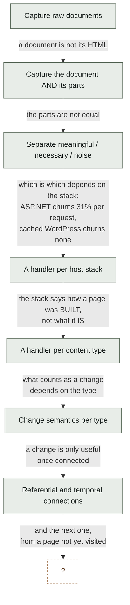
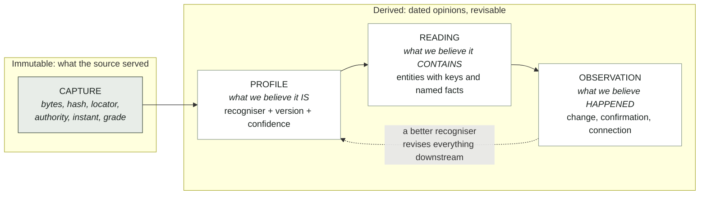
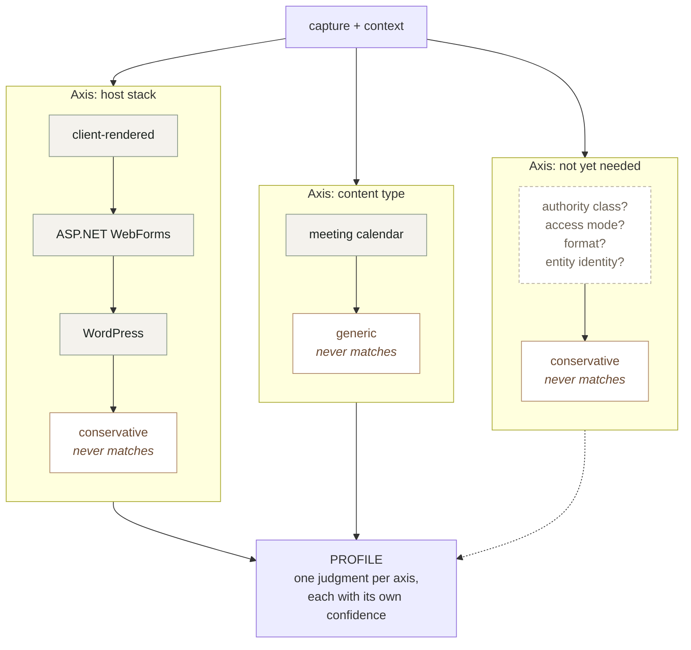
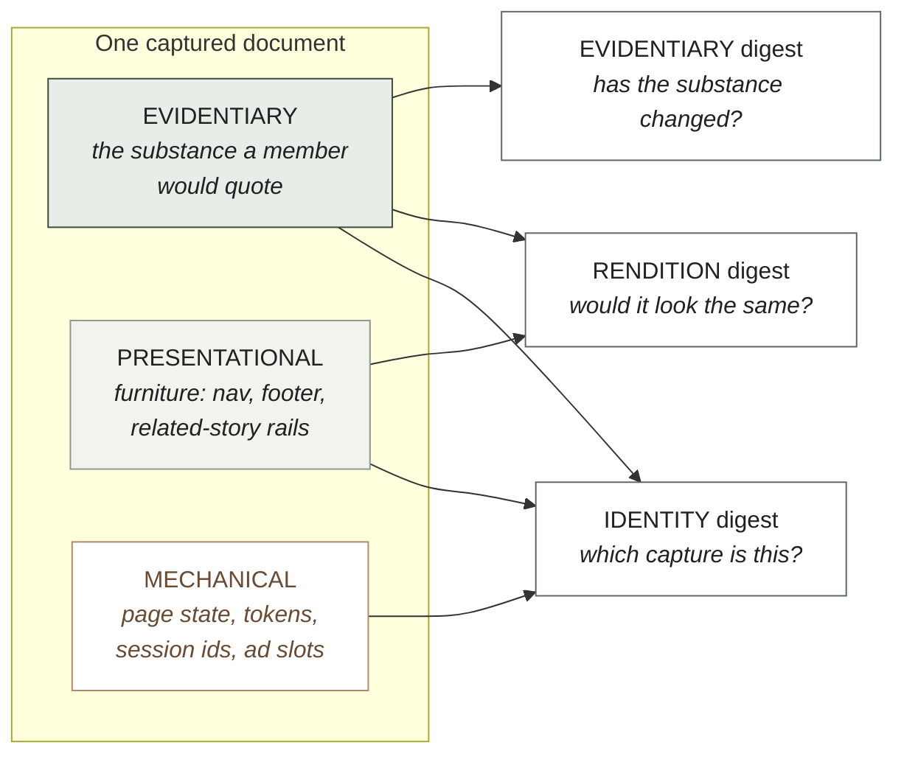
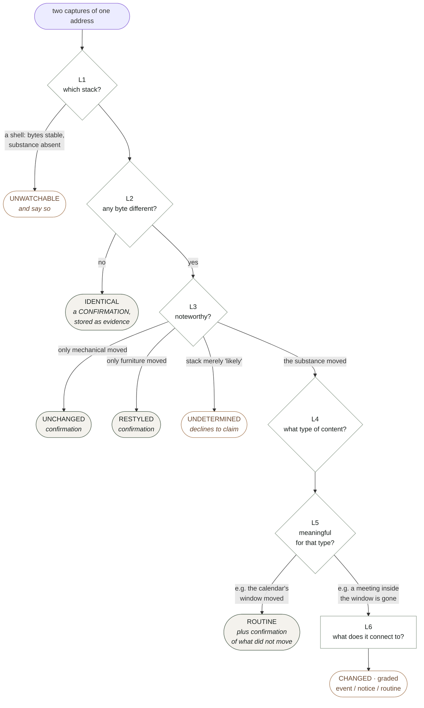
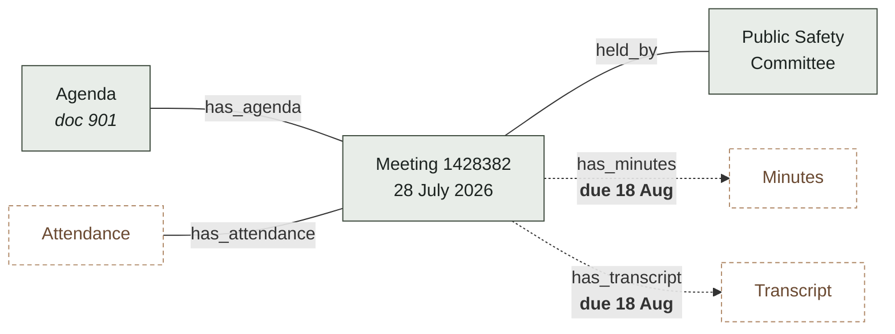
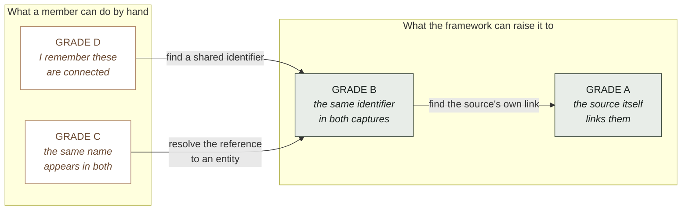
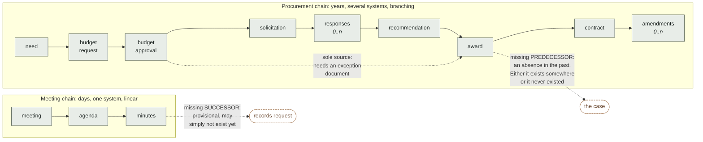
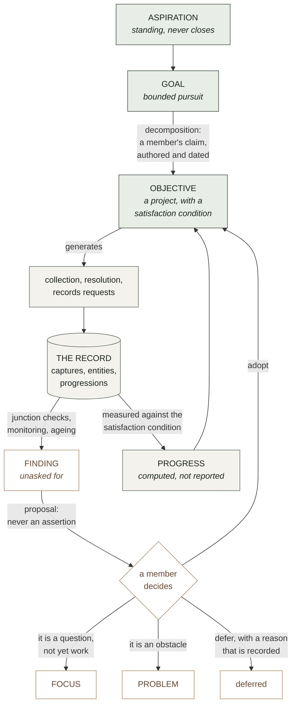
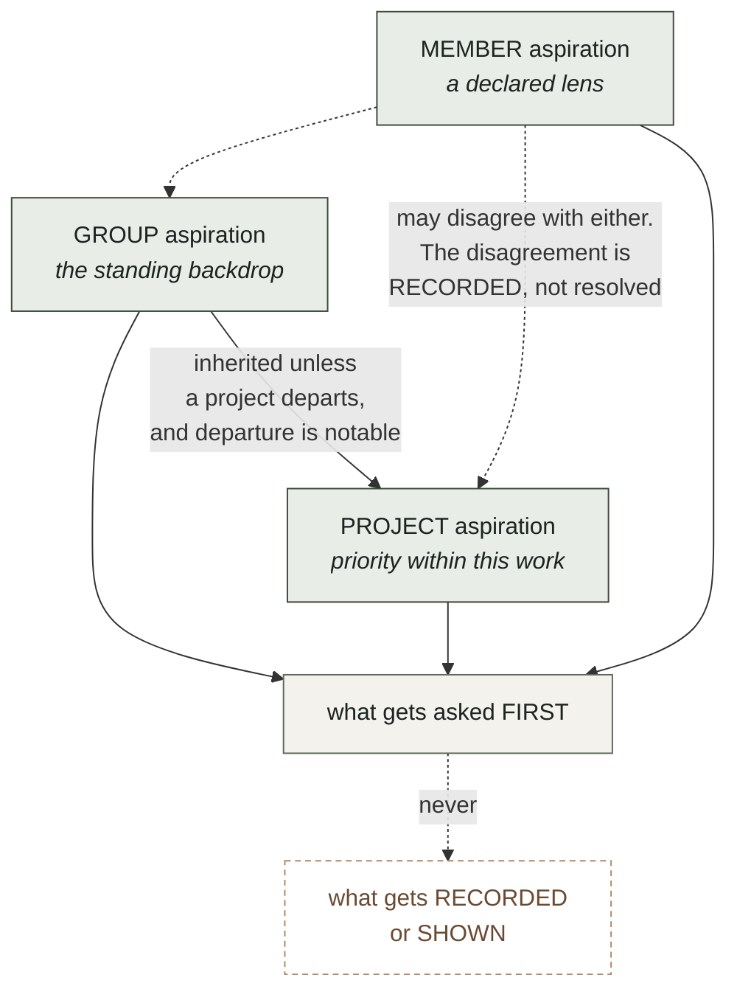

# BIO Content Framework

**Status** · The content framework, in two parts. **Part I (§§1–13)** — the extraction substrate: recognisers, regions and digests, change layers, content types, connections and their grade, progressions, identifier spaces, intent, declared bias, provenance of judgments — ARCHITECTURE APPROVED by Bob at v0.10 on 2026-07-30 and unchanged since. **Part II (§§14–19)** — content as the unit the record points at: role and model, the forms of content, the extraction process as built, organization and access, the central gap stated once, and who defers to this document — added 2026-09-15 as v0.11, **DRAFT awaiting Bob's review**; it rules nothing new and proposes no design, and §18 names the six pieces still to be designed. The file keeps its `v0_10` name so `framework:LINE` citations in code and record resolve; **this front matter shifted every body line by the length of this block once, on 2026-09-14 — a citation written before that date points that many lines early; the fix is to cite the section (`CORPUS-STANDARD.md` §4.6)**. Part I complete and approved at its level; Part II a draft with an explicit frontier. as of 2026-09-14.

**Place in the system** · The single authoritative content design and the home of constructs 4, 5 and 6 of `BIO_System_Design.md` §3 (content — the heart of the system; document profile and the extraction substrate; meaning). `CONSTRUCTS.md` is the inventory and evidence beneath Part I; `docs/development/CONTENT-EXTENT-DESIGN-SPACE.md` is the design-space study for Part II §18's first piece; `STORE-AS-CACHE.md`'s three-axis and four-level tables are adopted in §14.2–14.3; `CLAUDE.md`'s content section points here; DEBT D-164 and INTERFACES I2 cite it. It does not own retrieval, the investigative session, the bias doctrine, the interface contracts, or any ruling.

**Incomplete sections** ·
- §14 — Part II is DRAFT awaiting Bob's review (all of §§14–19); §14.6's "PARKED" is stale since Bob reopened D-164 on 2026-09-15.
- §16.7 — self-marked absences: table and image extraction, the AI EXTRACT role, read-time re-extraction to tier 3 (D-319), per-page Tier-2 and `text_tier` rules (D-283, D-284), the content-axis frontier.
- §18 — six pieces "named here, designed nowhere in this document": the content object and extent-carrying edge (D-164); content-grain search; the general observation log; extraction breadth; homes for the member's lead and firsthand observation (doctrine, Bob's); the claim object (doctrine, Bob's).
- §19 — the to-do table of pointers is partly performed: `CLAUDE.md`, DEBT D-164, INTERFACES I2, `STORE-AS-CACHE.md`, README and CONSTRUCTS done; the `schema.mjs`, `index.mjs` and `registry.mjs` self-descriptions are CPDF-17's; the table names a `v0_11` file that does not exist.
- §11 — seven declared bends; the first (documents that are not pages) has partly arrived with the non-text path and the OCR member, and Part I's text is frozen by design, so the bend is not updated in place.
- §1.1 — "entities that outlive documents" named as the primary missing capability; the entity axis is since built at document grain (Part II §15).
- §12.2 and §13.1 — "What is deliberately not modelled yet" and "What is missing" are self-marked; the claim object has been absent since v0.1.

**Contents**
  - [1. Why this document exists, and what it is FOR](#1-why-this-document-exists-and-what-it-is-for)
  - [1.1 What this is FOR: case development](#11-what-this-is-for-case-development)
    - [Two directions, and where they must meet](#two-directions-and-where-they-must-meet)
    - [The two success measures](#the-two-success-measures)
  - [2. Invariants](#2-invariants)
  - [3. The core objects](#3-the-core-objects)
  - [4. One extension shape: the RECOGNISER](#4-one-extension-shape-the-recogniser)
    - [The axes we know about](#the-axes-we-know-about)
  - [5. A document's anatomy: regions and digests](#5-a-documents-anatomy-regions-and-digests)
  - [6. Change: layers, and one entry point](#6-change-layers-and-one-entry-point)
  - [7. Content types: what a document contains, and what its changes mean](#7-content-types-what-a-document-contains-and-what-its-changes-mean)
  - [8. Connections: referential and temporal, as DATA](#8-connections-referential-and-temporal-as-data)
  - [8.1 Connection GRADE](#81-connection-grade)
    - [The connection table](#the-connection-table)
  - [9. The cost of absorbing the next surprise](#9-the-cost-of-absorbing-the-next-surprise)
  - [8.2 Progressions: the many shapes a happening takes](#82-progressions-the-many-shapes-a-happening-takes)
    - [The missing predecessor](#the-missing-predecessor)
    - [The progression table](#the-progression-table)
    - [Legitimate skips need an exception document](#legitimate-skips-need-an-exception-document)
    - [Junction checks](#junction-checks)
    - [Progressions are threaded by entities](#progressions-are-threaded-by-entities)
  - [8.3 Identifier spaces, and where grade collapses](#83-identifier-spaces-and-where-grade-collapses)
  - [9.1 The workload this is meant to remove](#91-the-workload-this-is-meant-to-remove)
  - [12. Intent: goals, objectives, aspirations, and the discovery loop](#12-intent-goals-objectives-aspirations-and-the-discovery-loop)
    - [Three things, and they behave differently](#three-things-and-they-behave-differently)
    - [This is not a new hierarchy](#this-is-not-a-new-hierarchy)
    - [Satisfaction conditions: the meeting point](#satisfaction-conditions-the-meeting-point)
    - [The discovery loop: "everything discovered along the way"](#the-discovery-loop-everything-discovered-along-the-way)
    - [An assistant may open a focus unattended](#an-assistant-may-open-a-focus-unattended)
  - [12.1 Aspirations are scoped](#121-aspirations-are-scoped)
  - [12.2 The pursuit record](#122-the-pursuit-record)
    - [What is deliberately not modelled yet](#what-is-deliberately-not-modelled-yet)
  - [13. Declared bias, and where it meets this framework](#13-declared-bias-and-where-it-meets-this-framework)
    - [The subject registry and the entity axis are the same construct](#the-subject-registry-and-the-entity-axis-are-the-same-construct)
    - [An assistant working unattended works under a lens](#an-assistant-working-unattended-works-under-a-lens)
    - [Bias debt and the ageing machinery are the same shape](#bias-debt-and-the-ageing-machinery-are-the-same-shape)
  - [13.1 Evidence accrues to bias statements](#131-evidence-accrues-to-bias-statements)
    - [The inverse of bias debt](#the-inverse-of-bias-debt)
    - [A statement may carry a measurable form](#a-statement-may-carry-a-measurable-form)
    - [Decay is loud and never blocking](#decay-is-loud-and-never-blocking)
    - [This is the legitimate form of what a verdict would be](#this-is-the-legitimate-form-of-what-a-verdict-would-be)
    - [And it settles the monitoring question](#and-it-settles-the-monitoring-question)
    - [Where bias enters this framework's own judgments](#where-bias-enters-this-frameworks-own-judgments)
    - [What is missing](#what-is-missing)
  - [10. Provenance of judgments, so learning can revise](#10-provenance-of-judgments-so-learning-can-revise)
  - [11. Where this framework will bend](#11-where-this-framework-will-bend)
- [PART II · CONTENT AS THE UNIT](#part-ii-content-as-the-unit)
    - [Terminology: this document's "content" and DEC-23's "content" are two words](#terminology-this-documents-content-and-dec-23s-content-are-two-words)
  - [14. Content's role and model](#14-contents-role-and-model)
    - [14.1 The ruling](#141-the-ruling)
    - [14.2 The three layers and their verbs](#142-the-three-layers-and-their-verbs)
    - [14.3 The four-level search, and "a search that returns documents has not finished"](#143-the-four-level-search-and-a-search-that-returns-documents-has-not-finished)
    - [14.4 Content's two intrinsic properties: EXTENT and EXTRACTION METHOD](#144-contents-two-intrinsic-properties-extent-and-extraction-method)
    - [14.5 The machine may EXTRACT](#145-the-machine-may-extract)
    - [14.6 Status, stated once](#146-status-stated-once)
  - [15. The forms of content](#15-the-forms-of-content)
  - [16. The extraction process as built](#16-the-extraction-process-as-built)
    - [16.1 Identify](#161-identify)
    - [16.2 Read — the text path](#162-read-the-text-path)
    - [16.3 The L2→L3 wire — the non-text path, three tiers](#163-the-l2l3-wire-the-non-text-path-three-tiers)
    - [16.4 Tier 3, the current state — VERIFIED against the tree, not copied from the comment](#164-tier-3-the-current-state-verified-against-the-tree-not-copied-from-the-comment)
    - [16.5 The chain, composed as the wire walks](#165-the-chain-composed-as-the-wire-walks)
    - [16.6 Promote-time projection](#166-promote-time-projection)
    - [16.7 What is specified, what is delegated, what is absent](#167-what-is-specified-what-is-delegated-what-is-absent)
  - [17. Organization and access](#17-organization-and-access)
  - [18. The central gap, stated once](#18-the-central-gap-stated-once)
  - [19. Where this document is the authority, and who defers to it](#19-where-this-document-is-the-authority-and-who-defers-to-it)

---

**Version 0.11 — 2026-09-15 — Part I (§§1–13) ARCHITECTURE APPROVED by Bob at v0.10 and unchanged line for line; Part II (§§14–19) DRAFT, the post-2026-07-30 content doctrine folded in so that this document is the single authoritative content design — awaiting Bob's review. The v0.11 changelog entry stands at the head of Part II, and the file keeps its `v0_10` name so that every `framework:LINE` citation in the code and the record stays exact.**

Status: this is the framework document Bob called for after observing that the
development work had diffused across many elements at once. It supersedes nothing
yet; `docs/architecture/CONSTRUCTS.md` is the inventory and the evidence behind it,
and this is the shape those constructs should take.

Diagrams are Mermaid, which renders in GitHub and most Markdown viewers, and which
stays as text so it diffs like the rest of the document. All six were validated
against the Mermaid parser itself rather than eyeballed, since a diagram that fails
to render is worse than no diagram: it leaves a block of syntax where an explanation
should be.

Changelog:
- v0.10, 2026-07-30. Bob settled the open question by pointing at the principle already
  written: the measure never edits the statement. A measure that may not edit a
  statement certainly may not BLOCK work resting on it, so decay is loud and never
  blocking. Generalised into invariant 9, since the same line runs through assistant
  proposals, connection grades and recogniser confidence: derived things inform,
  authored acts bind.
- v0.9, 2026-07-30. Bob reframed an open question into a better one: a side-effect of
  this framework's work should be that evidentiary comments accrue to bias records,
  measuring the extent to which a bias is JUSTIFIED. §13.1 works that through. It is the
  inverse of bias debt, it makes a `pattern` statement a standing claim the record
  continuously tests, it reuses §12's satisfaction condition as the statement's
  measurable form, and it resolves v0.8's open question about monitoring and bias by
  removing the coupling rather than documenting it.
- v0.8, 2026-07-30. Bob observed that the declared bias construct was missing from this
  framework. It was, and worse: v0.6 and v0.7 cited it twice in support of a claim that
  reading it does not sustain. §12.1 is CORRECTED — a member-scoped aspiration is not a
  declared bias — and §13 integrates the doctrine properly. The load-bearing finding is
  that the doctrine's SUBJECT REGISTRY and this framework's entity axis are the same
  construct arriving from two directions, and building them separately would repeat
  exactly the error CONSTRUCTS.md exists to prevent.
- v0.7, 2026-07-30. Bob ruled that contradicting aspirations are WELCOMED, for two
  reasons that change the design rather than soften it: we may not realise that they
  contradict, and we learn from trying to achieve aspirations whether they are achieved
  or not. §12.1 is rewritten accordingly — the absence of an arbiter is now a
  deliberate position rather than an unfinished mechanism, what the system looks for is
  CONTACT between aspirations rather than semantic contradiction it cannot establish,
  and §12.2 adds the pursuit record, since learning that survives an unachieved
  aspiration has to live somewhere. Also ruled: an assistant-surfaced focus must LOOK
  like one.
- v0.6, 2026-07-30. Two rulings from Bob. An ASSISTANT MAY OPEN A FOCUS unattended,
  because that level of support is central to what BIO should offer and because a focus
  is informative and advisory rather than committing; §12 now says so, with the volume
  and ageing rules that unattended surfacing requires, and records that the check
  catalogue already permits `surfaced_by: agent` while both writers hardcode `human`.
  And an ASPIRATION IS SCOPED to the group, a project, or a member; §12.1 works through
  what each scope means, why conflicts between scopes are information rather than
  errors, and why a member-scoped aspiration is a declared lens in the sense
  `BIO_Declared_Bias_v0_1.md` already means.
- v0.5, 2026-07-30. Bob added the top of the model: the system must support humans and
  their AI assistants defining goals at a high level, turning them into objectives and
  aspirations, and working to achieve them AND everything discovered along the way.
  Adds §1.2, the two directions that must meet; §12, intent, which deliberately maps
  onto the existing focus / problem / project / action catalogue rather than inventing
  a parallel hierarchy, and which makes an objective's SATISFACTION CONDITION
  expressible in this framework's own vocabulary so that progress is computed from the
  record instead of asserted by whoever is doing the work; the discovery loop, by
  which a finding becomes a proposal and a member's adoption makes it an objective;
  and invariant 8, which is the guard against goal-directed work quietly becoming
  goal-directed collection.
- v0.4, 2026-07-30. Bob generalised the meeting chain: scheduled meeting to agenda to
  minutes is ONE form of connected data, and the system must be ready for many types
  of happenings and progressions, his example being need, budget request, budget
  approval, RFP, responses, award, signed contract. Adds §8.2, progressions as data,
  which generalises the connection table rather than sitting beside it; introduces the
  MISSING PREDECESSOR as a finding distinct from and often sharper than a missing
  successor; adds cardinality, exception documents, and junction checks; and adds §8.3
  on identifier spaces, since a progression that crosses source systems is where
  connection grade collapses and where the framework has to work hardest.
- v0.3, 2026-07-30. Bob approved the architecture and restated BIO's purpose:
  supporting members in ALL aspects of case development. That exposed a gap, since
  every object in v0.2 was about documents and none was about cases. Adds §1.1 stating
  the purpose and the two success measures; promotes ENTITY to a core object in §3;
  adds §8.1, connection GRADE, on the model of capture grade, because Bob's phrase
  "improve the grade of connections" is the right one and grade already means
  something precise here; adds §9.1, the workload the framework is meant to remove;
  and moves entities-across-documents in §11 from "where this will bend" to the
  planned third axis. Ruling recorded: the upfront work is the full §4, not a
  deduplication.
- v0.2, 2026-07-30. Six diagrams added where a diagram carries what prose was
  labouring at: the evolution of the goal, the four core objects, the recogniser and
  registry shape that is the extensibility claim, regions against digests, the change
  cascade and its exits, and the two connection kinds over Bob's own meeting example.
  No change to the framework itself.
- v0.1, 2026-07-30. First draft. Pulls together the constructs discovered between
  0.36.0 and the 2026-07-30 UI sessions: document regions, three digests, host-stack
  handlers, content types, the layered change pipeline, monitoring contracts, and
  referential and temporal connections. Written to be extended rather than to be
  complete.

---

## 1. Why this document exists, and what it is FOR

The goal has moved six times in a few days, and every move was forced by something a
real page did rather than by a decision anyone made:

| We thought the job was | Then a page taught us |
| --- | --- |
| capture raw documents | a document is not its HTML: it needs its stylesheets and images to be the document the source served |
| capture a document and its parts | the parts are not equal. Some are meaningful, some are necessary for rendering, some are noise |
| separate meaningful from necessary from noise | which is which depends on the HOST STACK. ASP.NET churns 31% of its bytes per request; cached WordPress churns none |
| write a handler per host stack | the stack tells you how a page is BUILT, not what it IS. Change management needs to know it is looking at a calendar and not an article |
| write a handler per content type | what counts as a change depends on the type, and a calendar's window moves on its own |
| recognise change | change is only useful when connected: to related content, and to other moments in time |

That is not a story about six mistakes. It is a story about a domain that reveals
itself only on contact, and it is nowhere near finished. Sites yet unvisited will
have stacks, structures, content types and failure modes not listed anywhere below.

**So the measure of this framework is not coverage. It is the cost of absorbing the
next surprise.** Section 9 states that cost explicitly for each kind of new thing,
and that table is the framework's actual specification. Everything else exists to
keep those numbers small.

## 1.1 What this is FOR: case development

RULED by Bob, 2026-07-30. **BIO exists to support members in all aspects of case
development.** Every construct in this document is instrumental to that and none is
an end in itself. A capture nobody can build a case on is waste, however faithfully
it was hashed.

That has a consequence v0.2 missed. Every object in this framework was about
documents — capture, profile, reading, observation — and none was about the thing a
member is actually assembling. The framework described the machinery and not its
purpose, which is why entities and claims kept appearing in §11 as things that would
one day strain it. They are not strains. They are the top of the model and it was
missing.

### Two directions, and where they must meet

Everything from §2 to §11 runs BOTTOM UP: bytes become a capture, a capture gets a
profile, a profile permits a reading, readings resolve to entities, entities thread
progressions, and junctions produce findings. That direction is driven by what the
sources happen to publish.

A member does not work that way. A member starts from something they want to be true
about their city and works DOWN: a goal becomes objectives, objectives become
collection and analysis, and the analysis is supposed to answer the question they
started with.

Both are necessary and neither subsumes the other. A purely bottom-up system produces
a beautifully graded pile nobody asked for. A purely top-down system collects only
what confirms the plan, which is worse. **§12 is about where they meet**, and the
meeting point is specific rather than philosophical: an objective states what would
satisfy it IN THIS FRAMEWORK'S OWN TERMS, so progress is computed from the record
rather than asserted by whoever is doing the work.

### The two success measures

Also Bob's, and they are measurable rather than aspirational:

**1. Raise the GRADE of connections.** Connecting entities across documents is
ordinarily manual, and manual work of this kind is not merely slow: it is done from
memory and left incomplete, which means a case rests on connections a member believes
rather than connections the record can demonstrate. §8.1 grades them, and BIO's
contribution is converting connections a member would have asserted from knowledge
into connections the source itself asserted and the record holds both ends of.

**2. Reduce members' workload.** Named concretely in §9.1, because a framework that
cannot say which work it removes cannot be held to removing any.

These two pull in the same direction and that is not a coincidence: the work that is
most tedious for a member is exactly the work of chasing identifiers between
documents, and that is the work a machine can do at a higher grade than a person
reading by hand.

## 2. Invariants

The short list of things that have not changed across all six shifts and should not
change in the next six. A proposal that violates one of these is wrong, not novel.

1. **Raw bytes are never rewritten.** A capture's identity is the hash of exactly
   what the source served. Every classification, normalisation and judgment happens
   on copies and derived values.
2. **A classification is reversible and reclassifiable.** Chrome detection, volatile
   regions, document boundaries, content types: all are judgments with a basis and a
   date, never deletions.
3. **The failure asymmetry governs every default.** Reporting a change that did not
   happen costs a member attention. Failing to report one that did puts a false
   claim in the record, discovered — if ever — by the party the claim is aimed at.
   When uncertain, be noisy.
4. **A rule requires a measurement.** No pattern, region, type or expectation is
   written from what a document probably looks like. The comment above a rule names
   the page it was measured on.
5. **Uncertainty is carried, not resolved.** Every judgment records how sure it was
   and on what signal. Confidence below the bar changes the ANSWER, not just a log
   line.
6. **Technical complications are the system's problem.** The audience is
   non-technical and the workflow exists to remove them from logistics. A surface
   that asks a member to arbitrate a subrequest ceiling or a viewstate diff has
   failed, and it will feel like honesty while doing so.
7. **Goal-directed work must not become goal-directed collection.** A goal may
   direct what is SOUGHT. It must never filter what is recorded, retained, or shown
   about what was found, and a finding that cuts against a goal is surfaced at least
   as prominently as one that supports it. This is the invariant that keeps a case
   from becoming a brief, and it is the one most likely to be violated by accident,
   because helpfulness looks exactly like it from the inside. See
   `BIO_Declared_Bias_v0_1.md`: the honest system makes the lens part of the record
   rather than pretending to be lensless.
8. **Derived things inform; authored acts bind.** A measure, a grade, a confidence, an
   assistant's proposal: all of these report and none of them decides. What blocks a
   state transition, commits the group, or changes doctrine is always a member's
   authored act. The rule is not deference for its own sake — it is that a derived
   value is a description of the world, and the world does not get a vote on what a
   group is willing to assert.
9. **The negative result is a finding.** "Nothing changed" is dated first-party
   evidence, not the absence of news, and it must be stored rather than discarded.

## 3. The core objects

Only four, and every construct in the inventory is a property of one of them or a
function between them.

**CAPTURE.** Bytes, a hash, a locator, an authority, an instant, a grade. Immutable.
The thing the record holds.

**PROFILE.** What we believe a capture IS. Produced by recognisers (§4), recorded ON
the capture, versioned and confidence-bearing so that a later, better recogniser can
find and revise every judgment made by a worse one. A profile is not a fact about the
document; it is a dated opinion about it, and must be stored as such.

**READING.** What we believe a capture CONTAINS: entities with stable keys and named
facts, plus document-level facts such as a calendar's visible window. Produced by a
content type. Derived, cheap to recompute, never authoritative over the bytes.

**ENTITY.** A thing the case is about, which OUTLIVES any document that mentions it:
a person, a body, an ordinance, a parcel, a contract, a fund. Entities are what make a
case a case rather than a pile of captures. An entity has an identity, one or more
REFERENCES in readings that resolve to it, and a resolution confidence per reference
(§8.1). Crucially an entity is not extracted from a document; it is RESOLVED across
documents, and the resolution is a judgment with a grade like any other.

**OBSERVATION.** What we believe happened, between two captures or at one moment. A
change, a confirmation, or a connection. Always dated, always attributed to the
recogniser and reading that produced it.

The pipeline is just: capture → profile → reading → observation, with entities
resolved ACROSS readings and connections drawn between entities and documents. The
dashed edge is section 10 and it is what makes the framework safe to be wrong.

A **CASE** is then a selected, ordered set of entities, observations and connections
with a claim attached. Nothing in this document models a claim yet, and the
case-building rungs will need one; what matters here is that the objects a case is
built FROM are all present and graded.

## 4. One extension shape: the RECOGNISER

The inventory's worst finding was that we invented two confidence ladders, two diff
functions and three entry points in a day, because each new axis grew its own
apparatus. The fix is that every axis uses the same shape.

A **recogniser** answers one question about a capture and declares how sure it is:

    detect(ctx) -> { match, confidence, signals[] }
    version                      // so a judgment can be found when the rule improves
    key, label                   // machine name, and words for a member

One confidence ladder for all axes: `certain` (a signal only this thing produces),
`likely` (consistent but not conclusive), `possible`, `none`. **Confidence below
`certain` changes the answer**, per invariant 5: a recogniser that is merely likely
declines to narrow, and the conservative default applies.

A **recogniser registry** holds recognisers for one axis, ordered, most specific
first, first `certain` wins, with a fallback that never matches and is reached only
by falling through. The fallback is always the conservative one.

That is the whole extension mechanism. Adding a handler, a content type, or a member
of an axis nobody has thought of yet is the same act: write a recogniser, register
it.

Every box in every registry has the same interface. That is the whole claim: a third
axis is a third column, not a rewrite.

### The axes we know about

| Axis | Question | Registry | Members today |
| --- | --- | --- | --- |
| **stack** | how was this built? | `stacks` | client-rendered, ASP.NET WebForms, WordPress, conservative |
| **content type** | what is this? | `types` | meeting calendar, generic |

Two axes, and the framework treats "which axes exist" as itself extensible: a third
axis is a third registry of the same shape. Candidates already visible: **authority
class** (is this the issuing body's own publication or a mirror?), **access mode**
(public, paywalled, login-walled, rate-limited), **format** (HTML, PDF, dataset,
scanned image needing OCR).

## 5. A document's anatomy: regions and digests

**Three region kinds**, and the middle one is what a flat "volatile vs stable" model
kept getting wrong:

- **evidentiary** — the substance. What a member would quote or put before a council.
- **presentational** — furniture. Really on the page, captured and rendered, and not
  the document's claim about its own subject.
- **mechanical** — per-render machinery. Page state, security tokens, session ids,
  cache stamps, ad and analytics slots.

A stack recogniser declares regions in one of two shapes, and the second is
preferred:

- **pattern rules**, listing what to discount. Anything unlisted silently counts as
  substance.
- **a boundary**, naming the document itself. Anything outside it is furniture in one
  stroke, and a theme change cannot quietly reclassify substance. A boundary that
  does not match normalises NOTHING and records that it missed.

**Three digests**, because "would it look the same" and "has the substance changed"
are different questions and one hash cannot answer both:

| Digest | Normalises | Answers |
| --- | --- | --- |
| identity | nothing | which capture is this? |
| rendition | mechanical | would it look the same? |
| evidentiary | mechanical + presentational | has the substance changed? |

Measured: on `oakland.legistar.com/Calendar.aspx` the mechanical region is 115,980
bytes, 31.4% of the document, and the identity digest moves on every single fetch
because of it while the evidentiary digest does not move at all.

**Fidelity** is the claim the record can make about showing a capture: `faithful`,
`degraded` (only decoration missing, named on screen not hidden), `insufficient`
(render-critical missing, render refused). Which parts are render-critical is the
stack recogniser's judgment; under the conservative fallback all of them are.

## 6. Change: layers, and one entry point

Recognising change is layered, each layer cheap relative to the next and able to
settle the question. **One public function** — `assess(before, after, ctx)` — and
every result carries a trail recording where reasoning stopped, because a verdict
whose depth is invisible cannot be audited.

| Layer | Question | Settles when |
| --- | --- | --- |
| L1 | which stack? | never; nothing below is trustworthy without it |
| L2 | anything different at all? | identical bytes → a CONFIRMATION |
| L3 | is the difference noteworthy? | only mechanical, or only presentational, moved |
| L4 | what type of content? | never; selects who answers L5 |
| L5 | is the change meaningful for that type? | usually |
| L6 | what does it connect to? | terminal |

Most checks on a monitored source exit at L2 or L3, and every one of those exits
produces a confirmation rather than a shrug.

L2 is not a fast path. It is the layer that produces most of the system's evidence,
because on a monitored source most checks find nothing and invariant 7 says that is
a finding.

**Outcomes** are graded once and the boolean derived, never carried twice:

- `event` — a member should look.
- `notice` — recorded, shown on request.
- `routine` — the source doing its normal business.

Event types come from a **shared catalogue**, not from strings invented inside each
content type. The check catalogue already taught the plane this lesson; the second
content type would otherwise reinvent `removed` under a different name.

**Monitoring contract** is a property a content type declares, not a function of the
stack: `substance` for a record, `membership` for a list, `unmonitorable` for a shell
whose delivered bytes are stable and whose content is absent. Contract also sets the
expected check frequency, because a delisting is time-sensitive and a regulation is
not.

## 7. Content types: what a document contains, and what its changes mean

A content type is a recogniser (§4) plus three functions:

    parse(ctx)        -> reading: entities[] + document facts
    assess(a, b, ctx) -> observations: events[] + confirmation
    connections(a, b) -> connections[]

**Entities** carry a `key` that must be stable across fetches — an id in a URL is a
key, a position in a list is not — a `kind`, a `label` for a member, and named
`facts`. Named facts are what let an observation say WHICH thing moved rather than
that the entity differs, and they are why a diff should exist once.

**A reading that finds nothing is a failed reader, never an emptied document.** This
has already nearly produced a mass-delisting report and is the single most dangerous
error available to this layer.

**Document facts can make an absence expected.** A calendar's visible window is
relative to now, measured: "This Month". A meeting that scrolled out of range is not
a delisting, and no amount of care about bytes or regions can tell those apart,
because the distinction is about what a calendar IS.

## 8. Connections: referential and temporal, as DATA

Two kinds, not one, because people and their assistants reason about them
differently and the UI must show them apart:

**Referential** — two things are ABOUT each other. Followed to understand SCOPE.

**Temporal** — one thing happened after another and the sequence matters. Strictly
directional, followed to understand a STORY. Its most valuable form is an **absence
with a due date**: minutes that have not appeared three weeks after a meeting are a
fact about the body, not a gap in the record.

Bob's own example, drawn. Solid edges are referential and answer "what is this part
of"; dashed edges are temporal and answer "what should have happened by now".

The two dashed edges pointing at documents the record does not hold are the framework
at its most useful: not a gap in the record, but a dated fact about the body.

## 8.1 Connection GRADE

Bob's phrase was "improve the grade of connections overall", and grade already means
something exact in this system: a capture's grade states how its provenance was
established, not how much anyone likes it. A connection deserves the same treatment,
because a case is only as strong as the weakest link a member is relying on and today
nothing tells them which link that is.

Grade states **how the connection was established**, and nothing else:

| Grade | Established by | Example |
| --- | --- | --- |
| **A** | the SOURCE's own identifier, with both ends captured and hashed | `MeetingDetail.aspx?ID=1428382` links to `View.ashx?M=M&ID=801`: the publisher says these belong together and the record holds both |
| **B** | an identifier the source uses, matched exactly in captured content at both ends | an agenda item naming "Ordinance 13579" and a captured ordinance whose own number is 13579 |
| **C** | correspondence rather than identity: a name, a title, a date proximity | "Sheng Thao" in two documents. Plausible, never presented as established, and flagged for a member to confirm |
| **D** | asserted with no captured basis | a member's own knowledge, or a source that no longer serves the page. Recorded as testimony, with an author and a date |

Two things this is NOT. Grade is not credibility: a Grade D connection from a member
who was in the room may be the most valuable thing in a case, and it is labelled by
its author rather than discounted. And grade is not the same as `asserted_by`: the
author says who claims it, the grade says what would be needed to check it. A case
file shows both.

**The whole point is that grade is improvable.** A member's Grade C hunch that two
documents concern the same contract becomes Grade B the moment the system finds the
contract number in both, and Grade A if the source links them itself. Raising grade
is work a machine does well and a person does slowly, and it is the clearest thing
this framework can offer a case.

Entity resolution is therefore the grading mechanism for referential connections, and
that is why it is the planned third axis rather than a future concern: matching a
reference to an entity by a source-assigned identifier produces Grade A or B, while
matching by name produces Grade C, and the difference is the whole value.

### The connection table

Bob's requirement: a table mapping the connections to look for between content, used
by tasks actively looking for connections, and viewable and editable through a UI
surface. It is DATA in the record, not cases in a `switch`.

    from_kind    to_kind      relation                connection   timing
    meeting      agenda       has_agenda              referential  before the meeting
    meeting      attendees    has_attendance          referential  after
    meeting      minutes      has_minutes             temporal     after, within N days
    meeting      transcript   has_transcript          temporal     after, within N days
    meeting      body         held_by                 referential  —
    agenda_item  regulation   proposes_amendment_to   referential  —
    person       body         serves_on               referential  —

Three things the table forces, all of them decisions rather than code:

1. **`asserted_by` needs three values, not one.** `links_to` today means the SOURCE
   said so. A connection this table implies is asserted by the SYSTEM on a rule a
   member can edit. A member can also assert one directly. Three authors, three
   evidentiary weights.
2. **Rule and instance are different objects.** "Minutes follow a meeting within N
   days" is a row in this table. "The minutes for meeting 1428383 were due 8/18 and
   have not appeared" is an instance that has come due. The table holds rules;
   something else ages instances.
3. **A rule a member edits is a claim the group is making** about how its
   institutions ought to behave, and it belongs in the record with an author and a
   date like any other claim.

## 9. The cost of absorbing the next surprise

**This table is the framework's specification.** Every design choice above exists to
keep these numbers small, and a proposal that raises one of them needs to justify
itself.

| A new… | Should cost | Why that is achievable |
| --- | --- | --- |
| host stack | one recogniser file, one registry line | regions and digests are stack-independent |
| content type | one recogniser file, one registry line | the change pipeline and the event catalogue are type-independent |
| connection kind to look for | **one row of data**, no code | §8 makes the table data |
| region rule for a known stack | one entry in that stack's rule list | rules are declarative |
| event type | one entry in the shared catalogue | significance is graded centrally |
| **axis of variation** | one registry of the recogniser shape | §4 makes registries uniform |
| **invariant** | a framework revision | invariants are the thing that should be expensive |

The last two rows are the ones history says will actually be exercised. Six axes
appeared in a few days. The seventh should cost a registry, not a rewrite.

## 8.2 Progressions: the many shapes a happening takes

RULED by Bob, 2026-07-30. The meeting chain — scheduled meeting, agenda, attendance,
minutes — is ONE form of connected data and not the general case. His example of
another: a mention of a need, a budget request, a budget approval, an RFP, responses
to it, a contract award, a signed contract with terms, and onward through amendments
and payments. The system must be ready for many types of happenings and progressions.

The two differ in almost every dimension, which is what makes the generalisation
worth making rather than assuming:

| | meeting chain | procurement chain |
| --- | --- | --- |
| span | days | months to years |
| bodies | one | department, council, contractor |
| source systems | one | often three or four |
| stages | 3 to 4 | 8 to 12 |
| shape | linear | branching, with one-to-many and legitimate skips |
| what is usually missing | the SUCCESSOR: minutes not yet posted | the PREDECESSOR: an award with no solicitation |

That last row is the important one and it is a new construct.

### The missing predecessor

A temporal connection so far has meant an expected successor: minutes are due after a
meeting. Bob's example inverts it. A signed contract implies an award; an award
implies a solicitation or a documented reason there was none; a budget approval
implies a request. **When a later stage exists and an earlier one does not, that is a
finding, and it is usually sharper than a missing successor**, because late minutes
are an administrative lapse while an award with no solicitation is a question about
how public money was committed.

It is also epistemically stronger. A missing successor might simply not have happened
yet; the absence is provisional. A missing predecessor is an absence in the past,
where the document either exists somewhere or does not exist at all, and either answer
is worth having. The first is a records request; the second is the case.

### The progression table

A generalisation of the connection table in §8.3, not a second table beside it. A
connection row is a progression of two stages; nothing needs both.

    progression: procurement
    stage  key            typical content        after      cardinality  within    required
    1      need           staff report           —          0..n         —         sometimes
    2      budget_request budget document        need        0..n         —         usually
    3      budget_approval council action        request     1            1 year    always
    4      solicitation   RFP / RFQ / IFB        approval    0..1         —         unless exception
    5      responses      bid list / proposals   solicitation 0..n        by due date usually
    6      recommendation staff report           responses   0..1         —         usually
    7      award          council resolution     recommendation 1         —         always
    8      contract       signed agreement       award        1           90 days   always
    9      amendment      change order           contract     0..n        —         never

Each row carries what the rules need and nothing more:

- **after** — the stage this one presupposes. Read forwards it predicts; read
  backwards it accuses.
- **cardinality** — `1`, `0..1`, `0..n`. An RFP has many responses; an award has one
  contract. Cardinality is where several of the sharpest questions live.
- **within** — the interval that makes an absence overdue rather than pending.
- **required** — `always`, `usually`, `sometimes`, `never`, and the crucial
  `unless exception`.

### Legitimate skips need an exception document

A sole-source award skips the solicitation stage lawfully, and the thing that makes it
lawful is a justification the institution is supposed to publish. So a skipped stage
is not automatically a finding: **a skipped stage with no exception document is.** The
table records which document discharges which skip, and the framework's question
becomes not "why is this missing" but "where is the document that says it may be
missing", which is a question with a records-request answer.

### Junction checks

A progression's value is concentrated at its junctions, and these are the questions a
member is trying to answer anyway:

- an **award with no solicitation** and no exception document
- a solicitation with **exactly one response**, which is lawful and interesting
- a **signed amount that differs from the awarded amount**
- **amendments accumulating** past a threshold of the original
- **payments past the contract term**
- a **budget approval with no traceable request**

Junction checks are rules over a progression instance, they are DATA like the table,
and they are the point at which this framework stops describing documents and starts
supporting a case.

### Progressions are threaded by entities

An instance of a progression is assembled by following an entity: a contract number, a
project identifier, a parcel, a fund. That is why the entity axis is Step 4 and the
progression table is Step 5 and not the other way round. It also means a progression
instance inherits the WEAKEST connection grade along its chain, and a case built on it
should say so, because a nine-stage chain assembled by name correspondence is not
evidence of anything.

## 8.3 Identifier spaces, and where grade collapses

A progression that stays inside one system can reach Grade A, because that system
assigns identifiers and links its own stages: Legistar does this for legislation. A
progression that crosses systems usually cannot, because a procurement portal, a
finance system and a legislative record each maintain their own identifier space and
none of them links to the others.

This is where connection grade collapses to C, and it is where the framework has to
work hardest, because it is also where the most consequential progressions live.

The lever is that institutions DO reuse certain identifiers across their systems, and
finding which ones is empirical work exactly like measuring a stack:

- a contract or purchase order number
- a project or capital improvement number
- a resolution or ordinance number
- an APN for a parcel
- a fund or account code

Each such identifier, once found in two systems, converts an entire progression from
Grade C to Grade B. **Discovering an institution's shared identifiers is therefore one
of the highest-value pieces of measurement this project can do**, and it should be
recorded per institution the way stack measurements are recorded per host. Oakland's
shared identifiers have not been measured.

## 9.1 The workload this is meant to remove

Stated concretely, because a framework that cannot name the work it removes cannot be
held to removing any. Each row is work a member does today, by hand, from memory, and
usually incompletely.

| Work a member does by hand | What the framework does instead | Status |
| --- | --- | --- |
| finding the other documents that concern this person, body, ordinance or fund | resolve references to entities and hold the reverse index | needs the entity axis |
| assembling a procurement or legislative chain from end to end | progression instances threaded by an entity | needs the entity axis and the progression table |
| noticing that a stage of such a chain was skipped without justification | missing-predecessor findings and exception documents | designed, not built |
| noticing that a document which should exist does not | temporal connections with a due date | emitted, nothing ages them |
| keeping a timeline of what happened when | observations are dated by construction | partly; nothing assembles them |
| re-checking whether a source still says what it said | layered change assessment plus stored confirmations | built, plane has not adopted it |
| noticing a document quietly delisted or swapped | membership monitoring and the replaced/withdrawn events | built, plane has not adopted it |
| judging whether a capture can be shown as evidence | fidelity levels | built |
| judging whether two versions of a page differ meaningfully | three digests and the change layers | built |

Read down the status column and the priority is not a matter of taste: almost
everything is built and unadopted, and the one genuinely missing capability is the
entity axis, which is also the one carrying both success measures.

## 12. Intent: goals, objectives, aspirations, and the discovery loop

RULED by Bob, 2026-07-30. The system must support humans and their AI assistants
defining goals at a high level, turning them into objectives and aspirations, and
working to achieve the goals **and everything discovered along the way**.

### Three things, and they behave differently

| | closes? | what it does | example |
| --- | --- | --- | --- |
| **Aspiration** | never | sets standing priority and shapes judgment | "Oakland's procurement should be traceable end to end" |
| **Goal** | eventually, maybe in years | bounds a pursuit | "Account for the sewer fund transfers, FY2019 to FY2026" |
| **Objective** | yes, checkably | states a condition the record can be measured against | "Hold a Grade B or better progression instance for every contract over $250k drawn on fund 3100 since FY2019" |

Conflating these is the ordinary failure. An aspiration written as an objective is
never finished and demoralises; an objective written as an aspiration is never
checked and quietly abandons itself.

### This is not a new hierarchy

The record already has the object types this needs, and the framework's job is to
CONNECT to them rather than to invent a parallel set:

- an **objective** is what a `project` carries; the catalogue already gives a project
  an `objective` field and the states `forming → investigating → matured → closed`
- an open question is a `focus`, with `surfaced → elevated → deferred → dismissed`
- a discovered obstacle is a `problem`, with the same states
- a step someone takes is an `action`, with `planned → active → awaiting_response →
  resolved → abandoned`

**Aspiration and goal are the two that do not exist yet.** Everything below them does.
That is the honest summary of the gap: this framework was written for six sections
without ever touching the catalogue that already models intent, and the connection has
to be made in both directions.

### Satisfaction conditions: the meeting point

This is the load-bearing idea of the section. **An objective states what would satisfy
it in the vocabulary of this framework**, which makes progress computable:

    objective: every contract over $250k on fund 3100 since FY2019
               is held as a progression instance at Grade B or better
    expressed as:
      entity        fund 3100
      progression   procurement
      filter        award amount > 250000, award date >= 2019-07-01
      required      instance grade >= B, stages 3..8 present
      satisfied     when 100% of matched instances meet it

Three consequences, all of them the point:

1. **Progress is derived, not reported.** "41 of 58 contracts are at Grade B; 12 are
   Grade C for want of a shared identifier; 5 have no solicitation and no exception
   document" is computed from the record. Nobody has to be trusted to say how it is
   going.
2. **The gaps are the work list.** The 12 Grade C instances name exactly what
   measurement would raise them, and the 5 missing solicitations are records requests
   with the request already specified.
3. **An AI assistant can be checked.** An assistant working an objective produces
   captures, resolutions and proposals, all of which carry provenance and grade, so
   its contribution is auditable in the same terms as anyone's.

### The discovery loop: "everything discovered along the way"

The framework generates findings that nobody asked for: a delisted meeting, an award
with no solicitation, a contract amended past its original value. Bob's phrase makes
these first-class rather than noise, and the loop has to be explicit or they are lost:

The rules that make the loop safe:

- **A finding is a PROPOSAL, never an assertion.** It arrives with its grade and its
  basis, and it becomes part of the plan only when a member adopts it. Adoption is an
  authored, dated act like any other claim.
- **A deferral is recorded with its reason.** "Not now" is a decision about the case
  and belongs in the record; a finding that silently disappears is indistinguishable
  from one that was never made.
- **A finding that contradicts the goal takes the same path.** Invariant 7 exists
  because this is the step where a case turns into a brief, and it turns by omission
  rather than by decision.
- **An assistant may propose at any point in the loop and adopt at none of them.**
  It can draft the decomposition, run the junction checks, assemble the progression
  and write the records request. The member's adoption is what makes any of it the
  group's position.

### An assistant may open a focus unattended

RULED by Bob, 2026-07-30. This level of support is central to what a member should
expect from BIO, and it is safe for a specific structural reason: **a focus is
informative, advisory and supportive of a project's development. It commits nobody.**
Its states are `surfaced → elevated → deferred → dismissed`, and `surfaced` means
precisely "noticed, not yet judged".

The catalogue anticipated this. C-2.8 already permits `surfaced_by` to be `agent` or
`human`, and both writers in the codebase hardcode `human`, so the doctrine was
allowed for at the check level years before any surface could express it.

What stays a member's act, and the line is exactly where advisory ends:

| act | who | why |
| --- | --- | --- |
| open a focus at `surfaced` | assistant or member | advisory; commits nobody |
| **elevate** a focus | member only | elevation is the group taking a question seriously |
| open a `problem` | assistant or member | also advisory: an obstacle noticed is not an obstacle accepted |
| **adopt into an objective** | member only | this makes it the group's work |
| dismiss | member only | dismissal is a judgment about the question |

Unattended surfacing needs two disciplines it would not need from a human, because a
machine can produce hundreds where a person produces one:

- **Aggregate, do not multiply.** One junction check firing across 58 contracts is ONE
  focus with 58 instances, not 58 focuses. A focus is a question, and "why do these 58
  awards have no solicitation" is one question. Getting this wrong does not corrupt the
  record; it drowns it, which for an advisory object is the same failure.
- **Age rather than vanish.** A machine-surfaced focus nobody has acted on after some
  interval moves to `deferred` with the reason recorded — "surfaced by assistant, no
  member acted within N days" — and never silently disappears. A finding that
  disappears is indistinguishable from one that was never made, and that rule does not
  relax because the finder was a machine.

**An assistant-surfaced focus must LOOK like one.** RULED by Bob, 2026-07-30. The
record carries `surfaced_by: agent` either way; the ruling is that the surface has to
communicate it too. This is not a discount applied to the question. A good question
stands on its merits whoever asked it, and a member weighing one needs to know that
nobody has yet judged it worth asking — which is precisely the difference between a
machine noticing a pattern and a member deciding it matters. Marking it is what lets a
member give it the reading it deserves rather than assuming a colleague already
thought it through.

Invariant 7 binds harder here, not less. An assistant that can surface unattended must
surface the findings that cut against the goal on exactly the same terms as the ones
that support it, and being unattended is what removes the human who would otherwise
have noticed the omission.

## 12.1 Aspirations are scoped

RULED by Bob, 2026-07-30: an aspiration may be scoped at the group, the project, or
the member level.

| scope | whose commitment | what it shapes | changing it |
| --- | --- | --- | --- |
| **group** | the collective's standing position | the default backdrop for all work | a group act, with the weight that implies |
| **project** | this line of work | priority within the project, for everyone working it | the project's own record |
| **member** | this person's lens | that member's queue and attention | theirs alone, and visible |

Three consequences worth stating because each could be got wrong quietly.

**A project inherits the group's aspirations unless it declares otherwise, and
declaring otherwise is notable.** A project that departs from a group commitment is
making a statement about the work, and it should read as one rather than as
configuration.

**Contradicting aspirations are WELCOMED.** RULED by Bob, 2026-07-30, and for two
reasons that are stronger than tolerance:

- **We may not realise that they contradict.** The contradiction is the discovery. A
  group that finds two of its own commitments pulling apart has learned something
  about itself that no amount of planning would have produced, and the system's job is
  to make that visible rather than to prevent it.
- **We learn from trying to achieve aspirations whether they are achieved or not.**
  An aspiration is not a task that succeeds or fails. Pursuing one produces knowledge
  regardless of the outcome, which means an aspiration that is never achieved can
  still have been worth holding, and §12.2 gives that knowledge somewhere to live.

So there is **no arbiter and no precedence, by design rather than by omission**.
Narrower scope does not override wider; aspirations coexist; a member whose aspiration
pulls against the group's is a fact about the group and not a configuration error. A
system that silently let the narrower win would let one member quietly redirect a
group's work by writing a preference, and one that forced resolution would suppress
exactly the discovery Bob is pointing at.

**What the system looks for is CONTACT, not contradiction.** Judging whether two
prose commitments contradict each other is not something this framework can establish,
and inventing a verdict it cannot support would violate invariant 5. What it can
establish is that two aspirations are in contact: they direct work at the same
entities, they touch the same progressions, or they order the same queue differently.
Contact is detectable and is worth surfacing. Whether the contact is a contradiction,
a tension worth living with, or a misunderstanding is a human judgment, and the system
presents the evidence for it in the same terms as any other finding.

**A member-scoped aspiration is NOT a declared bias.** v0.6 and v0.7 of this document
said it was, twice, and that was wrong. The claim was made from the first paragraph of
`BIO_Declared_Bias_v0_1.md` without reading the rest, and the rest does not sustain
it. The two constructs differ in every particular that matters:

| | aspiration | declared bias |
| --- | --- | --- |
| says | what someone wants to be true | how evidence must be TREATED |
| form | prose | a set of statements, closed at three kinds: scrutiny, inference, pattern |
| discipline | none needed | the malformedness rule: it may never issue a verdict on a source |
| scopes | group, project, member | instance and project. No member scope |
| effect | sets priority | binds evaluations, and travels as a manifest with published work |

An aspiration expresses intent and orders attention. A bias statement constrains what
may be concluded and from whom. "I believe the transfers were improper" is an
aspiration or a hypothesis; "anything from this office needs cross-checking before it
bears load, because it has misstated three times" is a bias statement, and it is
useless as an aspiration and unacceptable as one without its justification and its
evidence.

The relationship is real but it is adjacency, not identity: a member pursuing an
aspiration is a good moment to ASK whether they hold a declared bias about the sources
that pursuit will lean on. §13 says what actually follows.

## 12.2 The pursuit record

Follows directly from Bob's second reason. If we learn from trying to achieve an
aspiration whether or not it is achieved, the learning has to survive somewhere, and
an object that never closes has no natural moment at which anyone writes down what it
taught.

So an aspiration accumulates a **pursuit record**: the objectives opened under it, the
findings adopted and deferred, the records requests made and what came back, the
measurements taken, and the dead ends. Three properties matter:

- **A dead end is kept.** "We assumed the fund code would appear in the procurement
  portal and it does not" is the kind of thing every member relearns individually and
  nobody writes down. It is also exactly the kind of thing that makes the next
  member's work cheaper.
- **It is not a progress bar.** An aspiration has no completion, so the record shows
  what was attempted and learned rather than how far along it is. Objectives beneath
  it have satisfaction conditions and derived progress; the aspiration itself does not.
- **It survives abandonment.** An aspiration set down after two years of work leaves
  its pursuit record behind, and the record is the point. Retiring an aspiration should
  therefore be an act that captures what it taught, not one that archives a folder.

Aspirations set PRIORITY and never filter evidence. Invariant 7 applies to them with
full force: an aspiration may shape which questions get asked first, and it may not
shape which answers get recorded or shown.

### What is deliberately not modelled yet

A **claim** — "the city moved $2.1m from the sewer fund without authorisation" — is
what a case ultimately asserts, and it is neither an objective nor a finding. It is
the thing the objectives were in service of. §11 has listed it as unmodelled since
v0.1 and it stays unmodelled here, because a claim needs a standard of proof attached
and that is doctrine rather than architecture. It is the next design conversation, not
this one.

## 13. Declared bias, and where it meets this framework

`BIO_Declared_Bias_v0_1.md` predates this document by three days and is more finished
than anything here. It defines a bias as a set of statements of three kinds —
**scrutiny** (a source's claims need corroboration before they bear load),
**inference** (a specific inference pattern is licensed or blocked), and **pattern**
(an evidenced empirical claim about a source's behaviour, which must cite the record)
— governed by a **malformedness rule** that refuses any statement pre-assigning a
truth value to a source. Bias sets are bundles, scoped at instance and project, with
override-by-effect, locks, and five layered safeguards against masking. Every work
product cites a **bias manifest**; a changed manifest leaves **bias debt** on prior
analysis; and **regrade** and **rerun** let one group's conclusions be re-derived
under another group's lens.

None of that is restated here. What follows is only the places the two constructs
touch, and the first one changes a plan.

### The subject registry and the entity axis are the same construct

The doctrine's fourth safeguard requires that statements reference a **subject
registry**: a bundle of entries for sources, institutions, offices and movements, each
with its aliases, plus declared relations between them (`proxy_for`, `member_of`,
`overlaps`), each relation justified and citable.

That is an entity registry. Restricted to sources rather than covering ordinances and
parcels, and carrying member-declared relations rather than derived ones, but the same
object: a stable identity, its aliases, and its relationships, maintained as a bundle.

Building it twice would be precisely the failure `CONSTRUCTS.md` was written to stop.
**Step 4, the entity axis, must produce the registry the bias doctrine needs**, and the
requirement flows both ways:

- **the bias doctrine constrains the entity axis.** Aliases and declared relations must
  be first-class, editable by members, justified, and citable. An entity model that
  only ever derives identity from source identifiers cannot express "the registry
  relates MAGA to Trump" and would leave safeguard 4 unbuildable.
- **the entity axis serves the bias doctrine's prerequisite.** The doctrine names one:
  "for bias to bind mechanically rather than remain guidance humans apply by hand,
  evidence items need source attribution the system can match". Resolving a reference
  in a reading to a registered entity IS that attribution. The entity axis is therefore
  not merely adjacent to mechanical bias binding, it is the thing that unblocks it.

One caution on grade. A declared relation in the registry is not a Grade D testimonial
connection, and grading it that way would be a category error. The group declaring that
two subjects are related is **constitutive** rather than evidentiary: it is not a claim
about the world that could be checked, it is the group fixing what its own statements
mean. Constitutive acts carry an author and a justification like everything else, and
they sit outside the A-to-D scale.

### An assistant working unattended works under a lens

Bob ruled this session that an assistant may open a focus without a member. The
doctrine says any BIO work done under bias carries the fully declared bias as part of
that work's evidentiary record. Put together, a consequence follows that the doctrine
predates and did not anticipate:

**An assistant-surfaced focus must carry the bias manifest in force when it was
surfaced.** The assistant is doing BIO work; the effective statement set shaped what it
scrutinised and what inferences it was permitted to draw; and unlike a member it will
not remember. Without the manifest, a focus surfaced under one lens is indistinguishable
later from one surfaced under another, and bias debt cannot be computed against it.

This also gives the honest answer to a question the doctrine leaves open. An
assistant has no bias of its own to declare; what it has is the effective set it was
run under, plus the objective it was pursuing. Both are recordable, and recording them
is the whole of the assistant's obligation.

### Bias debt and the ageing machinery are the same shape

Bias debt says: the lens changed, so this analysis owes a re-run. §8.2's temporal
expectations say: this stage is due and has not arrived. Both are an obligation with a
clock, attached to an object, and settleable in batches. They should share mechanism
rather than growing two schedulers, and Step 7 of the plan is where that is decided.

> **CORRECTED 2026-08-05 (DEC-20, D-188).** This read *"and it may not advance or be
> ratified until the debt is settled"*, and listed *blocking a state transition* among
> the shared properties. **Ordinary bias debt blocks nothing** — it is DISCLOSED and
> travels with the work; only an uncleared HUNCH refuses publication. **The shared shape
> D-86 identified survives untouched**, because blocking was never the load-bearing part
> of it: an obligation with a clock, attached to an object, settleable in batches is
> still one mechanism with two consumers. What differs is what each consumer DOES when
> the clock runs out — the temporal half blocks, the bias half surfaces.

## 13.1 Evidence accrues to bias statements

Bob's reframing, 2026-07-30, of a question v0.8 had asked badly: a side-effect of the
work this framework does should be that **evidentiary comments accrue to bias records,
measuring the extent to which the bias is justified.**

The doctrine already requires a `pattern` statement to cite evidence and refuses to let
one leave draft without a citation. What it does not yet have is TIME. A pattern
statement declared in March, cited to three instances, is a different object by August:
either those three have become forty, or they have stayed three while sixty instances
went the other way. Nothing today notices either.

This framework notices things like that continuously. It is what monitoring, temporal
expectations and junction checks produce. So the connection is not a new capability but
a routing decision: **the observations the record generates should attach to the bias
statements they bear on.**

### The inverse of bias debt

Bias debt says: the LENS changed, so this analysis owes a re-run. This says: the
EVIDENCE changed, so this lens owes a re-examination. Same shape, opposite direction,
and the second is the one nobody builds because it is uncomfortable.

A scrutiny statement resting on three misstatements in 2024, against an office that has
since been accurate in sixty observed instances, is a bias that has outlived its
justification. The group may keep it anyway and say why — that is their prerogative and
the justification field exists for it — but the system should not let the decay go
unremarked, because an undeclared bias is what this whole doctrine exists to prevent
and a bias whose grounds have quietly evaporated is undeclared in the way that matters.

### A statement may carry a measurable form

Most pattern statements are not mechanically measurable, and pretending otherwise would
be the same error as claiming to detect contradiction between aspirations. "The Oakland
Auditor uses its discretion to control the narrative" is analysis and stays analysis.

But some are, and those should say so. A statement may optionally carry a **measurable
form** expressed in this framework's vocabulary — exactly the construct §12 gives an
objective as its satisfaction condition, and the symmetry is not decoration: both are a
prose commitment paired with a machine-checkable rendering of what would bear it out.

    statement   this office publishes minutes late
    subject     Public Works and Transportation Committee (registry entry)
    measurable  over the `procurement`... no: over meetings of this body since 2024-01,
                the proportion whose minutes appeared later than 21 days after the meeting
    standing    38 of 41 (93%), last computed 2026-07-30

Three properties keep it honest:

- **The measure never edits the statement.** Text and justification remain a member's
  authored act; the standing measure is a derived, dated attachment. A machine that
  could rewrite doctrine would be a worse problem than the one this solves.
- **The scope is registry-defined, never hand-picked.** The measure runs over an entity
  or a progression named in the subject registry, not over a set someone chose. A
  cherry-picked denominator would let a group manufacture authority for a bias, which is
  precisely the distortion the malformedness rule fights, arriving by the back door.
- **It is reported whichever way it cuts.** Invariant 7, and this is the case where it
  costs something: a group will welcome the measures confirming its statements, and the
  value of the feature is entirely in the ones refuting them.

### Decay is loud and never blocking

> **CORRECTED 2026-08-05 (DEC-20, D-188, DEC-46 (d)). This section was written
> against the blanket rule that ordinary bias debt BLOCKS. It does not, and has
> not since 2026-08-02.** Only **HUNCH DEBT** disqualifies. The section's
> argument survives intact — decay is loud and never blocking, because nothing
> was DECIDED — but its contrast partner was wrong, and the table below is
> corrected to three rows rather than two. The reasoning is now sharper, not
> weaker: what makes something blocking is not that a lens changed, it is that a
> member asserted a GRADE the evidence does not yet support.

The question this raised: HUNCH DEBT blocks, since a work product carrying an uncleared
hunch cannot be ratified for publication until it is cleared. Should a statement whose
measure has collapsed block the analysis resting on it?

No, and the principle two paragraphs up already decided it. **The measure never edits
the statement**, and a measure that may not edit a statement certainly may not block
work resting on one. Invariant 8 is the general form.

The asymmetry is exact and worth seeing clearly, because it looks arbitrary until it
does not — and it takes THREE rows, not two, which is the correction DEC-20 forces:

| | what changed | who changed it | blocks publication? |
| --- | --- | --- | --- |
| **HUNCH DEBT** | a GRADE, asserted ahead of its evidence | the member, by an authored act | **yes**: publishing over it states a strength that is not true |
| **bias debt** | the lens | the group, by an authored act | **no**: it is DISCLOSED and travels with the case |
| **measure decay** | the world | nobody | **no**: nothing has been decided |

**The discriminator is not "was it authored" — rows 1 and 2 are both authored acts.
It is whether the thing left unsettled makes the record CLAIM MORE THAN IT CAN
SUPPORT.** A hunch does: it carries a grade the evidence has not earned, so a case
published over one overclaims, and that is the half of this project's threat model it
treats as dangerous. A changed lens does not: it frames interpretation, and a reader
told what the lens was can apply or discount it for themselves at no cost. Measure
decay does not either, and for a further reason: nobody decided anything, and an
institution improving its behaviour is not an act by the group and must not be able to
freeze the group's in-flight work.

The path from decay to a block therefore runs THROUGH a person, which is exactly right:
the measure reports; a member reads it and amends or retires the statement; that
amendment is an authored act; and it generates bias debt in the ordinary way — which is
DISCLOSED on the work and shown to the reader rather than blocking it. If the amendment
leaves some connection resting on a hunch, THAT is what refuses publication, by name.
The machine never blocks on its own, and a group that looks at a collapsed measure and
decides to keep the statement anyway has done something legitimate and recorded, not
something it needs permission for.

### This is the legitimate form of what a verdict would be

The malformedness rule refuses "this office lies". A measured pattern statement is what
that impulse looks like when it is made accountable: "minutes appeared later than 21
days in 38 of 41 meetings since 2024" is checkable, is bounded, decays if the behaviour
changes, and survives being read aloud by an adversary. The doctrine's two-audience
choice gets easier, not harder, when a statement carries its own current measure.

### And it settles the monitoring question

v0.8 asked whether monitoring configuration should carry a bias manifest, since a
pattern statement's evidence comes from monitoring and monitoring might itself have been
configured under a lens. The right answer is not to document the coupling but to forbid
it: **bias never shapes what is captured or monitored, only how conclusions are
weighed.** A scrutiny statement must not cause the system to collect less from that
source, or more.

That is invariant 7 applied to the doctrine itself, and it is what keeps §13.1 from
being circular. A measure computed over collection that the bias itself shaped would
prove only that the bias had been thorough.

### Where bias enters this framework's own judgments

The doctrine governs analysis and conclusions. This framework produces judgments of a
different kind — that a page is WordPress, that a difference is mechanical, that two
references resolve to one entity — and those are not bias-bearing in the doctrine's
sense. They carry their own provenance under §10 and are revised by improving a
recogniser rather than by declaring a lens.

The boundary is worth stating exactly, because blurring it in either direction is
costly. A recogniser's judgment is about how a document was made. A bias statement is
about how a source's claims should be weighed. A pattern statement such as "this office
publishes minutes late" looks like it lives on the boundary and does not: the framework
can supply the evidence for it from monitoring, and the statement itself remains a
member's analysis, cited to that evidence, subject to the malformedness rule.

### What is missing

`object_type: bias` does not exist in the check catalogue. The catalogue carries
information, focus, problem, project and action; a bias bundle is designed and cannot
be written. That is the first concrete gap, and it is small.

## 10. Provenance of judgments, so learning can revise

Every classification records: which recogniser, which version, what confidence, on
what signals, at what time, and what it normalised or extracted. Written onto the
capture, not held in memory.

This is what makes the framework safe to be wrong. When a stack recogniser turns out
to have mis-scoped a boundary, the record can be queried for every capture that
recogniser touched at that version, and every observation derived from it can be
recomputed. Without it, a bad rule silently poisons a growing body of conclusions and
there is no way to find them again.

**A recogniser's version is bumped whenever its judgment could change.** That is the
handle everything else hangs from.

## 11. Where this framework will bend

Entities that outlive documents WAS the first item on this list. It has been promoted
out of it: §1.1 makes it the framework's primary missing capability and §8.1 makes it
the grading mechanism for connections, so it is the planned third axis rather than a
future strain. The rest remain.

Stated so the bend is recognised as a bend and not as a bug:

- **Documents that are not pages.** PDFs, spreadsheets, scanned images. Regions and
  boundaries are HTML-shaped ideas; a PDF's evidentiary region is a page range or a
  table, and OCR introduces a confidence that is about READING rather than about
  recognition.
- **Documents assembled in a browser.** Recognised today and not capturable as
  evidence. Whatever captures them will produce a capture whose bytes never existed
  on the wire, which strains "raw bytes are what the source served".
- **Content types that overlap.** A meeting minutes document is also a record, an
  attendance list, and a set of votes. One type per document may not survive.
- **Change that is not between two captures of one address.** A regulation superseded
  by one at a different URL; a department renamed. Temporal connections gesture at
  this and do not yet model it.
- **Progressions that fork or merge.** One budget approval covering many contracts,
  one contract amended into a different scope, a project split between two funds.
  §8.2 models a chain and not a graph, and the first real procurement case will
  probably need the graph.
- **Aggregate claims.** "The city moved $2.1m from the sewer fund" is a claim across
  documents. Nothing here models a claim as an object, and §12 explains why it is
  being left alone: a claim needs a standard of proof attached, which is doctrine
  rather than architecture.
- **Detecting CONTACT between aspirations.** §12.1 rules that contradiction is
  welcomed and that the system should surface contact rather than judge contradiction.
  What counts as contact — shared entities, shared progressions, competing order on one
  queue — is named and not specified, and the surface that shows it is undesigned.

None of these needs solving now. They need to be visible so that the day one arrives,
the response is a registry entry and not a rewrite.

---

# PART II · CONTENT AS THE UNIT

**Changelog — v0.11, 2026-09-15.** Adds Part II (§§14–19) and changes nothing in §§1–13,
which are now Part I and keep every line number they had at v0.10, so the `framework:LINE`
citations in the code and the record stay exact. Between 2026-08-03 and 2026-09-14 the
doctrine about what the record POINTS AT was ruled (DEC-23: content is the unit, a document
its widest extent), the machine's role in producing it was ruled (DEC-24: EXTRACT), the OCR
ruling was amended (DEC-4), and a real extraction path was built (FW-15, CPDF-9/10/13,
D-252, the `ocr-worker` fleet member in 0.58.0) — while the doctrine itself was carried
loose in `CLAUDE.md`, two ledgers, `STORE-AS-CACHE.md`, `INTERFACES.md` and schema comments,
and Bob had to restate it session after session. Part II folds it here: §14 the role and
model, §15 an inventory of the forms content takes, §16 the extraction process as built
(with the Tier-3 state VERIFIED against the tree rather than copied from a stale comment),
§17 an access inventory, §18 the central gap stated once, §19 who defers to this document.
Every construct is marked [BUILT] / [DESIGNED-not-built] / [GESTURED] / [ABSENT] and cited
to a file and line at `origin/main` `51d128a`. The terminology note below reconciles this
document's "content TYPE" (a recogniser axis, §4/§7) with DEC-23's "content" (the unit the
record points at). Part II proposes no design; §18 names what must be designed. The
preamble's "supersedes nothing yet" is Part I's 2026-07-30 statement and stands for Part I;
§19 states Part II's. No diagram is added, so the preamble's "all six" stays true. Part II
rules nothing new; the ruling index (`tools/decided.mjs`, a floor that indexes marker
words) nonetheless gains pointers to §14's restatements of DEC-23 and DEC-24 and was
regenerated in the landing commit, and the landing ran the FULL gate rather than the docs
profile because the `CLAUDE.md` pointer sits outside `docs/`. Written at Bob's
direction of 2026-09-15 that content be understood, architected and inventoried before its
missing pieces are designed — which is the direction that REOPENS the thread the record
shows as parked on him (§14.6, §18).

Added at v0.11, 2026-09-15. Part I (§§1–13) is the substrate design Bob approved on
2026-07-30 and is unchanged above. Between 2026-08-03 and 2026-09-14 the doctrine about
what the record POINTS AT was ruled (DEC-23), the machine's role in producing it was ruled
(DEC-24), the OCR ruling was overturned and then amended (DEC-4), and a real extraction
path was built (FW-15, CPDF-9/10/13, D-252, the `ocr-worker` fleet member) — while the
doctrine itself was carried loose in `CLAUDE.md`, two ledgers, `STORE-AS-CACHE.md`,
`INTERFACES.md` and schema comments, and Bob had to restate it session after session.
`CLAUDE.md`'s own words, in the section it wrote for the purpose: *"a point that must be
re-made is a point the record failed to carry."* Part II folds the doctrine here so that
this document is the single authoritative content design.

Part II adds no design of its own. §§14–17 state what is ruled and what is built; §18
names what remains to be designed; §19 says who defers to this document. Every construct
below carries one of four marks:

- **[BUILT]** — in `main` at `51d128a` (`origin/main`, 2026-09-14), driven by the battery,
  with the file and line named.
- **[DESIGNED-not-built]** — ruled or specified in a record the repository holds, with no
  code behind it.
- **[GESTURED]** — named in a document as a thing wanted, with neither a specification nor
  code.
- **[ABSENT]** — nothing in the record names it, or the record says in so many words that
  it does not exist.

Line numbers are as measured at `51d128a`. `store.mjs` is 29,465 lines and `index.mjs`
7,390; where an older record cites a line that has since moved, Part II cites the current
line and says so.

### Terminology: this document's "content" and DEC-23's "content" are two words

Part I uses "content" in one sense and DEC-23 in another. Under one word they read as the
same thing, and they are not; Part II reconciles them here rather than leave it to a reader.

| term | means | where it comes from | in Part II |
| --- | --- | --- | --- |
| **content TYPE** | a recogniser axis answering "what IS this document?" — meeting calendar, meeting agenda, generic | Part I §4 (the `types` registry, framework:341-344); §7 (a content type is a recogniser plus `parse` / `assess` / `connections`, framework:478-482) | always written with the qualifier; never bare "content" |
| **CONTENT** | *"a piece of information extracted from a document, up to and including the whole document"* — the UNIT the record points at, carrying its own EXTENT and EXTRACTION METHOD | DEC-23, `docs/archive/ledgers/DECISIONS-2026-08.md:1609-1613`; `CLAUDE.md`, "CONTENT IS THE UNIT, AND A DOCUMENT IS NOT THE ANSWER" | bare "content" means this and only this |
| **READING** | what we believe a capture CONTAINS: entities with stable keys and named facts, plus document facts | Part I §3, framework:243-245 | ONE FORM content takes (§15), not content's definition |

So: a content TYPE is a PROFILE judgment about a document (§3's second object); CONTENT is
a thing the record points at; a READING is one of the forms content takes. The two senses
were never in conflict — one classifies documents, the other is a unit of address — but
they must not share a bare word.

Two layer numberings also coexist and are not one ladder. Part I's §6 numbers the CHANGE
layers L1–L6 (L1 which stack, L2 any byte different, … L6 what does it connect to;
framework:421-428), and `INTERFACES.md:369-371` cites that numbering. DEC-23 cites a
different one: the ownership ladder in `docs/archive/research/LAYERS.md` (L1 bytes, L2
structure :90, L3 content :84, L4 intent :78, L5 record, L6 retrieval, L7 claim :68), and
D-164's title *"L3 CONTENT is a named layer with no object"* and its *"twin, L7"* use that
ladder. `STORE-AS-CACHE.md:632-635` collided with it once and renamed its own layers rather
than renumber. Part II writes the ownership ladder as "L3 content" / "L7 claim" with the
noun attached, and never uses a bare L-number.

## 14. Content's role and model

### 14.1 The ruling

RULED by Bob, 2026-08-03, DEC-23 (`docs/archive/ledgers/DECISIONS-2026-08.md:1593-1638`).
The question (:1596-1597): is CONTENT — a piece of information extracted from a document —
a first-class thing the record can point at, and the target of a leg, a citation and a
connection? The provisional that had been running (:1600-1602): DOCUMENT-level addressing.
*"A leg, a citation and a connection each address a whole capture or bundle; `readings`,
`reading_refs` and `resolutions` already hold sub-document material, and nothing can point
at any of it."*

The response (:1609-1613): **"CONTENT IS THE UNIT THE RECORD POINTS AT, and a whole
document is simply its widest extent."** Bob's words: *"a target can be a document - but it
can also be a piece of content extracted from a document… we should be using the word
'content' to refer to a piece of information extracted from a document, and a piece of
content can be broad enough that it refers to the entire document."*

And the reason the stack already contained (:1614-1618): the ownership ladder runs L2
STRUCTURE → L3 CONTENT → L4 INTENT, so content was already named as the layer between
bytes-with-shape and meaning, and *"Nothing can be connected, cited or reasoned over until
the thing being pointed at is smaller than a filing cabinet — pointing at a 300-page PDF is
not pointing."*

`CLAUDE.md` carries the ruling in the one file every session loads, as three sentences
that are now rules: **documents are what is HARVESTED; content is what is EXTRACTED;
meaning derives from both, and neither one alone.** It also records why it is there — Bob
had to say it repeatedly — which is the failure Part II exists to end. Enacted 2026-08-03
(`5318b53`, DECISIONS-2026-08.md:1638): REC-11 and REC-18 carry "a leg points at CONTENT"
as a named provisional, the target staying an INFO-/INQ- id *"until D-164's parked
content-extent primitive resumes; no second reference vocabulary meanwhile."*

### 14.2 The three layers and their verbs

`STORE-AS-CACHE.md:523-536` corrects an earlier six-layer stack into **one pattern at
three altitudes**, and its table is the model Part II adopts. [DESIGNED-not-built] as a
model; each cell's build state is in the table.

| | DOCUMENT axis | CONTENT axis | MEANING axis |
| --- | --- | --- | --- |
| the question (:530) | do we hold the bytes? | have we extracted what is IN the bytes? | have we resolved and connected what was extracted? |
| a miss repairs by (:531) | **FETCH** — external | **EXTRACT** — compute over bytes held | **DERIVE** — compute over content held |
| who can repair it (:533) | only the outside world | us, alone | us, alone |
| read-through today (:534) | partly: `op=acquire`, the archive fallback [BUILT] | partly: PDF tiering, escalation to the pdf-worker [BUILT, §16] | yes, unnamed: REC-5's `connection_dirty` sweep [BUILT] |
| its frontier (:535) | `deferred` links, derived [BUILT] + member leads [ABSENT, D-194] | documents held but unextracted, or extracted at a tier below what is now available [ABSENT — nothing enumerates it; §16.7] | `connection_dirty` [BUILT] |
| its four states (:536) | NEVER_LOOKED / LOOKED_ABSENT / LOOKED_INDETERMINATE / PRESENT | NOT_EXTRACTED / PARTIAL / EXTRACTED / UNEXTRACTABLE | UNRESOLVED / RESOLVED / UNDETERMINED |

Three things the document draws out of the table (:538-557), each grounded: D-129's split
IS the content axis's state model, with CPDF-5's measured buckets (fully 29%, partial 21%,
tier-2 required 36%, OCR-only 14%) as that column counted; the meaning axis already does
read-through without calling it that; and **the content axis has a cache-invalidation key
the other two do not — THE ENGINE VERSION** — which is why the CALIBRATION construct
(D-183, now built, §15) is *"the content axis's staleness rule"* and the one place where
re-deriving from bytes already held is a legitimate, non-costs-nothing improvement
(:551-557).

Two consequences recorded there bind Part II. *"A missing-information report must name its
axis"* (:572-575): "we have nothing on Y" is three different claims and the member's next
move differs in each. And *"the OBSERVATION record is shared across all three axes"*
(:564-567) — *"extracted at tier 1 on this date under this engine"* is the same shape of
fact as *"fetched and unchanged"* — which §17 returns to, because that record is [ABSENT].

Against Part I §3: the DOCUMENT axis is CAPTURE; the CONTENT axis is READING widened to
every extracted form; the MEANING axis is ENTITY resolution and OBSERVATION. Part I's
pipeline (capture → profile → reading → observation, framework:276-278) is the three verbs
read left to right, and nothing in Part I is displaced — what the table adds is that each
altitude has its OWN frontier, its own states, and its own repair.

### 14.3 The four-level search, and "a search that returns documents has not finished"

RULED by Bob, 2026-08-04, carried as the load-bearing correction in
`STORE-AS-CACHE.md:577-611`. The text it corrects had called the document axis "plumbing"
and assumed the lower levels were complete. Bob (:583-587): *"Be careful about assuming that
when an AI goes looking for something that the set of meaning, content, and documents are
complete. Making that assumption will short-circuit the exploration and discovery processes
from which new material is found. In the end, all FOUR levels (meaning, content, documents,
the internet) may need to be searched in order to find what's needed."*

| level (:594-599) | searched by | what a miss here means |
| --- | --- | --- |
| MEANING | the meaning-layer reads (route 2) | nothing has been derived — which may only mean nothing was extracted |
| **CONTENT** | extraction over bytes held | nothing was extracted — which may only mean the document was never read |
| DOCUMENTS | the query compiler (route 1) | we hold nothing — which may only mean nobody looked |
| THE INTERNET | acquisition, and the member's own shoe leather | it is not there, or we have not found where it is |

Content is level 2, and the column reads downward as one sentence: **absence at any level
is not evidence of absence at the next** (:601-604). The three rules `CLAUDE.md` states from
it — *a search that returns documents has not finished*; *never assume the lower levels are
complete*; *sparse is the normal condition at every level*, so that **saying which** of the
four absences is true *"is a first-class obligation, not a diagnostic detail"* — are Part
I's invariant 5 (uncertainty is carried, not resolved) and invariant 9 (the negative result
is a finding) applied to retrieval. And one process runs all four levels (Bob, :606-611):
*"it's this same searching process… that causes content to be identified from documents and
content connections made."* Extraction is not a stage that completes and hands on; it is
the search running at a second altitude.

Where the say-which obligation is enforced today: the investigative session's run log
carries a LEVEL on every entry — `airun.mjs:99-104`, where `OBSERVATION_LEVELS.content`
reads *"extracted content within documents (DEC-23: content is the unit)"* [BUILT, for that
one consumer]; the assistant pilot's design requires an answer to name its level
(`ASSISTANT-PILOT.md:67-72`) [DESIGNED-not-built]; a general observation log does not exist
(§17, the OBSERVE rows) [ABSENT].

### 14.4 Content's two intrinsic properties: EXTENT and EXTRACTION METHOD

DEC-23's consequent shape (DECISIONS-2026-08.md:1631-1636), recorded *"so a build session
does not re-derive it"*:

> a leg points at CONTENT or at another inquiry; a connection relates two pieces of
> CONTENT; a citation points at CONTENT. Content carries its EXTENT (which part of the
> document) and HOW IT WAS EXTRACTED (publisher text layer, machine reading, OCR, member
> transcription) — the second is never hidden, per DEC-4: machine-produced text must never
> be indistinguishable from publisher text. Capture grade stays a property of the DOCUMENT;
> how content was extracted is its own fact.

Both properties have doctrine behind them older than the ruling.

- **EXTENT.** A whole document is content's widest extent (:1609). The forms that carry a
  positional extent today are the member attestation (`text_attestations.extent_kind`
  region | page | document, `schema.mjs:2436-2438`) and the derivation steps of a MIXED
  document's chain (`extent: {kind:'pages', pages:[…]}`, D-252,
  `docs/archive/ledgers/DEBT-closed-2026-08.md:109`). The forms every EDGE uses carry none
  (§17).
- **EXTRACTION METHOD.** DEC-4's determinations (DECISIONS-2026-08.md:121-127): *"OCR TEXT
  IS DERIVED FROM PIXELS AND MUST NEVER BE INDISTINGUISHABLE FROM TEXT THE PUBLISHER
  WROTE"* — *"structural and not a convention"*; *"A member reading a figure must be able
  to tell whether the document said it or a machine guessed it."* CPDF-10 generalised the
  discriminator from a token to a CHAIN (`textchain.mjs:27-37`, rule 1: a chain, never a
  token), and CPDF-9 established that a publisher's text LAYER is itself somebody's
  transcription (`schema.mjs:2456-2459`: ABBYY FineReader in 3 of 14 recent Legistar
  attachments), so `layer` is a derivation step like any other rather than the absence of
  one (`index.mjs:5211-5222`).

**Capture grade is the document's; extraction method is content's own fact.** DEC-4 fixed
the corollary before DEC-23 named the object: *"OCR NEVER RAISES A CAPTURE GRADE"*
(:132-135). CPDF-10's scope carries the rest: *"Transcription fidelity BOUNDS the capture
axis (weakest link of byte provenance and fidelity) — no third scale, no new machinery"*
(`QUEUE.md:873`). So a piece of content has two graded facts about it and neither is the
other: the DOCUMENT's capture grade (how the bytes' provenance was established — Part I
§8.1's sense of "grade"), and the CONTENT's derivation cap (the strongest fidelity letter
its chain can support, the minimum over derivation steps, `textchain.mjs:39-45`); a leg
citing it can claim no more than the weaker. Where a step carries no measured fidelity the
cap is NULL and *"undetermined, stated"* (`schema.mjs:2460-2461`), which is Part I's
invariant 5 in a column.

### 14.5 The machine may EXTRACT

RULED by Bob, 2026-08-03, DEC-24 (DECISIONS-2026-08.md:1640-1698): **the machine may do the
LOOKING; the member does the CONCLUDING.** Four roles placed on the path verbs, and the first
is this part's (:1665-1666):

> **EXTRACT** (discovering) — document → CONTENT (DEC-23), and resolve what it names to
> registry entries. This is the role that makes everything else addressable.

The boundary in four rules (:1682-1695) constrains EXTRACT specifically through rule 3:
*"Machine work is labelled and graded as machine work… Machine-read text is never presented
as publisher text (DEC-4); a machine-proposed connection is a HUNCH — declared bias carrying
debt — until earned or attested by a member."* That is §14.4's extraction method stated from
the machine's side. What EXTRACT may never do is fixed by the attestation fence: a machine
credential cannot attest text (C-35.10, `bio-checks.mjs:8990-8997`; `schema.mjs:2425-2427`,
the `attestor` column *"is a MEMBER ID and never a machine stamp"*), and *"no machine
credential performs the attested act"* (rule 4, :1694-1695). Part I's invariant 8 —
derived things inform, authored acts bind — is the general form.

Status. The extraction the plane performs at acquire (§16) IS machine extraction and is
[BUILT]; it is performed by recognisers, format entries and fleet members, not by an AI. The
AI EXTRACT role as DEC-24 means it — an assistant extracting content on a member's
objective — is [DESIGNED-not-built]: the assistant pilot excludes it by name
(`ASSISTANT-PILOT.md:143-144`, *"No PURSUE/EXTRACT/CHECK — those are DEC-24 roles with their
own scopes"*), DEC-24 itself says *"NOT DESIGNED HERE, and deliberately: which model performs
which role"* (:1696-1698), and no queue item carries it.

### 14.6 Status, stated once

**The conceptual model is ruled. The content OBJECT is unbuilt.** D-164
(`docs/development/DEBT.md:133`): *"L3 CONTENT is a named layer with no object… Extraction
EXISTS (`readings` keyed by capture, `reading_refs` giving each in-document reference a
kind/key/label, `resolutions` keyed `(capture_sha, ref, entity_id)` and graded) and no edge
in the system can point at any of it: legs, citations and connections all address a whole
capture or bundle."* Its disposition is *"M4 - open · the content-extent primitive;
D-161/D-163/D-123 fold into it"* (`MILESTONES.md:709` carries the same row under RECORD),
and it is PARKED: *"S11's state inventory and D-164's content-extent design stay PARKED with
Bob's paused thread, deliberately not queued"* (`QUEUE.md:132`); *"Do NOT reopen the paused
thread… D-164's content-extent design are PARKED until Bob reopens them"*
(`kickoffs/BOB.md:66-68`). `schema.mjs:1989-1993` states it in the table that would carry
it: *"NO extent COLUMN, and it is stated rather than left to be noticed. D-164 is UNLANDED:
legs address WHOLE BUNDLES today. A nullable extent column nothing writes would be the
record advertising a precision it does not have."* §18 names what that leaves to be
designed.

## 15. The forms of content

Content takes several FORMS in the record today, and the honest inventory is that every
built form is a PROJECTION keyed by the CAPTURE — none is an object with an identity of its
own that an edge could hold. The table is exhaustive over what the tree holds at
`51d128a`. "What's missing" is measured against §14.4's two properties (extent, extraction
method) and against DEC-23's requirement that an edge can point at it.

One correction to the brief that produced this section, so nobody hunts for a ghost: the
doctype readers live in `docprofile/doctypes/`, not `bio-plane/src/doctypes/` (which does
not exist). Three are registered (`docprofile/doctypes/registry.mjs:24-30`:
`meeting_calendar`, `meeting_agenda`, `generic`); the file's own header at :8-15 still
reads *"Only ONE real type is registered today"*, which was true before FW-15 added
`meeting_agenda` (:25-29) and is stale. Over text a non-HTML container produced, only
`meeting-agenda` mints a reference — *"`generic` returns `match:false` by construction;
`meeting-calendar` reads HTML"* (D-321, `DEBT.md:270`).

| form | defined where | status | supporting schema / ops / checks | what's missing |
| --- | --- | --- | --- | --- |
| **reading** — what a capture CONTAINS (Part I §3) | `schema.mjs:655-672` (`readings`: `capture_sha` PK, `bundle_id`, `content_type`, `reader_version`, `found`, `entity_count`, `reading` JSON, `at`); produced `index.mjs:4943-4972` (HTML path) and `:5201-5238` (the wire); written `store.mjs:10795-10827` | [BUILT] | `op=reading` (`index.mjs:815`; `store.readingFor` `:11072-11083`, by capture sha); schema rule at `:658-661`: *found is 0 for a FAILED or EMPTY reading… never backfilled with invented entities*, citing framework:489; replaced whole on re-promotion (`store.mjs:10806-10819`) | Whole-document extent only. `reading` is an opaque JSON blob — *"nothing inside a reading is reachable except what `reading_refs`/`reading_ref_terms` already project out"* (D-222 (v), `DEBT.md:176`). An entity carries `key`/`kind`/`label`/`facts` (`index.mjs:4935-4942`), never WHERE in the document it was read. `text_tier` is a document-level summary of a per-page fact (D-284, `DEBT.md:242`). |
| **entity reference** — a raw source-assigned `kind:key` a reading carries | `schema.mjs:674-692` (`reading_refs`: PK `(capture_sha, ref)`; `ref_kind`, `ref_key`, `label`; index on `ref`); *"keyed by the reference AS IT APPEARS… NOT a canonical entity id"* (:675-678); written `store.mjs:10828-10841` | [BUILT] | `op=readingref` (`index.mjs:816`: *which documents' readings carry a raw entity reference*); the thing `resolutions` keys on (`schema.mjs:886-899`) | No position: the row says a document carries `meeting:2101`, not on which page or in which item. It is the anchor `resolutions` hold and `connections` discard (D-161, `DEBT.md:130`). |
| **term index** — every normalised term of a reference's label, ref and key | `schema.mjs:693-766` (`reading_ref_terms`: PK `(capture_sha, ref, src, term)`, `src` ∈ label / ref / key, with `src` in the key so a name is never satisfied by a MIX of two strings :743-751); REC-36 measured 305 rows for one 33-page agenda (:701-710); written `store.mjs:10842-10853` | [BUILT] | `op=readingname` (`index.mjs:817-842`): one call answers the A/B/C tiers of Part I §8.1 by indexed lookup; *"it establishes nothing: it offers CANDIDATES"* (:820-822) | Returns DOCUMENTS as candidates, never passages. Same absence of position as the row above, one projection further out. |
| **transcription chain** — `text_source`, how the text was produced | `textchain.mjs:1-70` (the rule module; *"holds NO engine"* :4-9); the step vocabulary `pixels → ocr(engine, version) → ai(function, version) → attested(member, date, extent)` (:31-32) plus `layer` (`index.mjs:5211-5222`, `layerChainFor` :2562); I2 2.0.0 records the break from string to chain (`INTERFACES.md:337-344`); built as the wire walks (`index.mjs:5001-5007`, `:5195-5196`) | [BUILT] | projection `reading_text_source` (`schema.mjs:2446-2470`: `transcribed`, `terminal_step`, `engines`, `derivation_cap`, `steps`, `chain`, `calibrations`), written `store.mjs:10880-10900`; refusals C-35.1–C-35.9 and C-35.12 (`bio-checks.mjs:8915-9020`); reads `op=textprovenance`, `op=textattest` (`index.mjs:864-865`), `store.transcribedDocuments` (`:11116`) | The `ai(function, version)` step is a legal shape rule 2 was written for (:39-45) and NOTHING in the tree emits one — [DESIGNED-not-built] for that step. A chain is per CAPTURE; page-scoped parts exist only for a mixed document (D-252). Region-grain provenance below the page (the OCR member's per-line `source:{kind:"pdf-page",page,rect}`, `index.mjs:2788-2790`) reaches the reading and no edge reads it. |
| **member text attestation** — a person says this text matches the page image, over a stated extent | `schema.mjs:2431-2444` (`text_attestations`: PK `(capture_sha, attestor, extent_kind, extent_page, extent_rect)`; `extent_kind` region \| page \| document; `chain` as it stood; `attestor` a member id never a machine stamp :2425-2427); `textchain.mjs:61-70`: attestation is a VERIFICATION step, not a derivation — the only route to the top | [BUILT] | `op=attesttext` (`index.mjs:866`, member/admin only, mutating; *"TWO FENCES ON PURPOSE"* :854-863); `store.attestText` (`:10919`); `store.attestationsFor` (`:10954-10992`) with `gradeCeiling` (`:10987`) answering what a leg citing a target region may claim; C-35.10 machine refused, C-35.11 extent required (`bio-checks.mjs:8990-9005`) | The ONLY built form with a positional extent (region read back as `{kind:"pdf-page", page, rect}`, `store.mjs:10974-10977`) — and it is verification OF text, not citable content. Its extent grammar is PDF-shaped (page + rect); a `sheet-cell` or `doc-para` attestation has no arm. Stale, not deleted, when the chain moves (`:10980-10984`). |
| **calibration** — a dated fidelity measurement of a named engine+version | `schema.mjs:2641-2652` (`calibrations`: `CAL-n`, `engine`, `version`, `at`, `cap` or NULL *"a REAL ANSWER, NOT A GAP"* :2637-2640, `probe_id`, `probe_inputs`, `scores`, `measured_by`, `replaced_by` set once); construct `bio-plane/src/calibration.mjs`; CPDF-13 (`QUEUE.md:894-924`); a chain step MAY name its calibration (IC-73, `INTERFACES.md:324-328`), joined at `index.mjs:5094-5128` | [BUILT — as a construct] | `op=calibrations` (`index.mjs:896`); C-42 family (`bio-checks.mjs:9022+`); C-35.12 refuses a reference present and unreadable; the asymmetric drift handler (worse raises an obligation, better raises nothing) | Not content — content's staleness rule (§14.2). *"nothing here runs a REAL fidelity probe — every calibration in the suite is synthetic"* (`QUEUE.md:924`); the live OCR chain carries `calibration: null` STATED (`QUEUE.md:878`); layer steps attach none by design (:924). |
| **structured dataset** — an information bundle's data file | `data/dataset.json`; C-2.7 (`bio-checks.mjs:1314-1321`): `content_hash` must equal the canonicalised dataset, `verified` requires it (:1327-1328); `hash: content_hash` in `query.mjs:65` | [BUILT — as a hashed bundle file] | the bundle checks; `op=search` on `hash:` | The pre-DEC-23 sense of "content": a whole file with a hash. No row-, cell- or field-level address; no extraction method recorded (who produced the dataset is not a chain step); no relation to `readings`. Nothing points INTO it. |
| **I2 structure shape** — what a container yields at acquire | `INTERFACES.md:301-349` (2.0.0 STABLE): `text.document` / `text.pages[]` / `text.paragraphs[]` (:316-322, :368-375); `links[]` in four partitions (`subresources.mjs:660`: anchor, intra, deferred, refused); `text.undetermined` markers (`encrypted`, `no_text_layer`, `over_envelope`, :460-470); the `evidentiary` envelope, IC-2 (:316-323: tracked changes with author/date, comments, formulas beside values, hidden rows/columns/sheets, docProps); `producer` (D-251, :329-336); `tier` | [BUILT — as a WIRE shape] | producers CONTENT-PDF (`pdfstructure.mjs`), CONTENT-OFFICE (`formats.mjs`, `ooxml.mjs`, `docx.mjs`, `formats-xlsx.mjs`, `pptx.mjs`; COFF-1..7 done, `QUEUE.md:880`), pdf-worker tier 2; consumer `docprofile/readtext.mjs:101` (`readText`) | Not STORED. `op=promote` persists the READING derived from it and its projections (`store.mjs:10795-10856`); nothing writes `text.pages[]` or the evidentiary envelope to a table. So per-page text and the IC-2 extras exist at acquire and are recoverable only by re-running `op=pdfstructure` — which stops at tier 2 (D-319, `DEBT.md:268`). Tier-1 text is *"a flat per-page string with no table/row geometry"* (:381-388). |
| **subresources and the render companion** — a page's stylesheets and images, and the derived artifact that lets a capture be shown | `subresources.mjs:1-33`: every fetched thing is its own content-addressed capture; the companion rewrites references to `about:capture#<sha256>`, removes executable paths, *"says in its own first line that it is derived"*; `site_assets` (`schema.mjs:315-321`) with chrome detection by reference count (:311-314); fidelity levels (Part I §5) | [BUILT] | the viewer's substitution; the `rewrite` manifest (:21-25) | A companion is a RENDITION of a document, not content: no extent grammar, no reader targets it. IC-1's `dom` arm (`INTERFACES.md:312`) is in the union and NO producer in `bio-plane/src` emits `kind:"dom"` (grepped) — [DESIGNED-not-built]. |
| **rendition and evidentiary digests** — per-region sameness judgments over HTML (Part I §5) | `index.mjs:4897-4911`: `profile.digests` with a `basis`; *"undetermined"* when the stack is not certain (:4905-4910) | [BUILT] | the stack handlers' boundaries (`docprofile/`) | A digest is a fact about a DOCUMENT's sameness, listed because it is the only per-REGION judgment (evidentiary / presentational / mechanical) the plane makes — and the boundary a handler declares is not stored as an extent anything can cite. |
| **element reference** — an address INSIDE a document | IC-1's tagged union (`INTERFACES.md:311-316`): `source: {kind:"pdf-page"\|"sheet-cell"\|"slide-shape"\|"doc-para"\|"dom", ref, …per-kind fields} \| null`, a REQUIRED `kind` and a REQUIRED human `ref`; the fork and its resolution in D-123 (`DEBT.md:92`) | [BUILT — EMITTED] | emitters: `pdf-page` by the OCR member's regions (`index.mjs:2788-2790`) and the attestation read-back (`store.mjs:10976`); `sheet-cell` (`formats-xlsx.mjs:148-152`); `slide-shape` (`pptx.mjs:127-132`); `doc-para` (`docx.mjs:97-105`) | CONSUMED by no edge. It is exactly the address DEC-23 needs, and the only column holding one is `text_attestations` (page + rect, PDF only). §18's headline. |
| **the entity axis** — registry, aliases, declared relations, resolutions, connections | `schema.mjs:794-802` (`entities`), `:811-820` (`entity_aliases`), `:838-849` (`entity_relations`, constitutive, *"DELIBERATELY NO GRADE COLUMN"* :828-836), `:886-900` (`resolutions`: PK `(capture_sha, ref, entity_id)`, grade A/B/C/D, `established` derived, `raised_from`), `:961-969` (`connections`: keyed `(a_capture_sha, b_capture_sha, entity_id)`, `asserted_by` three-valued :939-949); built ONCE with the bias doctrine's subject registry (:767-775; Part I §13) | [BUILT] | `op=entity`/`entitybyalias` (`index.mjs:914-915`); `op=resolve` (A/B/C — *"never D, which the machine never mints"*) / `resolvetestify` / `resolutions` / `concerns` (:926-929); `op=connect` / `connections` (:939-940); `op=thread` / `instance` (:949-950); grade as a filter via `resolutions_grade` (`schema.mjs:901-918`) | Grain is the CAPTURE throughout: a resolution anchors to a REF with no position; a connection collapses to *"the STRONGEST grade each capture resolved to the entity at"* and drops even the ref (D-161); *"every document that concerns this ENTITY"* (:854-856) returns documents. Growth is k(k−1)/2 per entity, bounded by REC-66 (D-224, `DEBT.md:178`). |
| **the content-extent primitive** — the object and the edge that carries it | DEC-23's consequent shape (DECISIONS-2026-08.md:1631-1636); D-164 (`DEBT.md:133`); `MILESTONES.md:709`; `schema.mjs:1989-1993` | [DESIGNED-not-built] — ruled, PARKED | none | Everything: the object, its identity, the extent grammar across containers, the edge, the writer. One paragraph of shape exists and no more. |
| **the AI EXTRACT role** | DEC-24 (DECISIONS-2026-08.md:1665-1666, :1696-1698) | [DESIGNED-not-built] as a role; [ABSENT] as an item | none; excluded from the pilot (`ASSISTANT-PILOT.md:143`) | Which model, which scope, how candidates are presented — DEC-24 says these are *"later work"*; no item names them. |
| **tables** | `INTERFACES.md:381-388`: *"Tier-1 text is a flat per-page string with no table/row geometry… Positional/structured text is a FUTURE, doctype-driven ASK"*; IC-2 carries formulas beside values for spreadsheets — cell grain, not table grain (:316-320); Part I §11 (framework:1336-1339): *"a PDF's evidentiary region is a page range or a table"* | [GESTURED] | none | No table object, no table extraction, no debt row scoped to it. |
| **images** | DEC-4 (DECISIONS-2026-08.md:104-119) rules image-only pages are READ — text FROM images, built (§16). An IMAGE as content — a figure, a map, a signature, a photograph cited as itself — the closest built thing is the OCR member's rendered page with a pixels digest (`QUEUE.md:878`) and CPDF-12's routes, of which the strongest-provenance one (`passthrough-dct`, the publisher's own JPEG bytes) is the one the member must DECLINE (D-320, `DEBT.md:269`); Part I §11 names *"scanned images"* | [GESTURED] | none as content | No image object, no way to cite a region of a page as an image rather than as text read off it; the DCT/CCITT share of the image-only class is unmeasured (D-320). |

Read down the status column and the shape of the estate is plain: every EXTRACTION is
built or specified; every ADDRESS is emitted; and no ADDRESSABLE OBJECT exists for any of
it. That is D-164 in one table.

## 16. The extraction process as built

The path from bytes to a stored reading, as `op=acquire` (`index.mjs:676`) and
`op=promote` (`:592`) run it at `51d128a`. FW-15 — the L2→L3 wire — landed 2026-08-03
(`QUEUE.md:1618`, `:930`). Everything below is [BUILT] unless marked.

### 16.1 Identify

`docprofile.identify(ctx)` (`docprofile/index.mjs:248-256`) recognises the host STACK and
always returns a handler — an unrecognised document *"gets the conservative one rather than
an error"* (:247) with `confidence: NONE` and a `why` (:251-253). `doctypeFor(ctx)`
(`docprofile/doctypes/registry.mjs:36-39`) recognises the content TYPE over the same shared
registry engine (`makeRegistry`, :23; Part I §4's claim that a third axis is a third
registry, :1-6). The profile records which handler spoke and how sure it was
(`profileRecord`, `docprofile/index.mjs:258-265`; Part I §10), and the digests are
determined only when the stack was identified with certainty (`index.mjs:4897-4911`).

### 16.2 Read — the text path

For a document read as text at intake, the plane runs the doctype's `parse(ctx)` over the
same captured text (`index.mjs:4913-4934`, citing framework:480 and framework:489). The
rules the code states (:4921-4934): *"A reading that finds nothing is a failed reader, never
an emptied document"* — a reader that is absent, could not run, or found nothing is recorded
as `found:false` with the reason on `basis`, *"never backfilled with invented entities"*;
references are carried *"AS THEY APPEAR"* and NOT resolved. Document facts are *"what the
reader said, never invented"* (:4949-4952). A reader that throws yields a failed reading
(:4964-4972); a type with no reader yields an honest no-reading (:4973-4980).

### 16.3 The L2→L3 wire — the non-text path, three tiers

For a PDF or an office container the FORMAT axis (COFF-1's `getFormat` registry) may know
how to produce TEXT, and *"the intent layer runs over TEXT from anywhere"*
(`index.mjs:4982-4989`): `readText` (`docprofile/readtext.mjs:87-112`) takes I2's text
field and runs identify/doctypeFor/parse over it, refusing to read where the text is
undetermined (:104-112, *"a reading over text nobody decoded would be an invented one"*).

| tier | where | predicate | what it does | cites |
| --- | --- | --- | --- | --- |
| **1** | in-plane | always, when the format entry has `text()` or `structure()` | the office shape via `entry.text(parts)`; the PDF shape via `entry.structure(bytes)` whose I2 object carries the text | `index.mjs:5009-5028` |
| **2** | `env.PDF_WORKER` (I6) | `needsTier2(text)`: `undetermined > chars` — and a scan does NOT escalate, because *"Tier 2 has nothing to tell it"* | the member decodes the same bytes with pdf.js; the Tier-1 `producer` marker is carried forward, never re-derived (D-251) | `:2470-2481`, `:5029-5052`, `:5037-5048` |
| **3** | `env.OCR_WORKER` (I9) | `needsTier3(text)`: any `no_text_layer` marker, unless `encrypted` | page list from `tier3Pages`; `POST /transcribe` with `capture_sha`, `store`, `pages`; status read before body; calibration joined; answer fenced by `ocrTextFromMember`; merged PAGE-WISE; chain composed from parts | `:2602-2606`, `:2630`, `:5064-5182` |

Two open rows sit on tiers 2 and 3 and are stated at the predicate: D-283 (`DEBT.md:241`)
— the Tier-2 escalation still assigns the member's whole answer over the document, and it
must NOT be fixed the way D-252 fixed Tier 3, because Tier 2's purpose is to decode BETTER;
what is unbounded is text loss, unmeasured; and D-284 (`:242`) — `text_tier` is a
document-level summary of a per-page fact, with the chain as the authority.

### 16.4 Tier 3, the current state — VERIFIED against the tree, not copied from the comment

The task that produced this section asked whether `index.mjs`'s tier-3 branch is connected
and taken, or whether its "untaken / no engine deployed" comments are stale. **They are
stale, and the branch is connected and taken on the project's own instance.** The evidence,
in the order it landed:

1. **The consumer was built first, against a stub.** CPDF-10 wrote `ocrTextFromMember`
   (`index.mjs:2847-2856`) as the producer contract — engine and version REQUIRED, a
   MEASURED `cap` and `measured_by` REQUIRED, refused otherwise — and D-252 (closed
   2026-08-09, `DEBT-closed-2026-08.md:109`) added the page-wise merge while *"the PRODUCER
   still does not exist"*. The comments at `index.mjs:5055-5063` (*"the binding does not
   exist yet — so the branch that would call it is present, narrow and UNTAKEN"*) and
   `:5102-5105` (*"an instance with no OCR member — which is every instance today"*) date
   from that period.
2. **The producer landed 2026-09-12.** CPDF-10's landed line (`QUEUE.md:871-878`, commit
   `698a07b`): *"THE THIRD FLEET MEMBER EXISTS AND RUNS, AND ZERO LINES OF `bio-plane/src/`
   CHANGED"*. `ocr-worker/src/index.mjs:1-19` — `tesseract-wasm` (`tessengine.mjs:35`,
   `ENGINE_NAME`), ~5.95 MB of wasm and language model that *"must never enter the plane's
   module graph"*; reads captured bytes from R2 itself, renders one page through CPDF-12's
   renderer, answers per-line regions each carrying its image rect. The run of record:
   *"a real Oakland scan through the real plane, real binding, real engine, in-isolate —
   `text_tier: 3`, chain `pixels → ocr(tesseract-wasm 0.11.0)`, both steps cap C with
   `measured_by` naming CPDF-15 and `calibration: null` STATED"*. The engine was chosen by
   measurement, not preference: Moondream default NO-GO (CPDF-12), Moondream composed NO-GO
   on the anchor itself (CPDF-14, `QUEUE.md:761`: *"A rectangle that comes back about half
   the time cannot anchor a claim"*), tesseract-wasm GO on the deployed runtime (CPDF-15:
   *"34.7% of the Paid ceiling, 99.89% chars, zero minted at every rung"*, `:871`).
3. **The binding is declared.** `bio-plane/wrangler.jsonc:111`: `{ "binding":
   "OCR_WORKER", "service": "ocr-worker" }`, with the comment at :90-107 — the narrowest
   relationship of the three members (no STORE binding, no PUBLISHED, `CAPTURES` read
   only), a three-part upload because Workers forbid compiling wasm at runtime, *"INERT
   UNTIL DIST DEPLOYS THE MEMBER"*. IC-78 registers it as **I9, PROVISIONAL 0.1.0**
   (`INTERFACE-CHANGES.md:5697-5723`; *"No shape moves"*).
4. **The member is released and deployed.** `release/RELEASE.json:2` is 0.58.0; `:29-51`
   lists `ocr-worker` as a fleet member with its two parts (`tesseract-core.wasm`
   1,839,004 B; `eng.traineddata` 4,113,088 B), signed. DS-4 (`QUEUE.md:984`): 0.57.0
   *"deployed and SERVING account-wide (plane + agent-worker + ocr-worker with both upload
   parts + pdf-worker, all `/version` 0.57.0)"*; and commit `e67e275`: *"0.58.0 DEPLOYED
   AND VERIFIED… All four workers serve 0.58.0, byte-verified… the three fleet bindings
   beside it — read back from the account."* CPDF-10's own landed-line caveat — *"NOT
   claimed, said out loud: the live-verify — the member actually deployed… is DIST's next
   cut"* (`QUEUE.md:878`) — was written 2026-09-12 and overtaken by those two deploys.

So on the project's instance the branch at `index.mjs:5076-5177` runs; the `else` at
`:5178-5181` (*"no OCR engine is installed in this instance, so nothing is claimed about
what it says"*) is the branch a SOVEREIGN group's instance runs today, because the
installer that would give a group the three-member fleet is built and verified (D-297,
CLOSED 2026-09-14, `DEBT.md:255`) and its deployment is Bob's gate: *"no group receives the
fleet until he clicks."* Both branches are honest; only the comment is wrong. The stale
comments are the D-106 class (a thing describing itself wrongly) and are in §19's to-do,
not fixed here.

**The limits filed WITH the landing, so they cannot be mistaken for silence:**

- **D-319** (`DEBT.md:268`) — the seam is on `op=acquire` ONLY. `op=pdfstructure`, the
  read-time op, escalates to `PDF_WORKER` and stops; driven on the same real scan, acquire
  answers `text_tier: 3` and pdfstructure answers Tier 1 with `no_text_layer`. So *"an
  instance that installs the fleet later has no route to the text of everything it captured
  before, short of re-acquiring"*, and *"the honest `tier3_candidate` flag the acquire path
  sets has no op that acts on it."* Closing it is a decision (opt-in `&ocr=1` on a read?),
  pinned in `ocr-member-e2e.test.mjs` so it cannot quietly close or widen.
- **D-320** (`:269`) — the pass-through JPEG route (`passthrough-dct`, the publisher's own
  bytes, the strongest provenance) cannot be transcribed in-isolate (no canvas, no JPEG
  decoder; tesseract needs RGBA) and is REFUSED by name (`PIXELS_UNREADABLE`); the share
  of the image-only class that is DCT versus CCITT is unmeasured.
- **D-321** (`:270`) — the `reading_refs` join over REAL OCR'd text is driven with
  SYNTHETIC INK, because the one real image-only page in the corpus is a resolution that
  correctly yields `generic` with zero entities, and D-313 measured the class as rare and
  clumped (two harvests of 1,377 pages returned zero of it).
- One page per invocation; whole-document invocation UNMEASURED (`QUEUE.md:871`).
- **DEC-74** (`DECISIONS.md:1090-1118`) stays OPEN with Bob — the EXTERNAL escalation tier,
  never funded without his word (DEC-35). Its `provisional:` line (*"CPDF-10 is BLOCKED and
  nothing is built"*, :1108) predates CPDF-15's GO and the landing, and is overtaken on
  that point only; the funding question it asks is not.

### 16.5 The chain, composed as the wire walks

The chain *"starts empty and is null until a text surface answers, so a document that never
reached one carries NO chain rather than a chain claiming a layer it does not have"*
(`index.mjs:5001-5007`). Tier 3 sets its own (the member names its engine); a mixed
document's chain is the concatenation of its parts, each derivation step carrying `extent:
{kind:'pages', pages:[…]}`, and its document-level `derivation_cap` is UNDETERMINED rather
than the engine's letter — *"because a text layer's fidelity is `null` and letting an OCR
pass's `C` stand for the whole document would RESOLVE THAT NULL INTO A LETTER"* (D-252;
`index.mjs:5146-5169`; `mergedChain`). Anything else came from the document's own text
layer and records `layerChainFor` (:5195-5196), which D-251 extends to `layer → ocr(<product>)`
when the file's own `/Info` names OCR software (:5186-5194). The calibration a step rests on
is joined at :5094-5128 and *"FAILS OPEN TO NULL, NEVER TO A GUESS"*.

**The four rules** (`textchain.mjs:24-59`), each a refusal in `bio-checks.mjs` and an arm in
the suite:

1. **A chain, never a token** (:27-37; C-35.1, C-35.5). `"ocr"` as a label loses which
   engine, and *"an engine is what a calibration is OF… A chain that collapses is a chain
   that cannot be audited."*
2. **Every derivation step weakens, never strengthens** (:39-45; C-35.6). The chain's cap is
   the MINIMUM over derivation steps, computed by the module rather than declared by a
   caller; *"an AI that cleans a garbled line produced more READABLE text, not more RELIABLE
   text."*
3. **Confidence where the engine supplies it, `none` stated otherwise, pseudo-confidence
   forbidden** (:47-54; C-35.7, C-35.8) — refused by BASIS, not by value range, *"because a
   self-reported 0.99 and a computed 0.99 are the same bytes."*
4. **A region below the floor reads `undetermined`, never a best guess** (:56-59), and its
   text is DISCARDED, not carried beside a flag.

**Attestation is verification, not derivation** (`textchain.mjs:61-70`). Rule 2 says every
step weakens; member attestation is the only route to the top (DEC-4's doctrine); the
resolution is not an exception but a category: `attested` is a VERIFICATION step, outside
`derivationCap`, scoped to its extent, and *"a leg citing outside the attested extent does
not inherit it"* (`QUEUE.md:873`; `store.mjs:10945-10947`). It is a member's act refusable
to a machine (§14.5).

### 16.6 Promote-time projection

The reading rides the acquire document in `data/provenance.json` and is persisted only when
the capture is PROMOTED — *"never here, because no intake path writes live state"*
(`index.mjs:4916-4919`). `store.#writeReadings` (`store.mjs:10787-10856`), inside the
promote transaction: for each document with a `capture.sha256` and a `reading`, DELETE this
capture's `reading_refs`, `reading_ref_terms` and `reading_text_source` (:10810-10818) so
*"a revised reader never leaves stale references behind"* and *"a revised reading that no
longer names OCR must not leave a row saying this document was OCR'd"*; then write
`readings` (:10820-10827), one `reading_refs` row per entity with the ref *"exactly as the
reading carries it"* (:10828-10841), and the term rows under each `src` (:10842-10853).

`store.#writeTextSource` (`:10880-10900`) projects the chain into columns, and its first
line is the rule: `if (checkChain(chain)) return;` — **no row for an absent chain, no row
for a malformed one.** The comment (:10868-10879) states why this is doctrine and not a
default: *"Absence of a row means 'this document's text provenance was never recorded',
which is a different fact from 'this document's text was not transcribed' (`transcribed =
0`). Writing a zero row for an unrecorded chain would collapse the two, and CLAUDE.md's
sparse-at-every-level rule is exactly that no absence may stand in for another."* A
malformed chain is refused at `op=acquire` and at `op=attesttext`'s own door, and the store
does not smooth it into a row that looks derived.

### 16.7 What is specified, what is delegated, what is absent

| | what | where |
| --- | --- | --- |
| **specified by the plane** | the wire's order and its predicates; the chain grammar and its four rules; the OCR producer contract (`index.mjs:2781-2790`, `:2847-2856`); the page-wise merge (`:2691`); the promote-time projection; the attestation grammar and its two fences | [BUILT] |
| **delegated to doctype readers** | what a document CONTAINS: `parse(ctx)` returns `entities[]` + facts, and the plane records what the reader said, never inventing (`index.mjs:4949-4952`). Three readers exist (`registry.mjs:24-30`); over container text only `meeting-agenda` mints a reference (D-321) | [BUILT — three readers] |
| **delegated to format entries and members** | what TEXT a container yields (COFF-1's registry; `pdfstructure.mjs`; `pdf-worker` tier 2; `ocr-worker` tier 3) | [BUILT] |
| **absent** | an extraction step for tables or images (§15); an AI EXTRACT role (§14.5); a read-time re-extraction reaching tier 3 (D-319); a per-page rule for Tier-2 replacement (D-283) and a per-page `text_tier` (D-284); an enumeration of the content-axis frontier — *"documents held but unextracted, or extracted at a tier below what is now available"* (`STORE-AS-CACHE.md:535`) — the nearest thing being `tier3_candidate` on a reading, which *"has no op that acts on it"* (D-319) | [ABSENT] |

## 17. Organization and access

The two retrieval routes, as D-222 measured them (`DEBT.md:176`) and `STORE-AS-CACHE.md`
names them: **route 1**, the query compiler over bundle rows — `query.mjs` `FIELDS`
(`:47-99`, 34 filterable fields) and `FTS_COLUMNS` (`:349`: `title`, `body`, `meta`,
`locator`, `authority`); **route 2**, the meaning tables, reached by fixed-key ops. D-222's
finding, re-verified here: route 1 carries SCALAR summaries of the meaning layer onto the
bundle row (`query.mjs:80-82`: `inquiry_capture_strength`, `inquiry_connection_strength`,
`inquiry_basis_count`), so *"the meaning layer is visible as a number and unreachable as a
structure"*. Since D-222 was written, its option A landed: the MEANING arm
(`query.mjs:101-103`, `:241-283`) and `op=meaningrows` (`index.mjs:429`; stamped beside
`op=search` at `:6610-6617`, failing closed on an absent viewer stamp) reach `inquiry_basis`
(the `leg:` selector, `:250-276`) and `resolutions` (`resolves:` and `concerns:`,
`:277-282`) — and nothing else.

Grain, in the table below: **document** = a capture or bundle; **reference** = a raw
`kind:key` in a reading, or its resolution to an entity; **content** = an extent inside a
document, DEC-23's unit.

| capability × grain | status | mechanism | what's missing |
| --- | --- | --- | --- |
| **ADD · document** | [BUILT] | `op=acquire` (`index.mjs:676`) → the register, *"the trust root"* (`schema.mjs:84-92`, `capture_sha` PK) → `op=promote` (`:592`); `links` (`:392-409`) with two keys — `address_norm` for the resource and `citation_norm` keeping the FRAGMENT *"because scientific and legal practice cite ELEMENTS and BIO citations support element references"* (:396-405); the `deferred` partition as the DERIVED frontier (`subresources.mjs:653-677`) | The AUTHORED frontier. D-194 (`DEBT.md:153`): *"A tip is not a URL"*; nothing holds *"there should be a contract between X and Y — look for it"*, and nothing holds the outcome when the looking fails. [ABSENT] |
| **ADD · reference** | [BUILT] | `readings` / `reading_refs` / `reading_ref_terms` / `reading_text_source` written in the promote transaction (`store.mjs:10795-10900`), replaced whole on re-promotion; `resolutions` by `op=resolve` (A/B/C) and `op=resolvetestify` (D) (`index.mjs:918-929`); `connections` by `op=connect` and the `connection_dirty` sweep | Nothing records WHERE a reference was read; nothing records that a reading was ATTEMPTED and found nothing at a stated tier (the content-axis observation). |
| **ADD · content** | [ABSENT] | no table has a content row. `text_attestations` (`schema.mjs:2431-2444`) is the only positional record and it is a verification over text, not content. | The content object and its writer (D-164). |
| **SEARCH · document** | [BUILT] | `op=search` compiled from `FIELDS` (`query.mjs:47-99`) and `FTS_COLUMNS` (`:349`); `SORTABLE` (`:353-354`); D-15's single compilation point; `op=searchfields` publishes the vocabulary (`index.mjs:433`) | Full-text search over EXTRACTED text: `readings.reading` is an opaque JSON blob (D-222 (v)) and I2's `text.pages[]` is not stored (§15). Nothing read for Part II establishes that a container's extracted text reaches the `body` column; D-222 (v) establishes that the reading's JSON does not. |
| **SEARCH · reference / meaning** | [BUILT, partial] | the MEANING arm: `leg:` over `inquiry_basis` with sub-selectors `source` / `role` / `axis` / `grade` / `ground` / `target` (`query.mjs:250-276`), `resolves:` / `concerns:` over `resolutions` (`:277-282`), vocabularies imported from the check catalogue never listed (:243-249); `op=meaningrows` at meaning grain; `resolutions_grade` index (`schema.mjs:901-918`) so D-222 (ii)'s *"flagged C set"* is enumerable | `connections`, `readings`, `reading_refs`, `reading_ref_terms` unreachable by the compiler — `schema.mjs:912-917`: *"NO INDEX ON connections(grade), stated rather than left… no arm in this compiler reads it"*. Reached only by FIXED-KEY ops: `op=reading` (capture sha, `store.mjs:11072-11074`), `op=readingref` (a raw ref string), `op=readingname` (a registered subject), `op=concerns` (entity id), `op=connections` (entity or capture, `:12944`), `op=instance` (`(progression_key, entity_id)`) — *"No predicate, no projection choice, no sort, no paging"* (D-222 (i)). D-225 (`DEBT.md:179`): `concerns`, `resolutionsForCapture`, `connectionsFor` UNCAPPED — the row cites `store.mjs:8451/8438/8605`; the three reads now sit at `:12712` (`documentsConcerning`), `:12685` (`resolutionsForCapture`) and `:12944` (`connectionsFor`). D-222's staged recommendation (*"A then C"*, `INVESTIGATIVE-SESSION.md` §14c) has landed A; C is [DESIGNED-not-built]. |
| **SEARCH · content** | [ABSENT] | none. The term index answers *"which documents' readings carry this reference"* (`schema.mjs:680-681`); `attestationsFor` is by capture sha (`store.mjs:10954`) | *"Which passages mention X"*, *"every leg citing page 14"*, *"every OCR'd region below cap C"* are unaskable. |
| **REFER · document** (an edge pointing at) | [BUILT] | `refs` keyed `(bundle_id, target_id, kind)`, bundle → bundle (`schema.mjs:76-81`); `inquiry_basis.target_id` — *"an INFO- or an INQ-/PROB-/FOCUS- bundle"* (`:1242`); basis versions — *"NO extent COLUMN… D-164 is UNLANDED: legs address WHOLE BUNDLES today"* (`:1989-1993`); `links.citation_norm` keeps a fragment (`:398-405`) | D-163 (`DEBT.md:132`): *"A citation cannot point INSIDE a document"* — the across-documents half at whole-document granularity is all that exists. The one sub-document address stored on any edge is the SOURCE's URL fragment in `links`, not ours. |
| **REFER · reference** | [BUILT at capture grain; anchor discarded] | `resolutions` hold the anchor `(capture_sha, ref, entity_id)` (`schema.mjs:886-899`); `connections` are keyed `(a_capture_sha, b_capture_sha, entity_id)` (`:961-969`) and `deriveConnections` (`store.mjs:12856`) *"collapses them to the STRONGEST grade each capture resolved to the entity at"* (D-161, `DEBT.md:130`) | The connection *"throws the anchor away"*: following one lands a reader on a whole document. D-161's open design question — the DETERMINING ref pair, or all supporting mentions — is unanswered. |
| **REFER · content** | [ABSENT] | the element reference is EMITTED (§15) and consumed by no edge. `gradeCeiling` / `attestationsFor` (`store.mjs:10954-10992`, `:10987`) accept a `target` region and answer what a leg citing THAT region may claim — the only place a leg's target REGION is spoken of, and the leg itself cannot record one (`schema.mjs:1989-1993`) | D-164, entire. |
| **CONSUME · document** | [BUILT] | the bundle page; the render companion with verified-bytes substitution (`subresources.mjs:11-25`); fidelity `faithful` / `degraded` / `insufficient` (Part I §5) | — |
| **CONSUME · reference / meaning** | [BUILT] | the fixed-key reads above; `op=textprovenance` / `op=textattest` (`index.mjs:864-865`) show a document's chain and attestations; earned basis; the strength scalars on the bundle row (`query.mjs:80-82`) | D-222's *"false sense of coverage"*: a caller filters by a finding's strength and never reaches the legs that produced it. |
| **CONSUME · content** | [PARTLY BUILT] | a member can attest a REGION (`op=attesttext`, `index.mjs:866`); `attestationsFor` returns extents; the assistant pilot's FIND (`ASSISTANT-PILOT.md:58`, build step 4 at `:170`) is designed to run read ops and *name the level searched* | No surface shows a passage AS content. FIND is [DESIGNED-not-built] and reads only; EXTRACT is excluded from the pilot (`:143`); no egress (`:147-149`) — the assistant *"may TELL the member the fourth level exists and is theirs."* |
| **OBSERVE · document** (record that a look happened) | [ABSENT] as a general record | Part I §6's confirmations are *"built, plane has not adopted it"* (framework:794-795); `STORE-AS-CACHE.md:646`: **OBSERVATIONS — *"every LOOK, including the ones that returned nothing new" — MISSING: "the zero-payload record (WARC `revisit` shape) and the empty-search record"***; the design decision at `:653-660` — the record and the observation log are SEPARATE with different lifecycles, *"what makes absence recordable without polluting the record"* | The log itself. D-196 (`DEBT.md:151`) ties it to the completeness statement: *"an observation log nobody publishes is bookkeeping, and a completeness statement with nothing behind it is Blair & Maron"*. |
| **OBSERVE · content** | [ABSENT] | the content-axis states NOT_EXTRACTED / PARTIAL / EXTRACTED / UNEXTRACTABLE (`STORE-AS-CACHE.md:536`) are named and stored nowhere; a reading's `basis` string and `tier3_candidate` flag (`index.mjs:5236-5237`) are the only trace | *"extracted at tier 1 on this date under this engine"* as a fact the record holds (`:564-567`). |
| **OBSERVE · the one built consumer** | [BUILT — for the investigative session only] | `ai_run_log` (`schema.mjs:1898-1911`: `run`, `seq`, `at`, `level`, `subject`, `state`, `governed`, `condition`, `bound`, `terminal`, `detail`); `OBSERVATION_LEVELS` (`airun.mjs:99-104`) and `OBSERVATION_STATES` (`:109-115`, D-129's vocabulary); `DEFINITIVE_STATES` (`:117-123`) so C-22.2/C-22.3 refuse a definitive state on a governed row — *"a governed refusal and a client-rendered shell are both facts about OUR run"* | It is the session's log, keyed by `run`, not the record's. It carries the SHAPE the general log needs (level × subject × state × governed) and is not that log. |
| **OBSERVE · member lead / firsthand observation** | [ABSENT] | D-194 (`DEBT.md:153`): a lead has no home and an empty search is not recorded — *"the frontier is entirely DERIVED, and a derived frontier inherits the corpus's blind spots exactly"*; RFC 2308's rule that a negative answer needs an AUTHORITY behind it, and *"A member's authored lead IS that authority"*. D-184 (`:150`): a member's firsthand observation has no home as a basis leg — C-2.8 admits *"information or another inquiry, nothing else"*; the honest path today (author a witness statement, capture it, cite that) *"exists and is unnamed"* | Both. D-194: *"the same member knowledge is unrepresentable both BEFORE the search and AFTER it, and the two should be designed together."* Doctrine (Bob's), paired with DEC-39's fence wording and REC-11's leg surface. |

## 18. The central gap, stated once

**The address exists. No edge carries it.** IC-1's element reference is a tagged union with
a required kind and a required human form, and five container arms (`INTERFACES.md:311-316`);
four of the five are EMITTED by the extractors that know them (`formats-xlsx.mjs:148-152`,
`pptx.mjs:127-132`, `docx.mjs:97-105`, `index.mjs:2788-2790`). Every edge in the record —
`refs` (`schema.mjs:76-81`), `inquiry_basis.target_id` (`:1242`), the basis versions
(`:1989-1993`), `connections` (`:961-969`) — addresses a bundle or a capture, and the schema
says so in the places a column would go. That is D-164 (`DEBT.md:133`), which SUPERSEDES the
three rows that saw it from three sides — D-161 (a connection discards the anchor
`resolutions` holds), D-163 (a citation cannot point inside a document), D-123 (I2's
reference was PDF-shaped) — because *"they must be solved ONCE, as an addressable content
extent, or the primitive gets built three times and drifts."* It is PARKED pending Bob
reopening the paused thread (`QUEUE.md:132`; `kickoffs/BOB.md:66-68`).

**Its twin is the CLAIM.** Part I has said since v0.1 that nothing here models a claim
(framework:280-283: *"Nothing in this document models a claim yet, and the case-building
rungs will need one"*; §11, framework:1352-1355; §12.2, framework:1071-1078: *"a claim needs
a standard of proof attached and that is doctrine rather than architecture"*). The ownership
ladder names it L7 with owner NONE (`LAYERS.md:68`, `:143`). DEC-23 found the two absences
are one (`DECISIONS-2026-08.md:1619-1626`): *"L3 (content) is a second one, and nobody
noticed… The two absences fail together: a claim that could cite a passage is exactly what
neither layer can express."*

Everything else Part II marks [ABSENT] or [DESIGNED-not-built] is downstream of those two.
**The pieces to be DESIGNED** — named here, designed nowhere in this document:

1. **The content object and the extent-carrying edge.** D-164; DEC-23's one-paragraph
   shape (:1631-1636); the extent grammar across containers (IC-1's five kinds plus D-252's
   page sets); what a leg, a citation and a connection point at; the writer that
   `schema.mjs:1989-1993` says must arrive with the column. Bob's to reopen.
2. **Content-grain search.** D-222's stage C (`INVESTIGATIVE-SESSION.md` §14c —
   *"recommendation D, staged as A then C; do not re-grade"*); D-225's caps landing first;
   whether extracted text is indexed at all (§17, SEARCH · document).
3. **The general observation log.** `STORE-AS-CACHE.md:646`, `:653-660`; shared across the
   three axes (`:564-567`); `ai_run_log`'s shape as the precedent; D-196's completeness
   statement as its first publisher.
4. **Extraction breadth.** Readers beyond three (Part I §4's rule that a type is written
   from a measured page holds — `registry.mjs:8-15`); tables and images as content (§15);
   the AI EXTRACT role (DEC-24); read-time re-extraction reaching tier 3 (D-319); the Tier-2
   per-page rule (D-283); DEC-74's external tier, Bob's.
5. **Homes for the member's lead and firsthand observation.** D-194 and D-184, designed
   together — DOCTRINE, Bob's, paired with DEC-39 and REC-11.
6. **The claim object.** The standard of proof — DOCTRINE, Bob's, the next design
   conversation Part I §12.2 already named. It cannot be built before item 1 and item 1 is
   hollow without it.

## 19. Where this document is the authority, and who defers to it

**From v0.11 this document is the single authoritative content design.** Part I is the
substrate — recognisers, regions and digests, change layers, content types, connections and
grade, progressions, intent, declared bias, provenance of judgments — approved by Bob on
2026-07-30. Part II is the content doctrine ruled between 2026-08-03 and 2026-09-14, stated
once with its build status. A session asking what content IS, what forms it takes, how it is
extracted, how it can be reached, and what is missing reads this document and follows its
citations out; it does not reconstruct the answer from the ledgers.

Part II rules nothing new. The ruling index still gains pointers to §14's restatements of
DEC-23 and DEC-24 — it is a floor that indexes marker words, and it was regenerated in the
landing commit — and the landing ran the FULL gate, not the docs profile, because the
`CLAUDE.md` pointer sits outside `docs/`. What Part II changes is where the doctrine LIVES, and the
documents that currently carry it loose should point here. **This is a to-do for a session
with the paths claimed, not performed by this draft:**

| carries the doctrine today | what it should do |
| --- | --- |
| `CLAUDE.md`, "CONTENT IS THE UNIT, AND A DOCUMENT IS NOT THE ANSWER" | keep the three rules verbatim (it is the file every session loads); replace its closing pointer — *"the design work sits in `STORE-AS-CACHE.md`… DEC-23… D-164"* — with a pointer to Part II, keeping DEC-23 and D-164 as the rulings behind it |
| DEC-23, DEC-24, DEC-4 in `docs/archive/ledgers/DECISIONS-2026-08.md` | the archive is closed history and is not edited; `docs/DECIDED.md` (generated) already indexes them. No action beyond this document citing them by line |
| D-164 in `docs/development/DEBT.md:133` (and D-161, D-163, D-123 which fold into it) | append *"design authority: `BIO_Content_Framework_v0_11.md` Part II §14/§18"* to the disposition so the row points at the design and the design at the row |
| `INTERFACES.md` I2 (`:301-349`) | add one line under Status: the forms I2 carries are inventoried in Part II §15, and the unconsumed element reference is §18's headline |
| `STORE-AS-CACHE.md` (`:523-611`, `:641-660`) | its three-axis table and four-level ladder are adopted verbatim in §14.2–14.3; mark those sections as CARRIED by this document and leave the rest as the retrieval design it is |
| `schema.mjs` comments that cite `framework:489`, `framework:247`, `framework:251`, `framework:554`, `framework 8.1` (`:658-661`, `:767-775`, `:858`, `:939`) | line-numbered citations into Part I still resolve (Part I is unchanged); `:1989-1993` (no extent column) and `:2446-2461` (the projection) should cite §15/§17 |
| `index.mjs:5055-5063`, `:5102-5105`; `docprofile/doctypes/registry.mjs:8-15` | STALE self-description (§16.4, §15): the tier-3 branch is taken on the project's instance and three types are registered. D-106's class; correct in the turn a CONTENT-PDF or FRAMEWORK claim next touches those files |
| `MILESTONES.md:709`; `QUEUE.md:132`; `kickoffs/BOB.md:66-68` | the parked state stands; when Bob reopens the thread, §18's list is the scope |
| `docs/architecture/README.md`, `CONSTRUCTS.md` | list v0.11 as the current framework and this Part II as the content inventory beside CONSTRUCTS' construct inventory |
| `ASSISTANT-PILOT.md:67-72`; `airun.mjs:94-104` | both cite `CLAUDE.md`'s four levels; a pointer to §14.3 is sufficient |

What this document does NOT own, and says so: the retrieval design (`STORE-AS-CACHE.md`),
the investigative session (`INVESTIGATIVE-SESSION.md`), the declared-bias doctrine
(`BIO_Declared_Bias_v0_1.md`, Part I §13), the interface contracts themselves
(`INTERFACES.md`), and every ruling — which stays in the ledger it was ruled in and is cited
from here rather than restated as authority.
