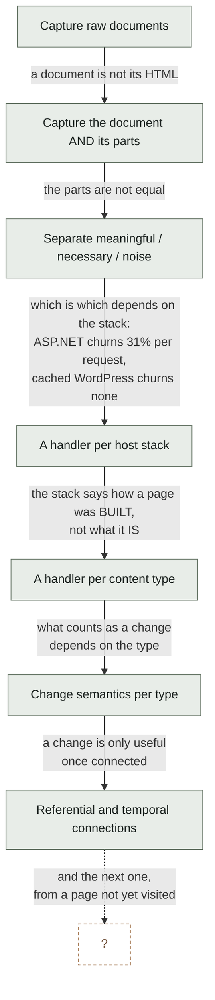
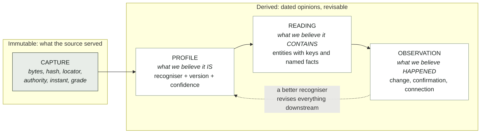
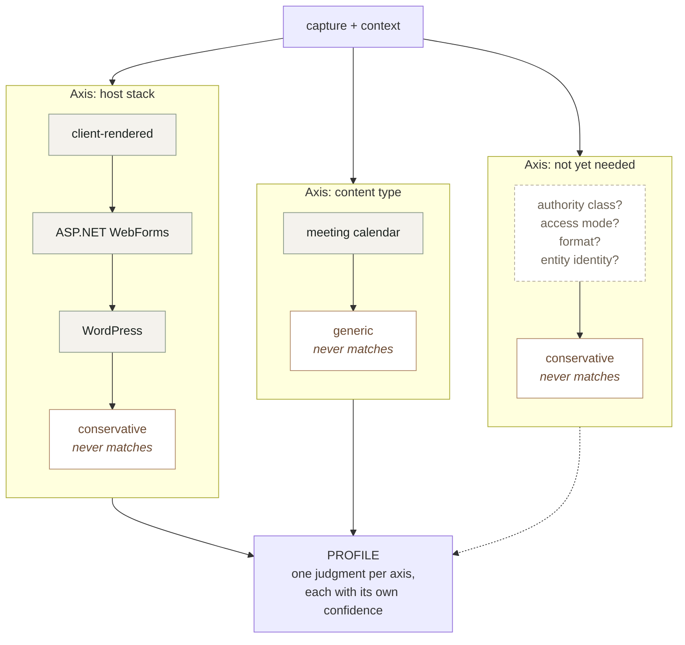
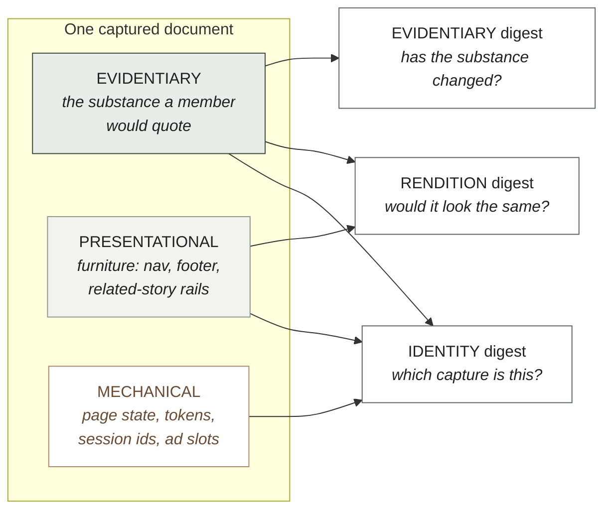
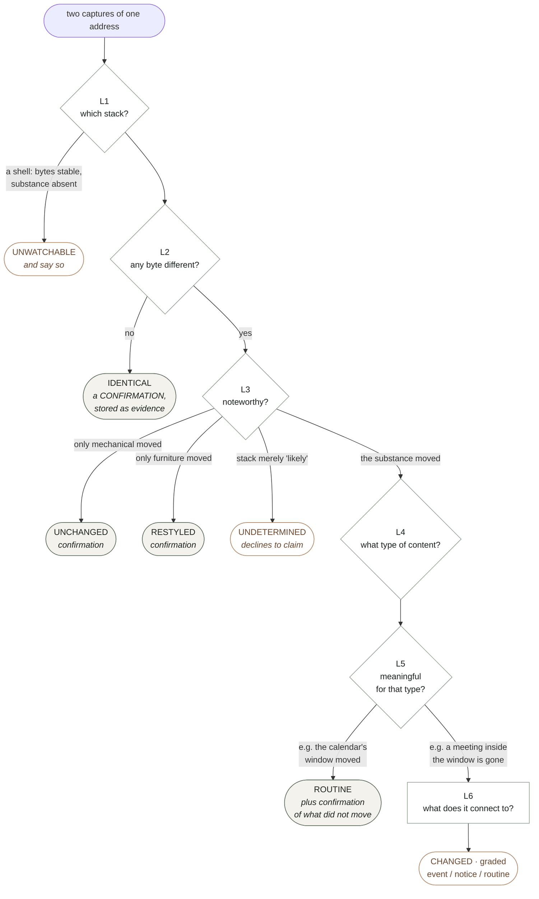
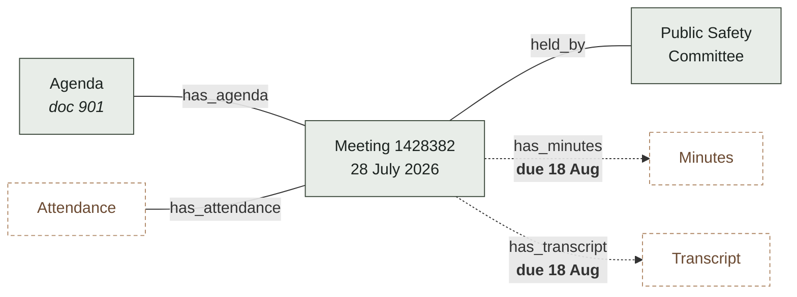
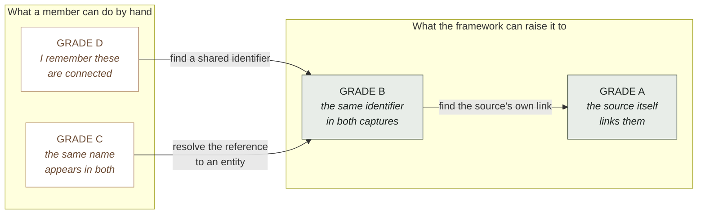

# BIO Content Framework

**Version 0.3 — 2026-07-30 — ARCHITECTURE APPROVED by Bob; Step 0 may begin**

Status: this is the framework document Bob called for after observing that the
development work had diffused across many elements at once. It supersedes nothing
yet; `docs/architecture/CONSTRUCTS.md` is the inventory and the evidence behind it,
and this is the shape those constructs should take.

Diagrams are Mermaid, which renders in GitHub and most Markdown viewers, and which
stays as text so it diffs like the rest of the document. All six were validated
against the Mermaid parser itself rather than eyeballed, since a diagram that fails
to render is worse than no diagram: it leaves a block of syntax where an explanation
should be.

Changelog:
- v0.3, 2026-07-30. Bob approved the architecture and restated BIO's purpose:
  supporting members in ALL aspects of case development. That exposed a gap, since
  every object in v0.2 was about documents and none was about cases. Adds §1.1 stating
  the purpose and the two success measures; promotes ENTITY to a core object in §3;
  adds §8.1, connection GRADE, on the model of capture grade, because Bob's phrase
  "improve the grade of connections" is the right one and grade already means
  something precise here; adds §9.1, the workload the framework is meant to remove;
  and moves entities-across-documents in §11 from "where this will bend" to the
  planned third axis. Ruling recorded: the upfront work is the full §4, not a
  deduplication.
- v0.2, 2026-07-30. Six diagrams added where a diagram carries what prose was
  labouring at: the evolution of the goal, the four core objects, the recogniser and
  registry shape that is the extensibility claim, regions against digests, the change
  cascade and its exits, and the two connection kinds over Bob's own meeting example.
  No change to the framework itself.
- v0.1, 2026-07-30. First draft. Pulls together the constructs discovered between
  0.36.0 and the 2026-07-30 UI sessions: document regions, three digests, host-stack
  handlers, content types, the layered change pipeline, monitoring contracts, and
  referential and temporal connections. Written to be extended rather than to be
  complete.

---

## 1. Why this document exists, and what it is FOR

The goal has moved six times in a few days, and every move was forced by something a
real page did rather than by a decision anyone made:

| We thought the job was | Then a page taught us |
| --- | --- |
| capture raw documents | a document is not its HTML: it needs its stylesheets and images to be the document the source served |
| capture a document and its parts | the parts are not equal. Some are meaningful, some are necessary for rendering, some are noise |
| separate meaningful from necessary from noise | which is which depends on the HOST STACK. ASP.NET churns 31% of its bytes per request; cached WordPress churns none |
| write a handler per host stack | the stack tells you how a page is BUILT, not what it IS. Change management needs to know it is looking at a calendar and not an article |
| write a handler per content type | what counts as a change depends on the type, and a calendar's window moves on its own |
| recognise change | change is only useful when connected: to related content, and to other moments in time |

That is not a story about six mistakes. It is a story about a domain that reveals
itself only on contact, and it is nowhere near finished. Sites yet unvisited will
have stacks, structures, content types and failure modes not listed anywhere below.

**So the measure of this framework is not coverage. It is the cost of absorbing the
next surprise.** Section 9 states that cost explicitly for each kind of new thing,
and that table is the framework's actual specification. Everything else exists to
keep those numbers small.

## 1.1 What this is FOR: case development

RULED by Bob, 2026-07-30. **BIO exists to support members in all aspects of case
development.** Every construct in this document is instrumental to that and none is
an end in itself. A capture nobody can build a case on is waste, however faithfully
it was hashed.

That has a consequence v0.2 missed. Every object in this framework was about
documents — capture, profile, reading, observation — and none was about the thing a
member is actually assembling. The framework described the machinery and not its
purpose, which is why entities and claims kept appearing in §11 as things that would
one day strain it. They are not strains. They are the top of the model and it was
missing.

### The two success measures

Also Bob's, and they are measurable rather than aspirational:

**1. Raise the GRADE of connections.** Connecting entities across documents is
ordinarily manual, and manual work of this kind is not merely slow: it is done from
memory and left incomplete, which means a case rests on connections a member believes
rather than connections the record can demonstrate. §8.1 grades them, and BIO's
contribution is converting connections a member would have asserted from knowledge
into connections the source itself asserted and the record holds both ends of.

**2. Reduce members' workload.** Named concretely in §9.1, because a framework that
cannot say which work it removes cannot be held to removing any.

These two pull in the same direction and that is not a coincidence: the work that is
most tedious for a member is exactly the work of chasing identifiers between
documents, and that is the work a machine can do at a higher grade than a person
reading by hand.

## 2. Invariants

The short list of things that have not changed across all six shifts and should not
change in the next six. A proposal that violates one of these is wrong, not novel.

1. **Raw bytes are never rewritten.** A capture's identity is the hash of exactly
   what the source served. Every classification, normalisation and judgment happens
   on copies and derived values.
2. **A classification is reversible and reclassifiable.** Chrome detection, volatile
   regions, document boundaries, content types: all are judgments with a basis and a
   date, never deletions.
3. **The failure asymmetry governs every default.** Reporting a change that did not
   happen costs a member attention. Failing to report one that did puts a false
   claim in the record, discovered — if ever — by the party the claim is aimed at.
   When uncertain, be noisy.
4. **A rule requires a measurement.** No pattern, region, type or expectation is
   written from what a document probably looks like. The comment above a rule names
   the page it was measured on.
5. **Uncertainty is carried, not resolved.** Every judgment records how sure it was
   and on what signal. Confidence below the bar changes the ANSWER, not just a log
   line.
6. **Technical complications are the system's problem.** The audience is
   non-technical and the workflow exists to remove them from logistics. A surface
   that asks a member to arbitrate a subrequest ceiling or a viewstate diff has
   failed, and it will feel like honesty while doing so.
7. **The negative result is a finding.** "Nothing changed" is dated first-party
   evidence, not the absence of news, and it must be stored rather than discarded.

## 3. The core objects

Only four, and every construct in the inventory is a property of one of them or a
function between them.

**CAPTURE.** Bytes, a hash, a locator, an authority, an instant, a grade. Immutable.
The thing the record holds.

**PROFILE.** What we believe a capture IS. Produced by recognisers (§4), recorded ON
the capture, versioned and confidence-bearing so that a later, better recogniser can
find and revise every judgment made by a worse one. A profile is not a fact about the
document; it is a dated opinion about it, and must be stored as such.

**READING.** What we believe a capture CONTAINS: entities with stable keys and named
facts, plus document-level facts such as a calendar's visible window. Produced by a
content type. Derived, cheap to recompute, never authoritative over the bytes.

**ENTITY.** A thing the case is about, which OUTLIVES any document that mentions it:
a person, a body, an ordinance, a parcel, a contract, a fund. Entities are what make a
case a case rather than a pile of captures. An entity has an identity, one or more
REFERENCES in readings that resolve to it, and a resolution confidence per reference
(§8.1). Crucially an entity is not extracted from a document; it is RESOLVED across
documents, and the resolution is a judgment with a grade like any other.

**OBSERVATION.** What we believe happened, between two captures or at one moment. A
change, a confirmation, or a connection. Always dated, always attributed to the
recogniser and reading that produced it.

The pipeline is just: capture → profile → reading → observation, with entities
resolved ACROSS readings and connections drawn between entities and documents. The
dashed edge is section 10 and it is what makes the framework safe to be wrong.

A **CASE** is then a selected, ordered set of entities, observations and connections
with a claim attached. Nothing in this document models a claim yet, and the
case-building rungs will need one; what matters here is that the objects a case is
built FROM are all present and graded.

## 4. One extension shape: the RECOGNISER

The inventory's worst finding was that we invented two confidence ladders, two diff
functions and three entry points in a day, because each new axis grew its own
apparatus. The fix is that every axis uses the same shape.

A **recogniser** answers one question about a capture and declares how sure it is:

    detect(ctx) -> { match, confidence, signals[] }
    version                      // so a judgment can be found when the rule improves
    key, label                   // machine name, and words for a member

One confidence ladder for all axes: `certain` (a signal only this thing produces),
`likely` (consistent but not conclusive), `possible`, `none`. **Confidence below
`certain` changes the answer**, per invariant 5: a recogniser that is merely likely
declines to narrow, and the conservative default applies.

A **recogniser registry** holds recognisers for one axis, ordered, most specific
first, first `certain` wins, with a fallback that never matches and is reached only
by falling through. The fallback is always the conservative one.

That is the whole extension mechanism. Adding a handler, a content type, or a member
of an axis nobody has thought of yet is the same act: write a recogniser, register
it.

Every box in every registry has the same interface. That is the whole claim: a third
axis is a third column, not a rewrite.

### The axes we know about

| Axis | Question | Registry | Members today |
| --- | --- | --- | --- |
| **stack** | how was this built? | `stacks` | client-rendered, ASP.NET WebForms, WordPress, conservative |
| **content type** | what is this? | `types` | meeting calendar, generic |

Two axes, and the framework treats "which axes exist" as itself extensible: a third
axis is a third registry of the same shape. Candidates already visible: **authority
class** (is this the issuing body's own publication or a mirror?), **access mode**
(public, paywalled, login-walled, rate-limited), **format** (HTML, PDF, dataset,
scanned image needing OCR).

## 5. A document's anatomy: regions and digests

**Three region kinds**, and the middle one is what a flat "volatile vs stable" model
kept getting wrong:

- **evidentiary** — the substance. What a member would quote or put before a council.
- **presentational** — furniture. Really on the page, captured and rendered, and not
  the document's claim about its own subject.
- **mechanical** — per-render machinery. Page state, security tokens, session ids,
  cache stamps, ad and analytics slots.

A stack recogniser declares regions in one of two shapes, and the second is
preferred:

- **pattern rules**, listing what to discount. Anything unlisted silently counts as
  substance.
- **a boundary**, naming the document itself. Anything outside it is furniture in one
  stroke, and a theme change cannot quietly reclassify substance. A boundary that
  does not match normalises NOTHING and records that it missed.

**Three digests**, because "would it look the same" and "has the substance changed"
are different questions and one hash cannot answer both:

| Digest | Normalises | Answers |
| --- | --- | --- |
| identity | nothing | which capture is this? |
| rendition | mechanical | would it look the same? |
| evidentiary | mechanical + presentational | has the substance changed? |

Measured: on `oakland.legistar.com/Calendar.aspx` the mechanical region is 115,980
bytes, 31.4% of the document, and the identity digest moves on every single fetch
because of it while the evidentiary digest does not move at all.

**Fidelity** is the claim the record can make about showing a capture: `faithful`,
`degraded` (only decoration missing, named on screen not hidden), `insufficient`
(render-critical missing, render refused). Which parts are render-critical is the
stack recogniser's judgment; under the conservative fallback all of them are.

## 6. Change: layers, and one entry point

Recognising change is layered, each layer cheap relative to the next and able to
settle the question. **One public function** — `assess(before, after, ctx)` — and
every result carries a trail recording where reasoning stopped, because a verdict
whose depth is invisible cannot be audited.

| Layer | Question | Settles when |
| --- | --- | --- |
| L1 | which stack? | never; nothing below is trustworthy without it |
| L2 | anything different at all? | identical bytes → a CONFIRMATION |
| L3 | is the difference noteworthy? | only mechanical, or only presentational, moved |
| L4 | what type of content? | never; selects who answers L5 |
| L5 | is the change meaningful for that type? | usually |
| L6 | what does it connect to? | terminal |

Most checks on a monitored source exit at L2 or L3, and every one of those exits
produces a confirmation rather than a shrug.

L2 is not a fast path. It is the layer that produces most of the system's evidence,
because on a monitored source most checks find nothing and invariant 7 says that is
a finding.

**Outcomes** are graded once and the boolean derived, never carried twice:

- `event` — a member should look.
- `notice` — recorded, shown on request.
- `routine` — the source doing its normal business.

Event types come from a **shared catalogue**, not from strings invented inside each
content type. The check catalogue already taught the plane this lesson; the second
content type would otherwise reinvent `removed` under a different name.

**Monitoring contract** is a property a content type declares, not a function of the
stack: `substance` for a record, `membership` for a list, `unmonitorable` for a shell
whose delivered bytes are stable and whose content is absent. Contract also sets the
expected check frequency, because a delisting is time-sensitive and a regulation is
not.

## 7. Content types: what a document contains, and what its changes mean

A content type is a recogniser (§4) plus three functions:

    parse(ctx)        -> reading: entities[] + document facts
    assess(a, b, ctx) -> observations: events[] + confirmation
    connections(a, b) -> connections[]

**Entities** carry a `key` that must be stable across fetches — an id in a URL is a
key, a position in a list is not — a `kind`, a `label` for a member, and named
`facts`. Named facts are what let an observation say WHICH thing moved rather than
that the entity differs, and they are why a diff should exist once.

**A reading that finds nothing is a failed reader, never an emptied document.** This
has already nearly produced a mass-delisting report and is the single most dangerous
error available to this layer.

**Document facts can make an absence expected.** A calendar's visible window is
relative to now, measured: "This Month". A meeting that scrolled out of range is not
a delisting, and no amount of care about bytes or regions can tell those apart,
because the distinction is about what a calendar IS.

## 8. Connections: referential and temporal, as DATA

Two kinds, not one, because people and their assistants reason about them
differently and the UI must show them apart:

**Referential** — two things are ABOUT each other. Followed to understand SCOPE.

**Temporal** — one thing happened after another and the sequence matters. Strictly
directional, followed to understand a STORY. Its most valuable form is an **absence
with a due date**: minutes that have not appeared three weeks after a meeting are a
fact about the body, not a gap in the record.

Bob's own example, drawn. Solid edges are referential and answer "what is this part
of"; dashed edges are temporal and answer "what should have happened by now".

The two dashed edges pointing at documents the record does not hold are the framework
at its most useful: not a gap in the record, but a dated fact about the body.

## 8.1 Connection GRADE

Bob's phrase was "improve the grade of connections overall", and grade already means
something exact in this system: a capture's grade states how its provenance was
established, not how much anyone likes it. A connection deserves the same treatment,
because a case is only as strong as the weakest link a member is relying on and today
nothing tells them which link that is.

Grade states **how the connection was established**, and nothing else:

| Grade | Established by | Example |
| --- | --- | --- |
| **A** | the SOURCE's own identifier, with both ends captured and hashed | `MeetingDetail.aspx?ID=1428382` links to `View.ashx?M=M&ID=801`: the publisher says these belong together and the record holds both |
| **B** | an identifier the source uses, matched exactly in captured content at both ends | an agenda item naming "Ordinance 13579" and a captured ordinance whose own number is 13579 |
| **C** | correspondence rather than identity: a name, a title, a date proximity | "Sheng Thao" in two documents. Plausible, never presented as established, and flagged for a member to confirm |
| **D** | asserted with no captured basis | a member's own knowledge, or a source that no longer serves the page. Recorded as testimony, with an author and a date |

Two things this is NOT. Grade is not credibility: a Grade D connection from a member
who was in the room may be the most valuable thing in a case, and it is labelled by
its author rather than discounted. And grade is not the same as `asserted_by`: the
author says who claims it, the grade says what would be needed to check it. A case
file shows both.

**The whole point is that grade is improvable.** A member's Grade C hunch that two
documents concern the same contract becomes Grade B the moment the system finds the
contract number in both, and Grade A if the source links them itself. Raising grade
is work a machine does well and a person does slowly, and it is the clearest thing
this framework can offer a case.

Entity resolution is therefore the grading mechanism for referential connections, and
that is why it is the planned third axis rather than a future concern: matching a
reference to an entity by a source-assigned identifier produces Grade A or B, while
matching by name produces Grade C, and the difference is the whole value.

### The connection table

Bob's requirement: a table mapping the connections to look for between content, used
by tasks actively looking for connections, and viewable and editable through a UI
surface. It is DATA in the record, not cases in a `switch`.

    from_kind    to_kind      relation                connection   timing
    meeting      agenda       has_agenda              referential  before the meeting
    meeting      attendees    has_attendance          referential  after
    meeting      minutes      has_minutes             temporal     after, within N days
    meeting      transcript   has_transcript          temporal     after, within N days
    meeting      body         held_by                 referential  —
    agenda_item  regulation   proposes_amendment_to   referential  —
    person       body         serves_on               referential  —

Three things the table forces, all of them decisions rather than code:

1. **`asserted_by` needs three values, not one.** `links_to` today means the SOURCE
   said so. A connection this table implies is asserted by the SYSTEM on a rule a
   member can edit. A member can also assert one directly. Three authors, three
   evidentiary weights.
2. **Rule and instance are different objects.** "Minutes follow a meeting within N
   days" is a row in this table. "The minutes for meeting 1428383 were due 8/18 and
   have not appeared" is an instance that has come due. The table holds rules;
   something else ages instances.
3. **A rule a member edits is a claim the group is making** about how its
   institutions ought to behave, and it belongs in the record with an author and a
   date like any other claim.

## 9. The cost of absorbing the next surprise

**This table is the framework's specification.** Every design choice above exists to
keep these numbers small, and a proposal that raises one of them needs to justify
itself.

| A new… | Should cost | Why that is achievable |
| --- | --- | --- |
| host stack | one recogniser file, one registry line | regions and digests are stack-independent |
| content type | one recogniser file, one registry line | the change pipeline and the event catalogue are type-independent |
| connection kind to look for | **one row of data**, no code | §8 makes the table data |
| region rule for a known stack | one entry in that stack's rule list | rules are declarative |
| event type | one entry in the shared catalogue | significance is graded centrally |
| **axis of variation** | one registry of the recogniser shape | §4 makes registries uniform |
| **invariant** | a framework revision | invariants are the thing that should be expensive |

The last two rows are the ones history says will actually be exercised. Six axes
appeared in a few days. The seventh should cost a registry, not a rewrite.

## 9.1 The workload this is meant to remove

Stated concretely, because a framework that cannot name the work it removes cannot be
held to removing any. Each row is work a member does today, by hand, from memory, and
usually incompletely.

| Work a member does by hand | What the framework does instead | Status |
| --- | --- | --- |
| finding the other documents that concern this person, body, ordinance or fund | resolve references to entities and hold the reverse index | needs the entity axis |
| noticing that a document which should exist does not | temporal connections with a due date | emitted, nothing ages them |
| keeping a timeline of what happened when | observations are dated by construction | partly; nothing assembles them |
| re-checking whether a source still says what it said | layered change assessment plus stored confirmations | built, plane has not adopted it |
| noticing a document quietly delisted or swapped | membership monitoring and the replaced/withdrawn events | built, plane has not adopted it |
| judging whether a capture can be shown as evidence | fidelity levels | built |
| judging whether two versions of a page differ meaningfully | three digests and the change layers | built |

Read down the status column and the priority is not a matter of taste: almost
everything is built and unadopted, and the one genuinely missing capability is the
entity axis, which is also the one carrying both success measures.

## 10. Provenance of judgments, so learning can revise

Every classification records: which recogniser, which version, what confidence, on
what signals, at what time, and what it normalised or extracted. Written onto the
capture, not held in memory.

This is what makes the framework safe to be wrong. When a stack recogniser turns out
to have mis-scoped a boundary, the record can be queried for every capture that
recogniser touched at that version, and every observation derived from it can be
recomputed. Without it, a bad rule silently poisons a growing body of conclusions and
there is no way to find them again.

**A recogniser's version is bumped whenever its judgment could change.** That is the
handle everything else hangs from.

## 11. Where this framework will bend

Entities that outlive documents WAS the first item on this list. It has been promoted
out of it: §1.1 makes it the framework's primary missing capability and §8.1 makes it
the grading mechanism for connections, so it is the planned third axis rather than a
future strain. The rest remain.

Stated so the bend is recognised as a bend and not as a bug:

- **Documents that are not pages.** PDFs, spreadsheets, scanned images. Regions and
  boundaries are HTML-shaped ideas; a PDF's evidentiary region is a page range or a
  table, and OCR introduces a confidence that is about READING rather than about
  recognition.
- **Documents assembled in a browser.** Recognised today and not capturable as
  evidence. Whatever captures them will produce a capture whose bytes never existed
  on the wire, which strains "raw bytes are what the source served".
- **Content types that overlap.** A meeting minutes document is also a record, an
  attendance list, and a set of votes. One type per document may not survive.
- **Change that is not between two captures of one address.** A regulation superseded
  by one at a different URL; a department renamed. Temporal connections gesture at
  this and do not yet model it.
- **Aggregate claims.** "The city moved $2.1m from the sewer fund" is a claim across
  documents. Nothing here models a claim as an object, and the case-building work
  will need one.

None of these needs solving now. They need to be visible so that the day one arrives,
the response is a registry entry and not a rewrite.
