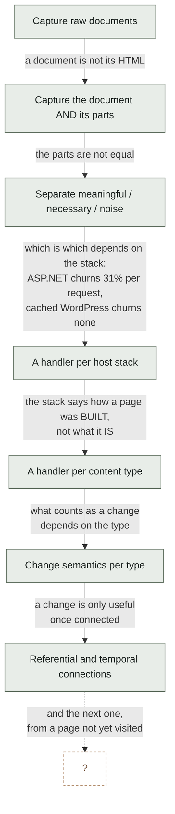
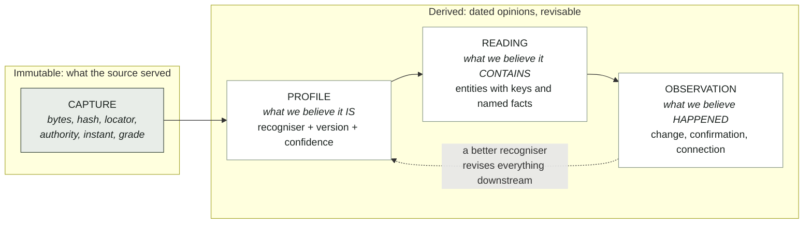
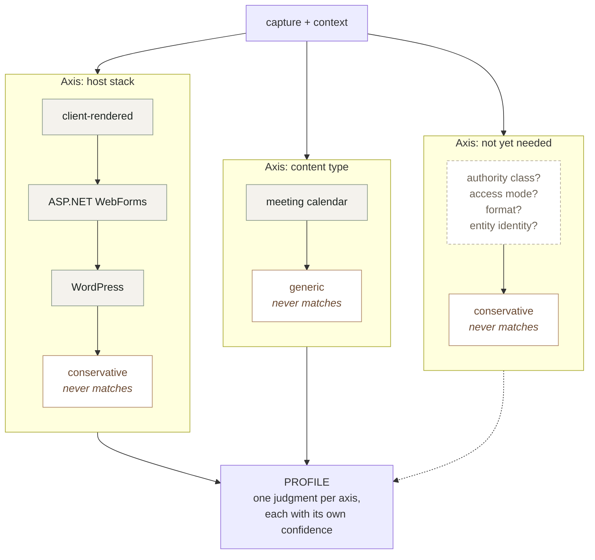
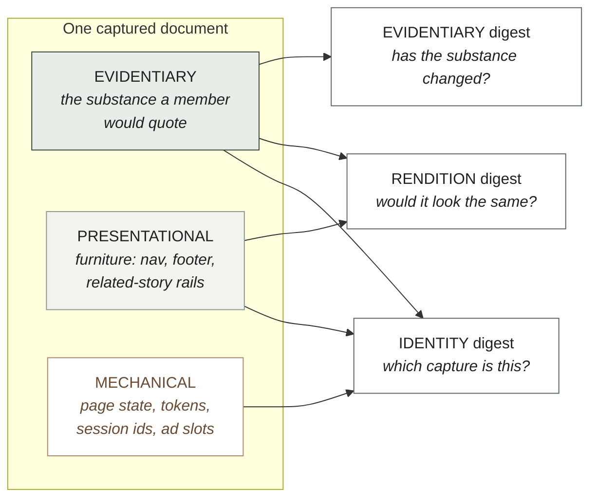
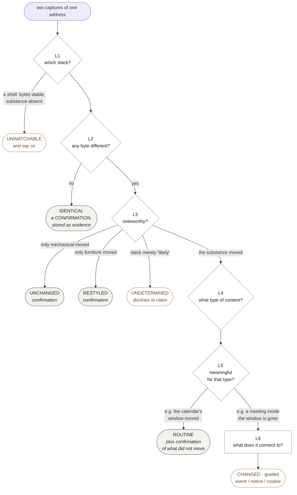
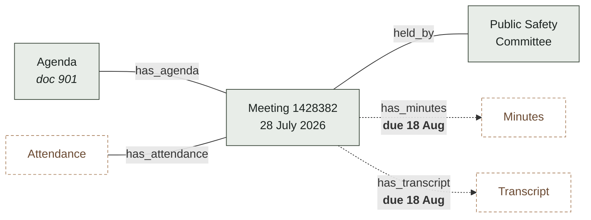
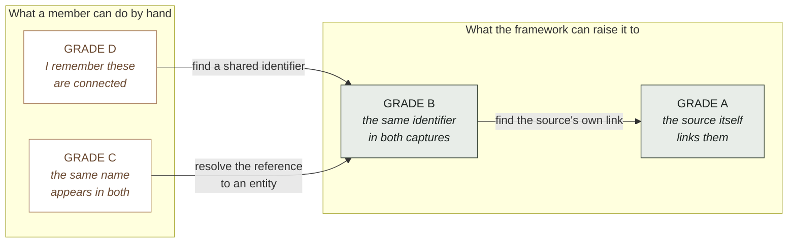
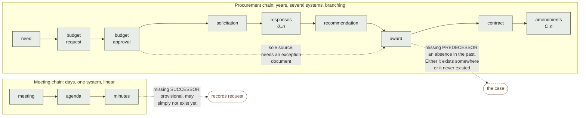
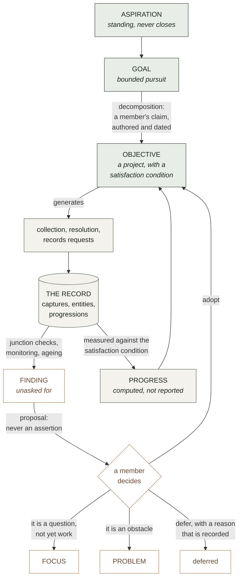
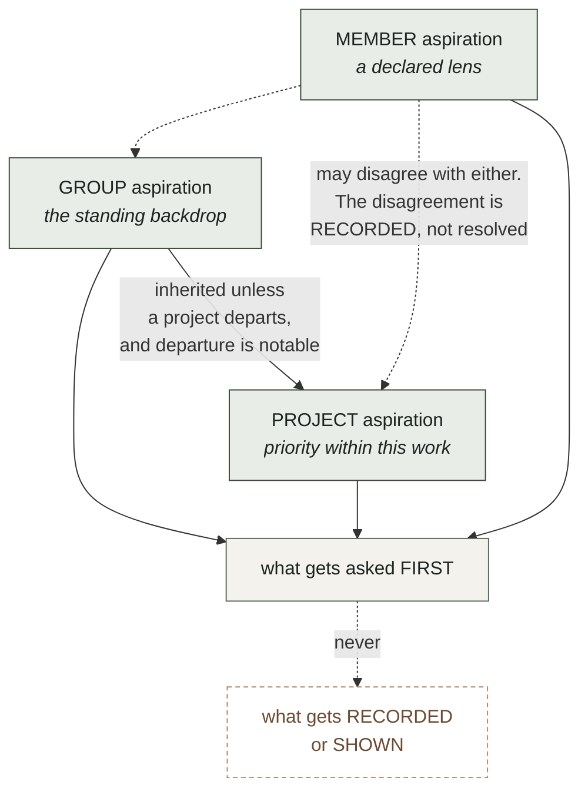

# BIO Content Framework

**Version 0.7 — 2026-07-30 — ARCHITECTURE APPROVED by Bob; Step 0 may begin**

Status: this is the framework document Bob called for after observing that the
development work had diffused across many elements at once. It supersedes nothing
yet; `docs/architecture/CONSTRUCTS.md` is the inventory and the evidence behind it,
and this is the shape those constructs should take.

Diagrams are Mermaid, which renders in GitHub and most Markdown viewers, and which
stays as text so it diffs like the rest of the document. All six were validated
against the Mermaid parser itself rather than eyeballed, since a diagram that fails
to render is worse than no diagram: it leaves a block of syntax where an explanation
should be.

Changelog:
- v0.7, 2026-07-30. Bob ruled that contradicting aspirations are WELCOMED, for two
  reasons that change the design rather than soften it: we may not realise that they
  contradict, and we learn from trying to achieve aspirations whether they are achieved
  or not. §12.1 is rewritten accordingly — the absence of an arbiter is now a
  deliberate position rather than an unfinished mechanism, what the system looks for is
  CONTACT between aspirations rather than semantic contradiction it cannot establish,
  and §12.2 adds the pursuit record, since learning that survives an unachieved
  aspiration has to live somewhere. Also ruled: an assistant-surfaced focus must LOOK
  like one.
- v0.6, 2026-07-30. Two rulings from Bob. An ASSISTANT MAY OPEN A FOCUS unattended,
  because that level of support is central to what BIO should offer and because a focus
  is informative and advisory rather than committing; §12 now says so, with the volume
  and ageing rules that unattended surfacing requires, and records that the check
  catalogue already permits `surfaced_by: agent` while both writers hardcode `human`.
  And an ASPIRATION IS SCOPED to the group, a project, or a member; §12.1 works through
  what each scope means, why conflicts between scopes are information rather than
  errors, and why a member-scoped aspiration is a declared lens in the sense
  `BIO_Declared_Bias_v0_1.md` already means.
- v0.5, 2026-07-30. Bob added the top of the model: the system must support humans and
  their AI assistants defining goals at a high level, turning them into objectives and
  aspirations, and working to achieve them AND everything discovered along the way.
  Adds §1.2, the two directions that must meet; §12, intent, which deliberately maps
  onto the existing focus / problem / project / action catalogue rather than inventing
  a parallel hierarchy, and which makes an objective's SATISFACTION CONDITION
  expressible in this framework's own vocabulary so that progress is computed from the
  record instead of asserted by whoever is doing the work; the discovery loop, by
  which a finding becomes a proposal and a member's adoption makes it an objective;
  and invariant 8, which is the guard against goal-directed work quietly becoming
  goal-directed collection.
- v0.4, 2026-07-30. Bob generalised the meeting chain: scheduled meeting to agenda to
  minutes is ONE form of connected data, and the system must be ready for many types
  of happenings and progressions, his example being need, budget request, budget
  approval, RFP, responses, award, signed contract. Adds §8.2, progressions as data,
  which generalises the connection table rather than sitting beside it; introduces the
  MISSING PREDECESSOR as a finding distinct from and often sharper than a missing
  successor; adds cardinality, exception documents, and junction checks; and adds §8.3
  on identifier spaces, since a progression that crosses source systems is where
  connection grade collapses and where the framework has to work hardest.
- v0.3, 2026-07-30. Bob approved the architecture and restated BIO's purpose:
  supporting members in ALL aspects of case development. That exposed a gap, since
  every object in v0.2 was about documents and none was about cases. Adds §1.1 stating
  the purpose and the two success measures; promotes ENTITY to a core object in §3;
  adds §8.1, connection GRADE, on the model of capture grade, because Bob's phrase
  "improve the grade of connections" is the right one and grade already means
  something precise here; adds §9.1, the workload the framework is meant to remove;
  and moves entities-across-documents in §11 from "where this will bend" to the
  planned third axis. Ruling recorded: the upfront work is the full §4, not a
  deduplication.
- v0.2, 2026-07-30. Six diagrams added where a diagram carries what prose was
  labouring at: the evolution of the goal, the four core objects, the recogniser and
  registry shape that is the extensibility claim, regions against digests, the change
  cascade and its exits, and the two connection kinds over Bob's own meeting example.
  No change to the framework itself.
- v0.1, 2026-07-30. First draft. Pulls together the constructs discovered between
  0.36.0 and the 2026-07-30 UI sessions: document regions, three digests, host-stack
  handlers, content types, the layered change pipeline, monitoring contracts, and
  referential and temporal connections. Written to be extended rather than to be
  complete.

---

## 1. Why this document exists, and what it is FOR

The goal has moved six times in a few days, and every move was forced by something a
real page did rather than by a decision anyone made:

| We thought the job was | Then a page taught us |
| --- | --- |
| capture raw documents | a document is not its HTML: it needs its stylesheets and images to be the document the source served |
| capture a document and its parts | the parts are not equal. Some are meaningful, some are necessary for rendering, some are noise |
| separate meaningful from necessary from noise | which is which depends on the HOST STACK. ASP.NET churns 31% of its bytes per request; cached WordPress churns none |
| write a handler per host stack | the stack tells you how a page is BUILT, not what it IS. Change management needs to know it is looking at a calendar and not an article |
| write a handler per content type | what counts as a change depends on the type, and a calendar's window moves on its own |
| recognise change | change is only useful when connected: to related content, and to other moments in time |

That is not a story about six mistakes. It is a story about a domain that reveals
itself only on contact, and it is nowhere near finished. Sites yet unvisited will
have stacks, structures, content types and failure modes not listed anywhere below.

**So the measure of this framework is not coverage. It is the cost of absorbing the
next surprise.** Section 9 states that cost explicitly for each kind of new thing,
and that table is the framework's actual specification. Everything else exists to
keep those numbers small.

## 1.1 What this is FOR: case development

RULED by Bob, 2026-07-30. **BIO exists to support members in all aspects of case
development.** Every construct in this document is instrumental to that and none is
an end in itself. A capture nobody can build a case on is waste, however faithfully
it was hashed.

That has a consequence v0.2 missed. Every object in this framework was about
documents — capture, profile, reading, observation — and none was about the thing a
member is actually assembling. The framework described the machinery and not its
purpose, which is why entities and claims kept appearing in §11 as things that would
one day strain it. They are not strains. They are the top of the model and it was
missing.

### Two directions, and where they must meet

Everything from §2 to §11 runs BOTTOM UP: bytes become a capture, a capture gets a
profile, a profile permits a reading, readings resolve to entities, entities thread
progressions, and junctions produce findings. That direction is driven by what the
sources happen to publish.

A member does not work that way. A member starts from something they want to be true
about their city and works DOWN: a goal becomes objectives, objectives become
collection and analysis, and the analysis is supposed to answer the question they
started with.

Both are necessary and neither subsumes the other. A purely bottom-up system produces
a beautifully graded pile nobody asked for. A purely top-down system collects only
what confirms the plan, which is worse. **§12 is about where they meet**, and the
meeting point is specific rather than philosophical: an objective states what would
satisfy it IN THIS FRAMEWORK'S OWN TERMS, so progress is computed from the record
rather than asserted by whoever is doing the work.

### The two success measures

Also Bob's, and they are measurable rather than aspirational:

**1. Raise the GRADE of connections.** Connecting entities across documents is
ordinarily manual, and manual work of this kind is not merely slow: it is done from
memory and left incomplete, which means a case rests on connections a member believes
rather than connections the record can demonstrate. §8.1 grades them, and BIO's
contribution is converting connections a member would have asserted from knowledge
into connections the source itself asserted and the record holds both ends of.

**2. Reduce members' workload.** Named concretely in §9.1, because a framework that
cannot say which work it removes cannot be held to removing any.

These two pull in the same direction and that is not a coincidence: the work that is
most tedious for a member is exactly the work of chasing identifiers between
documents, and that is the work a machine can do at a higher grade than a person
reading by hand.

## 2. Invariants

The short list of things that have not changed across all six shifts and should not
change in the next six. A proposal that violates one of these is wrong, not novel.

1. **Raw bytes are never rewritten.** A capture's identity is the hash of exactly
   what the source served. Every classification, normalisation and judgment happens
   on copies and derived values.
2. **A classification is reversible and reclassifiable.** Chrome detection, volatile
   regions, document boundaries, content types: all are judgments with a basis and a
   date, never deletions.
3. **The failure asymmetry governs every default.** Reporting a change that did not
   happen costs a member attention. Failing to report one that did puts a false
   claim in the record, discovered — if ever — by the party the claim is aimed at.
   When uncertain, be noisy.
4. **A rule requires a measurement.** No pattern, region, type or expectation is
   written from what a document probably looks like. The comment above a rule names
   the page it was measured on.
5. **Uncertainty is carried, not resolved.** Every judgment records how sure it was
   and on what signal. Confidence below the bar changes the ANSWER, not just a log
   line.
6. **Technical complications are the system's problem.** The audience is
   non-technical and the workflow exists to remove them from logistics. A surface
   that asks a member to arbitrate a subrequest ceiling or a viewstate diff has
   failed, and it will feel like honesty while doing so.
7. **Goal-directed work must not become goal-directed collection.** A goal may
   direct what is SOUGHT. It must never filter what is recorded, retained, or shown
   about what was found, and a finding that cuts against a goal is surfaced at least
   as prominently as one that supports it. This is the invariant that keeps a case
   from becoming a brief, and it is the one most likely to be violated by accident,
   because helpfulness looks exactly like it from the inside. See
   `BIO_Declared_Bias_v0_1.md`: the honest system makes the lens part of the record
   rather than pretending to be lensless.
8. **The negative result is a finding.** "Nothing changed" is dated first-party
   evidence, not the absence of news, and it must be stored rather than discarded.

## 3. The core objects

Only four, and every construct in the inventory is a property of one of them or a
function between them.

**CAPTURE.** Bytes, a hash, a locator, an authority, an instant, a grade. Immutable.
The thing the record holds.

**PROFILE.** What we believe a capture IS. Produced by recognisers (§4), recorded ON
the capture, versioned and confidence-bearing so that a later, better recogniser can
find and revise every judgment made by a worse one. A profile is not a fact about the
document; it is a dated opinion about it, and must be stored as such.

**READING.** What we believe a capture CONTAINS: entities with stable keys and named
facts, plus document-level facts such as a calendar's visible window. Produced by a
content type. Derived, cheap to recompute, never authoritative over the bytes.

**ENTITY.** A thing the case is about, which OUTLIVES any document that mentions it:
a person, a body, an ordinance, a parcel, a contract, a fund. Entities are what make a
case a case rather than a pile of captures. An entity has an identity, one or more
REFERENCES in readings that resolve to it, and a resolution confidence per reference
(§8.1). Crucially an entity is not extracted from a document; it is RESOLVED across
documents, and the resolution is a judgment with a grade like any other.

**OBSERVATION.** What we believe happened, between two captures or at one moment. A
change, a confirmation, or a connection. Always dated, always attributed to the
recogniser and reading that produced it.

The pipeline is just: capture → profile → reading → observation, with entities
resolved ACROSS readings and connections drawn between entities and documents. The
dashed edge is section 10 and it is what makes the framework safe to be wrong.

A **CASE** is then a selected, ordered set of entities, observations and connections
with a claim attached. Nothing in this document models a claim yet, and the
case-building rungs will need one; what matters here is that the objects a case is
built FROM are all present and graded.

## 4. One extension shape: the RECOGNISER

The inventory's worst finding was that we invented two confidence ladders, two diff
functions and three entry points in a day, because each new axis grew its own
apparatus. The fix is that every axis uses the same shape.

A **recogniser** answers one question about a capture and declares how sure it is:

    detect(ctx) -> { match, confidence, signals[] }
    version                      // so a judgment can be found when the rule improves
    key, label                   // machine name, and words for a member

One confidence ladder for all axes: `certain` (a signal only this thing produces),
`likely` (consistent but not conclusive), `possible`, `none`. **Confidence below
`certain` changes the answer**, per invariant 5: a recogniser that is merely likely
declines to narrow, and the conservative default applies.

A **recogniser registry** holds recognisers for one axis, ordered, most specific
first, first `certain` wins, with a fallback that never matches and is reached only
by falling through. The fallback is always the conservative one.

That is the whole extension mechanism. Adding a handler, a content type, or a member
of an axis nobody has thought of yet is the same act: write a recogniser, register
it.

Every box in every registry has the same interface. That is the whole claim: a third
axis is a third column, not a rewrite.

### The axes we know about

| Axis | Question | Registry | Members today |
| --- | --- | --- | --- |
| **stack** | how was this built? | `stacks` | client-rendered, ASP.NET WebForms, WordPress, conservative |
| **content type** | what is this? | `types` | meeting calendar, generic |

Two axes, and the framework treats "which axes exist" as itself extensible: a third
axis is a third registry of the same shape. Candidates already visible: **authority
class** (is this the issuing body's own publication or a mirror?), **access mode**
(public, paywalled, login-walled, rate-limited), **format** (HTML, PDF, dataset,
scanned image needing OCR).

## 5. A document's anatomy: regions and digests

**Three region kinds**, and the middle one is what a flat "volatile vs stable" model
kept getting wrong:

- **evidentiary** — the substance. What a member would quote or put before a council.
- **presentational** — furniture. Really on the page, captured and rendered, and not
  the document's claim about its own subject.
- **mechanical** — per-render machinery. Page state, security tokens, session ids,
  cache stamps, ad and analytics slots.

A stack recogniser declares regions in one of two shapes, and the second is
preferred:

- **pattern rules**, listing what to discount. Anything unlisted silently counts as
  substance.
- **a boundary**, naming the document itself. Anything outside it is furniture in one
  stroke, and a theme change cannot quietly reclassify substance. A boundary that
  does not match normalises NOTHING and records that it missed.

**Three digests**, because "would it look the same" and "has the substance changed"
are different questions and one hash cannot answer both:

| Digest | Normalises | Answers |
| --- | --- | --- |
| identity | nothing | which capture is this? |
| rendition | mechanical | would it look the same? |
| evidentiary | mechanical + presentational | has the substance changed? |

Measured: on `oakland.legistar.com/Calendar.aspx` the mechanical region is 115,980
bytes, 31.4% of the document, and the identity digest moves on every single fetch
because of it while the evidentiary digest does not move at all.

**Fidelity** is the claim the record can make about showing a capture: `faithful`,
`degraded` (only decoration missing, named on screen not hidden), `insufficient`
(render-critical missing, render refused). Which parts are render-critical is the
stack recogniser's judgment; under the conservative fallback all of them are.

## 6. Change: layers, and one entry point

Recognising change is layered, each layer cheap relative to the next and able to
settle the question. **One public function** — `assess(before, after, ctx)` — and
every result carries a trail recording where reasoning stopped, because a verdict
whose depth is invisible cannot be audited.

| Layer | Question | Settles when |
| --- | --- | --- |
| L1 | which stack? | never; nothing below is trustworthy without it |
| L2 | anything different at all? | identical bytes → a CONFIRMATION |
| L3 | is the difference noteworthy? | only mechanical, or only presentational, moved |
| L4 | what type of content? | never; selects who answers L5 |
| L5 | is the change meaningful for that type? | usually |
| L6 | what does it connect to? | terminal |

Most checks on a monitored source exit at L2 or L3, and every one of those exits
produces a confirmation rather than a shrug.

L2 is not a fast path. It is the layer that produces most of the system's evidence,
because on a monitored source most checks find nothing and invariant 7 says that is
a finding.

**Outcomes** are graded once and the boolean derived, never carried twice:

- `event` — a member should look.
- `notice` — recorded, shown on request.
- `routine` — the source doing its normal business.

Event types come from a **shared catalogue**, not from strings invented inside each
content type. The check catalogue already taught the plane this lesson; the second
content type would otherwise reinvent `removed` under a different name.

**Monitoring contract** is a property a content type declares, not a function of the
stack: `substance` for a record, `membership` for a list, `unmonitorable` for a shell
whose delivered bytes are stable and whose content is absent. Contract also sets the
expected check frequency, because a delisting is time-sensitive and a regulation is
not.

## 7. Content types: what a document contains, and what its changes mean

A content type is a recogniser (§4) plus three functions:

    parse(ctx)        -> reading: entities[] + document facts
    assess(a, b, ctx) -> observations: events[] + confirmation
    connections(a, b) -> connections[]

**Entities** carry a `key` that must be stable across fetches — an id in a URL is a
key, a position in a list is not — a `kind`, a `label` for a member, and named
`facts`. Named facts are what let an observation say WHICH thing moved rather than
that the entity differs, and they are why a diff should exist once.

**A reading that finds nothing is a failed reader, never an emptied document.** This
has already nearly produced a mass-delisting report and is the single most dangerous
error available to this layer.

**Document facts can make an absence expected.** A calendar's visible window is
relative to now, measured: "This Month". A meeting that scrolled out of range is not
a delisting, and no amount of care about bytes or regions can tell those apart,
because the distinction is about what a calendar IS.

## 8. Connections: referential and temporal, as DATA

Two kinds, not one, because people and their assistants reason about them
differently and the UI must show them apart:

**Referential** — two things are ABOUT each other. Followed to understand SCOPE.

**Temporal** — one thing happened after another and the sequence matters. Strictly
directional, followed to understand a STORY. Its most valuable form is an **absence
with a due date**: minutes that have not appeared three weeks after a meeting are a
fact about the body, not a gap in the record.

Bob's own example, drawn. Solid edges are referential and answer "what is this part
of"; dashed edges are temporal and answer "what should have happened by now".

The two dashed edges pointing at documents the record does not hold are the framework
at its most useful: not a gap in the record, but a dated fact about the body.

## 8.1 Connection GRADE

Bob's phrase was "improve the grade of connections overall", and grade already means
something exact in this system: a capture's grade states how its provenance was
established, not how much anyone likes it. A connection deserves the same treatment,
because a case is only as strong as the weakest link a member is relying on and today
nothing tells them which link that is.

Grade states **how the connection was established**, and nothing else:

| Grade | Established by | Example |
| --- | --- | --- |
| **A** | the SOURCE's own identifier, with both ends captured and hashed | `MeetingDetail.aspx?ID=1428382` links to `View.ashx?M=M&ID=801`: the publisher says these belong together and the record holds both |
| **B** | an identifier the source uses, matched exactly in captured content at both ends | an agenda item naming "Ordinance 13579" and a captured ordinance whose own number is 13579 |
| **C** | correspondence rather than identity: a name, a title, a date proximity | "Sheng Thao" in two documents. Plausible, never presented as established, and flagged for a member to confirm |
| **D** | asserted with no captured basis | a member's own knowledge, or a source that no longer serves the page. Recorded as testimony, with an author and a date |

Two things this is NOT. Grade is not credibility: a Grade D connection from a member
who was in the room may be the most valuable thing in a case, and it is labelled by
its author rather than discounted. And grade is not the same as `asserted_by`: the
author says who claims it, the grade says what would be needed to check it. A case
file shows both.

**The whole point is that grade is improvable.** A member's Grade C hunch that two
documents concern the same contract becomes Grade B the moment the system finds the
contract number in both, and Grade A if the source links them itself. Raising grade
is work a machine does well and a person does slowly, and it is the clearest thing
this framework can offer a case.

Entity resolution is therefore the grading mechanism for referential connections, and
that is why it is the planned third axis rather than a future concern: matching a
reference to an entity by a source-assigned identifier produces Grade A or B, while
matching by name produces Grade C, and the difference is the whole value.

### The connection table

Bob's requirement: a table mapping the connections to look for between content, used
by tasks actively looking for connections, and viewable and editable through a UI
surface. It is DATA in the record, not cases in a `switch`.

    from_kind    to_kind      relation                connection   timing
    meeting      agenda       has_agenda              referential  before the meeting
    meeting      attendees    has_attendance          referential  after
    meeting      minutes      has_minutes             temporal     after, within N days
    meeting      transcript   has_transcript          temporal     after, within N days
    meeting      body         held_by                 referential  —
    agenda_item  regulation   proposes_amendment_to   referential  —
    person       body         serves_on               referential  —

Three things the table forces, all of them decisions rather than code:

1. **`asserted_by` needs three values, not one.** `links_to` today means the SOURCE
   said so. A connection this table implies is asserted by the SYSTEM on a rule a
   member can edit. A member can also assert one directly. Three authors, three
   evidentiary weights.
2. **Rule and instance are different objects.** "Minutes follow a meeting within N
   days" is a row in this table. "The minutes for meeting 1428383 were due 8/18 and
   have not appeared" is an instance that has come due. The table holds rules;
   something else ages instances.
3. **A rule a member edits is a claim the group is making** about how its
   institutions ought to behave, and it belongs in the record with an author and a
   date like any other claim.

## 9. The cost of absorbing the next surprise

**This table is the framework's specification.** Every design choice above exists to
keep these numbers small, and a proposal that raises one of them needs to justify
itself.

| A new… | Should cost | Why that is achievable |
| --- | --- | --- |
| host stack | one recogniser file, one registry line | regions and digests are stack-independent |
| content type | one recogniser file, one registry line | the change pipeline and the event catalogue are type-independent |
| connection kind to look for | **one row of data**, no code | §8 makes the table data |
| region rule for a known stack | one entry in that stack's rule list | rules are declarative |
| event type | one entry in the shared catalogue | significance is graded centrally |
| **axis of variation** | one registry of the recogniser shape | §4 makes registries uniform |
| **invariant** | a framework revision | invariants are the thing that should be expensive |

The last two rows are the ones history says will actually be exercised. Six axes
appeared in a few days. The seventh should cost a registry, not a rewrite.

## 8.2 Progressions: the many shapes a happening takes

RULED by Bob, 2026-07-30. The meeting chain — scheduled meeting, agenda, attendance,
minutes — is ONE form of connected data and not the general case. His example of
another: a mention of a need, a budget request, a budget approval, an RFP, responses
to it, a contract award, a signed contract with terms, and onward through amendments
and payments. The system must be ready for many types of happenings and progressions.

The two differ in almost every dimension, which is what makes the generalisation
worth making rather than assuming:

| | meeting chain | procurement chain |
| --- | --- | --- |
| span | days | months to years |
| bodies | one | department, council, contractor |
| source systems | one | often three or four |
| stages | 3 to 4 | 8 to 12 |
| shape | linear | branching, with one-to-many and legitimate skips |
| what is usually missing | the SUCCESSOR: minutes not yet posted | the PREDECESSOR: an award with no solicitation |

That last row is the important one and it is a new construct.

### The missing predecessor

A temporal connection so far has meant an expected successor: minutes are due after a
meeting. Bob's example inverts it. A signed contract implies an award; an award
implies a solicitation or a documented reason there was none; a budget approval
implies a request. **When a later stage exists and an earlier one does not, that is a
finding, and it is usually sharper than a missing successor**, because late minutes
are an administrative lapse while an award with no solicitation is a question about
how public money was committed.

It is also epistemically stronger. A missing successor might simply not have happened
yet; the absence is provisional. A missing predecessor is an absence in the past,
where the document either exists somewhere or does not exist at all, and either answer
is worth having. The first is a records request; the second is the case.

### The progression table

A generalisation of the connection table in §8.3, not a second table beside it. A
connection row is a progression of two stages; nothing needs both.

    progression: procurement
    stage  key            typical content        after      cardinality  within    required
    1      need           staff report           —          0..n         —         sometimes
    2      budget_request budget document        need        0..n         —         usually
    3      budget_approval council action        request     1            1 year    always
    4      solicitation   RFP / RFQ / IFB        approval    0..1         —         unless exception
    5      responses      bid list / proposals   solicitation 0..n        by due date usually
    6      recommendation staff report           responses   0..1         —         usually
    7      award          council resolution     recommendation 1         —         always
    8      contract       signed agreement       award        1           90 days   always
    9      amendment      change order           contract     0..n        —         never

Each row carries what the rules need and nothing more:

- **after** — the stage this one presupposes. Read forwards it predicts; read
  backwards it accuses.
- **cardinality** — `1`, `0..1`, `0..n`. An RFP has many responses; an award has one
  contract. Cardinality is where several of the sharpest questions live.
- **within** — the interval that makes an absence overdue rather than pending.
- **required** — `always`, `usually`, `sometimes`, `never`, and the crucial
  `unless exception`.

### Legitimate skips need an exception document

A sole-source award skips the solicitation stage lawfully, and the thing that makes it
lawful is a justification the institution is supposed to publish. So a skipped stage
is not automatically a finding: **a skipped stage with no exception document is.** The
table records which document discharges which skip, and the framework's question
becomes not "why is this missing" but "where is the document that says it may be
missing", which is a question with a records-request answer.

### Junction checks

A progression's value is concentrated at its junctions, and these are the questions a
member is trying to answer anyway:

- an **award with no solicitation** and no exception document
- a solicitation with **exactly one response**, which is lawful and interesting
- a **signed amount that differs from the awarded amount**
- **amendments accumulating** past a threshold of the original
- **payments past the contract term**
- a **budget approval with no traceable request**

Junction checks are rules over a progression instance, they are DATA like the table,
and they are the point at which this framework stops describing documents and starts
supporting a case.

### Progressions are threaded by entities

An instance of a progression is assembled by following an entity: a contract number, a
project identifier, a parcel, a fund. That is why the entity axis is Step 4 and the
progression table is Step 5 and not the other way round. It also means a progression
instance inherits the WEAKEST connection grade along its chain, and a case built on it
should say so, because a nine-stage chain assembled by name correspondence is not
evidence of anything.

## 8.3 Identifier spaces, and where grade collapses

A progression that stays inside one system can reach Grade A, because that system
assigns identifiers and links its own stages: Legistar does this for legislation. A
progression that crosses systems usually cannot, because a procurement portal, a
finance system and a legislative record each maintain their own identifier space and
none of them links to the others.

This is where connection grade collapses to C, and it is where the framework has to
work hardest, because it is also where the most consequential progressions live.

The lever is that institutions DO reuse certain identifiers across their systems, and
finding which ones is empirical work exactly like measuring a stack:

- a contract or purchase order number
- a project or capital improvement number
- a resolution or ordinance number
- an APN for a parcel
- a fund or account code

Each such identifier, once found in two systems, converts an entire progression from
Grade C to Grade B. **Discovering an institution's shared identifiers is therefore one
of the highest-value pieces of measurement this project can do**, and it should be
recorded per institution the way stack measurements are recorded per host. Oakland's
shared identifiers have not been measured.

## 9.1 The workload this is meant to remove

Stated concretely, because a framework that cannot name the work it removes cannot be
held to removing any. Each row is work a member does today, by hand, from memory, and
usually incompletely.

| Work a member does by hand | What the framework does instead | Status |
| --- | --- | --- |
| finding the other documents that concern this person, body, ordinance or fund | resolve references to entities and hold the reverse index | needs the entity axis |
| assembling a procurement or legislative chain from end to end | progression instances threaded by an entity | needs the entity axis and the progression table |
| noticing that a stage of such a chain was skipped without justification | missing-predecessor findings and exception documents | designed, not built |
| noticing that a document which should exist does not | temporal connections with a due date | emitted, nothing ages them |
| keeping a timeline of what happened when | observations are dated by construction | partly; nothing assembles them |
| re-checking whether a source still says what it said | layered change assessment plus stored confirmations | built, plane has not adopted it |
| noticing a document quietly delisted or swapped | membership monitoring and the replaced/withdrawn events | built, plane has not adopted it |
| judging whether a capture can be shown as evidence | fidelity levels | built |
| judging whether two versions of a page differ meaningfully | three digests and the change layers | built |

Read down the status column and the priority is not a matter of taste: almost
everything is built and unadopted, and the one genuinely missing capability is the
entity axis, which is also the one carrying both success measures.

## 12. Intent: goals, objectives, aspirations, and the discovery loop

RULED by Bob, 2026-07-30. The system must support humans and their AI assistants
defining goals at a high level, turning them into objectives and aspirations, and
working to achieve the goals **and everything discovered along the way**.

### Three things, and they behave differently

| | closes? | what it does | example |
| --- | --- | --- | --- |
| **Aspiration** | never | sets standing priority and shapes judgment | "Oakland's procurement should be traceable end to end" |
| **Goal** | eventually, maybe in years | bounds a pursuit | "Account for the sewer fund transfers, FY2019 to FY2026" |
| **Objective** | yes, checkably | states a condition the record can be measured against | "Hold a Grade B or better progression instance for every contract over $250k drawn on fund 3100 since FY2019" |

Conflating these is the ordinary failure. An aspiration written as an objective is
never finished and demoralises; an objective written as an aspiration is never
checked and quietly abandons itself.

### This is not a new hierarchy

The record already has the object types this needs, and the framework's job is to
CONNECT to them rather than to invent a parallel set:

- an **objective** is what a `project` carries; the catalogue already gives a project
  an `objective` field and the states `forming → investigating → matured → closed`
- an open question is a `focus`, with `surfaced → elevated → deferred → dismissed`
- a discovered obstacle is a `problem`, with the same states
- a step someone takes is an `action`, with `planned → active → awaiting_response →
  resolved → abandoned`

**Aspiration and goal are the two that do not exist yet.** Everything below them does.
That is the honest summary of the gap: this framework was written for six sections
without ever touching the catalogue that already models intent, and the connection has
to be made in both directions.

### Satisfaction conditions: the meeting point

This is the load-bearing idea of the section. **An objective states what would satisfy
it in the vocabulary of this framework**, which makes progress computable:

    objective: every contract over $250k on fund 3100 since FY2019
               is held as a progression instance at Grade B or better
    expressed as:
      entity        fund 3100
      progression   procurement
      filter        award amount > 250000, award date >= 2019-07-01
      required      instance grade >= B, stages 3..8 present
      satisfied     when 100% of matched instances meet it

Three consequences, all of them the point:

1. **Progress is derived, not reported.** "41 of 58 contracts are at Grade B; 12 are
   Grade C for want of a shared identifier; 5 have no solicitation and no exception
   document" is computed from the record. Nobody has to be trusted to say how it is
   going.
2. **The gaps are the work list.** The 12 Grade C instances name exactly what
   measurement would raise them, and the 5 missing solicitations are records requests
   with the request already specified.
3. **An AI assistant can be checked.** An assistant working an objective produces
   captures, resolutions and proposals, all of which carry provenance and grade, so
   its contribution is auditable in the same terms as anyone's.

### The discovery loop: "everything discovered along the way"

The framework generates findings that nobody asked for: a delisted meeting, an award
with no solicitation, a contract amended past its original value. Bob's phrase makes
these first-class rather than noise, and the loop has to be explicit or they are lost:

The rules that make the loop safe:

- **A finding is a PROPOSAL, never an assertion.** It arrives with its grade and its
  basis, and it becomes part of the plan only when a member adopts it. Adoption is an
  authored, dated act like any other claim.
- **A deferral is recorded with its reason.** "Not now" is a decision about the case
  and belongs in the record; a finding that silently disappears is indistinguishable
  from one that was never made.
- **A finding that contradicts the goal takes the same path.** Invariant 7 exists
  because this is the step where a case turns into a brief, and it turns by omission
  rather than by decision.
- **An assistant may propose at any point in the loop and adopt at none of them.**
  It can draft the decomposition, run the junction checks, assemble the progression
  and write the records request. The member's adoption is what makes any of it the
  group's position.

### An assistant may open a focus unattended

RULED by Bob, 2026-07-30. This level of support is central to what a member should
expect from BIO, and it is safe for a specific structural reason: **a focus is
informative, advisory and supportive of a project's development. It commits nobody.**
Its states are `surfaced → elevated → deferred → dismissed`, and `surfaced` means
precisely "noticed, not yet judged".

The catalogue anticipated this. C-2.8 already permits `surfaced_by` to be `agent` or
`human`, and both writers in the codebase hardcode `human`, so the doctrine was
allowed for at the check level years before any surface could express it.

What stays a member's act, and the line is exactly where advisory ends:

| act | who | why |
| --- | --- | --- |
| open a focus at `surfaced` | assistant or member | advisory; commits nobody |
| **elevate** a focus | member only | elevation is the group taking a question seriously |
| open a `problem` | assistant or member | also advisory: an obstacle noticed is not an obstacle accepted |
| **adopt into an objective** | member only | this makes it the group's work |
| dismiss | member only | dismissal is a judgment about the question |

Unattended surfacing needs two disciplines it would not need from a human, because a
machine can produce hundreds where a person produces one:

- **Aggregate, do not multiply.** One junction check firing across 58 contracts is ONE
  focus with 58 instances, not 58 focuses. A focus is a question, and "why do these 58
  awards have no solicitation" is one question. Getting this wrong does not corrupt the
  record; it drowns it, which for an advisory object is the same failure.
- **Age rather than vanish.** A machine-surfaced focus nobody has acted on after some
  interval moves to `deferred` with the reason recorded — "surfaced by assistant, no
  member acted within N days" — and never silently disappears. A finding that
  disappears is indistinguishable from one that was never made, and that rule does not
  relax because the finder was a machine.

**An assistant-surfaced focus must LOOK like one.** RULED by Bob, 2026-07-30. The
record carries `surfaced_by: agent` either way; the ruling is that the surface has to
communicate it too. This is not a discount applied to the question. A good question
stands on its merits whoever asked it, and a member weighing one needs to know that
nobody has yet judged it worth asking — which is precisely the difference between a
machine noticing a pattern and a member deciding it matters. Marking it is what lets a
member give it the reading it deserves rather than assuming a colleague already
thought it through.

Invariant 7 binds harder here, not less. An assistant that can surface unattended must
surface the findings that cut against the goal on exactly the same terms as the ones
that support it, and being unattended is what removes the human who would otherwise
have noticed the omission.

## 12.1 Aspirations are scoped

RULED by Bob, 2026-07-30: an aspiration may be scoped at the group, the project, or
the member level.

| scope | whose commitment | what it shapes | changing it |
| --- | --- | --- | --- |
| **group** | the collective's standing position | the default backdrop for all work | a group act, with the weight that implies |
| **project** | this line of work | priority within the project, for everyone working it | the project's own record |
| **member** | this person's lens | that member's queue and attention | theirs alone, and visible |

Three consequences worth stating because each could be got wrong quietly.

**A project inherits the group's aspirations unless it declares otherwise, and
declaring otherwise is notable.** A project that departs from a group commitment is
making a statement about the work, and it should read as one rather than as
configuration.

**Contradicting aspirations are WELCOMED.** RULED by Bob, 2026-07-30, and for two
reasons that are stronger than tolerance:

- **We may not realise that they contradict.** The contradiction is the discovery. A
  group that finds two of its own commitments pulling apart has learned something
  about itself that no amount of planning would have produced, and the system's job is
  to make that visible rather than to prevent it.
- **We learn from trying to achieve aspirations whether they are achieved or not.**
  An aspiration is not a task that succeeds or fails. Pursuing one produces knowledge
  regardless of the outcome, which means an aspiration that is never achieved can
  still have been worth holding, and §12.2 gives that knowledge somewhere to live.

So there is **no arbiter and no precedence, by design rather than by omission**.
Narrower scope does not override wider; aspirations coexist; a member whose aspiration
pulls against the group's is a fact about the group and not a configuration error. A
system that silently let the narrower win would let one member quietly redirect a
group's work by writing a preference, and one that forced resolution would suppress
exactly the discovery Bob is pointing at.

**What the system looks for is CONTACT, not contradiction.** Judging whether two
prose commitments contradict each other is not something this framework can establish,
and inventing a verdict it cannot support would violate invariant 5. What it can
establish is that two aspirations are in contact: they direct work at the same
entities, they touch the same progressions, or they order the same queue differently.
Contact is detectable and is worth surfacing. Whether the contact is a contradiction,
a tension worth living with, or a misunderstanding is a human judgment, and the system
presents the evidence for it in the same terms as any other finding.

**A member-scoped aspiration is a declared lens.** This is the same construct
`BIO_Declared_Bias_v0_1.md` describes: bias is real and the most dangerous bias is the
denied one, so the honest system makes the lens part of the record. A member
declaring "I am pursuing the sewer fund because I believe the transfers were
improper" has done exactly what that doctrine asks, and the declaration travels with
the work done under it. Scoping aspirations to members is therefore not a convenience
feature; it is where declared bias gets a home in the architecture.

## 12.2 The pursuit record

Follows directly from Bob's second reason. If we learn from trying to achieve an
aspiration whether or not it is achieved, the learning has to survive somewhere, and
an object that never closes has no natural moment at which anyone writes down what it
taught.

So an aspiration accumulates a **pursuit record**: the objectives opened under it, the
findings adopted and deferred, the records requests made and what came back, the
measurements taken, and the dead ends. Three properties matter:

- **A dead end is kept.** "We assumed the fund code would appear in the procurement
  portal and it does not" is the kind of thing every member relearns individually and
  nobody writes down. It is also exactly the kind of thing that makes the next
  member's work cheaper.
- **It is not a progress bar.** An aspiration has no completion, so the record shows
  what was attempted and learned rather than how far along it is. Objectives beneath
  it have satisfaction conditions and derived progress; the aspiration itself does not.
- **It survives abandonment.** An aspiration set down after two years of work leaves
  its pursuit record behind, and the record is the point. Retiring an aspiration should
  therefore be an act that captures what it taught, not one that archives a folder.

Aspirations set PRIORITY and never filter evidence. Invariant 7 applies to them with
full force: an aspiration may shape which questions get asked first, and it may not
shape which answers get recorded or shown.

### What is deliberately not modelled yet

A **claim** — "the city moved $2.1m from the sewer fund without authorisation" — is
what a case ultimately asserts, and it is neither an objective nor a finding. It is
the thing the objectives were in service of. §11 has listed it as unmodelled since
v0.1 and it stays unmodelled here, because a claim needs a standard of proof attached
and that is doctrine rather than architecture. It is the next design conversation, not
this one.

## 10. Provenance of judgments, so learning can revise

Every classification records: which recogniser, which version, what confidence, on
what signals, at what time, and what it normalised or extracted. Written onto the
capture, not held in memory.

This is what makes the framework safe to be wrong. When a stack recogniser turns out
to have mis-scoped a boundary, the record can be queried for every capture that
recogniser touched at that version, and every observation derived from it can be
recomputed. Without it, a bad rule silently poisons a growing body of conclusions and
there is no way to find them again.

**A recogniser's version is bumped whenever its judgment could change.** That is the
handle everything else hangs from.

## 11. Where this framework will bend

Entities that outlive documents WAS the first item on this list. It has been promoted
out of it: §1.1 makes it the framework's primary missing capability and §8.1 makes it
the grading mechanism for connections, so it is the planned third axis rather than a
future strain. The rest remain.

Stated so the bend is recognised as a bend and not as a bug:

- **Documents that are not pages.** PDFs, spreadsheets, scanned images. Regions and
  boundaries are HTML-shaped ideas; a PDF's evidentiary region is a page range or a
  table, and OCR introduces a confidence that is about READING rather than about
  recognition.
- **Documents assembled in a browser.** Recognised today and not capturable as
  evidence. Whatever captures them will produce a capture whose bytes never existed
  on the wire, which strains "raw bytes are what the source served".
- **Content types that overlap.** A meeting minutes document is also a record, an
  attendance list, and a set of votes. One type per document may not survive.
- **Change that is not between two captures of one address.** A regulation superseded
  by one at a different URL; a department renamed. Temporal connections gesture at
  this and do not yet model it.
- **Progressions that fork or merge.** One budget approval covering many contracts,
  one contract amended into a different scope, a project split between two funds.
  §8.2 models a chain and not a graph, and the first real procurement case will
  probably need the graph.
- **Aggregate claims.** "The city moved $2.1m from the sewer fund" is a claim across
  documents. Nothing here models a claim as an object, and §12 explains why it is
  being left alone: a claim needs a standard of proof attached, which is doctrine
  rather than architecture.
- **Detecting CONTACT between aspirations.** §12.1 rules that contradiction is
  welcomed and that the system should surface contact rather than judge contradiction.
  What counts as contact — shared entities, shared progressions, competing order on one
  queue — is named and not specified, and the surface that shows it is undesigned.

None of these needs solving now. They need to be visible so that the day one arrives,
the response is a registry entry and not a rewrite.
