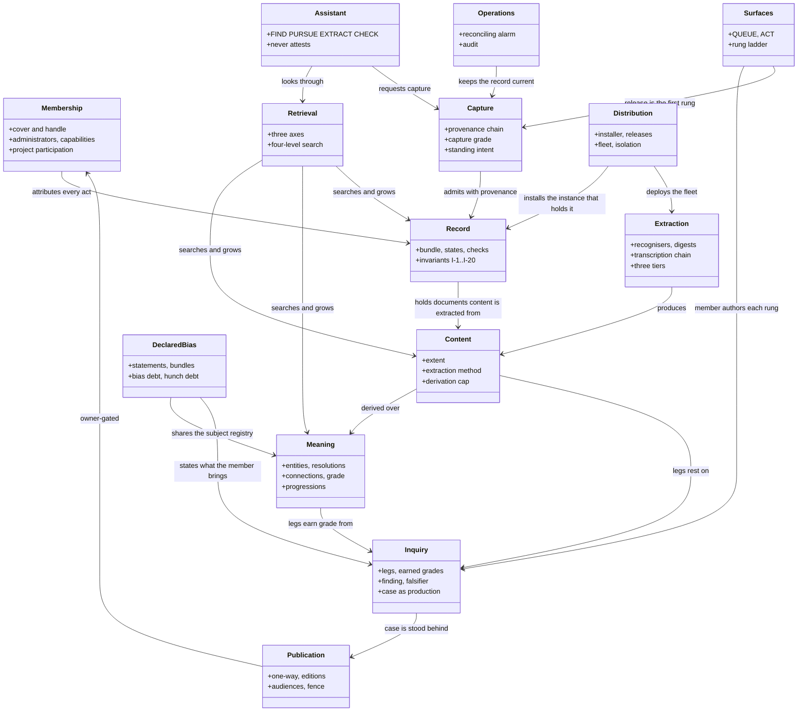

# BIO / CivicOS — the system design

**Status** · v0.1 DRAFT, written 2026-09-14 by session BOB #10 at Bob's direction, awaiting Bob's review; the three constructs it named homeless at writing (11, 13, 15) received level-1 homes the same day (§3). This is the level-0 document the design corpus standard (`CORPUS-STANDARD.md` §2) requires: the whole system described broadly and completely at one altitude — its purpose, the path it serves, every major construct with its importance, its relationships and its home document, and the runtime shape — so that a reader can place any construct before opening its document. It is written from the record at `origin/main` `c2ba7a2` and from the documents it points at; it rules nothing and designs nothing of its own. Completeness: the construct inventory (§3) is believed complete at this altitude and every row's STATE column is this session's reading, not yet Bob's; §5's ladder states are pointers to `MILESTONES.md`, which stays the authority for what is open. The one caveat: several level-1 documents this map points at were written against the retired runtime and say so in their own front matter — read their Status before their body. **BOB RULED §3 THE SINGLE AUTHORITY ON DESIGN STATUS on 2026-09-17, and asked that the record be checked for second sources of truth; `tools/corpuscheck.mjs`'s `--authority` arm (M0-57) now refuses a governed document that lists a construct among the pieces still to be designed when a home document this map names has designed it.** Its first catch was this document's own construct-8 STATE cell, which had said the claim object was doctrine still owed for six weeks after `BIO_Case_Making_v0_1.md` designed it; that cell and `BIO_Content_Framework_v0_10.md` §18 item 6 are corrected. The arm's reach is narrow by design and its bound is stated in the tool's header: it judges only a piece that a §3 row CITES by item number, so an undesignedness claim no row cites is invisible to it — M0-58 is the sweep. as of 2026-09-20 (§3 state rendered from construct-status.json).

**Place in the system** · The top of the design corpus. Every level-1 document in `docs/architecture/` is a construct named in §3 or a mission document named in §2; a construct not named here is not a major construct, and a new one is added here in the same landing that gives it a home (`CORPUS-STANDARD.md` §4). `README.md` catalogs the documents; this document places the constructs. `CLAUDE.md` carries the doctrine every session loads and points here for the whole.

**Incomplete sections** ·
- §3 — the STATE column is now RENDERED from `construct-status.json` and verified against the code at every push (2026-09-18); it replaced a hand reading of 2026-09-14 that three independent reads found wrong in both directions, mostly calling BUILT things absent. **What it still cannot say:** a probe proves a named thing is PRESENT, or ABSENT under the names searched — never that it WORKS (the battery's job), and an absence is only as good as the names tried. Three claims rest on the code's own statement of an absence (5.reextract, 8.contradiction, 9.internet) and say so.
- §4 — the class diagram shows the 14 constructs that have relationships drawn; construct 10 (standing intent and monitoring) is folded into Capture and Operations there and is not a separate class until Bob confirms the inventory.
- §5 — the capability ladder is summarised by pointer; per-milestone state is not restated here because `MILESTONES.md` is its authority and a copy would drift.
- §6 — the runtime shape names what is deployed on the project's instance; a sovereign group's instance differs (no fleet until Bob's gate, D-297) and the differences are listed, not designed.

**Contents**
- [1. Purpose — the path, and the stance](#1-purpose-the-path-and-the-stance)
- [2. The system in one view](#2-the-system-in-one-view)
- [3. The major constructs](#3-the-major-constructs)
- [4. How the constructs relate](#4-how-the-constructs-relate)
- [5. The capability ladder as the completeness map](#5-the-capability-ladder-as-the-completeness-map)
- [6. The runtime shape](#6-the-runtime-shape)
- [7. The doctrine spine](#7-the-doctrine-spine)
- [8. What this document does not own](#8-what-this-document-does-not-own)

---

## 1. Purpose — the path, and the stance

**CivicOS exists to answer questions, make a case, tell a story, and take action to affect
a living civic system** (Bob, 2026-08-01, `CLAUDE.md`). Everything in this system is
substrate for one thing: supporting a member through the winding path of *questioning,
exploring, discovering, documenting, and impacting* the civic system they live in. A
capability that does not serve that path is not obviously worth building.

The stance is doctrine (`CLAUDE.md`, "The stance"): the objective is BETTER GOVERNMENT
through greater understanding, less narrative, and accountability; all stakeholders are
presumed to want better outcomes; bad actors are identified by EVIDENCE, never assumed by
role; and *less narrative* binds us before it binds anyone else. The product is therefore
**the trustworthiness of the record**: a group captures what a public body published and
can prove later that it said what they claim. A defect that lets the record claim more
than it can support is worse than a missing feature.

Three rules follow and govern every construct below: **undetermined is first-class and
must be stated**; **an equality or outcome that costs nothing to produce is not
evidence**; **derived things inform, authored acts bind** — the machine may do the
LOOKING, the member does the CONCLUDING (DEC-24).

## 2. The system in one view

A **group** — as small as one person (Design Requirement 2) — installs its own
**sovereign instance** into its own Cloudflare account with the installer `newgroup`
(§6). The instance is a **plane** (a Worker) fronting a **Durable Object with SQLite**
that holds the **record**, with captured bytes in **R2**. Members reach it through the
member surfaces (`civicos-ui`) and, where they choose, through an **assistant** that works
under the same fences. The plane **captures** documents a public body publishes and keeps
their **provenance**; it **extracts content** from them; it derives **meaning** — entities,
connections, progressions — and states how strongly each is established; members author
**inquiries** that rest on content and on other inquiries, conclude them as **findings**,
and produce a **case** the group **stands behind** and **publishes**; the published corpus
is verifiable by a stranger with no credential; and outward **action** can say which
findings justified it. The instance keeps itself current unattended (a scheduler on one
reconciling alarm), tells the truth about what it is and can do, and can be left,
mirrored and outlived.

The mission-level constraints every construct satisfies are in two documents that own no
construct: `BIO_Complete_Roadmap_v5.md` (the mission of record: values, principles, the
seven-category UX, the stance) and `BIO_Design_Requirements_v2.md` (fifteen requirements;
"the system fails if any is violated"). On conflict the Design Requirements govern.

## 3. The major constructs

One row per construct. **Importance** says why the row exists at this altitude. **Relates
to** names the constructs it depends on or feeds. **Home** is the level-1 authority; a
level-2 design that serves the construct is named in brackets. **State is RENDERED, never
hand-written** (Bob, 2026-09-18: one source of truth, always kept updated): it comes from
`docs/architecture/construct-status.json`, whose every claim carries probes that
`node tools/status.mjs --check` re-runs against the code, and the push is refused while any
disagrees. Look anything up with `node tools/status.mjs <topic>`; edit the JSON, then
`node tools/status.mjs --write`.

| # | construct | what it is | importance | relates to | home | state |
| --- | --- | --- | --- | --- | --- | --- |
| 1 | **Membership and authority** | cover and handle, administrators and the two-administrator floor, capabilities, burner-URL invitations, project participation and ownership, secure verified export; who may perform which act, and what an act is worth when a machine performs it | every authored act in the system is attributed to a member; the fences on capture, attestation and publication rest on it | record (3), publication (13), assistant (11) | `BIO_Membership_Architecture_v2.md` [`AUTHORITY-AND-TRUST.md`] | **BUILT:** the two-administrator floor, with endorsement and removal votes — and since D-136 (2026-09-19) the §4.7 vote is CASTABLE BY A PERSON AND UNFORGEABLE: `op=adminendorse` and `op=adminremove` reach any administrator's session (both `SESSION_OPS` sets: `kind` is `admin` for the FOUNDER alone) and their `by` is SERVER-stamped through `GOVERNANCE_ACTIONS`, so the consensus arithmetic no longer rests on an attribution the caller supplies; a bearer token is refused by name (C-32.17). Argued at `BIO_Membership_Architecture_v2.md` §4. NOT closed: `op=memberadd`'s `by` writes an `admin_votes` row and is still the caller's; burner-URL invitations and enrolment, which D-158 (C-63) binds signing keys to; project participation, ownership votes, fork and rescue; member capabilities and declared expertise — and since D-136 (2026-09-19) §4.9's capability edit is a NAMED ADMINISTRATOR'S act: `op=membercaps` rides with the §4.7 votes in `GOVERNANCE_ACTIONS` and `Store#memberCaps` READS its server-stamped `by`, refusing one that is not an active administrator and asking BEFORE the member lookup, so a stranger cannot enumerate the roster with it; secure verified export, logged; machine credentials minted and revoked by members · **DEFERRED:** the root of trust is the ADMIN_TOKEN holder and cannot be voted out; custody is deliberately unmodelled (DEC-2, deferred) — verified at the code: `node tools/status.mjs 1` |
| 2 | **Intake, capture and provenance** | how material enters the record: admission requires provenance never relevance; capture grades; the provenance chain of hops; the daemon/member division of who fetches; the archive fallback; link fidelity; authority follows the data | the record's trust root — a hop attests "these bytes, this URL, this time" and no more; everything above inherits the document's chain | record (3), content (4), scheduler (14) | `BIO_Intake_Doctrine_v1_1.md` [`LINK-FIDELITY.md`, `ARCHIVE-FALLBACK.md`, `SOURCE-ACCESS.md`, `CAPTURE-SCALING.md`, `CLIENT-RENDERED.md`] | **BUILT:** capture and acquire, with grades A/B/C enforced as a check; the provenance chain, its rebuild, and the per-document provenance route marks (`provenance_route_marks`) — a status line, not a design home: construct 2 names no home for them; link discovery with fidelity verdicts; named capture requests and their drain; TSA co-attestation; the per-host governor; a narrowly scoped `daemon` credential class exists in the plane (acquire's archive arm, monitor, capturerequestdrain) — the intake doctrine's retired daemon is a different thing · **PARTIAL:** a member's firsthand observation as evidence (D-184, designed in MEMBER-KNOWLEDGE-DESIGN.md §2–§4). BUILT by MK-1 (IC-133/IC-134): op=testify writes an authored INFO bundle whose bytes are the member's words, the register's `authored` flag settable only on that path and fenced at op=promote (C-53), a server-stamped author and `observed_at`, a content row and a passage-index unit over it; the bytes are a canonical header (bio-testimony/1: id, observed_at, no author) then the words, so two members' identical words are two testimonies (BOB #14, 2026-09-18); the capture axis earns NO letter for it (CAPTURE_AXIS_AUTHORED); and NOTHING carrying one crosses the publication fence — op=ratify refuses an observation (C-53.10) and a finding resting on one at any depth (C-53.11), op=caseratify a case over such a finding (C-53.12), until MK-3 lifts it. ITS GRADE BUILT by MK-2 (IC-142): a THIRD axis, `testimony`, at D (GRADE_AXES and Store.STRENGTH_AXES carry capture, connection, testimony; TESTIMONY_GRADE is the one letter) — a leg citing an observation is graded on that axis, earned in value mode from the register's `authored` flag and from nothing else (earnedBasisRegistry's `testimony` map), composed by DEC-32's unchanged arithmetic over its own population and never folded into capture; at op=promote C-2.8 refuses BY NAME any capture grade on an observation (testimony-leg-capture-graded), any testimony letter but D (testimony-grade-not-d), testimony on a document that is not an observation (testimony-axis-not-authored), a testimony grade from another source (testimony-axis-source) or on an inquiry leg (testimony-axis-no-referent); a second member's agreement raises nothing (the registry reads no attestation; two witnesses are two testimonies, each D); a replayed row carrying a stronger letter is READ at D; a case member resting on testimony freezes a testimony row beside the two (C-2.8 requires it, testimony-axis-unfrozen), an ordinary one freezes exactly the two it always did. NOT BUILT: its attribution in a published case (13.attribution, MK-3), and with it the publication fence's lifting — no observation, and nothing resting on one, is publishable yet. Moved ABSENT → PARTIAL by MK-1; the ABSENT probe's `none` on 'firsthand' is retired with the state it evidenced, and correspondence's own-account arm (C-2.10) remains a narrower, different thing — verified at the code: `node tools/status.mjs 2` **Designed in:** firsthand observation (2.firsthand) and attribution — `docs/development/MEMBER-KNOWLEDGE-DESIGN.md` §2–§4 (2026-09-18). |
| 3 | **The record** | the bundle: id grammar, universal frontmatter, per-type schemas and state machines, the closed relationship vocabulary, cascade semantics, the invariant set and the violation-to-repair map, the Mechanical Verification Law; the C-series check catalog that gates every write | the shape everything else is stored in and checked against; the plane implements it and `bio-checks.mjs` runs it | all rows | `BIO_State_Rules_Consistency_v1_5.md` [`BIO_Bundle_Skill_Composite_Design_v1_7.md` for the inherited format and checks] | **BUILT:** the gate and the case gate run the check catalogue on every write; the closed relationship vocabulary and the violation-to-repair map; the edition-keyed published projection; a CENSUS of the plane: 195 ops, 97 tables — any addition or removal, under any name, fails the check until the claims it could change are reviewed. Moved 194/97 → 195/97 by REC-146 (op=contradictionpairs; NO table — section 9 item 1 of CONTRADICTION-IDENTIFY-DESIGN.md is expressly no judgement and no table write), REVIEWED BY MEANING against every non-BUILT claim: it expresses 8.contradiction's IDENTIFY PAIRING third and nothing else of it (now PARTIAL, text rewritten to name what is and is not built). It does NOT express 8.claim — it READS `inquiry_basis_versions.claim` and adds no claim capability, and 8.claim's missing half is the claim as an OBJECT, which section 3 of the design says the IRRECONCILABLE PAIR needs and which this does not build. It does NOT express 12.publish, 13.ceremony or 8.preflight (it writes nothing and publishes nothing), 9.ui / 7.ui / 4.transcribe-ui / 11.ui-extract / 12.check-start (MEASURED: `grep -rn contradictionpairs` over civicos-ui, agent-worker, newgroup, pdf-worker and ocr-worker returns ZERO — no surface calls it), 9.internet (it reads no frontier and no level), 10.lead (a lead is refused as any leg by name, C-54.1, so no leg this op pairs can rest on one), 2.firsthand, 13.attribution, 13.review-copy, 8.goals, 8.proof-standard, 11.extract-deployed or 11.pilot. It FALSIFIES no claim's text other than 8.contradiction's own. Moved 193/97 → 194/97 by REC-136 (op=withdrawconclusion; no table — the history is the project's own `conclusions[]` frontmatter list), REVIEWED BY MEANING against every non-BUILT claim: it expresses 8.claim's withdrawal half (the withdrawal ruling in INVESTIGATIVE-SESSION.md, see 8.claim; text corrected); it does NOT express 12.publish (a withdrawal never edits a case, and a project's conclusion entering a case is still unbuilt, REC-135) or 13.attribution. Previously moved 188/94 → 193/97 by REC-126 (op=casedraft, op=reviewgrant, op=reviewrevoke, op=reviewcopy, op=reviewcomment; tables case_drafts, review_grants, review_comments), REVIEWED BY MEANING against every non-BUILT claim: they express 13.review-copy's plane half (now PARTIAL, its surface ABSENT); they do NOT express 13.ceremony or 12.publish (a draft is never published and no UI calls any of them), 13.attribution (a recipient's comment is attributed to its grant, which is not a member's chosen attribution level), or 10.lead. Previously moved 183/92 → 187/94 by MK-4 (op=lead, op=leadlook, op=leadread, op=leadshare; tables leads, lead_shares), REVIEWED BY MEANING against every non-BUILT claim: they express 10.lead (now BUILT); they falsify ONE HALF of 9.internet's text (the frontier's internet level now has a member writer) while its search arm and its level-wide frontier read stay absent, so 9.internet stays ABSENT with its text corrected; they do NOT express 2.firsthand (a lead is never evidence and is not MK-1's authored observation), 13.attribution, 9.ui or 8.goals. Previously moved 180/90 → 183/92 by CONDUCT #4 at REC-87's integration (op=transcribe, op=transcriptionattest, op=transcription; tables transcriptions, transcription_attestations), which expressed 4.transcribe Moved 183 → 184 ops by MK-1 (op=testify; no new table — the register gained columns), REVIEWED BY MEANING against every non-BUILT claim: it expresses 2.firsthand's authored half (now PARTIAL); it does NOT express 10.lead (a lead is never evidence and is MK-4's), 13.attribution (MK-3), 9.internet, or 11.machine-fence (testify refuses every machine stamp, but says nothing about an `ai` credential's attest or ratify scope) MERGED by CONDUCT #4: MK-1 and MK-4 each counted from its own base (184/92 and 187/94); the merged tree carries both, 188/94, each side's review by meaning standing for its own additions. · **UNDETERMINED:** whether a given instance serves this build is not a fact about the code; ask the instance (`/version`) — verified at the code: `node tools/status.mjs 3` |
| 4 | **CONTENT** | the unit the record points at: a reference to a PART of a document up to and including the whole (DEC-23); its two intrinsic properties — EXTENT and EXTRACTION METHOD (DEC-4); the forms it takes; the extraction process as built; how it is organized and reached; the central gap — *the address exists, no edge carries it* (D-164) | **the heart of the system** (Bob, 2026-09-15): documents are harvested, content is extracted, meaning derives from both; a store of unread documents is noise with good provenance | capture (2), record (3), meaning (6), inquiry (8), retrieval (9), assistant (11), surfaces (12) | `BIO_Content_Framework_v0_10.md` **Part II** [`CONTENT-EXTENT-DESIGN-SPACE.md`, `STORE-AS-CACHE.md`] | **BUILT:** the content object: a content-addressed row minted lazily on first edge, readable and machine-mintable; D-164's central gap is CLOSED: basis legs and version legs carry a content_id, and op=cite accepts one; all five extent arms are landed: document, pdf-page, sheet-cell, slide-shape, doc-para; REC-86's on-point narrowing of a LEG: the machine's candidates (op=narrowcandidates, labelled machine work) and the member's act (op=narrow), which writes a NEW basis version and retains the old one; the on-point choice for a CONNECTION is a different item (REC-120); member TRANSCRIPTION, plane half (REC-87, IC-127/IC-128): the `typed(member)` derivation step on a content row's chain with cap undetermined, op=transcribe, a second member's op=transcriptionattest (the typist's own refused, C-52.9), op=transcription. Corrected by CONDUCT #4 at REC-87's integration: the ABSENT probe searched for a `member:` step kind, REC-87 had to spell it `typed` (`member` is already a content: query word), so the absence check passed while the construct was built; the content extent kinds are exactly these eight — a new kind under any name fails the check · **ABSENT:** a member surface for TRANSCRIBE (a portion selection plus an empty text field), delegated to UI in CLAIMS.md by REC-87 — verified at the code: `node tools/status.mjs 4` |
| 5 | **Document profile and the extraction substrate** | recognisers over three axes (host stack, content type, format); regions and three digests; change as layers with one entry point; the transcription chain and its four rules; calibration; the L2→L3 wire through three tiers (in-plane, pdf-worker, ocr-worker) | how bytes become readable text and readings honestly — the machine's EXTRACT role as built | capture (2), content (4), fleet (15) | `BIO_Content_Framework_v0_10.md` **Part I** [`DOCUMENT-PROFILES.md`, `OFFICE-FORMATS.md`, `CONSTRUCTS.md` as the 2026-07-30 inventory] | **BUILT:** host-stack handlers and the three digests; three extraction tiers: in-plane, the PDF worker, the OCR worker; SIX doctype readers: meeting calendar, agenda, minutes, staff report, regulation, and the generic fallback; AI-proposed readings, kept out of coverage (the EXTRACT role's plane half); tables and images as content: the sheet-range, doc-table and image extent arms are landed (FW-19); an image's cited_as distinguishes it; read-time re-extraction to tier 3, OPT-IN on op=pdfstructure&ocr=1 (D-319, closed by CPDF-19); existing stored captures are not rewritten; the transcription chain's step kinds are exactly these seven — a new step under any name fails the check. `typed` added by CONDUCT #4 at REC-87's integration (a member typed a portion's text, IC-127), reviewed: it expresses 4.transcribe and no ABSENT claim — not 2.firsthand, which is a member's OWN observation, not a reading of a captured document — verified at the code: `node tools/status.mjs 5` |
| 6 | **Meaning: entities, connections, progressions** | the entity axis (registry, aliases, constitutive relations, graded resolutions); referential and temporal connections as DATA with their own grade; progressions as the many shapes a happening takes, with the missing predecessor as a finding; identifier spaces where grade collapses | "every document that concerns this ordinance" is one query; a connection has a grade like a capture does; a machine-proposed connection is a HUNCH until earned | content (4), bias (7), inquiry (8), retrieval (9) | `BIO_Content_Framework_v0_10.md` Part I §8, §8.1–8.3 | **BUILT:** the entity registry, aliases, constitutive relations, and graded resolutions (at document grain); a connection keeps its determining reference pair and each end's position (D-161 closed); progressions, with missing-predecessor and overdue-successor findings · **ABSENT:** identifier spaces where grade collapses — verified at the code: `node tools/status.mjs 6` |
| 7 | **Declared bias** | bias as a declared, justified, first-class construct: three statement kinds, bundles and adoption, the subject registry (the same construct as the entity axis), bias debt versus HUNCH DEBT, the authored acknowledgement at export, regrade and the cross-group rerun | "less narrative" made mechanical: what a member brings to the record is stated, and evidence accrues to it | meaning (6), inquiry (8), publication (13) | `BIO_Declared_Bias_v0_1.md` | **BUILT:** bias statements in three kinds, adoptions with revision pins, manifest and inhale; the bias acknowledgement is required at publication; hunch debt: an uncleared hunch refuses publication · **ABSENT:** regrade / cross-group rerun under another lens; a member surface for bias (the ops have no UI caller) — verified at the code: `node tools/status.mjs 7` |
| 8 | **Intent and inquiry — from goal to case** | goals → objectives → aspirations and the discovery loop; the recursive INQUIRY (a question nests, concludes as a FINDING, its legs rest on content and other inquiries with earned grades per axis, its strength composed by DEC-32's arithmetic); the required falsifier; CHECK; a CASE as a production of a project (DEC-72); **CONTRADICTION in three cases — in the WORLD it is a FINDING the system exists to find, in the RECORD it is a defect in our own holding carrying a DUTY to identify, present and resolve, and imprecision is NEITHER (Q14, ruled 2026-09-17)**; the action plan | this is what the whole system is FOR — "case-making is undesigned, and it is what the whole system is for" (D-127, **Bob's framing of 2026-08-01**; since designed and built through the IS plan, which closed 43/43 — the quotation is history and this row's status cell is the authority) | content (4), meaning (6), bias (7), assistant (11), surfaces (12), publication (13) | `BIO_Content_Framework_v0_10.md` Part I §12; `BIO_Case_Making_v0_1.md` as the reasoning record **and the HOME of the contradiction construct (§CONTRADICTION)**; the rulings DEC-15…DEC-32, DEC-72 [`INVESTIGATIVE-SESSION.md`, `docs/archive/IS-BUILD-PLAN.md` — the plan closed at 43/43 and is closed history] | **BUILT:** the inquiry lifecycle: cite, dispose, conclude, reopen, divide, ground, versions; a concluded inquiry requires a conclusion and a falsifier, or the member's stated override (UI-64/REC-117); cases, their documents, ratification and revision flags; the action plan and its correspondence · **PARTIAL:** a claim is carried on basis VERSIONS (the `claim` column, D-217b — written by op=narrow and the investigative-session writer), and CONCLUDING ADOPTS IT PER PROJECT (REC-124, INVESTIGATIVE-SESSION.md §7.1, IC-150): op=conclude&project= writes one dated, authored `conclusions[]` row into the PROJECT's own frontmatter naming the reading that project stands on and that reading's claim frozen verbatim, never moving the shared inquiry; a project with nothing to adopt is refused NO_CLAIM (C-33.34) and a free conclusion text beside a project CONCLUSION_IS_THE_CLAIM (C-33.35); commentary is attributed and labelled not-evidence; op=basisversions reads each project's own conclusion, and the inquiry's own (no-project / legacy) conclusion with its claim UNDETERMINED, never back-filled; other projects are told by a FINDING and never moved — bio-plane/test/conclude-project.test.mjs, control conclude-project.control.mjs. REC-136 (§7.1 items 6-8, IC-153): a NO-PROJECT conclusion NAMES the accepted reading whose claim it adopts (`version=`), refused NO_CLAIM unnamed, and writes the adoption beside the conclusion in the inquiry's own bytes (`conclusion_version`, `conclusion_claim`), read ADOPTED only when that reading bears it out; conclusions written before read UNDETERMINED, stated; a project's record is an APPEND-ONLY history of dated, authored conclusions and withdrawals (op=withdrawconclusion; NOTHING_TO_WITHDRAW C-33.37), the latest entry its stance, every entry readable through op=basisversions' `conclusion_history`, and C-5.1 holds the list append-only. REC-142 (IC-159): op=affordances publishes `conclude` — its PROJECT arm — on a question the no-project relationship already concluded, to a caller who has JOINED a project it can see that live-cites the question (the store fact `concludes_for_project`), and to nobody else; no `concluded -> concluded` edge, so the no-project relationship cannot conclude twice — bio-plane/test/conclude-project-arm.test.mjs. REC-144 (IC-160, BOB #16's design): the single-bundle op=projection&id=<inquiry> carries the same `no_project_conclusion` through the ONE reader #noProjectConclusionOf, never on the list form — bio-plane/test/projection-noproject.test.mjs. STILL PARTIAL: §7.1 item 4 is not built (op=publish's NOT_CONCLUDED, op=reopen and legs resting on an inquiry still read the inquiry's OWN state, so a project's conclusion cannot yet enter a case); Q14's contradiction case (CONTRADICTION-IDENTIFY-DESIGN.md, 2026-09-19). IDENTIFY is 1 of 3 and ONLY ITS FIRST THIRD IS BUILT: REC-146 (IC-167) lands op=contradictionpairs, the PAIRING READ — the four keys K1-K4 as section 4 defines them, each pair carrying the key that formed it, viewer-gated through Store#bundleGate on every bundle column of every side, bounded per key with an over-fetch-by-one envelope, and an ABSENCE that names WHICH LEVEL was empty out of a published ladder of existence probes (section 6). K4 COUNTS the candidates it could NOT form for want of a doctype or a document date its reader never stated, and does not form them. Refusals: C-60. WHAT IS NOT BUILT, and the answer says so itself in judgement.state NOT_REACHED: no JUDGEMENT (section 9 item 3, the machine's five labels), no candidate TABLE and no write of any kind, no fixture and no false-conflict measurement (section 9 item 2), and PRESENT and RESOLVE are not designed · **ABSENT:** goals and aspirations as objects (an objective is a zero-leg open inquiry); a standard of proof per production or audience (only the project's strength bar exists); op=publishpreflight (REC-15), deferred by DEC-33 until the substrate beneath it is solid — verified at the code: `node tools/status.mjs 8` **Designed in:** the CLAIM is designed, and has been since 2026-08-03 — a FIELD of an inquiry rather than an object, with concluding as the inquiry ADOPTING it (`BIO_Case_Making_v0_1.md`), and its standard of proof attaching to the PRODUCTION (Bob, 2026-09-14); Part II §18 item 6 POINTS here rather than restating it, and what remains owed is RESEARCH, not design — the catalogue of standards by audience and output act. CONTRADICTION's IDENTIFY (8.contradiction) — `docs/development/CONTRADICTION-IDENTIFY-DESIGN.md` (2026-09-19); PRESENT and RESOLVE are not yet designed. |
| 9 | **Retrieval — the store as a read-through cache** | three axes (document, content, meaning), each with its own frontier, states and repair (FETCH / EXTRACT / DERIVE); the four-level search (meaning, content, documents, the open internet) — a search that returns documents has not finished; the query compiler with one compilation point; FTS5 inside the Durable Object | the reason the store is never assumed complete; sparse is normal at every level and saying WHICH absence is true is a first-class obligation | content (4), meaning (6), assistant (11), surfaces (12) | [`STORE-AS-CACHE.md`, `RETRIEVAL-SUBSTRATE.md`] — Part II §14.2–14.3 carry the adopted tables | **BUILT:** document-grain search over FTS5 with the query compiler; content-grain search: the `content:` arm and the `passage:` arm over indexed captured text; the meaning arms (resolves:, concerns:, leg:); the observation log with one append site, and the frontier over the document, content and meaning levels · **PARTIAL:** the frontier's level-wide READ at the internet level is BUILT and DRIVEN (REC-129, IC-143): op=frontier&level=internet answers from the LEAD's looks (op=leadlook), fenced by the lead's own visibility rule (#leadReach, the one predicate op=leadread also asks) applied to the looks BEFORE the latest-per-subject grouping, so every list, date, count and cause is computed from readable looks only; an empty answer names the level and its cause; it names what it does NOT read (a run's open-internet searches, an acquire at an unheld address) — bio-plane/test/frontier-internet.test.mjs, control nc-rec129.mjs. STILL ABSENT: search has no internet arm. Previously: written at REC-129's stand-down and unverified (ABSENT -> PARTIAL then); MK-4 gave the level its member WRITER (op=leadlook, 10.lead) · **ABSENT:** a member surface for the frontier and the content axis — verified at the code: `node tools/status.mjs 9` |
| 10 | **Standing intent and monitoring** | named requests and ratified sweeps; the frontier of deferred links; monitoring contracts; change detection through the digests; what the instance does unattended | the record stays current without anyone calling an op | capture (2), scheduler (14) | `BIO_Intake_Doctrine_v1_1.md` §4; `BIO_Content_Framework_v0_10.md` Part I §6 [`SCHEDULER.md`, `NOTIFICATIONS.md`] | **BUILT:** monitoring on the alarm scheduler, with digest-based change detection; the frontier of deferred links; a member's LEAD (D-194, MEMBER-KNOWLEDGE-DESIGN.md §5), plane half (MK-4, IC-135/IC-136): the `leads` table, its author server-stamped and never a machine (C-54.2); op=lead writes the row and NOTHING to the log (nobody has looked yet); op=leadlook writes one observation_log row with authority_kind 'lead', authority = the lead id, level internet, subject kind description, so LOOKED_ABSENT is recorded against the lead; op=leadread reads the lead and its looks back. A lead is NEVER evidence: C-54.1 refuses one BY NAME as a basis leg, a version leg or an action-basis leg. Visibility is BOB #14's ruling (2026-09-18): the author; the JOINED participants of a project the author SHARED it to (op=leadshare, table lead_shares, C-54.9/C-54.10); a machine credential only within a member's minted scope, never unfiltered; everyone else answered exactly as for an absent lead. A COUNT is a disclosure of existence (BOB #15, corrected): op=stats, op=selftest and op=livefire publish `leads` to no class, the admin token included; their log count is `observationsNonLead` (lead looks excluded) for every caller, and `dbBytes` is the admin class's only (REC-131, IC-148); only purge's D-113 proof counts leads. The member SURFACE is Program B's and is not built. Previously ABSENT: reserved vocabulary only, no table, op or writer — verified at the code: `node tools/status.mjs 10` **Designed in:** the LEAD (10.lead) — `docs/development/MEMBER-KNOWLEDGE-DESIGN.md` §5 (2026-09-18). |
| 11 | **The assistant and the AI roles** | the machine may FIND / PURSUE / EXTRACT / CHECK and request capture; it never touches the provenance chain, never attests, never concludes; its work is labelled and graded as machine work; the investigative session and its run log; the skill and doctrine pack; the credential cascade through `agent-worker` | one way in, on every surface; central to what BIO offers, and bounded by the same fences a member's act carries | content (4), inquiry (8), surfaces (12), fleet (15) | `BIO_Assistant_and_AI_Roles_v0_1.md` (v0.1 DRAFT, 2026-09-14) [`INVESTIGATIVE-SESSION.md`, `ASSISTANT-PILOT.md`, the SKILL kickoff] | **BUILT:** the investigative session: runs, bounds, ticks, close, spawn, suggest; the credential cascade (member, project, instance); the CHECK runner is deployed in the fleet; an `ai` credential whose scope names an attest or ratify op is refused BELOW the scope check — TRACED BY DRIVING (REC-123, 2026-09-18, `bio-plane/test/machine-attest.test.mjs`): op=ratify and op=caseratify ACCEPTED a machine carrying a member's valid signature (the record named the member) and are now fenced by name (C-32.12 / C-32.13, IC-132); op=attesttext and op=transcriptionattest refuse by name (C-35.10); op=expertiseconfirm refuses by the membership guard (ADMIN_ONLY); adminendorse/signeradd/signerset are outside every scope by shape; op=textattest is a read; op=attest (a third party's timestamp) is ACCEPTED and permitted by design, BIO_Intake_Doctrine_v1_1.md §3; and NO OPERATOR BEARER TOKEN delivers either act (REC-125, D-421 DECIDED by BOB #14, 2026-09-18, `bio-plane/test/operator-attest.test.mjs`): the ADMIN, MEMBER and PROBE tokens each carrying a member's VALID signature were ACCEPTED at op=ratify and op=caseratify on the pre-item tree and are now refused by name (C-32.14 / C-32.15, IC-137), keyed on the caller NOT having arrived through a signed-in session, so every binding classify() resolves is covered; a member's own session still ratifies · **ABSENT:** the EXTRACT role is NOT deployed in the fleet (its plane half is built — 5.ai-readings); the assistant pilot's flow: a prompt entry, INTERPRET, the classifier and the wizard; a member surface for AI-proposed readings — verified at the code: `node tools/status.mjs 11` |
| 12 | **Member surfaces and the interaction constructs** | QUEUE and ACT as the two constructs, the rung ladder of authored acts (release → stand behind → ground → conclude → accept → ratify), UNDETERMINED as a display primitive; the guiding voice (inform once, never nag — DEC-69; nothing prefilled; capability absent, never greyed); the iterative case journey; the public/verify surface | how a member reaches what the record holds (M8) and traverses the path (§1); UX is paramount | every row | `BIO_Interaction_Constructs_v0_1.md` [`UI-PLAN.md`, `UI-KICKOFF.md`; the Iterative Case Journey canvas] | **BUILT:** U1–U7: tokens, semantics, byte verification, release, snapshot resolution, the /build route; the UNDETERMINED display primitive · **ABSENT:** a member cannot publish or ratify from the UI — publishing runs through the operator; a member cannot start a CHECK run from the UI (it only reads runs) — verified at the code: `node tools/status.mjs 12` |
| 13 | **Publication, audiences and communications** | one-way publication (DEC-19), editions (DEC-12), the authored statement of what was left out, the eight audiences and their output acts, the publication fence on the provenance chain, evidence-package risk tiers, the platforms for cross-group discussion and the directory | the point where the record's trustworthiness becomes public and irreversible | inquiry (8), bias (7), membership (1) | `BIO_Publication_v0_1.md` (v0.1 DRAFT, 2026-09-14) [`BIO_Communications_Platforms.md` for the platform half; the audiences research in `docs/archive/research/AUDIENCES.md`] | **BUILT:** the fence and one-way publication, editions, and the signed case document; op=ratify publishes nothing outside a ratified case — a finding only at a sha a ratified case pins (C-58.2), anything else only as evidence a pinned finding rests on, under that case's authority (C-58.3; D-431, IC-161); the public read and verify surface, usable with no account; the completeness statement carries a computed `searched` section · **PARTIAL:** the review copy (DEC-31, designed in BIO_Publication_v0_1.md §6A). The PLANE HALF is BUILT by REC-126 (IC-145/IC-146): the draft case (op=casedraft), the grant bound to one draft and one case edition with its per-grant read secret stored only as a SHA-256 (op=reviewgrant, op=reviewrevoke), the marked copy whose missing-list is the publish gates' own refusal (op=reviewcopy), the attributed comment (op=reviewcomment), and op=casedocument admitting a live grant holder to the bound edition's unsigned document. The SURFACE is ABSENT — no member can draft, grant, read or comment from the UI (delegated to UI) — and the member-facing export statement (§6A.3 point 2) belongs to that surface · **ABSENT:** the member-facing publication ceremony (UI-17) — see 12.publish and 8.preflight; attribution levels for a member's observation (group, project, cover, name; off-the-record); the directory and cross-group discussion — verified at the code: `node tools/status.mjs 13` |
| 14 | **Scheduler and operations** | one reconciling Durable Object alarm; interruption recovered by re-deriving outstanding conditions from durable state; the host governor; the inbox; audit | the instance keeps its own record current unattended (M1) and recovers from any signal loss by state, never by signal | capture (2), monitoring (10) | [`SCHEDULER.md`, `INBOX-GRAMMAR.md`] — Tech Arch §10.7's interruption model is the rule that survived | **BUILT:** one reconciling Durable Object alarm driving the named consumers; the inbox (knock / resolve) and the audit pass — verified at the code: `node tools/status.mjs 14` |
| 15 | **Distribution: installer, releases, fleet, multi-instance** | `newgroup` installs a sovereign instance into a group's own account; DIST cuts signed releases from a green main and deploys with byte-verification and rollout gates; the fleet members (pdf-worker, ocr-worker, agent-worker) beside the plane; several instances per account isolated by structural partition | the distribution model IS the product — sovereign instances, not a hosted service | record (3), extraction (5), assistant (11) | `BIO_Distribution_v0_1.md` (v0.1 DRAFT, 2026-09-14) [`MULTI-INSTANCE-ISOLATION.md`, `kickoffs/DIST.md`, `VERIFICATION.md`; `BIO_Technical_Architecture_Decisions_v10.md` for the rules that survived the substrate change] | **BUILT:** the installer's source installs the signed fleet; the plane release is signed and carries the fleet; the COMMITTED installer bundle installs the signed fleet — rebuilt at the 0.66.0 cut (DIST #2, 2026-09-19); the old ABSENT claim described a 0.56.0-era artifact and its "deploying it is Bob's gate" clause is superseded by Bob's standing permission of 2026-09-18 that DIST deploys · **ABSENT:** multi-instance isolation — account-global names are still fixed — verified at the code: `node tools/status.mjs 15` |

Every row names a level-1 home. Three of them — the assistant (11), publication (13) and distribution (15) — were homeless when this map was written and received their documents on 2026-09-14 (v0.1 DRAFTs, awaiting Bob's review); each restates its construct's rulings once and is the authority into which further rulings fold (`CORPUS-STANDARD.md` §4.2).

## 4. How the constructs relate

Read §3's rows downward and the dependency runs one way: **membership** attributes every
act; **capture** establishes what the bytes are and where they came from; **the record**
stores and checks; **content** is extracted from what the record holds and is the unit
every edge should point at; **meaning** is derived over content; **bias** states what the
member brings; **inquiry** rests on content and meaning and concludes; **retrieval** is the
one process that searches all four levels and grows every layer; **the assistant** does the
looking at every layer under the member's fences; **the surfaces** are where the member
authors each rung; **publication** is where the group stands behind the result; and
**distribution** and **operations** are what make an instance exist and keep it honest
unattended.

The two cross-cutting rules: **grade tracks directness and never composes across scales**
(capture grade is the document's; a content's derivation cap is its own; a connection's
grade is a third; DEC-21 shows both on one leg and CPDF-10 forbids a third scale); and
**every layer may be sparse, and absence at one level is not evidence of absence at the
next** (Part II §14.3).

The same relationships as a UML class diagram (the settled notation for structure; edges
read as "depends on / feeds", labelled with the act; validated against the mermaid parser
with `tools/mermaid-check.mjs` before landing):

## 5. The capability ladder as the completeness map

`docs/development/MILESTONES.md` is the authority for what is open. Its ladder is the
system's completeness statement at the capability altitude, and each rung maps onto §3:

| rung | capability | constructs |
| --- | --- | --- |
| M0 | the plan and its verification are trustworthy | process (`VERIFICATION.md`, `plancheck`, this corpus standard) |
| M1 | the instance keeps its own record current, unattended | 10, 14 |
| M2 | every document class Oakland publishes can become evidence | 2, 5 |
| M3 | the record knows what it holds | 5 |
| M4 | the record connects what it holds | 4, 6 — **D-164 is this rung's open primitive** |
| M5 | the record can be searched over its content, not only its notes | 4, 9 |
| M6 | the record can be left, mirrored and outlived | 3, 15 |
| M7 | a group can install and run it honestly | 15 |
| M8 | a member can reach what the record holds | 12 |
| M9 | a member can state what they found, and what it rests on | 8 |
| M10 | the group can stand behind what it found, and act on it | 8, 13 |

## 6. The runtime shape

What is deployed on the project's own instance at 0.58.0 (`release/RELEASE.json`;
`bio-plane/wrangler.jsonc`):

- **`bio-plane`** — the Worker (`src/index.mjs`, the control plane and the OPS table) and
  the Durable Object `Store` (`src/store.mjs`, `src/schema.mjs`) with SQLite; bindings
  `CAPTURES` and `PUBLISHED` (R2), `PDF_WORKER`, `OCR_WORKER`, `AGENT_WORKER`, `SELF`.
- **Fleet members** beside it, each one area's code and DIST's release object:
  `pdf-worker` (tier-2 text), `ocr-worker` (tier-3 OCR, tesseract-wasm, reads captured
  bytes from R2 itself), `agent-worker` (the assistant's credential cascade and plane
  callback).
- **`civicos-ui`** — the member surfaces, a Worker-served UI proxied to the plane.
- **`newgroup`** — the installer: OAuth into the group's account, plan probe, buckets,
  plane and members uploaded and byte-verified, the front page.
- **`docprofile/`** — the recogniser library the plane bundles (`tools/bundle-docprofile.mjs`).

A sovereign group's instance differs today in one measured way: it receives no fleet
until Bob's gate clears (D-297 closed; deployment is his click), so its tier-3 branch is the
honest `else` — nothing is claimed about a scan's text. Several instances in one account
collide on bucket and fleet names today; the plan to partition them structurally is
`MULTI-INSTANCE-ISOLATION.md`, sequenced after the member surfaces. `BIO_Distribution_v0_1.md` is the
construct's home and describes the topology, the release, the fleet and the installer once.

## 7. The doctrine spine

The rulings that govern every construct, each stated once where it lives and cited from
here rather than restated:

- **Content is the unit; a document is not the answer** — DEC-23; `CLAUDE.md`; Part II §14.
- **The machine may EXTRACT; the member concludes** — DEC-24; Part II §14.5.
- **Machine-read text is never indistinguishable from publisher text; OCR never raises a
  capture grade; fidelity bounds the capture axis, no third scale** — DEC-4, CPDF-10.
- **Undetermined is first-class and stated; an outcome that costs nothing is not evidence;
  the publication fence sits on the provenance chain** — `CLAUDE.md`, Intake Doctrine.
- **Legs compose by AND/OR; weakest governs across AND, strongest across OR; sufficiency
  only by an attributed act** — DEC-32.
- **A case is a production of a project; publication is one-way; return is a new edition**
  — DEC-72, DEC-19, DEC-12.
- **The workflow respects the member's judgment: inform once at the act, never nag** — DEC-69.
- **No structural prior against any class of actor; bad actors are identified by evidence**
  — `CLAUDE.md`, "The stance".

## 8. What this document does not own

The mission and requirements (`BIO_Complete_Roadmap_v5.md`, `BIO_Design_Requirements_v2.md`);
every construct's detail (its level-1 home in §3); the process by which the system is
built (`docs/development/ORCHESTRATION.md`, `PARALLELISM.md`, `VERIFICATION.md`); the
ledgers; and every ruling, which stays in the ledger it was ruled in.
