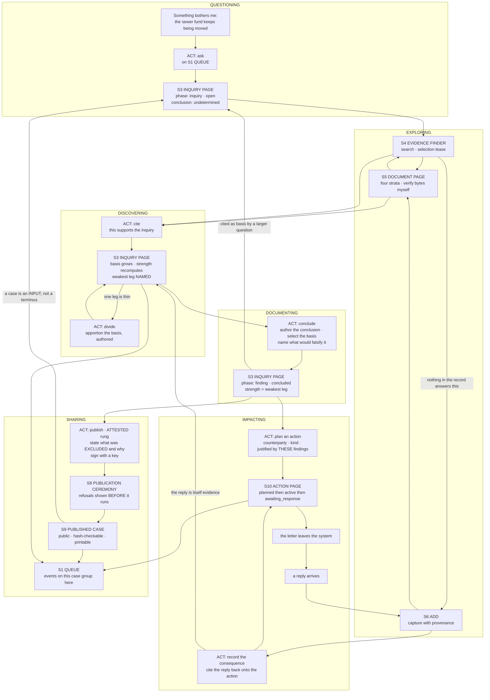
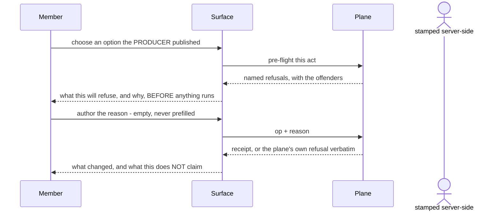

# The primary journey: a community accountability member, from a bother to a published case and an action

Written 2026-08-01 (design pass). **This is a DESIGN, not a measurement and not a
build instruction.** Where it describes something that exists it names the file, the op
or the rung; where it describes something that does not, it says GAP and gives it an id.
Nothing here is settled until Bob rules on it.

**Scope, deliberately narrow.** One archetype: a member of a community accountability
group — non-technical, unpaid, competent, working a question in their own time. Not
media, not lawyers, not administrators. That is `BIO_Case_Making_v0_1.md` §5 applied
("designing for four archetypes simultaneously is the reliable way to build something
that is nobody's"), and the falsifiable test it names holds here: when the second
archetype arrives it should cost a RENDERING of the case, not a second journey.

**Read first, and this document does not restate them:**
`architecture/BIO_Case_Making_v0_1.md` (the collapse, division, strength, completeness),
`architecture/BIO_Interaction_Constructs_v0_1.md` v0.2 (QUEUE, ACT, the weight ladder,
`undetermined`), `NOTIFICATIONS.md` (the item contract), `PROCESS-INVENTORY.md` (what is
reachable today), `PRACTICE-SURVEY.md` (adopt / deliberately-violate),
`UI-PLAN.md` "Who this is for".

**The constraints this design is written under**, restated because every section below
is answerable against them:

1. Never prefill, draft, template or suggest a justification, reason or framing. A
   surface MAY assemble a member's own prior authored words; it may not generate new ones.
2. `undetermined` is stated, never hidden or guessed past.
3. A SUPPORTED case is easy to build; an UNSUPPORTED one is hard to state. Compellingness
   is not optimised for.
4. A technical complication the system can classify is never surfaced as a choice.
5. Options on an item come from the producer, never from a surface-side map.

---

## 1 · The journey

Ten surfaces, labelled S1–S10 and inventoried in §2. The path verbs are the subgraph
names. Every edge is either an ACT (the member does something and it goes on the record)
or a READ.



The ACT is the same motion everywhere it appears above. It is one construct, not seven
dialogs:



Two properties of the flow worth naming because they are easy to lose:

- **The journey re-enters itself twice.** A concluded finding is cited as basis by a
  larger inquiry (`S3c → S3a`), and a published case is cited by the next inquiry
  (`S9 → S3a`). Both are the recursion the collapse bought. If either edge is missing the
  record becomes a series of dead ends rather than something cumulative.
- **The consequence of an action re-enters as evidence** (`A6 → S3b`). What the city
  says back is new information about how the system responds — D-128's declared-versus-
  actual flow measured on our own intervention. That edge is the loop the design pass
  says is unbuilt (`BIO_Case_Making_v0_1.md` obs. 2).

---

## 2 · Surface inventory

For each: **JOB** in one sentence · **SHOWS** · **ACTS** · **BUILDS ON** (existing rung,
QUEUE.md item, op, or a named gap from §4).

### S1 · THE QUEUE

- **JOB.** Tell me the things that want me, grouped by the case they belong to, and
  nothing else.
- **SHOWS.** One standing entry per (member, case) while that case has unhandled events —
  "three things need attention on the sewer franchise diversion" — expandable to the
  items. Each item carries its `class` (FINDING · OBLIGATION · CONDITION), its `summary`
  in the record's voice, its `basis` (or an honest statement that the basis is
  `undetermined`), and its producer-published `options`. Items with no case sit ungrouped.
  A machine-surfaced item LOOKS derived (D-82). No unread badge as the primary signal, no
  severity colour.
- **ACTS.** Whatever the item's `options[]` say, dispatched through the ACT. Group-level
  and item-level, which is the SELECTION-SCOPED modifier — with the `per-item`
  application weight, so an item the act could not handle is RETAINED WITH ITS REASON
  rather than silently dropped. Mute is personal and scoped to the kinds present when it
  was made; dismiss is a record act with an author and a reason. They are never one
  control.
- **BUILDS ON.** UI-8 (home) and UI-1 (task inbox) and UI-5 (proposals) — which today are
  **three screens that must become one surface**. `op=tasks`, `op=taskforward`,
  `op=taskresolve`, `op=proposals`, `op=proposedispose` exist. GAP **JG-10** (no `class`,
  no `basis`, no producer options, no grouping by case, no snooze/mute state) and
  **JG-9** (nothing publishes an item's options for non-notification objects).

### S2 · THE ACT

- **JOB.** Do one thing to a record or a set, having seen what it will refuse before it
  runs, and leave a receipt with my name on it.
- **SHOWS.** Four panes in fixed order: the option chosen; the pre-flight refusal list in
  the plane's own words with the offenders NAMED; the authored-reason field, empty; the
  receipt. The weight ladder rung is stated on every act — **reversible · reasoned ·
  terminal · attested** — and the top rung looks and feels different, because the ceremony
  is the safeguard.
- **ACTS.** It is the act. It is not a screen: it instantiates inside S1, S3, S5, S8, S10.
- **BUILDS ON.** UI-2 built the first instance (`op=dispose`), UI-3 the ballot
  (`op=projectownerremove` + arithmetic), UI-6 the attestation (`op=attest`), U5 the
  justified transition (`op=release`). Four instances have now landed on one construct;
  v0.2's falsification test has passed four times.

### S3 · THE INQUIRY PAGE

- **JOB.** Hold one question through its whole life — asked, gathering, concluded,
  published — in one place with one identity.
- **SHOWS.** The question as authored. The phase, named the member's way: **inquiry** ·
  **finding** · **case**. The BASIS as a list of legs, each leg being a captured document,
  another inquiry, or a published case, each carrying its own grade. The derived STRENGTH
  as the weakest leg, with **that leg named** — never a single confidence score, never an
  average. An `undetermined` leg renders as `undetermined` and the whole strength reads
  `undetermined` rather than being smoothed past. The conclusion, if concluded, and what
  the author said would falsify it. What relies on this inquiry (backlinks, the U3
  `load-bearing-for` pattern extended from documents to inquiries).
- **ACTS.** Cite a document or another inquiry as basis · sever a leg with a reason ·
  conclude (author the conclusion, select the basis, name the falsifier) · divide with an
  authored apportionment · dispose (defer/dismiss with a reason) · publish (hands off to
  S8).
- **BUILDS ON.** `focus` today (`bio-checks.mjs:24`, states `surfaced/elevated/deferred/
  dismissed`), `op=dispose`, `op=promote`. **This is the surface with the most gap under
  it:** JG-1 (concluded and published phases), JG-2 (basis recursion), JG-3 (strength at
  inquiry altitude), JG-11 (division), JG-14 (contradiction held inside one inquiry).

### S4 · THE EVIDENCE FINDER

- **JOB.** Find the material that bears on this question and put it under the question.
- **SHOWS.** One search box, origin-scoped with a widen escape (U2's rule, already
  shipped). Results with type, state and authority. A live SELECTION held as a
  server-side lease with its published expiry, and **what drifted underneath it**, stated
  exactly rather than absorbed. A selection may only ever SHRINK on visibility; it never
  auto-updates (D-35).
- **ACTS.** Cite the selection into an inquiry or a project, with the note grammar's
  constraints shown BEFORE the refusal. Weight `report`, so it proceeds and says what moved.
- **BUILDS ON.** U2 (search), `op=search`, `op=select`. `op=cite` **exists in the plane
  at `index.mjs:327` and has no caller anywhere** — GAP **JG-4**, which is UI-PLAN's U9,
  "the rung that turns a record into a case", never built and now invisible because
  QUEUE.md's UI-9 is a different item with a colliding name. Also: the UI hand-composes
  query strings while `op=searchfields` exists to prevent exactly that drift.

### S5 · THE DOCUMENT PAGE

- **JOB.** Let me read one document, see its standing honestly, and check the bytes myself.
- **SHOWS.** Four strata (What it says / In the case / Trust / The record); the SEMANTICS
  table as the single source of state presentation; the provenance chain with three-valued
  authority stated as `undetermined` when it is; link partitions with the verdict and the
  plane's own basis; the unfinished-capture banner with its outstanding count; the archive
  fallback with its Grade C and its two-hop chain; entities resolved and connections at
  their §8.1 grade; progression membership and overdue successors. Backlinks: **which
  inquiries rest on this document** — the extension of `load-bearing-for` that the journey
  needs.
- **ACTS.** Open and verify the captured bytes (one altered byte refuses the whole
  render) · release `collected → verified` · co-attest · retire · **cite into an inquiry**.
- **BUILDS ON.** U3, U4, U7, UI-9, U5 (release), UI-6 (attest). `op=capture` GET,
  `op=links`, `op=resolutions`, `op=connections`, `op=captureprogressions`. `op=retire`,
  `op=sever`, `op=reinstate` exist with no caller.

### S6 · THE ADD SURFACE

- **JOB.** Put a document into the record with its provenance intact, or say honestly
  that we could not.
- **SHOWS.** The locator, the authority named, the grade stated in the plane's own terms
  BEFORE anything is written. The continuation when the runtime ceiling stops a capture,
  driven rather than delegated to the member.
- **ACTS.** Acquire · capture · continue · promote. When the ceiling will not let a
  capture finish, the member chooses between recording it as the unfinished capture it is
  and writing nothing; **recording it as complete is not on offer.**
- **BUILDS ON.** U8, shipped. `op=acquire`, `op=capture`, `op=allocid`, `op=lease`,
  `op=promote`. One live defect the journey walks straight into: `mdFor` at
  `app.html:1752` writes `action_kind: other`, `risk_tier: 1`, `counterparty: to be named`
  as literal placeholders, satisfying `C-2.10` with a counterparty the record does not
  have — see JG-7.

### S7 · THE PROJECT WORKSPACE

- **JOB.** Say who is working on this and who may see it — and nothing about what is true.
- **SHOWS.** Owners, participants, the three D-15 visibility positions, the objective, the
  inquiries and actions living inside it. **No claim structure lives here.** A project is
  a container with membership and access control; an inquiry is a claim structure; the
  design pass ruled they must not merge, because merging puts access control on every
  question.
- **ACTS.** Invite · join · leave · remove · owner add/remove (a ballot with a shown
  denominator) · fork · rescue.
- **BUILDS ON.** UI-7 (roster, read-only), UI-3 (one ballot). Seven of the ten `project*`
  ops exist with no caller — `projectinvite`, `projectjoin`, `projectleave`,
  `projectremove`, `projectowneradd`, `projectfork`, `projectownerrescue`.

### S8 · THE PUBLICATION CEREMONY

- **JOB.** Perform the one irreversible act — this is what we stand behind, and this is
  what we left out.
- **SHOWS.** In this order: the conclusion as authored; the full basis chain with the
  weakest leg named and the derived strength stated; every `undetermined` leg listed
  rather than omitted; **the exclusion statement, authored, never prefilled**; what
  becomes permanent and what a published hash does and does not claim; the key act. Any
  refusal is rendered verbatim with its offenders BEFORE the signature is requested.
- **ACTS.** One act, at the ATTESTED rung. Irreversible. A published case cannot be
  divided; it can only be superseded by later inquiries citing it.
- **BUILDS ON.** `op=ratify` (`index.mjs:401`, capability `publish`) which has **zero
  occurrences in `civicos-ui/app.html`**, while `tools/sign-release.html:401` tells the
  operator to paste the signature "into the ratify box on the instance page" — **there is
  no such box.** GAP **JG-5**, and GAP **JG-6** for the exclusion field, which has no
  schema anywhere.

### S9 · THE PUBLISHED CASE

- **JOB.** Let a stranger read what the group stands behind, start to finish, check it,
  and print it.
- **SHOWS.** The narrative, in reading order, with every claim carrying a marker back to
  the leg it rests on and the leg resolving to the CAPTURE first and the live URL second
  (the Perma.cc convention, already accepted by lawyers and editors). The strength stated
  in words, not a score. Gaps marked in place, the `{{Citation needed}}` convention the
  public already reads as ordinary. The exclusion statement, with its author's name on it.
  Print as a first-class output carrying the whole narrative.
- **ACTS.** None that mutate. Verify a hash. That is deliberate: this surface is
  unauthenticated and reads the published projection only, never the working corpus.
- **BUILDS ON.** U12 / gap G1. `op=publishedmanifest` is reached; `pubOpen` in `app.html`
  is an honest stub that says "Rendering the full public reading surface is gap G1".
  `op=publishedlist` and `op=verify` exist with no caller.

### S10 · THE ACTION PAGE

- **JOB.** Hold one outward engagement — who we wrote to, why, what came back, and what
  that changed.
- **SHOWS.** The counterparty, the kind, the risk tier, the state in MuckRock's
  whose-move-is-it naming (`planned → active → awaiting_response → resolved | abandoned`),
  the clock with its `pending/met/overdue/waived` entries, the correspondence log, and —
  the part that does not exist at all — **the findings that justified this action** and
  **the consequence it produced.**
- **ACTS.** Plan · activate · record correspondence · record the consequence · resolve or
  abandon, each with a reason.
- **BUILDS ON.** The `action` object exists (`bio-checks.mjs:74`, `:1288`). **Nothing
  operates it:** no op moves an action's state, nothing writes `## Correspondence`,
  nothing ages the clock, the rail has no Actions entry at all. GAP **JG-7** and **JG-8**.

**Not a surface, and worth saying so:** `undetermined` is a display primitive with one
visual treatment and one voice — *what we do not know, and why we do not know it* — used
identically on S1, S3, S5, S8, S9 and S10. If it looks like an error in one place and a
shrug in another, members learn to ignore it, and the honest gap is what the record's
trustworthiness rests on.

---

## 3 · The four hardest moments, and what the surface does

Honest, and none of these is solved by better copywriting.

### HARD 1 · Getting the bother in, without being asked to classify it

**The difficulty.** A member arrives with "the sewer money keeps moving and nobody
explains it." The Add surface today asks them to choose among four kinds — Information,
Focus, Project, Action — before they may write anything. That is a taxonomy decision at
the exact moment the member knows least, and getting it wrong is expensive later:
an Action bundle demands a counterparty and a risk tier they cannot possibly have yet.

**What the surface does.** The entry point takes **a question and nothing else**, and it
always creates an `inquiry`. That is available precisely because of the collapse: there
is no longer a fork between "a question" and "a finding" and "a case" to get wrong. A
PROJECT is created later and only when someone needs a workspace with membership and
visibility — which is a governance need a member can actually feel ("I want Marta to see
this and not the whole group"), unlike a taxonomy. An ACTION is created only from a
concluded finding, so the counterparty field is never faced before there is something to
say to a counterparty.

**What it costs, stated.** The Add surface's four-way `ADD_TYPES` choice becomes a
one-way door for questions and the other three become downstream acts. That is a
reshaping of a shipped surface, not an addition.

**Residual difficulty this does not remove.** Writing the question well is still hard, and
we may not help — a suggested phrasing is a framing, and framings are exactly what
constraint 1 forbids. The surface may show the member's OWN earlier questions on the same
subject, and that is the whole of the help available.

### HARD 2 · Concluding — and naming what would falsify it

**The difficulty, and it is the hardest thing in the journey.** The member has read
eleven documents and believes something. Now they must write down (a) what they found,
(b) exactly what it rests on, and (c) **what would change their mind**. Non-technical
members do not naturally produce a falsifier; researchers trained to do it find it hard.
Every familiar tool in this category would offer a template, a starter sentence, or an
AI draft. **All three are forbidden**, and not as a trade-off: a justification read later
as that member's own act, that the system wrote, is a fabricated attribution in a system
whose entire product is that claims carry their author.

**What the surface does, concretely.**

- **(b) becomes a SELECTION, not an act of writing.** The basis is chosen from the legs
  the member has already cited onto the inquiry. They pick; they do not compose. This is
  the single largest reduction in difficulty available and it costs no doctrine.
- **The strength consequence renders LIVE as they select.** Adding a Grade C leg to a
  three-leg chain drops the whole chain to C, visibly, before they conclude. The member
  learns the weakest-link rule by watching it act on their own material, which is the only
  way a non-technical member will ever learn it.
- **(c) becomes a selection FIRST and free text second.** "Which of these legs, if it went
  the other way, breaks this?" is answerable by pointing at legs the member already has.
  The falsifier is then recorded as *those legs, named*, plus an authored field for
  anything not expressible that way. Pointing at one's own evidence is not the system
  putting words in anyone's mouth.
- **(a) is authored, empty, and there is no way around it.** A conclusion the member did
  not write is not their conclusion.

**What is still hard, and I will not paper over it.** A member who has never had to state
a falsifier will stare at the residual field. The selection route covers the common case —
"if the transfer was authorised by an ordinance I have not found, this collapses" — and
does not cover the case where the falsifier is something never captured at all. **The
honest answer is that the surface cannot carry them the last step, and should not
pretend to.** What it can do is make the empty field small and the selection large, so
the residue is the exception rather than the task.

### HARD 3 · The weakest link, and being told to divide

**The difficulty.** The member has one strong claim and one thin one, and they experience
the strength rule as the tool refusing to let them say what they believe. This is the
moment the "hard to state an unsupported case" constraint stops being a principle and
becomes a person feeling blocked. It is also the moment where a member is most likely to
reach for a stronger word than the evidence supports.

**What the surface does.** Three things, none of them a negotiation.

1. **The weakest leg is named continuously on S3, from the first citation onward** — not
   revealed at publication. A rule that first appears at the gate reads as an obstruction;
   the same rule visible throughout reads as a property of the material.
2. **Division is offered as an act at that exact point, phrased as what it is:** separate
   the thin leg so the strong claim can be published honestly at its own strength. The
   design pass is explicit that this is a doctrine requirement and not a convenience —
   without division a member's only options are to overclaim or to stay silent, and one of
   those is the failure the whole system defends against.
3. **The apportionment is authored and the surface does not guess.** Which of the eleven
   documents belong to B, which to C, which to both — a machine cannot decide it and
   silently reassigning evidence would be exactly the kind of invisible move this record
   forbids. The split records who apportioned what.

**What is still hard.** Apportioning thirty documents across two inquiries is real,
tedious work, and the surface can only make it a set of choices over things the member
already gathered rather than a re-derivation. I do not know how expensive this is in
practice — nobody has done it once, because neither the finding phase nor division exists.

### HARD 4 · The exclusion statement at publication

**The difficulty.** At the top rung the member must state **what was left out and why**,
never prefilled. An author who has not consciously excluded anything has nothing to write
and will write "nothing was excluded" — which satisfies the gate formally and does
nothing. `PRACTICE-SURVEY.md` names this as the falsification test for the whole
mechanism: *if the first exclusion statements are empty or boilerplate across several
cases, the gate is doing nothing.* No precedent exists to borrow from; a privilege log is
the nearest thing and it runs the opposite direction, protecting the withholder rather
than exposing the author.

**What the surface does, and this is the one auto-composition permitted anywhere.** The
member has already authored reasons for setting things aside — every deferred inquiry,
every dismissed proposal, every severed citation on this case carries an authored reason
with its author and its date. S8 **assembles those, the member's own prior words, into a
list**, and the member marks which are material to this case. That is the Zotero
"Add Note from Annotations" boundary exactly: assembling what a member already wrote is
not a fabricated attribution; drafting a justification for them is. Anything not on that
list they must write themselves.

**What this does NOT fix, stated plainly.** It surfaces what the member decided to set
aside. It cannot surface **what they never looked at**, and no gate can — a system cannot
verify completeness. The record does with this what it does with everything it cannot
establish: makes the claim visible, attributable and stated, with a name on it. A member
who never searched the 2010 fund amendments will publish a case that does not mention
them, and the exclusion statement will be silent about it. That residue is real and
permanent, and the correct response is to say so on S9 rather than to imply the gate
caught it.

---

## 4 · Where the journey requires something that does not exist

Gaps, not features. Existing ids given where they exist; `JG-n` is a local id for this
document only.

| id | the journey step that requires it | what does not exist | existing id |
| --- | --- | --- | --- |
| **JG-1** | DOCUMENTING — S3 reaching `finding` | The inquiry's **concluded** and **published** phases. `focus` has `surfaced/elevated/deferred/dismissed`; `elevated` is a promotion, not a conclusion. A finding today is prose inside a project's `bundle.md` | D-127 |
| **JG-2** | DISCOVERING — an inquiry citing an inquiry | **Basis recursion.** `references[]` targets a bundle; nothing composes claims. The collapse's central move has no schema | D-127 |
| **JG-3** | S3's strength display, and every audience rendering downstream | **Strength composition at inquiry altitude.** D-72's grades exist and `op=connections`/`op=instance` compute weakest-link for DOCUMENT connections — the mechanism is at the wrong altitude and has no consumer above it | D-72, D-127 |
| **JG-4** | EXPLORING → DISCOVERING, the edge `A2` in the flow | **`op=cite` has no caller anywhere.** Built in the plane at `index.mjs:327`, weight `report`, selection-backed. This is UI-PLAN's U9 and it was never built; QUEUE.md's UI-9 is a different item and the name collision hides it | UI-PLAN U9 |
| **JG-5** | SHARING — S8 | **`op=ratify` has no member surface.** The offline signer instructs the operator to paste into a box that does not exist. Nothing this group produces can leave | PROCESS-INVENTORY §4 |
| **JG-6** | SHARING — the gate on S8 | **The exclusion / completeness field.** Designed as the single surviving reason `case` exists as a phase; no schema, no op, no field | D-127 |
| **JG-7** | IMPACTING — all of S10 | **The action lifecycle.** No op moves an action's state. Nothing writes `## Correspondence`. Nothing ages the `clock`. The rail has no Actions entry. And `app.html:1752` writes `counterparty: to be named` as a literal, so the check passes on a counterparty the record does not have | PROCESS-INVENTORY §3c, §6.6 |
| **JG-8** | IMPACTING — the edges `A5` and `A6` | **The evidence → action → consequence loop.** Nothing links an action to the findings that justified it, nor records what came back as evidence about the system's own responsiveness | D-127 obs. 2, D-128 |
| **JG-9** | S1 and S2, everywhere | **No op publishes what may be done to an object right now, nor the object vocabularies.** `whoami` publishes capabilities and `searchfields` publishes the query language — the precedent is established and not extended. So a surface offering acts on an inquiry, or offering the seven `action_kind` values that live in `bio-checks.mjs:1288`, must keep a **surface-side map**, which constraint 5 forbids outright. This gap blocks the ACT construct from generalising honestly | new; sibling to the `searchfields` drift |
| **JG-10** | QUESTIONING onward — S1 | **The QUEUE as designed does not exist.** UI-1/UI-5/UI-8 are three screens; no grouping by case, no `class`, no `basis`, no producer options, no `per-item` weight, no snooze or mute state. ~29 of ~30 catalogued generators have no producer | D-125, D-126, DEC-10 |
| **JG-11** | DISCOVERING — the act `A3` | **Division and supersession.** `supersedes` is in `REL_VOCAB`; no op divides an inquiry or records an apportionment | D-127 "Division" |
| **JG-12** | SHARING — S9 | **The public reading surface.** `pubOpen` is an honest stub; `publishedlist` and `verify` have no caller; print-as-first-class is unbuilt | G1 / U12 |
| **JG-13** | S3, S5, S8, S9 rendering | **`undetermined` conflates "we could not determine" with "there is positively none".** A member deciding whether to re-capture, escalate or move on needs to tell them apart; one is worth retrying and the other never will be | D-129 |
| **JG-14** | DOCUMENTING — an inquiry holding tension | **Contradiction inside one inquiry.** D-80 rules contradiction is a thing to FIND rather than prevent, so a case must hold tension without resolving it. Not designed | D-127 open q. 5 |

**Where I do not know:**

- Whether `risk_tier` is a member judgement (risk to the group of taking this action) or
  something the system should classify. If it is the former it belongs on S10 as an
  authored choice; if the latter, constraint 4 says it must never be a choice. Nothing in
  the repo settles it and I am not going to guess.
- Whether print on S9 is a rendering of the same case object or a distinct output with its
  own gate. U12 says "print as a first-class output with the full narrative" and does not
  say which.
- The queue's ordering rule. Class-sorted is settled; within a class, ordering by volume
  is rejected and nothing replaces it. `PRACTICE-SURVEY.md` names this as an open cost.

---

## 5 · Familiar patterns this journey cannot use, and what replaces them

Each of these is something the member has learned elsewhere and will reach for.

| familiar pattern | why it is unusable here | what replaces it |
| --- | --- | --- |
| A narrative drafting workspace (Everlaw Storybuilder Drafts) — where you compose the argument | Optimises compellingness; constraint 3 inverts that | S3 holds claims, legs and order; the reading ORDER is a property of S9's rendering. There is no draft pane anywhere |
| "Suggested reason", a reason template, or an AI-drafted justification | Constraint 1, absolutely. A generated justification read later as the member's act is a fabricated attribution | An empty field, made SMALL by moving as much as possible into selection over the member's own material — basis selection (HARD 2), falsifier-by-leg (HARD 2), exclusion-from-prior-reasons (HARD 4) |
| A confidence score, or a percentage on the case | Smooths an `undetermined` leg into a number; constraint 2 | The weakest leg NAMED, with its grade, and `undetermined` surviving the composition as `undetermined` |
| A graph view, connection density, centrality ranking | Connectedness is a property of the drawing, not evidence | Grades travel with edges; an ungraded edge renders `undetermined`, never as a thinner line that reads weaker-but-real |
| Machine suggestions shown beside authored links (Obsidian unlinked mentions) | D-82: a derived thing must LOOK derived, because what the member needs to know is that nobody has judged it yet | Proposals arrive in S1 as FINDING-class items with a DERIVED badge and three affordances: adopt, defer with a reason, dismiss with a reason |
| "Mark all as done" / unread badge | Handling has a SCOPE that differs by class; one button erases the distinction | Per-class handling on S1: OBLIGATION resolved leaves everyone's list, FINDING disposed is an authored record act, CONDITION acknowledged is personal only |
| `published: true` as a toggle or a state dropdown | The design pass explicitly rejected `finding.published = true`; publication is the boundary where a claim stops being ours | S8, a distinct ceremony at the ATTESTED rung with its own key act |
| A privilege-log-style exclusion list, auto-generated from metadata | A privilege log PROTECTS the withholder and Relativity generates it from templates — prefill at the worst possible place | The exclusion statement points AT its author, assembled only from that member's own prior authored reasons, with a residual field they must write |
| "Something went wrong — Retry?" on a stalled capture | Constraint 4. A paced governor, a subrequest ceiling and a CID-font PDF are the system's problems | Status where the thing lives: "paced, not broken", with the count outstanding and a DRIVEN continuation |
| A kind→actions map in the UI for convenience | Constraint 5, and the `searchfields` drift already measured | Producer-published `options[]` — the GitHub Checks API precedent, shipping at scale. Where no producer publishes them yet, that is JG-9 and not a licence to keep a map |

---

## 6 · Worked example: the sewer franchise diversion

**Read this honestly.** The bundle ids below are **real ids in this record**, read from
`BIOSMOKE6-MIGRATION.log`. **I have not read those documents and I make no claim about
what they say.** The substance of the scenario — who moved what, and what an ordinance
authorises — is a PLAUSIBLE CONSTRUCTION for the purpose of showing the surfaces, and any
resemblance to what the real record establishes is unverified. Saying so is the same
discipline the journey itself enforces; a worked example that quietly overclaims would be
the exact defect this design exists to prevent.

Member: **Ana**, a volunteer with the group. Non-technical. Two evenings a week.

---

**Step 1 — the bother. Surface: S1 → S3.**

Ana has heard three times at council meetings that sewer money "goes to the general fund."
She opens the QUEUE and takes the one entry act. She types one thing:

> *Is money collected as a sewer service charge being spent on things that are not sewers?*

She sees:

```
INQUIRY · open
Asked by Ana · 2026-08-01
Basis:      nothing yet
Strength:   undetermined — no basis
Conclusion: undetermined
```

She is not asked what type it is, who the counterparty is, or what risk tier it carries.

---

**Step 2 — exploring. Surfaces: S4, S5, S6.**

She searches `sewer`. The record already holds `INFO-2026-0001-sewer-transfer-series` and
`INFO-2026-0109-legistar-sewer-matters`. She opens the first on S5, reads the four strata,
and clicks Open — the viewer fetches every part by hash, verifies each byte in her own
browser, and shows her the document. The Trust stratum says the authority is
`undetermined`, with its dated basis. **It does not guess and it does not apologise.**

She searches `transfer` and finds `INFO-2026-0101-opengov-transfer-series`. She wants the
fund statements and the record does not hold the year she needs, so she goes to S6, pastes
the locator for the ACFR page, and watches the capture. It hits the subresource ceiling.
The surface says the capture is **unfinished, with 14 parts outstanding**, and drives a
continuation. It never offers to record it as complete.

---

**Step 3 — discovering. Surfaces: S4 → S3.**

Ana selects four documents and cites them onto her inquiry. S3 now reads:

```
INQUIRY · open
Basis:
  INFO-2026-0101-opengov-transfer-series      Grade B
  INFO-2026-0100-acfr-fy2023-24-fund-statements  Grade B
  INFO-2026-0099-auditor-report-feb-2022      Grade B
  INFO-2026-0116-ordinance-13035-cms          Grade C  ← WEAKEST LEG
Strength: C — no stronger than the weakest leg, which is
          INFO-2026-0116-ordinance-13035-cms
```

She did not read a rule about weakest links. She watched the C arrive and pull the chain
down. She opens the C document and sees why: the capture came through the archive
fallback, two hops, Grade C stated plainly.

---

**Step 4 — division. Surface: S3, act A3.**

Ana wants to say two things: *money moved* (which her Grade B legs support) and *the
ordinance did not authorise it* (which rests entirely on the Grade C capture). As one
inquiry it is worth exactly C.

The surface names this at the point she can act on it, and offers **divide**. She
apportions — the three B legs to the first question, the C leg to the second — and
authors why. She now has:

- `INQUIRY-a · Sewer service revenue was transferred to the general fund in FY2023-24` — Strength B
- `INQUIRY-b · Whether Ordinance 13035 authorises that transfer` — Strength C, open

The parent is superseded and does not continue. Nothing was silently reassigned; the
apportionment carries her name.

---

**Step 5 — concluding. Surface: S3, act A4.**

On `INQUIRY-a`, Ana takes **conclude**. Three things happen in this order:

1. She selects the basis from the legs already cited. She picks all three. The strength
   panel updates live: **B**.
2. She is asked which legs, if they went the other way, break this. She points at
   `INFO-2026-0100-acfr-fy2023-24-fund-statements`. The falsifier is recorded as *that leg,
   named*.
3. She writes the conclusion herself, into an empty field. Nothing is offered, nothing is
   suggested, and no draft appears.

```
FINDING · concluded
"Sewer service charge revenue was transferred to the general fund in FY2023-24."
Rests on:  3 legs, weakest B
Strength:  B — records support this; not established
Falsified by: INFO-2026-0100-acfr-fy2023-24-fund-statements showing otherwise
Concluded by Ana · 2026-08-04
```

The phase name on the page changed from **inquiry** to **finding**. Nothing else about the
object did.

---

**Step 6 — impacting. Surface: S10, act A5.**

The group wants the authorising documents. From the finding, Ana takes **plan an action**.
The action is created **from** the finding, so `justified by` is populated by pointing at
it rather than by her retyping anything. She names the counterparty — the City Clerk —
and picks the kind. It says `awaiting_response` when it is sent, which is the counterparty's
move and not hers, and the clock shows the statutory date as `pending`.

Three weeks later a reply arrives. Ana captures it through S6 as new Information, and the
ACT on S10 records it as the consequence. Two edges are written: the reply is
**correspondence on the action**, and it is **evidence** — it can be cited onto
`INQUIRY-b`, because what the Clerk says about Ordinance 13035 bears directly on it.

**Everything in this step is JG-7 and JG-8. None of it exists today.** Today the record
can hold "we wrote to the city" with `counterparty: to be named` and cannot say why, and
cannot say what came back.

---

**Step 7 — publishing. Surface: S8 → S9.**

Ana takes **publish** on the finding. The ceremony shows, before asking for anything:

- the conclusion as she wrote it;
- the basis chain, with the weakest leg named and **B** stated in words: *records support
  this; the record does not establish it*;
- one `undetermined` — the authority on `INFO-2026-0001-sewer-transfer-series` — listed
  rather than omitted;
- **the exclusion statement**, assembled from her own prior authored reasons: the deferred
  `INQUIRY-b` with the reason she wrote when she divided; the Grade C ordinance capture
  she severed. She marks both material. She adds one sentence of her own about a records
  request still outstanding. Nothing was written for her;
- what a published hash claims — bytes, address, date and route — and **what it does not**:
  it does not claim the documents are authentic municipal records;
- the key act.

She signs. The phase is now **case**. It is irreversible; it cannot be divided; it can be
superseded by a later inquiry citing it.

On S9 a stranger reads it start to finish, sees each claim's marker resolve to the
captured bytes first and the live URL second, sees the excluded material named with Ana's
name on it, checks a hash, and prints it whole.

---

**Step 8 — the loop.** `INQUIRY-b` is still open, now with the Clerk's reply as a leg. It
cites the published case as basis, and inherits its strength as one leg of its own chain:
**a case built on a case cannot be stronger than the case beneath it.** The published case
is an input, not a terminus.

---

## 7 · Summary

1. Ten surfaces: S1 QUEUE · S2 ACT · S3 INQUIRY PAGE · S4 EVIDENCE FINDER · S5 DOCUMENT PAGE.
2. S6 ADD · S7 PROJECT WORKSPACE · S8 PUBLICATION CEREMONY · S9 PUBLISHED CASE · S10 ACTION PAGE.
3. Plus one primitive with no surface of its own: `undetermined`, rendered identically in all ten.
4. Five are substantially built (S2, S4-partial, S5, S6, S7-read-only); S1 exists as three screens that must become one; S3, S8, S9, S10 do not exist.
5. The journey re-enters itself twice — a finding is basis for a larger inquiry, a published case is basis for the next one — and if either edge is missing the record is a series of dead ends.
6. HARDEST MOMENT: concluding, and naming what would falsify it. Every familiar tool offers a template, a starter sentence or a draft; all three are forbidden as fabricated attribution.
7. The surface answer is to convert as much as possible into SELECTION over the member's own material — basis by picking cited legs, falsifier by pointing at a leg, exclusion assembled from prior authored reasons.
8. What that does not fix, and should not pretend to: the residual authored field. A member who has never stated a falsifier will stare at it, and the surface must not carry them the last step.
9. Second hardest: division, where the weakest-link rule first feels like the tool refusing to let a member say what they believe. Answer: name the weakest leg continuously from the first citation, never at the gate.
10. BIGGEST GAP: the inquiry's concluded and published phases (JG-1), with basis recursion (JG-2) and strength at inquiry altitude (JG-3). Everything in DOCUMENTING, SHARING and audience rendering is downstream of it.
11. SHARPEST GAP: `op=ratify` has no member surface (JG-5) — the offline signer points at a box that does not exist, so nothing this group produces can leave.
12. Quietest gap, and it blocks the ACT construct: nothing publishes what may be done to an object, so any surface offering acts keeps a drifting map, which the constraints forbid outright (JG-9).

---

## Corrections applied after verification (session BOB, 2026-08-01)

This pass was checked rather than accepted. Two of its claims did not survive.

**JG-5 is OVERSTATED and is corrected here.** The pass reports that `op=ratify` has no
member surface and that `tools/sign-release.html:401` directs the operator to paste a
signature "into the ratify box on the instance page — there is no such box."

**The box exists.** `bio-plane/src/setup.mjs` — the plane's OWN served page — carries
`<div id="b-ratify">` at line 208, a `ratifyPanel()` at 617 reading it, a
`post("ratify", …)` at 644, `ratifyWhy()` at 655 translating the refusals, and at 1049
a check that distinguishes the RELEASE key from the RATIFICATION key by name. Nine
occurrences. The instruction in `sign-release.html` is accurate.

**The real finding is different and narrower, and it is still worth having:**
ratification exists on the PLANE'S SERVED PAGE and nowhere in `civicos-ui/app.html`
(verified: 9 occurrences in `setup.mjs`, 0 in `app.html`). So publication is reachable
only from the older surface, while every other part of a member's journey has moved to
the UI. That is a SPLIT-BRAIN between two member-facing surfaces rather than an absent
capability — a different problem, less alarming, and one that would have been designed
against wrongly if the original claim had been taken at face value.

**JG-9 is CONFIRMED** and is the more valuable finding of the two. `action_kind` is
validated against a `KINDS` list at `bio-plane/checks/bio-checks.mjs:1289` and that
vocabulary is published by no op; the only vocabulary-publishing op in the plane is
`searchfields`. So a surface offering acts on an object, or offering the action kinds,
must keep a surface-side map — which the interaction constraints forbid outright, and
which is the same drift class already measured in the UI's hand-composed query syntax.

**Methodological note, since it has now happened twice.** In both research rounds a
sharp, alarming claim did not survive checking, while the quieter structural finding
beside it did. Verification is not a formality here: `op=ratify` "has no surface" and
`op=ratify` "has no surface IN THE UI" imply completely different work.
