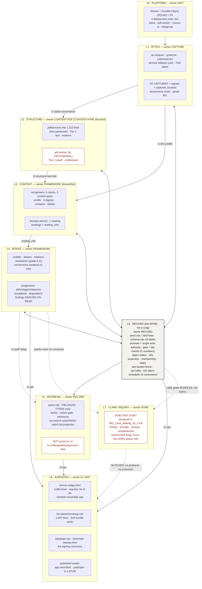
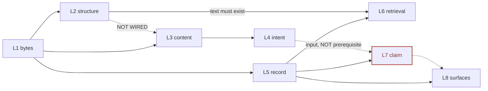

# Layers of services: what each provides, consumes, and must not know

Written 2026-08-01 (research pass, no area claimed — this file creates one document and
edits nothing else). **Every claim about the code names its file and line.** Anything
not verified in this pass is marked UNVERIFIED. Line numbers are as of the working tree
at commit `360952e`.

Companion to, not a replacement for: `MILESTONES.md` (the capability ladder),
`INTERFACES.md` (I1–I6), `PARALLELISM.md` (areas and deployment units),
`PROCESS-INVENTORY.md` (the same corpus measured along the PATH rather than the STACK).
Where this file and `PROCESS-INVENTORY.md` overlap, they were measured independently and
agree; where a number differs from `UI-PLAN.md`, `UI-PLAN.md` is the stale one (§7.1).

---

## 0. The frame, and the two places the code contradicts it

The frame given: layers are **bytes → structure → content → intent, plus retrieval, plus
surfaces**; member-facing constructs are FOUR — `information`, `inquiry`, `action`,
`project`.

**The construct half holds, with one measured failure.**

| construct | frame says | code says | evidence |
| --- | --- | --- | --- |
| `information` | captured document + provenance | BUILT, and it is the construct the member most drives | `bio-checks.mjs:24` `OBJECT_TYPES.INFO`; `app.html:6457` `ADD_TYPES` |
| `inquiry` | recursive claim structure, named inquiry/finding/case by phase | **NOT BUILT.** `focus` is the OPEN phase only — `surfaced/elevated/deferred/dismissed`, `elevated` terminal. No concluded phase, no published phase, no basis recursion, no strength, no completeness field | `bio-checks.mjs:56-64` |
| `action` | outward engagement | BUILT as an OBJECT with a five-state machine; **no op moves its state**, and the one surface that writes it writes placeholders | `bio-checks.mjs:74-79`, `:1285-1300`; `app.html:1752` writes `action_kind: other`, `risk_tier: 1`, `counterparty: to be named` |
| `project` | workspace with membership and access control | BUILT, 10 `project*` ops (`index.mjs:228-243`), 2 reachable from a surface | `bio-checks.mjs:65-72` |

**The layer half is incomplete in two ways, and both matter for scheduling.**

1. **There is a fifth layer the list omits: the RECORD.** `store.mjs` is **7,643 lines**
   (`wc -l`, 2026-08-01 — `CLAUDE.md`'s "~4,900" is stale), `schema.mjs` declares **43
   tables**, and `bio-checks.mjs` is 2,857 lines of state machine and entry requirement.
   Every other layer's output persists through `op=promote` and is judged by the check
   catalog. This is not "bytes" and it is not "below bytes": bytes, structure, content
   and intent all write INTO it and read back OUT of it. Naming it is the difference
   between a stack and a spine — see the diagram in §1, where it is drawn as a column
   rather than a rung.

2. **"Retrieval" is not one layer — it is two disjoint ones that share no vocabulary.**
   `query.mjs` (754 lines) compiles a query language over 25 projected frontmatter
   fields (`query.mjs:47-73`), FTS5 over five text columns (`:80`), facets, a viewer
   gate (`:96`, `:121`) and selections. The intent layer has its OWN reads —
   `op=concerns`, `op=connections`, `op=instance`, `op=proposals`,
   `op=captureprogressions` — over derived tables `query.mjs` cannot see. `FIELDS`
   contains no `entity`, no `grade`, no `progression`. "Every document that concerns
   this ordinance" is `op=concerns`, and `op=search` cannot answer it. Two retrieval
   systems, no join, no shared field vocabulary.

Everything below is written against the corrected picture.

---

## 1. The layer map



### Inputs, outputs, owner — one row per layer

| layer | consumes from below | produces | owner area | interface out | deployment unit |
| --- | --- | --- | --- | --- | --- |
| **L0 platform** | Cloudflare account | Worker + DO + R2 + service bindings | `DIST` | I4 (release artifact) | all four |
| **L1 bytes** | L0 | bytes, provenance chain, grade, transport record, register row, R2 object | `CAPTURE` | **I1** (STABLE 1.2.0) | bio-plane |
| **L2 structure** | I1 §2/§3 (R2 key, `op=capture`) | links partitioned + element refs + per-page text + tier | `CONTENT-PDF`; `CONTENT-HTML` dormant | **I2** (STABLE 1.0.0), **I6** (PROVISIONAL) | bio-plane + pdf-worker |
| **L3 content** | I1 §4 frontmatter, I2 text | profile (stack + type + confidences + versions), 3 digests, reading (entities + facts) | `FRAMEWORK` (`docprofile/`) | none registered — carried on I1 §4c and in `readings` (I5) | bio-plane (flattened into civicos-ui too) |
| **L4 intent** | `reading_refs` | entities, resolutions (A–D), connections, progressions, derive-on-read findings | `FRAMEWORK` | I5 tables + I3 read ops | bio-plane |
| **L5 record (spine)** | every layer's output | persisted objects, states, checks, membership, the two-bucket fence, ratification, the scheduler | `RECORD` | **I5** (STABLE 1.8.0), produces **I3** | bio-plane |
| **L6 retrieval** | L5 tables | query language, FTS, facets, sorts, selections | `RECORD` | I3 | bio-plane |
| **L7 claim** | — | — | **NONE** | — | — |
| **L8 surfaces** | I3 | screens, the wizard, the signing page, the published reader | `UI`, `DIST` | — | civicos-ui, newgroup |

### The "must not know" rule, per layer, as the repo states it

| layer | must not know about | where the rule is written | is it enforced? |
| --- | --- | --- | --- |
| L1 bytes | what a content area does with the bytes | `INTERFACES.md:38-42` | **NO — inverted.** L1's `op=acquire` runs L3 and calls a doctype reader inline (§4, V1) |
| L2 structure | how the bytes were fetched, the governor, subresources, the archive fallback | `INTERFACES.md:38-42` | **PARTLY.** `pdfstructure.mjs:43` imports from `subresources.mjs` (§4, V2) |
| L3 content | who captured, and whether a judgment is authoritative — it is advisory only | `INTERFACES.md:174`, `:199` | YES, structurally: the profile is a sibling field, never a gate |
| L4 intent | the fetch path; and it must NEVER resolve THROUGH a declared relation | `INTERFACES.md:641-643` (D-83) | YES, stated as a write-path rule in `op=resolve` |
| L5 record | nothing — it is the spine, and that is the problem: it knows all four | — | n/a |
| L6 retrieval | frontmatter semantics beyond its 25 projected fields | `query.mjs:47-73` | YES by construction (a fixed field table stops arbitrary SQL) |
| L8 surfaces | how a judgment was computed; it renders what the plane sends | `app.html:5285` states it for grades | **NO.** The surface carries and RUNS all of L3 (§4, V3) and composes L6's DSL by hand (§4, V6) |

---

## 2. Per layer: built today · designed-not-built · missing entirely

### L0 · Platform

| | |
| --- | --- |
| **TODAY** | Four deployment units, three with pinned `account_id`: `bio-plane/wrangler.jsonc`, `pdf-worker/wrangler.jsonc`, `newgroup/wrangler.jsonc`; the UI ships as `civicos-ui/worker.template.mjs`, which serves a base64-inlined `app.html` and proxies `/api` over an `env.PLANE` binding (`worker.template.mjs:13-21`). Fleet rules: `PARALLELISM.md:92-117`. |
| **DESIGNED, NOT BUILT** | The installer installs ONE Worker, not the fleet (D-115); version authority across the fleet (D-116). Both are `M7`. |
| **MISSING** | Capture-byte custody at scale — `MILESTONES.md:296-298` states plainly that no document in the repository addresses R2 growth, retention, the free-tier ceiling, or a second copy, against one measured 39.6 MB budget book. |

### L1 · Bytes

| | |
| --- | --- |
| **TODAY** | `op=acquire` (declared `index.mjs:383`; body through `:2260`) — fetch, hash at receipt, transport record with every response header unallowlisted, provenance hop 0, grade B direct / C archive, three-valued authority. `op=capture` GET/PUT with range support (I1 §3). R2 key `${store}/captures/${sha}` (I1 §2). Tables: `register` (`schema.mjs:85`), `captured_locators` (`:405`), `capture_limits` (`:234`), `site_assets`/`site_asset_refs` (`:260`,`:282`), `links`/`link_verdicts` (`:336`,`:366`), `source_reachability` (`:538`), `host_governor` (`:1041`). Archive fallback `cdx.mjs`; TSA co-attestation `tsa.mjs`; subresource walk `subresources.mjs` (1,198 lines). An `archive-monitor` scheduler consumer (`store.mjs:911-916`). |
| **DESIGNED, NOT BUILT** | Client-rendered capture — doctrine RULED, shape decided provisionally as `rendered_origins[]` (`MILESTONES.md:171-188`), no code. OOXML/ODF container + the FORMAT registry (D-121, `OFFICE-FORMATS.md`). Per-document cadence from observed volatility (`ARCHIVE-FALLBACK.md`). |
| **MISSING** | Byte custody at scale (above). Nothing else structural — this is the most complete layer in the system. |

### L2 · Structure

| | |
| --- | --- |
| **TODAY** | `extractPdfStructure()` (`pdfstructure.mjs`, 1,313 lines) → four link partitions + `undetermined`, element reference = 0-based page + annotation rect, Tier-1 in-plane text with per-region `Marker`s naming the cause (never mojibake). `op=pdfstructure` (`index.mjs:371`, body `:1417-1427`) stamps `tier:1`. `pdf-worker/src/index.mjs` is Tier 2 (`unpdf` 1.8.0 pinned), called only when Tier 1 got essentially nothing. |
| **DESIGNED, NOT BUILT** | `CONTENT-HTML` as a SECOND I2 producer — the residual that would exercise the container-agnostic claim (`INTERFACES.md:435-443`). The FORMAT registry that HTML and PDF would move onto (`MILESTONES.md:152-160`, D-70: "this uniformity has never been tested because no third axis has been added"). |
| **MISSING** | Table/row geometry (deliberately — `INTERFACES.md:347-352`), OCR, visuals. And: **the pdf-worker is undeployed**, so on the live instance the Tier-2 escalation path is dark even though code and binding config are landed (`INTERFACES.md:838-842`). |

### L3 · Content

| | |
| --- | --- |
| **TODAY** | `docprofile/` — `recogniser.mjs` (one confidence ladder, `makeRegistry`), `index.mjs` (regions, `applyRules`, `applyBoundary`, `digests`, `compare`, `fidelity`), four stack handlers, two doctypes (`meeting-calendar`, `generic`), `events.mjs` (one catalogue, significance graded once). Consumed by `op=acquire`: `identify()` `index.mjs:2069`, `doctypeFor()` `:2070`, `digests()` `:2127`, `docType.type.parse()` `:2187`. Persisted at `op=promote` into `readings`/`reading_refs` (`store.mjs:2895-2932`), read through `op=reading`/`op=readingref` (`index.mjs:428-429`). The evidentiary digest is consumed by `op=audit`'s duplicate sweep (C-18.3). |
| **DESIGNED, NOT BUILT** | CONSTRUCTS Step 6 — monitoring adopts the contracts, frequency by document kind (`CONSTRUCTS.md:248`, UNSCHEDULED). Step 9 — more content types and stacks, each measured first (`:289`). A third axis (FORMAT) of the same registry shape (framework §4 `BIO_Content_Framework_v0_10.md:339-350`). |
| **MISSING** | **Any content type but a meeting calendar.** The registry has exactly two members, one of which is the never-matching fallback. The framework's §9 cost table promises a new type costs "one recogniser file, one registry line"; that promise has been exercised **once**. |

### L4 · Intent

| | |
| --- | --- |
| **TODAY** | Ten tables: `entities` `schema.mjs:665`, `entity_aliases` `:682`, `entity_relations` `:709`, `resolutions` `:757`, `connections` `:814`, `progression_defs` `:851`, `progression_stages` `:867`, `progression_instances` `:906`, `progression_exceptions` `:946`, `connection_dirty` `:984`, plus `proposal_dispositions` `:1019`. Writes: `entitycreate`, `entityalias`, `relationdeclare`, `resolve`, `resolvetestify`, `connect`, `progressiondefine`, `thread`, `discharge`, `proposedispose`. Reads: `entity`, `entitybyalias`, `relation`, `resolutions`, `concerns`, `connections`, `progression`, `instance`, `exceptions`, `proposals`, `captureprogressions`. Two findings, both DERIVED ON READ (never stored, so they cannot go stale): `missing_predecessor`, `overdue_successor`. Two scheduler consumers: `connection-derive` (`store.mjs:921-932`) and `overdue-scan` (`:936-953`). |
| **DESIGNED, NOT BUILT** | CONSTRUCTS Steps 5a (measure Oakland's shared identifiers), 8 (presentation), 8a (satisfaction conditions), 8b (the discovery loop with unattended surfacing) — `CONSTRUCTS.md:241-289`. Junction checks as findings. Auto-assembly of progression instances on the derive tick (unblocked by REC-5, `QUEUE.md:239`). |
| **MISSING** | Objectives, aspirations, goals, satisfaction (D-75/D-76 — "the framework and the object catalogue have never been connected"). `object_type: bias` (D-84) and the whole bias manifest/debt/decay/measure family (D-85–88). **The FLOW MODEL** (D-128, `BIO_Case_Making_v0_1.md:239-242`) — how an institution is supposed to work, declared and refined; named as a missing construct in the case-making pass. |
| **THE ACCESS FACT** | **Every write op in this layer is unreachable from every surface.** Verified in `PROCESS-INVENTORY.md:145-146` and independently here: `entitycreate`, `entityalias`, `relationdeclare`, `resolve`, `resolvetestify`, `connect`, `progressiondefine`, `thread`, `discharge` have no `app.html` caller. The axis populates ONLY through `op=promote`'s reading extraction plus REC-5's auto-derive. A member cannot declare how an institution is supposed to work. |

### L5 · Record (the spine)

| | |
| --- | --- |
| **TODAY** | `schema.mjs` 43 tables; `store.mjs` 7,643 lines, ~170 methods; `op=promote` the single write authority; `gate.mjs` + `bio-checks.mjs` (2,857 lines, C-numbers, 49 per-state requirements); object types and their state machines (`bio-checks.mjs:24`, `:51-80`); `refs` as a PROJECTION of frontmatter, never written directly (`index.mjs:322-326`, D-21); membership/sessions/capabilities; `inbox`/`knock` doorbell; `tasks`/`task_queue`; the two-bucket fence + `published_bundles`/`published_shas` (`schema.mjs:177`,`:186`); `op=ratify` (`index.mjs:401`, capability `publish` `:765`); `op=export`/`exportlog`; `op=audit`; `op=purge`; and the **DO-alarm scheduler** (`store.mjs:842-1000`) with five real consumers and a reconciling earliest-wake. |
| **DESIGNED, NOT BUILT** | WARC + Memento interchange (D-99 — "a one-paragraph commitment with no shape, no acceptance test and no owner"). `registerAudit` cannot tell captured from unbacked because it never looks in R2 (D-9). |
| **MISSING** | Nothing structural for the four BUILT constructs. Everything missing here is L7's (§5). |
| **STALE PLAN NOTE** | `MILESTONES.md:509` still lists "**no scheduler exists**" as an M1 item. It exists: REC-1 landed (`QUEUE.md:197` `REC-1 · done`) and four further consumers have been registered on it since. |

### L6 · Retrieval

| | |
| --- | --- |
| **TODAY** | `query.mjs` (754 lines): 25 typed fields (`:47-73`), FTS5 over `title/body/meta/locator/authority` (`:80`), sortable on every projected field plus relevance (`:84`), default facets (`:90`), a viewer gate marker every generated statement must carry (`:96`, `:121`), `compile()` (`:597`), `IDS_MAX` 50,000 (`:595`). Ops: `search`, `searchfields`, `searchindexcheck`, `select`, `selection`, `selectionlist`, `selectionrelease`, `list`, `projection`, `image`. |
| **DESIGNED, NOT BUILT** | Nothing designed and unbuilt inside its declared scope — `RETRIEVAL-SUBSTRATE.md` measured all five verbs and they shipped. |
| **MISSING** | (a) **Captured document text is not indexed.** `bundles_fts` indexes frontmatter and inline `.md`/`.txt` only, capped at 128 KB per column, so a group that captures 500 agenda packets can search its notes about them and not the packets (`MILESTONES.md:265-268`). (b) **No path from retrieval to L4.** `FIELDS` has no entity, grade, connection or progression column, so the query language cannot reach anything `FRAMEWORK` built. |

### L7 · Claim / inquiry

| | |
| --- | --- |
| **TODAY** | **Nothing.** `focus` is the first phase of the designed object and nothing more: `bio-checks.mjs:56-64` gives it `surfaced/elevated/deferred/dismissed` with `elevated: []` terminal. There is no `concluded` state, no `published` state, no basis field, no strength, no completeness assertion, no division. |
| **DESIGNED, NOT BUILT** | The whole of `BIO_Case_Making_v0_1.md` (494 lines): the recursive inquiry object with three phase names (RULED, `:408`), weakest-link strength composition, division-by-supersession with authored apportionment, the completeness claim as an authored act at publication, audience renderings that state what they excluded. |
| **MATERIAL THAT WOULD FEED IT, ALREADY BUILT** | `REL_VOCAB` (`bio-checks.mjs:759`) already carries `cites`, `derived_from`, `supersedes`, `corroborates`. `refs` (`schema.mjs:76-82`) is a `(bundle_id, target_id, kind)` edge table with a target index. The `reeval_flag`/`reeval_since`/`reeval_source` cascade (`query.mjs:70-72`) is the mechanism a superseded case would need to invalidate its citers. **None of these has a consumer at claim altitude.** |
| **MISSING ENTIRELY** | An authored derived object of any kind. The nearest thing the plane has — `op=proposals` + `op=proposedispose` — is deliberately NOT one: declining a proposal "mints no bundle" because "declining is not authoring" (`INTERFACES.md:564-573`). So L7 has no precedent to extend; it is the first authored derived object in the system. |

### L8 · Surfaces

| | |
| --- | --- |
| **TODAY** | `civicos-ui/app.html` (6,864 lines) reaching 34 distinct ops of 94 member-reachable (`PROCESS-INVENTORY.md:41-47`, measured 2026-08-01); 18 member processes (`PROCESS-INVENTORY.md` §2). `bio-plane/src/setup.mjs` (1,097 lines) — the installer wizard, a SECOND bundle-writing surface. `signpage.mjs` + `tools/sign-release.html` — the signing ceremony. The published reader: `app.html:6841` `enterPublished` works, `pubOpen` is an honest stub. |
| **DESIGNED, NOT BUILT** | The interaction constructs at v0.2 — QUEUE and ACT, the weight ladder, UNDETERMINED as a display primitive (`MILESTONES.md:11-34`). Build order T → J → B(+S) → P → A. |
| **MISSING** | **`op=ratify` has ZERO occurrences in `app.html`** (verified by `grep -c ratify` = 0), while `tools/sign-release.html` instructs the operator to paste the signature into a ratify box that does not exist. Also absent: `cite`, `sever`, `reinstate`, `retire`, `export`, the whole joining path (`knock`/`invitelook`/`enroll`/`claim`/`inbox*`), 7 of 10 project-governance ops, all three expertise ops, and every L4 write. |

---

## 3. The dependency truth

### The graph as the code actually constrains it



### Real dependencies (a layer genuinely cannot proceed)

| dependent | blocked on | why it is REAL | evidence |
| --- | --- | --- | --- |
| L2 structure | L1 bytes | there is nothing to parse until bytes exist and are addressable | I1 §2/§3; `pdf-worker` reads R2 directly by key |
| L4 intent | L3 readings | a resolution matches a `reading_refs` reference to an entity; with no readings the registry has nothing to resolve | `INTERFACES.md:629-634` |
| L4 connections | L4 resolutions | a connection is two documents resolving to the same entity | `INTERFACES.md:651-660` |
| L6 search-over-content | L2/L3 text | you cannot index text that has not been extracted | `MILESTONES.md:271-273` |
| L3 readings **for PDFs** | **an unbuilt L2→L3 wire** | `op=acquire` gates the reader on a content-type regex admitting only `text/*`, `xml`, `json`, `+xml` (`index.mjs:2054`), and the reader runs over the text read at acquire (`:2184`). **Nothing feeds `op=pdfstructure`'s text into a doctype reader.** A PDF therefore has structure and can never have a reading. | `index.mjs:2052-2054`, `:2184-2187` |
| Tier-2 escalation on a live instance | a DIST deploy of the fleet | code and binding are landed; the Worker is not deployed | `INTERFACES.md:838-842` |

### Apparent dependencies that are NOT real

| the belief | why it is false | evidence |
| --- | --- | --- |
| **"Case-making waits on M4."** | An inquiry's basis is documents and other inquiries. Documents are L1/L5. Recursion is an edge in `refs` with a `kind` from `REL_VOCAB`, both of which exist. L4's entity axis is an INPUT to a finding, never a precondition for one. | `bio-checks.mjs:759`; `schema.mjs:76-82`; `BIO_Case_Making_v0_1.md:335` |
| **"Claim strength waits on connection grades (D-72)."** | D-72 is BUILT: `connections.grade` is the weaker of two ends and `progression_instances` inherit the weakest along the chain. The dependency runs the OTHER WAY — those grades **have no consumer** and will not have one until L7 exists. | `schema.mjs:814`; `INTERFACES.md:660-667`; `BIO_Case_Making_v0_1.md:100-103` |
| **"Audience rendering is separate work."** | It is downstream of the finding phase and blocked by nothing else; the repo grounds NO audience difference anywhere except an unwritable field on `action`. | `PROCESS-INVENTORY.md:236-238`, `:211-220` |
| **"The surfaces wait on the plane."** | Inverted at scale: 60 member-or-public-reachable ops have no caller. M8 states "Depends on: nothing. Every op it needs already ships." | `MILESTONES.md:349`; `PROCESS-INVENTORY.md:169` |
| **"The entity axis waits on a member populating it."** | REC-5 made connections self-derive on the DO alarm; what is missing is a WRITE SURFACE, not a mechanism. | `store.mjs:921-932`; `PROCESS-INVENTORY.md:145` |
| **"M1 waits on a scheduler."** | The scheduler landed and now carries five consumers. `MILESTONES.md:509` is stale. | `store.mjs:842-1000`; `QUEUE.md:197` |

### What can proceed independently, right now

- **L7 (the claim layer)** — depends on L5 only, all of which ships. This is the single
  most consequential finding in this file, because the whole ladder currently reads as
  though L7 is at the top and therefore last.
- **L8 (surfaces)** — 60 unreached ops, no blocker.
- **L6's content-indexing half for HTML** — HTML text is already read back at acquire
  (`index.mjs:2054-2062`); only the PDF half waits on L2.
- **L2's HTML producer** — `CONTENT-HTML` needs nothing that is not shipped.
- **L1's office-container work** — measured feasible with zero dependency
  (`MILESTONES.md:145-150`).

### The genuine serial chain, and it is short

```
L1 bytes  ->  L2 PDF text  ->  [MISSING WIRE]  ->  L3 PDF readings  ->  L4 entities for PDFs
```

Everything else in the system is parallel to it. The chain matters because **the document
class the city actually publishes most is a PDF**, so today the entire intent layer runs
on HTML pages only.

---

## 4. Layer violations, with file and line

**V1 · The bytes layer runs the content AND intent layers inline.**
`bio-plane/src/index.mjs:2069` `identify()`, `:2070` `doctypeFor()`, `:2127` `digests()`,
`:2187` `docType.type.parse()` — all inside `op=acquire`, which `PARALLELISM.md:41`
assigns to `CAPTURE`, calling code `PARALLELISM.md:44` assigns to `FRAMEWORK`.
`INTERFACES.md:38-42` draws the boundary in ONE direction only ("a content area must not
reach into the fetch layer") and says nothing about the reverse, so this is legal by the
letter and is still a layer inversion by consequence: the content reader is hard-wired to
the acquire-time text read and its content-type gate at `index.mjs:2054`, which is
exactly why a PDF can never get a reading (§3). **The fix is not to move the code; it is
to give L3 an entry point that takes text from anywhere** — including I2.

**V2 · The structure layer imports the bytes layer's internal vocabulary, under no
interface.**
`bio-plane/src/pdfstructure.mjs:43` imports `LINK_TYPES` and `linkWrapper` from
`bio-plane/src/subresources.mjs:660` and `:664`. `INTERFACES.md:280-284` (I1, "What I1
does NOT include") says the subresource machinery is "CAPTURE's internal machinery… not
consumer surface. If a content area finds it needs one, that is an interface-change
proposal, not a reach into the schema." `INTERFACES.md:317-322` (I2, Status) celebrates
the same import as the structural guarantee of container-agnosticism. **Both cannot be
right.** The link-partition vocabulary is a real cross-layer contract with no ID and no
owner; today `CAPTURE` could rename a wrapper and silently break I2's byte-identity
assertion in `pdfstructure.test.mjs`.

**V3 · The surface layer carries and EXECUTES the content layer.**
`civicos-ui/app.html:1841-3280` is a flattened copy of all thirteen `docprofile/` modules
(generated by `tools/bundle-docprofile.mjs`, drift-checked by
`civicos-ui/check-semantics.mjs:64-70` — so the COPY is disciplined). The violation is
what it is used for: `app.html:6696-6697` and `:6796-6797` run `identify()` + `compare()`
**in the browser**, over two whole captures fetched by hash, to answer "do we already hold
this document?". The plane already computed and stored that answer as
`document.profile.digests.evidentiary` (I1 §4c). `INTERFACES.md:250-255` names this exact
call site as a downstream consumer whose wiring "is recorded as a DELEGATION, not built by
FW-4" — a known, open inversion. Cost: two full document downloads per check, and two
independent judgments that can disagree with nobody noticing.

**V4 · The focus state machine exists in three places and the drift check binds the wrong
two.**
Authority: `bio-plane/checks/bio-checks.mjs:56-64` (`STATES.focus.legal` + `edges`).
Second copy: `bio-plane/src/store.mjs:1572-1579` — literal `FOCUS_STATES` and `LEGAL`
objects inside `dispose()`, under a comment at `:1573-1575` that claims they are taken
"from the catalog's own table rather than a second copy of it". They are a second copy;
`store.mjs` imports no `STATES`. Third copy: `civicos-ui/app.html:983-990` (`SEMANTICS`).
`civicos-ui/check-semantics.mjs:37-48` extracts states from **`store.mjs` source text**
and compares them to the UI — so the check binds copy 2 to copy 3, and copy 1, the
authority, is unchecked by anything.

**V5 · The record's object grammar is duplicated across two writing surfaces.**
`civicos-ui/app.html:1698` (`HEADINGS`) and `:1740-1756` (`mdFor`) versus
`bio-plane/src/setup.mjs:15` (imports `STATES`, `HEADINGS` from the catalog) and `:715-732`
(its own `mdFor`). D-62 is the receipt for the cost: one writer emitted `content_hash` and
the other did not, so every bundle a new group created through the wizard was permanently
unreleasable (`DEBT.md:87`; fixed 2026-07-31, and `MILESTONES.md:321` still lists it as
open). The installer is the better-layered of the two — it imports the catalog; the UI
copies it.

**V6 · The surface composes the retrieval layer's query DSL by hand.**
`civicos-ui/app.html:6676` (`hash:sha256:${sha256}`), `:6685` and `:6785`
(`locator:"…"`). `op=searchfields` exists (`index.mjs:306`) to publish that vocabulary and
has no caller. `app.html:4426` names the hazard in a comment about a different op — "would
drift from the plane exactly as the searchfields copy does (INTERFACES.md)" — so the
project knows, and it is still open (`MILESTONES.md:518`).

**V7 · The intent layer's grade vocabulary is restated in the surface.**
`civicos-ui/app.html:5293` `SUBJ_GRADE_HOW` and `:5307` `subjGradeBadge` map framework
§8.1's A–D to English. The comment at `:5285` correctly says `established`/`needsConfirm`
come from `op=concerns` and are "never re-derived from the letter here" — so the booleans
are properly layered — but the A–D → prose mapping is a second copy of §8.1 with no drift
check. Lowest severity of the seven; recorded because it is the shape V4 started as.

**Plan-surface staleness that changes the map** (not layer violations, but they will
misdirect any session reading the plan as the architecture):

| claim | where | measured truth |
| --- | --- | --- |
| "no scheduler exists" | `MILESTONES.md:509` | five consumers on the DO alarm, `store.mjs:842-1000` |
| "`store.mjs` is ~4900 lines" | `CLAUDE.md`, Traps | 7,643 (`wc -l`, 2026-08-01) |
| D-62 open under M7 | `MILESTONES.md:321` | resolved 2026-07-31, `DEBT.md:87`, `setup.mjs:732` |
| "Step 4 — QUEUED FW-6", "Step 5 — UNSCHEDULED" | `CONSTRUCTS.md:221`, `:232` | both BUILT (FW-6 … FW-10); Step 7 in the same file IS marked BUILT, so the file was half-updated — against `MILESTONES.md:548`'s own rule |

---

## 5. Where the layering BREAKS under case-making

Case-making does not sit on top of this stack. It needs a layer that was never cut, and
five things below it were built as if it would never arrive.

**B1 · There is no place in the stack for an AUTHORED DERIVED object.**
Every layer above L5 today is one of two things: derived-on-read (L4's
`missing_predecessor`, `overdue_successor` — recomputed every read precisely so they
cannot go stale) or rendering (L8). A finding is neither: it is authored by a member,
persisted, and cited by other findings. The one place the plane came close —
`op=proposedispose` — chose the opposite deliberately: it "mints NO bundle" because
"declining is not authoring" (`INTERFACES.md:564-573`). So L7 has **no precedent to
extend**, and the derive-on-read discipline that is correct everywhere below it is wrong
for it.

**B2 · Strength was built at the document altitude and does not lift.**
`resolutions.grade` A–D grades HOW A REFERENCE WAS MATCHED TO A SUBJECT
(`INTERFACES.md:634-643`). `connections.grade` is the weaker of two such matches
(`:660-664`). `progression_instances`' grade is the weakest along a chain of such matches.
Every one of these grades a LINK BETWEEN A DOCUMENT AND AN ENTITY. A claim's strength is
how well evidence supports an ASSERTION — a different question over a different graph.
Composing L7 strength out of L4 grades would make a case's strength a function of
entity-resolution method, which is the same category error D-83 names when it refuses to
grade a constitutive relation. **Nothing today composes anything over `refs` /
`REL_VOCAB` edges**, which is the graph a finding's basis actually lives on.

**B3 · The publication fence ratifies BUNDLES, and a case's gate is a different question.**
`op=ratify` (`index.mjs:401`, capability `publish` `:765`), `published_bundles` /
`published_shas` (`schema.mjs:177`,`:186`), and C-18.9's provenance-chain gate all ask
"can this material be attributed". A case's gate is "has the author stated what was
excluded, and why" (`BIO_Case_Making_v0_1.md:294-303`) — an authored, never-prefilled
field, and a gate no system can verify. The fence has nowhere to put it. **And it is
worse than a design gap: `op=ratify` has zero callers in `app.html`**, so the boundary act
the case layer must extend has never been performed through a member surface at all. The
top rung of the weight ladder is untested by use.

**B4 · The basis edge is nearly right and is missing exactly what division needs.**
`refs` is `(bundle_id, target_id, kind)` (`schema.mjs:76-82`) and `REL_VOCAB`
(`bio-checks.mjs:759`) already carries `cites`, `derived_from`, `supersedes`,
`corroborates`. That is enough for basis recursion and for supersession-on-division. It is
NOT enough for what the ruling on division actually requires: **who apportioned which
evidence to which successor** (`BIO_Case_Making_v0_1.md:444-446` — "evidence must never be
silently reassigned — the split records who apportioned what"), the weight a leg carried,
or a contradiction held without resolution (open question 5, `:485-486`). And `refs` is a
PROJECTION never written directly (`index.mjs:322-326`, D-21), so basis edges must be
authored in `bundle.md` and projected — which is consistent, but means the recursion's
integrity is a check-catalog problem rather than a schema constraint.

**B5 · No state machine in the catalog can express "this object stops and two continue".**
`focus.edges.elevated: []`, `information.retired: []`, `action.resolved: []` /
`abandoned: []` — every terminal in `bio-checks.mjs:51-80` is a dead end for ONE object.
`elevated_into` is the only promotion edge and it is one-to-one. Division needs a
one-to-many terminal that carries basis apportionment with it, and there is no shape in
the catalog it resembles.

**B6 · The attention layer is built for tasks, not for claims.**
`tasks` (`schema.mjs:491`) carries `open`/`forwarded`/`resolved`, one task kind
(authority-undetermined), no per-member state and no clock (`PROCESS-INVENTORY.md:150-164`;
D-125). DEC-10 — whether an overdue finding escalates beyond a proposal — is raised and
unresolved. So the layer that must one day say "a case you cited was superseded" or "this
case's exclusion field is empty" does not have the shape to say it.

**B7 · The ONE mechanism case-making can reuse rather than invent.**
`reeval_flag` / `reeval_since` / `reeval_source` (`query.mjs:70-72`) plus the cascade
semantics the functional architecture records (`BIO_Functional_Architecture_v3.md:166-168`
— "a detected modification propagates a re-evaluation flag to every object citing it") is
exactly the obligation a superseded case creates for everything that cited it
(`BIO_Case_Making_v0_1.md:468-471`). It is document-scoped today and would need to walk
basis edges. Worth naming because it is the only place in this section where the answer is
"extend", not "cut a new layer".

**B8 · Audience rendering has no layer to live in.**
`app.html` is simultaneously the member workspace and the public reader
(`enterPublished` `:6841`, `pubOpen` a stub). A rendering that selects claims clearing a
threshold and STATES what it excluded is a distinct output stage with its own contract;
today it would be a function inside a 6,864-line HTML file. The framework's §9 cost
discipline applied to audiences (`BIO_Case_Making_v0_1.md:168-176`) has no structure to be
cheap in.

---

## 6. What this implies for the ladder (offered, not decided)

`MILESTONES.md` M0–M8 contains no rung for the thing `CLAUDE.md` says the system is for.
That is consistent with the design pass being open and is recorded here as a structural
consequence rather than an oversight: **the ladder is ordered bottom-up through the layer
stack, and the missing layer is L7, which is not at the top of the stack — it sits beside
L6 on the L5 spine.** A rung for it depends on nothing that is unbuilt.

The three lowest-cost moves that would close the most layering distance, in order of
consequence per hour:

1. **Cut L7 against L5 only** — an authored object with a basis edge, a concluded and a
   published phase, an authored exclusion field. It unblocks strength (B2), gives L4's
   grades their first consumer, and gives `op=ratify` its first caller.
2. **Wire L2 → L3** — one entry point on `docprofile` that takes text from anywhere, so a
   PDF can have a reading. Closes the only real serial chain in the system (§3).
3. **Give L4 a write surface** — nine ops, zero callers; the axis is otherwise
   self-populating from readings only.

---

## 7. Method

**Instruments.** `bio-plane/src/index.mjs` OPS table (`:201-546`) read directly;
`bio-plane/src/schema.mjs` `CREATE TABLE` grep (43 tables); `wc -l` for every size claim;
`grep -a` on `store.mjs` per `CLAUDE.md`; `grep -c ratify civicos-ui/app.html` = 0;
import graph via `grep -n "^import"` across `bio-plane/src/*.mjs`, `docprofile/**`.
Date 2026-08-01, tree at `360952e`.

**7.1 · Numbers this pass did NOT re-derive**, taken from `PROCESS-INVENTORY.md`
(2026-08-01) because that pass measured them with a parser and this one did not: 108 ops
declared, 94 member-reachable, 34 reached by the UI, 60 with no caller. `UI-PLAN.md`'s
85/63/18 is stale in both directions and should not be used to schedule.

**UNVERIFIED in this pass**, and named rather than guessed:
- Whether `newgroup/src/**` reaches any layer above L5 (it was not read; only its
  wrangler config and file list were).
- Whether every one of the 60 uncalled ops is truly uncalled — that is
  `PROCESS-INVENTORY.md`'s measurement, spot-checked here for `ratify` and `cite` only.
- Whether `pdf-worker`'s deployed state has changed since `INTERFACES.md:838-842` was
  written; no live probe was run.
- Line-level coverage of any layer: not measurable here, because the plane runs inside
  workerd (`CLAUDE.md`, verification step 2a).

---

## Summary — twelve lines

1. **L0 platform** — Worker + DO(SQLite) + R2, four deployment units; complete, except the installer ships one Worker instead of the fleet.
2. **L1 bytes** — `op=acquire`, register, R2, provenance, governor, archive fallback, TSA; the most complete layer, missing only byte custody at scale.
3. **L2 structure** — PDF links + Tier-1 text + `pdf-worker` Tier 2; one producer live, HTML dormant, the Tier-2 path undeployed.
4. **L3 content** — `docprofile` profiles, three digests, readings; four stacks and exactly ONE real content type, and it cannot read a PDF at all.
5. **L4 intent** — entities, A–D resolutions, graded connections, progressions, derive-on-read findings; fully built, and every write op is unreachable from every surface.
6. **L5 record (the spine, absent from the informal layer list)** — 43 tables, 7,643 lines, promote as sole write authority, the check catalog, the fence, the scheduler.
7. **L6 retrieval** — a real query language over 25 frontmatter fields, blind to captured document text and blind to every table L4 built.
8. **L7 claim/inquiry** — **does not exist**; `focus` is its open phase and nothing else; designed in full in `BIO_Case_Making_v0_1.md`.
9. **L8 surfaces** — 34 of 94 member-reachable ops reached; `op=ratify` has zero callers, so nothing this system produces can leave.
10. **GAP 1 — the missing layer is not at the top.** L7 depends on L5 alone, all of which ships. Treating case-making as the last rung is the single most expensive misreading available, because it makes the one unblocked high-value layer look blocked.
11. **GAP 2 — strength was built one altitude too low and cannot be lifted.** A–D grades measure how a document was matched to a subject; a claim's strength measures how evidence supports an assertion. Composing the second from the first repeats the category error D-83 already names, and nothing today composes anything over `refs`/`REL_VOCAB`, which is the graph a basis actually lives on.
12. **GAP 3 — the bytes layer runs the content and intent layers inline** (`index.mjs:2069`, `:2070`, `:2127`, `:2187`), so the content reader is welded to a text gate at `index.mjs:2054` that admits only textual bytes. A PDF therefore gets structure and can never get a reading — the only genuine serial chain in the system, and it blocks the intent layer on exactly the document class a city publishes most.
