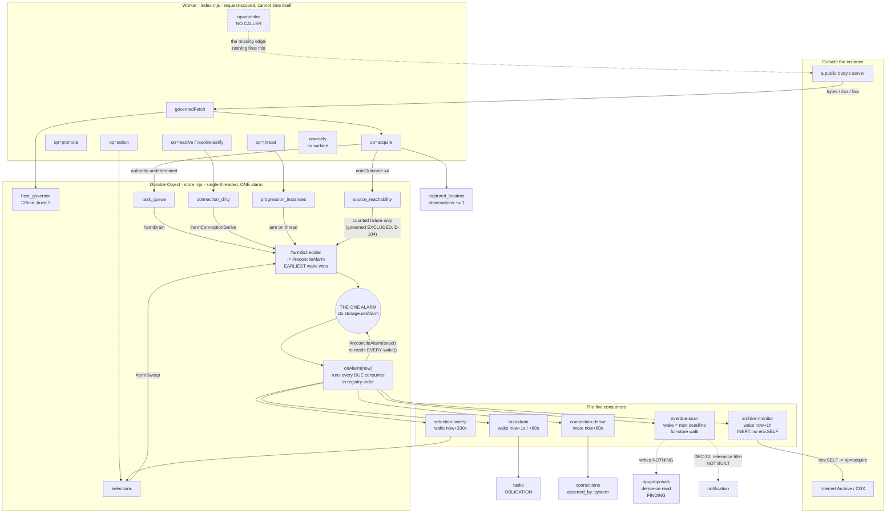

# Machine processes: everything the system runs with no user present

Written 2026-08-01 (research pass). **This file asserts nothing it did not measure.**
Every claim about the code names the file and, where it matters, the line. Anything
not verified in this pass is labelled **UNVERIFIED** rather than guessed. Every number
shows its arithmetic.

Companion to, and NOT a repetition of, `PROCESS-INVENTORY.md`, which inventories the
**user-driven** half (P1–P18 and the gaps). This file is the other half: what runs
because data arrived, because an event fired, or because the clock moved.

Reads consumed: `NOTIFICATIONS.md` (~30 generators, three classes), `MILESTONES.md`
(M1), `ARCHIVE-FALLBACK.md`, `CAPTURE-SCALING.md`, `LINK-FIDELITY.md`,
`SCHEDULER.md`, `architecture/CONSTRUCTS.md`, `architecture/BIO_Case_Making_v0_1.md`,
`DECISIONS.md` DEC-10, `DEBT.md` (D-52, D-61, D-65, D-79, D-95, D-98, D-104, D-109,
D-111, D-118, D-122, D-125). Code measured: `bio-plane/src/store.mjs` (7,643 lines),
`bio-plane/src/index.mjs` (3,055 lines), `bio-plane/wrangler.jsonc`,
`bio-plane/src/query.mjs`, `bio-plane/test/archive-monitoring.test.mjs`.

This file did NOT claim an area in `CLAIMS.md` — it creates one document and edits
nothing else, following the precedent `PROCESS-INVENTORY.md` set in its own header.

---

## 0. The brief's premise, corrected before anything is built on it

The task was framed as *"The plane today has ONE Durable Object alarm serving the
selection sweep and the task drain."* **That was true on 2026-07-31 and is stale.**
Measured in `store.mjs:894-967`, the registry `#schedConsumers` holds **five** real
consumers, not two:

| # | consumer | registered at | landed as |
| --- | --- | --- | --- |
| 1 | `selection-sweep` | `store.mjs:896` | pre-REC-1 |
| 2 | `task-drain` | `store.mjs:901` | CAP-2 / D-109 |
| 3 | `archive-monitor` | `store.mjs:917` | CAP-3 |
| 4 | `connection-derive` | `store.mjs:931` | REC-5 / D-122 |
| 5 | `overdue-scan` | `store.mjs:951` | REC-8 |

plus an env-gated synthetic probe family (`store.mjs:956-965`, inert unless
`SCHED_PROBE` is set). It is still **one alarm** — `#reconcileAlarm`
(`store.mjs:1025-1034`) sets exactly one `ctx.storage.setAlarm`, and `SCHEDULER.md`
is the ruling that says why (granularity, self-termination, locality).

**So the scheduling question in §3 is not "can one alarm serve them all" in the
abstract. It is: the third, fourth and fifth consumers already arrived, in one week,
and the mechanism absorbed them. What breaks is measured against that.**

One more correction that matters more than the count: **consumer 3 is INERT on every
deployed instance.** `#monitorConfigured()` (`store.mjs:7109-7111`) requires
`env.SELF` and a `MONITOR_TOKEN`/`ADMIN_TOKEN`. A repo-wide search for the binding
finds `env.SELF` in exactly two places — the consumer itself (`store.mjs:7080, 7110,
7167`) and the **test harness** (`bio-plane/test/archive-monitoring.test.mjs:80`,
`serviceBindings: { SELF: ... }`). `bio-plane/wrangler.jsonc` declares one service
binding, `PDF_WORKER`, and no `SELF`. Nothing in `newgroup/src/` provisions one.
**The archive fallback consumer is built, tested, and wired to nothing in
production.** That is by design per its own comment ("live wiring is per-instance…
provisioned by the installer/CONDUCT") — but as of this measurement no installer
provisions it, so M1's acceptance clause *"a source dark past the D-104 threshold
produces a grade-C archive capture"* is **not met on any real instance**.

---

## 1. Every machine-driven process

Trigger vocabulary: **CLOCK** (the alarm fires with no new input), **EVENT** (a
member or machine act arms or invokes it), **DATA** (bytes arriving change what is
true). Notification class per `NOTIFICATIONS.md`.

### 1a. Built and running

| # | process | trigger | what it does | what it emits | class | exists today |
| --- | --- | --- | --- | --- | --- | --- |
| M1 | **selection sweep** | CLOCK, wake `now + 300000 + 30000` (`store.mjs:898-899`) | deletes `selections`/`selection_items` past `expires` (`#sweepSelections`, `:826-834`) | `{swept:n}` in the alarm return | none | **YES** |
| M2 | **task drain** | EVENT (`taskEnqueue` → `#armDrain`, `:6732, 6740`) then CLOCK re-arm at 1s / 60s backstop (`:903-905`) | resolves each queued capture through `register`, applies the RULED routing order (`#routeTask`, `:6754-6780`), runs the C-19.1 grammar, writes or FOLDS a task | `tasks` rows; `created`/`folded`/`refused`/`waiting` lists | **OBLIGATION** (member task) | **YES** |
| M3 | **connection derive sweep** | EVENT (`#upsertResolution` stamps `connection_dirty`, `:3237, 3249`; resolve arms at `:3343, 3376`) then CLOCK at 60s (`:746`) | derives graded connections for ≤100 dirty entities, `asserted_by:"system"` (`#deriveConnectionsSweep`, `:782-794`) | `connections` rows | FINDING (latent — nothing notifies) | **YES** |
| M4 | **overdue scan** | EVENT (`thread` arms, `:3861`) then CLOCK at the **earliest future deadline** (`:953`) | walks every `(progression_key, entity_id)`, computes determinable deadlines, counts those past (`#overdueScan`, `:4095-4110`) | **nothing is written** — it is the push signal only; the finding is derived on read in `op=proposals` | **FINDING** (`overdue_successor`) | **YES**, and it writes nothing by design (`:3962-3967`) |
| M5 | **archive-fallback monitor** | EVENT (a counted source failure arms, `:7242`) then CLOCK at 1h (`:7095`) | for ≤50 failing addresses, re-checks `sourceReachability`, and for the eligible fires `op=acquire{via:"archive.org"}` over `env.SELF` (`#monitorTick`, `:7137-7157`) | a grade-C archive capture with a two-hop provenance chain | **CONDITION** (fallback eligibility, D-104) | **BUILT, INERT** — no `SELF` binding exists outside the test harness |
| M6 | **per-host governor** | DATA, on every outbound fetch (`index.mjs:130` `governedFetch`) | token bucket, jittered gap, 429 cool-off with doubling escalation (`store.mjs:6114-6187`) | `HOST_COOLING_OFF` 429 to the caller; `host_governor` rows | **CONDITION** ("PACED, not broken", D-103) | **YES**, but passive — it holds no wake and has no actor |
| M7 | **source-outcome recording** | DATA, four sites in the acquire path (`index.mjs:1637, 1644, 1648, 1651`) | closed-vocabulary outcome per document address; a **governed** refusal is counted in its own column and moves no threshold (`store.mjs:7205-7215`) | `source_reachability` rows | none directly; feeds M5 | **YES** |
| M8 | **subrequest-ceiling calibration** | DATA, on the first `PLATFORM_LIMIT` in a run | records the count reached; the rest become `DEFERRED` | `capture_limits` | **CONDITION** (D-54/D-56) | **YES** (`CAPTURE-SCALING.md` item 4, BUILT) |
| M9 | **site-asset accumulation and reuse** | DATA, on every subresource capture | maintains `site_assets`/`site_asset_refs`; reuses stored bytes with `fetched_this_capture:false` | manifest reuse notes | CONDITION (latent) | **YES** (`CAPTURE-SCALING.md` items 1–3, BUILT) |
| M10 | **capture-session pruning** | EVENT, lazily on the way past (`store.mjs:6438, 6456`) | `DELETE FROM capture_sessions WHERE expires < now`, TTL 1h (`:6435`) | nothing | **CONDITION** ("TTL expiring with work outstanding") — **not emitted** | **PARTLY**: the prune happens, the notice does not, and it only runs when another session touches |
| M11 | **auth-session pruning** | EVENT, lazily on login (`store.mjs:4733`) and on read (`:4743`) | expires `sessions` rows | nothing | none | **YES** |
| M12 | **lease expiry** | EVENT, lazily at `acquireLease` (`store.mjs:4425`) | an expired lease is simply overridable; no row is swept | nothing | none | **YES**, passive — there is no lease sweep |

### 1b. Implied by a ruling or a design, with NO machine driver today

| # | process | trigger it wants | what it would do | class | grounded in | exists |
| --- | --- | --- | --- | --- | --- | --- |
| M13 | **monitor re-check of a watched source** | CLOCK, per-document cadence | call the thing `op=monitor` already does (`index.mjs:2472-2588`): governed fetch, compare, write a `monitor-tick` | **FINDING** (source modified / removed) | M1 acceptance; `MILESTONES.md:105-108` | **NO.** `op=monitor` is `mutating:true` and caller-driven (`index.mjs:391`); `PROCESS-INVENTORY.md` P17 measures that the UI "does not call `op=monitor`". **Nothing anywhere calls it.** The M1 clause *"a changed source produces a `monitor-tick`"* has no producer |
| M14 | **per-document cadence from observed volatility** | CLOCK + DATA | lengthen a document's interval as its stable digest holds still | CONDITION | `ARCHIVE-FALLBACK.md` "Why volume is mostly not the constraint"; M1 absorbs it | **NO.** `bundles.monitor_frequency` exists as a column (`store.mjs:434`, `query.mjs:591`) and nothing reads it to schedule |
| M15 | **monitor frequency by document kind** | CLOCK | a delisting is time-sensitive, a 2010 ordinance is not | CONDITION | D-65 (`DEBT.md:90`), `CONSTRUCTS.md:89` "does not exist" | **NO** |
| M16 | **confirmation landing** | DATA | store "all 18 entries still present and unchanged" as dated first-party evidence | FINDING | D-65; `CONSTRUCTS.md:135-138` "computed and discarded" | **NO.** This is the raw material of the PRIMARY contemporaneity route (`LINK-FIDELITY.md:480-484`) |
| M17 | **capture-session continuation driver** | CLOCK | finish a capture the member walked away from | **CONDITION** ("a capture the member walked away from has completed", D-61) | `CAPTURE-SCALING.md` "Who drives the ticks is the open question"; D-61 CLOSED so the machine actor now exists | **NO.** The caller loops or nothing does |
| M18 | **post-hoc reuse verification** | DATA (free — a later capture fetches the asset) | flag every earlier capture that reused now-changed bytes | **FINDING** (CAP-4) | `CAPTURE-SCALING.md` item 6(a) "unconditional" | **NO** — DECIDED, queued as CAP-4 |
| M19 | **re-fetch of reused parts at ratification** | EVENT (`op=ratify`) | confirmed / changed / unavailable / not_attempted | FINDING | `CAPTURE-SCALING.md` item 6(b),(d) | **NO** |
| M20 | **link-verdict re-resolution when a target lands** | DATA | re-run `resolveLinks` for every capture pointing at the newly-held address; append a dated verdict | **FINDING** | `LINK-FIDELITY.md` §8; `NOTIFICATIONS.md` catalogue | **NO.** `op=linkproject` is manual (`index.mjs:1319`) and `PROCESS-INVENTORY.md` §4 measures it unreached |
| M21 | **proposal ageing** | CLOCK | a machine-surfaced focus nobody acted on moves to `deferred` **with the reason recorded** | FINDING | **D-79**: "AGE RATHER THAN VANISH" | **NO.** `DEBT.md:104` "neither the aggregation key nor the ageing job exists" |
| M22 | **bias-debt / measure-decay sweep** | CLOCK | an obligation with a clock that blocks a transition | **OBLIGATION** (D-86) | `store.mjs:947-950` names it as riding the `overdue-scan` shape, DEFERRED | **NO** |
| M23 | **notification snooze / re-notify** | CLOCK | re-raise at the stage's **own declared interval**, never a new constant | OBLIGATION | **D-125** (`DEBT.md:152`) | **NO.** `tasks` carries no per-member state and no clock |
| M24 | **relevance filter on overdue** | DATA | notify only where the instance has a **connection to a Focus or Project** | FINDING | **DEC-10 response** (`DECISIONS.md:414+`), RULED 2026-08-01 | **NO.** The scan notices; nothing filters or notifies |
| M25 | **register/audit sweep** | CLOCK | find register entries whose bytes are unbacked | **FINDING** (D-9, D-45) | `NOTIFICATIONS.md` "Integrity and operations" | **NO.** `op=audit` exists and is caller-driven |
| M26 | **ceiling re-probe upward** | CLOCK | a plan can be upgraded; a ratchet-down ceiling strands a paid account at free caps | CONDITION | `CAPTURE-SCALING.md` "Re-probe occasionally upward" | **NO** |
| M27 | **duplicate detection on the stable digest** | DATA | one register entry, not two, on re-capture | **FINDING** (D-60) | `LINK-FIDELITY.md:568-572` | **UNVERIFIED** — the ruling is explicit; whether the promote path uses the stable digest rather than the raw hash was not established in this pass |
| M28 | **export notification** | EVENT (`op=export`) | tell every administrator | FINDING (D-52 §8.1) | `NOTIFICATIONS.md` | **NO.** `PROCESS-INVENTORY.md` §4: `export` has no surface at all |
| M29 | **owner-inactivity rescue** | CLOCK | every owner inactive → rescue available | OBLIGATION (D-47) | `NOTIFICATIONS.md` | **NO** |
| M30 | **invitation expiry** | CLOCK | an invitation spent or expired unused | CONDITION | `NOTIFICATIONS.md` | **NO** |

**Count: 12 built (11 effective — M5 is inert), 18 implied with no driver.**
`PROCESS-INVENTORY.md` §3e measured that ~29 of ~30 catalogued generators have no
producer. This is the same distance measured from the trigger side and it agrees:
of `NOTIFICATIONS.md`'s six clock-driven generators, **one** (M5) has a consumer
registered, and that one is unbound.

---

## 2. The trigger topology

**Read the topology for two things.**

**The order inside a fire is registry order, not priority order.** `onAlarm`
(`store.mjs:982-997`) iterates `reg` and `await`s each due `tick` in sequence.
`selection-sweep`, `task-drain`, `archive-monitor`, `connection-derive` and
`overdue-scan` are **all** `due: () => now` (`:897, 902, 918, 932, 952`) — i.e. every
one of them runs on **every** wake, whatever woke it. A 1-second drain wake drags
four other consumers behind it, including the only async one and the only full-store
walk.

**The reconcile re-reads every `wake()`, and one of them is expensive.**
`#reconcileAlarm` (`:1025-1034`) calls `c.wake(now)` for every consumer.
`overdue-scan`'s wake **is** `#overdueScan(now)` (`:953`) — the same full walk as its
tick. So the scan runs **twice per fire** (once as tick, once as wake) and **once per
arm** — and arms happen on every `taskEnqueue` (`:6732, 6740`), every resolve
(`:3343, 3376`), every thread (`:3861`), every `selectionCreate` (`:1162`) and every
counted source failure (`:7242`). **Every undetermined capture triggers a full walk
of every progression instance in the store.**

---

## 3. The scheduling question, answered concretely

### 3a. How many distinct periodic actors are implied

**Built: 5 registered consumers**, of which 4 are effective (M5 is unbound).
**Implied and unbuilt: 18** (M13–M30). Of those, the ones that genuinely need their
own *cadence* rather than an event hook are:

| actor | cadence it wants | why that cadence |
| --- | --- | --- |
| selection-sweep | 330 s | `SELECTION_TTL_MS` 300 s + 30 s slack (`:898-899`) |
| task-drain | 1 s active / 60 s backstop | coalesce a capture burst without hot-looping unpromotable events (`:724-725`) |
| connection-derive | 60 s | "a minute after a resolve is well inside eventually" (`:733-746`) |
| archive-monitor | 3600 s | `MONITOR_TICK_MS` (`:7095`) |
| overdue-scan | **event-anchored**, days to years | the next declared deadline (`:953`) |
| M13 monitor re-check | **~5 min** | derived in §5 |
| M14 per-document cadence | 1 d … 64 d ladder | derived in §5 |
| M17 session continuation | ≤ 1 h | `capture_sessions` TTL is 3600000 ms (`:6435`) |
| M21 proposal ageing | daily | D-79's "after some interval"; interval unruled |
| M23 snooze re-notify | **the stage's own declared interval** | D-125 forbids a new constant |
| M25 audit sweep | daily/weekly | unruled |
| M26 ceiling re-probe | monthly | "occasionally upward" |

**So: 5 today, 12 distinct cadences at the end state, spanning 1 second to 64 days —
a range of 5,529,600×.**

### 3b. Can one reconciling alarm serve them all?

**For SCHEDULING, yes, and it already demonstrably does.** The mechanism absorbed
three new consumers (CAP-3, REC-5, REC-8) in one week with no change to
`#reconcileAlarm`, which is exactly the property `SCHEDULER.md` was written to buy.
The no-starvation anchor is real and negatively controlled: the reconcile keeps every
active consumer's wake, not only the one that just ran (`:998-1003`, with the control
named in `test/scheduler.test.mjs`). A cron trigger cannot serve a 1-second consumer
(floor is one minute) and would fire an idle Free-tier instance forever — both
arguments still hold and neither is weakened by the count going from 2 to 5.

**For EXECUTION, no — and that is a different question the ruling did not answer.**
One alarm is one *invocation*, and an invocation is where the scarce resources live:

- **51 external subrequests per invocation**, MEASURED (`MEASUREMENTS.md:22`,
  recorded by calibration as `capture_limits`).
- **40,000,000 reference iterations of CPU**, MEASURED — killed during the next
  2,000,000 (`MEASUREMENTS.md:24`). The vendor's documented 10 ms Free figure is
  *not* what is enforced here, and **a Worker cannot time itself** (`Date.now()` is
  frozen during synchronous execution), so consumption is counted in work.
  Whether a **Durable Object alarm** draws on the same budgets as a Worker
  invocation is **UNVERIFIED** — it was not measured in this pass, and it is the
  single measurement most worth taking before a sixth consumer lands.
- **The Durable Object is single-threaded.** Every consumer in a fire shares one
  execution context, in sequence.

### 3c. What breaks first, in order

**1. `due: () => now` — every consumer runs on every wake.** Four of five today.
Once M13, M17, M21, M23, M25 register, a 1-second drain wake runs ten consumers. The
comment justifying it (`:887-893`) is honest about its premise — *"they are cheap and
a no-op on an empty subject"* — and that premise is already false for `overdue-scan`.

**2. `overdue-scan`'s wake is an unbounded full-store walk, run 2× per fire plus once
per arm.** `#overdueScan` (`:4095-4110`) selects every distinct
`(progression_key, entity_id)` with **no LIMIT** and calls `#assembleInstance` on
each. Contrast every other consumer's wake, which is a `count(*)`. Arithmetic: at
1,000 threaded instances and a capture burst enqueueing 200 undetermined captures,
each `taskEnqueue` arms → 200 arms × 1,000 assemblies = **200,000 instance
assemblies** to schedule 200 tasks. This is the first thing that will fall over, and
it will look like a capture problem rather than a scheduler problem.

**3. Subrequest budget is shared and unallocated.** `archive-monitor` may spend up to
50 `env.SELF` fetches in one tick (`MONITOR_TICK_BATCH = 50`, `:7096`); M13 wants up
to 50; M17 wants up to 50 per resumed session. In one fire, against a measured 51,
**the first consumer in registry order takes the budget and the rest get
`PLATFORM_LIMIT`.** The plane already has the right pattern for this — `capture_limits`
calibration (`CAPTURE-SCALING.md` item 4) — and the alarm does not use it. There is
no per-consumer subrequest allowance and no consumer knows what any other spent.

**4. A retry re-runs consumers that already succeeded.** `onAlarm`'s loop
(`:982-997`) has no try/catch and no per-consumer checkpoint. Cloudflare retries an
alarm whose handler throws (**vendor claim, UNVERIFIED here**). So consumer #5
throwing means #1–#4 run again. §4 is what that costs.

**5. Registry-order coupling to `#lastDrainProgress`.** The drain's 1s-vs-60s choice
is instance state (`:885`) mutated inside a tick and read inside a wake. It is
correct for one consumer and there is no equivalent for any other; a second consumer
wanting active/backstop cadences will hand-write a second flag, which is the
per-consumer sprawl REC-1 exists to end, arriving through a different door.

**The recommendation this pass would make:** before a sixth consumer, (a) give
`overdue-scan` a cheap `wake` backed by a materialised `next_deadline` watermark
rather than a walk, (b) split `due` into `always`/`interval` so a 1-second wake stops
dragging hour-scale consumers, and (c) give the alarm a subrequest allowance per
consumer, calibrated the way capture already calibrates. None of the three changes
the ruling in `SCHEDULER.md`; all three are the mechanism growing into it.

---

## 4. Idempotence and dedup

A machine process can fire twice for three reasons here: an **alarm retry** after an
uncaught throw (§3c item 4); a **re-arm** while a fire is in flight; and a
**producer replay** — the same capture re-enqueued, the same entity re-dirtied.

| process | can double-fire? | consequence | what makes it safe |
| --- | --- | --- | --- |
| **selection-sweep** | yes | none | the predicate is the key: `DELETE … WHERE expires < now` (`:828-832`) is idempotent by construction |
| **task-drain** | yes | **one spurious history entry, not a duplicate task.** The `INSERT` into `tasks` (`:6870`) and the `DELETE` from `task_queue` (`:6878`) are two statements; a throw between them leaves the queue row, and the next drain finds the live task and FOLDS (`:6831-6842`), appending `{event:"folded"}` | **enqueue key `(kind, capture_sha)`** (`:6728`) bounds the producer; **drain key `(refers_to, kind, status IN ('open','forwarded'))`** (`:6832`) bounds the consumer. The dedup is on LIVE tasks including forwarded — deliberately, per D-98 |
| **connection-derive** | yes | none | `deriveConnections` UPSERTs on the FW-8 connection key (`:776`); **derive-then-delete in that order** (`:778-780`) fails toward re-derive, which is the safe direction |
| **overdue-scan** | yes | none to the record; cost only | **it writes nothing** (`:4093`). Derive-on-read is the idempotence strategy, and it was chosen for a different reason (a stored `overdue` boolean is false at the next instant, `:3962-3967`) that happens to deliver this one free |
| **archive-monitor** | **YES, AND IT IS NOT SAFE** | see below | **nothing.** There is no key |
| **source-outcome recording** | yes | a retried acquire increments `attempts` and `consecutive_failures` again (`:7227-7233`). Three retries of ONE real failure reach `FALLBACK_CONSECUTIVE_FAILURES = 3` (`:7040`) and trip the fallback | **nothing.** Today the acquire path is member-driven so a retry is a member's act; the moment M13 drives it, this becomes machine self-deception about a source |
| **capture-session prune** | yes | none | predicate-keyed like the selection sweep |
| **governor admit** | n/a | a double-admit spends a token twice, which errs toward politeness | serialised by the DO |

### The archive-monitor hazard, stated in full

`#monitorTick` (`:7137-7157`) loops eligible addresses and `await`s
`#fireArchiveFallback` (`:7164-7182`), which POSTs `op=acquire` over `env.SELF`. If
the tick throws on the 31st address, the retry re-fires the 30 that already
succeeded. Two consequences, and the second is the serious one:

1. **Thirty repeated fetches to the Internet Archive.** Our appetite there is
   24/min, set conservatively and **ours** (`ARCHIVE-FALLBACK.md`; D-111 records that
   their capacity is not ours to probe). A retry loop spends someone else's
   infrastructure to solve a fault of ours.

2. **It manufactures corroboration.** A successful archive acquire calls
   `recordCapturedLocator`, which on conflict does **`observations = observations + 1`**
   (`store.mjs:6220-6227`). Observations are not bookkeeping — they are the raw
   material of the **PRIMARY contemporaneity route**: *"Monitoring across the interval
   with no change detected… a first-party, dated claim the system generated itself"*
   (`LINK-FIDELITY.md:480-484`), and *"a run of them across an interval is the primary
   route"* (`:558-563`). **An alarm retry therefore inflates the evidence the record
   uses to establish that a link was contemporaneous.** That is precisely the standing
   rule in `CLAUDE.md`: *"An equality or an outcome that costs nothing to produce is
   not evidence."* Three retries of one tick produce three observations from one
   observation.

**The key that would make it safe:** an idempotence stamp written **before** the
fetch, keyed on `(address_norm, via, tick_instant)` — or, cheaper and in the grain of
what is already there, record the fired set on the `source_reachability` row and skip
an address already fired at this `now`. The pattern to copy is `taskEnqueue`'s: the
producer writes a dedup row first and the expensive act happens only on a fresh key.

**A second, smaller defect found while measuring this:** `#monitorTick` selects
`ORDER BY first_failure_since LIMIT 50` (`:7142-7145`) with **no cursor and no
exclusion of addresses that just failed**. Fifty permanently-unfixable addresses at
the head of that ordering will be retried every hour forever and address 51 will
never be reached. `taskDrain` avoids the same shape by deleting the row it handled
and by dropping a deterministic grammar failure rather than retrying it forever
(`:6862-6866`); the monitor has no equivalent.

---

## 5. Per-document monitoring cadence, with the arithmetic

`ARCHIVE-FALLBACK.md` argues cadence is the binding variable, not corpus size, and
gives two figures. Both check out:

- 10,000 documents checked **daily** = 10,000 ÷ 1,440 min = **6.94/min** ("seven a
  minute").
- The same 10,000 checked **hourly** = 10,000 ÷ 60 = **166.7/min** ("167 a minute").

What the document does not do is derive what that means against **this instance's own
ceilings**. That is the work below.

### 5a. The two instance-side ceilings, and where they cross

**Ceiling A — the governor, per host.** `GOVERNOR.defaultAppetitePerMin = 12`
(`store.mjs:6096`), `burstTokens = 3` (`:6098`). So per host:

    12 req/min × 1,440 min/day = 17,280 fetches/day/host

**Ceiling B — subrequests, per alarm invocation.** 51 external subrequests measured
(`MEASUREMENTS.md:22`), leaving **50** usable in a tick that spends one on overhead —
which is exactly `MONITOR_TICK_BATCH = 50` (`:7096`). At a tick every *T* minutes:

    checks/day = 50 × (1,440 ÷ T) = 72,000 ÷ T

**Where they cross:**

    72,000 ÷ T = 17,280   →   T = 4.17 minutes

**So the natural monitor tick for this plane is ~4–5 minutes.** Faster and the
governor refuses; slower and the subrequest ceiling is the binding constraint. At
T = 5: 288 ticks/day × 50 = **14,400 checks/day/host**, which is 10/min — inside the
governor's 12/min with headroom for member captures.

**A within-tick check that the shipped constants fail.** The burst is 3 tokens and
refill is 12/min, so a tick asking for 50 grants **against one host at one instant**
gets 3 admitted and 47 refused with `reason:"appetite"` (`:6139-6143`). To admit 50 to
one host takes (50 − 3) ÷ 12 = **3.9 minutes of elapsed time**, or the batch must
span at least ⌈50 ÷ 3⌉ = **17 distinct hosts**. Municipal corpora are the opposite of
17-hosts-wide. **`MONITOR_TICK_BATCH = 50` and `defaultAppetitePerMin = 12` are
inconsistent for a single-host batch**, and the failure is quiet: 47 `governed`
outcomes, correctly excluded from the fallback threshold by D-104, so nothing looks
wrong and nothing got checked.

### 5b. Uniform cadence at 1,000 / 10,000 / 100,000

Assume a corpus on 3 hosts (Legistar, the city site, the county site — the shape
`CAPTURE-SCALING.md` measured against).

| corpus | daily checks | overall rate | per host/day | vs 17,280/host/day | ticks/day at batch 50 | implied T |
| --- | --- | --- | --- | --- | --- | --- |
| 1,000 | 1,000 | 0.69/min | 333 | 1.9% | 20 | 72 min |
| 10,000 | 10,000 | 6.94/min | 3,333 | 19.3% | 200 | 7.2 min |
| 100,000 | 100,000 | 69.4/min | 33,333 | **193%** | 2,000 | **43 s** |

**100,000 documents on a daily cadence is infeasible**, and the arithmetic says by
how much: 33,333 ÷ 17,280 = **1.93× over one host's whole daily governor budget**,
leaving nothing for member captures. On a single host it is 100,000 ÷ 17,280 =
**5.8× over**. A full sweep would take 1.93 days at 100% governor utilisation, and at
a realistic 25% allocation for monitoring, **7.7 days**.

### 5c. Volatility-tiered cadence — the arithmetic that rescues it

The ladder `ARCHIVE-FALLBACK.md` implies ("a document whose stable digest has not
moved across ten checks earns a longer interval"), anchored at 1 day and doubling to
a 64-day cap. **The distribution below is ASSUMED, not measured — labelled
UNMEASURED** — and it is the one input that should be established from real corpus
data before any constant is set (the `SUBRESOURCE_CAP = 45` lesson).

| tier | interval | assumed share | checks/doc/day |
| --- | --- | --- | --- |
| calendars, agendas in flight | 1 d | 2% | 0.02 ÷ 1 = 0.02 |
| active portals | 2 d | 3% | 0.03 ÷ 2 = 0.015 |
| recently-changed pages | 4 d | 5% | 0.05 ÷ 4 = 0.0125 |
| settled pages | 8 d | 10% | 0.10 ÷ 8 = 0.0125 |
| stable pages | 16 d | 20% | 0.20 ÷ 16 = 0.0125 |
| published records | 32 d | 30% | 0.30 ÷ 32 = 0.009375 |
| immutable (a 2010 ordinance) | 64 d | 30% | 0.30 ÷ 64 = 0.0046875 |

    mean rate = 0.02 + 0.015 + 0.0125 + 0.0125 + 0.0125 + 0.009375 + 0.0046875
              = 0.0865625 checks per document per day

    amortised interval = 1 ÷ 0.0865625 = 11.55 days

**The ladder buys 11.55×.** Applied:

| corpus | tiered checks/day | overall rate | per host/day (3 hosts) | vs 17,280 | ticks/day at 50 | implied T |
| --- | --- | --- | --- | --- | --- | --- |
| 1,000 | 86.6 | 0.060/min | 29 | 0.17% | 2 | 12 h |
| 10,000 | 865.6 | 0.601/min | 289 | 1.7% | 18 | 80 min |
| 100,000 | 8,656 | 6.01/min | 2,885 | **16.7%** | **174** | **8.3 min** |

**That is the answer.** Volatility tiering turns 100,000 documents from 193% of one
host's governor budget into 16.7% of it, and turns a 43-second tick into an 8-minute
one — which is inside the ~4–5 minute floor derived in §5a with room to spare.

**The two crossover corpus sizes, which are the numbers to remember:**

    uniform daily, one host:  17,280 ÷ 1        =  17,280 documents
    tiered ladder, one host:  17,280 ÷ 0.0865625 = 199,630 documents

**The tier ladder moves the ceiling from ~17,000 documents to ~200,000 per host** —
an order of magnitude, bought with no new infrastructure, from a column
(`bundles.monitor_frequency`) that already exists and that nothing reads.

### 5d. What the SHIPPED constants would support if M13 copied them

`MONITOR_TICK_MS = 3600000` (1 h) with `MONITOR_TICK_BATCH = 50` gives:

    50 × 24 = 1,200 checks/day

    uniform daily:  1,200 documents
    tiered ladder:  1,200 ÷ 0.0865625 = 13,863 documents

**So an M13 built by copying M5's constants tops out at ~1,200 documents on a daily
cadence, or ~13,900 tiered — short of a 100,000-document corpus by 7.2×** (8,656
needed ÷ 1,200 available). The fix is not a bigger batch (50 is already at the
measured subrequest wall) but a **shorter tick**: 174 ticks/day is a tick every 8.3
minutes, i.e. `MONITOR_TICK_MS` around 500,000 rather than 3,600,000.

**And one thing this arithmetic does NOT price.** A CDX record is an immutable
historical fact (`ARCHIVE-FALLBACK.md`), so archive lookups are recorded once as
dated observations and never re-fetched. None of the above spends IA's 24/min on
questions the record already answers — that budget is only for *new* fallbacks.

---

## 6. What a machine process must NEVER do

Each grounded in a ruling this repo already made. None invented here.

1. **Never write a member-facing task directly from a capture path.** The capture
   path may only ENQUEUE: it cannot name an assignee, set a status or forge history
   (`store.mjs:6700-6713`; D-98). *Why:* the blast radius of a leaked daemon
   credential stops at `task_queue`, where the worst it can do is queue noise that
   dedups against itself. There is deliberately **no control-plane op for enqueue at
   all** (`index.mjs:252`).

2. **Never invent an attribution, a date, or a deadline to get past a gate.**
   `#instanceDeadlines` skips on an unparseable interval, an unplaced predecessor and
   an undated predecessor — three separate `continue`s (`store.mjs:4045-4057`),
   because *"undetermined is first-class and must be STATED"* (`CLAUDE.md`).
   A gate that pressures a process into inventing one is a bug in the gate.

3. **Never let our own refusal read as the source failing.** A `governed` outcome
   moves neither `consecutive_failures` nor the staleness clock nor even `attempts`
   (`store.mjs:7205-7215`; D-104). *Why:* the governor is meant to make refusals
   COMMON, so a counter that mistook them for source failures would fire the archive
   fallback hardest exactly when we were being most polite.

4. **Never produce an equality or an observation that cost nothing.** `CLAUDE.md`,
   standing. Concretely here: never re-record an observation on a replay (§4);
   never accept a shared CDX digest as unchanged-bytes without excluding the
   empty-body digest and a non-200 status (`ARCHIVE-FALLBACK.md`, measured
   corrections 2 and 3); never treat a 304 as our own hash (`CAPTURE-SCALING.md`
   item 6(c)).

5. **Never handle a member's finding on their behalf.** Muting is personal;
   dismissing is a record act; **they must never be one control** (D-125, named as
   *the* hazard to build against first). A machine process may age a proposal to
   `deferred` **with the reason recorded** (D-79) and may never make it vanish.

6. **Never multiply.** One check firing across 58 contracts is ONE finding with 58
   instances, not 58 findings (D-79, AGGREGATE DO NOT MULTIPLY). `overdue-scan`
   obeys this explicitly: it *"does NOT mint a task/focus per overdue instance"*
   (`store.mjs:944-945`). And per DEC-10's ruling, relevance beats aggregation:
   an overdue condition with no connection to a Focus or Project is **not notified
   at all**.

7. **Never store a clock-relative verdict.** An overdue flag computed at one instant
   is a false claim at the next, so there is no overdue table (`store.mjs:3962-3967`).
   Derived things inform; they do not mutate (`:4117`).

8. **Never take a member's name.** A scheduled derivation stamps
   `asserted_by: "system"` (`store.mjs:929-930`) and a drain stamps `actor: "alarm"`
   (`:906`); an unattended writer takes a lease as a named machine actor
   `token:<class>`, server-stamped and unforgeable, never anonymously (D-61, CLOSED).

9. **Never surface a technical complication to a member as a choice.** RULED
   (`LINK-FIDELITY.md:495-501`): the primary audience is non-technical and the
   workflow exists to remove them from logistics. Most CONDITIONs are status on the
   thing they concern, never queue items (`NOTIFICATIONS.md`, rule 4). A stalled
   capture must read as **PACED, not broken** (D-103).

10. **Never probe a third party for their wall.** D-111: the only way to establish a
    ceiling is to hit it, and the documented consequence lands on Cloudflare's shared
    egress — on people who never heard of this project. Their capacity is discovered
    by a refusal arriving in the course of polite use. Contrast our OWN ceiling,
    which `capture_limits` probes deliberately to failure because it is ours.

11. **Never publish, ratify or export.** `op=ratify` requires a signature the plane
    cannot produce, and the two-bucket fence is the bucket boundary itself
    (`wrangler.jsonc`). No machine act may cross it. Nothing in the record is ever
    deleted either — the word is **HANDLED**, and its scope is stated per class
    (`NOTIFICATIONS.md`).

12. **Never assume it can time itself.** `Date.now()` is frozen during synchronous
    execution as a timing-attack defence, so any millisecond figure produced inside a
    Worker is a fabrication (`MEASUREMENTS.md`). This is why the periodic actor is a
    DO alarm reconciled against stored state and not a loop measuring its own
    progress — and why every consumer takes `now` as a parameter
    (`onAlarm(now = Date.now())`, `store.mjs:977`) so a suite drives a pinned clock.

---

## 7. Summary

1. **Five periodic actors run today**, not the two the brief assumed:
   `selection-sweep`, `task-drain`, `archive-monitor`, `connection-derive`,
   `overdue-scan` (`store.mjs:894-967`).
2. **Four are effective. `archive-monitor` is INERT**: `env.SELF` exists only in
   `test/archive-monitoring.test.mjs:80`, so M1's archive-fallback acceptance is
   unmet on every deployed instance.
3. **Twelve machine processes are built; eighteen more are implied by rulings and
   have no driver** — matching `PROCESS-INVENTORY.md`'s ~29-of-30 measurement from
   the other side.
4. **`op=monitor` has no caller anywhere.** The M1 clause "a changed source produces
   a monitor-tick" has no producer at all.
5. **Twelve distinct cadences at the end state, spanning 1 second to 64 days** — a
   range of 5,529,600×.
6. **One alarm can schedule them all and already does; it cannot EXECUTE them all**,
   because 51 subrequests and one single-threaded context are per-invocation and
   unallocated between consumers.
7. **Cadence arithmetic, uniform daily:** 100,000 docs on 3 hosts needs 33,333
   fetches/host/day against a governor ceiling of 12 × 1,440 = 17,280 — **193% over.
   Infeasible.**
8. **Cadence arithmetic, tiered:** a 1→64-day doubling ladder gives a mean
   0.0866 checks/doc/day, an amortised **11.55-day** interval; 100,000 docs becomes
   8,656 checks/day = **16.7%** of one host's budget, at a tick every **8.3 minutes**.
9. **The ceiling moves from ~17,280 documents (uniform daily) to ~199,630 (tiered)
   per host** — an order of magnitude from a column that already exists and that
   nothing reads.
10. **Risk 1 — `overdue-scan`'s `wake` is an unbounded full-store walk**, run twice
    per fire and once per arm, and every undetermined capture arms it: 200 captures ×
    1,000 instances = 200,000 assemblies to schedule 200 tasks.
11. **Risk 2 — an alarm retry inflates `observations`** (`observations = observations + 1`,
    `store.mjs:6227`), which is the raw material of the PRIMARY contemporaneity route,
    so a retry **manufactures corroboration** that cost nothing to produce.
12. **Risk 3 — `MONITOR_TICK_BATCH = 50` against `defaultAppetitePerMin = 12`**: a
    single-host batch admits 3 and governs away 47, silently, as correctly-excluded
    `governed` outcomes — nothing checked, nothing looked wrong.
