# The process catalogue: every process in the system, one list, stable ids

Written 2026-08-01 (research pass). **This file asserts nothing it did not measure.**
Every claim about the code names the file and, where it matters, the line. Anything not
verified in this pass is labelled **UNVERIFIED** rather than guessed.

**This file UNIFIES and SUPERSEDES-AS-AN-INDEX two partial inventories.** It does not
repeat their analysis, and both remain the place to read the argument:

| file | what it holds | what this file takes from it |
| --- | --- | --- |
| `docs/development/PROCESS-INVENTORY.md` | the USER-driven half — P1–P18 and the gaps, plus the audience measurement and six contradiction findings | its eighteen built processes (collapsed to seventeen here, §1b) and its gap lists |
| `docs/development/research/MACHINE-PROCESSES.md` | the MACHINE-driven half — M1–M30, the trigger topology, the scheduling arithmetic | its thirty processes (collapsed to twenty-eight here, §1b) |

Their local ids (`P1`…`P18`, `M1`…`M30`) are **not** the ids in this file. Every process
here carries a `P-nn` that is stable and does not move when the catalogue grows; the
concordance is §1c. Also read: `docs/development/NOTIFICATIONS.md` (what may be PUT in
the queue and in which class), `docs/architecture/BIO_Case_Making_v0_1.md` (the live
design pass the inquiry family in §4 is derived from), `docs/development/MILESTONES.md`
(the ladder each process is placed against).

This file did NOT claim an area in `CLAIMS.md` — it creates one document and edits
nothing else, following the precedent both companion files set in their own headers.

---

## 0. What was measured in this pass, and two corrections

**Instrument.** `bio-plane/src/index.mjs` `OPS` table parsed for `name`/`classes`;
`civicos-ui/app.html` (6,864 lines) parsed with `/* */` block comments **stripped
first**, then matched on the four real call idioms only — `rec("op"`, `recPost("op"`,
`api("op"`, and `op=`/`op:` inside a query or body. Date 2026-08-01.

| | `UI-PLAN.md`, 2026-07-31 | `PROCESS-INVENTORY.md`, 2026-08-01 | **this pass** |
| --- | --- | --- | --- |
| ops the plane declares | 85 | 108 | **108** |
| member-or-public-reachable (incl. `classes:null`) | 63 | 94 | **94** |
| distinct ops the member UI reaches | 18 | 34 | **33** |
| member/public ops with NO caller in `app.html` | — | 60 | **61** |

**Correction 1 — `op=instance` is NOT reached.** `PROCESS-INVENTORY.md` §1 lists it
among the 34. It appears in `app.html` only inside `/* */` comments (`:5488`, `:5651`,
`:5682`) and inside one member-facing prose string (`:5642`, which says *"op=instance
reads one process by its subject"* to a member). A prose mention is not a call site.
The correct figure is **33**, and the list is otherwise exactly as measured there.

**Correction 2 — no ADMIN-ONLY op has a UI caller at all.** Fourteen ops are
`admin`/`probe` class only (`livefire reproject export purge cpuprobe memberadd
memberset membercaps adminendorse adminremove registeraudit governorconfig signeradd
signerset`). **Zero of them are called from `app.html`.** Neither companion measured
this axis, because both filtered to member-reachable ops before counting. It means the
entire administrator WRITE surface — admitting a member, setting a role, endorsing an
administrator, managing publication signers, configuring the governor, exporting — is
absent, and UI-7 (`renderMembers`, `app.html:4900`) is read-only by necessity, not only
by design.

---

## 1. How this catalogue is built

### 1a. The four drivers

| driver | means | canonical example |
| --- | --- | --- |
| **USER** | a member, administrator, stranger or member of the public initiates it | P-07 capture a document |
| **DATA** | bytes arriving, or a value changing, make something newly true | P-74 source-outcome recording |
| **EVENT** | one act arms or invokes another, with no clock between | P-77 capture-session pruning |
| **CLOCK** | the alarm fires with no new input | P-68 selection sweep |

Where a process has a primary and a secondary driver (most alarm consumers are armed by
an EVENT and then run on the CLOCK) the row carries the **primary**, and the trigger
column names the other. The coverage matrix in §5 counts primaries only, and says so.

### 1b. Collapses — duplicates removed, and why each

Collapsing is part of the work. Seven collapses were made; each is recorded so a later
session can reverse one with the reason in front of it.

1. **`PROCESS-INVENTORY` P3 (read the record) + P17 (watch what changed) → P-03.**
   Both call `list`/`search` and render the result; P17 is the same read with a filter
   on `reeval_flag`/`monitor_enabled` (`app.html:4709-4710`). `renderFiltered`
   (`:1240`) is the same process again for Focuses and Projects. One process, four
   renderings. **The collapse is not cosmetic** — it exposes that "Monitoring" is not a
   monitoring process, which §6 records as an orphan.
2. **`op=searchfields` → folded into P-04 (search the record).** Publishing the field
   vocabulary and composing a query are one process; the defect is that the UI
   hand-composes the syntax the op exists to publish (`MILESTONES.md:527`). Not a
   separate process, a drift inside P-04.
3. **`op=pdfstructure` → folded into P-05 (read one document in depth).** A facet of
   reading a document, not a different intent.
4. **`op=reading`/`op=readingref` → folded into P-14 (look up a subject).** The
   per-document and per-reference halves of one registry read.
5. **`MACHINE-PROCESSES` M13 (clock-driven monitor re-check) + `PROCESS-INVENTORY`'s
   user-facing `op=monitor` orphan → P-35.** One op (`index.mjs:391`), one behaviour
   (`index.mjs:2472-2588`), zero callers of either kind. Cataloguing it twice would
   report the same hole as two holes.
6. **`MACHINE-PROCESSES` M14 (cadence from observed volatility) + M15 (frequency by
   document kind) → P-84.** Both set one document's re-check interval, both would write
   or read the one column that already exists (`bundles.monitor_frequency`,
   `store.mjs:434`), and they differ only in their INPUT. One process, two inputs.
7. **"Rest one conclusion on another" + "cite a published case as basis" → P-56.**
   `BIO_Case_Making_v0_1.md` §Division item 5 rules this explicitly: *a later inquiry
   cites a published case exactly as it cites a document*, so there is no second
   mechanism. Keeping them apart would have invented one.

**Two things that look collapsible and are NOT, with the reason:**

- **P-58 (divide an open inquiry) and P-63 (supersede a published case)** both use
  `supersedes`. They stay separate because the design's item 3 rules that *a published
  case cannot be divided* — collapsing them would erase exactly the rule that makes the
  distinction load-bearing.
- **P-09 (triage an inquiry) and P-12 (judge a derived proposal)** are the same ACT
  construct at two subjects, but D-82 requires a derived item to LOOK derived
  (`app.html` carries the DERIVED badge in `renderProposals`, `:5806`), and they run on
  different ops (`dispose` vs `proposedispose`, `index.mjs:330`, `:503`). Two processes.

### 1c. Concordance to the two partial inventories

| this file | `PROCESS-INVENTORY.md` | `MACHINE-PROCESSES.md` |
| --- | --- | --- |
| P-01…P-17 | P1…P16, P18 (P17 collapsed into P-03) | — |
| P-18…P-47 | §3a, §3d, §4 (unnamed there) | — |
| P-48…P-54 | §3c | — |
| P-55…P-66 | **new — nothing there** | **new — nothing there** |
| P-67…P-78 | — | M1…M12 |
| P-79…P-94 | — | M16…M30 (M13 → P-35; M14+M15 → P-84) |

---

## 2. THE CATALOGUE

**State vocabulary**, used identically in every table below:

- **BUILT** — a member or a machine reaches it today, end to end.
- **PARTIAL** — it runs, and it is incomplete, dishonest or inert in a way the row names.
- **DESIGNED** — the plane op or the ruling exists; no caller, no driver, or no surface.
- **MISSING** — nothing exists anywhere: no op, no schema, no surface, no driver.

**Notification class** per `NOTIFICATIONS.md`: FINDING (about the world or the record) ·
OBLIGATION (a named person must act) · CONDITION (about our own machinery). `—` means
the process emits nothing to a member. A class in *(italics)* is what the process WOULD
emit if it existed; it has no producer today.

### 2a. USER-driven, BUILT — a member reaches these today

Surface column names the function in `civicos-ui/app.html`.

| id | process | trigger | actor | preconditions | what it does | what it writes | emits | ops | surface | state | milestone |
| --- | --- | --- | --- | --- | --- | --- | --- | --- | --- | --- | --- |
| **P-01** | Sign in and learn my capability surface | member opens the app | member / admin / probe | a credential | authenticates, reports capabilities; a capability a member lacks is ABSENT from the rail, not greyed | `sessions` row | — | `login`, `whoami` | `buildRail` `:857` | BUILT | M8 · landed |
| **P-02** | Orient — what needs me | opening Home | member | session | aggregates tasks and derived proposals into one landing | nothing (read) | — | `tasks`, `proposals` | `renderHome` `:5039` | BUILT | M8 · landed |
| **P-03** | Read the record, whole or filtered | opening Record / Focuses / Projects / Monitoring | member | session | lists what the group holds; four renderings of one read | nothing | — | `list`, `projection`, `image` | `renderRecord` `:1211`, `renderFiltered` `:1240`, `renderMonitoring` `:4703` | BUILT | M8 · landed |
| **P-04** | Search the record | member enters a term | member | session | queries by term and field | nothing | — | `search` (`searchfields` exists and is NOT used — the UI hand-composes the syntax) | `renderSearchScreen` `:3972` | **PARTIAL** — drifting query vocabulary | M8 |
| **P-05** | Read one document in depth | member opens a bundle | member | bundle exists | renders the four strata, links, resolutions, connections, progression placement | nothing | — | `image`, `capture` GET, `links`, `resolutions`, `connections`, `captureprogressions` (`pdfstructure` unused) | `openBundle` `:3738` | BUILT | M8 · landed |
| **P-06** | Verify the captured bytes myself | rendering a document that has bytes | member (implicitly) | a capture hash | re-fetches by hash and refuses the WHOLE render if one byte differs | nothing | — | `capture` GET by hash | `resolveSnapshot` `:1451` | **PARTIAL** — runs as a side effect of P-05; **there is no explicit "verify this" act a member can choose** | M8 |
| **P-07** | Capture a document into the record | member submits a URL or a file | member with `contribute` | `contribute` capability | fetches under the governor, hashes, leases an id, writes a bundle | R2 bytes, `captures`, `bundles`, `register` | *CONDITION* (partial capture, PACED) — **not emitted** | `acquire`, `capture`, `allocid`, `lease`, `promote` | `renderAdd` `:6469` | BUILT | M2 · M8 |
| **P-08** | Write down a question, a line of work, or something to do | member chooses a type on Add | member with `contribute` | `contribute` | writes a typed bundle at its first state | `bundles` | — | `allocid`, `promote` | `ADD_TYPES` `:6457` — four kinds | BUILT (three of four honest; see P-48) | M8 · landed |
| **P-09** | Triage an inquiry — defer or dismiss with a reason | member acts on a focus | member with `contribute` | focus not `elevated` | pre-flight refusal, authored reason (never prefilled), receipt | `bundles` state + `state_history` | — | `select` + `dispose` | `openDisposeDialog` `:4281` | BUILT | M8 · landed |
| **P-10** | Release collected → verified | member puts their name behind a document | member with `contribute` | `content_hash` present (C-2.7) | typed acknowledgment and mitigation, never prefilled | `bundles` state | — | `search` → `select` → `release` | `renderReview` `:4042`, `openReleaseDialog` `:4109`, `canRelease` `:722` | BUILT | M8 · landed |
| **P-11** | Co-attest a capture | member requests a timestamp | member with `contribute` | a capture | obtains an RFC-3161 token; honest about the ceiling (yields grade B, never claims A) | attestation blob + `register` | — | `attest` | `openAttestDialog` `:6296` | BUILT | M8 · landed |
| **P-12** | Judge a derived proposal | member opens Proposals | member with `contribute` | a derived finding exists | adopt (promote to a focus) / defer / dismiss; carries the D-82 DERIVED badge | `bundles` (adopt) or a disposition | FINDING (consumed) | `proposals`, `promote`, `proposedispose` | `renderProposals` `:5806`, `openProposalAct` `:5892`, `openProposalAdopt` `:6043` | BUILT | M8 · landed |
| **P-13** | Dispatch a task addressed to me | a task exists in my partition | named member | task `open`/`forwarded`, and mine | resolve, or forward to a named member; `NOT_YOURS` is fenced in the plane | `tasks` state + history | OBLIGATION (consumed) | `tasks`, `taskforward`, `taskresolve`, `memberlist` | `renderTasks` `:5151`, `openForward` `:5242` | BUILT | M8 · landed |
| **P-14** | Look up a subject | member opens Subjects | member | an entity exists | everything the record knows about an entity; grade C rendered "plausible, not established" | nothing | — | `entity`, `entitybyalias`, `concerns`, `connections` (`reading`/`readingref` unused) | `renderSubjectView` `:5320` | **PARTIAL** — reads a registry no surface writes (P-30, P-31) | M4 · M8 |
| **P-15** | Read the governance roster and its arithmetic | member opens Members | member (admin sees more) | session | shows who holds power and the computed denominators; states the founding-admin gap rather than inventing a row | nothing | — | `memberlist`, `adminarith`, `projectownerarith`, `projectparticipants` | `renderMembers` `:4900` | BUILT, read-only | M8 · landed |
| **P-16** | Vote to remove a project owner | member opens the ballot | project participant | project exists, arithmetic computable | a multi-party act whose status shows a tally | ballot rows, `projects` | *OBLIGATION* (endorsement owed) — no producer | `projectownerarith` + `projectownerremove` | `openBallotDialog` `:4546` | BUILT — **the ONLY ballot with a surface**; nine other `project*` ops have none | M8 |
| **P-17** | Read the published record | anyone opens the public space | **public**, no session | a ratified bundle exists | lists published case files | nothing | — | `publishedmanifest` (`publishedlist`, `verify` unused) | `enterPublished` `:6841` → `pubList` `:6842` | **PARTIAL** — `pubOpen` `:6853` is an honest stub ("gap G1") and its **Verify button has no handler** | M8 |

### 2b. USER-driven, DESIGNED — the plane op ships and NO surface calls it

Every row here is measured: the op is declared in `index.mjs` and has zero call sites in
`civicos-ui/app.html` after comment stripping. "Surface" is `—` throughout, so the
column is dropped and replaced by **what would invoke it**.

| id | process | trigger | actor | preconditions | what it does | what it writes | emits | ops (line in `index.mjs`) | would be invoked by | state | milestone |
| --- | --- | --- | --- | --- | --- | --- | --- | --- | --- | --- | --- |
| **P-18** | Cite evidence into a workspace | member says "this supports what I am working on" | member with `contribute` | a selection over information; a project | writes citation edges into the project's bundle, weight `report` | `bundles` (project), `refs` projection | — | `cite` `:327` | UI-PLAN U9 | DESIGNED | M8 |
| **P-19** | Withdraw or restore a citation | member stops relying on something | member with `contribute` | a live edge; a reason | severs or reinstates at weight `refuse`; a reason is required | edge state + reason | — | `sever` `:348`, `reinstate` `:349` | M8's citation lifecycle | DESIGNED | M8 |
| **P-20** | Retire a document | material no longer relied on | member with `contribute` | no live `cites` edge points at it | terminal state change | `bundles` state | — | `retire` `:335` | M8 | DESIGNED | M8 |
| **P-21** | **Ratify — publish what the group stands behind** | member submits a signature for a bundle at a hash | member with `publish` | an SSHSIG over `bio-ratify <id> <sha>`; provenance chain with no unattributed hop (C-18.9) | irreversible; copies into the published bucket | published bucket, `register` | — | `ratify` `:401`, `NEEDS.ratify` `:765` | **`tools/sign-release.html:402` tells the operator to paste the signature "into the ratify box on the instance page" — there is no such box** | DESIGNED | **no rung names it** |
| **P-22** | Knock at the doorbell — ask to join | a stranger asks | **stranger**, no session | an instance address | records a membership request | `inbox` | *OBLIGATION* (request at the doorbell) | `knock` `:545` (`classes:null`) | nothing, anywhere | DESIGNED | **none** |
| **P-23** | Answer the doorbell | an administrator reviews requests | administrator | a knock exists | reads and resolves membership requests | `inbox`, `members` | OBLIGATION (consumed) | `inbox` `:403`, `inboxget` `:404`, `inboxresolve` `:405` | nothing | DESIGNED | **none** |
| **P-24** | Accept an invitation | an invitee follows a link | invitee, no session | a live invitation | reads the invitation and enrolls | `members`, `sessions` | *CONDITION* (invitation spent or expired) | `invitelook` `:543`, `enroll` `:538` | nothing | DESIGNED | M7 (D-42, half built) |
| **P-25** | Claim a new instance | first operator after install | founder | a fresh instance | claims the instance | group + founding member | — | `claim` `:536` | `newgroup` calls `bootstrap`/`selftest` only (`newgroup/src/index.mjs`) | DESIGNED | M7 |
| **P-26** | Join, leave, invite to, or remove from a project | project work | project owner / participant | project exists | membership changes on a workspace | `project_members` | *OBLIGATION* | `projectinvite` `:228`, `projectjoin` `:229`, `projectleave` `:230`, `projectremove` `:231` | M8, S-12 §7 | DESIGNED | M8 |
| **P-27** | Add, fork, or rescue project ownership | governance act | owner / participant | arithmetic computable | changes who owns a workspace | `project_owners`, `projects` | *OBLIGATION* (D-47 rescue) | `projectowneradd` `:232`, `projectfork` `:234`, `projectownerrescue` `:238` | M8, S-12 §7 | DESIGNED | M8 |
| **P-28** | Declare expertise, and confirm someone's | member claims; administrator confirms | member, then administrator | session | **two different claims by two different people** — the point of the pair | `expertise` | *OBLIGATION* (confirmation awaited) | `expertisedeclare` `:249`, `expertiseconfirm` `:250`, `expertiselist` `:251` | M8 | DESIGNED — **and it is the input to D-98 task routing, so routing runs on a table nobody can populate** | M8 |
| **P-29** | Export the record | administrator exports | administrator (admin-token only) | admin token | produces the sovereignty artifact and logs it | `export_log` | *FINDING* (every administrator notified, D-52 §8.1) | `export` `:278` (admin only), `exportlog` `:281` | M8 | DESIGNED | M7 · M8 |
| **P-30** | Register a subject, alias it, declare a relation | member names a thing the record is about | member with `contribute` | session | writes the entity axis / D-83 subject registry | `entities`, `aliases`, `relations` | — | `entitycreate` `:440`, `entityalias` `:441`, `relationdeclare` `:442`, `relation` `:445` | nothing — P-14 READS this registry and nothing WRITES it | DESIGNED | M4 |
| **P-31** | Resolve a reference to a subject, and testify to a resolution | member says "this mention is that entity" | member with `contribute` | an unresolved reading | writes a resolution; arms the connection-derive sweep (`store.mjs:3343`, `:3376`) | `resolutions`, `connection_dirty` | — | `resolve` `:455`, `resolvetestify` `:456` | nothing | DESIGNED | M4 |
| **P-32** | Declare a connection between documents | member asserts a link | member with `contribute` | two subjects | writes a graded connection asserted by a PERSON, not the system | `connections` | — | `connect` `:468` | nothing | DESIGNED | M4 |
| **P-33** | Declare how an institution is SUPPOSED to work | member models a flow | member with `contribute` | session | authors a progression definition — **D-128's declared flow, the reference model the whole delta analysis rests on** | `progressions` | — | `progressiondefine` `:470`, `progression` `:471`, `exceptions` `:488` | nothing | DESIGNED | M4 |
| **P-34** | Thread a document onto an instance, and discharge a stage | member places a document in a flow | member with `contribute` | a progression exists | places observed events against the declared flow; arms the overdue scan (`store.mjs:3861`) | `progression_instances` | — | `thread` `:478`, `discharge` `:487`, `instance` `:479` | nothing | DESIGNED | M4 |
| **P-35** | Re-check a watched source against its live source | *designed as CLOCK; the op is caller-driven* | machine (designed) / member (op shape) | `monitor_enabled` on a bundle | governed fetch, compare, write a `monitor-tick` | `monitor_ticks` | *FINDING* (source modified / removed) | `monitor` `:391`, body `:2472-2588` | **nothing, anywhere** | DESIGNED — **driver CLOCK; M1's clause "a changed source produces a `monitor-tick`" has no producer** | M1 |
| **P-36** | Audit the record | member or operator asks | member | session | reports integrity findings over the record | nothing | *FINDING* (audit finding) | `audit` `:394` | nothing | DESIGNED | M6 |
| **P-37** | Hold a selection as a lease | member works over a set across acts | member | a selection | keeps a set alive and reports what drifted under it | `selections` | *CONDITION* (drift) | `selection` `:318`, `selectionlist` `:319`, `selectionrelease` `:320` | M8 (named) | DESIGNED — so the UI holds no keep-alive and never learns what drifted | M8 |
| **P-38** | Ask whether a source is still reachable, and what the archive holds | member checks a dark source | member | a document address | reports reachability history and CDX records | nothing | *CONDITION* (fallback eligibility, D-104) | `sourcereach` `:261`, `archivelookup` `:268` | nothing | DESIGNED | M1 |
| **P-39** | Ask whether a stalled capture is PACED or broken | member's capture is not moving | member | a governed host | reports the governor's state for a host | nothing | CONDITION (D-103, "PACED, not broken") | `governorstate` `:522` | nothing | DESIGNED — so a paced capture still reads as broken | M8 |
| **P-40** | Verify a published bundle from outside | a member of the public checks a hash | **public**, no session | a published hash | confirms a published document without our cooperation | nothing | — | `publishedlist` `:402`, `verify` `:544` (`classes:null`) | **`pubOpen` `:6853` renders a "Verify" button with NO handler** | DESIGNED | M8 (U12) |
| **P-41** | Turn a capture's resolved links into traversable edges in a project | member projects link verdicts | member with `contribute` | resolved links | writes edges (mutating, deliberately its own op) | link edges | — | `linkproject` `:376` | nothing | DESIGNED | M4 |
| **P-42** | Admit a member, set a role, set capabilities | administrator adds someone | administrator | admin class | the membership write half | `members` | *OBLIGATION* | `memberadd` `:406`, `memberset` `:408`, `membercaps` `:413` | nothing — **no admin-only op has a UI caller** (§0, correction 2) | DESIGNED | M8 |
| **P-43** | Endorse or remove an administrator | governance ballot | administrator | arithmetic computable | the admin ballot; `adminarith` (the denominator) IS reached, the acts are not | `admins` | *OBLIGATION* (endorsement owed) | `adminendorse` `:414`, `adminremove` `:415` (`adminarith` `:416` reached) | P-15 reads the arithmetic and offers no act | DESIGNED | M8 |
| **P-44** | Manage the publication signers | administrator sets who may ratify | administrator | admin class | the key roster behind P-21 | `signers` | — | `signeradd` `:524`, `signerset` `:526`, `signerlist` `:525` | nothing | DESIGNED | M8 |
| **P-45** | Configure the host governor | operator tunes appetite | administrator | admin class | changes pacing per host | `host_governor` | — | `governorconfig` `:523` | nothing | DESIGNED | M8 |
| **P-46** | Audit the register against the bytes | operator checks custody | administrator | admin class | reports register entries against what is held | nothing | *FINDING* (unbacked register entry, D-9/D-45) | `registeraudit` `:421` | nothing | DESIGNED — and D-9 records it **cannot see R2** | M6 |
| **P-47** | Re-project, or purge a scope | operator maintenance | administrator | admin class | rebuilds projections; destroys a scope | projections; rows | — | `reproject` `:217`, `purge` `:358` | nothing | DESIGNED | M0 (D-113) |

**Deliberately NOT catalogued as processes**, because they are plumbing or diagnostics
that legitimately want no member surface: `selftest` `:203`, `livefire` `:204`,
`index` `:211`, `file` `:352`, `dangling` `:353`, `stats` `:354`, `runtime` `:372`,
`cpuprobe` `:379`, `taskdrain` `:270`, `searchindexcheck` `:309`, `bootstrap` `:535`
(reached by `newgroup/src/index.mjs`). Eleven ops. Excluding them is what makes the
orphan list in §6 an argument rather than a count.

### 2c. USER-driven, the ACTION family — impacting

`action` is BUILT as an object: states `planned → active → awaiting_response →
resolved | abandoned` (`bio-checks.mjs:74-80`), headings including `## Correspondence`,
and fields `action_kind` / `risk_tier` / `counterparty` validated by C-2.10
(`bio-checks.mjs:1285-1296`). **Nothing operates it.**

| id | process | driver | trigger | actor | preconditions | what it does | what it writes | emits | ops | surface | state | milestone |
| --- | --- | --- | --- | --- | --- | --- | --- | --- | --- | --- | --- | --- |
| **P-48** | Plan an outward action | USER | member chooses "Something to do" on Add | member with `contribute` | `contribute` | should name a counterparty, a kind from the suite of seven, a risk tier | `bundles` | — | `promote` | `renderAdd` `:6469` | **PARTIAL and dishonest** — `mdFor` `:1752` writes the literal `action_kind: other`, `risk_tier: 1`, `counterparty: to be named`; C-2.10 refuses an empty counterparty and is satisfied by a stub the member cannot then edit | M8 |
| **P-49** | Move an action through its lifecycle | USER | the work moves | member with `contribute` | an action exists | `planned → active → awaiting_response → resolved`, with a `resolution` from the four | `bundles` state | — | **NONE.** `dispose` is focus-only, `retire`/`release` are information-only (`index.mjs:330-341`) | none | **MISSING** | **none** |
| **P-50** | Record correspondence with a counterparty | USER | we send, they reply | member with `contribute` | an action | logs what went out and what came back | `bundles` body | — | **NONE.** `## Correspondence` is a REQUIRED heading with no writer | none | **MISSING** | **none** |
| **P-51** | Age an action's statutory clock | CLOCK | a deadline passes | machine | an action with a `clock` array | moves `pending → met / overdue / waived` | `bundles` (or a derived read) | *OBLIGATION* | **NONE.** C-11 validates the array; nothing writes or ages it | none | **MISSING** — D-86 deferred in REC-8 | **none** |
| **P-52** | See the actions this group has open | USER | member wants the list | member | session | lists actions | nothing | — | `list`/`search` return them | **none** — `RAIL` `:844-855` has Home, Record, Tasks, Proposals, Search, Subjects, Focuses, Projects, Review, Monitoring, Members. **No Actions entry** | **MISSING surface** | M8 |
| **P-53** | Join an action to the inquiry that justifies it, in both directions | USER | member says why we wrote to the city | member with `contribute` | an action and an inquiry | the evidence→action edge, and the case's ADDRESSEE | edges | — | **NONE** | none | **MISSING** — `BIO_Case_Making_v0_1.md` obs. 2: *the loop from evidence to action to consequence is the thing that is unbuilt*. Collapsed from two proposals (action→findings, case→addressee): one edge read from two ends | **none** |
| **P-54** | Record the consequence, and feed it back as evidence | USER | a counterparty responds, or does not | member with `contribute` | a resolved action | measures how the system responded to our own intervention | `bundles`, and new `information` | *FINDING* | **NONE** | none | **MISSING** — D-128's declared-vs-actual applied to ourselves | **none** |

---

## 3. Machine-driven processes

Driver, trigger and line numbers re-verified against `store.mjs` in this pass;
`#schedConsumers` is at `store.mjs:894-967` and registers five consumers, all with
`due: () => now`, so **every consumer runs on every wake**.

### 3a. Machine, BUILT

| id | process | driver | trigger | actor | preconditions | what it does | what it writes | emits | ops | invoked by | state | milestone |
| --- | --- | --- | --- | --- | --- | --- | --- | --- | --- | --- | --- | --- |
| **P-67** | Selection sweep | CLOCK | wake `now + SELECTION_TTL_MS + 30000` (`store.mjs:897-899`) | alarm | a `selections` row exists | deletes expired selections; predicate-keyed, idempotent by construction | `selections`, `selection_items` | — | — | the one alarm | BUILT | M1 · landed |
| **P-68** | Task drain | CLOCK (armed by EVENT: `taskEnqueue`) | `#armDrain`; then 1 s active / 60 s backstop (`store.mjs:901-907`) | alarm, `actor:"alarm"` | a `task_queue` row | resolves each queued capture, applies the RULED routing order, runs the C-19.1 grammar, writes or FOLDS a task | `tasks` | **OBLIGATION** | (`taskdrain` exists as an op; the alarm does not use it) | the one alarm | BUILT — the **only** notification generator with a producer | M1 · landed |
| **P-69** | Connection derive sweep | CLOCK (armed by EVENT: resolve) | `connection_dirty` non-empty, then 60 s (`store.mjs:931-936`) | alarm | dirty entities | derives graded connections for a bounded batch, stamped `asserted_by:"system"` | `connections` | FINDING (latent — nothing notifies) | — | the one alarm | BUILT | M4 · landed |
| **P-70** | Overdue-successor scan | CLOCK (armed by EVENT: `thread`) | wake = the EARLIEST future deadline (`store.mjs:951-953`) | alarm | a threaded instance with a dated predecessor and a parseable interval | walks every `(progression_key, entity_id)` and counts those past deadline | **NOTHING, by design** — an overdue flag is false at the next instant (`store.mjs:3962-3967`) | FINDING (`overdue_successor`) derived on read in `op=proposals` | `proposals` `:496` | the one alarm | BUILT | M4 · landed |
| **P-71** | Archive-fallback monitor | CLOCK (armed by EVENT: a counted failure) | `#monitorPending()`, then 1 h | alarm | `env.SELF` bound AND a monitor/admin token | re-checks failing addresses and fires `op=acquire{via:"archive.org"}` for the eligible | grade-C archive capture with a two-hop chain | CONDITION (fallback eligibility, D-104) | `acquire` over `env.SELF` | the one alarm | **PARTIAL — INERT.** `env.SELF` is bound in no `wrangler.jsonc` and by no installer; it exists only in `test/archive-monitoring.test.mjs:80`. **It also has no idempotence key**, so an alarm retry re-fires and inflates `observations` (`store.mjs:6227`) — the raw material of the PRIMARY contemporaneity route | M1 · **unmet** |
| **P-72** | Per-host governor | DATA | every outbound fetch (`index.mjs:130` `governedFetch`) | the fetch layer | a host | token bucket, jittered gap, 429 cool-off with doubling escalation | `host_governor` | CONDITION ("PACED, not broken") — **read only via P-39, which has no surface** | `governorstate` | every acquire | BUILT, passive | M1 · landed |
| **P-73** | Source-outcome recording | DATA | four sites in the acquire path (`index.mjs:1637-1651`) | acquire | a document address | records a closed-vocabulary outcome; a GOVERNED refusal is counted separately and moves no threshold | `source_reachability` | — (feeds P-71) | — | acquire | BUILT | M1 · landed |
| **P-74** | Subrequest-ceiling calibration | DATA | the first `PLATFORM_LIMIT` in a run | capture | a capture in flight | records the count reached; the rest become `DEFERRED` | `capture_limits` | CONDITION (D-54/D-56) | — | capture | BUILT | M2 · landed |
| **P-75** | Site-asset accumulation and reuse | DATA | every subresource capture | capture | a prior capture of the same asset | reuses stored bytes with `fetched_this_capture:false` | `site_assets`, `site_asset_refs` | CONDITION (latent) | — | capture | BUILT | M2 · landed |
| **P-76** | Capture-session pruning | EVENT | lazily, when another session touches (`store.mjs:6438`, `:6456`) | whoever passes | a session past its 1 h TTL | deletes expired capture sessions | `capture_sessions` | *CONDITION* ("TTL expiring with work outstanding") — **not emitted** | — | any capture | **PARTIAL** — the prune happens, the notice does not, and it only runs if someone else passes | M2 |
| **P-77** | Auth-session pruning | EVENT | lazily on login and on read (`store.mjs:4733`, `:4743`) | whoever passes | an expired session | expires `sessions` rows | `sessions` | — | — | login | BUILT | M0 |
| **P-78** | Lease expiry | EVENT | lazily at `acquireLease` (`store.mjs:4425`) | whoever passes | an expired lease | an expired lease is simply overridable | nothing | — | `lease` | acquire | BUILT, passive — **there is no lease sweep** | M0 |

### 3b. Machine, IMPLIED by a ruling or a design, with NO driver today

| id | process | driver it wants | trigger it wants | what it would do | what it would write | emits | grounded in | state | milestone |
| --- | --- | --- | --- | --- | --- | --- | --- | --- | --- |
| **P-79** | Confirmation landing | DATA | a monitor tick found nothing changed | store "all 18 entries still present and unchanged" as dated first-party evidence | `observations` | FINDING | D-65; `CONSTRUCTS.md:135-138` "computed and discarded" | **MISSING** — the raw material of the PRIMARY contemporaneity route | M1 |
| **P-80** | Capture-session continuation | CLOCK | ≤ 1 h (the TTL) | finish a capture the member walked away from | `capture_sessions`, R2 | CONDITION (D-61) | `CAPTURE-SCALING.md`; D-61 CLOSED so the machine actor now exists | **MISSING** — the caller loops or nothing does | M1 |
| **P-81** | Post-hoc reuse verification | DATA (free — a later capture fetches the asset) | a reused asset is found changed | flag every earlier capture that reused now-changed bytes | flags on captures | FINDING | `CAPTURE-SCALING.md` item 6(a), "unconditional" | **MISSING** — DECIDED, queued CAP-4 | M2 |
| **P-82** | Re-fetch of reused parts at ratification | EVENT (`op=ratify`) | a ratification | records confirmed / changed / unavailable / not_attempted per reused part | register | FINDING | `CAPTURE-SCALING.md` item 6(b),(d) | **MISSING** — and it depends on P-21, which has no surface | M2 |
| **P-83** | Link-verdict re-resolution when a target lands | DATA | the record newly holds an address something pointed at | re-run `resolveLinks` for every capture pointing at it; append a dated verdict | link verdicts | FINDING | `LINK-FIDELITY.md` §8 | **MISSING** — `linkproject` (P-41) is manual and unreached | M4 |
| **P-84** | Set a document's re-check interval | CLOCK + DATA | volatility observed, or the document's kind | lengthen or shorten a document's monitoring interval on a 1 → 64 day ladder | `bundles.monitor_frequency` (`store.mjs:434`) | CONDITION | `ARCHIVE-FALLBACK.md`; D-65 | **MISSING** — the column exists and **nothing reads it**; collapsed from M14 + M15 | M1 · M3 |
| **P-85** | Proposal ageing | CLOCK | daily (interval unruled) | a machine-surfaced inquiry nobody acted on moves to `deferred` **with the reason recorded** — it must AGE, never vanish | `bundles` state | FINDING | **D-79** | **MISSING** — neither the aggregation key nor the ageing job exists | M4 |
| **P-86** | Bias-debt / measure-decay sweep | CLOCK | a lens change | an obligation with a clock that blocks a transition | bias rows | OBLIGATION | D-86; `store.mjs:947-950` names it as riding the overdue-scan shape | **MISSING**, DEFERRED | M4 |
| **P-87** | Notification snooze and re-notify | CLOCK | the stage's OWN declared interval, never a new constant | re-raise a handled-but-not-resolved item to one member | per-member notification state | OBLIGATION | **D-125** | **MISSING** — `tasks` carries no per-member state and no clock. The hazard D-125 names first: **muting is personal, dismissing is a record act; they must never be one control** | M8 |
| **P-88** | Relevance filter on overdue | DATA | an overdue condition is detected | notify ONLY where the instance has a connection to an inquiry or a project | nothing (a filter) | FINDING | **DEC-10**, RULED 2026-08-01 | **MISSING** — P-70 notices and nothing filters or notifies | M4 |
| **P-89** | Register/audit sweep | CLOCK | daily or weekly (unruled) | find register entries whose bytes are unbacked | findings | FINDING | D-9, D-45 | **MISSING** — `op=audit` (P-36) is caller-driven and has no caller | M6 |
| **P-90** | Ceiling re-probe upward | CLOCK | monthly | a plan can be upgraded; a ratchet-down ceiling strands a paid account at free caps | `capture_limits` | CONDITION | `CAPTURE-SCALING.md` | **MISSING** | M2 |
| **P-91** | Duplicate detection on the stable digest | DATA | a re-capture | one register entry, not two | `register` | FINDING | D-60; `LINK-FIDELITY.md:568-572` | **UNVERIFIED** — the ruling is explicit; whether promote uses the stable digest rather than the raw hash was not established in this pass | M3 |
| **P-92** | Export notification | EVENT (`op=export`) | an export completes | tell every administrator an export happened | notifications | FINDING | D-52 §8.1 | **MISSING** — and P-29 has no surface either, so neither half exists | M7 |
| **P-93** | Owner-inactivity rescue availability | CLOCK | every owner of a project inactive | make rescue available and say so | notifications | OBLIGATION | D-47 | **MISSING** — `projectownerrescue` (P-27) exists and is unreachable | M8 |
| **P-94** | Invitation expiry | CLOCK | an invitation spent, or expired unused | mark it and say so | invitations | CONDITION | `NOTIFICATIONS.md` | **MISSING** | M7 |

---

## 4. The processes the INQUIRY object introduces

**None of these exist anywhere.** There is no `inquiry` object type: `bio-checks.mjs:24`
declares `OBJECT_TYPES = { INFO: 'information', PROB: 'focus', FOCUS: 'focus',
PROJ: 'project', ACTN: 'action' }` and `focus` has exactly four states —
`surfaced / elevated / deferred / dismissed` (`bio-checks.mjs:56-63`), where `elevated`
is a **terminal promotion, not a conclusion** (its `edges` list is empty, `:61`). There
is no `concluded` phase, no `published` phase, no basis recursion and no completeness
field. So `focus` is the FIRST phase of the ruled object and nothing else.

The one piece of substrate that survives the design intact is `REL_VOCAB`
(`bio-checks.mjs:759`), which already carries `cites`, `elevated_into`, `derived_from`,
`corroborates` **and `supersedes`** — the verb P-58 and P-63 need.

Derivations below are from `BIO_Case_Making_v0_1.md`, section named per row. Every row
is DESIGNED (the ruling exists) or MISSING (not designed at all), never BUILT.

| id | process | driver | trigger | actor | preconditions | what it does | what it would write | emits | ops | surface | state | milestone | derived from |
| --- | --- | --- | --- | --- | --- | --- | --- | --- | --- | --- | --- | --- | --- |
| **P-55** | **Conclude an inquiry** — state what I found | USER | member has an answer | member with `contribute` | an open inquiry; a non-empty conclusion (the per-stage requirement the collapse makes a STATE requirement, exactly as C-2.7 makes `content_hash` an entry requirement for `verified`) | moves `open → concluded`; the member-facing name becomes **finding** | inquiry state, conclusion text, `state_history` | FINDING | **NONE** | none | **MISSING** | **none** | "THEY COLLAPSE"; "Naming" (RULED) |
| **P-56** | **Rest an inquiry on evidence, and on other inquiries** | USER | member assembles a basis | member with `contribute` | an inquiry; documents and/or other inquiries | writes the basis; **a conclusion resting on conclusions is free** — a published case is cited exactly as a document is | basis edges (`cites`) | — | `cite` `:327` is the closest existing op and targets a PROJECT, not an inquiry | none | **MISSING** | **none** | "What the collapse BUYS"; Division item 5. **Collapses "basis recursion" and "cite a case as basis"** |
| **P-57** | **Derive a claim's strength** | DATA | a basis leg changes | machine | a basis chain | weakest link along the chain, where the chain may include other inquiries — so a case built on a case cannot be stronger than the case beneath it | derived on read (never stored — a stored strength goes stale like an overdue flag, `store.mjs:3962-3967`) | FINDING | **NONE.** `connections`/`instance` compute a §8.1 grade over the weakest end for DOCUMENT connections — **the right mechanism at the wrong altitude** | none | **DESIGNED** | **none** | obs. 3; Division item 4 |
| **P-58** | **Divide a malformed inquiry into two or more** | USER | the question turns out to be two questions | member with `contribute` | an inquiry that is NOT published | A does not continue; B and C supersede it | new inquiries + a `supersedes` edge | FINDING | **NONE** (`supersedes` is in `REL_VOCAB` `:759`) | none | **MISSING** | **none** | Division items 1, 3, 4. **Not a convenience:** weakest-link composition otherwise forces overclaim-or-silence |
| **P-59** | **Apportion the basis on division** | USER | a division is in flight | member with `contribute` | a division; a basis to divide | decides which evidence belongs to B, to C, or to both — **authored, never automatic**, and it records WHO apportioned WHAT | basis edges + an apportionment record | — | **NONE** | none | **MISSING** | **none** | Division item 2. *Listed separately at the brief's request; it never runs except inside P-58. If a later pass folds it in, the only loss is the visibility of the authored apportionment — which is the thing item 2 exists to protect* |
| **P-60** | **Merge two inquiries** | USER | two members opened inquiries into the same thing | member with `contribute` | two inquiries | a parent cites both — no new mechanism | basis edges | — | **NONE** (same shape as P-56) | none | **MISSING** | **none** | Division, "And merging is free" |
| **P-61** | **Assert completeness — state what was excluded, and why** | USER | member is about to publish | member with `publish` | a concluded inquiry | the gate is **not** "are these findings true" (each finding's own gate, already inherited) — it is **"has the author stated what was excluded"**, never prefilled | an authored exclusion field on the case | — | **NONE** | none | **MISSING** | **none** | "Is a case anything other than a published finding"; "What must NOT be lost in the collapse". **The single surviving reason for `case` to exist**, and the case-making face of the self-directed threat model |
| **P-62** | **Publish an inquiry as a case** | USER | the group stands behind it | member with `publish` | P-61 satisfied; a signature; provenance chain with no unattributed hop | irreversible, signed, answerable — the member-facing name becomes **case** | published bucket; inquiry `concluded → published` | — | `ratify` `:401` ratifies **BUNDLES, not cases** — the boundary act exists at the wrong granularity | **none**; and `tools/sign-release.html:402` points at a box that does not exist | **DESIGNED** (the act) / **MISSING** (the object) | **none** | obs. 1; "Output is a noun and also a verb" |
| **P-63** | **Supersede a published case** | USER | the world moved, or the case was wrong | member with `publish` | a published case | a published case **cannot be divided** — it can only be superseded by new inquiries that cite it. Retraction and revision are different acts | a new inquiry + `supersedes` | FINDING | **NONE** | none | **MISSING** | **none** | Division item 3. Kept separate from P-58 deliberately (§1b) |
| **P-64** | **Re-evaluate everything that cited a superseded case** | DATA | a case is superseded | machine | a `supersedes` edge | every inquiry citing the superseded case needs re-evaluation — the same obligation the record already carries when a capture's basis moves | `reeval_pending` on the citing inquiries | FINDING | **NONE** (the `reeval_flag` field already exists and P-03's Monitoring rendering reads it) | none | **MISSING** | **none** | Division item 5, second consequence |
| **P-65** | **Render a case for a particular audience** | USER | sharing outward | member | a published case with derived strengths | SELECTS what clears that reader's threshold **and says what it excluded and why** — so a finding cutting against the case cannot be quietly dropped | a rendering, not a record change | — | **NONE** | none | **MISSING** | **none** | obs. 3, obs. 4. The falsifiable test: a second archetype must cost a RENDERING, not a new case model |
| **P-66** | **Hold a contradiction inside one inquiry** | USER | two legs disagree | member with `contribute` | an inquiry with contradictory basis | keeps tension without resolving it — D-80 rules contradiction is a thing to FIND, not to prevent | contradiction edges | FINDING | **NONE** | none | **MISSING — and NOT DESIGNED** | **none** | open question 5 |

**Three things this family makes measurable that neither partial inventory could:**

1. **Twelve processes, ZERO milestones.** `MILESTONES.md` M0–M8 is substrate and
   surfaces; there is no rung reading "a member can make a case". The design pass's own
   header says so (*"Its output will reshape `MILESTONES.md`"*), so this is a stated
   consequence of an open pass rather than an oversight — but it means twelve processes
   are outside the ladder that decides what gets built.
2. **Documenting is where the path breaks, and it breaks at the object level.** Three
   built processes serve documenting (P-07, P-10, P-11) and all three act on
   `information`. Every process in this section acts on an object that does not exist.
3. **The rename cost is unpaid.** `problem → focus` was the first rename
   (`LEGACY_TYPE_ALIASES`, `bio-checks.mjs:25`); `focus → inquiry` is the second, and
   the precedent that carries it is one line of code and a normalisation rule.

---

## 5. The coverage matrix: path verb × driver

Each process counted **once**, under its **primary** driver (§1a) and the path verb it
advances. Assignment rule, stated so it can be argued with: a machine process that
DETECTS something true about the world counts as *discovering*; one that manages the
queue of open questions counts as *questioning*; one that maintains our own machinery
counts as *off-path*.

| path verb | USER | DATA | EVENT | CLOCK | total |
| --- | --- | --- | --- | --- | --- |
| **questioning** | 4 | 1 | **0** | 2 | 7 |
| **exploring** | 6 | **0** | **0** | **0** | 6 |
| **discovering** | 9 | 6 | 1 | 5 | 21 |
| **documenting** | 13 | **0** | **0** | **0** | 13 |
| **impacting** | 5 | **0** | **0** | 1 | 6 |
| **sharing** | 7 | **0** | 1 | **0** | 8 |
| *(off-path: joining, governing, operations)* | 18 | 4 | 3 | 8 | 33 |
| **total** | **62** | **11** | **5** | **16** | **94** |

Membership, for audit:

- **questioning** · USER P-02, P-08, P-09, P-12 · DATA P-88 · CLOCK P-85, P-87
- **exploring** · USER P-03, P-04, P-05, P-37, P-38, P-52
- **discovering** · USER P-06, P-14, P-30, P-31, P-32, P-33, P-34, P-36, P-41 ·
  DATA P-57, P-64, P-79, P-81, P-83, P-91 · EVENT P-82 ·
  CLOCK P-35, P-69, P-70, P-84, P-89
- **documenting** · USER P-07, P-10, P-11, P-18, P-19, P-20, P-55, P-56, P-58, P-59,
  P-60, P-61, P-66
- **impacting** · USER P-48, P-49, P-50, P-53, P-54 · CLOCK P-51
- **sharing** · USER P-17, P-21, P-29, P-40, P-62, P-63, P-65 · EVENT P-92
- **off-path** · USER P-01, P-13, P-15, P-16, P-22, P-23, P-24, P-25, P-26, P-27,
  P-28, P-39, P-42, P-43, P-44, P-45, P-46, P-47 · DATA P-72, P-73, P-74, P-75 ·
  EVENT P-76, P-77, P-78 · CLOCK P-67, P-68, P-71, P-80, P-86, P-90, P-93, P-94

### The empty cells, which are the findings

**Eleven cells on the path are empty.** Four of them matter:

1. **DOCUMENTING has no machine driver of any kind — all three of DATA, EVENT and CLOCK
   are zero.** This is the sharpest single number in the catalogue. Documenting is the
   middle of the path and the whole of §4, and the record does nothing about it unless a
   member is present and acting. Nothing ages an inconclusive inquiry, nothing notices
   that a conclusion's basis moved, nothing recomputes a strength — because there is no
   object for any of that to happen to. **The empty row and the empty object are the
   same finding.**

2. **EXPLORING has no machine driver either — three empty cells.** This one is
   arguably CORRECT and is recorded so a later session does not "fix" it: exploring is
   a member reading, and a machine that explores on a member's behalf is a
   recommendation engine, which is the "less narrative" constraint's natural enemy.
   **An empty row here is a design position, not a gap** — but nobody has ever written
   it down, so it currently reads as an omission.

3. **SHARING × CLOCK and SHARING × DATA are empty, and the one EVENT is unbuilt.**
   Nothing ages a published case, nothing re-evaluates a case whose basis moved (P-64 is
   MISSING), and the one event-driven sharing process (P-92, export notification) has no
   producer. Once something is published, the system stops thinking about it — which is
   in direct tension with Division item 5's ruling that *a published case is an INPUT,
   not a terminus.*

4. **IMPACTING × DATA and × EVENT are empty, and its single CLOCK entry (P-51) is
   MISSING.** So impacting has one machine process and it does not exist. `action`
   carries a `clock` array that C-11 validates and nothing writes or ages, which means
   an outward action's statutory deadline is a field the record checks the shape of and
   never the truth of.

**questioning × EVENT** is also empty: nothing raises a question *because another act
happened*. Adopting a proposal, severing a citation, or superseding a case are all
events that plainly ought to raise a question, and none does.

---

## 6. Process dependencies

An arrow means **the head cannot run until the tail exists**. Only hard dependencies
are drawn — where the dependent process has literally nothing to operate on. Solid
nodes are BUILT; dashed are DESIGNED or MISSING.

```mermaid
flowchart TD
    subgraph SUB["Substrate that already runs"]
        P07["P-07 capture a document<br/>BUILT"]
        P10["P-10 release collected→verified<br/>BUILT"]
        P68["P-68 task drain<br/>BUILT"]
        P70["P-70 overdue scan<br/>BUILT"]
        P69["P-69 connection derive<br/>BUILT"]
    end

    subgraph REG["The registry and the flow model — written by nobody"]
        P30["P-30 register a subject<br/>DESIGNED, no surface"]
        P31["P-31 resolve a reference<br/>DESIGNED, no surface"]
        P33["P-33 declare a progression<br/>DESIGNED, no surface"]
        P34["P-34 thread / discharge<br/>DESIGNED, no surface"]
        P14["P-14 look up a subject<br/>BUILT — reads only"]
    end

    subgraph INQ["The inquiry object — nothing exists"]
        TYPE(["the inquiry TYPE<br/>focus has no concluded phase<br/>bio-checks.mjs:56"])
        P55["P-55 conclude"]
        P56["P-56 basis / cite a case"]
        P57["P-57 derive strength"]
        P58["P-58 divide"]
        P59["P-59 apportion basis"]
        P61["P-61 assert completeness"]
        P62["P-62 publish as a case"]
        P63["P-63 supersede"]
        P64["P-64 re-evaluate citers"]
        P65["P-65 render for an audience"]
        P66["P-66 hold a contradiction"]
    end

    subgraph ACT["The action family"]
        P48["P-48 plan an action<br/>PARTIAL — placeholder"]
        P49["P-49 lifecycle"]
        P50["P-50 correspondence"]
        P51["P-51 age the clock"]
        P53["P-53 join action ↔ inquiry"]
        P54["P-54 record the consequence"]
    end

    subgraph OUT["Getting anything out"]
        P18["P-18 cite<br/>DESIGNED, no surface"]
        P21["P-21 ratify<br/>DESIGNED, no surface"]
        P82["P-82 re-fetch at ratification"]
        P40["P-40 verify from outside<br/>DESIGNED, button has no handler"]
    end

    subgraph MON["Monitoring"]
        P35["P-35 re-check a source<br/>DESIGNED, no driver"]
        P84["P-84 set the re-check interval"]
        P79["P-79 confirmation landing"]
        P71["P-71 archive fallback<br/>INERT: no env.SELF"]
        P83["P-83 link re-resolution"]
    end

    P28["P-28 declare expertise<br/>DESIGNED, no surface"]
    P85["P-85 proposal ageing"]
    P88["P-88 relevance filter"]
    P87["P-87 snooze / re-notify"]
    P92["P-92 export notification"]
    P29["P-29 export<br/>DESIGNED, admin-only, no surface"]
    P22["P-22 knock<br/>DESIGNED, NO CALLER ANYWHERE"]

    P07 --> P10 --> P18
    P07 --> P35 --> P84
    P35 --> P79
    P07 --> P71
    P18 --> P56
    TYPE --> P55 --> P56 --> P57
    P57 --> P58 --> P59
    P55 --> P61 --> P62
    P21 --> P62
    P62 --> P63 --> P64
    P56 --> P64
    P57 --> P65
    P62 --> P65
    P55 --> P66
    P62 --> P40
    P21 --> P82
    P55 --> P53
    P48 --> P49 --> P50
    P49 --> P51
    P49 --> P54
    P53 --> P54
    P30 --> P31 --> P69
    P30 --> P14
    P33 --> P34 --> P70
    P70 --> P88
    P28 --> P68
    P29 --> P92
    P22 --> P28
    P68 --> P87
    P85 --> P87
    P07 --> P83

    classDef missing stroke-dasharray: 5 5
    class TYPE,P55,P56,P57,P58,P59,P61,P62,P63,P64,P65,P66,P49,P50,P51,P53,P54,P82,P84,P79,P83,P85,P88,P87,P92,P35,P18,P21,P40,P30,P31,P33,P34,P28,P29,P22,P71,P48 missing
```

**Four dependencies worth reading off the graph:**

1. **`P-30 → P-31 → P-69` and `P-33 → P-34 → P-70`.** Two BUILT machine consumers sit
   downstream of write processes no surface reaches. The connection-derive sweep and
   the overdue scan both run correctly, on tables a member cannot populate. **The
   scheduler is not the bottleneck for M4; the absent registry and progression surfaces
   are.** P-70's own wake is a full-store walk (`store.mjs:951-953`) and today it walks
   nothing, so the cost risk `MACHINE-PROCESSES.md` §3c ranks first is latent behind
   two missing surfaces rather than absent.

2. **`P-28 → P-68`.** The task drain applies D-98's routing order, and expertise is
   its input. Expertise cannot be declared by anyone. **The routing runs on an empty
   table today and will keep producing the one task kind that exists
   (authority-undetermined) regardless of what is built downstream.**

3. **The whole `INQ` cluster hangs off one node that is not a process — the TYPE.**
   Eleven of the twelve inquiry processes are unreachable until `focus` gains a
   concluded phase and a basis. **That is a schema change, not eleven features**, and
   it is the single highest-fan-out unbuilt thing in the catalogue.

4. **`P-21 → P-62` and `P-21 → P-82`.** Two designed processes wait on a surface for an
   op that already ships. Ratify is the only place in this graph where the substrate is
   ahead of the surface by a whole capability rather than by a screen.

---

## 7. Orphans, both directions

### 7a. Processes with no surface — 61 member/public ops with no caller in `app.html`, plus 14 admin-only ops with none either

Substantive orphans only (the eleven plumbing/diagnostic ops named at the end of §2b are
excluded). Grouped by what the absence costs:

| family | processes | ops with no caller | what the absence costs |
| --- | --- | --- | --- |
| **Ceremonial / doctrinal** | P-18, P-19, P-20, P-21, P-29 | `cite` `sever` `reinstate` `retire` `ratify` `export` | **nothing this group produces can leave**, and a record can accumulate citations it can never withdraw |
| **The whole joining path** | P-22, P-23, P-24, P-25 | `knock` `inbox` `inboxget` `inboxresolve` `invitelook` `enroll` `claim` | **nobody can ask to join**, and nobody can answer |
| **Project governance, 7 of 10** | P-26, P-27 | `projectinvite` `projectjoin` `projectleave` `projectremove` `projectowneradd` `projectfork` `projectownerrescue` | only P-16 (owner removal) has a ballot |
| **The ENTIRE admin write surface** | P-42…P-47 | `memberadd` `memberset` `membercaps` `adminendorse` `adminremove` `signeradd` `signerset` `governorconfig` `registeraudit` `reproject` `purge` `export` | measured for the first time in this pass; UI-7 is read-only because it has to be |
| **Expertise** | P-28 | `expertisedeclare` `expertiseconfirm` `expertiselist` | two different claims by two different people — which is the point — and neither can be made |
| **Registry and framework writes** | P-30…P-34, P-41 | `entitycreate` `entityalias` `relationdeclare` `relation` `resolve` `resolvetestify` `connect` `progressiondefine` `progression` `thread` `discharge` `instance` `exceptions` `linkproject` | D-128's DECLARED flow — the reference model the delta analysis rests on — can be authored by nobody |
| **Reads a member would want** | P-36…P-40, and the folds in §1b | `audit` `selection` `selectionlist` `selectionrelease` `sourcereach` `archivelookup` `governorstate` `searchfields` `pdfstructure` `reading` `readingref` `publishedlist` `verify` `signerlist` `exportlog` | a stalled capture reads as broken, drift is never reported, and the UI hand-composes a query vocabulary the plane publishes |
| **Objects with no process at all** | P-49…P-54, P-55…P-66 | — | eighteen processes with no op to be orphaned FROM |

### 7b. Surfaces with no process — measured in `civicos-ui/app.html` and `tools/`

This direction has never been catalogued. Six, each verified:

1. **The published-case Verify button.** `pubOpen` `:6853` renders
   `<button class="btn ghost">Verify</button>` with **no `onclick` and no handler
   anywhere**, directly beneath the sentence *"Anyone may confirm every document here
   against its published hash, without our cooperation."* `op=verify` (`index.mjs:544`,
   `classes:null`) exists and is called by nothing. **A control that promises the
   record's central claim and does nothing.**

2. **The Monitoring screen.** `renderMonitoring` `:4703` tells the member *"a monitored
   document is re-checked against its live source on a schedule"*. It then calls
   `rec("search", …)` and nothing else (`:4707`). **No document is re-checked on any
   schedule** — `op=monitor` has no caller anywhere (P-35). The surface states a
   capability the system does not have, which is the overclaiming failure class this
   project's discipline exists to catch, in a surface rather than in a record.

3. **The entire ratification signing tool.** `tools/sign-release.html` has a
   "Sign a ratification" tab (`:85`), a pane (`:135`), a key slot (`:202`), and a
   handler that produces a real SSHSIG (`:400`) and then tells the operator to
   *"paste this into the ratify box on the instance page"* (`:402`). **There is no
   ratify box.** A complete, working surface whose entire output has nowhere to go.

4. **The Subjects screen.** `renderSubjectView` `:5320` reads an entity registry that
   five write ops could populate (P-30, P-31) and no surface reaches. It renders
   correctly and it renders what `op=promote`'s reading extraction and P-69's
   auto-derive happen to leave behind.

5. **The Add surface's `action` type.** `ADD_TYPES` `:6457` offers "Something to do";
   `mdFor` `:1752` satisfies C-2.10 with three literal placeholders. **The surface
   exists, the process (P-48) is a stub, and there is no second surface to fix it** —
   no Actions rail entry, no action editor, no lifecycle control.

6. **The document Structure panel's progression banner.** `app.html:5642` renders a
   paragraph to the member explaining that *"no op today maps a captured document back
   to the process instances it sits in"* and that the lookup *"is delegated to the
   record's keeper"*. This one is **honest and correct** and is listed because it is a
   surface built to wait for a process — the good version of the same shape as items 1
   and 2, and the model those two should follow.

### 7c. The three biggest, stated as single sentences

1. **`op=ratify` has no member surface and a complete offline signing tool points at a
   box that does not exist** (`index.mjs:401`, `tools/sign-release.html:402`) — the
   ceremonial top rung of the weight ladder, the boundary act the two-bucket fence
   exists to gate, and the terminus of the whole path.
2. **`op=knock` has zero callers in any artifact in the repository**
   (`index.mjs:545`) — nobody can ask to join, and the four processes behind the
   doorbell (P-22…P-25) carry no milestone either, so nothing schedules the fix.
3. **The Monitoring screen promises a schedule that does not exist** — `op=monitor`
   (`index.mjs:391`) has no caller of either kind, M1's acceptance clause *"a changed
   source produces a `monitor-tick`"* has no producer, and the surface says otherwise
   to a member's face.

---

## 8. Summary counts

| | count |
| --- | --- |
| **processes catalogued** | **94** |
| by driver — USER | 62 |
| by driver — CLOCK | 16 |
| by driver — DATA | 11 |
| by driver — EVENT | 5 |
| **BUILT** (reachable end to end) | **23** — 13 user + 10 machine |
| **PARTIAL** (runs, and is incomplete, inert or dishonest) | **7** — P-04, P-06, P-14, P-17, P-48, P-71, P-76 |
| **DESIGNED** (op or ruling exists; no caller, driver or surface) | **32** — the 30 unreached-op rows of §2b, plus P-57 and P-62 |
| **MISSING** (nothing anywhere) | **31** — 5 of the action family, 10 of the inquiry family, 15 machine, and P-52's absent surface |
| **UNVERIFIED** | **1** — P-91, duplicate detection on the stable digest |
| processes with no milestone on the ladder | **20** — the inquiry family (12), P-49, P-50, P-51, P-53, P-54, P-21, P-22, P-23 |
| notification generators with a producer | **1 of ~30** — P-68, the task drain |
| ops declared / member-reachable / UI-reached | **108 / 94 / 33** |
| admin-only ops with a UI caller | **0 of 14** |

**Three collapses changed a count**, and each is recorded in §1b with its reason:
`PROCESS-INVENTORY`'s eighteen become seventeen (P3 + P17), `MACHINE-PROCESSES`'s thirty
become twenty-eight (M13 → P-35, M14 + M15 → P-84), and the case-making design's
"rest a conclusion on a conclusion" and "cite a case as basis" become one process
(P-56), on the design's own ruling that a case is cited exactly as a document is.
