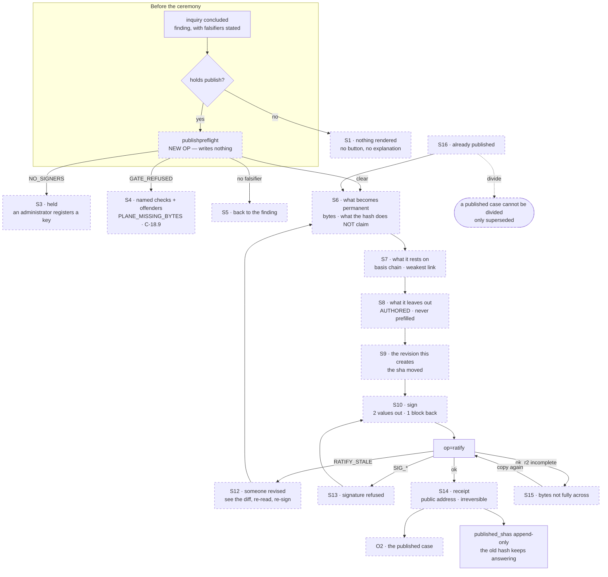
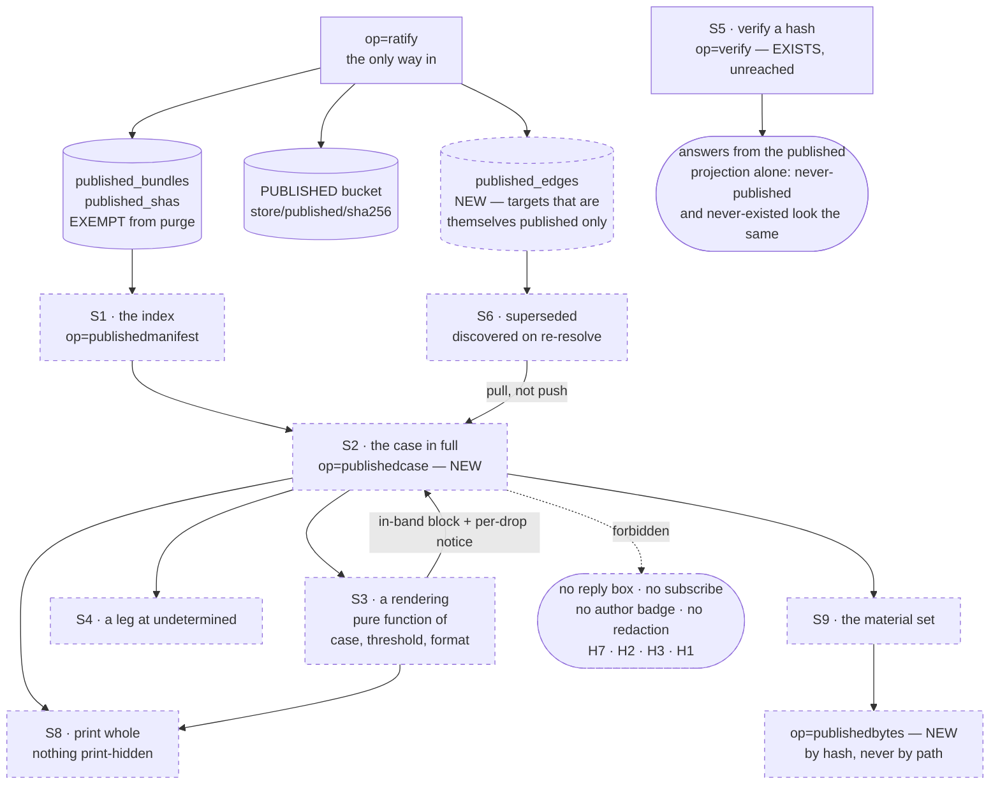
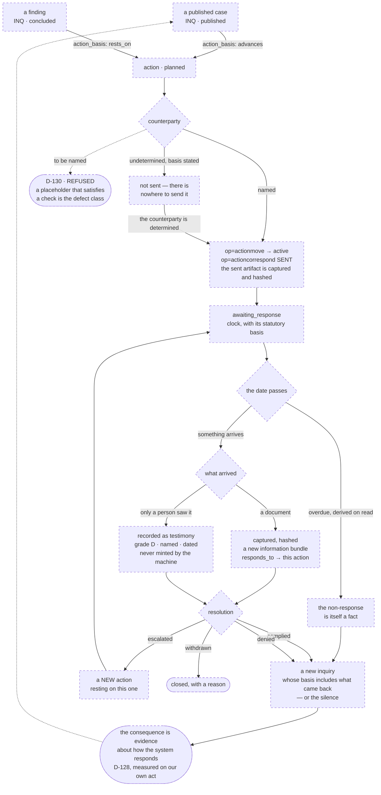

> **SUPERSEDED — see `RECONCILED.md`, which is THE DESIGN where this file disagrees with it (2026-08-03, CONDUCT). Note §5.1's `SUSPEND` means the OPPOSITE of the ruled behaviour — `UNRATED` is canonical (D-160).**

# SB-OUTPUT — storyboards for the three OUTPUT surfaces

Written 2026-08-01 (research pass, Round B). **None of these three surfaces
exists.** This file designs them; it changes no code and proposes no build order.

The three are the sharp end of the path Bob named — *questioning, exploring,
discovering, documenting, impacting* — because they are where the record stops
being ours and becomes answerable:

| | surface | the act it carries | ladder rung |
| --- | --- | --- | --- |
| **O1** | **PUBLICATION CEREMONY** | ratification — irreversible, signed, public | **attested** |
| **O2** | **PUBLISHED CASE** | none. A reader with no credential reads and checks | — |
| **O3** | **ACTION PAGE** | the outward ask, and what came back | reasoned → attested |

Every claim about the code names its file and, where it matters, its line.
Anything not established in this pass is written **I don't know** rather than
guessed. Where a storyboard shows text a member would have typed, it is marked
**[AUTHORED]** and the field ships **EMPTY** — the surface never drafts,
templates, suggests or completes a member's words
(`BIO_Interaction_Constructs_v0_1.md:262-266`).

**Read against:** `UI-BASELINE.md`, `DATA-MODEL.md`, `PROCESS-CATALOGUE.md`,
`CAPABILITIES.md`, `AUDIENCES.md`, `architecture/BIO_Case_Making_v0_1.md`,
`architecture/BIO_Interaction_Constructs_v0_1.md`, `UI-PLAN.md` U10/U12,
`civicos-ui/tokens.css`.

---

## 0. The ground these three stand on

### 0.1 Two grounds, and the design language already encodes the difference

`tokens.css:42-43` declares two page grounds and says which is which in the
token names themselves:

```
--paper: #EDEFE8;   /* WORKING ground; rag paper, warm */
--sheet: #FBFBF8;   /* PUBLISHED ground; the clean sheet */
```

and makes the split structural rather than decorative (`tokens.css:132-151`):
`[data-space="working"]` gets `--paper` and `--t-ui` (15px sans); the fence band
is standing and always rendered. `[data-space="published"]` gets `--sheet` and
`--t-pub-body` (18px, `--lh-read` 1.62) and **never references the fence**.

That gives the three surfaces their register without inventing anything:

- **O1 the ceremony is on `--paper`.** It is a working act. It must not look
  like the thing it produces, or a member will read the preview as the
  publication. The one exception is deliberate: the ceremony's step 1 renders
  the case body on `--sheet` inside a bordered frame, labelled *this is how it
  will read once it is public* — a quotation of the other ground, not a move to
  it.
- **O2 the published case is on `--sheet`** and carries no rail, no fence band,
  no act bar, and no working chrome of any kind.
- **O3 the action page is on `--paper`**, except for correspondence artifacts
  that have been published, which render as quoted `--sheet` cards.

`--signal` (`tokens.css:49`) is reserved for *attention ONLY: clock, changed
source, refusal*. All three surfaces obey that: an overdue statutory clock (O3)
and a refusal (O1) are the only places it appears. **Strength is never coloured
red or green.** A weak claim is not an error and colouring it as one is the
compellingness axis arriving through the back door.

### 0.2 What the three surfaces must NOT do, gathered in one place

These are the constraints every state below is checked against.

1. **Never draft, template, suggest or complete a member's words.** A surface
   MAY assemble the member's OWN prior authored text for them to work from —
   the boundary drawn at `BIO_Interaction_Constructs_v0_1.md:250-260` — and that
   assembly must be visually outside the field, never inside it.
2. **Make a SUPPORTED case easy to state and an UNSUPPORTED one hard**
   (`BIO_Case_Making_v0_1.md:159-164`). Never optimise for compellingness.
3. **`undetermined` is first-class and must be STATED**, rendered identically
   everywhere (`BIO_Interaction_Constructs_v0_1.md:306-316`). Never dressed as
   an error, never invented past, never averaged into a score.
4. **No per-audience relaxation of the ratification gate.** From `AUDIENCES.md`
   §5: *"there must be no administrator build with a relaxed gate, a 'government
   mode', or a different `C-` catalogue… If administrators need a lower
   threshold, that is a threshold on a RENDERING, and it must never be a
   threshold on RATIFICATION."*
5. **A rendering's threshold and exclusions travel IN-BAND** (`AUDIENCES.md` H4)
   — inside the artifact, in every rendering without exception, because files get
   forwarded.
6. **A rendering may drop CLAIMS and may never drop QUALIFIERS** (H5).
7. **A control that lets a member pass a gate by inventing a value is the
   defect class** — D-130, and D-97 before it.

### 0.3 The object these surfaces operate on does not exist yet

Stated plainly so nothing below reads as buildable today.
`bio-checks.mjs:24` declares `OBJECT_TYPES = { INFO: 'information', PROB:
'focus', FOCUS: 'focus', PROJ: 'project', ACTN: 'action' }`. There is no
`inquiry` type, no `concluded` phase, no `published` phase, no basis recursion
and no completeness field (`PROCESS-CATALOGUE.md` §4). `BUNDLE_ID_RE`
(`bio-checks.mjs:13`) is
`/^(INFO|PROB|FOCUS|PROJ|ACTN)-\d{4}-\d{4}-[a-z0-9]+(-[a-z0-9]+)*$/`, so an
`INQ-` id is refused by the catalogue today — the ids in the wireframes below
presume that regex gains `INQ`.

Bob has RULED the collapse and the naming: **the type is `inquiry`; the states
are `open → concluded → published`; `inquiry` / `finding` / `case` are the
member-facing names for those phases** (`BIO_Case_Making_v0_1.md:407-420`).
O1 and O2 are designed against that ruling. O3's object — `action` — DOES exist
and is validated by C-2.10 (`bio-checks.mjs:1285-1296`); what it lacks is every
op that would operate it.

---

## 1. THE RATIFICATION SPLIT, and how it resolves

Asked directly by the brief. Here is what is true today and what I determine.

### 1.1 What is true today, measured

- **Ratification exists in exactly one member-reachable place:** the ratify
  panel in `bio-plane/src/setup.mjs:617-667`, on the PLANE's own origin, gated
  by `can("publish")` (`setup.mjs:624`) which returns `box.innerHTML = ""` when
  absent — the correct absent-not-greyed shape.
- **Surface A has no ratification at all.** `CAPABILITIES.md` measures 0
  occurrences of `"ratify"` in `civicos-ui/app.html`. The capability `publish`
  gates exactly one op, `ratify` (`index.mjs:765`), and the member client never
  consults it.
- **The key act is on a third origin.** `/sign` (`bio-plane/src/signpage.mjs`)
  generates keys in the tab and states *"Runs entirely in this tab. Nothing is
  sent anywhere."* It is reached only from Surface B (`setup.mjs:306`, `:631`)
  and has no link back.
- **The signature is over a fixed statement.** `bio-ratify <bundleId>
  <expectedSha>\n`, produced identically by `signpage.mjs` and by
  `tools/sign-release.html:400`, verified at `index.mjs:2635` against the
  registered active signers.
- **`ratify` ratifies BUNDLES, not cases.** `PROCESS-CATALOGUE.md` P-62 calls
  this *"the boundary act… at the wrong granularity."*

**One correction to the record, since a later session will read it.**
`PROCESS-CATALOGUE.md` §7b item 3 says of `tools/sign-release.html:402` —
*"There is no ratify box."* **There is.** `setup.mjs:637` renders
`<textarea id="r-sig">` with the placeholder `-----BEGIN SSH SIGNATURE-----`,
and `setup.mjs:638` posts it to `op=ratify`. The tool's instruction resolves on
the plane's own page. What is true is the narrower claim: there is no ratify box
in the MEMBER client.

### 1.2 The split, named

There are two splits, not one, and conflating them is how a session builds the
wrong thing:

- **Split A — the ceremony is on the operator's surface, not the member's.**
  Publishing is reachable only by a member who knows to visit a second origin
  that is styled differently, speaks a different vocabulary (`UI-BASELINE.md`
  §6.3 item 5: B says "bundle" throughout, A never does), and consumes none of
  the design tokens.
- **Split B — the key act is deliberately on a third page that sends nothing.**

### 1.3 How it resolves

**The ceremony MOVES. The key act does NOT.**

1. **The ceremony moves to Surface A**, because the ceremony's whole content is
   context Surface B structurally cannot show. B's bundle screen renders facts,
   a markdown body, file download links and a history list (`setup.mjs:554-606`).
   A ceremony must show the BASIS CHAIN, the derived STRENGTH, the FALSIFIERS,
   the MATERIAL SET, and the member's own prior deferral and dismissal reasons
   assembled for them to work from. Every one of those is a graph read that
   Surface A already performs for the document page (`reverseRefs`,
   `op=connections`, `op=links`, `op=projection`) and Surface B performs none of.
   Moving the ceremony to where the context already lives costs a screen; moving
   the context to B costs the whole reading layer twice.

2. **The key act stays out-of-band.** `/sign` remains a separate page on the
   plane origin that generates and holds the key in the tab and sends nothing.
   Surface A hands it exactly two values — the bundle id and the sha it is
   ratifying — and takes back the armored block, which is precisely the protocol
   `setup.mjs:631-637` already uses. **The ceremony must not offer to hold, cache
   or transport the key**, and must not open `/sign` in a frame. A new tab,
   `rel="noopener"`, as B does.

3. **The granularity mismatch resolves without changing the op — by putting the
   completeness statement in the BYTES.** `ratify` takes `{bundleId,
   expectedSha, sig}` and copies every non-`_history/` file into the published
   bucket content-addressed (`index.mjs:2665-2705`). A case IS an inquiry
   bundle. If the exclusion statement is written into `bundle.md` under a
   required heading BEFORE the sha is computed, then ratifying the bundle
   ratifies the case *including what its author said they left out*, and the
   published hash covers it. If instead the exclusion lived in a side table it
   would not be covered by `bundle_sha`, and a reader verifying the hash would
   not receive the one field the whole gate exists to produce. **This is the
   load-bearing decision in O1** and it has a consequence that makes the
   ceremony a ceremony: authoring the exclusion CHANGES THE SHA, so the signature
   can only be taken afterwards. You cannot sign first and write the caveat
   later.

4. **Surface B's panel is DEMOTED, not deleted, and must say so.** It keeps
   working — an instance whose CivicOS worker is down must still be able to
   publish — and gains one line naming the member surface as where this is
   normally done. Two conditions on the demotion:
   - **B must stop being the only route to `s-edit`.** Today "Revise instead"
     is reachable only from the ratify panel (`setup.mjs:637`), which renders
     only for a `publish` holder (`:624`), so a member with `contribute` and not
     `publish` has no route to revise anything on either surface
     (`UI-BASELINE.md` §5.3 item 16). Demoting the panel without moving the
     revise entry point to `s-bundle` would delete revision for everyone.
   - **B's panel must run the same pre-flight** or the two surfaces will refuse
     differently for the same bundle.

5. **Until O1 ships, Surface A must not be silent.** Absent-not-greyed governs a
   capability a member LACKS. A member who HOLDS `publish` and cannot find it is
   a different failure. On a concluded inquiry, a `publish` holder should see one
   honest sentence naming where the act currently lives — not a disabled button,
   and not nothing.

**What this does NOT resolve, stated:** whether the ceremony should also be
reachable from Surface B's roster of published bundles for an administrator
recovering a broken instance. I don't know; it is an operator question, not a
member one.

---

## 2. O1 · PUBLICATION CEREMONY

### 2.1 STORYBOARD — sixteen states

All wireframes are Surface A, `data-space="working"`, `--paper` ground, entered
from a concluded inquiry's page. Serif for judgment, sans for plain speech, mono
for machine fact (`tokens.css:60-64`).

---

**S1 · ABSENT — the member does not hold `publish`**

There is no panel, no button, no greyed control and no explanation. The
inquiry's page ends at its act bar with the acts this member can take. §5 of
Membership v2: *"A capability a member does not hold is absent from their
interface, not present and refused."* Reference implementation:
`setup.mjs:624`.

```
┌─ INQ-2026-0007-sewer-fund-transfers ─────────────────────────────┐
│  Sewer fund transfers to the General Purpose Fund                │
│  ⬤ concluded · finding                                           │
│                                                                  │
│  … the finding, its basis, its falsifiers …                      │
│                                                                  │
│  ── Acts ────────────────────────────────────────────────────    │
│  [ Divide this into two or more… ]  [ Reopen with a reason… ]    │
└──────────────────────────────────────────────────────────────────┘
        ↑ nothing about publishing appears here at all
```

---

**S2 · NOTHING TO PUBLISH — the inquiry has not concluded**

The member holds `publish`, and the object is not ready. This is not a refusal;
it is a fact about the object, so it is stated where the state is, not in a
dialog.

```
┌─ INQ-2026-0011-parcel-tax-carryover ─────────────────────────────┐
│  ⬤ open · inquiry                                                │
│                                                                  │
│  ── Publishing ──────────────────────────────────────────────    │
│  An inquiry is published once it has concluded — once it states  │
│  what it found, what that rests on, and what would show it       │
│  wrong. This one is still open.                                  │
│                                                                  │
│  [ Conclude this inquiry… ]                                      │
└──────────────────────────────────────────────────────────────────┘
```

---

**S3 · HELD — no registered signing key on this instance (`NO_SIGNERS`)**

The member holds the capability and the instance holds no key. `index.mjs:2632`
refuses with `NO_SIGNERS`. **This is discovered at PRE-FLIGHT, not after the
member has authored an exclusion statement and gone to sign.** Today it is
discovered last (`setup.mjs` posts and translates the refusal at `:655-667`),
which is the wrong order for the ACT construct's own rule: *show what the action
will REFUSE and why before it runs.*

```
┌─ Publishing is not available on this copy ───────────────────────┐
│                                                                  │
│  Publishing needs a signature made with a key this group has      │
│  registered. No keys are registered here yet, so nothing can be   │
│  published.                                                       │
│                                                                  │
│  An administrator registers keys under Members and keys.          │
│                                                                  │
│  [ Close ]                                                        │
└──────────────────────────────────────────────────────────────────┘
```

---

**S4 · PRE-FLIGHT REFUSES — the gate would refuse these bytes**

`runGate` runs at ratification and refuses with `GATE_REFUSED` carrying the
findings (`index.mjs:2661`). Two of its refusals are the reason the pre-flight
must exist at all: `PLANE_MISSING_BYTES` and `PLANE_SIZE` (D-45 — an unbacked
register entry is refused at RATIFY, not at promote, so publication is the first
moment a member learns of it), and C-18.9's unattributed-hop rule (D-114).

The pre-flight paints every gate as ✓/✗ with its need sentence, in the plane's
own checking order, the same shape `disposePreflight` and `attestPreflight`
already use (`app.html:4232-4257`, `:6265-6287`). Refusals are rendered
**verbatim with their offenders named**.

```
┌─ Before this can be published ───────────────────────────────────┐
│  INQ-2026-0007-sewer-fund-transfers                              │
│                                                                  │
│  ✓  You may publish                                              │
│  ✓  A signing key is registered on this copy                     │
│  ✓  This finding states what would show it wrong                 │
│  ✓  This finding states what it rests on                         │
│  ✗  The record holds the bytes it claims to hold                 │
│       PLANE_MISSING_BYTES                                        │
│       data/acfr-fy2024-p112.pdf — the provenance register names   │
│       these bytes and this copy does not hold them.               │
│  ✗  Every step in the provenance chain names who took it          │
│       C-18.9 (data/provenance.json, entry 2)                     │
│                                                                  │
│  Publishing is blocked until those are fixed. Nothing has been    │
│  written and nothing has been signed.                             │
│                                                                  │
│  [ Close ]   [ Open the register ]                                │
└──────────────────────────────────────────────────────────────────┘
```

---

**S5 · PRE-FLIGHT REFUSES — no falsifier stated**

Deliberate design decision, and the reason it is here rather than in the
ceremony: **the ceremony must never be a place where a falsifier gets invented
under the pressure of a half-finished act.** A finding states what would show it
wrong when it CONCLUDES (`## What Would Falsify This`, a stage requirement on
`concluded`). The ceremony reads it, shows it, and refuses without it — and its
only exit is back to the finding.

```
┌─ Before this can be published ───────────────────────────────────┐
│  ✗  This finding states what would show it wrong                 │
│       This finding's "What would show this wrong" section is      │
│       empty. A case that cannot be checked cannot be published.   │
│       State it on the finding, where it belongs, and come back.   │
│                                                                  │
│  [ Close ]   [ Open the finding ]                                 │
└──────────────────────────────────────────────────────────────────┘
```

---

**S6 · STEP 1 of 5 — WHAT BECOMES PERMANENT**

The ceremony opens on consequence, not on a form. Two blocks: what the act does,
and — verbatim from the ATTESTATION construct's accountability rule
(`BIO_Interaction_Constructs_v0_1.md:285-288`) — **what a published hash does
and does NOT claim.**

```
┌─ Publishing a case · 1 of 5 ─────────────────────────  ATTESTED ─┐
│                                                                  │
│  WHAT BECOMES PERMANENT                                          │
│                                                                  │
│  Publishing copies this exact revision across the fence, where    │
│  anyone can check it against its hash without our cooperation.    │
│  It cannot be undone. A published hash answers forever, even      │
│  after later revisions, and even if this group stops existing.    │
│                                                                  │
│  These are the bytes that will answer:                            │
│  ┌────────────────────────────────────────────────────────────┐  │
│  │ bundle.md                                    14,208 bytes  │  │
│  │ data/provenance.json                          3,041 bytes  │  │
│  │ data/acfr-fy2024-p112.pdf                 1,884,332 bytes  │  │
│  │ data/ord-13842.html                          92,517 bytes  │  │
│  │ data/ord-13842.snapshot.json                 11,006 bytes  │  │
│  │                              5 files · 2,005,104 bytes     │  │
│  └────────────────────────────────────────────────────────────┘  │
│                                                                  │
│  WHAT THE PUBLISHED HASH CLAIMS — AND WHAT IT DOES NOT           │
│                                                                  │
│  Claims: that these exact bytes were held by this group, that     │
│  they were retrieved from the address recorded beside each one,   │
│  on the date recorded, by the route recorded.                     │
│                                                                  │
│  Does NOT claim: that any document here is an authentic           │
│  municipal record; that a public body agrees with any of it;      │
│  that the conclusion is correct. Those are not things a hash      │
│  can say, and nothing here says them for you.                     │
│                                                                  │
│  ┌── how it will read once it is public ────────────────────┐    │
│  │ ░ (rendered on the published ground, --sheet, at         │    │
│  │ ░  --t-pub-body, inside this frame and nowhere else)     │    │
│  └──────────────────────────────────────────────────────────┘    │
│                                                                  │
│                              [ Cancel ]   [ Continue → ]         │
└──────────────────────────────────────────────────────────────────┘
```

The `ATTESTED` mark in the header is the weight ladder's top rung
(`app.html:4261-4275` renders the ladder today for dispose at `reasoned`). The
member has met this ladder before at `reversible` and `reasoned`; this is the
first time they reach the top rung, and it should look like it — but it is the
same ladder, not a new vocabulary.

---

**S7 · STEP 2 of 5 — WHAT THIS RESTS ON**

Read-only. Not editable here — changing a basis at publication time would be
revising the argument inside the act that publishes it. Its job is to make the
member SEE the weakest leg, because that is what the case is worth
(`BIO_Case_Making_v0_1.md:453-460`).

```
┌─ Publishing a case · 2 of 5 ─────────────────────────  ATTESTED ─┐
│                                                                  │
│  WHAT THIS CASE RESTS ON                                         │
│                                                                  │
│  This case will be published at strength  ▪ C ▪                  │
│  A case is worth its weakest leg. This one's weakest leg is       │
│  the third below.                                                 │
│                                                                  │
│  ├── A · INFO-2026-0031-acfr-fy2024                              │
│  │     Annual Comprehensive Financial Report FY2024, p.112       │
│  │     verified · captured from the city's own address           │
│  │     grade A — the document says it itself                     │
│  │                                                               │
│  ├── B · INFO-2026-0044-council-ord-13842                        │
│  │     Ordinance 13842                                           │
│  │     verified · grade B — one document names the other         │
│  │                                                               │
│  ├── C · INQ-2026-0012-transfer-authority                        │
│  │     "Which body may authorise an inter-fund transfer"         │
│  │     published case · strength C                               │
│  │     ▸ this leg rests on three further legs — expand           │
│  │                                                               │
│  └── D · INFO-2026-0058-controller-memo                          │
│        Controller's memo, 12 March 2026                          │
│        collected · strength undetermined                         │
│        ⓘ undetermined — this has not been through review, so     │
│          the record does not yet say how it was established.     │
│                                                                  │
│  A case built on a case cannot be stronger than the case          │
│  beneath it. C is a published case at strength C, so this one     │
│  cannot exceed C.                                                 │
│                                                                  │
│                        [ ← Back ]   [ Continue → ]               │
└──────────────────────────────────────────────────────────────────┘
```

Note leg D: an `undetermined` leg is rendered with the UNDETERMINED primitive,
identically to authority-undetermined and link-verdict-undetermined
(`app.html:3310-3322` already renders that voice). It is **not** rendered as a
failure and it is **not** silently treated as the weakest link — I do not know
whether `undetermined` should floor the composition or suspend it, and that is a
real open question below.

---

**S8 · STEP 3 of 5 — WHAT YOU ARE LEAVING OUT** *(the gate)*

The single surviving reason the case object exists
(`BIO_Case_Making_v0_1.md:266-303`). The gate is not *are these findings true*
— each finding's own gate is already inherited. It is **has the author stated
what was excluded, and why.**

The field is EMPTY at ship. The assembly panel on the right holds the member's
OWN prior authored reasons — deferrals, dismissals, severances, apportionments —
verbatim, dated, each with a jump to where they said it. This is the one
auto-composition the prefill rule permits
(`BIO_Interaction_Constructs_v0_1.md:250-260`): *assembling what a member already
wrote is not a fabricated attribution; drafting a justification for them is.*
The panel is **outside** the textarea, has no "insert" button, and says so.

```
┌─ Publishing a case · 3 of 5 ─────────────────────────  ATTESTED ─┐
│                                                                  │
│  WHAT THIS CASE LEAVES OUT                                       │
│                                                                  │
│  Publishing asserts something no gate can check: that this is     │
│  the material set. No system can know what a group did not look   │
│  at. So the record does what it does with everything it cannot    │
│  establish — it makes the claim visible, attributable, and        │
│  stated, in your words, with your name on it.                     │
│                                                                  │
│  This goes into the published bytes. It is part of what the       │
│  hash answers for, and a reader sees it beside the conclusion.    │
│                                                                  │
│  ┌── Say what you left out, and why ────┐ ┌── YOUR OWN WORDS ──┐ │
│  │                                      │ │ For reference. None │ │
│  │  [EMPTY AT SHIP — never prefilled,   │ │ of this is copied   │ │
│  │   never templated, never suggested]  │ │ into the box; if    │ │
│  │                                      │ │ you want any of it  │ │
│  │                                      │ │ there, write it.    │ │
│  │                                      │ │                     │ │
│  │                                      │ │ 14 Jun · deferred   │ │
│  │                                      │ │ FOCUS-2026-0019     │ │
│  │                                      │ │ "The 2019 transfer  │ │
│  │                                      │ │  predates the       │ │
│  │                                      │ │  ordinance and I    │ │
│  │                                      │ │  could not find     │ │
│  │                                      │ │  the authorising    │ │
│  │                                      │ │  resolution."  ↗    │ │
│  │                                      │ │                     │ │
│  │                                      │ │ 2 Jul · dismissed   │ │
│  │                                      │ │ FOCUS-2026-0023 ↗   │ │
│  │                                      │ │ 9 Jul · severed     │ │
│  │                                      │ │ INFO-2026-0040 ↗    │ │
│  │  0 / 2000                            │ │                     │ │
│  └──────────────────────────────────────┘ └─────────────────────┘ │
│                                                                  │
│  ⓘ Nothing here checks whether what you say is complete. It       │
│    records who said it and when.                                  │
│                                                                  │
│                        [ ← Back ]   [ Continue → ]  (disabled)   │
└──────────────────────────────────────────────────────────────────┘
```

Grammar validation matches the release dialog's, which refuses quote, backslash
and newline in the counter itself (`app.html:4136-4147`) — the field bounds are
enforced at WRITE time, not at render time, because this text will be read in
clients we do not control (D-98's F5 reasoning).

---

**S9 · STEP 4 of 5 — THE REVISION THIS CREATES**

The consequence of putting the exclusion in the bytes, made explicit rather than
hidden. The member is shown that their words changed the hash, and that the hash
they are about to sign is the new one.

```
┌─ Publishing a case · 4 of 5 ─────────────────────────  ATTESTED ─┐
│                                                                  │
│  WHAT YOU JUST WROTE IS NOW PART OF THE CASE                     │
│                                                                  │
│  Your statement has been saved into this case as a revision, so   │
│  that it travels with the published bytes and a reader sees it    │
│  without asking us for it.                                        │
│                                                                  │
│  before      sha256:4c1f0aa9e2b7d5…                              │
│  now         sha256:9d0e77b31af4c2…   ← this is what you sign    │
│                                                                  │
│  Nothing is published yet. If you stop here, the statement stays  │
│  in the working record as a revision and the case is not public.  │
│                                                                  │
│                        [ ← Back ]   [ Continue → ]               │
└──────────────────────────────────────────────────────────────────┘
```

---

**S10 · STEP 5 of 5 — SIGN**

The handoff. Two values out, one block back. The surface never touches the key.

```
┌─ Publishing a case · 5 of 5 ─────────────────────────  ATTESTED ─┐
│                                                                  │
│  SIGN IT                                                         │
│                                                                  │
│  Publishing needs your key, and your key never comes here. Open   │
│  the signing page, unlock your key there, and paste back what it  │
│  hands you.                                                       │
│                                                                  │
│  Case    INQ-2026-0007-sewer-fund-transfers          [copy]      │
│  Hash    sha256:9d0e77b31af4c2…                      [copy]      │
│                                                                  │
│  [ Open the signing page ↗ ]  (new tab · nothing is sent there)  │
│                                                                  │
│  ┌──────────────────────────────────────────────────────────┐    │
│  │ -----BEGIN SSH SIGNATURE-----                            │    │
│  │                                                          │    │
│  └──────────────────────────────────────────────────────────┘    │
│                                                                  │
│  Once you press Publish this cannot be undone.                    │
│                                                                  │
│               [ ← Back ]   [ Publish this case ]  (disabled)     │
└──────────────────────────────────────────────────────────────────┘
```

---

**S11 · COMMITTING**

Single disabled button, one progress line at a time, no spinner theatre. The
lines name real steps because each can fail differently: checking → verifying
the signature → copying the bytes across the fence.

---

**S12 · REFUSED · `RATIFY_STALE`**

Somebody saved a newer revision while the member was signing. `index.mjs:2627`.
The sha they signed is no longer the live one. The refusal must NOT discard
their signature silently, and must not offer to re-sign the new bytes for them.

```
┌─ Not published ───────────────────────────────────── --signal ──┐
│  Someone saved a newer revision of this case while you were       │
│  signing, so the hash you signed is no longer the current one.     │
│                                                                    │
│  you signed   sha256:9d0e77b31af4c2…                              │
│  now current  sha256:e07b12ff9a3c40…                              │
│                                                                    │
│  Nothing was written and nothing was published. Read the case      │
│  again — what changed may change what you want to say about        │
│  what it leaves out — and sign the new hash.                       │
│                                                                    │
│  [ See what changed ]   [ Read it again ]                          │
└────────────────────────────────────────────────────────────────────┘
```

"See what changed" reuses the in-place LCS line diff the document page already
has (`app.html:1651-1679`).

---

**S13 · REFUSED · the signature**

`SIG_UNKNOWN_KEY`, `SIG_BAD_SIGNATURE`, `SIG_NAMESPACE`, `MALFORMED`. Each is
translated once, in the member surface, in the plane's checking order — the
eight translations `ratifyWhy` (`setup.mjs:655-667`) already carries, moved and
not re-derived. The plane's own `reason` is shown verbatim beneath the
translation, as `releaseRefusal` and `attestRefusalHtml` do.

```
┌─ Not published ───────────────────────────────────── --signal ──┐
│  That signature was made for something other than publishing.     │
│  Use the "Sign a ratification" tab on the signing page.            │
│                                                                    │
│  SIG_NAMESPACE                                                     │
│                                                                    │
│  Nothing was written and nothing was published.                    │
│  [ Try again ]                                                     │
└────────────────────────────────────────────────────────────────────┘
```

---

**S14 · RECEIPT — published**

The receipt states what is now true, gives the public address a stranger can
use, and restates the limit at the far end — the same both-ends honesty the
attest dialog uses (`app.html:6256-6259` before, `:6388-6408` after).

```
┌─ Published ────────────────────────────────────────  --tint-ok ─┐
│                                                                  │
│  This case is public, attested by Ruth Ferreira's key.            │
│  5 hashes are now verifiable by anyone.                           │
│                                                                  │
│  case     INQ-2026-0007-sewer-fund-transfers                     │
│  hash     sha256:9d0e77b31af4c2…                     [copy]      │
│  public   /published/INQ-2026-0007-sewer-fund-transfers [copy]   │
│  at       2026-08-01 17:42 UTC · catalogue 1.17.0                │
│                                                                  │
│  Anyone can check those bytes against that hash without our       │
│  cooperation, and will still be able to if this group stops       │
│  existing. This cannot be withdrawn. If it turns out to be        │
│  wrong, it is superseded by a new inquiry that says so — and      │
│  the old hash keeps answering.                                    │
│                                                                  │
│  [ Read it as the public reads it ↗ ]   [ Back to the record ]   │
└──────────────────────────────────────────────────────────────────┘
```

---

**S15 · RECEIPT — published, with the byte copy incomplete**

`index.mjs` tracks `r2state` and can report `"INCOMPLETE: capture vanished
between gate and copy"` (`index.mjs:2697`). The rows are committed; some bytes
are not across. **This must be stated, not swallowed** — a reader following a
hash to a missing object gets a worse experience than one told in advance.

```
┌─ Published, and one file has not crossed yet ────── --signal ───┐
│  The case is published and its hashes answer. One file's bytes    │
│  did not copy across:                                              │
│      data/acfr-fy2024-p112.pdf                                     │
│  Its hash is published and a reader asking for the bytes will be   │
│  told they are not there yet, rather than given something else.    │
│  Publishing again copies what is missing; it does not republish    │
│  or change anything already answered.                              │
│  [ Copy the remaining bytes ]                                      │
└────────────────────────────────────────────────────────────────────┘
```

---

**S16 · ALREADY PUBLISHED — a later revision, and division refused**

`published_shas` is append-only across re-ratifications (`schema.mjs:173-175`:
*"a hash once published stays verifiable forever"*), and `publish` upserts
`published_bundles` (`store.mjs:5934-5942`). So re-ratifying a revised case does
NOT retract the earlier one. The surface must say so, or a member will believe
republishing corrects the record.

```
┌─ This case is already published ─────────────────────────────────┐
│  published   2026-08-01 · sha256:9d0e77b31af4c2…                 │
│  since then  3 revisions in the working record                    │
│                                                                  │
│  Publishing again publishes the new revision. It does NOT         │
│  withdraw the one already published: that hash keeps answering,    │
│  because somebody may have relied on it.                           │
│                                                                  │
│  A published case cannot be divided. If it was the wrong          │
│  question, or the answer was wrong, that is a new inquiry that     │
│  supersedes this one and says why — and everything that cited      │
│  this case is flagged for a second look.                           │
│                                                                  │
│  [ Publish the new revision… ]  [ Open a superseding inquiry… ]   │
└──────────────────────────────────────────────────────────────────┘
```

The division refusal is `BIO_Case_Making_v0_1.md:448-451` verbatim in substance:
*"A published hash answers forever and somebody may already have acted on it;
retraction and revision are different acts, and dividing a case after the world
has relied on it would be revision pretending to be housekeeping."*

### 2.2 JUSTIFICATION

**Why a five-step ceremony rather than a dialog.** The ACT construct collapses
most acts into one motion — choose, pre-flight, author, receipt — and the
Constructs document names the one place collapsing costs something: *"People
arrive with a model for SIGNING that is not 'filling in a form': deliberate,
ceremonial, hard to do by accident. If ratification becomes a variation of the
act surface, the ceremony is lost — and the ceremony IS the safeguard"*
(`:47-53`). The five steps are not five screens for their own sake; each one is
a distinct thing the member must have MET before the irreversible act:
consequence (S6), what the claim is worth (S7), what it leaves out (S8), the
fact that their own words moved the hash (S9), and the key (S10). Remove any one
and something the member is accountable for has gone past them unread.

**Why the exclusion statement is authored at publication and the falsifier is
not.** Both are required. The difference is where inventing one is likely.
Completeness is a claim ONLY the publication act makes — a finding must not
assert it, or findings stop being reusable across cases
(`BIO_Case_Making_v0_1.md:282-288`) — so it has nowhere else to live. A
falsifier is a property of the claim itself and belongs to concluding. Asking
for it in the ceremony would place a hard intellectual question inside a
half-finished irreversible act, which is exactly the pressure that produces
`counterparty: to be named`.

**Why the pre-flight is separate from the ceremony.** Today the gate runs inside
`ratify`, so a member learns `GATE_REFUSED` *after* signing. That wastes a
signature, and worse, it puts the refusal after the point where the member has
already committed emotionally. `S · SELECTION-SCOPED`'s rule generalises:
*"the surface should show what the action will REFUSE and why before it runs,
not after."* The pre-flight is a read; it writes nothing; it can be re-run.

**Why the case body is quoted on `--sheet` inside the ceremony rather than
previewed as a page.** A full-page preview on the published ground is
indistinguishable from the published page. That is the one confusion that would
be catastrophic here: a member believing they have already published. The frame
keeps it a quotation.

**Why the exclusion goes in the bytes.** Argued in §1.3 item 3. The alternative
— a `published_exclusions` table — is cheaper to build and is wrong: the
statement would not be covered by `bundle_sha`, so §8.2's guarantee (published
material is reconstructible *"without the cooperation, permission, or continued
existence of the instance it came from"*) would hold for the conclusion and not
for its caveat. A rebuilt corpus would carry the claim and drop the qualifier,
which is H5's forbidden compression performed by the architecture.

**Why re-ratification is shown as accumulation, not correction.** Because that
is what `published_shas` does. A surface that let a member believe republishing
retracts would be the interface being looser than the check — the failure D-114
refused.

**What I did NOT do, and why.** No "publish to audience X" control anywhere in
the ceremony. `AUDIENCES.md` §5 forbids a threshold on ratification; putting an
audience selector in the ceremony would make the gate per-audience by
implication even if the code ignored it.

### 2.3 DATA MODEL

**Exists today.**

| table | columns (verbatim, `schema.mjs:177-194`) |
| --- | --- |
| `published_bundles` | `bundle_id` PK · `bundle_sha` · `ratified_at` · `attestor_key` · `attestor_member` · `gate_version` · `sig_armored` |
| `published_shas` | `(sha256, bundle_id, path)` PK · `kind` · `bytes` · `published`; index on `sha256` |
| `signers` | `key_b64` PK · `member_id` · `comment` · `status` · `added` |

Ops: `ratify` (`index.mjs:401`, `NEEDS.ratify = "publish"` at `:765`),
`publishedmanifest` (`:287`, `classes: null`), `verify` (`:544`, `classes:
null`), `signeradd`/`signerset`/`signerlist` (`:524-526`).

**What must change or be added.** Where `DATA-MODEL.md` Part 2 already proposes
a shape, this uses ITS name and ITS columns rather than inventing a second one.

| # | change | why |
| --- | --- | --- |
| P1 | `BUNDLE_ID_RE` gains `INQ` (`bio-checks.mjs:13`) | an inquiry cannot have an id today |
| P2 | `OBJECT_TYPES` gains `INQ: 'inquiry'`; states `open → concluded → published`; four copies of the type mapping must move together (`bio-checks.mjs:25-26`, `store.mjs:194`, `store.mjs:2807`, `query.mjs:411`) and two more in the surfaces | the object does not exist. `problem → focus` cost one commit, 18 files, and the UI drifted because it was not in it |
| P3 | heading set for `inquiry`: `## Conclusion` · `## Basis` · `## What Would Falsify This` · `## What This Excludes` · `## Session Log` · `## Review Notes` | C-3.1 refuses both a missing heading and an unexpected one, so the exclusion must be canonical or it cannot be written at all |
| P4 | **stage entry requirement** — `published` requires `## What This Excludes` non-empty, in the shape C-2.7 already uses to make `content_hash` an entry requirement for `verified` | presence. The completeness gate |
| P5 | **C-21.1 as proposed in `DATA-MODEL.md` §2.4.3** — no field of `completeness` carried forward byte-identical from the previous revision, checked against `history` | the never-prefilled rule made MECHANICAL. The doc's own sentence: *"A gate that only checks presence IS a checkbox"* |
| P6 | stage entry requirement — `concluded` requires `## What Would Falsify This` non-empty | S5 |
| P7 | `inquiry_basis(bundle_id, ord, target_id, target_type, role, grade, grade_source, note, at)` PK `(bundle_id, ord)`, indexed on `target_id` and `bundle_id` — **exactly `DATA-MODEL.md` §2.4** | the basis chain S7 renders. `refs` cannot carry it: its PK has no ordinal and no room for a grade. `role ∈ supports \| cuts_against` is what gives invariant 7 a mechanism |
| P8 | `inquiry_exclusions(bundle_id, ord, target_id, description, reason, author, at)` PK `(bundle_id, ord)` — **exactly `DATA-MODEL.md` §2.4** | the doc's D3 is right and my first pass was wrong: the prose in `bundle.md` makes the assertion **storable**; only the indexed projection makes it **auditable**, and without the index *"which published cases excluded this document"* cannot be asked at all. Both, not either |
| P9 | `bundles.inquiry_strength TEXT` + `inquiry_strength_determined INTEGER`, derived on read via the existing `#weakerGrade` / `#GRADE_RANK` (`store.mjs:3210`, `:3444-3445`), and **frozen into the frontmatter at publication** | `DATA-MODEL.md` is right that no column is added to `published_bundles` for this: a published case's strength must be whatever the group signed, inside the hash, forever. A live re-derivation would let the published page disagree with the bytes it serves |
| P10 | **`published_bundles` gains `title TEXT`** — and this is a DELIBERATE DIVERGENCE from `DATA-MODEL.md` §2.4.4's *"no column is added to either"* | that sentence is an argument about the completeness ASSERTION, and it is correct about assertions. A title is not an assertion; it is a label already inside the hashed bytes, and projecting it is a cache exactly as `bundles.title` is. Without it `publishedList()` (`store.mjs:5964-5966`) returns five columns and no title, which is why `pubOpen` (`app.html:6853`) can only render a bundle id as its `<h1>`. The alternative — one `publishedbundle` call per row to read a title — makes the public index N+1 |
| P11 | **new op `publishpreflight`** — non-mutating, `NEEDS = "publish"` | S3/S4/S5. Runs `runGate` + signer presence + P4/P6 and returns findings, writing nothing. Without it the member signs first and learns second |
| P12 | `ratify`'s response surfaces `r2state` in a member-renderable form | S15. `index.mjs:2691-2705` computes it and no surface shows it |

`ratify` itself needs no change. `{bundleId, expectedSha, sig}` with its own CAS
is exactly right, and it becomes case-granular for free once the completeness
statement is inside `bundle.md`.

**Precedent this ceremony copies rather than invents:** `op=release` already
takes `acknowledgment` and `mitigation` as caller-supplied, never-prefilled
strings at a gate (`store.mjs:7584-7588`). That is the U5 shape raised *"from a
document to an argument"*, and S8 is that shape one level up.

**House rules this must obey:** new tables go BEFORE the `host_governor` block in
`schema.mjs` (the hygiene test asserts the literal ends on `);`); both new tables
must be named in `op=purge`'s `TABLES` at `store.mjs:4516-4518` or D-113/D-137
recur; the author on an authored row is stamped server-side at the trust boundary
in `index.mjs`, never taken from the caller and never stamped in `store.mjs`.

**Ops the ceremony calls, in order:** `publishpreflight` → `lease` → `promote`
(the exclusion revision) → `image` (to recompute the sha) → `ratify`.

**Purge note, load-bearing for O2:** `published_bundles` and `published_shas` are
two of the fourteen EXEMPT tables (`hygiene.test.mjs:216-231`) — *kept verifiable
forever by doctrine*. A whole-store purge does not unpublish anything, which is
the same fact the receipt states to the member.

### 2.4 CAPABILITIES, and what is absent without them

| held | what the member gets |
| --- | --- |
| `publish` **and** a registered active key | the whole ceremony |
| `publish`, **no** registered key on the instance | S3 at pre-flight — the panel exists, the act is held, and the reason names an administrator's action, not the member's |
| `contribute`, not `publish` | **nothing.** No panel, no button, no explanation (S1). The inquiry page ends at the acts they can take |
| read-only credential | as above, plus no acts at all |
| administrator | holds every working capability implicitly (`store.mjs:4786`), so the ceremony renders |

**The key and the capability are two different things**, and `index.mjs:761-764`
records why: before `publish` existed, *"the key was doing the capability's
job."* The ceremony must keep them separate in what it says — S1 is a capability
absence and shows nothing; S3 is an authority absence and explains, because the
member has the right and the instance lacks the means.

**Absent without them, precisely:** without `publish` a member cannot reach
`op=ratify` at all — the plane refuses at gate 4 with `NOT_CAPABLE` carrying
`needs`, `held` and *"ask an administrator to grant it rather than looking for
another route"* (`index.mjs:1115-1117`). The hidden panel is a courtesy; the
refusal is the boundary (`index.mjs:676-680`).

**A hazard this surface creates and must not:** `CAPABILITIES.md` F-9 records
that the plane publishes `capabilities` and `vocabulary` but NOT the `NEEDS`
map, so every interface keeps its own copy and two copies have already diverged.
Building O1 in `app.html` creates a **third**. Either publish `NEEDS` from the
plane, or accept the third copy knowingly and name it in DEBT.

### 2.5 WORKFLOW EDGES



Everything dashed is unbuilt. `COMMIT` is the only solid node: `op=ratify` ships
and `setup.mjs:617-667` reaches it.

---

## 3. O2 · PUBLISHED CASE

The reader here is **not a member and holds no credential**. That is not a
degraded mode; it is the point. §8.2's guarantee is that published material is
content-addressed and reconstructible *"without the cooperation, permission, or
continued existence of the instance it came from."*

`data-space="published"`, `--sheet` ground, `--t-pub-body` 18px, `--lh-read`
1.62, `--measure-pub` 62ch. No rail, no fence band, no masthead search, no act
bar. `tokens.css:145-151` already declares this register and
`[data-space="published"]` *never references the fence*.

### 3.1 What an anonymous reader can actually call today

Measured, because it bounds the whole surface. Eight ops carry `classes: null`
(`index.mjs:196-198`): `bootstrap`, `claim`, `login`, `enroll`, `invitelook`,
`verify`, `knock`, `publishedmanifest`. Of those, exactly **two touch published
material**: `publishedmanifest` (`:287`) and `verify` (`:544`).
`publishedlist` (`:402`) requires a token class.

`publishedList()` (`store.mjs:5964-5966`) selects
`bundle_id, bundle_sha, ratified_at, attestor_member, gate_version` — **no
title and no body.** `verifySha()` (`store.mjs:5957-5961`) answers
`{published, sha256, matches[]}` from `published_shas` alone, with the property
that *"a hash that was never ratified is indistinguishable from a hash that
never existed."*

**So the single largest absence in this whole document: there is no public op
that returns a published case's BYTES or its PROSE.** The published bucket holds
them — `ratify` copies every non-`_history/` file into
`<store>/published/<sha256>` (`index.mjs:2691-2705`) — and nothing serves them
without a credential. That is why `pubOpen` (`app.html:6853`) renders the bundle
id as its `<h1>` and a paragraph saying the body is not rendered. It is not a
UI shortcut; the read does not exist.

### 3.2 STORYBOARD — twelve states

---

**S1 · THE PUBLISHED INDEX**

```
════════════════════════════════════════════════════════════════════
  ▪  Believe In Oakland                    Case files    Verify a hash
════════════════════════════════════════════════════════════════════

  THE PUBLISHED RECORD

  Cases this group stands behind. Every one can be checked against
  its hash without our cooperation, and will still check out if this
  group stops existing.

  ┌──────────────────────────────────────────────────────────────┐
  │  Sewer fund transfers to the General Purpose Fund            │
  │  published 1 August 2026 · strength C                        │
  │  INQ-2026-0007 · sha256:9d0e77b31af4c2…                      │
  ├──────────────────────────────────────────────────────────────┤
  │  Which body may authorise an inter-fund transfer             │
  │  published 14 July 2026 · strength C                         │
  │  INQ-2026-0012 · sha256:1b8ac03e5f7d91…                      │
  ├──────────────────────────────────────────────────────────────┤
  │  Contract 4471 award timeline                                │
  │  published 2 June 2026 · strength undetermined               │
  │  superseded 9 July 2026 — this hash still answers            │
  │  INQ-2026-0004 · sha256:77c1ee49b0a3fd…                      │
  └──────────────────────────────────────────────────────────────┘
════════════════════════════════════════════════════════════════════
```

Today rows show the bundle id where the title is, because the manifest carries
none (P10 in §2.3). Strength and supersession likewise do not exist yet.

---

**S2 · THE CASE, IN FULL — the default, no threshold applied**

The default view applies **no audience threshold at all**. A reader arriving
from a link gets everything the case says, at its own strength, with its
exclusions. A threshold is something a reader opts INTO, never the ground state
— because the ground state is what a forwarded link resolves to.

```
════════════════════════════════════════════════════════════════════
  ▪  Believe In Oakland                    Case files    Verify a hash
════════════════════════════════════════════════════════════════════

  CASE · published 1 August 2026

  Sewer fund transfers to the
  General Purpose Fund

  ┌── what this case is worth ────────────────────────────────────┐
  │  Strength  C                                                  │
  │  A case is worth its weakest leg. This one's weakest leg is   │
  │  a published case that is itself at C.                        │
  │  Strength is how a claim was ESTABLISHED, not how credible    │
  │  anyone finds it.                                             │
  └───────────────────────────────────────────────────────────────┘

  WHAT WE FOUND
  [the conclusion, as its author wrote it]

  WHAT THIS RESTS ON
  ├─ A · ACFR FY2024, p.112 · grade A            [ read it ] [ hash ]
  │     published beside this case
  ├─ B · Ordinance 13842 · grade B               [ read it ] [ hash ]
  │     published beside this case
  ├─ C · "Which body may authorise an inter-fund transfer"
  │     a published case · strength C                    [ open it ]
  └─ D · Controller's memo, 12 March 2026 · strength undetermined
        ⓘ  Not published. This case names it and this group holds
           it; you cannot read it here and cannot check its hash.
           The record does not say how it was established.

  WHAT WOULD SHOW THIS WRONG
  [the falsifier, as its author wrote it]

  WHAT THIS CASE LEAVES OUT
  [the completeness statement, verbatim, with its author and date]
  ⓘ  No system checked whether this is complete. It records who
     said it and when.

  ── THE MATERIAL SET ───────────────────────────────────────────
  5 files · 2,005,104 bytes · every one checkable
  bundle.md                       sha256:3f0a…  [ get ] [ check ]
  data/provenance.json            sha256:8b21…  [ get ] [ check ]
  data/acfr-fy2024-p112.pdf       sha256:c904…  [ get ] [ check ]
  …

  ── WHAT THE PUBLISHED HASH CLAIMS ─────────────────────────────
  That these exact bytes were held by this group, retrieved from
  the address recorded beside each one, on the date recorded, by
  the route recorded. It does NOT claim that any document here is
  an authentic municipal record, that a public body agrees with
  any of it, or that the conclusion is correct.

  attested by a key registered to Ruth Ferreira · catalogue 1.17.0
════════════════════════════════════════════════════════════════════
```

Note leg D. **A basis leg is not automatically published.** `ratify` copies the
files of the bundle being ratified; a cited `information` bundle is a different
bundle. So the published page must distinguish a leg it can serve from a leg it
can only name, and say which — or a reader will assume every link resolves.

---

**S3 · A RENDERING AT A THRESHOLD**

The selector offers the audiences `AUDIENCES.md` derived, each labelled by what
that reader is DOING, never by who they are. Choosing one is a reading aid; it
changes nothing in the record.

```
  ┌── read this at a threshold ───────────────────────────────────┐
  │  ( ) everything this case says            ← you are here      │
  │  ( ) claims strong enough to report      "records suggest"    │
  │  ( ) claims strong enough to open a review "worth checking"   │
  │  ( ) claims strong enough to plead      "the record establishes"│
  │  ( ) claims safe to say out loud in a meeting                 │
  └───────────────────────────────────────────────────────────────┘
```

And when one is chosen, the page grows a block that is **part of the document,
not chrome** — it is in the print output, in the selection a reader copies, and
in anything served:

```
  ╔══════════════════════════════════════════════════════════════╗
  ║  THIS IS A RENDERING, NOT THE CASE                            ║
  ║                                                               ║
  ║  Made for a reader deciding whether to open a review.         ║
  ║  It shows only claims at strength C or better.                ║
  ║                                                               ║
  ║  2 of the 6 claims this case makes are NOT shown here.        ║
  ║  They are named where they were left out, below.              ║
  ║                                                               ║
  ║  One of them cuts AGAINST this case.                          ║
  ║                                                               ║
  ║  The whole case, with nothing dropped:                        ║
  ║  believeinoakland.org/published/INQ-2026-0007                  ║
  ║                                                               ║
  ║  rendering sha256:2ae1…  ·  case sha256:9d0e…  ·  1 Aug 2026  ║
  ╚═══════════════════════════════════════════════════════════════╝
```

and at each point where something was dropped, in the body, in place:

```
  ── not shown at this threshold ────────────────────────────────
  One claim here is at strength D and is not shown in this
  rendering: "the 2019 transfer preceded any authorising
  resolution we could find."  [ show it anyway ]

  ── not shown at this threshold · CUTS AGAINST THIS CASE ───────
  One claim here cuts against this case and is at strength D, so
  this rendering drops it: INQ-2026-0021.  [ show it anyway ]
```

Four rules this obeys, each from `AUDIENCES.md`:

- **H4 · in-band, without exception.** A rendering is a file and files get
  forwarded. The threshold and the exclusions are inside the artifact.
- **H5 · drop CLAIMS, never QUALIFIERS.** The strength block, the completeness
  statement, and every "what the hash does not claim" sentence are present in
  every rendering at every threshold. Only claims are ever dropped.
- **Row 3 · the exclusion statement is shown to everyone**, and *"showing it is
  not optional for anyone."*
- **Row 11 · the refuting rendering is the same rendering.** There is no
  variant for a subject of the case, no softened tone, no defensive framing. A
  weaker rendering for an opposing party would be a structural prior wearing a
  protective coat.

**A claim that CUTS AGAINST the case is called out by name when a threshold
drops it.** That is invariant 7's enforcement point on the reading side:
`inquiry_basis.role = 'cuts_against'` is not just recorded, it is the one thing
a rendering can never drop quietly.

---

**S4 · A LEG AT `undetermined`**

Rendered with the UNDETERMINED primitive, identically to every other place it
appears — never as an error, never averaged into a score, never treated as zero.

```
  D · Controller's memo, 12 March 2026
      strength undetermined
      ⓘ  What we do not know, and why: this document has not been
         through review, so the record does not say how its
         connection to this case was established. That is a gap,
         stated. It is not a weak link and it is not a strong one.
```

**Open, and I do not resolve it:** whether an `undetermined` leg should FLOOR
the weakest-link composition (making the whole case undetermined) or SUSPEND it
(the case is graded on its determined legs and says one leg is ungraded). Both
are defensible; the first is safer against overclaiming and the second is
closer to how `#assembleInstance` already behaves, returning
`grade: null, grade_determined: false` rather than inventing one. **I don't
know**, and it is a doctrine question rather than an implementation one.

---

**S5 · VERIFY — idle, matched, and not published**

This is the one control on the page whose whole purpose is that the reader does
not have to trust us. Today it is a `<button>` with no handler
(`app.html:6856`), sitting under a sentence promising exactly this
(`PROCESS-CATALOGUE.md` §7b item 1: *"A control that promises the record's
central claim and does nothing."*). `op=verify` ships and is called by nothing.

```
  ┌── check a hash yourself ──────────────────────────────────────┐
  │  Paste a sha-256. We answer from the published record only.   │
  │  [ ......................................................... ]│
  │  [ Check ]                                                    │
  └───────────────────────────────────────────────────────────────┘

  ── published ────────────────────────────────────────────────────
  Yes. These published bytes have that hash:
    INQ-2026-0007 · data/acfr-fy2024-p112.pdf · capture
    published 1 August 2026
  [ get the bytes ]

  ── not published ────────────────────────────────────────────────
  No published bytes have that hash.
  We answer this from the published record and nothing else, so a
  hash we never published and a hash that never existed look the
  same from here. This is not a statement about the document.
```

That last sentence is the honest rendering of `verifySha`'s own property, and it
must be said, or a reader will read "not published" as "forged".

---

**S6 · SUPERSEDED — pull, never push**

```
  ┌── this case has been superseded ─────────────────── --signal ─┐
  │  On 9 July 2026 this group published a case that supersedes    │
  │  this one and says why:                                        │
  │      "Contract 4471 award timeline — corrected"                │
  │      INQ-2026-0019 · [ read it ]                               │
  │                                                                │
  │  This page has not changed and this hash still answers. If     │
  │  you relied on it, what you relied on is still here.           │
  └────────────────────────────────────────────────────────────────┘
```

Supersession is **discovered by re-resolving the case's address**, exactly as a
citation resolves to a capture first. `AUDIENCES.md` H2 is explicit that the
naive fix — a subscriber list — inverts §8.2: the published bucket is readable
with no credential and therefore no identity, and requiring one to receive
corrections would make anonymous reading second-class.

**What this cannot do, stated:** the record has no relationship with an external
citer and therefore no channel to tell them the ground moved. A journalist who
quoted this case in June is not notified and cannot be. That is a missing
channel, and this page is where its absence is felt.

---

**S7 · NOT FOUND**

```
  Nothing published here has that address.
  This group publishes at /published/<case id>. If you followed a
  link, the case it names was never published from this instance —
  which is not the same as saying it does not exist somewhere else.
```

---

**S8 · PRINT / THE WHOLE CASE AS ONE OUTPUT**

U12 makes print first-class: *"reads the sewer case start to finish, checks a
hash, and prints it whole."* The print stylesheet is not a stripped view; it is
the same document with the interactive affordances resolved into text:

- every `[ read it ]` becomes the full address and the sha256 in mono;
- every collapsed basis leg is expanded;
- the rendering block (S3) prints FIRST, at full size — not as a footnote;
- the completeness statement prints in full;
- a footer on every page: the case id, the case sha256, the rendering sha256 if
  any, and the date printed.

**Nothing is print-hidden.** A qualifier that survives on screen and vanishes on
paper is H5's forbidden compression performed by a stylesheet.

---

**S9 · THE MATERIAL SET, AND GETTING THE BYTES**

Each row offers the bytes and the check. Getting bytes requires a public op that
does not exist (§3.3 U2). A row whose bytes are named in `published_shas` but
absent from the bucket — the S15 case in O1 — must say so rather than 404:

```
  data/acfr-fy2024-p112.pdf   sha256:c904…
  ⓘ  This file's hash is published; its bytes have not finished
     copying across. You can still check any copy you have against
     the hash above.
```

---

**S10 · THE PUBLISHED RECORD IS EMPTY**

```
  This group has not published any case files yet. When it does,
  they appear here, and anyone can check them against their hashes
  without our cooperation.
```

(This string exists today, `app.html:6850`, and is right.)

---

**S11 · DEGRADED — the instance cannot be reached**

The one state where the published surface's own doctrine is the answer:

```
  This copy is not answering right now.
  Published material is content-addressed. If you hold the bytes,
  their hashes are what identify them, and any copy of this
  record — a mirror, an export, another instance — answers the
  same question this one would.
```

---

**S12 · WHAT THIS READER CANNOT DO, and what the page must never offer**

There is no act on this page. No sign-in prompt, no "contact us", no comment
box, no share widget, no analytics. Four affordances are named here as
**forbidden**, each with its reason, because each is the obvious next feature:

| tempting | why not |
| --- | --- |
| a reply / right-of-response box for the subject of a case | H7 — it would put the subject inside the publisher's workspace, and Membership v2 §2 forbids the network construct that needs |
| "get notified when this changes" | H2 — a subscriber list requires identity, and the published bucket is deliberately readable without one |
| a "verified author" badge | H3 — it makes a pseudonymous group's case LOOK weaker without being weaker: a structural prior against a class of publisher, arriving as a feature |
| redact / take down | H1 — published material is already reconstructible by strangers, so a published redaction is a promise the architecture cannot keep |

The one legitimate inbound channel already exists and is unreachable: the
doorbell (`op=knock`, `classes: null`, `index.mjs:545`), which quarantines what
it receives and touches nothing. A person who believes a published claim about
them is wrong has no channel to say so — `AUDIENCES.md` row 16 — and the doorbell
is the shape that channel would take.

### 3.3 JUSTIFICATION

**Why the full case is the default and the threshold is opt-in.** A rendering is
a file, and the file that gets forwarded is whatever the URL resolves to. If a
threshold were sticky, or defaulted from anything about the reader, then the
artifact most likely to escape would be the one with the most dropped. Making
the address resolve to the whole case means the thing that travels by default is
the thing with nothing missing.

**Why the rendering block is in the document and not the chrome.** H4 is a
statement about files, not about pages. A caveat in a header bar survives
screenshotting and nothing else. In the body, in the print output, and above the
first claim, it survives being copied, quoted and forwarded — which is the only
form of survival that matters here.

**Why strength is shown to every reader at every threshold.** Administrators
*"need the finding at low threshold WITH its strength visible so a thin claim is
not actioned as a strong one."* Hiding strength is the compellingness
optimisation; showing it is the whole defence.

**Why the basis chain distinguishes a published leg from a named one.** Because
the alternative is a link that looks like every other link and resolves to
nothing, and a reader learns that this record's links are unreliable — the exact
opposite of what the page is for.

**Why supersession is a property of the page rather than a notice sent.**
Argued above from §8.2. Worth adding: it is also the cheaper thing to be right
about. A pull model has one failure mode (the reader does not come back); a push
model has a subscriber list, an identity requirement, a delivery channel and a
retention question, each of which can leak.

**Why there is no `case` type and this still works.** Everything above renders
from an `inquiry` bundle in the `published` phase. A separate published-case
object would be a second place for the same claim to live.

### 3.4 DATA MODEL

**Exists.** `published_bundles` and `published_shas` (§2.3), both EXEMPT from
purge. Ops `publishedmanifest` (`classes: null`) and `verify` (`classes: null`).
The `PUBLISHED` R2 bucket, keyed `<store>/published/<sha256>`.

**What must be added. Every one of these reads the published projection ONLY —
that is what makes them safe to expose without a credential, and it is the
property `schema.mjs:171-176` states the tables exist to guarantee.**

| # | change | why |
| --- | --- | --- |
| U1 | **new op `publishedcase`** — `classes: null`, non-mutating. Given a bundle id, returns from the published projection: title, ratified_at, attestor, gate_version, bundle_sha, the frozen strength, the parsed `## Conclusion` / `## What Would Falsify This` / `## What This Excludes`, the basis legs with their frozen grades, and the file manifest with per-file sha and bytes | without it there is no published case page at all. This is the single largest absence in this document |
| U2 | **new op `publishedbytes`** — `classes: null`, non-mutating, `?sha256=`. Streams from the `PUBLISHED` bucket if and only if a `published_shas` row names that hash; 404 otherwise | "check it yourself" is not real if the bytes need a credential. It answers by hash, never by path, so it cannot be walked |
| U3 | **new table `published_edges(from_bundle, to_bundle, kind, published)`**, PK `(from_bundle, to_bundle, kind)`, written by `op=publish` from the ratified bundle's own `references[]`, **restricted to targets that are themselves published** | gives S2 its resolvable basis links and S6 its supersession discovery, from the published projection only, with no working-corpus read. The restriction is what stops the published graph naming working material |
| U4 | `REL_VOCAB` gains nothing for this; `supersedes` is already there (`bio-checks.mjs:759`) and has **no producer and no consumer** | S6 needs it BUILT, not merely permitted — the correction `BIO_Case_Making_v0_1.md:441` already had to make once |
| U5 | wire the existing `Verify` button to the existing `op=verify` | one handler closes the catalogue's #1 surface-with-no-process |
| U6 | `published_bundles.title` (P10) | so the index can show a name |

**Deliberately NOT added:** no `renderings` table, no `audiences` table, no
`audience` column anywhere. A rendering is a pure function of
`(case, threshold, format)` and storing it would make audience a property of the
record. `DATA-MODEL.md` §2.5 says the same thing from the other side: *"whether a
rendering's threshold excluded a leg — compare each leg's grade against the
threshold at render time — a rendering is not record."*

**The one thing that pulls the other way, and I record it unresolved.**
`AUDIENCES.md` row 13 finds that *"a rendering that must persist is an artifact,
not a view"* and that *"renderings that leave the building become records… the
rendering has a noun, and the noun needs a hash, a date, and an author."* S3's
block carries a rendering sha, a date and the case sha — computed at render
time, not stored. **That is enough for a reader to identify what they were
given, and not enough to re-serve it identically forever**, which is what a
Bates-stamped production set needs. Whether BIO ever needs to re-serve a
rendering identically is `AUDIENCES.md`'s open row 13, and it belongs to
`action` (§4), not here. **I don't know** whether the pure-function rendering
survives contact with the first lawyer.

### 3.5 CAPABILITIES

**None.** That is the design.

| reader | what they get |
| --- | --- |
| no credential at all | the entire surface: index, case, renderings, verify, bytes, print |
| any member | exactly the same surface. The published space must not gain anything for being signed in, or it stops being the thing a stranger can check |
| administrator | exactly the same |

**Absent without a credential, precisely:** everything in the working record.
`op=list`, `op=search`, `op=projection`, `op=image` and every act op refuse at
`index.mjs:1085` with 401. That refusal is currently one of `CAPABILITIES.md`
F-3's four with no `reason` key, and this surface must never surface it to a
public reader anyway — a published page that shows a plane authentication error
has leaked the existence of a working corpus into a space whose whole guarantee
is that it never consults one.

**One live defect this surface must not inherit.** `#pub` today has no way back
to the working space or the gate (`UI-BASELINE.md` §5.1 item 2), so a signed-in
member who clicks "View the public record" loses their session to the reload
needed to return. If O2 lives at a real address rather than a DOM class flip,
that dead end disappears as a side effect — which is an argument for giving the
published space a URL of its own.

### 3.6 WORKFLOW EDGES



Solid: `op=ratify`, the two published tables, the R2 bucket, and `op=verify` —
which ships and is reached by nothing.

---

## 4. O3 · ACTION PAGE

`action` is the one object of the three that EXISTS. `bio-checks.mjs:51-83`
gives it `planned → active → awaiting_response → resolved | abandoned`;
`:42-48` requires `## Plan`, `## Status`, `## Correspondence`, `## Session Log`,
`## Review Notes`; C-2.10 (`:1285-1296`) validates `action_kind` against seven
values, `risk_tier` against {1,2,3}, `counterparty` as non-empty, and
`resolution` against {complied, denied, escalated, withdrawn} when resolved;
C-11.1 (`:1298-1315`) validates a `clock[]` of `{text, description, date, basis,
status}` and refuses a silently past-due entry.

**Nothing operates it.** No op moves its state. Nothing writes
`## Correspondence`. Nothing ages the clock. There is no Actions entry on the
rail (`app.html:844-855`). And the one surface that creates one writes
`counterparty: to be named` (`app.html:1752`) — D-130.

### 4.1 STORYBOARD — thirteen states

`data-space="working"`, `--paper`. The page is one column at `--measure-work`
with the correspondence as a dated ledger, not a chat.

---

**S1 · PLANNED, COUNTERPARTY NAMED — the whole page**

```
┌─ The record › ACTN-2026-0004-cpra-sewer-transfers ────────────────┐
│                                                                   │
│  A records request for the sewer fund transfer authorisations     │
│  ⬤ planned · nothing has been sent                                │
│  records request · risk 1 of 3                                    │
│                                                                   │
│  ── WHO THIS IS ADDRESSED TO ───────────────────────────────────  │
│  City of Oakland · Office of the City Administrator,              │
│  Public Records Unit                                              │
│  a subject in this record  →  ENT-0142                            │
│                                                                   │
│  ── WHY WE ARE ASKING ──────────────────────────────────────────  │
│  This action rests on 2 findings:                                 │
│    ▸ INQ-2026-0007 · Sewer fund transfers to the GPF · C          │
│         published 1 Aug 2026 — this action advances it            │
│    ▸ INQ-2026-0012 · Which body may authorise a transfer · C      │
│         published 14 Jul 2026 — this action rests on it           │
│  [ Name another finding this rests on… ]                          │
│                                                                   │
│  ── THE PLAN ───────────────────────────────────────────────────  │
│  [## Plan, as its author wrote it]                                │
│                                                                   │
│  ── THE CLOCK ──────────────────────────────────────────────────  │
│  Determination due          10 Aug 2026    pending                │
│    because: Gov. Code §7922.535, ten days from receipt            │
│  [ Add a date this is held to… ]                                  │
│                                                                   │
│  ── CORRESPONDENCE ─────────────────────────────────────────────  │
│  Nothing has been sent or received yet.                           │
│  [ Record something we sent… ]  [ Record something we got… ]      │
│                                                                   │
│  ── ACTS ───────────────────────────────────────────────────────  │
│  [ Start it — mark this active… ]   [ Abandon it… ]               │
└───────────────────────────────────────────────────────────────────┘
```

Every act carries a reason and a receipt; the ladder rung is `reasoned`.

---

**S2 · COUNTERPARTY UNDETERMINED — the D-130 fix**

The placeholder is gone. `undetermined` is a value the member CHOOSES and must
state a basis for — the same move D-97 made at the intake gate when it made
authority three-valued rather than forcing a caller to invent one.

```
  ── WHO THIS IS ADDRESSED TO ───────────────────────────────────
  ⓘ  Undetermined — stated, not assumed.

  What we do not know, and why:
  [AUTHORED — EMPTY AT SHIP]
  "We know the transfer was authorised by someone inside the
   Finance Department and the delegation memo names no office.
   Until we know which office holds the records, we cannot
   address this."

  recorded by Marta Quinn · 28 July 2026
  [ Name the counterparty… ]

  ⓘ  This action will not be sent while this is undetermined,
     because there is nowhere to send it. Nothing here fills the
     field in for you.
```

And the authoring control it replaces, which must NOT exist:

```
  ┌── WHO THIS IS ADDRESSED TO ─────────────────────────────────┐
  │  ( ) A named counterparty                                    │
  │      [ .................................. ]  [ find a subject ]│
  │  ( ) Not determined yet — and here is why                    │
  │      [ ......................................................]│
  │        required, in your words, never filled in for you       │
  │                                                              │
  │  There is no third option and no default. This field is how   │
  │  the record says who we are asking, and it will not guess.    │
  └──────────────────────────────────────────────────────────────┘
```

**A third value is a real question I do not answer.** D-129 records that
`undetermined` conflates *we do not know* and *there is positively none*. An
action addressed to nobody — a public statement — may be a genuine third state
rather than an undetermined one. **I don't know**, and the two-value form above
is the conservative choice because it never lets "none" be recorded as "not yet
known".

---

**S3 · NO BASIS — the ask rests on nothing stated**

Shown, never blocked. A member may act before they can articulate why, and
forcing a basis would produce an invented one — the D-130 failure with a
different field. But the absence is visible and named, and it is visible on the
PUBLISHED case too if that case ever points at this action.

```
  ── WHY WE ARE ASKING ────────────────────────────────────────
  ⓘ  This action names no finding it rests on.
     The record can say we asked. It cannot yet say why.
  [ Name a finding this rests on… ]
```

---

**S4 · ACTIVE — something has gone out**

Correspondence is a dated ledger. Each entry names its direction, its medium,
who it was with, and **the artifact** — and the artifact is bytes the record
holds, hashed, not a description of them.

```
  ── CORRESPONDENCE ─────────────────────────────────────────────
  ▸ 29 Jul 2026 · SENT · email
    to  Public Records Unit, Office of the City Administrator
    the request as sent    ACTN-2026-0004/data/request-29jul.pdf
                           sha256:5b70a1…            [ open ] [ hash ]
    recorded by Marta Quinn

  [ Record something we sent… ]   [ Record something we got… ]
```

---

**S5 · AWAITING RESPONSE — the clock, with its basis**

```
  ⬤ awaiting_response · sent 29 July, nothing back yet

  ── THE CLOCK ──────────────────────────────────────────────────
  Determination due       10 Aug 2026     pending · 9 days
    because: Gov. Code §7922.535, ten days from receipt
  Records produced        24 Aug 2026     pending · 23 days
    because: the department's own commitment in its 30 July
             acknowledgment
```

Every clock entry carries a `basis` — the statute, order or commitment the date
derives from — because C-11.1 already requires one, and because a date with no
basis is the record asserting a deadline it invented.

---

**S6 · OVERDUE — and the non-response is itself evidence**

```
  ⬤ awaiting_response                                    --signal
  Determination due      10 Aug 2026     OVERDUE by 6 days
    because: Gov. Code §7922.535, ten days from receipt

  ⓘ  Nothing has come back. That is a fact about how this part of
     the system responds, and the record can hold it as one.
  [ Record the non-response as a finding… ]
```

The act opens an inquiry whose basis includes this action and its clock. It
does **not** draft the finding: the member states what they conclude from the
silence, in their words. This is D-128's declared-versus-actual flow measured on
our own intervention — the only place in the system where BIO is the
counterparty's counterparty.

**A clock does not age itself today.** P-51 is MISSING; C-11.1 validates the
shape and nothing writes the truth. The honest interim rendering derives
overdue-ness ON READ against the clock, exactly as REC-8's overdue-scan does
(derived on read against an injectable clock, no stored flag), rather than
showing a `pending` badge on a date that has passed.

---

**S7 · SOMETHING CAME BACK — recording it**

The most important act on this page, and the one most likely to be built wrong.
**The surface must not let a member type what the response said instead of
capturing it.**

```
┌─ Record what came back ──────────────────────────  reasoned ─────┐
│                                                                   │
│  WHAT ARRIVED                                                     │
│  ( ) A document — I have it, or it is at an address               │
│      [ address or file ]                                          │
│      It is captured, hashed, and becomes a document in the        │
│      record that this action points at.                           │
│                                                                   │
│  ( ) Nothing I can put my hands on — a call, a counter, a         │
│      conversation                                                 │
│      [ what happened, in your words — AUTHORED, empty at ship ]   │
│      ⓘ  This is recorded as your testimony, with your name and    │
│         the date, at grade D. That is what the record can         │
│         honestly say about something only you witnessed. It is    │
│         not weaker for being yours; it is different, and it       │
│         says which.                                               │
│                                                                   │
│  WHEN   [ 14 Aug 2026 ]      WITH   [ Public Records Unit ]        │
│                                                                   │
│  ── what this will do ─────────────────────────────────────────   │
│  · this action moves awaiting_response → active                   │
│  · the response becomes a document in the record, pointing back    │
│    at this action                                                  │
│  · nothing is concluded from it. What it means is a finding        │
│    somebody has to make.                                           │
│                                                                    │
│                                  [ Cancel ]   [ Record it ]        │
└────────────────────────────────────────────────────────────────────┘
```

The two branches mirror a distinction the store already makes: *"the RECOGNISER
never mints a D (`op=resolve` produces only A/B/C); the model holds it so a
member can testify (`op=resolvetestify`), never the machine"*
(`schema.mjs:739-743`). Grade D exists precisely so a member can put an
unwitnessed thing on the record with their name on it, and this is the same
shape.

---

**S8 · RESOLVED · COMPLIED**

```
  ⬤ resolved · complied · 24 August 2026

  ── WHAT CAME BACK ─────────────────────────────────────────────
  ▸ 22 Aug · RECEIVED · records production, 41 pages
    INFO-2026-0071-transfer-authorisations   sha256:e4a0…
    [ open the document ]

  ── WHAT THIS CHANGED ──────────────────────────────────────────
  This action's outcome is now evidence:
    ▸ cited as basis by INQ-2026-0026 · "Did the transfers follow
      the delegation the ordinance created?"
  [ Open an inquiry from what came back… ]

  ⓘ  Resolved does not mean answered. It means this ask is closed.
     What the response shows is a finding, and findings are made
     by people.
```

---

**S9 · RESOLVED · DENIED**

```
  ⬤ resolved · denied · 18 August 2026

  ── WHAT CAME BACK ─────────────────────────────────────────────
  ▸ 18 Aug · RECEIVED · written denial
    INFO-2026-0069-cpra-denial            sha256:aa31…
    the exemption it cites: Gov. Code §7927.705         [ open ]

  ⓘ  A denial is a document like any other. It is evidence about
     what was asked and what was refused, and it is not evidence
     that the records do not exist.
```

That last sentence is the surface refusing to let a denial be read as a finding
— the same discipline as *"our governor refusing is not the source failing."*

---

**S10 · ESCALATED**

`resolution: escalated` closes this action and the escalation is a NEW action
that rests on this one. The page shows the chain rather than growing a second
lifecycle inside one object.

```
  ⬤ resolved · escalated · 20 August 2026
  escalated into  ACTN-2026-0009-controller-referral
                  a referral to the City Controller  →
  this action rests on: INQ-2026-0007, INQ-2026-0012
  that action rests on: this one, and INFO-2026-0069 (the denial)
```

---

**S11 · ABANDONED, WITH A REASON**

`abandoned` is terminal and requires an authored reason, in the shape C-2.8
already requires for a focus disposition and C-2.10 requires for `resolution`.
A dead end kept with its reason is what makes the next member's work cheaper
(D-81); an action that quietly stops is indistinguishable from one never taken.

---

**S12 · READ-ONLY — the member cannot contribute**

The page renders in full — the ask, the basis, the clock, the correspondence,
the outcome. Every act bar is ABSENT. No greyed buttons, no explanation of a
capability, no "sign in as someone else". A read credential reads.

---

**S13 · REFUSALS**

Rendered verbatim with their offenders named, in the plane's own order, never
paraphrased. The ones this page will meet:

- an illegal transition (`active → planned` is not in the catalogue's edge list)
  — refused in the surface by a pre-flight mirroring the catalogue, before the
  plane is reached, the same way `disposePreflight` does;
- `resolved` without a `resolution` in {complied, denied, escalated, withdrawn}
  — C-2.10;
- a clock entry past its date and still `pending` — C-11.1's "silently past-due"
  refusal, which is the check catching exactly the dishonesty S6 exists to
  prevent;
- a counterparty that is `undetermined` with no basis — the new half of C-2.10.

### 4.2 JUSTIFICATION

**Why the basis is at the top, above the plan.** Because the loop is the point.
*"the record can hold 'we wrote to the city' and cannot say 'because of these
three findings, and here is what came back, and here is what that changed'"*
(D-127 (b)). Putting "why we are asking" above "the plan" makes the missing
half visible when it is missing (S3) rather than invisible.

**Why one edge, read from two ends.** P-53 collapses *join an action to the
findings that justify it* and *give a case its addressee* into one edge. From
the action it reads *why we asked*; from the case it reads *what we did about
it*. Two tables would be two places for one fact to disagree with itself.

**Why the counterparty fix is a control shape and not just a check change.**
D-130's own words: the fix *"has two halves and the second is the real one:
stop writing the placeholder, and give C-2.10 a way to say the counterparty is
not yet determined so a member is not forced to invent one to save a draft."*
A check that permits `undetermined` without a control that OFFERS it just moves
the invention one field over. S2's radio pair is the control; the check is what
makes it a boundary rather than a courtesy.

**Why recording a response captures bytes rather than taking prose.** Because a
description of a document is not a document, and the whole record rests on the
difference. The testimony branch exists because refusing to record a phone call
does not make the phone call not have happened — it makes the record silently
incomplete, which is worse. Grade D with a name and a date is the honest
version, and `op=resolvetestify` already establishes that this is how BIO holds
a thing only a person witnessed.

**Why nothing on this page concludes anything.** Every state that could tempt a
conclusion — complied, denied, overdue, silence — says explicitly that what it
MEANS is a finding somebody has to make. *Derived things inform and authored
acts bind* (D-90, invariant 8). A page that let a denial auto-produce a finding
would be the machine making a claim.

**Why an escalation is a new action rather than a state.** Because
`resolution: escalated` is already in the catalogue and a second lifecycle
inside one object would put two clocks, two counterparties and two
correspondence ledgers in one bundle. The chain is also what a reader needs:
the referral's strength depends on the denial, which depends on the request.

**Why there is no Actions rail entry in this storyboard.** There should be one —
P-52 is a MISSING surface over ops that already answer (`list`/`search` return
actions). It is out of scope here only because this is the page, not the index.

### 4.3 DATA MODEL

**Exists.** `bundles.object_type = 'action'`; frontmatter `action_kind`,
`risk_tier`, `counterparty`, `resolution`, `clock[]`; headings `## Plan`,
`## Status`, `## Correspondence`, `## Session Log`, `## Review Notes`; checks
C-2.10 and C-11.1. **None of it is projected onto `bundles`** — it lands in
`fm_json` at best. There is no correspondence table, no counterparty link, no
action op, and no edge to anything.

**What must change or be added.**

| # | change | why |
| --- | --- | --- |
| A1 | `counterparty` becomes nested and three-valued in frontmatter: `state: named \| undetermined` · `name` · `entity_id` (optional, into the subject registry) · `basis` | D-130. The shape copies `source: {locator, authority, retrieved}`, which is already how a nested frontmatter fact is written |
| A2 | C-2.10 refuses `state: undetermined` with an empty `basis`, and refuses `state: named` with an empty `name` | the check half of D-130. Presence of a non-empty string stops being sufficient |
| A3 | **`app.html:1752` stops emitting `action_kind: other`, `risk_tier: 1`, `counterparty: to be named`** | the other half, and the one that fixes today's record. Three literals, one line |
| A4 | `action_basis(bundle_id, ord, target_id, target_type, kind, note, at)`, PK `(bundle_id, ord)`, indexed on `target_id` — deliberately the same shape as `inquiry_basis` | P-53's edge. `kind ∈ rests_on \| advances`. Read from the action it is *why*; read from the case it is *what we did* |
| A5 | `correspondence(bundle_id, ord, direction, at, medium, party, artifact_bundle_id, artifact_sha, account, author, recorded_at)`, PK `(bundle_id, ord)` — a projection of a new frontmatter `correspondence[]`, exactly as `refs` projects `references[]` | `## Correspondence` is a required heading with no writer. The prose heading keeps the narrative; the array carries the structure. `author` is stamped server-side at `index.mjs`, never taken from the caller |
| A6 | C-2.10 gains: a correspondence entry has either an `artifact_sha` that resolves in `register`, or an `account` with an `author` — never neither, never both | the capture-or-testify choice made structural rather than conventional |
| A7 | projection columns on `bundles`, in the `source_*` / `monitor_*` family style: `action_kind`, `action_risk_tier`, `action_counterparty_state`, `action_resolution`, `action_clock_next`, `action_clock_overdue INTEGER` | so an Actions index and "what is overdue" are queries rather than scans. Each needs a `FIELDS` entry in `query.mjs:47-73` |
| A8 | **new op `actionmove`** — a justified transition: `{id, to, reason}`, reason required and never prefilled, actor stamped server-side | no op moves an action's state. It must read the legal-edge table from the catalogue, **not** hold a second copy — `op=dispose` holds a second copy of the focus state machine (`store.mjs:1571-1579`) and that is the hazard not to repeat |
| A9 | **new op `actioncorrespond`** — appends one `correspondence[]` entry through `lease` + `promote`, never rewriting an earlier one | append-only, because a correspondence entry that changed is itself a fact |
| A10 | `REL_VOCAB` gains `responds_to`, WITH a producer and a consumer | the response document points back at the action. D-8 (vocabulary drift, open) must absorb it, and `BIO_Case_Making_v0_1.md:441`'s correction applies: membership of the vocabulary means only that C-6.1 will not refuse the string |
| A11 | the clock is derived overdue ON READ against an injectable clock, no stored flag, reusing REC-8's overdue-scan consumer shape | P-51. A stored overdue flag goes stale exactly as a stored strength does |

**House rules:** both new tables go before the `host_governor` block in
`schema.mjs` and into `op=purge`'s `TABLES` (`store.mjs:4516-4518`); `reason` and
`basis` are `NOT NULL` on anything authored, following `entity_relations` and
`progression_exceptions`; booleans are `INTEGER NOT NULL DEFAULT 0`; timestamps
are `TEXT`.

**What I am NOT proposing:** a counterparty table. A counterparty is either an
entity in the subject registry (`entities`, which by doctrine carries **no
adversarial attribute**) or a string with a stated basis. A separate
counterparty registry would be a second subject registry with a different
doctrine attached to it, and that is exactly where a structural prior by role
would eventually be added.

### 4.4 CAPABILITIES

| held | what the member gets |
| --- | --- |
| `contribute` | every act: move the state, record correspondence, name a basis, add a clock entry, abandon with a reason |
| read-only / no `contribute` | the whole page, no acts, no explanation (S12) |
| `publish` | nothing extra. Publishing a CASE is O1; an action is never published by this page |
| administrator | holds every working capability implicitly |

**Absent without `contribute`:** the plane refuses `promote`, `lease`, `acquire`
and `capture` at gate 4 with `NOT_CAPABLE` carrying `needs` and `held`. The new
ops A8 and A9 take `contribute` too — **no new capability token is minted.**
`CAPABILITIES.md` is explicit that a fifth token *"would break the pattern and
would need §5 reopened"*, and nothing about an outward action is a different
kind of authority from writing to the working corpus.

**One thing worth naming:** `risk_tier` is validated at {1,2,3} and gates
nothing. A tier-3 action — litigation support, a grand jury referral — is
identical in permissions to a routine records request. Whether risk tier should
gate anything (a second member's endorsement, a ballot) is a governance question
nobody has asked. I record it and do not answer it.

### 4.5 WORKFLOW EDGES



**Every node is dashed.** The only thing in this diagram that runs today is the
creation of the `action` bundle itself, and it runs with a placeholder in the
field the whole object is about.

---

## 5. What I could not resolve

Recorded rather than decided, each with what would settle it.

1. **Whether `undetermined` FLOORS or SUSPENDS the weakest-link composition**
   (O2 S4). Flooring is safer against overclaiming; suspending matches
   `#assembleInstance`'s existing `grade: null, grade_determined: false`.
   Doctrine, and Bob's. **I don't know.**
2. **Whether a rendering ever needs to be re-servable identically** —
   `AUDIENCES.md` row 13. If it does, a rendering acquires a hash, a date, an
   author and a table, and the pure-function model in §3.4 is insufficient.
   Settled by the first lawyer, not by argument.
3. **Row 14 — addressed non-public delivery.** `AUDIENCES.md` leaves it
   `undetermined` between "it is an `action`" and "it is a third bucket", and
   says the choice is Bob's. O3 is designed as though it is an `action`, which
   is the way `AUDIENCES.md` leans; if it is a third bucket, O3 needs a
   correspondence artifact that crossed no fence and O1 needs a second gate.
4. **Whether an action needs a third counterparty value for *positively
   nobody*** (D-129), or whether every action is addressed by definition.
5. **Whether `risk_tier` should gate anything.** It is validated and inert.
6. **Whether the ceremony should also be reachable from Surface B for an
   administrator recovering a broken instance** (§1.3).
7. **Whether building O1 in `app.html` should be allowed to create a THIRD
   hardcoded copy of the `NEEDS` map** (`CAPABILITIES.md` F-9), or whether the
   plane should publish `NEEDS` first. This is a real fork in the build order
   and it is not mine to take.
8. **Two open questions `CAPABILITIES.md` explicitly refuses**, which O1 inherits:
   is division owner-scoped or author-scoped, and does concluding require a
   ballot when a project has multiple owners.

## 6. Corrections this pass makes to the research already written

1. **`PROCESS-CATALOGUE.md` §7b item 3 says of `tools/sign-release.html:402`
   that "There is no ratify box." There is** — `setup.mjs:637`, a textarea posted
   to `op=ratify` at `:638`. The true claim is narrower: there is no ratify box
   in the MEMBER client.
2. **`DATA-MODEL.md` §2.4.4's "no column is added to either" published table is
   right about assertions and I diverge from it for one label.**
   `published_bundles` needs `title`, because a title is not a claim and its
   absence is why the public index can only show bundle ids. Reasoning in §2.3
   P10; if a later session disagrees, the argument to answer is that projecting
   a label is a cache and projecting an assertion is a second place for it to
   live.
3. **My own first pass put the exclusion statement in the bytes ONLY.**
   `DATA-MODEL.md` D3 is right that this makes it storable and not auditable,
   and that *"which published cases excluded this document"* must be an indexed
   lookup or invariant 7 cannot be checked at all. §2.3 P8 now takes both.
