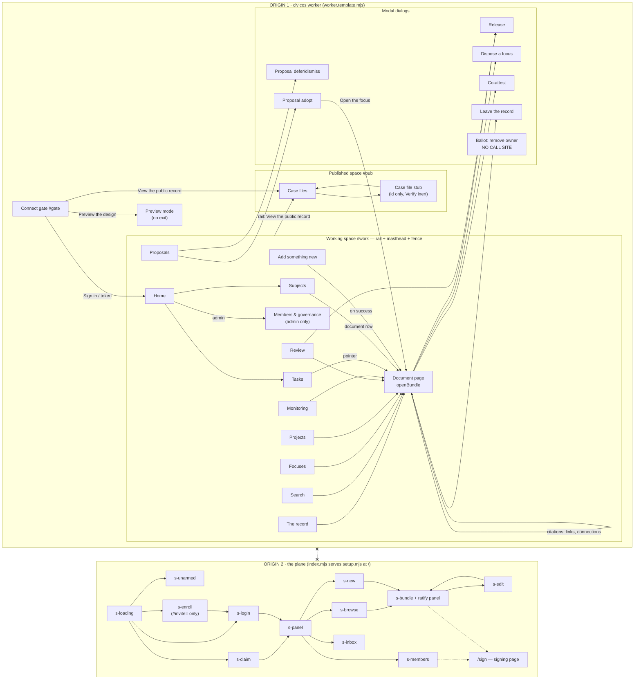

# UI-BASELINE — what the member-facing surfaces actually do today

Read from source on 2026-08-01. This is a description of **what is**, not what
is planned. Every claim carries a file and line. Where the source does not
settle a question this document says **UNVERIFIED** rather than inferring.
Nothing here evaluates or recommends.

Sources read in full:

| File | Lines | What it is |
| --- | --- | --- |
| `civicos-ui/app.html` | 6864 | Surface A, the CivicOS member client (single self-contained file: tokens, component CSS, markup, runtime) |
| `bio-plane/src/setup.mjs` | 1097 | Surface B, the plane's OWN served page (`SETUP_HTML`, a template literal exported to `index.mjs`) |
| `bio-plane/src/signpage.mjs` | 2 (one long literal) | Surface C, the signing page (`SIGN_HTML`), served at `/sign` on the plane origin |
| `civicos-ui/tokens.css` | 175 | the design tokens |
| `civicos-ui/test/*.test.mjs` | 23 harnesses | what behaviour is actually asserted |
| `civicos-ui/check-semantics.mjs` | 75 | the build-time semantics/docprofile guard |
| `civicos-ui/worker.template.mjs` | 25 | the dev host that serves Surface A and proxies `/api` |

**TWO member-facing surfaces exist, on two different origins, and they
overlap.** `worker.template.mjs:7-9` serves `app.html` at `/` on the CivicOS
worker and proxies `/api/*` to the plane at
`https://biosmoke7.believeinoakland.workers.dev`
(`worker.template.mjs:13-21`). `bio-plane/src/index.mjs:917-919` serves
`SETUP_HTML` at `/` on the **plane's** origin. A member who reaches the plane
directly gets Surface B; a member who reaches the CivicOS worker gets Surface
A. Neither page links to the other (see §5, Dead ends).

Screen count: **Surface A — 16 addressable views + 7 modal dialogs + 1 inline
picker**, plus a "preview" mode of the 12 router screens. **Surface B — 12
`<section>` views** in one page. **Surface C — 3 tabbed panes.**

Suite status as run on 2026-08-01: `node test/run.mjs` → 23 harnesses PASS,
`check-semantics.mjs` OK.

---

## 1. Surface A — `civicos-ui/app.html`

### 1.0 Shell and routing (the frame every screen sits in)

Three top-level containers exist in the DOM at all times and are switched by
class, not by URL: `#gate` (`app.html:590`), `#work` (`app.html:627`), `#pub`
(`app.html:647`). Two modal hosts: `#dlg-wrap`/`#dlg` (`app.html:659`) and
`#pop` (`app.html:660`).

- **There is no URL routing.** `go(screen)` (`app.html:925-949`) swaps
  `#content.innerHTML` and calls `history.pushState({d:…},"")` with no path
  (`app.html:882`). No `hashchange` listener exists; the only `popstate`
  listener (`app.html:920`) re-runs the internal back stack. A screen cannot be
  linked to, bookmarked, or reloaded into.
- **Back** is `NAVSTACK`, a 60-entry array (`app.html:875-919`) that restores
  screen key, bundle id, search query, search scope, and scroll offset
  (`restoreScroll`, `app.html:892-898`). The `←` button (`app.html:629`) is
  hidden when the stack is empty or in preview (`navSync`, `app.html:891`).
- **Router table** `R` at `app.html:943-947`: `home, record, tasks, proposals,
  search, subjects, focuses, projects, review, monitoring, members, add`.
  `bundle` is explicitly `null` there — the document page is entered only
  through `openBundle()` (`app.html:3738`).
- **Rail** built from `op=whoami` (`buildRail`, `app.html:857-867`). 11 entries
  (`RAIL`, `app.html:844-856`), of which `members` carries `admin:true` and is
  **filtered out entirely** for a non-admin (`app.html:859`) — "capability a
  member lacks is ABSENT, not greyed". Plus an "Add something new" button
  (`app.html:862`) and a "View the public record" link (`app.html:864`).
  Collapse state persists in `localStorage["civicos.rail"]`
  (`railToggle`, `app.html:869-872`).
- **Live polling**: `liveStart` runs a 45s interval, paused when the tab is
  hidden or a dialog is open (`app.html:772-781`). Only Record
  (`app.html:1232`) and Review (`app.html:4050`) start it.
- **Build freshness**: `buildCheck` polls `/build` every 5 minutes and reveals
  a "Updated · reload" button (`app.html:687-696`, `632`).
- **Error state, universal**: `errPane(e)` (`app.html:6835-6838`) renders
  `reason · error · detail` or "Could not reach the plane." It is the only
  error rendering for a screen-level failure.
- **Disclosure popover**: `chipPop` (`app.html:1120-1134`) positions `#pop`
  under any chip/seal/glossary term and renders `meaning / enables / forbids /
  next` from the SEMANTICS table (`popHtml`, `app.html:1114-1119`). Dismissed
  by any click outside (`app.html:1135-1137`).

**SEMANTICS** (`app.html:964-1010`) is the single source for state meaning. It
covers `information` (collected, verified, retired), `focus` (surfaced,
elevated, deferred, dismissed) and `project` (**forming, investigating only**),
plus criticality (routine/supporting/crucial) and three flags
(reeval/annotations/monitored). `SEMANTICS.types.problem` aliases focus
(`app.html:1011`).

What SEMANTICS does **not** cover, against the plane's own catalog
(`bio-plane/checks/bio-checks.mjs:51-83`): project `matured` and `closed`, and
the entire `action` type (`planned, active, awaiting_response, resolved,
abandoned`). `sem()` falls through to `{chip: state, meaning: ""}`
(`app.html:1079`), so such a bundle renders a seal whose mark is the state's
first letter and whose disclosure is empty. `check-semantics.mjs` does not
catch this: it extracts plane states from `store.mjs` regexes only
(`check-semantics.mjs:38-47`), and the run on 2026-08-01 observed exactly
`collected, deferred, dismissed, elevated, forming, retired, surfaced,
verified` — never `matured`, `closed`, or any action state.

---

### 1.1 Connect gate — `#gate`

**Reached:** the landing state; `#work` and `#pub` carry no `.on` class until
`boot()` or `enterPublished()` runs.

**Displays** (`app.html:590-624`): the CivicOS wordmark, "Sign in to open this
group's working record.", and one card with four inputs.

**Controls**

| Control | Line | Does |
| --- | --- | --- |
| `Plane address` | 595 | sets `PLANE.base` live on input (790); blank = same origin |
| `Member handle` | 599 | empty ⇒ signs in as administrator (`role` sent verbatim, 813-814) |
| `Password` | 601 | — |
| `Sign in` | 603 | `signIn()` → `POST op=login {role,password}` → `boot()` (810-820) |
| `use a token` | 605 | toggles the token panel (789) |
| `MEMBER_TOKEN` + `Connect` | 610-612 | `tokenConnect()` sets `PLANE.token`, `PLANE.session=false`, `boot()` (821-826) |
| `View the public record →` | 619 | `enterPublished()` (791) |
| `Preview the design without loading data →` | 622 | `previewShell()` (794) |

**States**: default; token panel open/closed; error — `teach()` writes the
plane's reason/error/detail into `#g-err`, or a CORS sentence if the fetch
threw (`app.html:783-786`). No loading state beyond `#g-signin.disabled`
(811, 819).

**Writes**: nothing to the record. `PLANE.token` is held in memory only —
there is no `localStorage`/`sessionStorage` of the session anywhere in
`app.html` (only the rail collapse flag, 865/871).

**Does not do**, against a plan-reader's expectation: no sign-out, no session
restore across reload, no claim/enrol path (those exist only on Surface B), no
"forgot password", no indication of which plane answered.

---

### 1.2 Preview mode

**Reached:** the gate's "Preview the design" link (`app.html:622, 794`).

`previewShell()` (`app.html:798-807`) sets `PLANE.preview = true`, builds the
rail as **administrator** (`buildRail({administer:true})`, 800), stamps
`preview · not connected` into the handle slot (801), and calls `go("home",
true)`.

In preview, `go()` short-circuits at `app.html:936-942`: it renders the
screen's title, a fixed teach note ("Preview mode… Nothing shown here is
invented.", `previewNote`, 808) and — for `record, focuses, projects, review,
members` only — an empty three-column table reading "Connect to load."

**Does not do:** every other screen renders title + note and nothing else.
The back button is suppressed (`navSync`, 891). There is **no exit**: nothing
sets `PLANE.preview` back to false except `boot()` (829), which is only
reachable from the gate, which is hidden (804). See §5.

---

### 1.3 Home — `renderHome`

**Reached:** `boot()` lands here (`app.html:840`); rail "Home".

**Displays** (`app.html:5039-5065`): H1 "Home"; a lede naming the member if
`PLANE.me.handle || PLANE.me.cover`; then two summary cards and an entry grid.

- **Open tasks card** (`homeTasksCardHtml`, 4988-5004) from `op=tasks`
  (`homeTasksSummary`, 4965-4977). Partition: `live = status !== "resolved"`,
  `mine = assignee === PLANE.me.member`, `unassigned = assignee ===
  "unassigned"`. "Most urgent" is the longest-waiting of *yours* by `created`
  (4975) — stated as a proxy because the plane computes no priority.
- **Open proposals card** (`homeProposalsCardHtml`, 5006-5018) from
  `loadProposals()` (5847-5857), the same loader UI-5 uses.
- **Go to a surface** (`homeEntryHtml`, 5023-5032): exactly **two** entries —
  Tasks and Subjects — plus "Members & keys" only when `PLANE.me.administer`.
  Wired at `wireHomeEntries` (5034-5036).
- **All-clear banner** (5056-5060) shown **only** when both feeds answered and
  both are empty.

**States**: loading (`
Loading…
`, 5045); tasks-error
(independent, 4990-4991 — "no count is shown rather than a wrong one");
proposals-pending (5008-5009, when `op=proposals` is absent); zero; populated;
all-clear.

**Writes**: nothing. Stated in the lede (5044) and the header comment (4933).

**Does not do:** the entry grid does not link to Record, Review, Proposals,
Monitoring, Search, Focuses, Projects or Add, all of which are on the rail.
Home does not show a record count, a review queue depth, or anything about
monitoring.

---

### 1.4 The record — `renderRecord`

**Reached:** rail "Record"; the crumb on any document page (`app.html:3742`,
`3907`); `navBackDo` fallback when the stack is empty (`app.html:903`).

**Displays** (`app.html:1211-1238`): a `.recband` rule, H1 "Your accountability
record", a count line `N items · M awaiting review` (1219), and a sortable
table from `op=list` (`loadRecord`, 952-956).

Columns (`listCols`, 1157-1160): Item, Type, State, Updated. `recordRows`
(1140-1151) renders the title, a `crucial` seal when
`b.criticality === "crucial"`, the type label from `TYPE_LABEL`
(1074), the state seal (`sealFor`, 1096-1106) and a short date.

**Controls**: every `th` sorts, click again to flip (`thSort`/`listSortBy`,
1161-1163, 1206-1209); every row opens the bundle (`wireRows`, 1152).

**Side effect**: `paint()` writes the rail count badges for review, focuses and
projects (1223-1225). Those three badges are set **here and nowhere else** —
a member who never opens Record sees no counts on Review/Focuses/Projects.

**States**: `Loading…` (1212); populated; empty — `listTable` renders one cell
reading "Nothing here." (1179); error — whole screen replaced by `errPane`
(1237). Live-refreshes every 45s when the signature changes (1232-1236).

**Does not do:** no filter, no facet, no pagination, no criticality column, no
per-row action. `op=list` carries no criticality, so the crucial seal only
appears for rows that happen to carry it.

---

### 1.5 Focuses / 1.6 Projects — `renderFiltered`

**Reached:** rail "Focuses" / "Projects" (`app.html:944-945`).

Both are the same function (`app.html:1240-1248`) with a different filter, and
both filter the **already-loaded `op=list`** client-side — `focuses` accepts
`object_type === "focus"` OR `"problem"` (1243). Table has no Type column
(`listTable(list,false)`, 1245). Ledes are hardcoded at 944-945.

**States**: no explicit loading state (the screen paints once the cached list
resolves); empty → "Nothing here."; error → `errPane` replaces the screen.

**Does not do:** no triage affordance on the list — deferring or dismissing a
focus requires opening it. No project ownership, no participant list, no
progress. No count line.

---

### 1.7 Search — `renderSearchScreen` / `runSearch`

**Reached:** rail "Search"; Enter in the masthead search box (`app.html:631` →
`quickSearch`, 3964-3970).

**Displays** (3972-3977): H1 "Search", a lede, a second search input `#s-q`
shown only on phones (`.sm-only`), and `#s-res`.

**Which box is live**: `searchEl()` (3989-3992) picks `#s-q` under
`matchMedia("(max-width:680px)")`, otherwise the masthead `#m-search`.

**Scoping**: `SEARCH_SCOPES` (3979-3984) — launching a search *from* Focuses,
Projects, Review or Monitoring pins the query to that world (a server-side `q`
prefix plus a client-side predicate). Scope is shown in the count line with a
"search everything" escape (`widenSearch`, 3971, rendered at 4021).

**Fallback**: `op=search` failing or returning an unrecognised shape falls back
to a client-side substring filter over `op=list` (4015-4018), so search always
answers. Rows render through `recordRows` with fields normalised from either
shape (4021).

**States**: `Searching…` (4011); results with count (4021); no results —
`No results for "q"` (4022); error → `errPane` into `#s-res` (4024); **empty
query → leaves the screen**: `backFromEmptySearch()` returns to the scope's
origin screen or Record and clears the box (3960-3963, 4006).

**Does not do:** no facets (`facets:"none"` is only used by Review/Monitoring,
4035/4707), no query syntax help, no result snippets, no relevance indicator,
no saved searches.

---

### 1.8 Review — `renderReview` / `paintReview`

**Reached:** rail "Review".

**Displays** (`app.html:4042-4086`): H1 "Review", a lede that states the
verification claim ("appears to be what it claims to be, never that it is
accurate"), then `Awaiting review (N)` and a table.

**Where the rows come from**: `loadReviewRows` (4029-4041) prefers
`op=search q="type:information state:collected" limit=500 facets=none`
**because `op=list` carries no criticality**; on failure it falls back to
`op=list` filtered client-side with `criticality: null`.

**Controls, when `canRelease()`** (`app.html:722-725`: session AND
`me.session` AND capabilities include `contribute`):

- header select-all checkbox (4074, `rvAll`, 4097)
- per-row checkbox — **except** for a `crucial` row, which renders the crucial
  seal instead of a checkbox (4066-4068)
- `Release` button, disabled until something is checked; label becomes
  `Release N documents` (4079, `rvCount`, 4088-4096)
- every row still opens the document (`wireRows`, 4085)

**When `canRelease()` is false**, the checkbox column and the release bar are
absent entirely, and a note explains: "Releasing is a named member's decision.
This credential can read and prepare the review, and cannot release. Sign in as
a member holding `contribute`…" (4083).

**Crucial note** (4084): when the member *can* release and crucial rows exist,
"Crucial material is never released in bulk, and never through this flow…
That surface is not built yet."

**States**: `Loading…` (4043); populated; empty → "Nothing is waiting for
review." (4082); read-only; error → `errPane` into `#rv` (4060). Live-refresh
every 45s that **preserves the current selection** (4055-4058).

**Writes**: through the release dialog only (§1.16 D1).

---

### 1.9 Monitoring & developments — `renderMonitoring`

**Reached:** rail "Monitoring".

**Displays** (`app.html:4703-4721`): H1 "Monitoring & developments", a lede
defining re-evaluate and monitored, then up to two tables built by `monTable`
(1200-1205): `Needs a second look (N)` where `reeval_flag`, and
`Watched sources (N)` where `monitor_enabled && !reeval_flag`.

Columns: Item, Type, State, Last checked, Next check. "Next check" is computed
client-side by `monitorNext(last, frequency)` from a fixed
hourly/daily/weekly/monthly table (1108-1113); with no last-check or an
unrecognised frequency it prints the frequency string or an em dash (1196).

**Data**: `op=search q="" limit=500 facets=none`, falling back to `op=list`
when that returns nothing (4707-4708). Sorting is supported on the two monitor
columns via `monKey` (1182-1186).

**States**: `Loading…` (4704); one, both, or neither table; empty → "Nothing is
flagged and nothing is being watched right now." (4715); error → `errPane`
(4720). No live polling here.

**Does not do:** no control to enable, disable, or reschedule monitoring; no
control to clear a re-evaluate flag; no diff of what changed; no link to the
change that raised the flag. Every row's only action is to open the document.

---

### 1.10 Members & governance — `renderMembers`

**Reached:** rail "Members & keys" — **admin only** (`RAIL` entry has
`admin:true`, `app.html:855`, filtered at 859). Also from Home's entry grid
when admin (5029).

**Displays** (4900-4924):

1. H1 "Members & governance" and a lede that states this screen only shows
   (4902).
2. **Governance block** (`governanceHtml`, 4829-4844):
   - the admin denominator, read straight from `op=adminarith`'s `live` row
     (`adminDenominator`, 4789-4792; rendered 4793-4802) as "N of M
     administrators' votes", or the not-possible sentence when
     `live.possible` is false (4798).
   - **founder reconciliation** (4823-4827): when `adminarith.administrators`
     exceeds the count of admin rows on the roster, the difference is stated
     explicitly — the founding ADMIN_TOKEN holder has no members row.
   - the scaling table from `adminarith.table` (`adminScaleHtml`, 4805-4815).
   - the two-owner divergence table from `op=projectownerarith`, rendered by
     **UI-3's** `ballotDivergenceHtml` reused (4841).
   - if `adminarith` did not answer: "The administrator arithmetic could not be
     read with this account." (4837)
3. **The roster** table: Member, Class, Standing, May, Owns (4919).
   - Class from `op=memberlist`'s `role` verbatim (`memberRole`, 4756); an
     unrecognised token renders as itself (4765).
   - Standing from `MEMBER_STATUS_UI` (4767-4779); unrecognised shown as-is.
   - May = capability chips, or "view only" when empty (4780-4784).
   - Owns = a bounded fan-out of `op=projectparticipants` over the first 80
     projects (`memberOwnership`, 4853-4877); a project that cannot be read is
     skipped, and the whole column reads "not read" when the fan-out failed
     (4879-4880). A cap note appears when >80 projects exist (4920).

**Controls**: **none.** There is no button, link, checkbox or input anywhere on
this screen. Rows are not clickable.

**States**: `Loading…` (4903); roster error → `errPane` into `#mm` (4913) while
the governance block still renders; empty roster → "No members listed, or this
account cannot read the roster." (4921); partial (any of the four parallel
reads can fail independently, 4907-4912).

**Does not do:** no add member, no revoke, no invite, no key registration, no
key revocation — all of which exist on Surface B (§2.11). No ballot to remove
an administrator or an owner, despite rendering the arithmetic for both.

---

### 1.11 Tasks — `renderTasks`

**Reached:** rail "Tasks"; Home's tasks card and entry grid.

**Displays** (`app.html:5151-5174`): H1 "Tasks", a lede stating nothing is
deleted, then up to three sections from `op=tasks`: `Yours (N)`,
`Unassigned — no one is holding these`, `With other members`
(`taskSection`, 5176-5179).

**Each card** (`taskCard`, 5181-5199): kind label (`TASK_KIND_UI` maps exactly
one kind today — `authority-undetermined`, 5100-5106; anything else is
title-cased from its own token, `humanKind`, 5107), assignee badge (5134-5138),
status chip (5139-5142), the need sentence, an ageing line **only if the task's
own history carries one** (`agedEvent`, 5126-5133), a pointer button to
`refers_to` (5186-5188), the age from `created` in words (`taskAge`,
5114-5123), the action row, an error slot, and the full history list (5143).

**Controls**

| Control | Line | Does |
| --- | --- | --- |
| pointer `↗` | 5187 | `openBundle(refers_to)` (5211) |
| `Mark resolved` | 5206 | `POST op=taskresolve {id}` then re-render (5221-5228) |
| `Forward to someone…` | 5205 | `openForward` (5242-5257) — reads `op=memberlist`, builds an in-card `<select>` of other **active** members, then `POST op=taskforward {id,to}` (5232-5239) |

For a task in the `others` group there are **no** controls: the card renders
"This isn't yours to resolve — it's with **X**." (5202-5203).

**States**: `Loading…` (5154); three sections in any combination; all-empty →
"No open tasks…" (5170); per-task error into `[data-err]` (5258-5262);
forward-picker open; forward refused because the roster is unreadable
("This account cannot read the member roster…", 5247) or there is nobody to
forward to (5252); a global `TASKS_BUSY` guard prevents double submits (5216).

**Writes**: `op=taskresolve`, `op=taskforward`. The actor is stamped by the
plane from the session, never sent (5217-5219).

**Does not do:** no create-task, no defer/age-with-reason control (the plane
does not run the ageing job — D-79, noted at 5080-5084), no assignee-ownership
enforcement (noted at 5090-5092 as the plane's gap, not worked around), no
filtering or sorting.

---

### 1.12 Proposals — `renderProposals`

**Reached:** rail "Proposals"; Home's proposals card.

**Displays** (`app.html:5806-5827`): H1 "Proposals" and a lede stating these
are questions the record raised and nobody has judged.

Feed: `loadProposals()` (5847-5857) calls `op=proposals`, then aggregates
through `proposalsFrom()` (5717-5746) — every `missing_predecessor` finding
grouped by `(progression_key, stage_key)` into ONE proposal carrying N
instances, sorted biggest-pattern-first.

**Each card** (`proposalCardHtml`, 5786-5802), in order: the derived badge
("Surfaced by the record — not yet judged" + "Nobody has yet decided it is
worth pursuing", 5760-5765), the question (`proposalQuestion`, 5748-5754), the
aggregation meta, the strength grade or an explicit "undetermined"
(`proposalGradeHtml`, 5770-5774), a `
` of every instance, and exactly
three buttons.

**Controls**: `Adopt — make it a focus` → `openProposalAdopt` (5796);
`Defer…` and `Dismiss…` → `openProposalAct(key, to)` (5797-5798).

**States**

- **gap** — `op=proposals` answers "unknown op" ⇒ `proposalGapHtml`
  (5832-5842), a banner that names the missing op and says the rendering and
  the acts are built and proven against the instance shape. This is the state
  on any plane that has not shipped that op.
- **error** — any other failure also returns `{gap:true, reason:"error"}`
  (5853), so a real error renders the same banner. UNVERIFIED whether that is
  intended; the banner text does not distinguish the two.
- empty → "The record has surfaced no proposals right now…" (5822).
- populated.

**Side effect**: sets the rail `#cnt-proposals` badge (5820).

---

### 1.13 Subjects — `renderSubjectView`

**Reached:** rail "Subjects"; Home's entry grid.

**Displays** (`app.html:5320-5330`): H1 "Subjects", a lede, one text input
(`#subj-q`, placeholder "e.g. Sheng Thao, or an entity id (ENT-…)"), a `Find`
button, and an empty `#subj-res`.

**Lookup** (`lookupSubject`, 5335-5354): an `ENT-` prefix reads `op=entity`
directly; anything else goes to `op=entitybyalias`. Zero hits → an honest empty
("The registry holds only subjects a member has declared…", 5345). Exactly one
hit → straight to the subject. More than one → the ambiguity is listed in full
with an "Open this subject →" button each (5350-5352).

**A subject page** (`showEntity`, 5359-5383) is four blocks:

1. the entity: kind, label, aliases with the canonical one marked, note
   (`subjEntityHtml`, 5386-5395).
2. **Declared relations** (`subjRelationsHtml`, 5400-5417) — rendered with **no
   A–D grade at all**, each carrying the constitutive sentence, plus
   justification and citation when present. Empty state: "No relations have
   been declared for this subject."
3. **Documents that concern this subject** from `op=concerns`
   (`subjConcernsHtml`, 5423-5440). Each row: a button opening the bundle (or
   the truncated capture sha when there is no bundle) and the grade badge.
   `subjGradeBadge` (5307-5318) reads the op's own `established` /
   `needs_confirmation` — a Grade C renders "Grade C · unconfirmed" plus
   "Plausible, not established". Two distinct empties: op failed vs no
   documents (5427-5428).
4. **Connections among these documents** from `op=connections`
   (`subjConnectionsHtml`, 5447-5461), each showing both end grades and the
   weaker taken.

**Writes**: nothing (stated at 5271).

**Does not do:** no browse/list of subjects — the only way in is to know a name
or an id. No declare-a-relation, no confirm-a-Grade-C, no create-subject.

---

### 1.14 Add something new — `renderAdd`

**Reached:** the rail's `+ Add something new` button (`app.html:862`). It is
not in `RAIL`, so it carries no active state (`setActive("")`, 6470).

**Capability gate** (6471-6477): without `canContribute()` (session AND
`me.session` AND `contribute`, 6464-6467) the screen is one paragraph — "This
credential can read the record and cannot write to it, so there is nothing here
to fill in." — **and no form at all**.

**With `contribute`** (6478-6508): a type `<select>` over `ADD_TYPES`
(information / focus / project / action, 6457-6458), Title, "What do you know?",
then a document block shown **only for `information`** (`addTypeSync`,
6510-6516) with: address, who issued it, "Fetch the page's stylesheets and
images too" (checked by default), "Ask a public archive to mirror it as well"
(unchecked), and a fixed Grade B statement (6499-6502).

**Validation** (`addValidate`, 6517-6534) is live and speaks the reason in the
button's helper line: title required, body required, address must be `https://`,
an address requires an issuer. When valid it previews the outcome: "It will be
captured at collected, Grade B, and appear in the record for review."

**Submit** (`addGo`, 6550-6643), in order:

1. `POST op=acquire` with `subresources` and, when the manifest comes back
   incomplete, a continuation loop (`addCapture`, 6810-6833).
2. `heldMatch` (6766-6809) — hash first (`op=search hash:sha256:…`), then
   locator, then a real byte comparison through the flattened `docprofile`
   change pipeline (`identify` / `compare`). Already held and unchanged ⇒
   **nothing is written**, one sentence, and the existing bundle opens after
   1.4s (6572-6579). Changed ⇒ `CHANGED_FROM` is set and the new bundle's body
   records that it follows the earlier capture (6597-6601).
3. `POST op=attest` for a timestamp, whose failure is recorded and does not
   stop the write (6582-6590).
4. `rec op=allocid`, then `POST op=promote` with `mdFor`/`docFiles`/`registerFor`
   (6592-6626).
5. On success: caches invalidated and `openBundle(id)` (6636-6640).

**States**: capability-absent; form invalid (button disabled with a reason);
in-flight (`addSay` progress lines at 6569, 6583, 6592, 6714-6716, 6731);
already-held; refused — `GATE_REFUSED` names the failing checks, anything else
names the reason, both ending "Nothing was written." (6628-6635); partial
capture — "Saved. …A few of the files that make the page look right have not
arrived yet" (6637-6639); thrown error (6641).

**A defect in this path, stated as fact**: `ADD_TICKS` is used at
`app.html:6725` and `6825` and is **never defined anywhere in the file**
(`grep ADD_TICKS` returns only those two lines). It is reached only when a
capture comes back incomplete *with* a continuation session. The resulting
`ReferenceError` is caught by `addGo`'s outer catch (6641) and shown to the
member as the raw message. Also, `heldMatch`, `addCapture` and the surrounding
comment block are **defined twice** (6666/6766 and 6710/6810) — the second
definition wins.

---

### 1.15 The document page — `openBundle`

**Reached:** any record row, any search result, a Tasks pointer, a Subjects
document row, a citation row on another document, a link-surface target, the
Add receipt, a proposal-adopt receipt, a dispose/attest receipt. It is the
system's hub.

**Loads** (`app.html:3738-3790): `op=image` (forced, 3745) and `op=projection`
in parallel; then, sequentially: `parseLog` over `_history/promotion_*.json`
(1608-1617), `reverseRefs` (a client-side walk of every focus/problem/project
projection, cached for the session, 752-768), `op=links` by the primary capture
sha (`linksFor`, 3330-3336), and `docKnowsPanel` (5521-5538).

**Header** (3912-3917): a `.docband` rule, the crumb `The record › ID`, the
title, a strata tab bar, an "Open the document ↗" link, and the seal row.

**Seals** (3806): file-type tag, state seal (carrying the release fact from the
Session Log when verified — `releaseFact`, 1627-1630), crucial seal (carrying
which cases lean on it), monitored seal (carrying last/next check), reeval
seal, annotations seal. Each is click-to-disclose.

**Four strata** (`STRATA_INFO`, 1068-1073; `stratum`, 3922-3923), scroll-spied
by an `IntersectionObserver` (`strataSpy`, 3934-3949):

- **s1 "What it says"** (3794-3796): the unfinished-capture banner, the prose
  (`mdLite` + glossary wrapping, 1265-1281), a collapsible "Source Material"
  section, and the reuse disclosure.
  - `unfinishedBanner` (3466-3499) reads `complete:false` and asks the
    flattened `docprofile` `fidelity()` whether what is missing is decoration
    or load-bearing, and says which. It offers **"Collect the rest" /
    "Finish collecting it"** → `continueCapture(id)` when `canRelease()`;
    otherwise "Finishing it needs a member who can add to the record."
  - `reuseSummary` (3512-3525) lists files taken from an earlier visit with
    their dates.
  - Each binary artifact renders as a card with an open link and a collapsible
    per-part integrity list with copy buttons (`renderSourceItem`, 1332-1344).
- **s2 "In the case"** (3828-3832): the group line, the project objective, "This
  X cites" (from the projection's `references`), "Cited by" (from
  `reverseRefs`), and — labelled separately as **the source's own assertions,
  not the group's** — "Links this page carried (N)" (3820-3827) rendering
  `op=links` through `linkSurfaceHtml` (3426-3432): a named tally (never a
  ratio, 3363-3381) and five partitions (`LINK_PARTS`, 3298-3309) with 12 rows
  each and a "Show the remaining N" toggle (3411-3424). Empty s2 → "No member
  of this group has cited this yet, and it cites nothing." (3831)
- **s3 "Trust"** (3835-3846), rendered only when at least one row is present:
  Issued by, Source (a real `<a target=_blank>`), Retrieved, Source status,
  Content hash + copy, Bundle hash + copy, Monitor.
- **s4 "The record"** (3848-3856): the promotion log (`renderLogEntry`,
  1631-1647, including the acknowledgment and mitigation verbatim and a
  `
` of the raw entry), then "Earlier revisions, kept" with a
  **"compare to current"** button per revision that renders an in-place LCS
  line diff (`toggleDiff`/`lineDiff`, 1651-1679). Empty log → "No promotions
  recorded yet."

**Then `docKnows`** (5521-5538): "What the record knows about this document" —
Subjects this document names (`op=resolutions`), Documents this one connects to
(`op=connections`), Processes this document is part of
(`op=captureprogressions`, a **delegated op**; absent ⇒ the named-gap banner at
5641-5643). Each section degrades on its own; a document with no primary
capture sha renders the whole panel as an empty string (5522).

**Then the act bars, in this order** (3858-3905):

| Bar | Condition | Line |
| --- | --- | --- |
| Release | `information` + `collected` + `canRelease()` | 3860-3864 |
| Release (blocked) | `information` + `collected` + `crucial` — states the crucial flow "is not built yet" | 3861-3862 |
| Disposition | `focus`/`problem` + `canDispose()` + a legal move exists | 3869-3882 |
| Disposition (blocked) | state is `elevated` — "can no longer be deferred or dismissed" | 3883-3884 |
| Attestation | `information` + `canAttest()` + a 64-hex capture sha | 3894-3904 |

**Opening the artifact** (`openArtifact`, 1529-1604): opens a tab synchronously
so popup-blocking never bites, fetches every part through `op=capture` **by
hash** and re-hashes each on arrival (`fetchParts`, 1348-1367). A mismatch
refuses with both hashes shown — "REFUSING TO OPEN · BYTES_DO_NOT_MATCH_THE_RECORD"
(1547). A captured HTML page with a snapshot manifest is resolved through
`resolveSnapshot` (1451-1492) — every subresource fetched by hash and verified,
CSS rewritten in two passes, links partitioned and marked, scripts held and not
run — and shown in an `iframe sandbox=""` with `srcdoc` (1591). A missing part
refuses the whole render, with the outstanding list named one by one
(1575-1579, `outstandingList` 1516-1527). Without a manifest the older
defanging path applies (`sanitizeCapturedHtml`, 1379-1387). Non-renderable
types download.

**Leaving the record** (`leaveTheRecord`, 3439-3452): an off-site address is
deliberately **not** an `<a>` — it is inert text that opens a warning dialog
first, because an anchor could be middle-clicked past the warning (3434-3438).

**States**: crumb + `Loading…` (3742); not found — "This bundle was not found."
(3746); rendered; refusing to open; refusing to render; thrown error →
`errPane` replaces the whole screen (3920).

**Does not do:** no edit/revise control (that exists only on Surface B, §2.9);
no ratify/publish control anywhere; no annotate; no set-criticality; no
enable-monitoring; no retire; no elevate-a-focus-into-a-project (SEMANTICS
declares `elevated` as a next state, 984, and `DISPOSE_LEGAL` includes it,
4215-4217, but `DISPOSITIONS` offers only defer and dismiss, 4220); no ballot
entry point on a project page.

---

### 1.16 The seven modal dialogs

All mount into `#dlg` and are closed by the Cancel button, a backdrop click
(4134) or Escape (4135). `closeDialog` clears the HTML (4133).

**D1 — Release** (`openReleaseDialog`, 4109-4132). Reached from Review's
Release button or a document's Release bar. Shows the set, two required
textareas capped at 500 chars — Acknowledgment and "What you checked" —
neither prefilled, with live grammar validation refusing quote, backslash and
newline in the counter itself (`relValidate`, 4136-4147). Commits
`POST op=select {ids} kind=enumerated` then `GET op=release` (4153-4154). On
success: a green receipt card inserted at the top of a re-rendered Review
(4159-4164). On refusal: the plane's own reason, detail and named offenders
rendered verbatim (`releaseRefusal`, 4170-4185); `SET_MOVED` re-renders the
list automatically.

**D2 — Dispose a focus** (`openDisposeDialog`, 4281-4309). Four steps stated in
the header comment (4187-4206): CHOOSE (radio between Defer and Dismiss, either
switchable in the dialog), **PRE-FLIGHT** (`disposePreflight`, 4232-4257 — a
pure function mirroring the store's own `LEGAL` table at 4214-4219 and refusal
order NOT_A_DISPOSITION → NO_REASON → BAD_REASON → ILLEGAL_TRANSITION, painted
as ✓/✗ rows with the need sentence, 4332-4340), AUTHOR (a required 160-char
reason, never prefilled), and the **weight ladder** showing this act at
`reasoned` (4261-4275). Commit re-runs the pre-flight as the real gate and
refuses in the surface without reaching the plane (4355-4363). Receipt at
4380-4394; `Done` re-opens the focus (4396).

**D3 — Ballot: remove a project owner** (`openBallotDialog`, 4546-4588).
**No call site exists.** `grep openBallotDialog app.html` returns only the
definition; `canBallot()` (4457) is likewise never called. The dialog is fully
built — owner radios, the denominator read straight from
`op=projectownerarith`'s `live` row, the two-owner divergence table, the
pre-flight, the reason field, the weight ladder, `doBallot` → `op=projectownerremove`
— and is reachable only from `test/act-ballot.test.mjs`. Its divergence
renderer *is* reused live, by the Members screen (4841).

**D4 — Proposal defer/dismiss** (`openProposalAct`, 5892). Same motion as D2.
Commit goes to `POST op=proposedispose`, a **delegated op**; when it answers
"unknown op" the dialog says so plainly and states that nothing was written and
the reason has nowhere to be stored (5977-5983).

**D5 — Proposal adopt** (`openProposalAdopt`, 6043-6074). Choose focus or
problem; the record's question is shown in a "for reference, not to copy" box
(6055-6059); title and statement are both required and both authored
(`proposalAdoptPreflight`, 6020-6040). Commit builds a bundle with the **same**
writers the Add surface uses (`mdFor`/`docFiles`/`registerFor`) and calls
`op=promote`; `surfaced_by` is stamped by the plane, never sent (6099-6154).
Receipt offers "Back to proposals" and "Open the focus" (6165-6166).

**D6 — Co-attest a capture** (`openAttestDialog`, 6296-6325). Two radio
choices: timestamp only (default) or timestamp + a public archive request,
the second disabled unless the locator is `https://` (6305-6311). **No author
field** — the act carries no member text (6291-6294). An honesty block states
what it does and cannot do at both ends (6256-6259). Pre-flight order
NO_STORAGE → BAD_SHA → NO_SUCH_CAPTURE (6270-6287). Weight ladder at
`attested`. Success receipt names the token, the service, the byte count and
the **resulting standing** — "Still Grade B, now strengthened toward
evidentiary weight… not Grade A" (6244-6252, 6388-6408), with the plane's own
note rendered verbatim. Failure receipt lists every attempt with its reason and
states the standing as unchanged (6413-6431), offering Close and Try again.

**D7 — You are about to leave the record** (`leaveTheRecord`, 3439-3452).
"Stay in the record" / "Open it anyway"; the latter opens with
`noopener,noreferrer` and nulls `opener` (3453-3456).

**Inline picker (not a dialog)** — the task forward `<select>` replaces the
card's action row in place (5253-5256), with its own Forward and Cancel.

---

### 1.17 Published space — `#pub`

**Reached:** the gate's "View the public record →" (791) or the rail's
"View the public record" (864). `enterPublished()` (6841) removes `.on` from
`#work`, hides `#gate`, adds `.on` to `#pub`, flips
`data-space="published"` on the document root, and calls `pubList()`.

**Masthead** (648-654): a mono square, the group name and id string, and two
links — **"Case files" and "Verify", both wired to `pubList()`** (653).

**Case-file list** (`pubList`, 6842-6852): `op=publishedmanifest` — the one op
called without a token (`api()`, 701). Each row: title, bundle id, ratified
date, first 16 hex of `bundle_sha`. Empty → "This group has not published any
case files yet…" (6850). Error → `errPane`.

**Case file** (`pubOpen`, 6853-6858): an eyebrow, the **bundle id as the H1**
(no title), a paragraph stating the body is not rendered — "Rendering the full
public reading surface is gap G1 in the UI design" — a verify box with a
**`<button class="btn ghost">Verify</button>` that has no handler of any kind**
(6856), and an "← All case files" link.

**Does not do:** does not render the case file, does not verify anything, does
not offer a route back to the working space or the gate.

---

## 2. Surface B — the plane's own page (`bio-plane/src/setup.mjs`)

One HTML document, 12 `<section>` elements, exactly one visible at a time via
`show(id)` (`setup.mjs:337`). Served at `/` on the plane origin
(`index.mjs:917-919`). Its own inline CSS re-declares a subset of the same
palette (`setup.mjs:35-41`) — it does **not** import `tokens.css` and does not
carry the serif/sans/mono three-face system (it uses `system-ui` and Georgia,
39, 48).

Entry is decided by `state()` (343-402), which reads the URL fragment first,
then `sessionStorage["bio-session"]`, then `op=bootstrap`.

| # | Section | Reached by | Shows / does | Writes |
| --- | --- | --- | --- | --- |
| B1 | `s-loading` (105) | default on load | "One moment"; on a failed bootstrap it rewrites itself to "This copy is not answering" (394-395) | — |
| B2 | `s-unarmed` (110) | `!b.bootstrapConfigured` (398) | tells the operator to set `ADMIN_TOKEN` in the Cloudflare dashboard | — |
| B3 | `s-claim` (121) | not claimed (401); `#boot` prefilled from a `#boot=` fragment (374-375, 400) | one-time password + two password fields; validates non-empty, ≥12 chars, match (407-409); `op=claim` then auto `op=login` → panel; a "Recovery mode" notice when `b.rearmed` (126-130, 399) | claims the instance |
| B4 | `s-login` (148) | `b.claimed` (397), or any 401 from `rec()` (490) | member name (empty ⇒ admin) + password; `op=login`; distinguishes `NO_SUCH_ROLE` from a bad password (433-435) | session in `sessionStorage` (469) |
| B5 | `s-panel` (163) | after claim/login/restore | version, claimed-at, roles, session expiry; four buttons: Browse the record, Add something new (hidden without `contribute`, 461), Review the inbox, Members and keys (hidden unless `WHO === "admin"`, 471); a "What this page is, and is not" paragraph | — |
| B6 | `s-browse` (190) | "Browse the record" (607) | `op=list` grouped by object type in the fixed order Information / Focuses / Projects / Actions, then any other type; count line says "Everything below is read-only" (504); rows open a bundle (520) | — |
| B7 | `s-bundle` (197) | a browse row, or after a create/revise (843, 947) | title, facts (state, last updated, created, criticality), the markdown body (`mdRender`, 535-551), **every file with a download link carrying the session token in the URL** (591), and the full history from `_history/manifest.json` with a per-revision "view" button (597-604); viewing a revision shows a notice and a "Back to the live record" button (580). Then the **ratify panel** | — |
| B7a | ratify panel (617-654) | inside B7, **only when `can("publish")`** (624) | computes the revision's sha in the browser, shows bundle id + hash, links to `/sign`, takes a pasted SSHSIG block, `op=ratify`; eight named refusal translations (`ratifyWhy`, 655-667); also a "Revise instead" button | **publishes** |
| B8 | `s-new` (211) | "Add something new" (791) | type select (information/focus/project/action; the `project` option is hidden without `create_projects`, 463), title, body, and an optional document block: address + issuer + "Also ask a public web archive" | `op=acquire` → `op=attest` → `op=promote` (792-846) |
| B9 | `s-edit` (254) | "Revise instead" on the ratify panel (637) — **the only entry point** | a raw `<textarea>` of the whole `bundle.md`, frontmatter included; requires an `id:` line (918); takes `op=lease`, appends a Session Log entry and moves `last_updated` while preserving `created` (`reviseText`, 870-899), carries every other file forward (`carryForward`, 904-913), `op=promote`; translates `FILES_DROPPED`, `CAS_STALE`/`STALE` (939-945) | **revises** |
| B10 | `s-inbox` (266) | "Review the inbox" (953) | `op=inbox`: knock id, status, received, hash, size, note, contact, handler. Reading is ungated; the two disposition buttons render **only with `contribute`** (969) | `op=inboxresolve` |
| B11 | `s-members` (275) | "Members and keys", admin only (981) | the roster with a revoke/reinstate button per member (990-996), the registered keys with revoke/reinstate per key (999-1008), an add-member form producing a **one-time `#invite=` link** shown once (1031-1036), a key box that echoes back what it thinks was pasted before committing (`describeKey`, 1043-1060), and a link to `/sign` | `op=memberadd`, `op=memberset`, `op=signeradd`, `op=signerset` |
| B12 | `s-enroll` (320) | an `#invite=` fragment on load (346-373) | shows what the invitation is for (cover, role, capabilities) via `op=invitelook`; handle + password (≥12); five named refusals (1082-1086); success drops the member on the sign-in screen with the handle prefilled (1088-1089). A spent link shows the "not live" message and **hides every input** (359-362) | `op=enroll` |

**Capability discipline** on Surface B is one function, `applyCaps()`
(460-464), called both before and after `whoami` answers, and `CAPS` starts
empty so the in-flight window shows nothing (452-453).

### Surface C — `/sign` (`bio-plane/src/signpage.mjs`)

Three tabs — Keys, Sign a release, Sign a ratification. Generates two Ed25519
keys in the tab, produces SSHSIG signatures verifiable with stock
`ssh-keygen -Y verify`, and states "Runs entirely in this tab. Nothing is sent
anywhere." Reached **only** from Surface B (`setup.mjs:306` and `631`). It has
no link back.

---

## 3. Navigation map — how a member moves today

**The two surfaces are not connected.** No string in `app.html` links to the
plane's root page or to `/sign`; no string in `setup.mjs` links to the CivicOS
worker. The gate's "Plane address" field (`app.html:595`) points the API base at
a plane but never navigates there. A member moves between surfaces only by
typing a different origin into the browser.

---

## 4. The OVERLAP table

Both surfaces read and write the same record through the same ops. Where both
do a thing, "authoritative" below means *the one whose behaviour the record
ends up reflecting*, judged by which is the more complete writer — not a
recommendation.

| Capability | Surface A (`app.html`) | Surface B (`setup.mjs`) | Which is authoritative |
| --- | --- | --- | --- |
| Sign in | gate, `op=login`, handle-or-admin (810-820); **also a raw MEMBER_TOKEN path** (821-826) | `s-login`, `op=login`, handle-or-admin (425-441) | **B** — it is the only one that persists a session (`sessionStorage`, 469) and the only one that can *create* the first credential |
| Claim the instance | absent | `s-claim` → `op=claim` (403-424) | **B**, exclusively |
| Enrol an invited member | absent | `s-enroll`, `#invite=` fragment → `op=enroll` (346-373, 1076-1090) | **B**, exclusively |
| Browse the record | Record + Focuses + Projects + Search + Monitoring, `op=list` / `op=search`, sortable, live-polling (1211-1248, 3972-4025, 4703-4721) | `s-browse`, `op=list` grouped by type, static (498-521) | **A** — B has no search, no sort, no refresh |
| Read one bundle | 4-strata document page with links, glossary, subjects, connections, progressions, artifact verification, diffs (3738-3921) | `s-bundle`: facts, markdown, file downloads, history (554-606) | **A** — B renders no provenance analysis, no link surface, no artifact verification |
| Open/verify a captured artifact | fetch by hash, re-hash, refuse on mismatch, sandboxed snapshot render (1348-1604) | a plain `download` link with the token in the URL (591) | **A** — B performs no verification at all |
| View revision history | list + in-place line diff (3849-3856, 1651-1679) | list + view-the-whole-revision (594-604) | split: **A** diffs, **B** shows the full historical text |
| Add / capture | Add surface with duplicate detection, subresource capture, continuation, attest, Grade B statement (6469-6643) | `s-new`, single-pass acquire + attest + promote (792-846) | **A** — B has no subresource capture, no duplicate check, no continuation |
| Revise a bundle | **absent** | `s-edit`, raw `bundle.md` editing with lease + carry-forward (851-950) | **B**, exclusively |
| Release (collected → verified) | Review batch + per-document, acknowledgment + mitigation (4042-4185) | absent | **A**, exclusively |
| Dispose a focus | dispose dialog with pre-flight (4281-4409) | absent | **A**, exclusively |
| Co-attest a capture | attest dialog (6296-6440) | only as an automatic step inside create (821-824) | **A** for the deliberate act; **B** does it silently as part of capture |
| Adopt a proposal | proposals screen + adopt dialog (5806-6168) | absent | **A**, exclusively |
| Tasks | full inbox with forward/resolve (5151-5262) | absent | **A**, exclusively |
| The knock inbox | **absent** | `s-inbox` with pull/discard (954-978) | **B**, exclusively |
| Members roster | read-only, plus governance arithmetic (4900-4924) | read **and write**: add, revoke, reinstate, invite links (982-1039) | **B** for changing it; **A** for the arithmetic B never shows |
| Signing keys | **absent** | register, revoke, reinstate; links to `/sign` (997-1073) | **B**, exclusively |
| Publish / ratify | **absent** | ratify panel, `can("publish")` gated, SSHSIG (617-667) | **B**, exclusively |
| Read the published record | `#pub`: manifest list + an unrendered case-file stub (6841-6858) | absent | **A**, exclusively |
| Governance arithmetic | admin denominator, scaling table, two-owner divergence, founder reconciliation (4789-4844) | absent | **A**, exclusively |
| Design language | `tokens.css` inlined, three faces, two spaces (`app.html:18-55`) | its own subset palette, system fonts (`setup.mjs:35-99`) | **A** is the design source; B does not consume it |

Net: **neither surface is a superset of the other.** Publishing, revising,
enrolling, claiming, key management and the knock inbox exist *only* on B.
Release, disposition, tasks, proposals, subjects, monitoring, search, the link
surface, artifact verification and the published reader exist *only* on A.

---

## 5. Dead ends

Screens a member can reach and not leave, controls that lead nowhere, states
with no exit. Ordered by how thoroughly they trap a member.

### 5.1 Traps — reached, no way out

1. **Preview mode has no exit.** `previewShell()` (`app.html:798-807`) hides
   `#gate`, shows `#work`, sets `PLANE.preview = true` and suppresses the back
   button (891). Nothing sets `PLANE.preview = false` except `boot()` (829),
   which only `signIn()` and `tokenConnect()` call, both of which live on the
   now-hidden gate. The rail's "View the public record" (864) moves the member
   to `#pub`, which is dead end 2. **The only exit is a browser reload.**
2. **The published space has no way back.** `enterPublished()` (6841) removes
   `.on` from `#work` and hides `#gate`. `#pub`'s masthead has exactly two
   links, both `pubList()` (653). There is no "sign in", no "back to the
   working record", no rail. A signed-in member who clicks the rail's "View the
   public record" **loses their session to the reload** required to get back.
3. **There is no sign-out anywhere in Surface A.** `grep -ci
   'signout|logout|sign out'` over `app.html` returns 0. The handle in the
   masthead renders with a `▾` caret (`app.html:833`) — the affordance of a
   menu — and `#m-handle` has **no click handler**. It is a dead control that
   looks like a menu.

### 5.2 Controls that lead nowhere

4. **The published "Verify" button** (`app.html:6856`) is a
   `<button class="btn ghost">Verify</button>` with no `onclick`, no id, and no
   listener. On the one screen whose entire purpose is independent
   verification, the verify control does nothing.
5. **The published masthead's "Case files" and "Verify" links both call
   `pubList()`** (653). Two labels, one destination.
6. **The ballot dialog has no call site.** `openBallotDialog` (4546) and
   `canBallot` (4457) are never referenced outside their own definitions. A
   fully-built act — denominator, divergence, pre-flight, weight ladder,
   receipt, `op=projectownerremove` — is unreachable from any screen. The
   Members screen renders the owner arithmetic (4839-4842) with no way to act
   on it.
7. **The rail counts for Review / Focuses / Projects are only written by
   Record** (`app.html:1223-1225`). A member who goes Home → Tasks → Review
   never sees them.
8. **`#cnt-home`, `#cnt-record`, `#cnt-search`, `#cnt-subjects`,
   `#cnt-monitoring`, `#cnt-members`** are emitted by `buildRail` (861) and
   never written by anything. Permanently empty spans. (Only `cnt-review`,
   `cnt-focuses`, `cnt-projects` — 1223-1225 — `cnt-tasks` — 5164 — and
   `cnt-proposals` — 5820 — are ever filled.)

### 5.3 States with no exit, or with only a reload

9. **A screen-level error replaces the entire screen** with `errPane`
   (`app.html:1237`, `3920`, `4024`, `4720`, `4923`, `5173`, `5826`). There is
   no Retry control on any of them. The only recovery is the rail (which is
   still present) or, on the document page, the back button.
10. **The document page's error state removes the crumb** — `errPane` replaces
    `#content` wholesale (3920), so the "The record ›" link is gone too. Only
    the rail and the `←` button remain.
11. **`op=proposals` returning a real error is indistinguishable from the op
    being absent**: `loadProposals` maps both to `{gap:true}` (5849-5854) and
    `proposalGapHtml` (5832) always tells the member the op is delegated and
    not yet on the plane. There is no retry, and no path to a different
    account.
12. **Proposal defer/dismiss on a plane without `op=proposedispose`**: the
    member authors a reason, clears every pre-flight gate, presses the button,
    and is told "Your reason was not lost — it simply has nowhere to be stored
    until that lands" (5980). The dialog stays open with the reason in the box
    and no way to keep it.
13. **A capture that hits the subrequest ceiling with a continuation session**
    reaches `ADD_TICKS`, which is undefined (6725/6825), and the member sees the
    raw `ReferenceError` message through `addGo`'s catch (6641).
14. **`continueCapture` refusing on a changed source** (3585-3591) leaves the
    member on the document page with a paragraph naming the two hashes and no
    control at all — the surface it names ("This is a source change… the
    surface for it is monitoring") has no way to act on it either (§1.9).
15. **The crucial-document release path** ends in a statement, not a route:
    "that surface is not built yet" (3862, and again at 4084).
16. **Surface B's `s-edit` is reachable only from the ratify panel**
    (`setup.mjs:637`), which renders **only** for a member holding `publish`
    (624). A member with `contribute` but not `publish` therefore has no route
    to revise anything, on either surface.
17. **Surface B has no sign-out either.** A session ends by expiry or by a 401,
    which drops the member on `s-login` (490).
18. **Surface C (`/sign`) has no link back** to the instance page.

---

## 6. The vocabulary the UI uses

### 6.1 What the guard enforces

Eleven of the 23 harnesses carry an explicit **vocabulary guard**: a list of
plane-internal tokens asserted absent from the rendered HTML of a named
surface. The lists are per-surface and are not shared:

| Harness | Surface scoped | Forbidden tokens |
| --- | --- | --- |
| `home.test.mjs:173-181` | Home | `op=`, `assignee`, `member_id`, `refers_to`, `progression_key`, `stage_key`, `capture_sha`, `entity_id`, `grade_determined`, `surfaced_by` |
| `subject-view.test.mjs:167-171` | Subjects | `op=`, `capture_sha`, `entity_id`, `needs_confirmation`, `resolutions`, `reading_ref`, `declared_by`, `asserted_by` |
| `task-inbox.test.mjs:166-171` | Tasks | `op=`, `refers_to`, `assignee_role`, `member_expertise`, `taskresolve`, `taskforward`, `BAD_KIND`, `task_queue` |
| `members-roster.test.mjs:186-190` | Members | `op=`, `capture_sha`, `member_id`, `entity_id`, `projectId`, `memberlist`, `adminarith`, `projectownerarith`, `projectparticipants`, `votesNeeded` |
| `document-structure.test.mjs:248-252` | the document's structure panel | `op=`, `capture_sha`, `entity_id`, `needs_confirmation`, `overdue_by_ms`, `grade_determined`, `progression_key`, `stage_key`, `asserted_by` |
| `capture-honesty.test.mjs:140-149` | unfinished banner, reuse disclosure, reuse marker, still-to-collect list | `subrequest`, `runtime`, `manifest`, `register entry`, `corroboration`, `DEFERRED`, `sha256`, `viewstate`, `VIEWSTATE`, `Durable`, `op=`, `C-18`, `content_hash`, `content-addressed`, `outstanding, not failed`, `byte budget`, `ceiling` |
| `add-surface.test.mjs:218-223` | the Add form | `subrequest`, `runtime`, `manifest`, `register`, `corroboration`, `sha256`, `content_hash`, `content-addressed`, `op=`, `C-18`, `Durable`, `ceiling` |
| `act-dispose.test.mjs:198-207` | dispose dialog chrome | `op=`, `op=dispose`, `handle`, `sel_`, `selection`, `current_state`, `disposition_reason`, `EDGE_REASON`, `capture_sha`, `bundle.md` |
| `act-ballot.test.mjs:296-308` | ballot chrome | `op=`, `projectownerremove`, `projectownerarith`, `votesNeeded`, `eligibleVoters`, `member_id`, `VOTES_SHORT`, `current_state`, `capture_sha`, `bundle.md` |
| `act-attest.test.mjs:250-259` | attest chrome | `op=`, `op=attest`, `NO_SUCH_CAPTURE`, `BAD_SHA`, `NO_ATTESTATION`, `NO_STORAGE`, `CAPTURES`, `TSA_ENDPOINTS`, `storeName`, `tokenClass` |
| `act-proposal.test.mjs:167-168` | proposal card | any affordance labelled `Publish`, `Release`, `Ratify`, `Sign`, `Endorse`, `Retire`, `Delete` — the card must offer only three |

Two exemptions are declared in the guards themselves: a **real plane refusal**
is rendered verbatim on purpose (`act-dispose.test.mjs:200-203`,
`act-attest.test.mjs:252-254`), and the plane's own `note` on an attestation
receipt likewise. `releaseRefusal` (4170), `disposeRefusalHtml` (4400),
`ballotRefusalHtml` (4697), `proposalRefusalHtml` (6004) and
`attestRefusalHtml` (6436) are that path.

### 6.2 The member-facing vocabulary as it stands

The UI speaks in these terms, defined in the surface itself:

- **Spaces**: *working record* ("behind the fence… never public") and
  *published record* ("across the fence… verify against its published hash
  without the group's cooperation") — `SEMANTICS.spaces`, 966-969, and the
  standing fence band, 640-643.
- **Nouns**: *document* (for `information`), *focus*, *project* —
  `SEMANTICS.types[*].noun`, 971/982/992. The list Type column shortens these
  to Info / Focus / Project / Action / Annotation / Source (`TYPE_LABEL`, 1074).
- **States**: collected, verified, retired; surfaced, elevated, deferred,
  dismissed; forming, investigating — each with a `meaning`, an `enables` list,
  a `forbids` list and a `next` list (964-1009).
- **Criticality**: routine, supporting, crucial (999-1003).
- **Flags**: *re-evaluate*, *annotations*, *monitored* (1004-1008).
- **The verification claim**, repeated verbatim at three sites: "appears to be
  what it claims to be, never that it is accurate" (975, 4043, 4118).
- **Grade**, always as *how a link was established, never how credible it is*:
  `SUBJ_GRADE_HOW` (5293-5298), `PROP_GRADE_HOW` (5707-5709), and the
  Grade B / not Grade A statement (6243-6252, 6499-6502).
- **The weight ladder**: reversible / reasoned / terminal / attested
  (4261-4266).
- **Verdicts** on a link: contemporaneous / superseded / undetermined, with
  undetermined named "the resting state… and the expected common case, not a
  failure" (3310-3322).
- **Link partitions**, in outward order: Into this document / To a file
  captured beside it / To a capture the record holds / Outside the record /
  Refused at capture (3298-3309).
- **Reasons a part was not collected**, translated one by one out of the
  plane's codes (`PART_REASON`, 1501-1515).
- **The glossary**: ACFR, GPF, CAFR, FY, sha256, RFC 3161, SSHSIG, manifest,
  frontmatter, provenance (1018-1029), layered per-bundle from
  `data/glossary.json` (3757, 1031-1040) and auto-linked in every prose render
  (`glossWrap`, 1042-1047).
- **File types**, spoken (`FILETYPES`, 1050-1060).

### 6.3 Where the UI's vocabulary differs from the record's own

Stated as fact, with the line:

1. **`focus` vs `problem`.** The plane's catalog carries both
   (`bio-checks.mjs:45`, `STATES.problem = STATES.focus` at 85). The UI
   collapses them for display — `SEMANTICS.types.problem = SEMANTICS.types.focus`
   (1011), `TYPE_LABEL.problem = "Focus"` (1074), and Focuses filters on both
   (1243) — while the Add and Adopt surfaces still offer them as **two
   different things** ("A question worth pursuing" vs "A problem to be solved",
   6015; `ADD_TYPES` lists only `focus`, 6457). A member can create a `problem`
   through Adopt and will only ever see it labelled "Focus".
2. **`op=` names appear in member-facing prose on three screens**, in direct
   contradiction of the guard's own rule (`op=` is forbidden on Home, Subjects,
   Tasks, Members and the document structure panel — but those screens are not
   the ones that say it):
   - `proposalGapHtml`: `op=proposals` (5838)
   - `docProgGapHtml`: "op=instance reads one process by its subject; op=proposals
     walks every instance" (5642)
   - the proposal-dispose gap message: `op=proposedispose`
     (5980)
3. **The capability token `contribute` is shown raw** to the member on two
   screens: Review's read-only note (4083) and the Add surface's
   capability-absent state (6475). Surface B never names a capability.
4. **`Grade B` / `Grade A` / `Grade C`** are used as member-facing terms
   throughout (6314, 6499, 5310-5317) with an inline gloss but no glossary
   entry. `sha256` and `RFC 3161` do have glossary entries (1023-1024) and are
   auto-linked; `Grade` is not in `GLOSSARY`.
5. **`bundle` is member-facing on Surface B and hidden on Surface A.**
   Surface B says "bundle" throughout (`setup.mjs:202`, 259, 504, 629, 940);
   Surface A says "document", "focus", "project" and shows the bundle id only
   as a monospace crumb (3914) or a dim `.id` span (4114). Two vocabularies for
   the same object across the two surfaces.
6. **"Release" (A) and "Publish"/"Ratify" (B) are different acts** with no
   shared surface: A's Release moves collected → verified (4043); B's Publish
   crosses the fence (626-628). Nothing on either surface explains the other.
7. **Surface B keeps the plane's raw refusal codes closer to the surface** —
   `ratifyWhy` (655-667), `acquireWhy` (774-788), `memberWhy` (1010-1018) each
   translate a fixed set and fall through to `"Refused: " + why`, printing the
   code itself. `acquireWhy` carries a comment (777-782) recording that a
   translation for a *removed* refusal was deliberately deleted, "so no reason
   string for it survives — not even in this comment".

---

## 7. The design language as applied

`tokens.css` declares one palette in two weights, three faces (serif =
judgment, sans = plain speech, mono = machine fact, 60-64), a 4px space scale,
a 2px radius ceiling with "deliberately no pill token" (108), rules before
shadows, and a 200ms motion ceiling with a reduced-motion override (128-130).
The two spaces are structural: `[data-space="working"]` gets `--paper` and
`--t-ui`; `[data-space="published"]` gets `--sheet` and `--t-pub-body`
(137-151). `app.html` flips this attribute on the document root at 805, 839 and
6841.

Three differences between `tokens.css` and the copy inlined in `app.html`,
which is labelled "verbatim, source of truth is /tokens.css… Do not edit values
here" (`app.html:11-17`):

- the inlined copy adds `--band:#8A6E45` (`app.html:27`), which is not in
  `tokens.css`.
- the inlined copy drops the italic `Source Serif 4` face
  (`tokens.css:18-22`).
- `tokens.css:161-166` gives `a` a `border-bottom` and a hover colour; the
  inlined copy is `a{color:var(--verdigris);text-decoration:none}`
  (`app.html:52`) with no underline rule.

`tokens.css:9-11` states the faces must never be fetched at runtime because "a
sovereign install must work offline". `app.html:9-10` loads them from
`fonts.googleapis.com` at runtime, under a comment marking it "Dev convenience
only. Production embeds the OFL faces under /fonts/". Surface B does not use
the tokens at all (`setup.mjs:35-41`, 39, 48).

---

## 8. What the harnesses actually assert

23 harnesses in `civicos-ui/test/`, run by `test/run.mjs`, which also runs
`check-semantics.mjs` (run.mjs:9). All green on 2026-08-01.

They fall into four groups:

- **Screen-level, driving the real functions in a `vm` context with a stubbed
  plane**: `home`, `task-inbox`, `subject-view`, `members-roster`,
  `record-list`, `release-flow`, `document-page` (a full `openBundle`
  end-to-end, written because "a refactor once deleted four functions between
  two anchors and nothing caught it until production", `document-page.test.mjs:1-4`),
  `document-structure`, `glossary-nav`, `header-facts`, `seals-backrestore`,
  `snapshot-render`, `artifact-fetch`.
- **Act-level, one per construct**: `act-dispose` (UI-2), `act-ballot` (UI-3 —
  the only exercise the ballot dialog gets, since no screen calls it),
  `act-proposal` (UI-5), `act-attest` (UI-6). Each proves choose → pre-flight →
  author → receipt and the weight-ladder rung, and each carries a **run**
  negative control.
- **Conformance against the plane's own source**: `link-surface` reads the
  fields the UI consumes out of the plane's `resolveLinks` in `store.mjs`
  ("a rename there fails here"); `capture-honesty` drives manifests produced by
  the shipped `captureSubresources`; `add-surface` runs the bundle the Add
  surface assembles through the plane's own `checkBundle`.
- **The flattened `docprofile`**: `docprofile` and `change-layers` test the
  copy of the change-recognition pipeline embedded in `app.html`;
  `check-semantics.mjs:64-71` refuses any drift between that copy and
  `docprofile/`.

What is **not** covered by any harness: the connect gate, preview mode, the
published space, the rail and masthead, Search, Review's live refresh,
Monitoring, the Focuses/Projects screens, `continueCapture`, and Surface B in
its entirety (no harness anywhere reads `setup.mjs`).

---

## 9. UNVERIFIED

Stated rather than inferred:

- Whether the deployed `civicos.believeinoakland.workers.dev` serves this
  exact `app.html`. `worker.template.mjs` injects it at build; no build output
  is in the repo.
- Whether `op=proposals`, `op=proposedispose` and `op=captureprogressions` are
  registered on the live plane. The UI treats all three as delegated and
  handles their absence; `bio-plane/src/index.mjs` was not read for the op
  table in this pass.
- Whether the un-handled `Verify` button on the published case file was ever
  wired and later removed, or never wired.
- Whether `ADD_TICKS` was renamed out of an earlier constant block; there is no
  trace of a prior definition in `app.html`.
- Whether the `focus`/`problem` split is intended to be visible to members at
  Adopt time; the source states the collapse for display (1011) and the split
  for authoring (6015) without reconciling them.
- What `PLANE.me.cover` contains — Home reads it (5042) and `op=whoami`'s
  documented shape at `app.html:669` does not list it.
