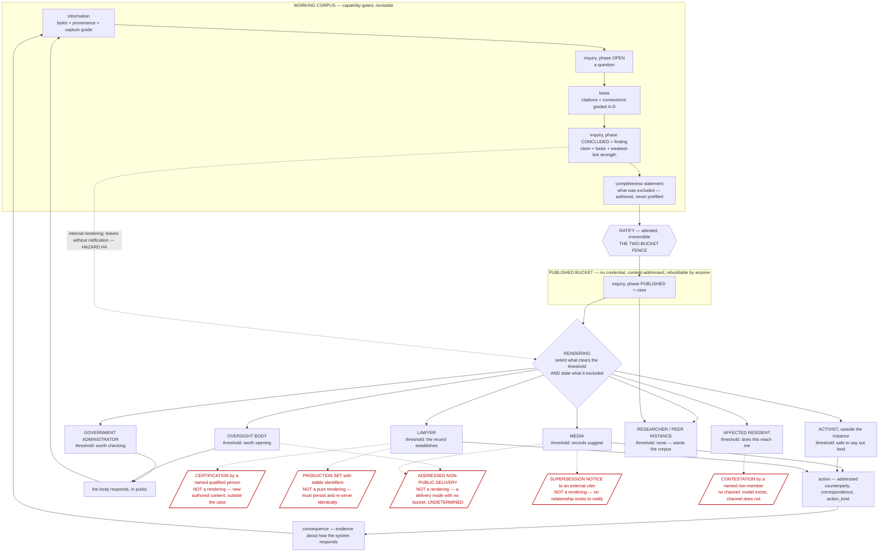

# Audiences: where the non-primary journeys diverge, and whether the divergence is a rendering

Written 2026-08-01 as a design pass for `architecture/BIO_Case_Making_v0_1.md` (D-127),
open question 2 (*"is a case ONE object with audience renderings, or several?"*) and
open question 7 (the administrator's fence). The PRIMARY archetype — a member of a
community accountability group — is covered by a separate pass and is deliberately not
re-derived here. This pass covers everybody else, and the question it exists to answer
is not "what does each audience want" but **"is the difference a rendering."**

**Evidence discipline, stated first.** Per CLAUDE.md and the convention
`PRACTICE-SURVEY.md` established, every claim below about what an audience needs is
tagged with where it comes from:

| tag | meaning |
| --- | --- |
| **[REPO]** | a document or a line of code in this repository, named |
| **[PRACTICE]** | a named external professional rule or convention. An OUTSIDE CLAIM, from my own knowledge and NOT verified against a primary source in this session. Treat every one as a lead to check, not as a measurement |
| **[ASSUMPTION]** | my inference. Labelled so it can be attacked. Not user research; **no user research exists for this project and none is invented here** |
| **`undetermined`** | I do not know, stated rather than guessed |

**What this pass does NOT contain, deliberately:** no per-audience suspicion attribute,
no adversarial role, no "government mode" with a different gate. Bad actors are real and
are identified BY EVIDENCE (CLAUDE.md; D-127(d) as corrected). Every audience below is
assumed to want better outcomes, and the design consequences are derived from what they
DO rather than from whose side they are on.

---

## 0 · The decision rule, fixed before looking at any audience

Otherwise "rendering" becomes a word that absorbs everything. A divergence is:

- a **RENDERING** if and only if its output is a pure function of `(case, threshold,
  format)` — a selection and a presentation over material the record already holds. No
  new authored words, no new facts, no state.
- a **THRESHOLD** if it is only a parameter to that function (the strength a claim must
  reach). A threshold is the *weak* form of divergence and the hypothesis's own example.
- a **PERMISSION** if it is the same material reached under different credentials. The
  repo already has this axis and it is not the audience axis: `NEEDS` in
  `bio-plane/src/index.mjs` gates on `contribute` / `publish` / `administer` / view, and
  `publishedmanifest` declares `classes: null` — no credential at all [REPO,
  `index.mjs`:287].
- a **DIFFERENT OBJECT** if producing it requires (i) content nobody has authored yet
  and no selection can derive, (ii) a claim of a different KIND, or (iii) state that must
  survive the act — an artifact rather than a view.

**The falsification target.** If any audience needs the case to have been AUTHORED
differently from the start — a different structure, a different claim type, a field the
other audiences' renderings could not be derived from — the hypothesis is dead and the
decomposition was wrong (`BIO_Case_Making_v0_1.md` §5 names exactly this test). Finding
that would be worth more than the whole rest of this document.

**The spine every audience shares**, from the collapse ruling
(`BIO_Case_Making_v0_1.md`, "THEY COLLAPSE"), so that "diverges" means something:

    information → inquiry OPEN → basis (graded connections) → inquiry CONCLUDED (finding,
    strength = weakest link) → completeness statement → RATIFY → inquiry PUBLISHED (case)
    → rendering → action → consequence → information

Divergence is measured against that spine and nothing else.

---

## 1 · MEDIA — reporting

### Journey

1. **Encounters the case** in the published bucket, with no credential. Already
   possible by construction: published material is content-addressed, its hashes public,
   and it is rebuildable "without the cooperation, permission, or continued existence of
   the instance it came from" [REPO, Membership v2 §8.2].
2. **Re-verifies rather than trusts.** Follows a citation to the CAPTURE first and the
   live URL second — an established scholarly and judicial convention, Perma.cc, claimed
   by 150+ law journals and the Law Library of Congress [REPO, `PRACTICE-SURVEY.md` §6];
   checks a hash; opens the bytes. U12's acceptance test is literally "reads the sewer
   case start to finish, checks a hash, and prints it whole" [REPO, `UI-PLAN.md` U12].
3. **Reads what was left out** before deciding whether to report it. The completeness
   statement is the field designed for this and the one thing no other tool in the survey
   offers [REPO, `PRACTICE-SURVEY.md`, "Where the survey found NO precedent"].
4. **Seeks the subject's response.** Right of reply, or at minimum a request for comment
   before publication [PRACTICE — widely documented newsroom norm; I have not verified a
   specific style guide in this session]. **This step happens entirely outside BIO and
   produces evidence BIO does not hold.**
5. **Chooses a verb at their own threshold** — "records suggest" is the example Bob gives
   [REPO, `BIO_Case_Making_v0_1.md` obs. 3] — and publishes in their own venue under
   their own editor.
6. **Carries the correction obligation forward.** If the case is later superseded, the
   published article is now wrong. A published hash answers forever [REPO,
   `BIO_Interaction_Constructs_v0_1.md`, ATTESTATION], and a superseded case leaves
   "everything that cited it needing re-evaluation" [REPO, `BIO_Case_Making_v0_1.md`,
   division §5] — but the article is not a citer the record knows about.

### What they need from a case

Independent verifiability without trusting us; the strength, so the verb is chosen and
not guessed; the exclusion statement; a stable citable address; and an attributable
publisher — which collides with cover/handle, see H3.

### What they do with it · success condition

They re-publish claims at their own threshold in a venue we do not control, adding
evidence we do not have. **Success is a story that is not retracted** — and the
BIO-side component of that is narrower and testable: *no claim in the story is stronger
than the claim the record supports.*

### Where this diverges

Steps 1–3 are the spine plus an existing permission. Step 5 is the threshold. Step 4
produces new `information` (a body's statement) at whatever grade its provenance earns —
no new object; D-72's grade D, "asserted with no captured basis, recorded as testimony
with an author", is exactly the shape for an on-the-record quote [REPO, `DEBT.md` D-72].
**Step 6 is the divergence that is not a rendering**: the record has no relationship with
an external citer and therefore no channel to tell them the ground moved. See H2.

---

## 2 · ACTIVISTS — fixing, and supporting when they can

**First, a split the frame hides.** "Activist" names two different positions, and the
repo already has the axis that separates them:

- an activist **inside** the instance is a member with `contribute` [REPO, Membership v2
  §5] — that is the PRIMARY archetype, and Bob's "supporting when they can" is that role;
- an activist **outside** the instance is a reader of the published bucket who acts.

Only the second is in scope here, and the distinction matters because most of what
looks like audience divergence turns out to be this inside/outside axis, which already
exists as a permission.

### Journey

1. **Finds the case** and asks the only question that matters to them: *what is the
   lever, and is the window open.*
2. **Locates the counterparty and the moment.** The `action` object already names
   `counterparty` and requires it non-empty [REPO, `bio-checks.mjs`:1291, C-2.10]; the
   civic obligation — the body's own declared duty and its clock — is D-128's flow model
   and is UNBUILT [REPO, `DEBT.md` D-128].
3. **Compresses the case to a speaking length.** Public comment at a local legislative
   body's open meeting is time-limited by the body, commonly to two or three minutes
   [PRACTICE — California's Brown Act requires the opportunity and permits the body to
   set the limit; not verified against the statute text in this session]. `public_comment`
   is already an `action_kind` in the catalogue [REPO, `bio-checks.mjs`:1288].
4. **Says it out loud, on the record, under interruption**, where a claim that outruns
   its support is corrected in the room and costs the group its next hearing
   [ASSUMPTION — plausible and untested; nothing in the repo measures it].
5. **Files the instrument** — a records request, a complaint, an appeal.
   `cpra_request` is in the same catalogue line.
6. **Brings back what came of it**, which is new evidence about how the system responds
   — the consequence half of the loop D-127(b) names as unbuilt.

### What they need · what they do · success condition

They need the shortest true form of the case, the deadline, the named counterparty, and
a defensible floor rather than a ceiling — the claim that survives being repeated by
someone who is not the author. **Success is a change in the world**, not a published
artifact, and it is the only audience whose success condition BIO cannot observe from
inside itself.

### Where this diverges

The compression is a rendering (selection + format) with a sharp hazard attached (H5).
The window, the counterparty and the instrument are NOT case properties at all — they
belong to `action` and to the D-128 flow model, both audience-independent objects that
already exist or are already scheduled. **So the activist's divergence is almost entirely
"the case is not their unit of work; the action is."** That does not falsify the
hypothesis; it says the rendering is not what they came for.

---

## 3 · GOVERNMENT ADMINISTRATORS — understanding, tracking, adjusting, responding

Treated at length in §5, because they can be the SUBJECT and the USER at once. The
journey here is the reader's; §5 is the operator's.

### Journey (administrator as reader of someone else's case)

1. **Receives or finds a case about their own body.** They may learn of it from the
   publication, from a records request, or from a letter — an `action` with them as
   `counterparty`.
2. **Asks a triage question no other audience asks: is this OURS to fix, and is it
   already known.** [ASSUMPTION — inferred from Bob's verbs "tracking, adjusting,
   responding"; no user research supports it.]
3. **Acts on a lower threshold than anyone else.** "Worth checking" is Bob's example
   [REPO, `BIO_Case_Making_v0_1.md` obs. 3], and it is coherent: opening an internal
   review is cheap and reversible, where publishing and pleading are not.
4. **Checks the case against material only they hold** — the unpublished half, the
   system of record, the thing the requester never got.
5. **Responds, in public**, because their response is itself an official act. This is the
   step that closes D-127(b)'s loop, and see below for where it travels.
6. **Adjusts something** — a process, a deadline, a form — which is the outcome the whole
   project is aimed at ("the objective is BETTER GOVERNMENT", CLAUDE.md).
7. **Tracks whether the adjustment worked**, which is a declared-versus-observed flow
   measurement on their own institution — D-128 pointed inward.

### What they need · success condition

They need the finding at low threshold WITH its strength visible so a thin claim is not
actioned as a strong one; they need what was excluded, because the excluded material is
often the part they can check; and they need to know which of their own levers the case
names. **Success is a corrected process that stays corrected** — observable, in
principle, as the delta closing.

### Where this diverges — and the cross-instance answer

`controller_referral` and `public_comment` are already in the action-kind suite [REPO,
`bio-checks.mjs`:1288], so the vocabulary anticipates them.

The interesting divergence is step 5. **An administrator responding to a community
group's case is an interaction between two instances, and the architecture explicitly has
no cross-group construct** — "Not a network construct… nothing here crosses a group
boundary" [REPO, Membership v2 §2]. Naively, this looks like it needs one: a reply
channel, a comment, a shared thread.

It does not, and the resolution is worth stating because it is load-bearing. The loop
closes **through the published record**: the group publishes, the administrator responds
publicly, the group CAPTURES the response as ordinary `information` with its own
provenance, and a new inquiry cites both. No new object, no new channel, no hierarchy —
and the response arrives graded by how it was obtained rather than by who sent it, which
is the no-structural-prior rule surviving contact with the one actor most tempting to
give a special channel to.

---

## 4 · LAWYERS — supporting a claim, or CHANGING a claim

The audience that breaks the hypothesis, in a specific and useful way.

### Journey

1. **Intake.** Does the record support the ELEMENTS of a cause of action — each of
   which must be independently established [PRACTICE — the element structure of a legal
   claim is elementary and general; no specific source consulted].
2. **Maps findings onto elements.** This is a new set of claims ("the record establishes
   element 2"), and each is itself an inquiry citing the case as basis. **The recursion
   already handles it**, including the strength consequence: "a case built on a case
   cannot be stronger than the case beneath it" [REPO, `BIO_Case_Making_v0_1.md`,
   division §5]. A hole in element 3 is then visible as the weakest link, which is
   precisely what an intake decision needs.
3. **Tests admissibility and authentication.** US federal practice added FRE 902(13) and
   902(14) effective 2017: an electronic record or data copied from a device may be
   self-authenticating where a process of digital identification — a hash comparison —
   is shown **by a certification of a qualified person** [PRACTICE — from my own
   knowledge; NOT verified against the rule text or the advisory notes in this session,
   and a session that builds on it must check it]. BIO's hash-anchored chain is unusually
   well shaped for the first half. **The second half is a named human swearing to it.**
4. **Preserves.** Once litigation is reasonably anticipated a duty to preserve attaches
   [PRACTICE — the Zubulake line and FRCP 37(e) for lost electronically stored
   information; same caveat as above]. Append-only and content-addressed storage is close
   to ideal here; a selective-deletion feature is the opposite (H1).
5. **Produces.** Bates numbering, redaction, slipsheets, endorsements, load files —
   "producing is a distinct heavy step with its own settings" [REPO, `PRACTICE-SURVEY.md`
   §3, from Relativity's own material].
6. **Or CHANGES a claim** — refutes the case, or narrows it. What they need for that is
   what the case rests on and what would falsify it, which D-127 already requires the
   case to state. **The refuting rendering is the same rendering**, and it must not be
   weaker for an opposing party; making it so would be a structural prior wearing a
   protective coat.

### What they need · success condition

Custody answerable without reconstruction; strength at the "establishes" threshold with
`undetermined` surviving rather than averaged into a confidence score [REPO,
`PRACTICE-SURVEY.md` VIOLATE-3]; an authenticatable artifact; and a production format.
**Success is a claim that survives challenge** — including the challenge that the
evidence is inadmissible, which is separate from whether it is true.

### Where this diverges — TWO things that are not renderings

- **The certification (step 3).** A rendering is a function of the case. A declaration
  by a qualified person is new authored content by a NAMED human, tying a legal identity
  to a record whose author may be a `handle` deliberately not paired to a civil identity
  [REPO, Membership v2 §3: only administrators see cover and handle together, and
  publishing the pairing is a per-member decision]. **No selection over the case can
  produce it.** It is a new object adjacent to the case — call it a custodian
  attestation — and the system does not have one.
- **The production set (step 5).** A Bates-stamped set is a rendering that acquires its
  own identity: once produced and served, it must re-serve identically forever, and the
  numbering must never be re-issued differently. **A rendering that must persist is an
  artifact, not a view.** This generalises past lawyers — see §6, which is the pass's
  main structural result.

---

## 5 · THE ADMINISTRATOR AS SUBJECT AND USER — what the fence protects, and from whom

D-127 open question 7, and `PROCESS-INVENTORY.md` §5 records it as "the ONLY
audience-specific unknown that is not simply 'build the finding'" [REPO]. Answered here
as far as the repo grounds it, with the residue marked `undetermined`.

**The starting fact.** The fence is not what a first reading assumes. Membership v2 §2 is
explicit: membership is **not a security boundary**; "the load-bearing fence is between
the working corpus and the published record: two buckets, and the published projection
has never held unratified material." So the fence's guarantee has always run in ONE
direction — it keeps unratified material OUT of the published bucket. It was never a
promise that the working corpus is safe.

### What the fence protects in an administrator's instance — four answers

1. **It protects the reader from the publisher, and the publisher is now the body
   itself.** Unchanged mechanism, much higher energy. In a community group's instance an
   unratified note reads as a volunteer's guess; **in the body's instance it reads as the
   body's position, because the letterhead is real.** Ratification is what keeps "an
   analyst wondered" from being "the City found". This is the fence doing MORE work here,
   not less.
2. **It protects third parties named in the working corpus.** An administrator's
   material is dense in residents, complainants and employees. Nothing about the fence
   changes; the population behind it does, and the cost of a leak across it is a privacy
   harm to someone who never chose to be in the record.
3. **It does NOT protect the working corpus from compelled disclosure.** A public body's
   working files are reachable by records law and by discovery in a way a private group's
   are not [PRACTICE — jurisdiction-specific and genuinely contested at the edges; the
   deliberative-process question in California is judicial rather than statutory, and
   this pass does not resolve it]. **The interface obligation §2 already states —
   "Interfaces must not imply otherwise, because a member who believes projects are
   private will put things in the working record that should not be there" — is the same
   rule with a legal multiplier.** For an administrator instance it is the single most
   important sentence in the membership architecture.
4. **It does not, and cannot, protect against the custodian being the subject.** This is
   the real asymmetry. In a community group's instance the subject of an inquiry cannot
   reach the record. In the body's own instance **the subject IS the custodian** — the
   same organisation holds the hosting account, the root of trust, and the material about
   itself.

### What answers (4), and it is already built

Only §8.2: published material is content-addressed and reconstructible by anyone,
"without the cooperation, permission, or continued existence of the instance it came
from." **So for an administrator instance, ratification is not merely the publication
boundary — it is the only act whose result the custodian cannot later revise.** Everything
on the working side is revisable by an organisation that is also the subject. That is not
a defect to fix; it is the honest limit §8.1 already states for the captured-root case,
arriving by a different route.

### What changes, and what must not

**Changes:** the population behind the fence (third-party personal data); the legal
reachability of the protected side; how unratified material READS (official by default);
and the value of ratification, which becomes the sole guarantee rather than one of
several.

**Does not change:** the fence's mechanism, the gate, the checks, the capability model,
the case object, or the strength computation.

**Must not change, and this is the hard constraint:** there must be no administrator
build with a relaxed gate, a "government mode", or a different `C-` catalogue. A
per-audience relaxation is a structural prior by role — the same defect as a suspicion
flag, with the sign reversed. If administrators need a lower threshold, that is a
threshold on a RENDERING, and it must never be a threshold on RATIFICATION.

**`undetermined`, stated:** whether a public body may lawfully operate an instance whose
working corpus it intends to keep unpublished is a legal question this pass cannot
answer, and it is the question an administrator's counsel will ask first. Nothing in the
repo addresses it. `SOURCE-ACCESS.md` records Bob already consulting journalists and
lawyers on an adjacent question [REPO]; this belongs on the same list.

---

## 6 · Additional audiences, each with its justification

Bob's list is explicitly open. Four proposed, each grounded rather than imagined, plus
one declined.

**A · OVERSIGHT BODIES WITH COMPULSORY POWERS** — auditors, controllers, inspectors
general, grand juries. **Justification is in the code, not in my head:** `grand_jury` and
`controller_referral` are already two of the seven `action_kind` values [REPO,
`bio-checks.mjs`:1288]. Journey: receive a referral → decide whether to open → obtain
what we could not, because they can compel → conclude → publish or refer on. Their
threshold is "worth opening", between the administrator's and the lawyer's. **Their
divergence that is not a rendering: a referral may need to be non-public**, and a case
delivered to exactly one recipient without publication has no bucket. See §7.

**B · DIRECTLY AFFECTED RESIDENTS** — the person whose sewer bill it is. Justification:
U12's acceptance test is a member of the public reading the sewer case [REPO], and
CLAUDE.md's verb is "responding to the communities they serve". Journey: encounter →
*does this reach me* → *what do I do* → act or not. Their need is an index over the
published bucket keyed to their own situation — a retrieval and rendering axis, cheap.
**Their divergence that is not a rendering: a named individual who believes a published
claim about them is wrong has no channel to say so**, and a published hash answers
forever. The candidate resolution needs no new object — capture the contestation as
`information`, open an inquiry citing it, supersede if warranted — and the doorbell shape
already exists in the plane (`knock` / `inbox` / `inboxget` / `inboxresolve`, all
currently unreachable) [REPO, `PROCESS-INVENTORY.md` §4]. What is missing is the channel,
not the model.

**C · RESEARCHERS AND PEER INSTANCES** — included partly as a control. Justification:
§8.2 grants exactly this to "any member, or any stranger", and Design Requirement 1 makes
peers first-class. **This is the audience whose entire need is already met by an existing
permission**, which is itself evidence for the inside/outside claim in §2. One real
`undetermined`: when instance B cites instance A's published case as basis, B can verify
A's BYTES and cannot re-derive A's working corpus, so **how strength composes across an
instance boundary is unanswered.** The weakest-link rule says B inherits A's strength;
nothing says what grade B's own citation of A carries.

**D · THE PUBLISHER'S OWN FUTURE MEMBERS** — the audience the record is for in five
years. Justification: D-81's dead-end rule ("what makes the next member's work cheaper")
and the ruling that a published case is an INPUT and not a terminus [REPO]. Their need is
the one the tool is least tempted to serve and it costs nothing extra.

**DECLINED · FUNDERS.** Nothing in the repo grounds them, and their characteristic need —
impact reporting — is the compellingness axis `BIO_Case_Making_v0_1.md` §4a rules out.
Naming them as an audience would import an optimisation the doctrine forbids. Recorded so
the omission is a decision rather than an oversight.

---

## 7 · The diagram: the shared spine and where each audience leaves it

Read it this way: **everything on the solid path is one object and one spine.** The five
red parallelograms are the whole of what this pass found that a rendering cannot produce,
and §8 classifies each.

---

## 8 · THE TEST APPLIED

Every divergence found above, against the §0 rule. Sorted so the interesting rows are
last.

| # | divergence | audience | verdict | reasoning |
| --- | --- | --- | --- | --- |
| 1 | verb strength: suggest / worth checking / establishes | all | **THRESHOLD** | a parameter to the selection. Bob's own example, and it holds |
| 2 | which claims appear | all | **RENDERING** | pure selection over the basis chain |
| 3 | exclusion statement shown | all | **RENDERING** | already an authored field; the rendering must show it, and showing it is not optional for anyone |
| 4 | reading without an account | media, resident, researcher, peer | **PERMISSION, already built** | `publishedmanifest` `classes: null`; §8.2. This is the inside/outside axis, not the audience axis |
| 5 | print / full narrative / one-page brief / two-minute script | all | **RENDERING** | format. U12 already treats print as first-class |
| 6 | index keyed to the reader's own situation | resident | **RENDERING + retrieval** | a query over the published bucket; no case change |
| 7 | mapping findings onto legal elements | lawyer | **SAME OBJECT, new instance of it** | each element claim is an inquiry citing the case. Recursion already does it, and strength inherits. **This was the hypothesis's hardest test and it passed** |
| 8 | administrator using their own body's material | administrator | **DEPLOYMENT CONTEXT** | not a rendering and not a case change. What moves is the population behind the fence and the legal reach of it — see §5 |
| 9 | administrator's public response reaching the publisher | administrator, oversight | **NO NEW OBJECT** | captured as ordinary `information`; the loop closes through the published bucket rather than through a cross-instance channel that Membership v2 §2 forbids |
| 10 | the deadline, the counterparty, the instrument | activist | **A DIFFERENT OBJECT THAT ALREADY EXISTS** | `action` + D-128's flow model. Not a case property. The activist's unit of work is not the case |
| 11 | refuting the case | lawyer | **THE SAME RENDERING** | what it rests on and what would falsify it are already required. Weakening it for an opposing party would be a structural prior |
| 12 | **certification by a named qualified person** | lawyer | **DIFFERENT OBJECT** | new authored content, by a human whose civil identity the record deliberately does not hold (Membership v2 §3). No selection produces it |
| 13 | **a production set with stable identifiers** | lawyer | **NOT A PURE RENDERING** | it must persist and re-serve identically. A rendering with state is an artifact |
| 14 | **addressed non-public delivery** (confidential referral; pre-publication briefing) | oversight, media, administrator | **`undetermined` — delivery mode, and there are only two buckets** | see below |
| 15 | **supersession notice to an external citer** | media, peer | **NOT A RENDERING** | there is no relationship to notify. A missing channel, not a missing view |
| 16 | **contestation by a named non-member** | resident | **NOT A RENDERING; model exists, channel does not** | capture → inquiry → supersede covers the model; the doorbell shape exists and is unreachable |
| 17 | strength composing across an instance boundary | peer, researcher | **`undetermined`** | weakest-link says the strength inherits; nothing says what grade a cross-instance citation carries |

### The three that matter, examined properly

**Row 12 — the certification.** This is the closest thing in the pass to a falsifier, and
it stops short. It does not show that lawyers need a different CASE; it shows they need
something the case is not and never was: a human being's sworn statement. The case
supplies the hash chain, which is the hard, technical half of FRE 902(14)'s digital
identification [PRACTICE, unverified]. The declarant is the other half and belongs to the
world. **What it does falsify is the sufficiency of "rendering" as a complete account of
audience difference.**

**Row 13 — the persistent rendering.** Once a rendering is served to someone who acts on
it, it stops being a view. A journalist quotes "the case as of 3 August"; a lawyer serves
a numbered production; a referral is sent. Each becomes a thing the world relies on, and
the record's own doctrine about published hashes applies to it: what left must be
re-servable. **Renderings that leave the building become records.** This is Bob's own
observation arriving from the other direction — *"'Output' is a noun and also a verb"*
[REPO, `BIO_Case_Making_v0_1.md`] — and it is the pass's main structural result: **the
rendering has a noun, and the noun needs a hash, a date, and an author.**

**Row 14 — the delivery with no bucket.** The fence has exactly two sides: working and
published. A case sent to one recipient and not published is on neither. Two candidate
resolutions, and I am not choosing between them here because the choice is Bob's:

- **It is an `action`.** The referral is outward-facing engagement with a `counterparty`
  and `## Correspondence`; `controller_referral` is already a legal `action_kind`. The
  rendering is what the correspondence carried, and it gets hashed and recorded as such.
  **No third bucket, and it composes with rows 12 and 13** — which is why I lean this way.
- **It is a third bucket** — released-but-not-public. This is the expensive answer, and
  if it is the right one then the two-bucket fence is a two-bucket fence by accident of
  never having had this audience.

The cost of getting it wrong is asymmetric and worth stating: if it is an `action` and we
build a bucket, we have built a place for unratified material to accumulate outside the
gate.

### VERDICT

**The hypothesis survives in its strong form — one case object, audience-shaped
renderings — and no audience in this pass needed a different case type.** The two tests
most likely to break it both resolved into mechanisms that already exist: the lawyer's
element map is recursion (row 7), and the administrator's own-instance use is a
deployment context, not a model change (row 8). The falsification target §0 set — an
audience needing the case AUTHORED differently from the start — was not hit by any of
eight audiences.

**It fails as a complete account of divergence, and that failure is the useful part.**
Three divergences (rows 12, 13, 14, with 15 and 16 as milder relatives) are not
selections over a case at any threshold. Every one of them is a property of the OUTPUT
ACT rather than of the case: who certifies it, whether it persists, and to whom it is
delivered. That is exactly the gap D-127 observation 2 already named — *"what is missing
is not the object but its CONNECTIONS"* — reached independently from the audience side,
and it says where the work goes: **`action` is the home of audience divergence, not
`case`.**

**The falsifiable restatement**, replacing the original:

> A case is one object. An audience's THRESHOLD is a rendering parameter and its FORMAT
> is a rendering. What is NOT a rendering is the act of outputting to that audience —
> the certification, the persistence, and the addressing — and that act is an `action`.
> If the second audience built costs a new `action_kind` and a rendering, this is right.
> If it costs a field on the case, it is wrong.

---

## 9 · Cross-audience hazards — where one audience's need damages another's guarantee

Each is stated as a defect-if-built-naively, with the guarantee it breaks named.

**H1 · Selective deletion.** An administrator holding residents' personal data, and a
resident exercising a privacy right, both want material REMOVED. A lawyer's audience
needs the opposite: once litigation is reasonably anticipated, destroying evidence is
spoliation [PRACTICE, unverified]. And the record's whole product is append-only
trustworthiness. Today the only destructive op is `purge`, admin/probe class, refusing
unless the caller names the store it resolved to [REPO, `index.mjs`:358, :1247] — an
operator tool, not a member feature. **Building a member-facing redaction that quietly
rewrites is the single most dangerous feature in this document.** If it must exist, it
must be an authored, attested, visible act that leaves a hole with a name on it — the
same shape as the exclusion statement. **And it cannot reach the published bucket at
all**, which is not a policy choice: §8.2 material is already reconstructible by
strangers, so a published redaction would be a promise the architecture cannot keep.

**H2 · The correction that cannot travel.** Media and peer instances rely on a case; the
case is superseded; the record has no relationship with them and cannot say so. Naive
fix: a subscriber list on a published case. That inverts §8.2's guarantee — the published
bucket is readable with no credential and therefore no identity, and requiring one to
receive corrections would make anonymous reading second-class. **The shape that does not
break it: supersession is a property of the published record itself, discoverable by
anyone who re-resolves the case's address, exactly as a citation resolves to the capture
first.** Pull, not push.

**H3 · The identity a legal rendering wants, and the pseudonymity a group needs.**
Row 12 wants a named declarant. Membership v2 §3 exists so that "a group operating under
pressure should choose covers that do not resolve to civil identities", and whether a
cover↔handle pairing is published is a per-member decision. **The naive build is a
"verified author" badge on a rendering** — and its damage is subtle: it makes a
pseudonymous group's case LOOK weaker without being weaker, which is a structural prior
against a class of publisher, arriving through the front door as a feature. The
non-damaging shape: identity disclosure is a separate authored act attached to a specific
output, never a property of the case and never a component of strength.

**H4 · The low-threshold rendering that escapes.** An administrator's "worth checking"
rendering is a file. Files get forwarded. The moment one reaches a journalist, BIO has
produced an under-supported artifact carrying its own apparent authority. **Therefore the
threshold and the exclusions must travel IN-BAND, inside the artifact, in every rendering
without exception** — an audience selector that emits a clean-looking brief is the
compellingness optimisation §4a forbids, implemented by accident. This is also why the
threshold must never be a parameter on ratification (§5).

**H5 · Compression.** A two-minute public-comment rendering and a print case file cannot
both be faithful in the same way. Compression is exactly where a hedge gets dropped and
"records suggest" becomes "the city did". **The rendering must be permitted to drop
CLAIMS and never permitted to drop QUALIFIERS**, and the shortest form should be the
strongest claims stated in full rather than all claims stated briefly. That is a rule a
suite can check.

**H6 · The embargo.** A newsroom wants pre-publication access; a group wants the story
placed. That is unratified material crossing the fence — row 14 wearing a friendlier
name, and the reason row 14 must be settled rather than left to the first session that
needs it.

**H7 · The administrator's special channel.** Giving the subject a reply affordance
inside the publisher's instance would put the subject inside the workspace, and
Membership v2 §2 already forbids the network construct it would require. The answer in
§3 — response captured as ordinary information — is not a workaround; it is the design.

**H8 · Bulk access and re-identification.** Researchers and peers want the corpus in
bulk, which §8.2 already grants. Whether aggregate analysis across many instances could
re-identify pseudonymous handles by timing or style is **[ASSUMPTION, and a weak one — I
have no evidence for it and it should not be designed against until someone does]**.
Recorded only so a later session does not mistake silence for clearance.

---

## 10 · Summary

1. **MEDIA** — verify without trusting us, read the exclusions, choose a verb at
   "records suggest", publish elsewhere; success is a story not retracted; the one thing
   we owe them that we cannot give is a correction that travels (H2).
2. **ACTIVISTS (outside the instance)** — want the lever, the window and the shortest
   true form; success is a change in the world, which we cannot observe; their unit of
   work is `action`, not `case`.
3. **GOVERNMENT ADMINISTRATORS** — act at "worth checking", check the case against
   material only they hold, respond publicly, adjust, and measure whether it stayed
   fixed; the response returns to us as ordinary captured evidence, not through a channel.
4. **LAWYERS** — map findings onto elements as new inquiries citing the case, need
   custody answerable and `undetermined` unsmoothed; success is a claim that survives
   challenge; they need two things a rendering cannot make.
5. **OVERSIGHT BODIES** — already in the code as `grand_jury` and `controller_referral`;
   threshold "worth opening"; their referral may need to be delivered without being
   published, and that has no bucket.
6. **AFFECTED RESIDENTS** — need the published record indexed to their own situation;
   a named individual contesting a published claim has a model and no channel.
7. **RESEARCHERS AND PEER INSTANCES** — entirely served already by §8.2, which is the
   control case proving most "audience difference" is the inside/outside permission axis.
8. **THE PUBLISHER'S OWN FUTURE MEMBERS** — the cheapest audience and the one the tool
   is least tempted to serve; D-81's dead ends are for them. (Funders declined: their
   need is compellingness, which the doctrine forbids.)
9. **THE HYPOTHESIS SURVIVES IN ITS STRONG FORM.** One case object, eight audiences, no
   audience needing a different case type — and the two hardest tests, the lawyer's
   element map and the administrator's own instance, both resolved into mechanisms that
   already exist (recursion; deployment context).
10. **IT FAILS AS A COMPLETE ACCOUNT**, and that is the finding: the certification, the
    persistence of a served rendering, and the addressed non-public delivery are not
    selections over a case at any threshold.
11. **ALL THREE ARE PROPERTIES OF THE OUTPUT ACT, NOT OF THE CASE** — which is Bob's
    "output is a noun and also a verb" reached from the audience side, and D-127
    observation 2's "what is missing is not the object but its CONNECTIONS" reached
    independently. **Audience divergence lives in `action`, not in `case`.**
12. **THE TEST TO KEEP:** when the second audience is built, it should cost an
    `action_kind` and a rendering. If it costs a field on the case, this pass was wrong.
