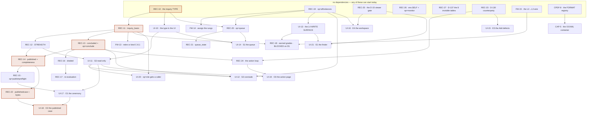

# BUILD-ORDER — where bottom-up and top-down meet, and what to build next

Written 2026-08-01 (research pass, Round C). This file **reconciles** the bottom-up
view (`DATA-MODEL.md`, `LAYERS.md`, `PROCESS-CATALOGUE.md`, `CAPABILITIES.md`,
`MACHINE-PROCESSES.md`, `DEBT.md`) against the top-down view (the ten storyboards in
`SB-CORE.md`, `SB-EVIDENCE.md`, `SB-OUTPUT.md`, plus `JOURNEY-PRIMARY.md`,
`AUDIENCES.md`, `UI-BASELINE.md`) and turns the result into a sequenced order CONDUCT
can queue.

It changes no code and edits no other file. Part 2's items are written in `QUEUE.md`'s
exact item format so they can be moved across without reshaping.

**Three things this file had to check rather than take, and what checking found, are in
§1.6.** Two of the three survived; one did not survive in its literal form and is
restated.

---

## 0 · Method, and the two claims everything rests on

**Bottom-up** means: start from what is in `schema.mjs` and running in the Durable
Object, and ask what can be built on top of it in what order, each step landing
something a member or a machine can actually reach.

**Top-down** means: start from each of the ten storyboarded surfaces and ask what must
exist beneath it — which tables, which ops, which checks, which processes.

**They meet** when every surface requirement resolves to a bottom-up step, and every
bottom-up step serves a surface. Two failure modes are findings in their own right:

- a **surface that rests on nothing** — a storyboard whose requirement has no
  bottom-up step and no path to one. Named as a HOLE in §1.4.
- a **step that serves nothing** — built machinery with no consumer. Named as
  SPECULATIVE or STARVED in §1.5.

Two measured claims carry most of the weight below, and both are quoted from the
research rather than asserted here:

1. **`LAYERS.md:475-476, :527` — the missing layer is not at the top.** *"the ladder is
   ordered bottom-up through the layer stack, and the missing layer is L7, which is not
   at the top of the stack — it sits beside L6 on the L5 spine. A rung for it depends on
   nothing that is unbuilt."* And: *"Treating case-making as the last rung is the single
   most expensive misreading available, because it makes the one unblocked high-value
   layer look blocked."*
2. **`SB-CORE.md:1625-1634` / `PROCESS-CATALOGUE.md:518-520` — the type is one node with
   eleven-process fan-out.** *"Eleven of the twelve inquiry processes hang off one node
   that is not a process: the TYPE… **This is a schema change, not eleven features**, and
   it is the single highest-fan-out unbuilt thing in the catalogue."*

Verified in source this pass, because both claims turn on it:

    grep -ac inquiry bio-plane/src/store.mjs bio-plane/src/index.mjs \
                     bio-plane/checks/bio-checks.mjs civicos-ui/app.html
    → 0, 0, 0, 0

---

# PART 1 — RECONCILIATION

## 1.1 Bottom-up: the layer stack, and where the frontier actually is

`LAYERS.md` names nine positions. Status is its measurement, not this file's:

| | layer | state | owner area |
| --- | --- | --- | --- |
| L0 | PLATFORM | complete; installer ships one Worker, topology is now a fleet (D-115) | DIST |
| L1 | BYTES | **the most complete layer in the system** | CAPTURE |
| L2 | STRUCTURE | one producer live (PDF Tier 1 + Tier 2); HTML dormant; **`pdf-worker` undeployed** | CONTENT-PDF |
| L3 | CONTENT | built; exactly ONE real content type (`meeting_calendar`); **cannot read a PDF at all** | FRAMEWORK |
| L4 | INTENT | **fully built** — 10 tables, 10 write ops, 11 read ops, 2 scheduler consumers | FRAMEWORK |
| L5 | RECORD (a spine, not a rung) | built; sole write authority; I5 STABLE 1.8.0 | RECORD |
| L6 | RETRIEVAL | built inside its declared scope; blind two ways | RECORD |
| **L7** | **CLAIM / INQUIRY** | **DOES NOT EXIST. Owner: NONE** | **none** |
| L8 | SURFACES | partial — 33 of 94 member-reachable ops reached | UI, DIST |

The bottom-up reading that matters: **L7 consumes L5 and nothing else.** L5 ships
entirely. So the frontier is not the top of the stack — it is a column beside L6 that
has never been started, and it is reachable today.

Three serial chains exist below L7, and only one of them is long:

    L1 bytes → L2 PDF text → [MISSING WIRE] → L3 PDF readings → L4 entities for PDFs
    L4 write ops → [NO SURFACE] → the registry has content → L4 grades mean something
    L5 spine → L7 claim → L8 case surfaces

The first is `LAYERS.md`'s GAP 3 and it is short but load-bearing: *"the entire intent
layer runs on HTML pages only."* CPDF-4 and CPDF-6 extract PDF text and **nothing
carries it into `docprofile`**, so a captured agenda packet gets structure and never
gets a reading, never gets `reading_refs`, and therefore never reaches the entity axis.
The documents the whole capture arc exists for are the ones L4 cannot see.

### The bottom-up steps, in the order the substrate permits

Each is one worker's work. `→` names what it makes possible.

| # | step | rests on | → makes possible |
| --- | --- | --- | --- |
| B1 | the `inquiry` TYPE: `OBJECT_TYPES.INQ`, `STATES.inquiry` at `open`+triage exits, `HEADINGS.inquiry`, the `INQ-` prefix, `inquiry@1`, normalisation at all four mapping sites | L5 only | B2–B7, S3, O1, O2 |
| B2 | `inquiry_basis` + `basis[]` projected at `op=promote` + C-6.3 rewritten | B1 | strength, conclude, division, "which inquiries rest on this document" |
| B3 | strength derived on read over `inquiry_basis` (reuses `#weakerGrade` unchanged) + 3 projection columns + `FIELDS` entries | B2 | **L4's A–D grades get their first consumer above them** |
| B4 | the `concluded` state + its entry requirements + `op=conclude` | B2 | the finding phase; O1 has something to publish |
| B5 | the `published` state + `completeness{}` + `inquiry_exclusions` + C-21.1 + C-21.2 + strength frozen into the ratified bytes | B3, B4 | **`op=ratify` gets its first claim-level caller**; O1, O2 |
| B6 | the `divided` state + `op=inquirydivide` + `supersedes` gains requirements in C-6.1 | B4 | division; `supersedes` gets its first producer |
| B7 | the re-evaluation cascade (P-64) on supersession, over the existing `reeval_flag`/`reeval_since`/`reeval_source` columns | B6 | R7's obligation; S3-I11 |
| B8 | `op=affordances` — publish `NEEDS`, the legal-edge table, the set-application `weight`, and `rung` (null where undeclared) | L5 only | S1, S2, and the honest-options half of S3/S5/S6/S10 |
| B9 | `op=queue` — the item contract with `class` and `case` | B1 (so `case` can be an `INQ-`), B8 | S1 |
| B10 | the L2→L3 wire: PDF text enters `docprofile` and produces a reading | L2, L3 | PDFs reach the entity axis at all |
| B11 | a WRITE SURFACE for L4's nine unreachable ops | L4 (built), L8 | the registry has content; earned basis grades become possible |
| B12 | earned basis grades (`grade_source: 'resolution'`, A/B/C from `resolutions`; testimony admitted only at D) | B2, B11, and a Bob ruling on D1 | strength means something above grade D |
| B13 | `op=publishedcase` + `op=publishedbytes` + `published_edges` | B5 | O2 |
| B14 | the `action` loop: three-valued `counterparty`, `action_basis`, `correspondence`, `op=actionmove`, `op=actioncorrespond`, derive-on-read clock | B4 (a finding to rest on) | O3, and D-128's delta measured on our own intervention |

## 1.2 Top-down: the ten surfaces and what each requires

Surface ids are the storyboards' own. **Existence** is `UI-BASELINE.md`'s measurement.

| surface | exists today | requires beneath it | resolves to |
| --- | --- | --- | --- |
| **S1 QUEUE** (`SB-CORE` §1, 15 states) | as **three** screens — UI-8 home, UI-1 tasks, UI-5 proposals (JG-10) | `tasks`+`proposals` (exist); an item `class` (FINDING/OBLIGATION/CONDITION) and a `case` grouping key — **neither is data** (D-140); producer-published `options[]` (GAP-Q2); `queue_state` for mute/snooze; the relevance filter P-88 (DEC-10, RULED, MISSING); the ageing job P-85 (MISSING) | B8, B9, B1 · **HOLE-1** (CONDITION has no carrier) |
| **S2 THE ACT** (`SB-CORE` §2, 15 states) | four instances shipped (UI-2 dispose, UI-3 ballot, UI-5 proposal, UI-6 attest) — the construct is confirmed | producer-published option + rung + application mode (GAP-A1/A2); `NEEDS` published (GAP-A3, F-9); the legality table exported so pre-flight stops being a **third** copy (GAP-A4, V4); a `per-item` application weight (GAP-A5) | B8 · **HOLE-2** (`per-item` weight) |
| **S3 INQUIRY PAGE** (`SB-CORE` §3, 16 states) | **no** | the `inquiry` type (GAP-I1); basis recursion (GAP-I2); strength at inquiry altitude (GAP-I3); `op=conclude` (GAP-I5); `op=inquirydivide` (GAP-I4); completeness (GAP-I6); inheritance rule (GAP-I7); `op=cite` given a caller (GAP-I11 / JG-4 / U9) | B1, B2, B3, B4, B5, B6, B7 · **HOLE-3** (contradiction inside one inquiry, GAP-I9/D-80, *not designed*) |
| **E1 EVIDENCE FINDER** (`SB-EVIDENCE` §1, 13 states) | partial (U2 search) | `op=searchfields` consumed instead of hand-composed literals; the D-15 viewer gate on `op=list` (F-8/D-135/D-142); `op=selection` for the lease; `op=cite`; **the intent axis projected into `FIELDS`** — today there is no `entity`, no `grade`, no `connection`, no `progression`, no `phase` | B2, B8, B11 · **HOLE-4** (the projection is unresolved: multi-value column vs join table) |
| **E2 DOCUMENT PAGE** (`SB-EVIDENCE` §2, 11 states) | **the most complete surface in the system** | a plane-side gated backlink read (replacing `reverseRefs`, D-141); "**which inquiries rest on this document**" (D-k) — *stated as blocked, not faked*; callers for `retire`/`sever`/`reinstate`/`cite`/`sourcereach`/`monitor`/`pdfstructure`; the UNDETERMINED primitive for `action` states | B1, B2, B10, and the M1 monitor wiring |
| **E3 ADD** (`SB-EVIDENCE` §3, 11 states) | shipped (U8), **carrying the two worst live defects in the member UI** | `ADD_TICKS` defined (D-132 — the ceilinged path throws a raw `ReferenceError`); one declaration each of `heldMatch`/`addCapture` (D-133); `project` absent without `create_projects` (F-6); the three `mdFor` placeholder literals deleted (D-130); the member-facing vocabulary becoming inquiry/finding/case (A-f, *blocked on JG-1*) | B1, B8, plus a defect batch |
| **E4 PROJECT WORKSPACE** (`SB-EVIDENCE` §4, 11 states) | **no** — "Projects" is `renderFiltered` over an already-loaded `op=list` | the seven unreached `project*` ops given a call site; the ballot dialog given its **missing call site** (D-134); the three D-15 visibility positions actually enforced (F-8); `objective`/`workproduct_state`/`evaluations[]` displayed; **and nothing about what is true** | B8, plus the D-15 gate fix. **DEC-10 makes this load-bearing for S1**: the queue groups by case and the project id is the aggregation key |
| **O1 PUBLICATION CEREMONY** (`SB-OUTPUT` §2, 16 states) | **no** | P1–P12: the `INQ` id grammar, the type, `## What This Excludes` as a canonical heading, entry requirements on `concluded` and `published`, C-21.1, `inquiry_basis`, `inquiry_exclusions`, strength frozen into the bytes, `published_bundles.title`, **`op=publishpreflight`**, `r2state` surfaced | B1, B2, B3, B4, B5 |
| **O2 PUBLISHED CASE** (`SB-OUTPUT` §3, 12 states) | **stub** — `pubOpen` renders the bundle id as its `<h1>` and a `Verify` button with **no handler** | U1 `op=publishedcase`, U2 `op=publishedbytes`, U3 `published_edges`, U4 `supersedes` built not merely permitted, U5 wire the Verify button, U6 the title column | B5, B6, B13 · **HOLE-5** (whether an `undetermined` leg floors or suspends the composition — doctrine, Bob's) |
| **O3 ACTION PAGE** (`SB-OUTPUT` §4, 13 states) | **no**, and the object it operates is written with a placeholder | A1–A11: three-valued `counterparty` + C-2.10's second half, `action_basis`, `correspondence`, projection columns, `op=actionmove`, `op=actioncorrespond`, `responds_to` with a producer AND a consumer, derive-on-read clock | B4, B14 · **HOLE-6** (`AUDIENCES` row 14 — addressed non-public delivery, `undetermined`, Bob's) |

## 1.3 THE MEETING — every surface requirement resolved

The reconciliation proper. Read this table as: *does the top-down requirement land on a
bottom-up step?*

| surface requirement | bottom-up step | verdict |
| --- | --- | --- |
| S3 needs a type with `concluded`/`published` | B1 | **MEETS.** `DATA-MODEL.md` §2.7 costs it at the `problem → focus` precedent: one commit, 18 files, 6 files and 4 substantive lines in the plane |
| S3 needs basis recursion | B2 | **MEETS, and cheaper than it reads.** `DATA-MODEL.md:388` — *"An inquiry citing an inquiry is the same edge as an inquiry citing a document"*; the recursion the design calls free genuinely is free at the storage layer |
| S3/O1/O2 need strength at inquiry altitude | B3 | **MEETS.** `#GRADE_RANK` and `#weakerGrade` already exist and are already used for exactly this composition (`store.mjs:3210`, `:3444`); `#assembleInstance` is the derive-on-read precedent |
| O1 needs the exclusion inside the ratified bytes | B5 | **MEETS, and `op=ratify` needs no change.** `ratify` takes `{bundleId, expectedSha, sig}` and copies every non-`_history/` file; a case IS an inquiry bundle |
| O2 needs a credential-free read of published prose | B13 | **MEETS.** Both tables are already EXEMPT from purge; the bytes are already in the bucket keyed by sha. What is missing is two `classes: null` ops |
| S1/S2 need producer-published options | B8 | **MEETS.** `whoami` publishes capabilities and `searchfields` publishes the query language — the precedent is established and not extended |
| S1 needs `class` and `case` on the item | B9 | **MEETS for FINDING and OBLIGATION.** See HOLE-1 for CONDITION |
| E1 needs the intent axis in `FIELDS` | B11, then a projection decision | **MEETS PARTIALLY** — see HOLE-4 |
| E2 needs "which inquiries rest on this document" | B2 (`inquiry_basis_target` index) | **MEETS.** The storyboard marks it blocked; B2 unblocks it with one index |
| O3 needs a finding to rest on | B4 | **MEETS** |
| Every surface needs `undetermined` rendered identically | the existing primitive | **MEETS in form, HOLE-7 in substance** (D-129) |

And the reverse direction — *does every bottom-up step serve a surface?*

| step | beneficiary | verdict |
| --- | --- | --- |
| B1 type | S3, O1, O2, E3's A-f, S1's Ask act, B2–B7 | serves 3 surfaces outright |
| B2 basis | S3, O1, E2's D-k, E1's cite target | serves 4 |
| B3 strength | S3-I2, O1-S7, O2-S2, every audience rendering | serves 4 |
| B4 conclude | S3-I5/I6, O1-S2, O3's "why we are asking" | serves 3 |
| B5 publish | O1 (all 16 states), O2, S3-I9 | serves 3 |
| B6 divide | S3-I7/I8, O2-S6 | serves 2 |
| B7 re-eval | S3-I11, O2-S6 | serves 2 |
| B8 affordances | S1, S2, S3, E1, E2, E3, E4, O3 | serves 8 — the widest of any step |
| B9 queue | S1 | serves 1, and it is the journey's return address |
| B10 L2→L3 wire | E2 (a PDF's entities), and B12 | serves 1 surface and one step |
| B11 L4 write surface | E1's SUBJECTS route, E2, and B12 | serves 2 surfaces and one step |
| B12 earned grades | S3, O1, O2 — everything that displays strength above D | serves 3 |
| B13 published ops | O2 | serves 1, and it is the only public surface |
| B14 action loop | O3, and the feedback edge back into S3 | serves 1 surface and one journey edge |

**No step in the order serves nothing.** The things that serve nothing are already
built, and they are in §1.5.

## 1.4 Where they do NOT meet — the holes, named

Seven. Each says what would resolve it. Where the answer is not mine to give, it says
**I don't know**.

**HOLE-1 · CONDITION has no carrier at all.** S1's item model has three classes;
`tasks` carries `kind` and nothing that distinguishes FINDING from OBLIGATION from
CONDITION, and CONDITION — a standing state of the record a member should be aware of,
not an obligation — has no producer, no table and no op (`SB-CORE` GAP-Q1, D-140).
Resolvable: it is a `class` column plus one producer per condition kind. **B9 covers
FINDING and OBLIGATION; CONDITION is deferred inside B9 and named there**, because
inventing a carrier for a class with no producer would be building the second half of a
bridge.

**HOLE-2 · the `per-item` application weight does not exist in the plane.**
`store.mjs:1183-1192` implements `report` and `refuse`; S1-Q11 and S2-A13 both draw a
third — per-item outcomes on a set act. Resolvable: a third weight value plus an outcome
array `[{id, ok, reason, detail}]`. Not on the critical path; **deferred, named**.

**HOLE-3 · contradiction inside one inquiry is NOT DESIGNED.** D-80 rules contradiction
is a thing to FIND rather than prevent, so a case must hold tension without resolving
it. `role: cuts_against` on a basis leg is storage for ONE leg's polarity; it is not a
structure for two legs contradicting EACH OTHER (`SB-CORE` GAP-I9). This is open
question 5 of the design pass. **I don't know** what shape it takes, and no item below
pretends to. It does not block B1–B7: an inquiry can hold both legs today and simply
cannot say they conflict.

**HOLE-4 · whether the intent axis can be projected onto a bundle row at all.**
`resolutions` is keyed `(capture_sha, ref, entity_id)` and one bundle may resolve to
many entities, so `bundles.entity` is either multi-valued or a join table — and the
choice changes what `op=searchfields` can honestly publish (`SB-EVIDENCE` §6.1).
**I don't know.** It is a RECORD-area design call. **E1's cross-seam filtered query is
BLOCKED on it**, and E1's two-named-routes form is not: the finder ships showing two
routes with their own counts and refusing the intersection, which is `SB-EVIDENCE`'s own
recommendation and is honest about what it cannot answer.

**HOLE-5 · whether an `undetermined` basis leg FLOORS or SUSPENDS the weakest-link
composition.** Flooring is safer against overclaiming; suspending matches
`#assembleInstance`'s existing `grade: null, grade_determined: false`
(`SB-OUTPUT` §5.1). **I don't know** — it is doctrine and Bob's. B3 ships the
`#assembleInstance` behaviour (suspend, and STATE it) because that is the precedent
already in the store, and flags it.

**HOLE-6 · addressed non-public delivery.** `AUDIENCES.md` row 14: a case delivered to
exactly one recipient without publication has no bucket. Two candidate resolutions ("it
is an `action`" vs "a third bucket"), and the file says the choice is Bob's, adding that
if it is a third bucket *"we have built a place for unratified material to accumulate
outside the gate."* **I don't know.** B14 is designed as though it is an `action`.

**HOLE-7 · `undetermined` conflates two claims.** D-129: *we could not determine* versus
*there is positively none*. Every storyboard hits it and none invents a second treatment.
Resolvable by a field beside the reason. **Not blocking**, but it is the one hole that
touches all ten surfaces.

Two further blocked items, resolvable only by a ruling:

- **D1 — where a basis leg's grade comes from.** `DATA-MODEL.md` §2.6 recommends earned
  from `resolutions` with member testimony admitted only at grade D, and flags it
  explicitly as *"my determination from the only grade vocabulary that exists, not a
  citation."* **B12 is BLOCKED on this ruling.** B3 ships without it: strength composes
  over legs whose grade is testimony-only (D) or `null`, which is honest and which
  understates rather than overstates.
- **Whether division is owner-scoped or author-scoped.** An inquiry has no owner field;
  the §7 pattern says owners, the corpus pattern says any `contribute` holder with the
  act attributed. `SB-CORE` §5 and `CAPABILITIES.md` §4 both refuse to guess. **B6 ships
  author-scoped with the act attributed and raises a DEC**, on the ground that division
  is how a member escapes an overclaiming mix, so owner-only would let an owner block an
  honest de-escalation.

## 1.5 What serves nothing — the reverse finding

A step that serves nothing is as much a finding as a surface that rests on nothing. The
research measures the following as built-and-unconsumed. **None of them is in the order
below except where an item names the consumer that redeems it.**

**STARVED — built, correct, and rendering empty because nothing feeds it:**

- **The whole entity axis and progression machinery.** Nine write ops —
  `entitycreate`, `entityalias`, `relationdeclare`, `resolve`, `resolvetestify`,
  `connect`, `progressiondefine`, `thread`, `discharge` — have **no caller in
  `app.html` and no automatic producer**. Verified this pass: `resolveReferences` is
  called from exactly one place, the op dispatch at `store.mjs:7367`. So
  `renderSubjectView` (UI-4) reads a registry no surface writes; REC-5's
  `connection-derive` sweep drains a dirty-set nothing dirties; REC-8's `overdue-scan`
  *"today walks nothing"*; REC-6's `op=proposals` enumerates findings over instances
  nobody threaded; REC-9's `op=captureprogressions` maps a capture to instances it is
  not in. **Nine landed queue items and five UI surfaces are downstream of a registry
  with no write surface.** Redeemed by B11.
- **`op=proposals` / `op=proposedispose` / `op=captureprogressions`** — read ops over
  the same starved tables. Same redemption.

**SPECULATIVE — built and pointing at nothing at all:**

- **`op=monitor` has no caller anywhere**, so M1's acceptance clause *"a changed source
  produces a `monitor-tick`"* has no producer on any instance.
- **`archive-monitor` is INERT on every deployed instance**: `env.SELF` is bound in no
  `wrangler.jsonc` and by no installer — verified this pass, zero occurrences of `SELF`
  in either wrangler config. M1's fallback clause is unmet in production.
- **`bundles.monitor_frequency`** — the column exists and nothing reads it (P-84).
- **`relates_to`, `initiates`, `corroborates`** — in `REL_VOCAB`, zero occurrences in
  `store.mjs`. No producer, no consumer. Verified this pass.
- **`elevated_into`** — *required by C-6.3* and written by no op, so the
  focus→project promotion the whole triage path turns on is entirely hand-authored.
- **`data/citations.json` / C-8.1** — a claim register with `{claim_id, claim, cites[],
  snapshot, as_of, hash}`, fully specified, fully gated, and **written by nothing**. It
  is a proto-finding that will collide with `inquiry_basis`. Redeemed or retired by
  FW-13, in the same change as B2, per `DATA-MODEL.md` §2.2.2.
- **`risk_tier`** — validated at {1,2,3}, gates nothing.
- **The ballot act** — a complete, tested UI act with **no call site anywhere**,
  reachable only from `act-ballot.test.mjs` (D-134). Redeemed by E4.
- **`op=ratify`** — 0 occurrences in `civicos-ui/app.html`, 9 in `setup.mjs`. Not
  absent; **split-brain**. Redeemed by B5 + O1.
- **`op=verify`** — ships, and the `Verify` button on the published page has no
  handler. One line closes the catalogue's #1 surface-with-no-process.
- **Zero of the fourteen admin-only ops have any UI caller** (D-134, F-4).

**The sharpest form of this finding:** the largest completed body of work on the board —
M4's entity axis and progressions, FW-6 through FW-10 plus REC-5, REC-6, REC-8, REC-9 —
is **inert at both ends**. It has no producer (no write surface, no automatic resolver)
and no analytic consumer (nothing composes its grades into a claim). It has three
*display* consumers that render empty. That is not an argument against having built it;
it is the reason B11 and B3 are in the order.

## 1.6 The strategic input, checked

The brief supplied one verified claim and asked that it be checked rather than taken.
Checking it produced two confirmations and one correction.

**CONFIRMED — the claim layer is not blocked on M4.** Its basis is documents and other
inquiries. Both exist: `information` bundles ship, and `DATA-MODEL.md:388` establishes
that an inquiry citing an inquiry is the same `refs` edge as an inquiry citing a
document. `LAYERS.md:275` lists *"Case-making waits on M4"* explicitly as a **FALSE
belief**, and `:527` states L7 depends on L5 alone. **Stronger than the brief claimed:
M4 has largely landed already** — every M4 queue item (FW-6…FW-10, REC-5, REC-8) is
marked `done`. So the claim layer is not blocked on M4 in either direction: not on M4
being finished, and not on M4 being started.

**CONFIRMED — the A–D grades, entity axis and progressions are INPUTS that enrich, not
prerequisites.** `LAYERS.md:123` labels the graph edge literally *"grades have no
consumer"*, and `:276` — *"The dependency runs the OTHER WAY — those grades have no
consumer and will not have one until L7 exists."* `SB-CORE` GAP-I3 puts it as *"the
right mechanism at the wrong altitude and no consumer above it."* B3 ships without any
of them.

**CORRECTED IN ITS LITERAL FORM — "they currently have no consumer at all" is not
right, and the true statement is worse.** Three UI surfaces DO consume them: UI-4
(subject view) renders `op=concerns` grades and `op=connections`; UI-5 renders
progression findings; UI-9 renders resolutions and connections on the document page.
What is true, and sharper, is:

- they have **no ANALYTIC consumer** — nothing composes them into anything, which is
  the claim the brief was making and it holds; and
- they have **no PRODUCER either** — the nine L4 write ops have no caller, so the three
  display consumers render empty on every instance.

The consequence for ordering is real and cuts against the brief's implied conclusion.
The brief weighs the grades as "no consumer, therefore deprioritise the entity axis."
The correct weighting is: **the claim layer is the entity axis's first analytic
consumer, and D1(b) makes `resolutions` the source of an inquiry's earned basis grades
— so the entity axis's WRITE SURFACE (B11) earns its place BECAUSE of the claim layer,
not despite it.** Without B11 an inquiry's basis can reach grade D and no higher, which
is honest and which is also the whole strength model producing its floor value forever.

I therefore order the claim layer first, as the brief indicates, and I place B11 in
parallel with it rather than after it — because B12 needs both, and B11 blocks nothing
in B1–B7.

---

# PART 2 — THE ORDER

**35 items** — 20 RECORD, 12 UI, 2 FRAMEWORK, 1 CONTENT-PDF, 1 CAPTURE. Each is scoped
to one piece of work a single worker can land, names what it unblocks, carries an
`accepts-when:` that is a command, and is placed on a milestone and behind a registered
interface. One is `blocked` and says what would unblock it; the other 34 are `queued`.

## 2.0 A gate CONDUCT must clear before queueing any of §2.1–§2.3

`tools/plancheck.mjs:115-120` fails on a milestone `QUEUE.md` names that
`MILESTONES.md` does not define. **`MILESTONES.md` has M0–M8 and `grep -c inquiry`
returns 0.** The case-making rungs do not exist, and `DATA-MODEL.md:882-886` records the
consequence: *"The most important open item in the repository is the one the ladder does
not place."* D-127 is also missing from the placement table the file's own preamble says
must hold every open debt row.

So two rungs must be added to `MILESTONES.md` first. Drafted here so it is a paste, not
a design task. **The numbers are not positions** — MILESTONES' own rule is *"Milestones
are capabilities, never phases"* — and both depend on M0 alone, via L5.

> ### M9 · A member can state what they found, and what it rests on
> **Capability:** a question can reach a conclusion, the conclusion can rest on
> documents and on other conclusions, and the record can say how strongly.
>
> **Acceptance:** a member asks a question and gets an `inquiry`; cites two documents
> and another inquiry onto it as basis; concludes it with an authored conclusion and an
> authored falsifier; and the page states the derived strength as the weakest leg, by
> name — never as a score, never as an average, and `undetermined` when a leg is
> ungraded.
>
> **Absorbs:** D-127 (the collapse, RULED) · JG-1, JG-2, JG-3, JG-4, JG-11, JG-14 ·
> `data/citations.json` / C-8.1's disposition · the `focus → inquiry` rename, the
> concept's third name.
> **Areas:** RECORD, UI. **Depends on:** nothing — L7 rests on L5, which ships entire.

> ### M10 · The group can stand behind what it found, and act on it
> **Capability:** a finding becomes a published case carrying an authored statement of
> what was left out; a stranger with no credential can read and check it; and an
> outward action can say which findings justified it and what came back.
>
> **Acceptance:** a concluded inquiry is published through a ceremony that refuses
> before it signs and cannot be signed before the exclusion is authored; the published
> case is readable and hash-checkable with no credential; an action names the finding it
> rests on, records what was sent and what returned, and its non-response is itself a
> finding.
>
> **Absorbs:** JG-5 (the split-brain), JG-6, JG-7, JG-8, JG-12 · D-143 · D-130 ·
> `AUDIENCES.md` H4/H5 (threshold and exclusions travel in-band).
> **Areas:** RECORD, UI. **Depends on:** M9.

**Until those two rungs exist, every item marked `milestone: M9` or `M10` below is
BLOCKED, and the thing that unblocks it is one edit to `MILESTONES.md` by CONDUCT.**

## 2.1 RECORD — the claim layer

The ordering principle inside this run, and it is worth naming because it is what keeps
each item honest: **one state per item, with the gate that state needs.** The check
catalogue is the authority and the op is the convenience, so a state never becomes legal
before its entry requirements exist. Otherwise a hand-promoted bundle can enter a state
whose rules nobody is enforcing.

### REC-10 · queued
milestone: M9
scope: **The `inquiry` TYPE — the schema change, not eleven features.** Per `DATA-MODEL.md` §2.3 and §2.7's 23-row change list, items 1–16 and 22, restricted to the `open` phase and the surviving triage exits. `OBJECT_TYPES` gains `INQ: 'inquiry'` and `PROB`/`FOCUS` remap to it; `LEGACY_TYPE_ALIASES` becomes `{problem:'inquiry', focus:'inquiry'}` **flattened, not chained** (`normalizeType` is a single lookup); `BUNDLE_ID_RE`/`ANN_ID_RE` gain `INQ`; `HEADINGS.inquiry` = `## Question · ## What It Rests On · ## Conclusion · ## What Would Falsify This · ## Session Log · ## Review Notes`; `knownSchemas` gains `inquiry@1` and KEEPS `focus@1`/`problem@1`; `checkFocusExtension` → `checkInquiryExtension`. `STATES.inquiry.legal` is **`['open','deferred','dismissed']` ONLY** this turn — `concluded`, `published` and `divided` are added by REC-13/14/15 **together with their entry requirements**, so no state is ever legal without its gate. Keep `surfaced` as a legal ALIAS of `open` (`DATA-MODEL.md` §2.7's recommendation: the alternative rewrites a state a member chose, and C-4.2 would then find `current_state` disagreeing with the last transition). FIX THE NORMALISATION AT ALL FOUR MAPPING SITES in the same turn (`bio-checks.mjs:397,410`; `store.mjs:194`, `:2807`; `query.mjs:411`) — the second rename left them un-shared and a third that copies the pattern inherits four aliases and needs five for a fourth. `op=dispose`'s second copy of the state machine (`store.mjs:1571-1579`, under a comment claiming it is not one) IMPORTS from the catalog instead. **No new table, no new op, no UI.** UNBLOCKS: REC-11..16, S3, O1, O2, and the member-facing vocabulary everywhere.
behind-interface: I5
depends-on: none
accepts-when: `cd bio-plane && npm run test:battery` green with a new `inquiry.test.mjs` carrying the three `focus.test.mjs` blocks (canonical `INQ-` works · a legacy `FOCUS-`/`PROB-` bundle still validates · the projection normalises all three to `inquiry`); `npm run test:coverage` --strict exit 0 with no new unreached op; negative control — remove ONE of the four normalisation sites and the suite fails naming that site's disagreement.
added: 2026-08-01 · BOB

### REC-11 · queued
milestone: M9
scope: **`inquiry_basis` — the one genuinely new table, and basis recursion.** Per `DATA-MODEL.md` §2.4.2 and decision D4. `inquiry_basis(bundle_id, ord, target_id, target_type, role, grade, grade_source, note, at)` PK `(bundle_id, ord)`, indexes on `target_id` and `bundle_id`; `basis[]` frontmatter `[{target, role, grade, note}]` with `role ∈ supports|cuts_against` — **invariant 7's storage, so a leg that cuts against the conclusion cannot be quietly dropped by a rendering**. Projected WHOLE at `op=promote` in the same transaction as `refs`, delete-then-insert, so it is a projection of the document and never a second place to state it (D-21). `target_id` may be an `INFO-` **or an `INQ-`** — that self-reference IS the recursion and it needs no new mechanism. C-6.3's `elevated_into` rule is REPLACED by: an inquiry carrying a `basis` leg must carry the same target in `references[]`, so `refs` and `inquiry_basis` cannot disagree. `grade` is NULLABLE and NULL means undetermined and is STATED. Do NOT extend `refs` (its PK has no ordinal, so one document could not be cited for two legs, and a nullable grade on the universal edge projection creates a place to put a grade on edges that must not carry one — the category error `schema.mjs:700-708` refuses structurally for `entity_relations`). Table goes BEFORE the `host_governor` block and into `op=purge`'s `TABLES` at `store.mjs:4516-4518`. UNBLOCKS: REC-12, REC-13, E2's "which inquiries rest on this document", E1's cite target.
behind-interface: I5
depends-on: REC-10
accepts-when: `cd bio-plane && npm run test:battery` green with a suite promoting an inquiry whose basis names one `INFO-` and one `INQ-`, then reading both back from `inquiry_basis` in order, and answering "which inquiries rest on this document" as ONE indexed lookup on `inquiry_basis_target`; `npm run test:hygiene` green (the new table is in purge); negative control — drop the projection write and the basis reads empty for an inquiry whose `bundle.md` carries two legs, AND remove the C-6.3 arm and a `basis` leg absent from `references[]` passes.
added: 2026-08-01 · BOB

### REC-12 · queued
milestone: M9
scope: **STRENGTH at inquiry altitude — L4's A–D grades get their first consumer.** Per `DATA-MODEL.md` §2.5 and decision D2. Derive on read by walking `inquiry_basis`: a leg to an `information` bundle contributes its own `grade`; a leg to another inquiry contributes **that inquiry's derived strength** (recursion); the result is `min` by `#GRADE_RANK` — **reuse `#weakerGrade` unchanged, do not write a second comparator**. Zero legs, or ANY leg with `grade IS NULL`, yields `null` + `determined: false` — never invented, exactly as `#assembleInstance` already returns `grade: null, grade_determined: false`. Project as a CACHE, never as the authority: `bundles.inquiry_strength`, `inquiry_strength_determined`, `inquiry_basis_count` via the existing `ALTER TABLE … ADD COLUMN` loop at `store.mjs:120-176` with their indexes at `:199-201`, plus three `FIELDS` entries in `query.mjs:47-73` and `phase` into `DEFAULT_FACETS`, so "every inquiry at B or better" is a query and not a scan. A stored grade goes stale the moment a leg is raised — `resolutions` grades are explicitly improvable — which is why the derivation is the truth and the column is the cache. FLAG AND DO NOT DECIDE: whether an `undetermined` leg FLOORS or SUSPENDS the composition (`SB-OUTPUT` §5.1) — ship SUSPEND, because that is the precedent already in the store, and say so in the report. UNBLOCKS: REC-14, S3-I2/I3, O1-S7, O2-S2.
behind-interface: I5
depends-on: REC-11
accepts-when: `cd bio-plane && npm run test:battery` green with a suite showing (a) a three-leg chain at A/B/C reading strength C and NAMING the C leg, (b) an inquiry whose leg is another inquiry inheriting that inquiry's derived strength, (c) one `grade IS NULL` leg yielding `determined: false` and not a grade; `npm run test:coverage` --strict exit 0; negative control — force the composition to take the STRONGEST leg and the weak-link assertions fail; and drop `inquiry_strength_determined` and an absent strength becomes indistinguishable from an ungraded row.
added: 2026-08-01 · BOB

### REC-13 · queued
milestone: M9
scope: **The `concluded` state, its entry requirements, and `op=conclude`.** Adds `concluded` to `STATES.inquiry.legal` with edges `open ↔ concluded` and `concluded → deferred|dismissed` (a conclusion nobody publishes still ages, D-79; a finding that silently stops being worked on is indistinguishable from one never made). `checkInquiryExtension` gains the per-state entry requirements, modelled line-for-line on C-2.7's `verified` requirements: `concluded` requires a non-empty `conclusion`, a non-empty `falsifier`, and `basis.length >= 1`. `op=conclude` on `op=release`'s shape — caller-supplied, never prefilled, actor server-stamped — refusing `NO_CONCLUSION`, `NO_FALSIFIER`, `NO_BASIS`, and `MACHINE_CANNOT_CONCLUDE` (the `MACHINE_CANNOT_RELEASE` precedent at `store.mjs:1860`; a machine may SURFACE a question and may never author a conclusion). Capability `contribute` — **no fifth capability token is minted**; `CAPABILITIES.md` §4 is explicit that a fifth *"would break the pattern and would need §5 reopened"*, and the strength of a claim is not a permission question. UNBLOCKS: REC-14, S3-I5/I6, O1-S2, O3's "why we are asking".
behind-interface: I3
depends-on: REC-11
accepts-when: `cd bio-plane && npm run test:battery` green with a suite concluding an inquiry through `op=conclude` and refusing, by name, each of a missing conclusion, a missing falsifier, an empty basis and a machine credential; `npm run test:coverage` --strict shows `op=conclude` reached from the control plane; negative control — remove the `falsifier` requirement and an inquiry concludes with nothing that would falsify it.
added: 2026-08-01 · BOB

### REC-14 · queued
milestone: M10
scope: **The `published` state, the completeness assertion, and the two gates that stop it being a checkbox.** Adds `published` to `STATES.inquiry.legal`, reachable ONLY from `concluded` (a material set cannot be asserted over a question with no conclusion) and TERMINAL (a published case cannot be divided or revised — retraction and revision are different acts, and a published hash answers forever). `completeness{statement, excluded[], author, at}` frontmatter, required when `published` and only then; `excluded[]` may legitimately be EMPTY but the FIELD may not be absent. `## What This Excludes` becomes a CANONICAL heading — C-3.1 refuses both a missing heading and an unexpected one, so the exclusion cannot be written at all until it is canonical. `inquiry_exclusions(bundle_id, ord, target_id, description, reason, author, at)` PK `(bundle_id, ord)`, indexed on `target_id`, `description`/`reason` NOT NULL, `author` server-stamped — a table AND the bytes, not either: the bytes make the assertion **storable** and only the indexed projection makes "which published cases excluded this document" **auditable**, which is invariant 7's enforcement point. **NEW C-21.1, the completeness gate:** on `published`, no field of `completeness` was carried forward byte-identical from the previous revision, checked against `history` the way C-5 and C-12 already compare live against history — *a gate that only checks presence IS a checkbox*. **NEW C-21.2, the inheritance rule:** a basis leg whose target is a `published` inquiry must carry `grade_source: 'inherited'` and a grade equal to that case's FROZEN strength, refused if stronger — a case built on a case cannot be stronger than the case beneath it. At `op=publish` the derived strength is STAMPED INTO the `bundle.md` being ratified, so it is inside the hash and the case's strength is forever whatever the group signed. `published_bundles` gains `title` (the one deliberate divergence from `DATA-MODEL.md` §2.4.4, so the public index is not N+1). `op=ratify` itself is UNCHANGED — it takes `{bundleId, expectedSha, sig}` and a case IS an inquiry bundle, so putting the exclusion in the bytes makes it case-granular for free. UNBLOCKS: REC-16, REC-17, O1 (all 16 states), O2, S3-I9.
behind-interface: I5
depends-on: REC-12, REC-13
accepts-when: `cd bio-plane && npm run test:battery` green with a suite publishing a concluded inquiry and refusing, by name, a missing `completeness.statement`, a missing author, and an `open → published` transition; `npm run test:hygiene` green (`inquiry_exclusions` in purge); negative control — construct a `published` inquiry whose `completeness.excluded` is byte-identical to the previous revision's and confirm **C-21.1 fails**, then a basis leg citing a grade-B published case at grade A and confirm **C-21.2 fails**. If either passes, the gate is a checkbox and the collapse has cost what it was protecting.
added: 2026-08-01 · BOB

### REC-15 · queued
milestone: M10
scope: **`op=publishpreflight` — the ceremony's ordering argument in one op.** Non-mutating, `NEEDS = "publish"`, writes nothing. Runs `runGate` (returning findings with offenders named), checks signer presence (`NO_SIGNERS`, which today is discovered LAST at `setup.mjs:655-667` — the wrong order), and checks REC-13's and REC-14's entry requirements. Without it the member signs first and learns second, and authoring the exclusion CHANGES THE SHA so the signature can only be taken afterwards — **you cannot sign first and write the caveat later.** Surfaces `r2state` from `index.mjs:2697` (`"INCOMPLETE: capture vanished between gate and copy"`) in a member-renderable form; it is computed today and no surface shows it. Also MOVE, do not re-derive, `ratifyWhy`'s eight refusal translations (`setup.mjs:655-667`) into a shared module both surfaces import, so Surface A and Surface B cannot refuse differently for the same bundle. UNBLOCKS: O1 states S3/S4/S5/S15, and the demotion of Surface B's panel.
behind-interface: I3
depends-on: REC-14
accepts-when: `cd bio-plane && npm run test:battery` green with a suite where `op=publishpreflight` reports NO_SIGNERS, a gate refusal with its C-numbers, and a missing exclusion — each BEFORE any signature exists — and writes nothing (assert the bundle sha and `published_shas` are unchanged after each); `npm run test:coverage` --strict reaches the op; negative control — remove the signer check and the preflight passes for a member with no registered active key.
added: 2026-08-01 · BOB

### REC-16 · queued
milestone: M10
scope: **`divided` and `op=inquirydivide` — supersession gets its first producer.** Adds `divided` to `STATES.inquiry.legal`, terminal (the parent was MALFORMED, not declined — it does not continue), enterable from `open` and `concluded` and NOT from `published`. `checkInquiryExtension` requires a `division{into:[ids], apportioned_by, at, reason}` block with >=2 `into` ids. **No new table** (decision D5): the parent's `division` block is authored in `bundle.md` and each child carries a `rel: supersedes` reference projected into `refs` by the existing path — a division table written by an op would be the first relationship in the record that exists outside the document asserting it. **C-6.1 gains requirements for `supersedes`**, the way `links_to` has them: a `supersedes` edge must carry a `reason` and its target must resolve. Today `supersedes` passes on the strength of being in a list; verified this pass, it has ZERO occurrences in `store.mjs` and no producer — *membership of `REL_VOCAB` means only that C-6.1 will not refuse the string.* Apportionment is AUTHORED and never automatic; `apportioned_by` is server-stamped. Refusals: `PUBLISHED_CANNOT_DIVIDE`, `NO_APPORTIONMENT`, `TOO_FEW_CHILDREN`, `NO_REASON`. RAISE A DEC and ship the recommendation: division is **author-scoped**, any `contribute` holder with the act attributed — because division is how a member escapes an overclaiming mix, and owner-scoping would let an owner block an honest de-escalation. Why this matters and is not housekeeping: weakest-link composition means an inquiry mixing one well-supported claim with one thin one is worth exactly the thin one, so **without division a member's only options are to overclaim or stay silent.** UNBLOCKS: REC-17, S3-I7/I8, O2-S6.
behind-interface: I3
depends-on: REC-13
accepts-when: `cd bio-plane && npm run test:battery` green with a suite dividing a concluded inquiry into two, each child carrying a `supersedes` edge back with a reason, the parent terminal, and each leg of the parent's basis appearing on exactly one child or on both; a `published` inquiry refuses `PUBLISHED_CANNOT_DIVIDE`; negative control — remove the C-6.1 `supersedes` requirement and a child supersedes its parent with no reason and an unresolvable target.
added: 2026-08-01 · BOB

### REC-17 · queued
milestone: M10
scope: **P-64 — the re-evaluation obligation, as a query and not a flag.** When a case is superseded, everything that cited it needs a second look. `SELECT bundle_id FROM inquiry_basis WHERE target_id = <superseded>` is the whole mechanism and REC-11's `inquiry_basis_target` index is what makes it one lookup. Project `bundles.inquiry_superseded_by` (the reverse of a `supersedes` edge) so R7's obligation is a lookup and not a graph walk. **Reuse the EXISTING `reeval_flag` / `reeval_since` / `reeval_source` columns** (`store.mjs:161-163`, already projected, already indexed, already in the boot normaliser) rather than minting a parallel mechanism — `LAYERS.md` B7 names this as the one reusable mechanism already in the ground. Do NOT store a "needs re-evaluation" verdict computed from strength; surface the obligation and let the member decide, because the strength has not been changed for them. UNBLOCKS: S3-I11, O2-S6's supersession banner.
behind-interface: I5
depends-on: REC-16
accepts-when: `cd bio-plane && npm run test:battery` green with a suite where superseding a published case makes every inquiry whose basis names it surface the obligation, naming the moved leg and both strengths, without altering any strength; negative control — drop the reverse lookup and an inquiry resting on a superseded case reports nothing.
added: 2026-08-01 · BOB

### REC-18 · blocked
milestone: M9
scope: **Earned basis grades — `grade_source: 'resolution'` from `resolutions`.** Per `DATA-MODEL.md` decision D1(b): a document leg's grade is the STRONGEST resolution of that document's captures to the inquiry's subject entity, computed server-side and admitting A/B/C; `grade_source: 'testimony'` is a member's act, is ALWAYS D, and carries an author and a date. The split is enforced by the write path, exactly as `schema.mjs:739-743` already does it: *"The RECOGNISER never mints a D; the model holds it so a member can testify, never the machine."* Weakest-link then does the rest without anyone policing it. **BLOCKED on two things.** (1) A ruling from Bob: `DATA-MODEL.md:866-871` flags D1(b) as *"my determination from the only grade vocabulary that exists, not a citation"* — the design says grades are the input and does not say what a DOCUMENT leg's grade is; if a leg's grade is authored outright, D1(a) is the answer and `grade_source` collapses to one value. (2) UI-13: the price of D1(b) is that an inquiry must name a registry entity, and the registry has no write surface, so today every instance would have an empty registry and no A/B/C available to any leg. WOULD UNBLOCK: strength above grade D, and therefore every audience threshold that is not "everything".
behind-interface: I5
depends-on: REC-11, UI-13
accepts-when: a document leg resolving to the inquiry's subject entity at grade A through `op=resolve` carries `grade_source: 'resolution'` and grade A on `inquiry_basis`, while a member's testimony on the same leg carries `grade_source: 'testimony'` and grade D and cannot be recorded at any other grade; negative control — let the write path accept a caller-supplied A on a testimony leg and the suite fails, because an equality the caller can hand us is not evidence.
added: 2026-08-01 · BOB

### FW-13 · queued
milestone: M9
scope: **Decide `data/citations.json` / C-8.1 — retire, or bind.** C-8.1 (`bio-checks.mjs:1257-1283`) validates `{claims:[{claim_id, claim, cites[], snapshot, as_of, hash}]}` — a claim, what it rests on, and an as-of date. That is a proto-finding, already specified and already gated, and `grep -arn "citations.json" bio-plane/src bio-plane/checks civicos-ui docprofile tools` finds **no writer anywhere**. If `inquiry_basis` lands without a decision, the record carries TWO claim structures with overlapping shapes. Either C-8.1's register becomes the explicitly-named in-project DRAFT of an inquiry basis, or it is retired with a note saying why. `DATA-MODEL.md` §2.2.2 recommends RETIRE, and the argument is the one that produced the inquiry object: a claim that lives inside another object's file cannot be cited, contradicted, graded or composed. **Doing neither is not an option** — a second claim structure is exactly the diffusion D-69 measures. Correct the superseded check, never exempt it, and say in a comment why the old one was wrong. UNBLOCKS: nothing mechanically; it PREVENTS a second claim structure, which is why it runs beside REC-11 and not after the surfaces are built on top.
behind-interface: none — it touches only the check catalogue and one debt row
depends-on: REC-11
accepts-when: `cd bio-plane && npm run test:battery` green with either C-8.1 removed and `check-firing.test.mjs` reporting one fewer named check with the retirement stated in a comment, OR C-8.1 retained and a suite asserting that a project's `citations.json` entry and an `inquiry_basis` leg for the same claim are consistent; `npm run test:coverage` --strict reports every remaining check named; negative control — leave both structures live and unrelated, and the hygiene assertion that no two structures claim the same thing fails.
added: 2026-08-01 · BOB

## 2.2 RECORD — the affordances and the queue

### REC-19 · queued
milestone: M8
scope: **`op=affordances` — publish what the plane already knows about what may be done.** D-139, and `SB-OUTPUT` open question 7 calls this *"a real fork in the build order and it is not mine to take."* Taking it: **the plane publishes first.** `op=affordances?target=<bundle id>` returns `[{id, label, weight, needs, mode, rung}]` — the acts available on that object right now, derived from data the plane ALREADY HOLDS: the `NEEDS` map (`index.mjs:690`), the legal-edge table in `STATES` (exported from the catalogue, not copied), the set-application `weight` (`store.mjs:1183-1192`), and `SESSION_OPS` membership. Also publish the OBJECT VOCABULARIES the same way `searchfields` publishes the query language — the seven `action_kind` values at `bio-checks.mjs:1289` and the disposition set — so a surface never keeps a copy. `rung` is a DECLARED field on the OPS table and is **`null` where no document assigns one**, stated honestly rather than guessed: `CAPABILITIES.md` measures 7 of 57 mutating ops with a rung, and inventing 50 would be the surface-side map moved one layer down. FW-14 assigns them. Precedent named: `whoami` publishes capabilities, `searchfields` publishes the query language — this extends an established pattern and mints no new one. UNBLOCKS: S1, S2, and the honest-options half of S3, E1, E2, E3, E4, O3 — **eight surfaces, the widest fan-out of any item in this file after REC-10.** It also retires `DISPOSITIONS` (`app.html:4220`), `TASK_KIND_UI` (`:5100`) and the third copy of the legality rule that O1 would otherwise create.
behind-interface: I3
depends-on: none
accepts-when: `cd bio-plane && npm run test:battery` green with a suite where `op=affordances` for a `collected` information bundle returns exactly the acts the plane would permit (and NOT `retire` for one carrying a live `cites` edge), each with its `needs`, and returns `rung: null` for every op no document assigns one to; `npm run test:coverage` --strict reaches the op; negative control — add an op to `NEEDS` without adding it to the affordances derivation and the suite fails naming the unpublished op, so the two cannot drift.
added: 2026-08-01 · BOB

### FW-14 · queued
milestone: M8
scope: **Assign the weight-ladder rung to every mutating op, or state that it has none.** `CAPABILITIES.md` F-5: the ladder (reversible · reasoned · terminal · attested) is doctrine in `BIO_Interaction_Constructs_v0_1.md` and is **not in the plane** — of 57 mutating ops, 7 have a rung assigned by any document, while the `reasoned` rung is nonetheless ENFORCED in 11 places. *The enforcement is ahead of the vocabulary.* Read the enforcement first (every op whose store refuses `NO_REASON` is already `reasoned`; every op that refuses `CITED` or is terminal in `STATES` is `terminal`; `attest` and `ratify` are `attested`) and derive the rung from what the code already does rather than from taste. **Raise a DEC for any op whose rung is genuinely ambiguous rather than choosing one** — a rung is a promise to a member about reversibility and getting it wrong is a doctrine failure wearing a usability improvement. Feeds REC-19's `rung` field. UNBLOCKS: S2's ladder rendering everywhere, and the ABSENT-not-greyed rule having something to be absent about.
behind-interface: I3
depends-on: REC-19
accepts-when: `cd bio-plane && npm run test:battery` green with a suite asserting that every op refusing `NO_REASON` publishes `rung: "reasoned"`, every op terminal in `STATES` publishes `terminal`, and no op publishes a rung its store behaviour contradicts; negative control — assign `reversible` to `op=retire` and the suite fails, because retire refuses `CITED` and cannot be undone.
added: 2026-08-01 · BOB

### REC-20 · queued
milestone: M8
scope: **`op=queue` — the item contract, with `class` and `case`.** D-140 and `SB-CORE` GAP-Q1/GAP-Q3. One read op returning FINDING items (from `proposalsFeed`) and OBLIGATION items (from `tasks`) in ONE contract: `{id, class, kind, case, summary, detail, basis, age, assignee, options[]}`, with `options[]` coming from REC-19 and never from the surface. `class TEXT NOT NULL` on the producer; `case TEXT` is a bundle id — an `INQ-` or a `PROJ-` — populated by the relevance filter **P-88, which is RULED by DEC-10 and MISSING**: does this instance connect to an inquiry or a project. An item whose `case` is null sits UNGROUPED and is never given an invented home. **CONDITION is DEFERRED and named in the report, not stubbed** — HOLE-1: the class has no carrier and no producer, and inventing one builds the second half of a bridge. `tasks.refers_to` points at the SUBJECT, not at the case, so the two are different columns and the item contract carries both. UNBLOCKS: S1, and the collapse of UI-1/UI-5/UI-8 into one surface (JG-10).
behind-interface: I3
depends-on: REC-10, REC-19
accepts-when: `cd bio-plane && npm run test:battery` green with a suite where `op=queue` returns an OBLIGATION from `tasks` and an aggregated FINDING from `proposalsFeed` in one feed, each carrying its `class`, its `options[]` read from the affordances derivation, and a `case` for one that connects to an inquiry and a null `case` for one that does not; negative control — remove the relevance filter and every item groups under one case, or none.
added: 2026-08-01 · BOB

### REC-21 · queued
milestone: M8
scope: **`queue_state` — the personal half, kept structurally distinct from the record half.** D-125's first-named hazard, and it is a doctrine rule not a preference: **muting is PERSONAL and dismissing is a RECORD ACT, and they must never be one control.** New table `queue_state(member_id, case_id, muted_kinds TEXT, snoozed_until TEXT, last_seen TEXT)` PK `(member_id, case_id)`, before the `host_governor` block, in `op=purge`'s `TABLES`. A mute is scoped to the KINDS present when it was made, so a new kind on a muted case still reaches the member. `op=queuemute` / `op=queuesnooze` write nothing to `tasks` or `proposal_dispositions` and mint no bundle — the same discipline `op=proposedispose` established (declining is not authoring). Plus **P-87**: re-notify at the stage's OWN declared interval on the existing REC-1 alarm, never on a global one. UNBLOCKS: S1-Q13.
behind-interface: I5
depends-on: REC-20
accepts-when: `cd bio-plane && npm run test:battery` green with a suite where muting a case hides its present kinds from that member's queue only, a second member's queue is unchanged, a NEW kind on the muted case still surfaces, and no `tasks` row or bundle was written; negative control — route the mute through `proposedispose` and the suite fails, because a personal preference has entered the record.
added: 2026-08-01 · BOB

## 2.3 RECORD — output, action, and the honesty defects

### REC-22 · queued
milestone: M10
scope: **`op=publishedcase` and `op=publishedbytes` — the public read path that does not exist.** `SB-OUTPUT` §3.1 calls this *"the single largest absence in this document"*, D-143 calls the published surface *"the one rung with no reachable data beneath it"*, and the bytes are already in the bucket. `op=publishedcase`, `classes: null`, non-mutating: given a bundle id, returns from the PUBLISHED PROJECTION ONLY — title, `ratified_at`, attestor, `gate_version`, `bundle_sha`, the frozen strength, the parsed `## Conclusion` / `## What Would Falsify This` / `## What This Excludes`, the basis legs with their frozen grades, and the file manifest with per-file sha and bytes. `op=publishedbytes`, `classes: null`, `?sha256=`: streams from the `PUBLISHED` bucket **if and only if** a `published_shas` row names that hash, 404 otherwise — it answers by hash and never by path, so it cannot be walked. New table `published_edges(from_bundle, to_bundle, kind, published)` PK `(from_bundle, to_bundle, kind)`, written by `op=publish` from the ratified bundle's own `references[]` and **restricted to targets that are themselves published** — which is what stops the published graph naming working material. Reading the published projection only is what makes all three safe to expose without a credential, and it is the property `schema.mjs:171-176` says those tables exist to guarantee. A basis leg that is NOT itself published must be distinguishable as a leg the page can only NAME, never one it can serve. UNBLOCKS: O2 entirely.
behind-interface: I3
depends-on: REC-14
accepts-when: `cd bio-plane && npm run test:battery` green with a suite calling `op=publishedcase` and `op=publishedbytes` with NO credential of any kind and getting the case and its bytes, while the same unauthenticated caller gets nothing from `op=list`, `op=search`, `op=projection` or `op=image`; a sha that was never ratified 404s identically to one that never existed; negative control — remove the `published_shas` guard on `publishedbytes` and a working-corpus capture sha streams to an anonymous caller.
added: 2026-08-01 · BOB

### REC-23 · queued
milestone: M7
scope: **D-130 — the counterparty becomes three-valued, and the check stops accepting a placeholder.** `civicos-ui/app.html:1752` emits `counterparty: to be named` on every action; C-2.10 refuses an EMPTY counterparty and accepts a non-empty one, so the placeholder satisfies the check and **the record asserts a counterparty it does not have**. That is the overclaiming failure class this project's discipline exists to catch, in the one construct that carries impact — and it is the same move D-97 made when it made authority three-valued. Frontmatter `counterparty` becomes nested: `{state: named|undetermined, name, entity_id?, basis}`, copying the shape of `source: {locator, authority, retrieved}`. C-2.10 refuses `state: undetermined` with an empty `basis` and refuses `state: named` with an empty `name`. `entity_id` is OPTIONAL and points into the subject registry — **no counterparty table**, because a separate counterparty registry would be a second subject registry with a different doctrine attached, and that is exactly where a structural prior by role would eventually be added. The UI half is UI-19. UNBLOCKS: O3-S2, and it closes the placeholder class in the object that reaches outside the system.
behind-interface: I5
depends-on: none
accepts-when: `cd bio-plane && npm run test:battery` green with a suite where an action carrying `state: undetermined` and an authored basis passes C-2.10, one carrying `state: undetermined` with no basis is refused by name, and one carrying the literal string `to be named` is refused; negative control — accept any non-empty string again and the placeholder passes, restoring D-130.
added: 2026-08-01 · BOB

### REC-24 · queued
milestone: M10
scope: **The action loop — `action_basis`, `correspondence`, and the two ops that operate an object nothing operates.** P-49/P-50/P-51/P-53/P-54, all MISSING; `SB-OUTPUT` §4: *"Every node is dashed. The only thing in this diagram that runs today is the creation of the `action` bundle itself."* (a) `action_basis(bundle_id, ord, target_id, target_type, kind, note, at)` PK `(bundle_id, ord)`, indexed on `target_id`, `kind ∈ rests_on|advances` — **deliberately the same shape as `inquiry_basis`**, read from the action it is *why*, read from the case it is *what we did*. (b) `correspondence(bundle_id, ord, direction, at, medium, party, artifact_bundle_id, artifact_sha, account, author, recorded_at)` PK `(bundle_id, ord)`, a projection of a new frontmatter `correspondence[]` exactly as `refs` projects `references[]`; C-2.10 gains: an entry has either an `artifact_sha` that resolves in `register` OR an `account` with an `author` — never neither, never both, so the capture-or-testify choice is structural. `author` server-stamped at `index.mjs`. (c) `op=actionmove {id, to, reason}` — reason required, never prefilled, actor server-stamped, **reading the legal-edge table from the catalogue and NOT holding a second copy** (`op=dispose` holds one and that is the hazard not to repeat). (d) `op=actioncorrespond` appends one entry through `lease` + `promote`, never rewriting an earlier one — a correspondence entry that changed is itself a fact. (e) projection columns `action_kind`, `action_risk_tier`, `action_counterparty_state`, `action_resolution`, `action_clock_next`, `action_clock_overdue` with `FIELDS` entries. (f) the clock derived overdue ON READ against an injectable clock, **reusing REC-8's overdue-scan shape** — a stored overdue flag goes stale exactly as a stored strength does. (g) `REL_VOCAB` gains `responds_to` **with a producer AND a consumer**, and D-8 absorbs it. Both ops take `contribute`; no new capability token. UNBLOCKS: O3, and the `A6` journey edge that makes a consequence re-enter as evidence — D-128's declared-versus-actual measured on our own intervention.
behind-interface: I5
depends-on: REC-13, REC-23
accepts-when: `cd bio-plane && npm run test:battery` green with a suite driving one action end to end: rests_on a concluded finding → `op=actionmove` to active with a reason → `op=actioncorrespond` SENT with a hashed artifact → `op=actioncorrespond` RECEIVED as testimony with an author → overdue derived true by the injected clock and false before it → resolved with a valid `resolution`; negative control — permit an illegal transition by holding a second copy of the edge table, and the suite fails; and record a correspondence entry with neither an artifact sha nor an account and C-2.10 accepts it.
added: 2026-08-01 · BOB

### REC-25 · queued
milestone: M7
scope: **F-8 / D-135 / D-141 — the D-15 viewer gate is stamped on compiled query paths only.** `index.mjs:2823-2826` stamps the viewer for `search` and `select` and the edge actions; `op=list`, `op=index`, `op=projection` and `op=image` bypass it, so **an uninvited member reads every project's id, title and state** — and the UI then rebuilds the same leak client-side in `reverseRefs` (`app.html:752-768`), walking every project's projection. §7.9 names the index as *"the one place the graph could escape"* and requires derived reverse edges into projects to be filtered by the VIEWER'S position. Stamp the gate on all four ops, and add the plane-side gated BACKLINK read that lets the UI delete its client-side walk. `CAPABILITIES.md` marks F-8 as a DERIVATION FROM SOURCE and not a measurement, so **run the probe first** and record it in `MEASUREMENTS.md` with date and instrument — a vendor's documentation is a claim and so is a session's reading. UNBLOCKS: E1's E-a deletion, E2's D-a deletion, E4's three visibility positions. NOTE: no milestone names access-control integrity as a capability; placed on M7 (an instance that tells the truth about what it can do) and that placement is itself a finding.
behind-interface: I3
depends-on: none
accepts-when: `cd bio-plane && npm run test:battery` green with a suite where a member uninvited to a project gets that project from NONE of `op=list`, `op=index`, `op=projection`, `op=image`, `op=search` or a backlink — not its id, not its title, not its state — and no message discloses that anything was hidden; negative control — remove the stamp from `op=list` alone and the suite names `op=list` as the leak.
added: 2026-08-01 · BOB

### REC-26 · queued
milestone: M1
scope: **The two live M1 gaps, which the milestone's own corrected note names and no item carries.** `MILESTONES.md:117-124` records that the scheduler hole is CLOSED and that two things did not close: (a) **`env.SELF` is bound in no `wrangler.jsonc` and by no installer, so `archive-monitor` is INERT on every deployed instance** — verified this pass, zero occurrences of `SELF` in either wrangler config, and `MACHINE-PROCESSES.md:56-60` measures the consumer as *"built, tested, and wired to nothing in production"*; (b) **`op=monitor` has no caller anywhere**, so M1's clause *"a changed source produces a `monitor-tick`"* has no producer. Bind `env.SELF` in the plane's `wrangler.jsonc` AND in the installer's template (this is a DIST-path edit — raise it as a DELEGATION rather than editing `newgroup/**` directly), and give `op=monitor` its caller: register a `monitor-tick` consumer on REC-1's alarm reading the per-document cadence from `bundles.monitor_frequency`, **the column that exists and that nothing reads** (P-84). HEED `MACHINE-PROCESSES.md` risk 2: an alarm retry re-fires already-succeeded addresses and `recordCapturedLocator` increments `observations`, so a retry *"manufactures corroboration"* — the consumer needs an idempotence key, and that is not optional, it is the equality-that-costs-nothing rule. UNBLOCKS: M1's acceptance on a real instance, and E2's monitoring status and acts.
behind-interface: I5
depends-on: none
accepts-when: `cd bio-plane && npm run test:battery` green with a time-pinned suite where a changed source produces a `monitor-tick` with NO operator action, a re-fire of an already-succeeded address does NOT increment `observations`, and an instance with no monitoring configured holds no alarm; `npx wrangler deployments list` shows the `SELF` binding present in the deployed config; negative control — remove the idempotence key and a retry inflates `observations`, and remove the cadence read and every document is checked at one global interval.
added: 2026-08-01 · BOB

### REC-27 · queued
milestone: M0
scope: **D-137 / D-131 — close the D-113 class for the eight tables it cannot see.** `hygiene.test.mjs:241` iterates `schemaTables` and nothing else, so the **eight tables created by hand in the DO constructor** (`bundles_fts`, `project_participants`, `member_expertise`, `export_log`, `project_owner_votes`, `admin_votes`, `selections`, `selection_items`) are invisible to the assertion whose entire purpose is that nothing is invisible to it — and **four of them are neither purged nor exempt**. The sharpest is `project_participants`: keyed on `project_id`, which is a bundle id, so a per-bundle purge of a project orphans its participant rows and a whole-store purge that REPORTS SCOPE ALL leaves the entire participation graph standing. That is the exact D-113 silent-leftover in a table the D-113 test cannot see. Teach the assertion to parse `store.mjs`'s `CREATE TABLE` literals as well as `schema.mjs`'s, and give each of the eight an entry in `purge` or in `EXEMPT` with a stated reason. Same turn: **D-131** — a raw NUL byte at `store.mjs:3833` makes the repo's largest source file silently invisible to plain `grep`, which is a hazard every session pays for. UNBLOCKS: nothing downstream; it is the floor REC-11, REC-14, REC-21 and REC-24 each add a table to, and a floor set after four more tables land is a floor nobody trusts.
behind-interface: none
depends-on: none
accepts-when: `cd bio-plane && npm run test:hygiene` reports 52 of 52 tables covered by purge or a stated exemption (was 44 of 52), and `grep -c "CREATE TABLE" bio-plane/src/store.mjs` returns a non-zero count without `-a`; negative control — remove `project_participants` from the purge list and the hygiene suite names it, which today it cannot.
added: 2026-08-01 · BOB

## 2.4 FRAMEWORK and CONTENT — the wire that puts PDFs into the record

### FW-15 · queued
milestone: M3
scope: **The L2→L3 wire — a PDF's text becomes a reading.** `LAYERS.md` GAP 3: the bytes layer runs the content and intent layers inline (`index.mjs:2069`, `:2127`, `:2187`), so a PDF gets STRUCTURE through `op=pdfstructure` and can never get a READING — *"today the entire intent layer runs on HTML pages only."* FW-3/4/5 read the primary text and call `parse()` only for single-part textual captures; a PDF profiles honestly as `profiled_from_text: false` and stops there. Add ONE entry point on `docprofile` that takes TEXT FROM ANYWHERE — I2's `text` field, whatever tier produced it — and runs `identify()`/`doctypeFor()`/`parse()` over it, so `op=acquire` produces a reading for a PDF exactly as it does for an HTML page. Honour the honesty rules already established: a tier that could not decode says so, `text-undetermined` produces a FAILED reading recorded as such (`found: false`) and never a fabricated one, and a partial decode does not silently produce a partial reading. This is the FORMAT-axis uniformity claim D-70 says has never been tested, applied where it is cheapest. UNBLOCKS: **every captured PDF reaching the entity axis** — which is every agenda packet, staff report and budget exhibit the whole capture arc exists for — and therefore REC-18's earned grades over the documents that matter.
behind-interface: I2
depends-on: none
accepts-when: `cd bio-plane && npm run test:battery` green with a suite where acquiring a real Oakland agenda PDF whose Tier-1 text decodes produces a `readings` row and `reading_refs` rows, and one whose text is `undetermined` produces a reading with `found: false` and NO invented refs; `npm run test:coverage` --strict exit 0; negative control — bypass the wire and the PDF's `reading_refs` count is zero for a document known to name three entities.
added: 2026-08-01 · BOB

### CPDF-8 · queued
milestone: M2
scope: **The FORMAT registry, with HTML and PDF moved onto it — the one un-enacted BOB inbox decomposition.** `QUEUE.md`'s BOB inbox (2026-07-31, still undrained into an item) says it plainly: dispatch today is TWO mechanisms — a hardcoded `HTML_CT` array guarding acquire-time subresources and a separate read-time `op=pdfstructure` — and three more formats makes five special cases across two mechanisms. The framework §4 already specifies the fix (a uniform recogniser plus a registry per axis) and names FORMAT as a candidate axis, and **D-70 records that the uniformity claim has never been tested because no third axis has ever been added. This is that test.** Stand up the registry and move HTML and PDF onto it FIRST; adding `.docx`/`.xlsx`/`.pptx` before it means building them twice. `INTERFACE-CHANGES.md` does not exist and writing it is part of the work (D-123: I2's element reference is `{page, rect}` and a sheet's is `{sheet, cell}`) — FRAMEWORK is dormant, so answer on its behalf IN WRITING, protocol step 3. UNBLOCKS: CAP-5's OOXML container, and — the reason it is in this file at all — element references finer than a whole document (`Sheet1!B14` is stable and human-meaningful), which is what a basis leg citing a spreadsheet cell needs.
behind-interface: I2
depends-on: none
accepts-when: `cd bio-plane && npm run test:battery` green with HTML and PDF both dispatched through ONE registry and the `HTML_CT` array deleted; adding a stub format costs exactly one registry entry and no change to any dispatch site; negative control — remove a format's registry entry and its documents dispatch to the generic handler by name, not silently.
added: 2026-08-01 · BOB

### CAP-5 · queued
milestone: M2
scope: **D-121(b) — the OOXML/ODF container, behind the registry.** ONE container problem, not three formats: `.docx`/`.xlsx`/`.pptx` are OOXML (a ZIP of XML parts) and `.odt`/`.ods`/`.odp` are the same shape. **Measured in workerd:** `DecompressionStream("deflate-raw")` exists and round-trips, so the container needs ZERO dependency — and office text is XML text nodes with no glyph problem, so it is EASIER than PDF, not harder. **No Tier 2 and no fleet member.** DEC-5 governs what is surfaced: Bob ruled surface everything including internal metadata, because who edited a document and when is evidence — and he scoped that to PUBLIC documents himself, so D-124(b)'s restricted-material question stays open and step 6 (the evidentiary extras: `<f>` formulas beside cached values, tracked changes, speaker notes) is BLOCKED on it while steps 1–5 are not. UNBLOCKS: E1 and E2 over the document classes a city actually publishes as spreadsheets and decks.
behind-interface: I2
depends-on: CPDF-8
accepts-when: `cd bio-plane && npm run test:battery` green with a real `.xlsx` and a real `.docx` yielding text and a per-container element reference through the registry, and a corrupt container refused by name rather than yielding partial text; negative control — remove the container entry and the file captures as opaque bytes again.
added: 2026-08-01 · BOB

## 2.5 UI — the surfaces

### UI-10 · queued
milestone: M9
scope: **The type in the UI, and the drift guard made real.** `DATA-MODEL.md` §2.7 measures the second rename's failure mode exactly: *"The UI was NOT in that commit and caught up separately, which is why its copies are the part that drifted."* This item exists so the third rename does not repeat it. Change list item 15: `PREFIX` (`:1696`), `FIRST_STATE` (`:1697`), `HEADINGS` (`:1698-1704`), `SCHEMA_OF` (`:1710`), `TYPE_LABEL` (`:1074`), `SEMANTICS.types` (`:982-991`), `RAIL` (`:851`), routes (`:944`), `ADD_TYPES` (`:6457`), `SEARCH_SCOPES` (`:3980`), `PROP_ADOPT_KINDS` (`:6015` — which still offers `problem` as a distinct member-facing choice, a residue the second rename did not clean up), and the dual-spelling filters at `:756, :1243, :1748, :3869`. The member-facing names are **inquiry / finding / case BY PHASE**, derived from `current_state`, never stored twice. SAME TURN, and this is the half that stops a fourth rename: **D-138** — `check-semantics.mjs:21-38` reads `app.html` and `store.mjs` and **never `bio-checks.mjs`**, while `app.html:1690-1693` claims otherwise. Either make the guard real (import `bio-checks.mjs` and compare `PREFIX`/`FIRST_STATE`/`HEADINGS`/`SCHEMA_OF`) or delete the false claim. Make it real. UNBLOCKS: E3's A-f, and every surface below.
behind-interface: I3
depends-on: REC-10
accepts-when: `node civicos-ui/test/run.mjs` green, including `check-semantics.mjs` now reading `bio-checks.mjs`; a member creating a question through Add gets an `INQ-` bundle labelled "inquiry" and an existing `FOCUS-` bundle renders identically; negative control — change `HEADINGS.inquiry` in `bio-checks.mjs` alone and `check-semantics.mjs` FAILS naming the drift, which today it cannot.
added: 2026-08-01 · BOB

### UI-11 · queued
milestone: M9
scope: **S3 THE INQUIRY PAGE, read-only — states I0–I4, I12, I13, I14.** The surface with the most gap under it, now that the gap is filled. Route `#inquiry/<id>`, crumb rendering FIRST and surviving every state including error (correcting `errPane`, which takes the crumb with it at `app.html:3920`). Panels: the question as authored; the phase word from `inquiry_phase`; WHAT IT RESTS ON — each leg with its `role`, target id and grade, a `cuts_against` leg counting toward strength EXACTLY as a supporting one does; STRENGTH — **the weakest leg NAMED, with its sentence, and no score, no percentage, no average and no bar**; WHAT WOULD FALSIFY IT; WHAT RELIES ON THIS (backlinks through the gated read, not a client-side walk). One `undetermined` leg makes the whole strength read `undetermined` and NAMES the leg. Grade renders as HOW a leg was established and never as how credible it is — reuse UI-4's `subjGradeBadge`, do not write a second copy. NO ACT BAR this turn (UI-12 adds it), so the surface renders no option and creates no surface-side map. UNBLOCKS: UI-12, and it is where a member first sees a claim's strength.
behind-interface: I3
depends-on: REC-12, UI-10
accepts-when: `node civicos-ui/test/run.mjs` green with an inquiry-page harness showing a three-leg basis at A/B/C reading strength C with the C leg NAMED, a `cuts_against` leg present and counted, an `undetermined` leg making the whole strength undetermined, and a read-only credential seeing the whole page; negative control — render the strength as an average of the legs and the harness fails; render a Grade C leg as established and it fails.
added: 2026-08-01 · BOB

### UI-12 · queued
milestone: M9
scope: **S3's act bar — CONCLUDE, through the ACT construct, with options read from the plane.** The first act surface built AFTER `op=affordances` exists, and the first that must therefore keep NO surface-side map — this is the item that proves REC-19 was worth building first. The one motion, per the construct: CHOOSE the act (from `op=affordances`, using the producer's own `label` and `rung`, never re-labelled) · PRE-FLIGHT what it will refuse and why BEFORE it runs, in the store's own refusal order, commit button **ABSENT not disabled** while it refuses · AUTHOR the reason, field EMPTY always, nothing suggested and nothing drafted · RECEIPT with the plane's own transition and the server-stamped actor. HARD 2's two reductions, and they are the largest available: the BASIS becomes a SELECTION rather than an act of writing, and **the strength consequence renders LIVE as the member selects** — a Grade C leg drops a three-leg chain to C, visibly, before they conclude. The FALSIFIER is a selection FIRST (a named leg) and free text second. The CONCLUSION is authored, empty, and there is no way around it. DELETE `DISPOSITIONS` (`app.html:4220`) in the same turn — it is exactly the surface-side map constraint C5 forbids. UNBLOCKS: M9's acceptance end to end.
behind-interface: I3
depends-on: REC-13, REC-19, UI-11
accepts-when: `node civicos-ui/test/run.mjs` green with a conclude harness where every option and rung comes from `op=affordances` (assert `DISPOSITIONS` no longer exists in the file), the strength panel updates as legs are selected, and the act is refused with the plane's own reason when the falsifier is empty; negative control — reintroduce a surface-side option map and the harness fails; prefill the conclusion field and it fails.
added: 2026-08-01 · BOB

### UI-13 · queued
milestone: M8
scope: **A WRITE SURFACE for the intent layer — nine ops, zero callers.** `LAYERS.md:201`, THE ACCESS FACT: *"Every write op in this layer is unreachable from every surface… **A member cannot declare how an institution is supposed to work.**"* And `:279` names the FALSE belief directly — *"the entity axis waits on a member populating it"* is wrong; **what is missing is a WRITE SURFACE, not a mechanism.** Give `entitycreate`, `entityalias`, `relationdeclare`, `resolve`, `resolvetestify`, `connect`, `progressiondefine`, `thread`, `discharge` their call sites, on the existing Subjects screen plus one new progression-definition surface. Honour what the plane already enforces structurally: a declared relation carries `justification` and `citation` and **NO grade** — show it as CONSTITUTIVE, never with an A–D badge, because grading it would be the category error `schema.mjs:700-708` refuses by having no column; a Grade C resolution is flagged for confirmation and never shown as established; `op=resolvetestify` is the ONLY path to a D and the machine never mints one. This is why nine landed queue items currently render empty. UNBLOCKS: REC-18's earned grades, E1's SUBJECTS route being anything but E4's undetermined state, UI-4/UI-5/UI-9 having content, and P-33 — declaring the flow model D-128's whole delta analysis rests on.
behind-interface: I3
depends-on: REC-19
accepts-when: `node civicos-ui/test/run.mjs` green with a harness that creates an entity with an alias, declares a justified `proxy_for` relation showing NO grade, resolves a document's reference to it, defines a two-stage progression and threads a document through it — all through the plane ops, no mocks of the write path; then UI-4's subject view renders non-empty for that entity; negative control — render the declared relation with a grade badge and the harness fails.
added: 2026-08-01 · BOB

### UI-14 · queued
milestone: M8
scope: **S1 THE QUEUE — three screens become one, states Q0–Q9.** JG-10. UI-8 (home), UI-1 (tasks) and UI-5 (proposals) become ONE surface reading `op=queue`, grouped by CASE per DEC-10, items typed by CLASS, every option from the producer. Per-item: class, kind, age, summary, `on <bundle id>`, the assignee sentence ("Yours · assigned by the record, not by a person"), instance counts, and `basis` FROM THE PRODUCER with `undetermined` rendered through the one primitive when the producer cannot show its derivation. An item whose `case` is null sits UNGROUPED, never given an invented home. Per-feed degradation: a failed feed is NAMED with the plane's reason and shows NO count rather than a wrong one, and "this op is not on this plane" is DISTINCT from "this feed failed" — today the Proposals screen collapses both. **A Retry control, which today exists on no screen anywhere.** The all-clear banner renders only when EVERY feed answered and every feed was empty — an all-clear is itself a claim. Selection scoping (Q10–Q12) is a follow-on and is named in the report, not stubbed. UNBLOCKS: the journey's return address, and the entry point HARD 1 depends on.
behind-interface: I3
depends-on: REC-20, UI-10
accepts-when: `node civicos-ui/test/run.mjs` green with a queue harness showing an OBLIGATION and an aggregated FINDING grouped under one case, an ungrouped item, a named per-feed failure with no count, a Retry that re-runs only the failed feed, and the all-clear withheld when one feed is pending; negative control — show a count for a feed that failed, and the harness fails.
added: 2026-08-01 · BOB

### UI-15 · queued
milestone: M8
scope: **E3 ADD — the two worst live defects in the member UI, plus F-6 and F-7.** A defect batch, because each is small and none is worth a turn alone, and together they are the difference between the capture path working and crashing. **D-132:** `ADD_TICKS` is used at `app.html:6725` and `:6825` and declared NOWHERE, so the ordinary ceilinged-capture path throws a raw `ReferenceError` through `addGo`'s catch — **the A4 frame that U8 was built to give the member has never once appeared.** **D-133:** `heldMatch` and `addCapture` are each declared twice (6666/6766 and 6710/6810); the second wins and one body is dead, so a later session fixes the dead copy, sees no change, and concludes something else is wrong. **F-6:** the `project` option is offered to every `contribute` holder and refused at submit — present-and-refused, which §5 forbids; make it ABSENT without `create_projects`, as `setup.mjs:463` already does correctly. **F-7:** the rail Add button renders unconditionally (`:862`) and the screen apologises; make the entry absent. **D-130's UI half:** delete `mdFor`'s three placeholder literals (`:1752`) and take the three fields from REC-23's shape. UNBLOCKS: E3's A4 state existing at all, and the capture path being honest about what it wrote.
behind-interface: I3
depends-on: REC-23
accepts-when: `node civicos-ui/test/run.mjs` green with an add harness driving a capture that hits the subrequest ceiling and rendering the A4 choice (record as unfinished / write nothing, with "recording it as complete is not on offer"), and with `grep -c "ADD_TICKS" civicos-ui/app.html` matching its declaration count; negative control — remove the `ADD_TICKS` declaration and the harness reproduces the raw ReferenceError, proving the test exercises the ceiling path.
added: 2026-08-01 · BOB

### UI-16 · queued
milestone: M8
scope: **E4 PROJECT WORKSPACE — and the ballot act finally gets a call site.** D-134: a complete, tested BALLOT act exists in the UI and **nothing can reach it** — `openBallotDialog` (`:4546`) and `canBallot` (`:4457`) are never referenced outside their own definitions and are reachable only from `act-ballot.test.mjs`. A project ROW opens a workspace; `renderFiltered`'s Projects arm is DELETED. The workspace shows: `objective` (C-2.9 already requires it non-empty), the `workproduct_state` readiness ladder advancing on RECORDED evaluations and not on a judgement made here, WHO IS WORKING ON THIS from one `op=projectparticipants` call (**deleting the Members screen's capped 80-project client-side fan-out**), the ownership arithmetic and the two-owner divergence MOVED here from the Members screen where there is no act — showing a denominator where nobody can vote teaches that governance is something you read. The seven unreached `project*` ops get their call sites. **And the constraint that is easiest to get wrong once inquiry lands: the workspace lists the inquiries and actions inside it and shows NO strength, NO grade, NO conclusion** — a project is a container with membership and access control, an inquiry is a claim structure, and merging them puts access control on every question. Where the line falls between "3 questions live here" and "one is at grade C" is unresolved in the research; take the container side. UNBLOCKS: S1's `case` grouping key pointing at a real surface (DEC-10 makes this load-bearing for the queue).
behind-interface: I3
depends-on: REC-19, REC-25
accepts-when: `node civicos-ui/test/run.mjs` green with a workspace harness where the ballot dialog is reached from the workspace (not from a test), the denominator comes from `op=projectownerarith`'s `live` row, an uninvited member sees no trace of the project anywhere, an invited-not-joined member sees the skeleton and NOT the participant list, and no strength or grade appears on the page; negative control — render an inquiry's grade in the workspace and the harness fails.
added: 2026-08-01 · BOB

### UI-17 · queued
milestone: M10
scope: **O1 THE PUBLICATION CEREMONY — the ceremony moves to Surface A; the key act does not.** JG-5 corrected: this is a SPLIT-BRAIN, not an absent capability — `ratify` has 9 occurrences in `setup.mjs` and 0 in `app.html`. The ceremony moves because its whole content is context Surface B structurally cannot show: the basis chain, the derived strength, the falsifiers, the material set, and the member's own prior deferral and dismissal reasons — every one a graph read Surface A already performs and B performs none of. Five steps: WHAT BECOMES PERMANENT (the file manifest with per-file bytes, the claims/does-not-claim text verbatim, and the case body quoted on `--sheet` inside a frame labelled *how it will read once it is public* — a quotation of the other ground, not a move to it) · WHAT THIS RESTS ON (read-only, weakest leg named, every `undetermined` leg LISTED rather than omitted) · **WHAT YOU ARE LEAVING OUT — the gate** (textarea EMPTY at ship; an assembly panel OUTSIDE the field, with no insert button, holding the member's own prior authored deferrals, dismissals and severances verbatim and dated — *the one auto-composition permitted anywhere*) · THE REVISION THIS CREATES (before/after sha) · SIGN (`/sign` in a new tab with `rel="noopener"`; **the ceremony must never hold, cache or transport the key** and must not open `/sign` in a frame). Op order is fixed and is the whole argument: `publishpreflight` → `lease` → `promote` → `image` → `ratify`. Surface B's panel is DEMOTED not deleted — **and it must stop being the only route to `s-edit` first**, or demoting it deletes revision for every member with `contribute` and not `publish`. NO "publish to audience X" control anywhere: a threshold is on a rendering and must never be on ratification. UNBLOCKS: O2, and M10's acceptance.
behind-interface: I3
depends-on: REC-15, UI-11
accepts-when: `node civicos-ui/test/run.mjs` green with a ceremony harness where the commit is ABSENT until pre-flight clears, the exclusion field ships empty and the assembly panel inserts nothing until clicked, authoring the exclusion changes the sha and invalidates any prior signature, `RATIFY_STALE` does not discard the signature silently and does not offer to re-sign the new bytes, and `r2state` INCOMPLETE is stated per file; negative control — allow the signature before the exclusion is authored and the harness fails.
added: 2026-08-01 · BOB

### UI-18 · queued
milestone: M10
scope: **O2 THE PUBLISHED CASE — the surface UI-PLAN calls "the reason the rest exists", which today renders a bundle id as its `<h1>`.** A public, credential-free read at a REAL address (giving the published space a URL of its own also removes the dead end where a signed-in member loses their session to the reload needed to get back). `--sheet`, `--t-pub-body`, no rail, no fence band, no act bar. The index with titles, dates, strength and supersession. The case in full: conclusion, the basis chain with per-leg grade and per-leg read/hash — **distinguishing a leg it can SERVE from a leg it can only NAME**, because `ratify` copies the files of the bundle being ratified and a cited document is a different bundle — the falsifier, `## What This Excludes` verbatim with author and date, and the material set with per-file sha and bytes. A rendering at a threshold, labelled **by what the reader is DOING and never by who they are**, carrying its threshold and exclusions **IN-BAND inside the artifact, in every rendering without exception, because files get forwarded** — a rendering may drop CLAIMS and may never drop QUALIFIERS, and a `cuts_against` leg dropped by a threshold is called out by name. **Wire the existing Verify button to the existing `op=verify`** — one handler closes the catalogue's #1 surface-with-no-process. Print as first-class: every collapsed leg expanded, every link becoming its full address and sha in mono, the rendering block printing FIRST at full size, and a per-page footer of case id, case sha, rendering sha and date — **nothing is print-hidden**, because a qualifier that survives on screen and vanishes on paper is the forbidden compression performed by a stylesheet. FOUR affordances are FORBIDDEN and the report must say they were considered: a reply box for a subject (H7), "notify me" (H2), a verified-author badge (H3), redact/take down (H1). UNBLOCKS: the only surface a stranger can check, and M10's public half.
behind-interface: I3
depends-on: REC-22, UI-17
accepts-when: `node civicos-ui/test/run.mjs` green with a published-case harness reading a case and its bytes with NO credential, a threshold rendering whose in-band block survives the print stylesheet and the copied selection, a `cuts_against` leg named when dropped, and the Verify button answering from `op=verify`; negative control — hide the in-band block in print and the harness fails; drop a qualifier at a threshold and it fails.
added: 2026-08-01 · BOB

### UI-19 · queued
milestone: M10
scope: **O3 THE ACTION PAGE — the outward ask, and what came back.** The last unhomed verb on Bob's path: IMPACTING has ZERO reachable processes today. One column, `--paper`, correspondence as a DATED LEDGER and not a chat. WHO THIS IS ADDRESSED TO, with REC-23's radio pair — *a named counterparty* or *not determined yet, and here is why* with a REQUIRED authored basis — **and no third option and no default**, plus the standing rule "This action will not be sent while this is undetermined." WHY WE ARE ASKING: the findings this rests on or advances, each with id, strength and relation kind — **populated by POINTING at a finding, never by retyping it**. THE CLOCK: each entry with its `because:` basis (a statute, an order, or the department's own commitment), because a date with no basis is the record asserting a deadline it invented; overdue derived on read and rendered in `--signal`. When overdue, one act — *record the non-response as a finding* — which opens an inquiry whose basis includes this action and its clock and **does not draft the finding**. SOMETHING CAME BACK, two mutually exclusive branches: a document (captured, hashed, becomes an `INFO-` bundle pointing back at this action via `responds_to`) or an account (recorded as testimony, named, dated, grade D, **never minted by the machine**). Add the Actions rail entry (P-52) — `op=list` and `op=search` already return actions. `SEMANTICS.types` must gain the five `action` states or they render an invented first-letter seal; render the UNDETERMINED primitive rather than inventing one. UNBLOCKS: the `A6` journey edge — a consequence re-entering as evidence about how the system responds.
behind-interface: I3
depends-on: REC-24, UI-11
accepts-when: `node civicos-ui/test/run.mjs` green with an action harness driving planned → active → awaiting_response → overdue → resolved, refusing an illegal transition at pre-flight from the CATALOGUE's edge table, refusing an undetermined counterparty with no basis, and rendering the overdue note only when the injected clock says so; negative control — render an overdue note when nothing is overdue and the harness fails; prefill the counterparty basis and it fails.
added: 2026-08-01 · BOB

### UI-20 · queued
milestone: M9
scope: **`op=cite` gets its caller — the never-built U9, invisible because of a name collision.** JG-4: `op=cite` exists at `index.mjs:327`, weight `report`, selection-backed, and has **no caller anywhere**. `UI-PLAN.md`'s U9 is triage AND cite; `QUEUE.md`'s UI-9 is document-page presentation; UI-2 built the triage half and **the cite half was never built and is now invisible, because a reader of QUEUE sees UI-1…UI-9 all `done`.** This item is that half, and it names the collision so the next reader is not misled. From the Evidence Finder over a selection, and from a single document page: cite into an INQUIRY or a project, with the note-grammar refusals shown BEFORE it runs (`NOT_INFORMATION`, `SEVERED_EDGE`, `CITATION_TOO_LARGE`, `UNSPLICEABLE_REFERENCES`, `EMPTY_SELECTION`) and the `report` weight's semantics stated exactly — not all-or-nothing: N will be cited, M retained. Also give `retire`, `sever` and `reinstate` their call sites on the document page, each with its required reason and its rung from `op=affordances`. UNBLOCKS: the `S4 → S3` and `S5 → S3` journey edges — **the act by which a record becomes a case**, and the only way an inquiry's basis grows.
behind-interface: I3
depends-on: REC-11, REC-19, UI-11
accepts-when: `node civicos-ui/test/run.mjs` green with a cite harness citing a four-document selection onto an inquiry through `op=cite`, showing the `report` outcome per item, refusing a severed edge by name before it runs, and the inquiry page then showing four new basis legs; negative control — cite into a project and assert nothing lands on `inquiry_basis`, proving the two targets are not conflated.
added: 2026-08-01 · BOB

### UI-21 · queued
milestone: M8
scope: **E1 THE EVIDENCE FINDER — one finder, two NAMED routes, and the intersection refused rather than approximated.** `SB-EVIDENCE` §1.1 is the finding: retrieval is TWO disjoint systems. `query.mjs` compiles over 25 projected fields and FTS5 over five text columns, and **there is no `entity`, no `grade`, no `connection`, no `progression`, no `phase`**; the intent layer has its own reads over tables the query compiler cannot see. So "every document that concerns this ordinance" is `op=concerns` and `op=search` cannot answer it. This item does the part that needs no plane change: fan out `op=search` and `op=concerns` in PARALLEL, merge by `bundle_id`, and **state each route's own count, never a combined total and never a blended ranking, because the two routes rank on different things.** A cross-seam filtered query is **REFUSED, not approximated** — the browser cannot intersect two result sets each independently capped at 500, and the intersection would under-report INVISIBLY, which matters precisely because the downstream consumer is a case making a completeness claim. Scopes come from `op=searchfields`; `SEARCH_SCOPES` and Review's hand-composed literal are DELETED. The `op=list` substring fallback is DELETED (it bypasses the viewer gate and answers a weaker question in an identical UI — D-142). `renderFiltered` and Monitoring's list half are DELETED; Monitoring's ACTS move to the document, where the thing lives. `backFromEmptySearch` is DELETED — a finder holding a selection lease cannot eject the member. UNBLOCKS: the selection that `op=cite` consumes, and E1's SUBJECTS route (which stays honestly undetermined until UI-13 populates the registry). The projected-intent-axis rework is HOLE-4 and is NOT in this item.
behind-interface: I3
depends-on: REC-25, UI-13
accepts-when: `node civicos-ui/test/run.mjs` green with a finder harness showing two routes with separate counts and an overlap figure, refusing `concerns:ENT-0031 state:collected grade:>=B` with two runnable alternatives offered, and holding a live selection whose published expiry and drift are shown; `grep -c "SEARCH_SCOPES" civicos-ui/app.html` returns 0; negative control — present a combined total across the two routes and the harness fails.
added: 2026-08-01 · BOB

---

# PART 3 — THE CRITICAL PATH

## 3.1 The graph

## 3.2 The longest chain

**Six deep, and it is the publication chain:**

    REC-10 → REC-11 → REC-13 → REC-14 → REC-22 → UI-18
    the type   basis    conclude  publish   public ops  the public case

Every edge in it is a dependency I can point at, not an ordering that merely feels
right:

- **REC-10 → REC-11** — `inquiry_basis.target_id` may be an `INQ-`, and `INQ-` ids are
  refused by `BUNDLE_ID_RE` until REC-10 adds the alternative. The table cannot be
  populated before the type exists.
- **REC-11 → REC-13** — `concluded` requires `basis.length >= 1` as an entry
  requirement. There is nothing to require before the basis exists.
- **REC-13 → REC-14** — `published` is reachable ONLY from `concluded`. The edge is the
  dependency.
- **REC-14 → REC-22** — `op=publishedcase` returns the frozen strength and the parsed
  `## What This Excludes`. Neither exists in any bundle until REC-14 writes them into
  the ratified bytes.
- **REC-22 → UI-18** — the published page has no data path at all without the two
  `classes: null` ops. This is D-143 exactly: *"the one rung with no reachable data
  beneath it."*

Note what is NOT on the chain, because it is the useful half of the finding:
**REC-12 (strength) is not serial with REC-13 (conclude).** Both depend on REC-11 and
neither depends on the other; REC-14 needs both. Two workers can take them in the same
window. Likewise **UI-17 (the ceremony) is not on the longest chain** — it depends on
REC-15, which forks off REC-14 in parallel with REC-22.

## 3.3 What parallelises, and what only feels ordered

**Eight items depend on nothing and can start today**: REC-10, REC-19, REC-25, REC-26,
REC-27, REC-23, FW-15, CPDF-8. At CONDUCT's standing budget of two active areas, that is
more unblocked work than the board can absorb, which means **the constraint is worker
slots, not dependencies** — the opposite of the situation `MILESTONES.md` recorded when
CAPTURE was the constraint.

**Four independent runs, contending with nothing:**

| run | items | depth |
| --- | --- | --- |
| **claim** (RECORD → UI) | REC-10 · 11 · 12 · 13 · 14 · 15 · 16 · 17 · 22, FW-13, UI-10 · 11 · 12 · 17 · 18 · 20 | 6 |
| **affordance** (RECORD → UI) | REC-19, FW-14, REC-20 · 21, UI-13 · 14 · 16 | 3 |
| **honesty** (RECORD → UI) | REC-25 · 26 · 27 · 23, UI-15 | 2 |
| **format** (CONTENT → FRAMEWORK) | CPDF-8, CAP-5, FW-15 | 2 |

**Genuinely ordered, with the dependency named:**

- REC-19 before UI-12, UI-13, UI-14, UI-16, UI-20 — otherwise each of five surfaces
  keeps a surface-side option map that constraint C5 forbids and that must later be
  deleted. This is the fork `SB-OUTPUT` §5.7 declined to take; taken here.
- REC-25 before UI-16 and UI-21 — both surfaces DELETE a client-side rebuild of the leak
  (`reverseRefs`, the `op=list` fallback). Deleting the client copy before the plane
  enforces the gate would widen the leak, not close it.
- UI-13 before REC-18 — D1(b)'s price is that an inquiry names a registry entity, and
  the registry is empty until something can write to it.
- REC-23 before REC-24 and UI-15 — both consume the three-valued counterparty shape.
- CPDF-8 before CAP-5 — adding formats before the registry means building them twice.

**Merely feels ordered, and is not:**

- **UI-10 does not block UI-11.** It feels like the UI must "catch up" to the type
  before any inquiry surface can be built. It does not: UI-11 reads `inquiry_phase` and
  `inquiry_strength` from the op and needs none of `app.html`'s static copies. UI-10 is
  listed as a dependency of UI-11 anyway, for one reason worth stating — landing them
  apart is exactly what the SECOND rename did, and `DATA-MODEL.md` measures four
  un-shared copies of the type mapping as the result.
- **FW-15 (the L2→L3 wire) does not block the claim layer.** It feels foundational —
  PDFs are the documents that matter — but an inquiry's basis is a bundle id, not a
  reading. FW-15 blocks only the EARNED half of a leg's grade (REC-18).
- **REC-16 (division) does not block REC-14 (publish).** The design argues division is
  NECESSARY rather than convenient, which reads as a prerequisite; it is not. Publishing
  an unmixed inquiry works without it. What division prevents is the member's only
  remaining choice being *overclaim or stay silent* on a MIXED one — a doctrine cost,
  paid the moment the first mixed inquiry appears, and not a build-order dependency.
- **REC-27 (the hygiene floor) does not block the four items that add tables.** Each of
  REC-11, REC-14, REC-21 and REC-24 can add its table to `purge` by hand. REC-27 is
  early because a floor set after four more tables land is a floor set above the current
  state, which fails on day one and gets switched off — the reason M0-6 was ordered
  after M0-1..3 and not before.

## 3.4 The single highest-leverage first item

**REC-10 — the `inquiry` type.**

It unblocks **21 of the other 34 items** transitively, three whole surfaces that cannot
exist without it (S3, O1, O2), the layer that has no owner (L7), the first analytic
consumer L4's A–D grades have ever had, and the first member-reachable caller
`op=ratify` has ever had. The next widest is REC-19 at 10. It depends
on nothing, it costs one commit by the `problem → focus` precedent's own measure, and it
is the head of the longest chain, so every day it waits is a day added to the end.

**The competing first item, stated because it is defensible.** `op=affordances`
(REC-19). Its own debt row makes the case: *"This is small and it unblocks the entire M8
surface programme"* (D-139), and `SB-CORE` §4 ranks it second only to the type. It is
smaller, and its cost of delay COMPOUNDS in a way the type's does not: every act surface
built before it accrues a forbidden surface-side map that must later be deleted — the
same compounding argument that put REC-1's scheduler first when a second alarm consumer
appeared.

**The tradeoff, and why the type wins.** Delaying affordances costs REWORK, which is
bounded and countable. Delaying the type costs EXISTENCE, which is not: three surfaces
simply cannot be built, and the ladder continues to have no rung for what
`CLAUDE.md` says the system is for. Rework beats absence.

**And the compounding cost is avoidable at zero price, which is why this order takes
both.** REC-11 through REC-14 add no surface at all, so none of them can create a
`NEEDS` copy. The first UI item in the order (UI-11) is READ-ONLY and renders no option.
The first surface that renders an option is UI-12 — and REC-19 sits two positions ahead
of it, unblocked, in the other run. **So: REC-10 first, REC-19 second in a parallel
slot, and no act surface before REC-19.** The fork resolves without delaying either.

**If only ONE worker is available and no parallel slot exists**, the order is
REC-10 → REC-19 → REC-11 → REC-13 → REC-12 → REC-14, and the reason REC-19 moves to
second rather than staying in a parallel run is that a single worker will otherwise
reach UI-12 with no affordances op and take the third copy.
