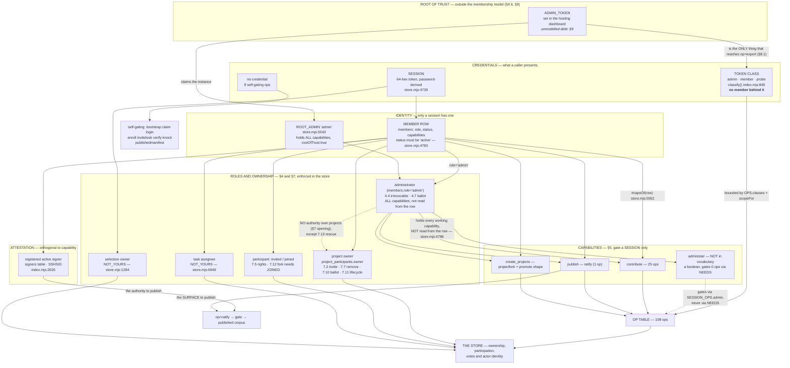

# Capabilities and gates: who may do what, where it is enforced, and where it is not

Written 2026-08-01 as a research pass over the AUTHORITY model, at the same altitude as
`JOURNEY-PRIMARY.md` and `LAYERS.md` in this folder. **This is a MEASUREMENT of what the
plane enforces today plus a derivation of what `inquiry` will need.** It changes nothing
and proposes no code.

**Sources read in full:** `bio-plane/src/index.mjs` (the `OPS`, `SESSION_OPS` and `NEEDS`
tables and the request path), `bio-plane/src/store.mjs` (the Durable Object's refusals),
`bio-plane/src/gate.mjs`, `bio-plane/checks/bio-checks.mjs`,
`bio-plane/src/query.mjs` (the D-15 viewer gate),
`architecture/BIO_Membership_Architecture_v2.md` §4/5/7/8,
`architecture/BIO_Interaction_Constructs_v0_1.md` (the weight ladder),
`architecture/BIO_Case_Making_v0_1.md` (all of it), `INTERFACES.md` I3,
`civicos-ui/app.html` and `bio-plane/src/setup.mjs` (the two interfaces that consume
`op=whoami`).

**Evidence discipline.** Every claim carries a file and a line. Where a line is a
generated count, the generator is `scratchpad/an.mjs` reading `OPS`/`NEEDS`/`SESSION_OPS`
straight out of `index.mjs`, the same way `test/capability.test.mjs:311` does — so the
counts below cannot drift from the source by transcription. **UNVERIFIED** marks a claim
I could not check from the repository. Where a document is silent about intent I say
*I don't know* rather than guessing.

**Line numbers are as of the working tree on 2026-08-01.** They are an index into the
argument, not a permanent address.

---

## 0 · The four gates, in the order a request meets them

A request to the control plane passes through at most six enforcement points. Knowing
the ORDER matters, because the first one that refuses is the one whose words a member
reads, and two of them speak in strings a caller cannot match on.

| # | gate | where | what it consults | refusal shape |
| --- | --- | --- | --- | --- |
| 1 | **op exists** | `index.mjs:923-924` | `OPS` | `{ok:false, error:"unknown op", op}` — **no `reason`** |
| 2 | **self-gating (unauthenticated ops)** | `index.mjs:927-1040` | each op's own rule | per-op; `claim` 403 `"bootstrap credential does not match"`, `knock` 429 `RATE_IP`/`RATE_GLOBAL` |
| 3 | **token class / session** | `index.mjs:1085-1086` | `OPS[op].classes`, `classify()` | `error:"unauthenticated"` (401), `error:"forbidden for token class"` (403) — **no `reason`** |
| 3a | **session-reachability** | `index.mjs:1075-1077` | `SESSION_OPS[kind]` | `error:"this operation requires a machine credential, not a signed-in session"` (403) — **no `reason`** |
| 4 | **capability (§5)** | `index.mjs:1111-1118` | `NEEDS[op]` vs the session's caps | `reason:"NOT_CAPABLE"` with `needs`, `held` and a `detail` naming the remedy |
| 4a | **shape-capability** | `index.mjs:2884-2889` | `create_projects` on a base-null `object_type: project` promote | `reason:"NOT_CAPABLE", needs:"create_projects"` |
| 5 | **namespace confinement** | `index.mjs:1120-1121`, `scopeFor` at `860-864` | probe class vs `store=` | `error:"probe class is confined to the scratch namespace…"` — **no `reason`** |
| 6 | **the store** | `store.mjs`, ~110 distinct `reason:` codes | rows: ownership, participation, votes, actor identity | named `reason` in every case |
| 7 | **the gate, at ratify only** | `index.mjs:2624-2662`, `gate.mjs:43-81` | the check catalogue + R2 | `RATIFY_STALE`, `NO_SIGNERS`, `SIG_*`, `GATE_REFUSED` carrying C-numbers |

Gates 1, 3, 3a and 5 answer with an `error` STRING and no `reason` key. I3 says answers
are *"`{ok: …}` shaped, with a named `reason` on a refusal"* (`INTERFACES.md:476`). Four
of the seven gates do not meet that contract. See finding **F-3**.

---

## 1 · The matrix — every op × class × capability × session × mutating × weight

**108 ops** (`index.mjs:201-546`), of which **57 mutate**.

Reading the columns:

- **token classes admitted** — `OPS[op].classes`. `*none (self-gating)*` is `classes:
  null`: deliberately unauthenticated, each enforcing its own gate (`index.mjs:196-198`).
- **capability required** — `NEEDS[op]`. `*null, stated*` means the table carries an
  explicit `null` with a written reason, which is the structural discipline
  `index.mjs:682-688` describes. `**— (absent)**` on a mutating op means the op is not in
  `NEEDS` at all.
- **session reach** — for a MUTATING op only, since `SESSION_OPS` is consulted only when
  `spec.mutating` is true (`index.mjs:1075`). **A non-mutating op is NOT gated by
  `SESSION_OPS`**: any session whose class is admitted reaches it, whether or not the op
  is named in the set. The reads listed in `RETRIEVAL_READS`, `READING_READS` and the rest
  are therefore documentation of intent, not enforcement.
- **mutating** — `OPS[op].mutating`.
- **ladder rung (sourced)** — only where `BIO_Interaction_Constructs_v0_1.md` assigns one.
  *unassigned* means **no document in this repository states a rung for that op**; it is
  not my inference that the rung is "reversible".
- **reason required by store** — the named refusal the DO raises when a justification is
  absent. This is the ENFORCED evidence of the `reasoned` rung, independent of whether a
  document names it.

| op | index.mjs:line | token classes admitted | capability required | session reach (mutating ops) | mutating | ladder rung (sourced) | reason required by store |
| --- | --- | --- | --- | --- | --- | --- | --- |
| `selftest` | 203 | admin · member · probe | — | any session of an admitted class | no | — | — |
| `livefire` | 204 | admin · probe | **— (absent)** | **no session** | **yes** | *unassigned* | — |
| `index` | 211 | admin · member · probe | — | any session of an admitted class | no | — | — |
| `projection` | 216 | admin · member · probe | — | any session of an admitted class | no | — | — |
| `reproject` | 217 | admin · probe | **— (absent)** | **no session** | **yes** | *unassigned* | — |
| `projectinvite` | 228 | admin · member · probe | *null, stated* | member + admin | **yes** | *unassigned* | — |
| `projectjoin` | 229 | admin · member · probe | *null, stated* | member + admin | **yes** | *unassigned* | — |
| `projectleave` | 230 | admin · member · probe | *null, stated* | member + admin | **yes** | *unassigned* | — |
| `projectremove` | 231 | admin · member · probe | *null, stated* | member + admin | **yes** | *unassigned* | — |
| `projectowneradd` | 232 | admin · member · probe | *null, stated* | member + admin | **yes** | *unassigned* | — |
| `projectownerremove` | 233 | admin · member · probe | *null, stated* | member + admin | **yes** | *unassigned* | NO_REASON 5092 |
| `projectfork` | 234 | admin · member · probe | `create_projects` | member + admin | **yes** | *unassigned* | — |
| `projectownerrescue` | 238 | admin · member · probe | *null, stated* | member + admin | **yes** | *unassigned* | NO_REASON 5054 |
| `projectparticipants` | 239 | admin · member · probe | — | any session of an admitted class | no | — | — |
| `projectownerarith` | 243 | admin · member · probe | — | any session of an admitted class | no | — | — |
| `expertisedeclare` | 249 | admin · member · probe | *null, stated* | member + admin | **yes** | *unassigned* | — |
| `expertiseconfirm` | 250 | admin · member · probe | *null, stated* | member + admin | **yes** | *unassigned* | — |
| `expertiselist` | 251 | admin · member · probe | — | any session of an admitted class | no | — | — |
| `sourcereach` | 261 | admin · member · probe | — | any session of an admitted class | no | — | — |
| `archivelookup` | 268 | admin · member · probe | — | any session of an admitted class | no | — | — |
| `tasks` | 269 | admin · member · probe | — | any session of an admitted class | no | — | — |
| `taskdrain` | 270 | admin · member · probe | **— (absent)** | **no session** | **yes** | *unassigned* | — |
| `taskforward` | 271 | admin · member · probe | *null, stated* | member + admin | **yes** | *unassigned* | — |
| `taskresolve` | 272 | admin · member · probe | *null, stated* | member + admin | **yes** | *unassigned* | — |
| `export` | 278 | admin | **— (absent)** | **no session** | **yes** | *unassigned* | — |
| `exportlog` | 281 | admin · member · probe | — | any session of an admitted class | no | — | — |
| `publishedmanifest` | 287 | *none (self-gating)* | — | n/a | no | — | — |
| `whoami` | 292 | admin · member · probe | — | any session of an admitted class | no | — | — |
| `search` | 302 | admin · member · probe | — | any session of an admitted class | no | — | — |
| `searchfields` | 306 | admin · member · probe | — | any session of an admitted class | no | — | — |
| `searchindexcheck` | 309 | admin · member · probe | — | any session of an admitted class | no | — | — |
| `select` | 317 | admin · member · probe | *null, stated* | member + admin | **yes** | *unassigned* | — |
| `selection` | 318 | admin · member · probe | — | any session of an admitted class | no | — | — |
| `selectionlist` | 319 | admin · member · probe | — | any session of an admitted class | no | — | — |
| `selectionrelease` | 320 | admin · member · probe | *null, stated* | member + admin | **yes** | *unassigned* | — |
| `cite` | 327 | admin · member · probe | `contribute` | member + admin | **yes** | *unassigned* | — |
| `dispose` | 330 | admin · member · probe | `contribute` | member + admin | **yes** | reasoned (Constructs:242) | NO_REASON 1591 |
| `retire` | 335 | admin · member · probe | `contribute` | member + admin | **yes** | **terminal** (Constructs:244) | NO_REASON 1725 |
| `release` | 341 | admin · member · probe | `contribute` | member + admin | **yes** | reasoned (Constructs:241) | NO_ACKNOWLEDGMENT 1867 / NO_MITIGATION 1872 |
| `sever` | 348 | admin · member · probe | `contribute` | member + admin | **yes** | reasoned (Constructs:243) | NO_REASON 1407 |
| `reinstate` | 349 | admin · member · probe | `contribute` | member + admin | **yes** | reasoned (Constructs:243) | NO_REASON 1407 |
| `list` | 350 | admin · member · probe | — | any session of an admitted class | no | — | — |
| `image` | 351 | admin · member · probe | — | any session of an admitted class | no | — | — |
| `file` | 352 | admin · member · probe | — | any session of an admitted class | no | — | — |
| `dangling` | 353 | admin · member · probe | — | any session of an admitted class | no | — | — |
| `stats` | 354 | admin · member · probe | — | any session of an admitted class | no | — | — |
| `promote` | 355 | admin · member · probe | `contribute` | member + admin | **yes** | *unassigned* | — |
| `allocid` | 356 | admin · member · probe | `contribute` | member + admin | **yes** | *unassigned* | — |
| `lease` | 357 | admin · member · probe | `contribute` | member + admin | **yes** | *unassigned* | — |
| `purge` | 358 | admin · probe | **— (absent)** | **no session** | **yes** | *unassigned* | — |
| `capture` | 359 | admin · member · probe | `contribute` (GET exempt) | member + admin | **yes** | *unassigned* | — |
| `links` | 363 | admin · member · probe | — | any session of an admitted class | no | — | — |
| `pdfstructure` | 371 | admin · member · probe | — | any session of an admitted class | no | — | — |
| `runtime` | 372 | admin · member · probe | — | any session of an admitted class | no | — | — |
| `linkproject` | 376 | admin · member · probe | `contribute` | member + admin | **yes** | *unassigned* | — |
| `cpuprobe` | 379 | admin · probe | **— (absent)** | **no session** | **yes** | *unassigned* | — |
| `acquire` | 383 | admin · member · probe | `contribute` | member + admin | **yes** | *unassigned* | — |
| `attest` | 387 | admin · member · probe | `contribute` | member + admin | **yes** | **attested** (Constructs:275) | — |
| `monitor` | 391 | admin · member · probe | `contribute` | member + admin | **yes** | *unassigned* | — |
| `audit` | 394 | admin · member · probe | — | any session of an admitted class | no | — | — |
| `ratify` | 401 | admin · member · probe | `publish` | member + admin | **yes** | **attested** (Constructs:275) | — |
| `publishedlist` | 402 | admin · member · probe | — | any session of an admitted class | no | — | — |
| `inbox` | 403 | admin · member · probe | — | any session of an admitted class | no | — | — |
| `inboxget` | 404 | admin · member · probe | — | any session of an admitted class | no | — | — |
| `inboxresolve` | 405 | admin · member · probe | `contribute` | member + admin | **yes** | *unassigned* | — |
| `memberadd` | 406 | admin · probe | *null, stated* | admin only | **yes** | *unassigned* | — |
| `memberlist` | 407 | admin · member · probe | — | any session of an admitted class | no | — | — |
| `memberset` | 408 | admin · probe | *null, stated* | admin only | **yes** | *unassigned* | — |
| `membercaps` | 413 | admin · probe | **— (absent)** | **no session** | **yes** | *unassigned* | — |
| `adminendorse` | 414 | admin · probe | **— (absent)** | **no session** | **yes** | *unassigned* | — |
| `adminremove` | 415 | admin · probe | **— (absent)** | **no session** | **yes** | *unassigned* | NO_REASON 5628 |
| `adminarith` | 416 | admin · member · probe | — | any session of an admitted class | no | — | — |
| `registeraudit` | 421 | admin · probe | — | any session of an admitted class | no | — | — |
| `reading` | 428 | admin · member · probe | — | any session of an admitted class | no | — | — |
| `readingref` | 429 | admin · member · probe | — | any session of an admitted class | no | — | — |
| `entitycreate` | 440 | admin · member · probe | `contribute` | member + admin | **yes** | *unassigned* | — |
| `entityalias` | 441 | admin · member · probe | `contribute` | member + admin | **yes** | *unassigned* | — |
| `relationdeclare` | 442 | admin · member · probe | `contribute` | member + admin | **yes** | *unassigned* | NO_JUSTIFICATION 3094 |
| `entity` | 443 | admin · member · probe | — | any session of an admitted class | no | — | — |
| `entitybyalias` | 444 | admin · member · probe | — | any session of an admitted class | no | — | — |
| `relation` | 445 | admin · member · probe | — | any session of an admitted class | no | — | — |
| `resolve` | 455 | admin · member · probe | `contribute` | member + admin | **yes** | *unassigned* | — |
| `resolvetestify` | 456 | admin · member · probe | `contribute` | member + admin | **yes** | *unassigned* | — |
| `resolutions` | 457 | admin · member · probe | — | any session of an admitted class | no | — | — |
| `concerns` | 458 | admin · member · probe | — | any session of an admitted class | no | — | — |
| `connect` | 468 | admin · member · probe | `contribute` | member + admin | **yes** | *unassigned* | — |
| `connections` | 469 | admin · member · probe | — | any session of an admitted class | no | — | — |
| `progressiondefine` | 470 | admin · member · probe | `contribute` | member + admin | **yes** | *unassigned* | — |
| `progression` | 471 | admin · member · probe | — | any session of an admitted class | no | — | — |
| `thread` | 478 | admin · member · probe | `contribute` | member + admin | **yes** | *unassigned* | — |
| `instance` | 479 | admin · member · probe | — | any session of an admitted class | no | — | — |
| `discharge` | 487 | admin · member · probe | `contribute` | member + admin | **yes** | *unassigned* | NO_REASON 3907 |
| `exceptions` | 488 | admin · member · probe | — | any session of an admitted class | no | — | — |
| `proposals` | 496 | admin · member · probe | — | any session of an admitted class | no | — | — |
| `proposedispose` | 503 | admin · member · probe | `contribute` | member + admin | **yes** | *unassigned* | NO_REASON 4354 |
| `captureprogressions` | 513 | admin · member · probe | — | any session of an admitted class | no | — | — |
| `governorstate` | 522 | admin · member · probe | — | any session of an admitted class | no | — | — |
| `governorconfig` | 523 | admin · probe | *null, stated* | admin only | **yes** | *unassigned* | — |
| `signeradd` | 524 | admin · probe | *null, stated* | admin only | **yes** | *unassigned* | — |
| `signerlist` | 525 | admin · member · probe | — | any session of an admitted class | no | — | — |
| `signerset` | 526 | admin · probe | *null, stated* | admin only | **yes** | *unassigned* | — |
| `bootstrap` | 535 | *none (self-gating)* | — | n/a | no | — | — |
| `claim` | 536 | *none (self-gating)* | **— (absent)** | n/a | **yes** | *unassigned* | — |
| `login` | 537 | *none (self-gating)* | — | n/a | no | — | — |
| `enroll` | 538 | *none (self-gating)* | **— (absent)** | n/a | **yes** | *unassigned* | — |
| `invitelook` | 543 | *none (self-gating)* | — | n/a | no | — | — |
| `verify` | 544 | *none (self-gating)* | — | n/a | no | — | — |
| `knock` | 545 | *none (self-gating)* | **— (absent)** | n/a | **yes** | *unassigned* | — |

### 1.1 What the matrix shows at a glance

- **Class is almost never the gate.** **86** of 108 ops admit `admin · member · probe`.
  What actually separates callers is the SESSION layer and the capability layer, exactly
  as `index.mjs:196-198` argues ("safety comes from WHERE an op reads, not from who holds
  a token"). The whole remainder is **13** admin/probe (including the two write-probes
  `livefire` and `cpuprobe`), **1** admin-only (`export`) and **8** self-gating.
- **The weight ladder is not in the plane.** Of 57 mutating ops, **7 have a rung assigned
  by any document**. The `weight` field that DOES exist in the source
  (`store.mjs:1183-1192`, `1396`, `1599`, `1733`, `1882`, `2072`) is the SET-APPLICATION
  mode — `report` vs `refuse` from `BIO_Interaction_Constructs_v0_1.md:112`'s second,
  orthogonal axis — and not the rung. Two different things share one word in the
  codebase. See finding **F-5**.
- **The `reasoned` rung is nonetheless enforced in 11 places**, by store-level
  `NO_REASON`/`NO_JUSTIFICATION`/`NO_ACKNOWLEDGMENT` refusals, on ops the ladder document
  never mentions (`relationdeclare`, `discharge`, `proposedispose`, `projectownerremove`,
  `projectownerrescue`, `adminremove`). The enforcement is ahead of the vocabulary.
- **`capture` is the one op whose method changes its gate.** A GET is treated as a read at
  both the session layer (`index.mjs:1075`) and the capability layer (`index.mjs:1114`).
  `pdfstructure` exists precisely to avoid needing a second such exception
  (`index.mjs:364-370`).

---

## 2 · The capability table from Membership v2 §5, mapped to what it gates

§5 (`BIO_Membership_Architecture_v2.md:319-357`) names FOUR capabilities. The plane's
vocabulary (`store.mjs:5460`, returned to callers as `whoami.vocabulary` via
`index.mjs:1155`) holds THREE.

| §5 capability | in `Store.CAPABILITIES`? | ops it gates via `NEEDS` | where else it is consulted |
| --- | --- | --- | --- |
| **contribute** | yes (`store.mjs:5460`) | **25 ops** — `promote` `lease` `allocid` `capture` `linkproject` `acquire` `attest` `monitor` `cite` `sever` `reinstate` `dispose` `retire` `release` `entitycreate` `entityalias` `relationdeclare` `resolve` `resolvetestify` `connect` `progressiondefine` `thread` `discharge` `proposedispose` `inboxresolve` (`index.mjs:692-760`) | UI: `setup.mjs:461`; `app.html:722` `canRelease`, `730` `canDispose`, `6232` `canAttest`, `6464` `canContribute` |
| **publish** | yes | **1 op** — `ratify` (`index.mjs:765`) | UI: `setup.mjs:624` `ratifyPanel` returns empty without it. **Not consulted anywhere in `civicos-ui/app.html`** — that interface has no ratify surface at all (0 occurrences of `"ratify"`) |
| **create_projects** | yes | **1 op** — `projectfork` (`index.mjs:792`), plus the SHAPE check on `promote` of a base-null `object_type: project` (`index.mjs:2884-2889`) | UI: `setup.mjs:463` hides the `project` option. **Not consulted anywhere in `app.html`** (0 occurrences of `create_projects`) |
| **administer** | **NO** | **nothing.** It appears in no `NEEDS` entry | It is a BOOLEAN on the session (`store.mjs:4787`), true iff `members.role='admin'`; enforcement is `OPS[op].classes` + `SESSION_OPS.admin`. `memberCaps` refuses to WRITE it: `NOT_A_CAPABILITY_GRANT` (`store.mjs:5566-5569`) |

### 2.1 Finding F-1 — `administer` is a §5 capability that gates nothing, by design, and the design is not written down where a reader would look

`index.mjs:776-778` states the reasoning inline: *"The roster ops are governed by
`administer`, which is not a working capability and moves only by the Section 4 process.
What bounds them is `SESSION_OPS.admin` above, not section 5."* That is coherent, and
`store.mjs:5566` enforces it hard. But §5 lists `administer` as a bullet beside the other
three (`BIO_Membership_Architecture_v2.md:329-330`), and `op=whoami` publishes it as a
SEPARATE boolean field rather than as a member of `vocabulary` (`index.mjs:1152`, `1155`).
A UI author reading §5 and then reading `whoami` finds four names in the document and
three in `vocabulary`. **This is a documentation defect, not an enforcement hole.** §5
should say `administer` is not in the capability vocabulary and why.

### 2.2 Finding F-2 — 30 of 57 mutating ops are gated by NO capability

Computed from `OPS` and `NEEDS` in source. They fall into five honest groups and one that
is not honest.

| group | ops | is the absence sound? |
| --- | --- | --- |
| **Machine-only, no session reaches them** | `livefire` `reproject` `taskdrain` `export` `purge` `cpuprobe` | **Yes.** `NEEDS` gates a SESSION only (`index.mjs:1111`), and none of these is in `SESSION_OPS`. `export` additionally has its own root-of-trust refusal, twice (`index.mjs:1067-1074` and `1100-1105`), §8.1 |
| **Unauthenticated by design** | `claim` `enroll` `knock` | **Yes.** No session exists yet; each self-gates (`index.mjs:942-1035`) |
| **Governed by §7 participation, not §5** | `projectinvite` `projectjoin` `projectleave` `projectremove` `projectowneradd` `projectownerremove` `projectownerrescue` | **Yes**, and the store enforces it: `NOT_THE_OWNER` (`store.mjs:4905`, `4949`, `4974`, `5085`), `NOT_INVITED` (`4923`), `ADMIN_ONLY` + `OWNERS_ARE_ACTIVE` for 7.13 (`5036`, `5050`), the 7.10 ballot (`5097-5121`). `by` is stamped server-side (`index.mjs:2846-2847`) so the store judges the real caller |
| **Identity, not capability** | `taskforward` `taskresolve` `select` `selectionrelease` `expertisedeclare` `expertiseconfirm` | **Yes**, with reasons recorded at `index.mjs:774-775`, `793-798`, `807-816`. The store answers `NOT_YOURS` (`store.mjs:6949`, `1284`), `ADMIN_ONLY` (`5392`) |
| **Bounded by `SESSION_OPS.admin`** | `memberadd` `memberset` `signeradd` `signerset` `governorconfig` | **Yes**, per F-1's reasoning |
| **Reachable by NO session at all, though §4.9 says an administrator does them** | `membercaps` `adminendorse` `adminremove` | **NO — see F-4** |

**No session-reachable mutating op is missing from `NEEDS`, and no `NEEDS` entry is
unreachable by every session.** Both directions are clean, which is what
`test/capability.test.mjs` exists to hold (`index.mjs:684-688`). The structural discipline
is working.

### 2.3 Finding F-4 (SHARP) — the three ops that implement §4.9's custodial powers cannot be reached by an administrator's browser

`membercaps`, `adminendorse` and `adminremove` are `classes: ["admin","probe"]` and
mutating (`index.mjs:413-415`). They are **absent from `SESSION_OPS.admin`**
(`index.mjs:661-666`). The session check at `index.mjs:1075-1077` therefore refuses an
administrator's own signed-in session with:

> `this operation requires a machine credential, not a signed-in session`

Compare Membership v2 §4.9 (`:276-294`), which lists among what an administrator DOES:
*"Set a member's capabilities, per Section 5"* and, via §4.7 (`:213-245`), endorsing an
addition and voting on a removal. And §4.7's whole arithmetic — `CONSENSUS_REQUIRED`,
`TARGET_CANNOT_VOTE`, `VOTES_SHORT`, `IMPOSSIBLE_AT_TWO` (`store.mjs:5594`, `5624`,
`5646`, `5632`) — is a **ballot among named administrators**. `by` is checked against
`#activeAdmins()` (`store.mjs:5586`, `5626`). A machine credential has no member behind it
(`index.mjs:671-674`), so `by` from a machine caller is not an administrator id and the
store refuses `NOT_AN_ADMIN`.

So the §4.7 governance surface is, as far as I can determine from the source:
**reachable only by a caller who can both hold `ADMIN_TOKEN` and supply another
administrator's member id as `by`.** `index.mjs` does NOT stamp `by` server-side for these
three ops — the stamp at `index.mjs:2846` covers `PROJECT_ACTIONS`, `projectparticipants`
and `projectownerarith` only. A machine caller therefore names whichever administrator it
likes as the voter.

I checked this three ways and each agrees: the op table (`index.mjs:413-415`), the session
set (`index.mjs:661-666`), and the by-stamp list (`index.mjs:2846`). `adminarith` — the
READ of the same rule — IS member-class and reachable (`index.mjs:416`), so a UI can show
the arithmetic of a vote nobody can cast. `BIO_Interaction_Constructs_v0_1.md:327-328`
names this: *"B, ballot, third — it makes the entire S-12 governance surface reachable,
which is seven releases of enforced-but-unusable rules."*

**What I don't know:** whether the omission is deliberate (an unbuilt ballot construct
deliberately left machine-only until the surface exists) or an oversight. Nothing in the
comments at `index.mjs:409-413` says either way — that comment explains the CLASS choice
and is silent on session reach. I am not guessing at intent.

---

## 3 · The gate ladder — for each mutating op, where refusal happens and what it is NAMED

The columns are the four layers named in the brief. A cell says WHICH refusal that layer
raises for that op.

**Layer key:** `OP` = `index.mjs` before the DO is called · `STORE` = the Durable Object ·
`CHECKS` = `bio-checks.mjs` through `gate.mjs` · `GATE@RATIFY` = the ratification path in
`index.mjs:2619-2684`.

| op | OP layer | STORE (named reasons, `store.mjs:line`) | CHECKS | GATE@RATIFY |
| --- | --- | --- | --- | --- |
| `promote` | `NOT_CAPABLE` (contribute); `NOT_CAPABLE` (create_projects, shape) `2884` | `NO_BODY` 2571 · `UNDECLARED_OPERATION` 2581 · `REFS_IN_PAYLOAD` 2591 · `MALFORMED` 2593 · `EXISTS` 2598 · `ABSENT` 2600 · `NO_TITLE` 2649 · `NAME_TAKEN` 2655 · **`NOT_THE_OWNER` 2688** (7.11 deactivate/reactivate) · `CAS_STALE` 2697 · `OVERSIZE_INLINE` 2701 · `GATHERING_REFUSED` 2725 · `FILES_DROPPED` 2785 · `NO_BUNDLE_MD` 2796 | — | — |
| `ratify` | `NOT_CAPABLE` (publish) | `MALFORMED` 5928 (publish) | `GATE_REFUSED` carrying C-numbers + `PLANE_MISSING_BYTES` / `PLANE_SIZE` (`gate.mjs:68,71`) | `MALFORMED` 2622 · `RATIFY_STALE` 2627 · `NO_SIGNERS` 2632 · `SIG_*` 2638 · `PUBLISH_FAILED` 2684 |
| `cite` | `NOT_CAPABLE` | `NO_SUCH_PROJECT` 2076 · `NOT_A_PROJECT` 2079 · `BAD_NOTE` 2089 · `NOT_INFORMATION` 2104 · `NO_BUNDLE_MD` 2111 · `UNPARSEABLE_FRONTMATTER` 2114 · `SEVERED_EDGE` 2140 · `EMPTY_SELECTION` 2154 · `UNSPLICEABLE_REFERENCES` 2167 · `CITATION_TOO_LARGE` 2230 | — | — |
| `sever` / `reinstate` | `NOT_CAPABLE` | `#edgeTransition`: `NO_SUCH_PROJECT` 1400 · `NOT_A_PROJECT` 1402 · **`NO_REASON` 1407** · `BAD_REASON` 1412 · `EMPTY_SELECTION` 1425 · `NOT_INFORMATION` 1436 · `NO_BUNDLE_MD` 1441 · `UNPARSEABLE_FRONTMATTER` 1443 · `UNSPLICEABLE_REFERENCES` 1484 · `CITATION_TOO_LARGE` 1512; plus `SET_MOVED` 1260 at `refuse` weight | — | — |
| `dispose` | `NOT_CAPABLE` | `BAD_TARGET_STATE` 1582 · `NOT_A_DISPOSITION` 1585 · **`NO_REASON` 1591** · `BAD_REASON` 1595 · `EMPTY_SELECTION` 1602 · `NOT_PROBLEMS` 1615 · `ILLEGAL_TRANSITION` 1619 · `NO_DOCUMENT` 1630 · `UNSPLICEABLE_STATE_HISTORY` 1643 | — | — |
| `retire` | `NOT_CAPABLE` | **`NO_REASON` 1725** · `BAD_REASON` 1729 · `EMPTY_SELECTION` 1736 · `NOT_INFORMATION` 1760 · `ILLEGAL_TRANSITION` 1764 · **`CITED` 1770** · `NO_DOCUMENT` 1781 · `UNSPLICEABLE_STATE_HISTORY` 1787 | — | — |
| `release` | `NOT_CAPABLE` | **`MACHINE_CANNOT_RELEASE` 1860** · `NO_ACKNOWLEDGMENT` 1867 · `NO_MITIGATION` 1872 · `EMPTY_SELECTION` 1885 · `NOT_INFORMATION` 1906 · `ILLEGAL_TRANSITION` 1910 · `CRUCIAL_IN_BATCH` 1915 · `ENTRY_REQUIREMENTS` 1921 · `NO_DOCUMENT` 1933 · `UNSPLICEABLE_STATE_HISTORY` 1940 | — | — |
| `select` | — (`NEEDS` null) | `NO_OWNER` 1103 · `BAD_KIND` 1107 · `EMPTY` 1113 · `TOO_LARGE` 1115 | — | — |
| `selectionrelease` | — | `NO_OWNER` 1282 · **`NOT_YOURS` 1284** | — | — |
| `capture` (PUT) | `NOT_CAPABLE`; GET exempt `1114` | server-side sha verification, `index.mjs` capture branch | — | — |
| `acquire` `attest` `monitor` `linkproject` | `NOT_CAPABLE` | **no identity refusal** — shape only | — | — |
| `entitycreate` | `NOT_CAPABLE` | `NO_KIND` 3016 · `UNKNOWN_KIND` 3019 · `NO_LABEL` 3024 | — | — |
| `entityalias` | `NOT_CAPABLE` | `NO_ENTITY` 3057 · `NO_ALIAS` 3059 · `NO_SUCH_ENTITY` 3061 · `ALREADY_ALIASED` 3063 | — | — |
| `relationdeclare` | `NOT_CAPABLE` | `UNKNOWN_RELATION` 3081 · `NO_ENDS` 3086 · `SELF_RELATION` 3088 · **`NO_JUSTIFICATION` 3094** · `NO_CITATION` 3096 · `NO_SUCH_ENTITY` 3099/3101 | — | — |
| `resolve` | `NOT_CAPABLE` | `NO_SHA` 3315 · `NO_REF` 3319 · `NO_SUCH_REFERENCE` 3323 | — | — |
| `resolvetestify` | `NOT_CAPABLE` | `NO_SHA` 3357 · `NO_REF` 3359 · `NO_ENTITY` 3361 · **`NO_BASIS` 3363** · `NO_SUCH_REFERENCE` 3366 · `NO_SUCH_ENTITY` 3369 | — | — |
| `connect` | `NOT_CAPABLE` | `NO_ENTITY` 3470 | — | — |
| `progressiondefine` | `NOT_CAPABLE` | `NO_KEY` 3553 · `NO_LABEL` 3556 · `NO_STAGES` 3558 · `NO_STAGE_KEY` 3566 · `DUPLICATE_STAGE` 3567 · `NO_CARDINALITY` 3570 · `BAD_REQUIRED` 3573 · `UNKNOWN_AFTER` 3586 | — | — |
| `thread` | `NOT_CAPABLE` | `NO_KEY` 3804 · `NO_ENTITY` 3807 · `NO_PLACEMENTS` 3810 · `NO_SUCH_PROGRESSION` 3812 · `NO_SUCH_ENTITY` 3815 · `NO_STAGE` 3827 · `BAD_STAGE` 3828 · `NO_CAPTURE` 3832 · `DUPLICATE_PLACEMENT` 3834 · **`NOT_CONCERNED` 3838** | — | — |
| `discharge` | `NOT_CAPABLE` | `NO_KEY` 3896 … **`NO_REASON` 3907** · `NO_CITATION` 3910 · `BAD_STAGE` 3919 · `NOT_CONCERNED` 3924 | — | — |
| `proposedispose` | `NOT_CAPABLE` | `NO_KEY` 4339 · `NO_STAGE` 4341 · `NOT_A_DISPOSITION` 4349 · **`NO_REASON` 4354** · `BAD_REASON` 4358 · **`NO_DECIDER` 4363** · `NO_SUCH_PROGRESSION` 4373 · `BAD_STAGE` 4377 | — | — |
| `inboxresolve` | `NOT_CAPABLE` | `BAD_STATUS` 6005 · `NOT_FOUND` 6007 | — | — |
| `lease` | `NOT_CAPABLE` | **`ANONYMOUS_LEASE` 4419** | — | — |
| `allocid` | `NOT_CAPABLE` | — | — | — |
| `taskforward` | — (identity, not capability) | **`NOT_YOURS` 6949** (`#refuseNotYours`) · `NO_ACTOR` 6963 · `NO_SUCH_TASK` 6965 · `ALREADY_RESOLVED` 6966 · `NO_SUCH_MEMBER` 6970 · `ALREADY_THEIRS` 6971 | — | — |
| `taskresolve` | — | **`NOT_YOURS` 6949** · `NO_ACTOR` 6987 · `NO_SUCH_TASK` 6989 · `UNGRAMMATICAL` 6807 | — | — |
| `taskdrain` | machine-only (session refusal) | `UNGRAMMATICAL` 6807 | — | — |
| `projectinvite` | — | `NO_SUCH_PROJECT` 4902 · `NOT_A_PROJECT` 4903 · **`NOT_THE_OWNER` 4905** · `NO_SUCH_HANDLE` 4909 · `NOT_ACTIVE` 4910 · `ALREADY_A_PARTICIPANT` 4912 | — | — |
| `projectjoin` | — | **`NOT_INVITED` 4923** | — | — |
| `projectleave` | — | `NOT_A_PARTICIPANT` 4934 · `NOT_JOINED` 4935 | — | — |
| `projectremove` | — | **`NOT_THE_OWNER` 4949** · `NO_SUCH_HANDLE` 4953 · `NOT_A_PARTICIPANT` 4955 · **`OWNER` 4956** (use 7.10) | — | — |
| `projectowneradd` | — | `NOT_THE_OWNER` 4974 · `NOT_A_PARTICIPANT` 4980 · `ALREADY_AN_OWNER` 4982 · **`CONSENSUS_REQUIRED` 4998** | — | — |
| `projectownerremove` | — | `NOT_THE_OWNER` 5085 · `NOT_AN_OWNER` 5090 · **`NO_REASON` 5092** · **`LAST_OWNER` 5097** · `TARGET_CANNOT_VOTE` 5103 · `ALREADY_VOTED` 5109 · **`VOTES_SHORT` 5121** | — | — |
| `projectownerrescue` | — | **`ADMIN_ONLY` 5036** · `NO_OWNERS` 5041 · **`OWNERS_ARE_ACTIVE` 5050** · `NO_REASON` 5054 · `NOT_ACTIVE` 5057 | — | — |
| `projectfork` | `NOT_CAPABLE` (create_projects) | `NOT_A_PARTICIPANT` 5161 · **`NOT_JOINED` 5163** (7.12) · `MALFORMED` 5166 · `EXISTS` 5168 · `NO_TITLE` 5178 · **`NAME_TAKEN` 5181** · `NO_DOCUMENT` 5192 · `UNSPLICEABLE_REFERENCES` 5204 | — | — |
| `expertisedeclare` | — | `NO_SUCH_MEMBER` 5374 · `NOT_ACTIVE` 5375 · `NO_LABEL` 5377 · `ALREADY_DECLARED` 5380 | — | — |
| `expertiseconfirm` | — | **`ADMIN_ONLY` 5392** · `NO_SUCH_MEMBER` 5396 · `NOT_DECLARED` 5403 · `ALREADY_CONFIRMED` 5407 · `NOT_CONFIRMED` 5408 | — | — |
| `memberadd` | — | `BAD_MEMBER_ID` 5666 · `NO_COVER` 5668 · `EXISTS` 5671 · `EXPERTISE_IS_NOT_ASSIGNED` 5681 · **`ADMINS_FIRST` 5696** (4.3) · **`CONSENSUS_REQUIRED` 5720** (4.7) · `NO_SUCH_INVITATION` 5751 | — | — |
| `memberset` | — | `BAD_STATUS` 5824 · `NO_SUCH_MEMBER` 5826 · **`ADMIN_REQUIRES_VOTE` 5832** (4.9's first limit) | — | — |
| `membercaps` | **machine-only** (F-4) | `NO_SUCH_MEMBER` 5563 · `BAD_CAPABILITY` 5565/5571 · **`NOT_A_CAPABILITY_GRANT` 5567** (4.4) | — | — |
| `adminendorse` | **machine-only** (F-4) | `NO_SUCH_MEMBER` 5583 · `NOT_PROPOSED` 5584 · `NOT_AN_ADMIN` 5586 · **`CONSENSUS_REQUIRED` 5594** | — | — |
| `adminremove` | **machine-only** (F-4) | **`ROOT_OF_TRUST` 5615** (4.6) · `NOT_AN_ADMIN` 5622/5626 · `TARGET_CANNOT_VOTE` 5624 · `NO_REASON` 5628 · **`IMPOSSIBLE_AT_TWO` 5632** · `ALREADY_VOTED` 5638 · `VOTES_SHORT` 5646 | — | — |
| `signeradd` / `signerset` | — | `BAD_KEY` 5873 · `NO_SUCH_MEMBER` 5875 · `BAD_STATUS` 5889 · `NO_SUCH_KEY` 5891 | — | — |
| `governorconfig` | — | `NEED_HOST` / `BAD_APPETITE` at the OP layer (`index.mjs:1348`, `1354`) | — | — |
| `export` | **`ROOT_OF_TRUST_REQUIRED`** `1068`, `1101` | — | — | — |
| `purge` | `error:"purge requires confirm=<store>"` `1250` — **no `reason`** | — | — | — |
| `claim` | `error:"bootstrap credential does not match"` 403 `948` — **no `reason`** | `PASSWORD_TOO_SHORT` 4699 · `ALREADY_CLAIMED` 4702 | — | — |
| `enroll` | — | `NO_HANDLE` 5788 · `BAD_HANDLE` 5793 · `HANDLE_TAKEN` 5795 · `PASSWORD_TOO_SHORT` 5797 | — | — |
| `knock` | `TOO_LARGE` 1001/1015 · `EMPTY` 1011 | `RATE_IP` 5975 · `RATE_GLOBAL` 5976 | — | — |
| `livefire` `reproject` `cpuprobe` | machine-only (session refusal) | — | — | — |

### 3.1 Finding F-3 (SHARP) — four refusals a member cannot act on, because they carry no `reason`

I3 fixes the contract: *"JSON, `{ok: …}` shaped, with a named `reason` on a refusal"*
(`INTERFACES.md:476`), and *"changing a refusal `reason` a caller matches on … is a
change to this interface"* (`:488`). These four refuse with a bare `error` string:

| refusal | line | what a member sees | why it is unactionable |
| --- | --- | --- | --- |
| `unauthenticated` | `index.mjs:1085` | a 401 with no code | tolerable — the UI's `rec()` special-cases 401 (`setup.mjs:490`, `app.html` `rec`) |
| `forbidden for token class` | `index.mjs:1086` | "forbidden for token class" | names no remedy. The member cannot change their token class |
| `this operation requires a machine credential, not a signed-in session` | `index.mjs:1077` | the sentence | **This is the one an administrator hits on `membercaps`/`adminendorse`/`adminremove` (F-4).** It tells a group's administrator that the act §4.9 assigns them needs a credential §4.8 says should be held by somebody else. There is no action a member can take from it |
| `probe class is confined to the scratch namespace…` | `index.mjs:862` | the sentence | operator-facing; low harm |

`app.html`'s `teach()` renders `[err.reason, err.error, err.detail]` joined
(`app.html:784`), so the string DOES reach a member's screen — it is displayed, not
swallowed. The defect is that it is unnamed, unmatched, and terminal: the surface cannot
route the member anywhere because there is no code to branch on.

Contrast `NOT_CAPABLE` (`index.mjs:1115-1117`), which carries `needs`, `held` and *"ask
an administrator to grant it rather than looking for another route"*, and
`ROOT_OF_TRUST_REQUIRED` (`:1068`), which explains that the refusal reaches the founder's
own browser and points at `op=publishedmanifest`. Those are refusals a member can act on.
The four above are the exceptions in a codebase that otherwise does this very well.

### 3.2 The check catalogue gates CONFORMANCE, never AUTHORITY

`bio-checks.mjs` carries no check on who acted. `capability_tier` in it
(`bio-checks.mjs:341`, C-2.2) is a FRONTMATTER field describing how a bundle was
produced (`setup.mjs:718` emits `capability_tier: session`), not a session capability —
a name collision worth knowing about before someone reads C-2.2 as an authority check.
The only authority the gate enforces is the SSHSIG against registered signers, and that
happens at the op layer above it (`index.mjs:2635-2642`), not inside the catalogue.

---

## 4 · What the INQUIRY object needs

`inquiry` appears **nowhere in the code** (0 occurrences in `store.mjs`, `index.mjs`,
`bio-checks.mjs`, `app.html`). This section derives its permission model from
`BIO_Case_Making_v0_1.md` and from the patterns above. **It invents no new permission
model** — every rule below maps onto a mechanism that already exists.

The object: *"an INQUIRY — a question, which may gather evidence and other inquiries,
which may reach a conclusion, which may be published as something the group stands
behind"* (`Case_Making:340-342`). Type `inquiry`; states `open → concluded → published`;
member-facing names inquiry / finding / case (`:413-417`). It is a CLAIM STRUCTURE and
explicitly NOT a container with access control — that stays `project`
(`Case_Making:381-385`).

### 4.1 The four acts, derived

| act | who may | capability | store-level check | ladder rung | precedent it copies |
| --- | --- | --- | --- | --- | --- |
| **conclude** (`open → concluded`) | any member holding `contribute`, acting in their own name | **`contribute`** | a REQUIRED authored conclusion, refused `NO_CONCLUSION` when absent, never prefilled | **reasoned** | `release` (`store.mjs:1857-1872`): a state transition carrying typed authored text, `NO_ACKNOWLEDGMENT`/`NO_MITIGATION`, plus `MACHINE_CANNOT_RELEASE` at `1860` because the author stamp's SHAPE decides |
| **divide** (A superseded by B, C) | the same — but see 4.3 | **`contribute`** | `NO_APPORTIONMENT` if the basis is not assigned; `PUBLISHED_CANNOT_DIVIDE` if the source is `published` | **terminal** (A does not continue) | `retire` (`store.mjs:1722-1787`) is the existing terminal transition, and it already refuses on a downstream consequence (`CITED` at `1770`) rather than on the actor |
| **publish** (`concluded → published`) | a member holding `publish` **and** a registered active signing key | **`publish`** | the ratify path unchanged; ADD a stage requirement that the completeness/exclusion field is authored | **attested** | `ratify` exactly: `NEEDS.ratify = "publish"` (`index.mjs:765`) governs the SURFACE, `NO_SIGNERS`/`SIG_*` (`:2632`, `:2638`) govern the AUTHORITY |
| **supersede** (a later inquiry replaces a published case) | any member holding `contribute` on the NEW inquiry | **`contribute`** | the new inquiry carries a `supersedes` reference; nothing edits the old one | **reasoned** on the new object; the published case is untouched | `supersedes` is already in the closed vocabulary (`bio-checks.mjs:759`), and C-6.1/C-6.2 already police it (`:1000`, `:1024`) |

### 4.2 Why `contribute` and not a new capability

§5's `contribute` is *"create and revise bundles in the working corpus"*
(`Membership v2:325`). An inquiry IS a bundle in the working corpus; concluding one is
revising it. Every corpus-shaping act added since — the subject registry, the recognisers,
the progression definitions, the threading, the discharges, the proposal dispositions —
took `contribute` and recorded why, at `index.mjs:711-756`. Minting a fifth capability for
`conclude` would break the pattern and would need §5 reopened. **The strength of a claim
is not a permission question**: weakest-link composition (`Case_Making:359`, `:453-460`)
governs what the claim is WORTH, and that is derived, not granted.

Publishing is the one act that already has its own capability and its own key, and a case
is *"the most dangerous claim this system can make"* (`Case_Making:274`). `publish` +
signing key is exactly the right existing pair, and it needs nothing added.

### 4.3 The two things the existing pattern does NOT answer, and I will not invent

**(a) Is division owner-scoped or author-scoped?** `Case_Making:443-446` says
apportionment *"records who apportioned what"* and is never automatic, but does not say
who may perform it. Two existing patterns conflict:

- The §7 pattern would say the project's OWNERS decide (`store.mjs:4949` `NOT_THE_OWNER`).
- The corpus pattern would say any `contribute` holder, with the act attributed
  (`index.mjs:2838-2839` stamps `author` for every state action).

An inquiry has no owner field today, because ownership lives on `project`
(`Case_Making:381-385`). **I don't know which Bob intends**, and the difference is
material: division is how a member escapes an overclaiming mix (`Case_Making:453-460`),
so making it owner-only would let an owner block an honest de-escalation. This is a
decision for Bob, in the kickoff shape.

**(b) Does concluding require a task/ballot when a project has multiple owners?**
Nothing in `Case_Making` says a conclusion needs consensus, and no existing corpus write
is a ballot. I read the silence as "no ballot", but it is silence, and I state it as such.

### 4.4 The one enforcement point that must be new

*"Publishing asserts 'this is the material set', no gate can verify it, so the record does
what it does with everything it cannot establish — makes it visible, attributable and
stated, with what was EXCLUDED named by its author and never prefilled"*
(`Case_Making:364-369`). That is a **stage requirement in the check catalogue**, a
C-number on the `published` state of an `inquiry`, in exactly the form C-2.7 already takes
for `content_hash` on `verified` (`Case_Making:332`). It is NOT a capability and NOT a new
gate layer. `Case_Making:400-402`: *"every stage requirement must name the doctrine it
enforces."*

---

## 5 · The authority model

**Four properties the diagram is drawn to make visible:**

1. **A token class never reaches the capability layer.** `NEEDS` is consulted only inside
   `if (viaSession)` (`index.mjs:1111`). `whoami` reports `capabilities: null` for a
   machine credential rather than `[]` (`index.mjs:1154`), which is the honest answer.
2. **An administrator's capabilities are not read from their row** (`store.mjs:4786`), so
   §4.4 cannot be defeated by editing a field, and `memberCaps` refuses to touch an admin
   row at all (`store.mjs:5566`).
3. **Sight and authority are separated for administrators.** They see every project
   (`query.mjs:162-164` admits an active admin to every project row) and direct none
   (§7 opening, `Membership v2:384-391`).
4. **The key and the capability are two different things**, and the comment at
   `index.mjs:761-764` records why: before `publish` existed, *"the key was doing the
   capability's job."*

---

## 6 · CRITICAL CHECK — "absent from their interface, not present and refused"

§5: *"A capability a member does not hold is absent from their interface, not present and
refused"* (`Membership v2:322-323`). `index.mjs:676-680` accepts BOTH halves as
obligations: the interface hides it, and the plane refuses it anyway, *"because a hidden
button is a courtesy and not a boundary."*

### 6.1 Does the plane publish enough for an interface to honour it? — mostly YES

`op=whoami` (`index.mjs:1146-1161`) returns:

| field | value | sufficient? |
| --- | --- | --- |
| `tokenClass` | admin/member/probe | yes |
| `session` | boolean | yes — the UI needs it: `canRelease` checks it (`app.html:723`) |
| `member`, `handle` | id and handle, or null | yes |
| `administer` | boolean | yes — `buildRail` uses it (`app.html:858`) |
| `rootOfTrust` | boolean | yes — the only way to know `op=export` will work |
| `capabilities` | sorted array, or **`null` for a machine credential** | yes |
| `vocabulary` | `Store.CAPABILITIES` = the 3 working capabilities | yes — lets a UI tell "not held" from "not a capability at all" (`index.mjs:1144-1145`) |

**What `whoami` does NOT publish, and an interface needs:**

- **The `NEEDS` map itself.** A UI must hardcode "release needs contribute" — and
  `app.html:727` does exactly that, in a comment: *"op=dispose NEEDS `contribute`
  (bio-plane/src/index.mjs)"*. That is the second copy `op=searchfields` exists to
  prevent for the query language (`index.mjs:288-291` makes the analogy explicitly) and
  that `setup.mjs:449-450` warns about: *"A copy would drift, and the one that drifted
  would be this one."* **Today there are two such copies** (`setup.mjs` and `app.html`),
  and they have already diverged — see 6.2.
- **`SESSION_OPS` membership.** Nothing tells an interface that an administrator's session
  cannot reach `membercaps`. A members screen has no way to know before it tries.
- **Project participation.** `whoami` carries no participation, so a UI cannot decide
  owner-shaped affordances (invite, remove, deactivate) without a second call to
  `op=projectparticipants` per project.

### 6.2 Every place a UI must know a capability, and whether it does

**`bio-plane/src/setup.mjs` — the instance's own served page. Complete for what it offers.**

| control | capability | where | honours §5? |
| --- | --- | --- | --- |
| "new bundle" button `#go-new` | `contribute` | `setup.mjs:461` | **yes** — hidden |
| `project` option in the type select | `create_projects` | `setup.mjs:463` | **yes** — the OPTION is hidden |
| the publish panel | `publish` | `setup.mjs:624` | **yes** — `box.innerHTML = ""` |
| members screen `#go-members` | admin | `setup.mjs:471` | yes (role, not capability) |

`CAPS` starts EMPTY and `applyCaps()` runs BEFORE `whoami` answers (`setup.mjs:453`,
`460`, `472-476`) — fail closed, so the window between showing the panel and hearing back
shows nothing. That is the correct shape and the rest of the codebase should copy it.

**`civicos-ui/app.html` — the member-facing interface. Incomplete.**

| control | capability it needs | checked? | evidence |
| --- | --- | --- | --- |
| release act | `contribute` | **yes** | `canRelease()` `:722` |
| dispose act | `contribute` | **yes** | `canDispose()` `:730` |
| attest act | `contribute` | **yes** | `canAttest()` `:6232` |
| Add surface (promote/acquire/capture) | `contribute` | **partly** — see below | `canContribute()` `:6464`, `renderAdd` `:6469` |
| **`project` in the Add type list** | **`create_projects`** | **NO** | `ADD_TYPES` `:6457` renders all four unconditionally at `:6483`; `create_projects` occurs **0 times** in the file |
| **"Add something new" rail button** | `contribute` | **NO** | `buildRail` `:862` appends `.add` unconditionally |
| cite / sever / reinstate | `contribute` | **not present** | `"cite"` appears once, `"sever"`/`"reinstate"` zero times |
| ratify | `publish` | **no surface exists** | `"ratify"` occurs 0 times |
| members & keys rail entry | admin | **yes** | `:855`, `:859` |

**Finding F-6 (SHARP) — `app.html` offers "A line of work" (a project) to every member
holding `contribute`, and a member without `create_projects` is refused at submit** with
`NOT_CAPABLE` from the shape check at `index.mjs:2884-2889`. That is precisely
present-and-refused, the thing §5 forbids, on the one capability whose whole purpose is
gating that act. `setup.mjs:463` hides the same option correctly, so the two interfaces
disagree — which is the drift `setup.mjs:449-450` predicted.

**Finding F-7 — `renderAdd` explains rather than absents.** Without `contribute` the rail
button is still there and the screen says *"This credential can read the record and cannot
write to it, so there is nothing here to fill in"* (`app.html:6471-6475`). It is honest
and well written, and it is not what §5 asks for: the member navigated to an affordance
that does not exist for them. **This one is arguable** — a rail entry that vanishes may
confuse more than one that explains — but §5 is written as a rule, not a preference, and
if the rule is wrong the place to change it is §5.

### 6.3 A separate visibility gap, found while checking the above

**Finding F-8 — the D-15 viewer gate has exactly one compilation point, and four ops go
round it.**

`query.mjs:121-167` is a good gate: fail-closed (`0=1` for an unrecognised viewer,
`:124`), and for an identified session it filters `object_type='project'` to rows the
member participates in or administers (`:159-164`), which is §7.9's "uninvited: not its
existence, not its name". `store.mjs:575` throws if a retrieval statement reaches the
store without the gate mark — a real structural enforcement.

But the viewer is stamped only for `search`, `select`, `selection` and the edge/state
actions (`index.mjs:2823-2826`). **`op=list`, `op=index`, `op=projection` and `op=image`
never enter the compiler.** `listBundles` (`store.mjs:2518-2534`) returns
`bundle_id, object_type, current_state, title` for every row with no viewer clause, and
`app.html`'s `loadRecord()` builds the entire member-facing record view from
`op=list` (`app.html:952-956`).

So a signed-in member who was never invited to a project can read that project's id,
title and lifecycle state through the interface they are given. §7.9 says they may not
(`Membership v2:473-474`). §7.9 also names the derived reverse-edge index as *"the one
place the graph could escape"* and calls filtering it *"an implementation obligation, not
a design tradeoff"* (`:494-500`) — and `app.html:752-768` builds a reverse-citation index
client-side from `op=projection` over every focus and project, which is that exact leak by
a different route.

**What I don't know:** whether shipping the working-corpus reads unfiltered was a
deliberate staging decision. `index.mjs:2818-2819` says the gate *"is flat member scope
today … when projects and positions land it returns a real predicate"* — but the predicate
IS real now (`query.mjs:159`), so that comment is stale with respect to its own function.
I could not find a DEBT row or a decision covering the four unfiltered read ops.

---

## 7 · Findings register

| id | severity | finding | evidence |
| --- | --- | --- | --- |
| **F-1** | doc | `administer` is a §5 capability that gates no op and is not in the plane's capability vocabulary. Correct by design, undocumented in §5 | `Membership v2:329`; `store.mjs:5460`; `index.mjs:776-778` |
| **F-2** | none | 30 of 57 mutating ops carry no capability. 27 are soundly gated elsewhere (machine-only, unauthenticated, §7 participation, identity, `SESSION_OPS.admin`) | table 2.2 |
| **F-3** | **sharp** | Four op-layer refusals carry no `reason`, breaking I3's stated contract. The worst is the machine-credential refusal, which is what an administrator hits on their own §4.9 powers | `index.mjs:1077`, `1085`, `1086`, `862`; `INTERFACES.md:476` |
| **F-4** | **sharp** | `membercaps`, `adminendorse`, `adminremove` — the ops implementing §4.9 and the §4.7 ballot — are absent from `SESSION_OPS.admin`, so no administrator session reaches them; and `by` is not server-stamped for them, so a machine caller names any administrator as the voter | `index.mjs:413-415`, `661-666`, `2846`; `store.mjs:5586`, `5626` |
| **F-5** | design | The weight ladder is unimplemented. 7 of 57 mutating ops have a sourced rung; the `weight` field in the source is the orthogonal set-application mode, sharing the word | `Constructs:112`; `store.mjs:1183-1192` |
| **F-6** | **sharp** | `app.html` offers the `project` Add type to members without `create_projects`, refusing at submit — present-and-refused, the thing §5 forbids. `setup.mjs` hides it correctly, so the two interfaces disagree | `app.html:6457`, `6483`; `index.mjs:2884-2889`; `setup.mjs:463` |
| **F-7** | minor | `app.html`'s Add rail button is present without `contribute`; the screen explains rather than being absent | `app.html:862`, `6471-6475` |
| **F-8** | **sharp** | `op=list` / `op=index` / `op=projection` / `op=image` bypass the D-15 viewer gate, so an uninvited member reads every project's id, title and state — and `app.html` builds its whole record view from `op=list` | `index.mjs:2823-2826`; `store.mjs:2518-2534`; `query.mjs:159-164`; `app.html:952-956`, `752-768`; `Membership v2:473-474`, `494-500` |
| **F-9** | doc | The plane publishes `capabilities` and `vocabulary` but not the `NEEDS` map, so every interface keeps a second copy of "which op needs which capability". Two copies exist and have diverged (F-6) | `index.mjs:1146-1161`; `app.html:727`; `setup.mjs:449-450` |

### What would falsify this pass

F-4 and F-8 are the two that would most change the picture if I have read them wrong. For
F-4: a live probe of `op=membercaps` with an administrator's session token against a
scratch namespace either returns `ok` or returns the machine-credential string. For F-8:
`op=list` with a member session whose member id participates in no project either returns
project rows or does not. Both are one request each and neither was run in this pass —
**these are DERIVATIONS FROM SOURCE, not measurements**, and per CLAUDE.md that
distinction is the whole point.
