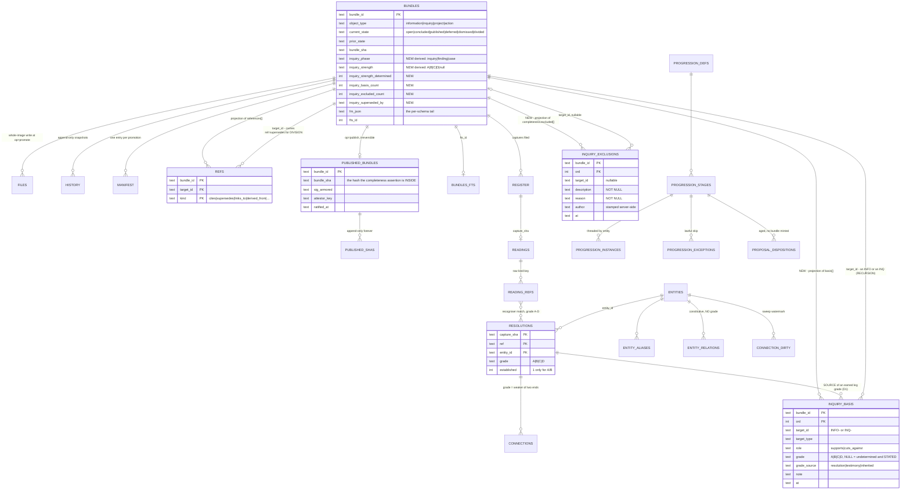

# The data model: as built, and exactly what `inquiry` requires

Written 2026-08-01 (research pass, no area claimed — this file creates one document and
edits nothing else). **Every claim about the code names its file and line.** Anything not
verified in this pass is marked **UNVERIFIED**. Line numbers are as of the working tree at
commit `8aca2ba`.

Companion to: `LAYERS.md` (the same corpus measured along the STACK), `PROCESS-INVENTORY.md`
(along the PATH), `INTERFACES.md` (I1–I6), and `docs/architecture/BIO_Case_Making_v0_1.md`
(the settled design this document costs out).

**One correction to a sibling.** `LAYERS.md` §0 says "`schema.mjs` declares **43** tables".
It declares **44**: `grep -c "CREATE TABLE IF NOT EXISTS" bio-plane/src/schema.mjs` → 44, and
`schema.mjs` has not changed since commit `ba36d49`, which precedes `360952e` (the tree
`LAYERS.md` was written against). The number is an off-by-one in the sibling, not a table
added since. **And 44 is itself not the whole schema** — see §1.2.

---

## 0. Method, and what "authoritative" means here

Three questions are asked of every table, and the answers are not stylistic:

- **Authoritative or derived.** *Authoritative* = the row is the only place the fact exists;
  losing it loses the fact. *Derived* = the row is a projection of something else in the
  store (a bundle's `bundle.md`, a capture's bytes, another table), and re-deriving it costs
  compute and nothing else. The distinction is load-bearing because **a derived table must
  be in `op=purge`'s whole-store arm or a purge reports scope `ALL` and silently leaves rows
  (D-113)**, and `hygiene.test.mjs:189-243` enforces exactly that against `schema.mjs`.
- **What writes it.** Named as the OP where an op reaches it, because "a store-level test and
  a passing battery are not evidence that a caller can reach the feature" (`CLAUDE.md`).
- **What reads it.** Same.

The read/write map below was produced mechanically: every `INSERT INTO`, `UPDATE`,
`DELETE FROM`, `SELECT … FROM` and `JOIN` against each table name across `bio-plane/src/*.mjs`,
then attributed to an op through the dispatch table at `store.mjs:7327-7629`.

---

# PART 1 — AS BUILT

## 1.1 The shape in one paragraph

There is one **record spine** — `bundles` + `files` + `history` + `manifest` + `refs` +
`register` — and `bundle.md` frontmatter is the authority for all of it. `schema.mjs:1-3`
states this outright: *"The bundle format is authoritative; this is a projection of it and
must never bend it."* Everything else in the schema is one of four things: **auth and
identity** (credentials, sessions, members, signers), **the published projection** behind the
two-bucket fence (`published_bundles`, `published_shas`), **capture machinery** (site assets,
links, locators, governors, limits), or **the framework's derived intent layer** (readings →
entities → resolutions → connections → progressions). The member-facing claim structure the
case-making design needs is **not in this list**, and that absence is the whole of Part 2.

## 1.2 There are 52 tables, not 44

`schema.mjs` declares 44. **Eight more are created by hand in the Durable Object's
constructor migration block**, `store.mjs:222-370`, and they are invisible to the D-113
hygiene assertion because `hygiene.test.mjs:241` iterates `schemaTables` — the tables parsed
out of `schema.mjs` — and nothing else.

| created at | table | why it is not in `schema.mjs` |
| --- | --- | --- |
| `store.mjs:222-224` | `bundles_fts` | FTS5 virtual table; columns come from `query.mjs:80` (`title, body, meta, locator, authority`) |
| `store.mjs:275-286` | `project_participants` | added with the membership model (Membership Architecture §7) |
| `store.mjs:301-309` | `member_expertise` | §1.3, an event log |
| `store.mjs:315-323` | `export_log` | §8.1 |
| `store.mjs:327-336` | `project_owner_votes` | §7.10 |
| `store.mjs:338-346` | `admin_votes` | §4.7 |
| `store.mjs:348-360` | `selections` | S-10 step 5 |
| `store.mjs:363-370` | `selection_items` | S-10 step 5 |

**Finding, and it is a real one.** `bundles_fts`, `selections` and `selection_items` ARE
cleared by the whole-store purge (`store.mjs:4537, 4544-4545`). The other five are not, and
they are not exempt either — they are simply outside the assertion's reach. `project_participants`
is the sharpest case: it is keyed on `project_id`, which is a bundle id (`store.mjs:277`), so a
**per-bundle** purge of a project leaves its participant rows orphaned, and a **whole-store**
purge that reports scope `ALL` leaves the entire participation graph standing. This is the exact
D-113 silent-leftover, in a table the D-113 test cannot see. It is not in `op=purge` (§1.4) and
not in `EXEMPT` (`hygiene.test.mjs:216-231`).

`bundles` additionally carries **17 columns that are not in `schema.mjs`**, added by the
`ALTER TABLE … ADD COLUMN` loop at `store.mjs:120-176`: `schema_id`, `produced_mode`,
`capability_tier`, `source_locator`, `source_authority`, `source_retrieved`, `source_status`,
`content_hash`, `monitor_enabled`, `monitor_frequency`, `monitor_last_checked`,
`annotations_open`, `reeval_flag`, `reeval_since`, `reeval_source`, `fm_json`, `fts_id`. All
are the S-10 metadata projection, all derived from `bundle.md`, all nullable. `members` gains
three the same way (`handle`, `capabilities`, `expertise`, `store.mjs:127-136`), and `manifest`
gains `writer` and `operation` (`store.mjs:137-138`) — the latter two ARE in `schema.mjs:69-70`
as well, so the ALTER is the migration path for stores written before them.

One column has been **removed**: `bundles.classification`, dropped at `store.mjs:187-189`
because fact/analysis/judgment "is a stance a citing project takes toward a passage, not a
property a document has".

## 1.3 The table catalogue

Format: **table** — PK — columns — writers — readers — A/D (authoritative/derived) — purge.
`purge` column: `ALL` = deleted in the whole-store arm; `BOTH` = deleted in both arms (it is in
the `TABLES` list at `store.mjs:4516-4518`, which the per-bundle arm runs `WHERE bundle_id=?`
against); `EXEMPT` = deliberately never purged, with the reason recorded at
`hygiene.test.mjs:216-231`; `—` = not reached by purge at all.

### The record spine

| table | PK | columns (name type) | written by | read by | A/D | purge |
| --- | --- | --- | --- | --- | --- | --- |
| **`bundles`** `schema.mjs:5` | `bundle_id` | `bundle_id TEXT`, `object_type TEXT NN`, `group_id TEXT NN`, `title TEXT`, `current_state TEXT NN`, `prior_state TEXT`, `created TEXT NN`, `last_updated TEXT NN`, `criticality TEXT`, `bundle_sha TEXT NN`, `row_version INTEGER NN DEFAULT 1` + the 17 ALTER columns (§1.2) | `op=promote` (`store.mjs:2799`), the boot normaliser `UPDATE … object_type='focus' WHERE object_type='problem'` (`:194`), the projection writer (`:444-459`), `op=reproject`/`projectionclear` (`:541-553`) | `op=search`/`op=list` via `query.mjs:508-741`, `op=audit`, `op=gatefacts`, `op=dangling`, `op=stats`, and ~60 internal call sites | **Derived** — a projection of `bundle.md` (`schema.mjs:1-3`) | BOTH |
| **`files`** `:34` | `(bundle_id, path)` | `bundle_id TEXT NN`, `path TEXT NN`, `content TEXT`, `blob_sha TEXT`, `bytes INTEGER NN`, `sha256 TEXT NN` | `op=promote` (`:2789` delete-then-`:2792` insert, whole-image write) | `op=file`, `op=image`, `op=audit`, the gate, `op=export` | **Authoritative** for inline bytes; `blob_sha` rows point at R2 | BOTH |
| **`history`** `:45` | `(bundle_id, snap_key, path)` | + `content TEXT`, `blob_sha TEXT`, `sha256 TEXT NN`, `created TEXT NN` | `op=promote` (`:2746`) | C-5 / C-12 in the gate, `op=export`, `op=publish` | **Authoritative**, append-only | BOTH |
| **`manifest`** `:57` | `(bundle_id, snap_key)` | `kind TEXT NN`, `base TEXT`, `author TEXT`, `created TEXT NN`, `writer TEXT`, `operation TEXT`, `files_json TEXT NN` | `op=promote` (`:2738` creation entry, `:2749` revision entry) | C-12.2 / C-20.1, `op=export`, `op=publish` | **Authoritative**, append-only | BOTH |
| **`refs`** `:76` | `(bundle_id, target_id, kind)` | `kind TEXT NN DEFAULT ''` | `op=promote` re-projects it whole from `bundle.md` `references[]` (`:2812` delete, `:2818` insert); `op=linkproject` writes `kind='links_to'` (`:6396`) | C-6.2 (as a join, `schema.mjs:75`), `op=dangling`, backlinks (`:1749`), `op=publish` | **Derived** from `bundle.md`; "never written directly (D-21)" (`index.mjs:325-326`) | BOTH |
| **`register`** `:85` | `capture_sha` | `bundle_id TEXT NN`, `path TEXT NN`, `encoding TEXT NN`, `bytes INTEGER NN`, `registered TEXT NN` | `op=promote` (`:2824`) | `op=registeraudit`, `op=capture`, `op=reading`, C-18.3 | **Authoritative** — "the trust root. capture_sha is the only thing that proves bytes" (`schema.mjs:84`) | BOTH |
| **`leases`** `:95` | `bundle_id` | `actor TEXT NN`, `acquired TEXT NN`, `expires TEXT NN`, `base_sha TEXT NN` | `op=lease` (`:4430`) | `op=lease` (`:4424`) | Derived (transient concurrency control) | BOTH |
| **`seq`** `:103` | `scope` | `next INTEGER NN` | `op=allocid` (`:4400`) | `op=allocid` (`:4398`) | **Authoritative** | EXEMPT — "must survive so allocid never reissues an identifier" (`store.mjs:4479-4482`) |
| **`bundles_fts`** `store.mjs:222` | `rowid` = `bundles.fts_id` | `title, body, meta, locator, authority` (`query.mjs:80`) | `op=promote` via the projection writer (`:470-473`) | `op=search` (`query.mjs:545,557,640`), `op=searchindexcheck` (`:672-678`) | **Derived** | ALL (`:4537`) |

### Auth, identity, governance

| table | PK | columns | written by | read by | A/D | purge |
| --- | --- | --- | --- | --- | --- | --- |
| **`credentials`** `:113` | `role` | `salt`, `hash`, `iterations INTEGER`, `updated` | `op=claim`, `op=setpassword`, `op=enroll` (`:4715`) | `op=login` (`:4727`), `op=bootstrap` (`:4680`) | **Authoritative** | EXEMPT |
| **`sessions`** `:123` | `token` | `role TEXT NN`, `expires INTEGER NN`, `created TEXT NN` | `op=login` (`:4734`) | `op=session` (`:4741`) | Authoritative (transient) | EXEMPT |
| **`bootstrap`** `:132` | `id`(=1) | `consumed_at`, `token_fp` | `op=claim` (`:4705`) | `op=bootstrap` (`:4680`) | **Authoritative** | EXEMPT |
| **`members`** `:145` | `member_id` | `cover TEXT NN`, `role TEXT NN DEFAULT 'member'`, `status TEXT NN DEFAULT 'invited'`, `invite_hash TEXT`, `created`, `updated` + `handle`, `capabilities`, `expertise` (ALTER) | `op=memberadd` (`:5712`), `op=enroll`, `op=memberset` (`:5572`), `op=membercaps`, `op=adminendorse`/`adminremove` (`:5651`) | the viewer gate (`query.mjs:160`), `op=memberlist`, every capability check | **Authoritative** — `cover` is "A COVER, not a name" (`schema.mjs:146-152`) | EXEMPT |
| **`signers`** `:164` | `key_b64` | `member_id NN`, `comment`, `status NN DEFAULT 'active'`, `added NN` | `op=signeradd` (`:5877`), `op=signerset` (`:5892`) | `op=ratify` (`:5915`), `op=signerlist` | **Authoritative** | EXEMPT |
| **`admin_votes`** `store.mjs:338` | `(kind,target,voter)` | `reason`, `created` | `op=adminendorse`/`adminremove` (`:5588,5640`), `op=memberadd` (`:5716`) | `op=adminarith` (`:5643`) | **Authoritative**, append-only | — (unreached, §1.2) |
| **`project_participants`** `store.mjs:275` | `(project_id, member_id)` | `state NN`, `owner INTEGER NN DEFAULT 0`, `invited_by`, `comment`, `created`, `updated` | `op=promote` on project creation (`:2876`), `op=projectinvite`/`join`/`leave`/`remove`/`claimowner` (`:4893-5126`) | the viewer gate (`query.mjs:160`), `op=projectparticipants` | **Authoritative** | — **gap, §1.2** |
| **`project_owner_votes`** `store.mjs:327` | `(project_id,kind,target,voter)` | `reason`, `created` | `op=projectowneradd`/`ownerremove`/`ownerrescue` (`:4987,5064,5112`) | `op=projectownerarith` | Authoritative | — |
| **`member_expertise`** `store.mjs:301` | `seq` AUTOINCREMENT | `member_id NN`, `label NN`, `event NN`, `actor NN`, `created NN` | `op=expertisedeclare`/`expertiseconfirm` (`:5382,5411`) | `op=expertiselist` (`:5420`) | Authoritative, append-only | — |
| **`export_log`** `store.mjs:315` | `seq` | `at`, `scope`, `bundles INTEGER`, `files INTEGER`, `note` | `op=export` (`:5304`) | `op=exportlog` (`:5319`) | Authoritative, append-only | — |

### The published projection (behind the two-bucket fence)

| table | PK | columns | written by | read by | A/D | purge |
| --- | --- | --- | --- | --- | --- | --- |
| **`published_bundles`** `:177` | `bundle_id` | `bundle_sha NN`, `ratified_at NN`, `attestor_key NN`, `attestor_member`, `gate_version NN`, `sig_armored NN` | `op=publish` (`:5934`) | `op=publishedlist`, `op=publishedmanifest`, the public doorbell | **Authoritative** | EXEMPT — "kept verifiable forever by doctrine" |
| **`published_shas`** `:186` | `(sha256,bundle_id,path)` | `kind NN`, `bytes`, `published NN` | `op=publish` (`:5945`) | `op=verify` (`:5959`) | **Authoritative**, append-only across re-ratifications (`schema.mjs:175-177`) | EXEMPT |

### Public intake (the knock)

| table | PK | columns | written by | read by | A/D | purge |
| --- | --- | --- | --- | --- | --- | --- |
| **`inbox`** `:201` | `knock_id` | `sha256 NN`, `bytes NN`, `content`, `in_r2 INTEGER NN DEFAULT 0`, `note`, `contact`, `received NN`, `status NN DEFAULT 'new'`, `resolved`, `resolved_by` | `op=knock` (`:5984`), `op=inboxresolve` (`:6008`) | `op=inboxlist`/`inboxget` | **Authoritative** — quarantined, "nothing here touches the record" (`schema.mjs:197-200`) | EXEMPT |
| **`knock_rate`** `:217` | `bucket` | `count INTEGER NN` | `op=knock` (`:5978`) | `op=knock` (`:5974`) | Derived (transient) | EXEMPT — self-pruning |

### Capture machinery

| table | PK | columns | written by | read by | A/D | purge |
| --- | --- | --- | --- | --- | --- | --- |
| **`capture_limits`** `:234` | `runtime` | `observed INTEGER NN`, `observed_at NN`, `first_seen NN`, `samples INTEGER NN DEFAULT 1`, `since_probe INTEGER NN DEFAULT 0`, `previous INTEGER`, `moved_at` | `op=recordcapturelimit` (`:6679`) | `op=capturelimit` (`:6661`) | **Authoritative** — a measured capability fact | EXEMPT |
| **`site_assets`** `:260` | `(host,address_norm)` | `address NN`, `sha256 NN`, `content_type`, `bytes INTEGER NN DEFAULT 0`, `kind`, `first_seen NN`, `last_seen NN`, `last_fetched NN`, `stable_since NN`, `changes INTEGER NN DEFAULT 0` | `op=recordsiteassets` (`:6512-6556`) | `op=siteassets`, `op=sitechrome` (`:6483`), `op=reusedparts` (`:6586`) | **Derived** from captures | ALL (`:4579`) |
| **`site_asset_refs`** `:282` | `(host,address_norm,primary_sha)` | `at NN`, `reused INTEGER NN DEFAULT 0`, `sha256 NN` | `op=recordsiteassets` (`:6560`) | `op=sitechrome`, `op=reusedparts` (`:6582,6635`) | **Derived** | ALL (`:4578`) |
| **`capture_sessions`** `:303` | `session` | `locator NN`, `primary_sha NN`, `primary_file NN`, `base NN`, `created NN`, `updated NN`, `expires NN`, `ticks INTEGER NN DEFAULT 1`, `state NN` | `op=savecapturesession` (`:6447`) | `op=loadcapturesession` (`:6440`) | **Derived** — "SCRATCH, not record" (`schema.mjs:294`) | ALL (`:4585`) |
| **`links`** `:336` | `(source_capture,link_ref,citation_norm)` | `source_bundle`, `address NN`, `address_norm NN`, `citation_norm NN`, `fragment`, `partition NN`, `origin`, `chrome INTEGER NN DEFAULT 0`, `captured_at NN`, `first_seen NN` | `op=recordlinks` (`:6246`) | `op=links`, `op=resolvelinks` (`:6265`), `op=linksto` (`:6286`) | **Derived** | ALL (`:4576`) |
| **`link_verdicts`** `:366` | `(source_capture,address_norm,at)` | `verdict NN`, `basis NN`, `target_bundle`, `target_capture`, `detail` | `op=recordlinkverdict` (`:6419`) | `op=linkproject` (`:6423`) | **Derived**, append-only ("a verdict that changed is itself a fact", `schema.mjs:362-365`) | ALL (`:4575`) |
| **`captured_locators`** `:405` | `(address_norm,capture_sha,via)` | `address NN`, `via NN DEFAULT 'direct'`, `retrieval_locator`, `first_retrieved NN`, `last_retrieved NN`, `observations INTEGER NN DEFAULT 1` | `op=recordcapturedlocator` (`:6221`) | `op=resolvelinks` (`:6306`) | **Derived** | ALL (`:4577`) |
| **`reuse_verdicts`** `:579` | `(source_capture,address_norm,phase,at)` | `bundle_id`, `host NN`, `phase NN`, `verdict NN`, `reused_sha NN`, `observed_sha`, `basis NN` | `op=recordsiteassets` posthoc arm (`:6542`), `op=recordreuseverdicts` ratify arm (`:6604`) | `op=reuseverdicts` (`:6621`) | **Derived**, append-only | ALL (`:4584`) |
| **`source_reachability`** `:538` | `address_norm` | `consecutive_failures`, `attempts`, `failures_total`, `governed_refusals` (all `INTEGER NN DEFAULT 0`), `last_success`, `last_failure`, `last_outcome`, `last_status INTEGER`, `first_failure_since`, `updated_at` | `op=recordsourceoutcome` (`:7202-7228`) | `op=sourcereach` (`:7143`) | **Derived** from attempts | ALL (`:4563`) |
| **`host_governor`** `:1041` | `host` | `appetite_per_min REAL`, `tokens REAL NN DEFAULT 0`, `refilled_at INTEGER NN DEFAULT 0`, `last_grant_at INTEGER NN DEFAULT 0`, `cooloff_until INTEGER NN DEFAULT 0`, `refusals INTEGER NN DEFAULT 0`, `last_refusal_at INTEGER`, `last_refusal_status INTEGER`, `granted INTEGER NN DEFAULT 0`, `refused_total INTEGER NN DEFAULT 0`, `updated_at` | `op=governoradmit`/`governorreport`/`governorconfig` (`:6107-6193`) | `op=governorstate` (`:6200`) | Derived (transient pacing) | EXEMPT |
| **`runtime_observations`** `:427` | `metric` | `peak_ms REAL NN`, `peak_at NN`, `peak_detail`, `last_ms REAL NN`, `last_at NN`, `samples INTEGER NN DEFAULT 1`, `total_ms REAL NN DEFAULT 0` | `op=recordruntime` (`:6030`) | `op=runtimeobservations` (`:6044`) | **Authoritative** (measured) | EXEMPT |
| **`cpu_probe`** `:443` | `step` | `elapsed_ms REAL NN`, `iterations INTEGER NN`, `at NN` | `op=recordcpuprobestep` (`:6069`) | `op=cpuprobestate` (`:6055`) | Authoritative (instrumentation) | EXEMPT |

### The task inbox

| table | PK | columns | written by | read by | A/D | purge |
| --- | --- | --- | --- | --- | --- | --- |
| **`task_queue`** `:472` | `(kind,capture_sha)` | `subject NN`, `locator`, `enqueued NN`, `attempts INTEGER NN DEFAULT 0`, `last_try` | `op=taskenqueue` — **the only table the capture path can reach** (`schema.mjs:452-459`, write at `:6736`) | `op=taskdrain` (`:6820`) | **Derived** | ALL (`:4562`) |
| **`tasks`** `:491` | `id` | `kind NN`, `refers_to NN`, `capture_sha`, `subject_text NN`, `subject_desc`, `locators`, `assignee NN`, `assignee_role NN`, `status NN DEFAULT 'open'`, `created NN`, `resolved_at`, `history NN` (JSON array, append-only) | `op=taskdrain` (`:6871`, sole writer), `op=taskforward` (`:6980`), `op=taskresolve` (`:7000`) | `op=tasks` (`:6902`), C-19.1 | **Authoritative** for the assignment, **derived** in existence | ALL (`:4561`) |

Constraint worth noting: `tasks_live_unique` (`schema.mjs:515`) is a **partial unique index** —
one live task per `(refers_to, kind)` where `status IN ('open','forwarded')`. This is the only
place in the schema where a doctrine rule ("the RULED dedup") is enforced by the store rather
than remembered by the writer, and it is the pattern §2 borrows for the inquiry lifecycle.

### The framework's intent layer (CONSTRUCTS steps 3–5)

| table | PK | columns | written by | read by | A/D | purge |
| --- | --- | --- | --- | --- | --- | --- |
| **`readings`** `:608` | `capture_sha` | `bundle_id NN`, `content_type`, `reader_version INTEGER`, `found INTEGER NN DEFAULT 0`, `entity_count INTEGER NN DEFAULT 0`, `reading TEXT NN`, `at` | `op=promote` via `#writeReadings` (`:2909`), derived from `data/provenance.json` | `op=reading` (`:2941`) | **Derived** | BOTH |
| **`reading_refs`** `:627` | `(capture_sha, ref)` | `bundle_id NN`, `ref NN`, `ref_kind`, `ref_key`, `label` | `op=promote` (`:2907` delete, `:2924` insert) | `op=readingref`, `op=resolve` (`:3321-3365`) | **Derived** | BOTH |
| **`entities`** `:665` | `entity_id` | `kind NN`, `label NN`, `note`, `declared_by`, `at` | `op=entitycreate` (`:3030`) | `op=entity`, `op=entitybyalias`, `op=concerns`, `op=instance` | **Authoritative**, member-declared — and carries **no adversarial attribute**, which the case-making doc binds explicitly (`BIO_Case_Making_v0_1.md:143-146`) | ALL (`:4597`) |
| **`entity_aliases`** `:682` | `(entity_id, alias_norm)` | `alias NN`, `canonical INTEGER NN DEFAULT 0`, `declared_by`, `at` | `op=entitycreate` (`:3041`), `op=entityalias` (`:3066`) | `op=entitybyalias` (`:3160`), `op=resolve` (`:3265`) | **Authoritative** | ALL (`:4596`) |
| **`entity_relations`** `:709` | `relation_id` | `from_entity NN`, `to_entity NN`, `relation NN`, `justification NN`, `citation NN`, `declared_by`, `at` | `op=relationdeclare` (`:3105`) | `op=relation` (`:3147`) | **Authoritative**, constitutive. **There is deliberately no grade column** (`schema.mjs:700-708`) | ALL (`:4595`) |
| **`resolutions`** `:757` | `(capture_sha, ref, entity_id)` | `bundle_id NN`, `grade NN`, `method NN`, `basis`, `established INTEGER NN DEFAULT 0`, `raised_from`, `resolved_by`, `at` | `op=resolve` (`:3231` insert, `:3243` raise-in-place), `op=resolvetestify` | `op=resolutions`, `op=concerns` (`:3409`), `op=connect` (`:3471`), `op=thread` (`:3643`) | **Derived** | BOTH |
| **`connections`** `:814` | `(a_capture_sha,b_capture_sha,entity_id)` | `a_bundle_id NN`, `b_bundle_id NN`, `a_grade NN`, `b_grade NN`, `grade NN`, `established INTEGER NN DEFAULT 0`, `asserted_by NN`, `basis`, `at` | `op=connect` (`:3499`), and the scheduled sweep | `op=connections` (`:3529`) | **Derived** | ALL + per-bundle by EITHER end (`:4534, :4606`) |
| **`progression_defs`** `:851` | `progression_key` | `label NN`, `note`, `declared_by`, `at` | `op=progressiondefine` (`:3593`) | `op=progression`, `op=instance`, `op=proposals` | **Authoritative**, member-declared | ALL (`:4608`) |
| **`progression_stages`** `:867` | `(progression_key, stage_key)` | `stage_no INTEGER NN`, `label`, `after_stage`, `cardinality NN`, `within_interval`, `required NN` | `op=progressiondefine` (`:3597` delete, `:3600` insert) | `op=instance` (`:3676`), `op=proposals` (`:4040`) | **Authoritative** | ALL (`:4607`) |
| **`progression_instances`** `:906` | `(progression_key,entity_id,stage_key,capture_sha)` | `bundle_id NN`, `grade NN`, `threaded_by`, `at` | `op=thread` (`:3846` delete, `:3849` insert) | `op=instance` (`:3676`), `op=proposals` (`:4097`), `op=captureprogressions` (`:4284`) | **Derived** | BOTH |
| **`progression_exceptions`** `:946` | `(progression_key,entity_id,stage_key,capture_sha)` | `bundle_id NN`, `reason NN`, `citation NN`, `declared_by`, `at` | `op=discharge` (`:3930`) | `op=instance` (`:3688`), `op=exceptions` (`:3955`) | **Derived** | BOTH |
| **`connection_dirty`** `:984` | `entity_id` | `stamped_at` | `op=resolve`/`op=resolvetestify` (`:769`), only on insert-or-raise | the DO-alarm sweep (`:784-792`), `op=wake` (`:933`) | **Derived** watermark | ALL (`:4616`) |
| **`proposal_dispositions`** `:1019` | `(progression_key, stage_key)` | `state NN`, `reason NN`, `decided_by`, `at` | `op=proposedispose` (`:4384`) | `op=proposals` (`:4157`) | **Authoritative** (a member's decision) | ALL (`:4623`) |

### Selections

| table | PK | columns | written by | read by | A/D | purge |
| --- | --- | --- | --- | --- | --- | --- |
| **`selections`** `store.mjs:348` | `handle` | `owner NN`, `kind NN`, `q NN`, `sort_field`, `sort_dir`, `created NN`, `touched NN`, `expires NN`, `n INTEGER NN`, `digest NN` | `op=select` (`:1150`), drift update (`:1203`) | `op=selection`, `op=cite`, `op=dispose`, `op=retire`, `op=release`, `op=sever`, `op=reinstate` | **Derived** — "the FIRST thing in this store that is legitimately collectable" (`store.mjs:228-233`) | ALL (`:4545`) |
| **`selection_items`** `store.mjs:363` | `(handle, ord)` | `bundle_id NN`, `bundle_sha NN` | `op=select` (`:1159`) | `op=selection` (`:1204`) | **Derived** | ALL (`:4544`) |

## 1.4 `op=purge`, exactly

`store.mjs:4487-4652`. Two arms, and the arm decides the rule.

**`TABLES` (`:4516-4518`)** — run in BOTH arms, `WHERE bundle_id=?` in the per-bundle arm and
unqualified in the whole-store arm: `files, history, manifest, refs, register, leases,
readings, reading_refs, resolutions, progression_instances, progression_exceptions`.
Then `bundles` itself (`:4535, :4539`), and `bundles_fts` — which goes **first** in the
per-bundle arm (`:4527-4528`) because "an orphaned FTS row is worse than a missing one:
`fts_id` is allocated as MAX+1, so a later bundle can be handed the same integer and inherit
the deleted document's text."

**`connections` is special** (`:4530-4534`): it spans two captures and has no single
`bundle_id`, so it is deleted `WHERE a_bundle_id=? OR b_bundle_id=?` in the per-bundle arm and
unconditionally in the whole-store arm. It is deliberately NOT in `TABLES`.

**Whole-store arm only** (`:4536-4623`), 20 further statements in this order:
`bundles_fts`, `TABLES`, `bundles`, `selection_items`, `selections`, `tasks`, `task_queue`,
`source_reachability`, `link_verdicts`, `links`, `captured_locators`, `site_asset_refs`,
`site_assets`, `reuse_verdicts`, `capture_sessions`, `entity_relations`, `entity_aliases`,
`entities`, `connections`, `progression_stages`, `progression_defs`, `connection_dirty`,
`proposal_dispositions`. Ordering is deliberate where a row references another
(`:4593-4594`, `:4604`).

**Never purged, and named as exempt** (`hygiene.test.mjs:216-231`), 14 tables: `seq`,
`credentials`, `sessions`, `bootstrap`, `members`, `signers`, `published_bundles`,
`published_shas`, `inbox`, `knock_rate`, `capture_limits`, `runtime_observations`,
`cpu_probe`, `host_governor`.

30 purged + 14 exempt = 44 = every table in `schema.mjs`. The assertion at
`hygiene.test.mjs:241-242` is exact and it holds. **What it does not cover is the eight
tables `schema.mjs` does not declare** (§1.2), five of which are neither purged nor exempt.

`op=purge` is admin/probe only (`index.mjs:358`) and refuses unless the caller names the store
it resolved to (`index.mjs:1243-1250`). `seq` is deliberately not reset (`store.mjs:4479-4482`),
and R2 is untouched (`:4484-4486`).

## 1.5 The object types

Four canonical types plus one legacy alias. `bio-checks.mjs:24-26`:

```
OBJECT_TYPES        = { INFO: 'information', PROB: 'focus', FOCUS: 'focus', PROJ: 'project', ACTN: 'action' }
LEGACY_TYPE_ALIASES = { problem: 'focus' }
normalizeType       = (t) => LEGACY_TYPE_ALIASES[t] || t
```

**Two id prefixes map to one type.** `PROB-` and `FOCUS-` both mean `focus`, because "a
bundle's id is immutable while its frontmatter modernizes on promotion"
(`bio-checks.mjs:18-23`). This is the precedent Part 2 costs the `inquiry` rename against, and
it is the whole shape of it.

`BUNDLE_ID_RE` (`bio-checks.mjs:13`): `^(INFO|PROB|FOCUS|PROJ|ACTN)-\d{4}-\d{4}-[a-z0-9]+(-[a-z0-9]+)*$`.
Known schema stamps (`bio-checks.mjs:2810`): `information@1, information@2, focus@1, problem@1,
project@1, action@1`. The store's minting table (`setup.mjs:689-690`) maps type → stamp and
bumps `information` to `@2` when a provenance document is present.

### Universal frontmatter — every type

`CORE_FIELDS` (`bio-checks.mjs:29-33`), all required by **C-2.2**: `id, object_type, schema,
title, current_state, prior_state, created, last_updated, produced_by, group, references,
state_history, annotations_open, reeval_pending, visuals`.

Forbidden aliases, **C-2.3** (`:36-39`): `status, state, pipeline_state, verdict → current_state`;
`type → object_type`; `updated, modified → last_updated`.

Also universal: **C-2.5** (type known, id prefix agrees with `object_type`, schema stamp is
`<type>@<n>` and matches, and is in `knownSchemas`) at `:319-333`; **C-2.6** ISO-8601-UTC on
`created`/`last_updated` at `:334-338`; **C-10.1** the `reeval_pending {flag, since, source}`
record at `:353-394`; **C-4.1/C-4.2** state legality and `state_history` coherence at
`:409-444`; **C-13.1/C-13.2** write completeness — `last_updated` ordering and a Session Log
entry whenever the bundle has been updated — at `:446-466`; **C-1.1/C-1.2/C-1.3** identity and
annotation records at `:264-308`.

### Per type

| | `information` | `focus` (alias `problem`) | `project` | `action` |
| --- | --- | --- | --- | --- |
| **states** (`:51-83`) | `collected, verified, retired` | `surfaced, elevated, deferred, dismissed` | `forming, investigating, matured, closed` | `planned, active, awaiting_response, resolved, abandoned` |
| **legal edges** | `collected→verified`, `verified→retired`, `retired→∅` | `surfaced→{elevated,deferred,dismissed}`, `deferred→{surfaced,elevated,dismissed}`, `dismissed→{surfaced,elevated,deferred}`, **`elevated→∅` (terminal)** | `forming→{investigating,closed}`, `investigating→{matured,closed}`, `matured→closed`, **`closed→investigating` (reopenable)** | `planned→{active,abandoned}`, `active→{awaiting_response,resolved,abandoned}`, `awaiting_response→{active,resolved,abandoned}`, `resolved→∅`, `abandoned→∅` |
| **headings** (`:42-48`) | `## Summary`, `## Provenance Notes`, `## Session Log`, `## Review Notes` | `## Statement`, `## Why It Matters`, `## Open Questions`, `## Session Log`, `## Review Notes` | `## Thesis Summary`, `## Open Questions`, `## Ruled Out`, `## Session Log`, `## Review Notes` | `## Plan`, `## Status`, `## Correspondence`, `## Session Log`, `## Review Notes` |
| **extra frontmatter** | `criticality` ∈ {crucial, supporting}; `source_status` ∈ {unchanged, modified, removed}; `source.{locator,authority,retrieved}`; `monitoring.{enabled,frequency}`; `content_hash` = `sha256:<64hex>` | `surfaced_by` ∈ {agent, human}; `disposition_reason` (required in `deferred`/`dismissed`) | `objective` (non-empty); `workproduct_state` ∈ {draft, internally_checked, externally_compliant, distributed}; `evaluations[]` `{kind,strictness,result,timestamp[,findings_ref]}`; `closed_reason` ∈ {resolved, superseded, abandoned} when `closed` | `action_kind` ∈ 7 values; `risk_tier` ∈ {1,2,3}; `counterparty` non-empty; `resolution` ∈ {complied, denied, escalated, withdrawn} when `resolved`; `clock[]` `{text, description, date, basis, status}` |
| **binding checks** | **C-2.7** `checkInformationExtension` `:679-738`; **C-18.x** release authority `:869-946`, `:1567+`, `:2683+`; **C-18.3/4/5** register integrity + gathering grammar `:1373+`, `:1756+`; **C-8.1** citation register `:1257-1283` | **C-2.8** `checkFocusExtension` `:1199-1210`; **C-6.3** an `elevated` focus must carry ≥1 `elevated_into` reference `:1029-1033` | **C-2.9** `checkProjectExtension` `:1212-1254`; **C-9.1** the readiness ladder advances only on recorded evaluations `:1238-1253`; **C-6.3** `workproduct_state: distributed` requires a non-empty `distributions/` `:1034-1037` | **C-2.10** `checkActionExtension` `:1285-1296`; **C-11.1** clock discipline, including "silently past-due" `:1298-1315` |

Two per-type patterns are the ones Part 2 reuses:

1. **An entry requirement on a STATE, not on a type.** `verified` requires a well-formed
   `content_hash`, a `data/dataset.json`, and at least one file under `snapshots/`
   (`bio-checks.mjs:716-722`). The case-making doc names this precedent explicitly for "a
   finding may not be empty" (`BIO_Case_Making_v0_1.md:332`).
2. **A required reason on an EXIT.** `deferred`/`dismissed` require a non-empty
   `disposition_reason` (`bio-checks.mjs:1205-1209`); `closed` requires a `closed_reason`
   (`:1232-1234`); `resolved` requires a `resolution` (`:1294-1296`). Every terminal or parked
   state in the catalog already costs the author a sentence.

The full check runner is `checkBundle` (`bio-checks.mjs:2788-2853`): 25 check functions, 51
distinct C-numbers (C-1.1 … C-20.1).

## 1.6 `REL_VOCAB`, and the four relations nothing produces

`bio-checks.mjs:759`:

```
REL_VOCAB = ['cites', 'relates_to', 'elevated_into', 'initiates', 'derived_from',
             'supersedes', 'corroborates', 'links_to']
```

Consumed once, structurally: **C-6.1** refuses any `references[].rel` outside the list
(`:1000`). A reference also carries `status` ∈ `{proposed, confirmed, severed}` (`:764`, checked
`:1016`) and a `target` that must be a canonical bundle ID that resolves in the store — never
a locator (**C-6.1** `:1017-1021`, **C-6.2** `:1022-1026`). `SOURCE_ASSERTED_RELS = ['links_to']`
(`:763`) is held to three extra requirements at `:1006-1012`: `asserted_by: 'source'`, an
`address` string, and a contemporaneity `verdict` ∈ `{contemporaneous, superseded,
undetermined}` — with `undetermined` the resting state and required to be *stated*.

Every relation is projected into `refs` by `op=promote` (`store.mjs:2812-2820`).

**Where each is actually created and consumed:**

| relation | created by | consumed by | verdict |
| --- | --- | --- | --- |
| `cites` | `op=cite` (`store.mjs:2165`), withdrawn/restored by `op=sever`/`op=reinstate` | backlinks (`store.mjs:1749-1754`), `op=retire`'s live-citation refusal (`:1447`), the UI's link rows (`app.html:3812-3813`) | **live, both ends** |
| `derived_from` | `op=projectfork` (`store.mjs:5202`) | reported by the op (`:5246`); nothing else reads it | **produced, not consumed** |
| `links_to` | `op=linkproject` (`store.mjs:6396-6398`) | C-6.1's source-asserted arm (`bio-checks.mjs:1006-1012`) | **live, both ends** |
| `elevated_into` | **no op writes it.** `op=dispose` explicitly refuses to elevate — *"elevating a Problem writes an elevated_into edge and a Project bundle, so it is not a bulk state flip. Only deferring and dismissing are dispositions"* (`store.mjs:1585-1587`). The edge reaches the store only through a hand-authored `bundle.md` in an ordinary `op=promote` | **C-6.3** requires it on an `elevated` focus (`bio-checks.mjs:1030-1031`) | **required by a check, produced by no op** — the promotion the whole triage path turns on is entirely manual |
| `relates_to` | nothing | nothing | **dead** |
| `initiates` | nothing | nothing | **dead** |
| `supersedes` | nothing | nothing | **dead** — and it is the exact edge division needs (`BIO_Case_Making_v0_1.md:441`) |
| `corroborates` | nothing | nothing | **dead** |

Method: `grep -arn "'<rel>'\|\"<rel>\"" bio-plane/src bio-plane/checks civicos-ui`, all eight
values. Four of the eight vocabulary values appear nowhere but the vocabulary itself.

**This is the single most important as-built fact for Part 2.** The relation the design's
DIVISION mechanism names as already present — *"`supersedes` is already in `REL_VOCAB`"*
(`BIO_Case_Making_v0_1.md:441`) — is present as a *string in a list* and nothing more. It has
no producer, no consumer, no store semantics, and no check beyond "is this value in the
vocabulary". Reading that sentence as "the mechanism exists" would be the mistake; it means
"the vocabulary will not refuse it."

---

# PART 2 — WHAT `inquiry` REQUIRES

## 2.0 The requirements, restated as obligations the model must discharge

From `BIO_Case_Making_v0_1.md`, read in full. Seven, each with its citation:

| | obligation | source |
| --- | --- | --- |
| **R1** | ONE recursive type. Type name `inquiry`; member-facing names **inquiry → finding → case** by phase | `:407-420` (RULED by Bob) |
| **R2** | Machine states `open → concluded → published`, neutral and machine-facing, **with the existing triage dispositions surviving as exits** | `:415-417` |
| **R3** | A **basis** that may include documents AND other inquiries | `:340-347`, `:335` |
| **R4** | **Strength composed as weakest-link along the basis chain** | `:358-360`, `:100-103` |
| **R5** | **DIVISION**: supersession by division, with the basis **apportioned by an authored act**, never automatic; **a published case cannot be divided** | `:430-460` |
| **R6** | An **authored completeness assertion** at publication naming what was **EXCLUDED**, never prefilled, never an implicit consequence of a state change | `:364-372` |
| **R7** | A published case is **citable as basis by a later inquiry, with strength inherited** — and a superseded case leaves everything that cited it **needing re-evaluation** | `:462-471` |

Two negative obligations bind just as hard:

- **N1.** `information`, `action` and `project` do **not** collapse (`:375-386`). Nothing below
  touches their tables or their checks.
- **N2.** The subject registry must carry **no adversarial attribute** (`:143-146`). Nothing
  below adds one, and the inquiry model deliberately holds no "suspicion" or "target" field.

## 2.1 What already exists and is reusable unchanged

This matters more than the additions, because six of the seven obligations rest on machinery
that is already built and tested.

| for | reuse | evidence |
| --- | --- | --- |
| R1, R3 (recursion) | The record spine. A bundle is an arbitrary typed object with frontmatter; `references[]` targets a canonical bundle id and is projected into `refs` at every promotion. **An inquiry citing an inquiry is the same edge as an inquiry citing a document** — the recursion the design calls "free" genuinely is free at the storage layer | `store.mjs:2812-2820`; `bio-checks.mjs:1017-1026` |
| R4 (weakest link) | `#GRADE_RANK = {A:4,B:3,C:2,D:1}` and `#weakerGrade(g1,g2)` already exist and are already used for exactly this composition | `store.mjs:3210`, `:3444-3445` |
| R4 (derive, never store) | `#assembleInstance` derives an N-stage chain grade **on read** from placements plus the live definition, takes the weaker of each consecutive pair, and returns `grade: null, grade_determined: false` when fewer than two stages are placed rather than inventing one | `store.mjs:3706-3734`; `schema.mjs:886-892` |
| R2 (entry requirement on a state) | C-2.7 makes `content_hash`, `data/dataset.json` and a non-empty `snapshots/` **entry requirements for `verified`** — a per-stage requirement on a state, not a property of a type. This is the precedent the design names for "a finding may not be empty" | `bio-checks.mjs:716-722`; design `:332` |
| R2 (reason on an exit) | Every parked or terminal state in the catalog already costs the author a sentence: `disposition_reason`, `closed_reason`, `resolution` | `bio-checks.mjs:1205-1209`, `:1232-1234`, `:1294-1296` |
| R6 (publication as an irreversible authored act) | `op=publish` writes `published_bundles` with the SSHSIG, the attestor and the gate version, and `published_shas` is append-only across re-ratifications so "a hash once published stays verifiable forever" | `store.mjs:5934,5945`; `schema.mjs:175-177` |
| R6 (typed acknowledgment, never prefilled) | `op=release` already takes `acknowledgment` and `mitigation` as caller-supplied strings at a gate — the U5 shape the design says to raise "from a document to an argument" | `store.mjs:7584-7588`; design `:299-300` |
| R5 (declining is not authoring) | `op=proposedispose` records a member's defer/dismiss **without minting a bundle**, keyed by the thing decided | `store.mjs:4384`; `schema.mjs:989-1018` |
| R5 (an authored act carries justification AND citation) | `entity_relations` and `progression_exceptions` both make `justification`/`reason` and `citation` `NOT NULL` so the act cannot be recorded un-justified | `schema.mjs:713-716`, `:952-953` |
| R7 (a store-enforced lifecycle invariant) | `tasks_live_unique` is a **partial unique index** enforcing a doctrine rule in the store rather than in the writer's memory | `schema.mjs:515` |

## 2.2 What does not exist, including two structures that will collide with it

1. **`supersedes` is a string in a list.** No producer, no consumer, no semantics (§1.6). The
   design's *"`supersedes` is already in `REL_VOCAB`"* (`:441`) is true and means only that
   C-6.1 will not refuse the value.
2. **`data/citations.json` is a claim register that nothing writes.** C-8.1
   (`bio-checks.mjs:1257-1283`) validates `{claims:[{claim_id, claim, cites[], snapshot,
   as_of, hash}]}` — a claim, what it rests on, and an as-of date. That is a proto-finding,
   already specified, already gated, and `grep -arn "citations.json" bio-plane/src
   bio-plane/checks civicos-ui docprofile tools` finds **no writer anywhere**. If inquiry
   lands without a decision about it, the record will carry **two** claim structures: an
   inquiry basis and an unpopulated per-project citation register with an overlapping shape.
   **Decide it in the same change** — either C-8.1's register becomes the *in-project draft*
   of an inquiry basis and is explicitly named as such, or it is retired with a note saying
   why. My recommendation is retire: a claim that lives inside another object's file cannot be
   cited, contradicted, graded or composed, which is exactly the argument that produced the
   inquiry object (design `:214-217`).
3. **`elevated_into` is required by C-6.3 and produced by no op** (§1.6). The `focus →
   project` promotion, which is the transition the current triage path turns on, is entirely
   hand-authored. Whatever inquiry does about elevation must not inherit that.
4. **There is no grade anywhere between a document and a CLAIM.** `resolutions.grade` grades
   a capture-to-entity match; `connections.grade` grades a capture-to-capture pair through an
   entity; `progression_instances.grade` is a document's own end-grade on a threading entity.
   Nothing grades "how well does this document support this assertion." That gap is decision
   **D1** below and it is the hardest one in this document.

## 2.3 The type

```
OBJECT_TYPES  … INQ: 'inquiry'          (bio-checks.mjs:24)
STATES.inquiry.legal  = ['open', 'concluded', 'published', 'deferred', 'dismissed', 'divided']
STATES.inquiry.edges  = {
  open:      ['concluded', 'deferred', 'dismissed', 'divided'],
  concluded: ['published', 'open', 'deferred', 'dismissed', 'divided'],
  published: [],                       // terminal, by R5.3 and the publication fence
  deferred:  ['open', 'concluded', 'dismissed'],
  dismissed: ['open', 'concluded', 'deferred'],
  divided:   []                        // terminal: A does not continue (design :438-439)
}
```

Justifying each edge, because "every stage requirement must name the doctrine it enforces"
(design `:401`):

- `open → concluded` and `concluded → open` — a conclusion is provisional until published;
  reopening is the `project` pattern (`closed → investigating`, `bio-checks.mjs:71`).
- `concluded → published` only. Publication asserts a material set (R6), and a set cannot be
  asserted over a question that has no conclusion.
- `published` terminal — R5.3: *"A published case cannot be divided… retraction and revision
  are different acts"* (`:448-451`). A superseding inquiry is a NEW bundle citing it (R7).
- `deferred`/`dismissed` — the surviving triage exits (R2), reachable from `open` and from
  `concluded`. Reachable from `concluded` because a conclusion nobody publishes still ages
  (D-79's age-rather-than-vanish), and a finding that silently stops being worked on is
  indistinguishable from one never made.
- `divided` terminal, and it is a state rather than a disposition because the parent is not
  declining anything: it was **malformed** and is superseded (`:438-441`).

**Headings.** `## Question`, `## What It Rests On`, `## Conclusion`, `## What Would Falsify
This`, `## Session Log`, `## Review Notes`. The first four are the design's own anatomy: a
question (`:340`), a basis (`:341`), a conclusion (`:342`), and open question 3 — *"How does a
claim state what it rests on and what would falsify it?"* (`:485`). `## Session Log` and
`## Review Notes` are universal across all four existing types (`bio-checks.mjs:43-48`) and C-13.2
already requires a Session Log entry on any update.

**Frontmatter**, beyond `CORE_FIELDS`:

| field | shape | required when | why |
| --- | --- | --- | --- |
| `surfaced_by` | `agent \| human` | always | carried forward from `focus` unchanged (`bio-checks.mjs:1202-1204`). D-82's must-look-derived rule needs it, and the collapse makes machine-surfaced questions and machine-derived conclusions one type (design `:355-358`) |
| `basis` | `[{target, role, grade, note}]` | ≥1 entry when `concluded` or `published` | R3. `target` is a canonical bundle id (an `INFO-` or an `INQ-`). `role` ∈ `supports \| cuts_against` — **invariant 7's storage**: a leg that cuts against the conclusion is a basis leg with the same strength computation, so it cannot be quietly dropped by a rendering (design `:103-105`) |
| `conclusion` | non-empty string | when `concluded` or `published` | R2 and the design's per-stage requirement `:332` |
| `falsifier` | non-empty string | when `concluded` or `published` | design open question 3, `:485` |
| `disposition_reason` | non-empty string | when `deferred` or `dismissed` | unchanged from `focus` (`bio-checks.mjs:1205-1209`) |
| `division` | `{into: [ids], apportioned_by, at, reason}` | when `divided` | R5.2 — the apportionment is an authored act with a name on it |
| `completeness` | `{statement, excluded: [{target?, description, reason}], author, at}` | **when `published`, and only then** | R6. `excluded[]` may legitimately be empty, but the FIELD may not be absent — the same discipline that makes `undetermined` first-class and requires it to be *stated* (`CLAUDE.md`; `bio-checks.mjs:1011-1012`) |
| `supersedes` | via `references[]` `rel: supersedes` | on each child of a division, and on any inquiry superseding a published case | R5.1, R7 |

Two things are deliberately **absent**. There is **no `strength` field** (it is derived —
§2.5, D2) and **no `audience` field** (audience is a rendering, design `:88-92`, and the
falsifiable test at `:174-176` says a second audience must cost a rendering).

## 2.4 The tables and columns

### 2.4.1 Projection columns on `bundles` — derived, additive, nullable

Following the S-10 precedent exactly (`store.mjs:139-148`: *"a column for every field the UX
filters on, and `fm_json` for the per-schema tail"*), added by the same
`ALTER TABLE … ADD COLUMN` loop at `store.mjs:120-176`:

| column | type | derived from | why a column and not `fm_json` |
| --- | --- | --- | --- |
| `inquiry_phase` | TEXT | `current_state` → `inquiry\|finding\|case` | the member-facing name (R1). A projection, because every surface renders it and none should re-derive the mapping |
| `inquiry_strength` | TEXT | derived at promotion (§2.5) | the field a rendering **thresholds on** (design `:96-98`). Must be indexed or "every case at B or better" is a scan |
| `inquiry_strength_determined` | INTEGER | 0 when the chain cannot be graded | so `undetermined` is a value the query language can select, not an absence indistinguishable from an ungraded row. Mirrors `grade_determined` (`store.mjs:3733`) |
| `inquiry_basis_count` | INTEGER | `len(basis)` | lets "a conclusion with no basis" be a query rather than a scan |
| `inquiry_excluded_count` | INTEGER | `len(completeness.excluded)` | invariant 7: a case asserting completeness with zero exclusions is a fact a reviewer should be able to *find* |
| `inquiry_superseded_by` | TEXT | the reverse of a `supersedes` edge | R7's re-evaluation obligation is a lookup, not a graph walk |

Plus `query.mjs`: six entries in `FIELDS` (`query.mjs:47-73`) so the query language can reach
them, `phase` added to `DEFAULT_FACETS` (`query.mjs:90`), and the matching
`CREATE INDEX IF NOT EXISTS bundles_<c>` in the loop at `store.mjs:199-201`.

### 2.4.2 `inquiry_basis` — the one genuinely new table

```sql
CREATE TABLE IF NOT EXISTS inquiry_basis (
  bundle_id    TEXT NOT NULL,   -- the inquiry
  ord          INTEGER NOT NULL,-- position in basis[], so a leg is addressable
  target_id    TEXT NOT NULL,   -- an INFO- or an INQ- bundle
  target_type  TEXT NOT NULL,   -- 'information' | 'inquiry', denormalised for the walk
  role         TEXT NOT NULL,   -- 'supports' | 'cuts_against'
  grade        TEXT,            -- A|B|C|D, NULL = undetermined and STATED as such
  grade_source TEXT,            -- 'resolution' | 'testimony' | 'inherited'
  note         TEXT,
  at           TEXT,
  PRIMARY KEY (bundle_id, ord)
);
CREATE INDEX inquiry_basis_target ON inquiry_basis(target_id);
CREATE INDEX inquiry_basis_bundle ON inquiry_basis(bundle_id);
```

**Derived** from `bundle.md` `basis[]`, written whole at `op=promote` in the same transaction
as `refs` and by the same delete-then-insert discipline (`store.mjs:2812-2820`), so it "is a
projection of the document rather than a second place to state it" (`schema.mjs:600-601`).
Goes in `op=purge`'s `TABLES` list (both arms — it carries `bundle_id`), which means it must
be added to `store.mjs:4516-4518`; `hygiene.test.mjs:241` will fail immediately if it is not.

`inquiry_basis_target` is the index R7's re-evaluation obligation needs: when a case is
superseded, "everything that cited it" is one indexed lookup.

The table exists because `refs` cannot carry it — `refs` PK is
`(bundle_id, target_id, kind)` with no ordinal and no room for a grade, and putting a grade
on the general edge projection would let a grade attach to edges that must not have one. See
decision **D4**.

### 2.4.3 `inquiry_exclusions`

```sql
CREATE TABLE IF NOT EXISTS inquiry_exclusions (
  bundle_id   TEXT NOT NULL,
  ord         INTEGER NOT NULL,
  target_id   TEXT,             -- nullable: an exclusion may name material with no bundle
  description TEXT NOT NULL,
  reason      TEXT NOT NULL,
  author      TEXT NOT NULL,
  at          TEXT NOT NULL,
  PRIMARY KEY (bundle_id, ord)
);
CREATE INDEX inquiry_exclusions_target ON inquiry_exclusions(target_id);
```

Also derived from `bundle.md`, also in both purge arms. `description` and `reason` are
`NOT NULL` for the same reason `entity_relations.justification` and
`progression_exceptions.reason` are (`schema.mjs:713-716`, `:952-953`): an exclusion that
cannot say why is not an authored act. `author` is stamped server-side, never taken from the
caller — the discipline every other authored act in the store follows (`schema.mjs:1009-1010`).
See decision **D3** for why this is a table rather than `fm_json`.

### 2.4.4 What needs NO new table

- **Division.** The parent's `division` block (authored, in `bundle.md`) plus one
  `rel: supersedes` reference on each child, projected into `refs` by the existing path.
  Apportionment is readable from the children's own `inquiry_basis` rows. Nothing new.
- **Supersession of a published case.** Same edge, same projection.
- **Publication.** `published_bundles` and `published_shas` already carry everything R6 needs
  (the sha, the signature, the attestor, the gate version). **No column is added to either**,
  because the completeness assertion lives in the `bundle.md` those tables hash — which is
  precisely what makes it irreversible and attributable.
- **Strength.** Derived (§2.5, D2).
- **Phase names.** A pure function of `current_state`.

### 2.4.5 Purge and hygiene consequences

Two new tables, both in `TABLES` at `store.mjs:4516-4518`, both cleared in both arms. Nothing
becomes exempt. `hygiene.test.mjs:241-242` covers both automatically because both are declared
in `schema.mjs` — **and they must be declared there, before the `host_governor` block**, or the
literal-terminator assertion fails (`CLAUDE.md`, "Traps that have already cost time").

While the change is open, **close the §1.2 gap in the same pass**: add
`project_participants`, `project_owner_votes`, `member_expertise`, `export_log` and
`admin_votes` to the hygiene assertion's universe (parse `store.mjs`'s `CREATE TABLE` literals
as well as `schema.mjs`'s), and give each an entry in `purge` or in `EXEMPT`. Five tables
currently sit outside a test whose entire purpose is that nothing sits outside it.

## 2.5 What is DERIVED rather than stored

| fact | derivation | why not stored |
| --- | --- | --- |
| **Strength** of an open or concluded inquiry | Walk `inquiry_basis` from the inquiry. A leg to an `information` bundle contributes its own `grade`; a leg to another inquiry contributes **that inquiry's derived strength** (recursion). The inquiry's strength is `min` by `#GRADE_RANK` over all legs — `#weakerGrade`, unchanged (`store.mjs:3444-3445`). Zero legs, or any leg with `grade IS NULL`, yields `null` + `determined: false` — never invented | A stored grade goes stale the moment a leg's grade is raised (`resolutions` grades are explicitly improvable, `schema.mjs:746-752`) or a cited inquiry is superseded. Exactly the reasoning `schema.mjs:886-892` gives for progression instances: *"DERIVED on read … NEVER stored as a grade that could go stale"* |
| **Phase name** (`inquiry`/`finding`/`case`) | `open,deferred,dismissed,divided → inquiry`; `concluded → finding`; `published → case` | it is vocabulary, not structure (design `:393-395`) |
| **Apportionment of a division** | the union of the children's `inquiry_basis` rows against the parent's | storing it twice is two places to state one thing |
| **The re-evaluation obligation (R7)** | `SELECT bundle_id FROM inquiry_basis WHERE target_id = <superseded case>` | it is a query, and a stored "needs re-evaluation" flag would have to be swept and could drift |
| **Whether a rendering's threshold excluded a leg** | compare each leg's grade against the threshold at render time | a rendering is not record |

**The one place strength is FROZEN, and it is not a contradiction.** At `op=publish` the
derived strength is stamped into the `bundle.md` being ratified, so it is inside the hash. A
published case's strength is therefore whatever it was when the group signed it, forever —
which is what "a published hash answers forever and somebody may already have acted on it"
requires (`:449-450`). A later inquiry citing that case inherits **the frozen value**
(`grade_source: 'inherited'`), not a live re-derivation; if the underlying legs later change,
that is a fact about the world that shows up as the cited case being **superseded**, and R7's
re-evaluation lookup is how anyone finds out. Deriving live for open/concluded and freezing at
publication is one rule, not two: *derive until the record owes the world an answer, then
stand behind the answer you gave.*

## 2.6 Where a requirement can be met two ways

### D1 — where does a basis leg's grade come from?

**(a) Authored.** The member declares A–D for each leg. Simple, honest about the fact that
"does this document support this claim" is a judgment.
*Cost:* it is an equality the caller can hand us, and `CLAUDE.md` is explicit that such a thing
is not evidence. A member wanting a strong case can type `A`.

**(b) Earned from `resolutions`.** The inquiry names a subject entity; a document leg's grade
is the **strongest** resolution of that document's captures to that entity — the same collapse
`op=concerns`, `op=connect` and `op=thread` already make (`store.mjs:3417`, `:3480`, `:3647`).
*Cost:* it requires every inquiry to name a registry entity, which not every question has, and
it grades *aboutness* rather than *support*.

**PICK: (b) with (a) admitted only at grade D, and the split enforced by the write path.** This
is not a compromise, it is the pattern `resolutions` already uses and states its reason for:
*"The RECOGNISER never mints a D (`op=resolve` produces only A/B/C); the model holds it so a
member can testify (`op=resolvetestify`), never the machine"* (`schema.mjs:739-743`). Applied
here: `grade_source: 'resolution'` is computed server-side and can be A/B/C; `grade_source:
'testimony'` is a member's act, is always D, and carries an author and a date. A member may
still testify their way to a basis — and the resulting case reads at grade D, which is exactly
what it is. Weakest-link then does the rest of the work without anyone having to police it.
The subject-entity requirement is real and is the price; an inquiry with no subject entity
simply has no A/B/C available to it, which is honest.

### D2 — is strength stored or derived?

**(a) Stored** on `bundles`, recomputed at promotion. One column, O(1) reads, sortable.
**(b) Derived** on every read, like `#assembleInstance`.

**PICK: derived as the authority, projected as a cache, frozen at publication.** The derivation
is the truth (b); `bundles.inquiry_strength` is a projection refreshed in the same transaction
as every other projection column (a) so the query language can sort and threshold on it, and it
carries `inquiry_strength_determined` so a stale-or-absent value cannot masquerade as a grade.
This is the identical arrangement `refs` has to `bundle.md`, and it earns its keep for the same
reason `store.mjs:139-148` gives: probe 2 measured typed indexed columns beating the
alternative, and "every case at B or better for this audience" is the query the whole rendering
model depends on.

### D3 — exclusions: a table, or `fm_json`?

**(a) `fm_json` only.** Zero schema change. The assertion is in the ratified bytes either way.
**(b) A projected table.**

**PICK: (b).** The completeness claim is *"the most dangerous one this system can make"*
(`:275`) and invariant 7's enforcement point is that the exclusion is visible (`:301-303`). A
fact reachable only by parsing a JSON blob is not visible in the way a reviewer needs: "which
published cases excluded this document" must be an indexed lookup, or the check that a
document cutting against a case was named rather than dropped cannot be run at all. `(a)` makes
the assertion *storable*; only `(b)` makes it *auditable*, and the difference is the whole
point of the field.

### D4 — basis: extend `refs`, or a new table?

**(a) Extend `refs`** with `ord`, `role`, `grade`. No new table; the existing projection path
already writes it.
**(b) A separate `inquiry_basis`.**

**PICK: (b).** Three reasons, in order of weight. First, `refs` PK is
`(bundle_id, target_id, kind)` — no ordinal — so the same target cannot appear twice in a
basis, and a basis legitimately can cite one document for two legs. Second, adding a nullable
`grade` to the universal edge projection creates a place to put a grade on edges that must not
carry one, which is the exact category error `schema.mjs:700-708` refuses structurally for
`entity_relations` ("the enforcement is structural — there is simply no field to carry a grade
— rather than a convention a later writer could forget"). Third, `refs` is read by C-6.2, by
backlinks and by `op=publish`; widening it widens the blast radius of every one of them. The
cost of (b) is one more table in the purge list and one more projection to keep in the same
transaction — both mechanical, both already tested patterns.

### D5 — division: a table, or an authored block?

**(a) An `inquiry_divisions` table** recording (parent, child, leg, apportioned_by, at).
**(b) A `division` block on the parent's `bundle.md` + `supersedes` edges on the children.**

**PICK: (b).** D-21's rule is that `refs` is a projection of the document and is never written
directly (`index.mjs:325-326`); a division table written by an op would be the first
relationship in the record that exists outside the document that asserts it. The authored act
R5.2 demands is a *promotion of the parent* naming its children and its author — which is
already signed, already in `history`, already append-only, and already carries an author stamp
the caller cannot forge. A table would add a second place to state it and no new capability.

### D6 — the rename: a new `INQ-` prefix, or reuse `FOCUS-`?

**(a) New prefix `INQ-`.** New ids read as what they are. `allocId` takes an arbitrary prefix
(`store.mjs:4395-4404`) so the store needs no change at all; `BUNDLE_ID_RE` and `ANN_ID_RE`
gain one alternative each.
**(b) Keep minting `FOCUS-`.** Zero id-grammar change; the type name changes underneath.

**PICK: (a).** `PROB-`/`FOCUS-` is the precedent and it worked: two prefixes, one normalized
type, no history rewritten (`bio-checks.mjs:18-26`). But that precedent also shows the cost of
(b) — a `FOCUS-` id whose object is a published *case* would be the third mismatch between what
an id says and what an object is, and ids are the thing members quote to each other. The
grammar change is two regex alternatives. Take it.

## 2.7 The migration, under append-only, as the concept's THIRD name

`problem → focus` (0.35.0) is the template and it is a good one. The essential move
(`bio-checks.mjs:18-23`): *"History is append-only and is not rewritten, so `problem` and its
literals remain LEGAL LEGACY ALIASES wherever they already exist, and the catalog judges a
document by its NORMALIZED type."*

**But the second rename left the normalisation applied inconsistently, and a third rename that
copies the pattern will inherit the inconsistency.** Measured:

| check | normalizes? | evidence |
| --- | --- | --- |
| `checkFrontmatterContract` / C-2.5 | **yes** | `bio-checks.mjs:320,325,330` |
| `checkReferences` / C-6.3 | **yes** | `:1029` |
| `checkFocusExtension` / C-2.8 | **yes** | `:1200` |
| `checkHeadings` / C-3.1 | **no** — raw `HEADINGS[ot]` | `:397-398`, patched by a duplicate `HEADINGS.problem` key at `:45` |
| `checkStateLegality` / C-4.1, C-4.2 | **no** — raw `STATES[ot]` | `:410-411`, patched by `STATES.problem = STATES.focus` at `:86` |
| `checkInformationExtension`, `checkProjectExtension`, `checkActionExtension` | no (they compare to their own type, so it does not bite) | `:680`, `:1213`, `:1286` |

So the second rename shipped **two half-measures**: two checks were normalised and two were
patched with duplicate lookup keys instead. A third name repeated in that style needs FOUR
aliases (`HEADINGS.focus`, `HEADINGS.problem`, `STATES.focus`, `STATES.problem`) and will need
five for a fourth. **Normalise `checkHeadings` and `checkStateLegality` at the same time and
delete the duplicate keys** — a two-line change that turns an O(names) burden into O(1) and
closes the drift before it compounds. Bob's *"it should not happen a third time"* (`:428`) is
about the concept; the mechanism should nonetheless be made rename-proof, because it is cheaper
now than during the next one.

### The change list

| # | file:line | change | reversible? |
| --- | --- | --- | --- |
| 1 | `bio-checks.mjs:24` | `OBJECT_TYPES = { INFO:'information', PROB:'inquiry', FOCUS:'inquiry', INQ:'inquiry', PROJ:'project', ACTN:'action' }` | yes |
| 2 | `bio-checks.mjs:25` | `LEGACY_TYPE_ALIASES = { problem:'inquiry', focus:'inquiry' }` — **flattened, not chained**, because `normalizeType` (`:26`) is a single lookup and `problem → focus → inquiry` would need a loop | yes |
| 3 | `bio-checks.mjs:13,14` | `BUNDLE_ID_RE`/`ANN_ID_RE` gain `INQ` | yes |
| 4 | `bio-checks.mjs:42-48` | `HEADINGS.inquiry` = the new six; keep `HEADINGS.focus`/`.problem` **only until** change 6 lands, then delete both | yes |
| 5 | `bio-checks.mjs:51-86` | `STATES.inquiry` = §2.3; keep `STATES.focus`/`.problem` aliases until change 6 | yes |
| 6 | `bio-checks.mjs:397-398,410-411` | normalise the type in `checkHeadings` and `checkStateLegality`; delete the four alias keys | yes |
| 7 | `bio-checks.mjs:2810` | `knownSchemas` gains `inquiry@1`, **keeps** `focus@1` and `problem@1` | yes |
| 8 | `bio-checks.mjs:1199` | `checkFocusExtension` → `checkInquiryExtension`, plus the new per-state entry requirements (§2.8) | yes |
| 9 | `setup.mjs:689-690` | `SCHEMA_OF` gains `inquiry:"inquiry@1"`; existing keys stay | yes |
| 10 | `store.mjs:194` | the boot normaliser becomes `UPDATE bundles SET object_type='inquiry' WHERE object_type IN ('problem','focus')` — the projection is derived, so this is the layer that normalises; **frontmatter in append-only history keeps whatever spelling it was written with** (`store.mjs:190-194`) | yes, re-derivable |
| 11 | `store.mjs:2799` | promote's inline `object_type === "problem" ? "focus" : …` becomes a call to the catalog's `normalizeType`, so the store and the checker cannot disagree (the reason given at `store.mjs:382-384`) | yes |
| 12 | `schema.mjs` (before `host_governor`) | `inquiry_basis`, `inquiry_exclusions` | additive |
| 13 | `store.mjs:120-176` | six `bundles` ALTER columns; `store.mjs:199-201` the matching indexes | additive |
| 14 | `store.mjs:4516-4518` | both new tables into `TABLES` | required by D-113 |
| 15 | `query.mjs:47-73,90` | six `FIELDS` entries; `phase` into `DEFAULT_FACETS` | yes |
| 16 | `store.mjs:2812-2820` | project `basis[]` and `completeness.excluded[]` in the same transaction as `refs` | yes |

**What is NOT rewritten, and this is the whole of the append-only story.** No `history` row, no
`manifest` row, no `files` row, no `published_shas` row, and no ratified `bundle.md`. A bundle
that says `object_type: focus` with `schema: focus@1` and a `FOCUS-…` id stays legal forever
and normalises to `inquiry` on read — C-2.5 accepts it because `normalizeType('focus') ===
'inquiry'` on both sides of the comparison at `bio-checks.mjs:325,330`. A published case's hash
is untouched, so `op=verify` keeps answering.

**The one real cost.** An existing `focus` bundle in state `surfaced` has no state in the new
machine. Three options, and this needs Bob rather than a session's guess:

- **map `surfaced → open`** in the boot normaliser, the way `problem → focus` was mapped — but
  that rewrites the projection of a state a member chose, and `state_history` in the document
  still says `surfaced`, so C-4.2 would then find `current_state` disagreeing with the last
  transition (`bio-checks.mjs:437-439`);
- **keep `surfaced` as a legal alias of `open` in `STATES.inquiry.legal`**, exactly as
  `problem` is an alias of `focus` — no rewrite, the drift stays visible, and the alias list
  grows;
- **require a promotion** to move a bundle onto the new state machine, so the change is a
  member's act on the record.

**My recommendation is the second**, and the reason is the same one that governs everything
else here: the first invents an authored fact, the third blocks reading the existing corpus
until somebody does work, and the second states the legacy plainly and costs one entry in a
list. It is also the only one of the three that the second rename's own precedent supports.

## 2.8 The checks that must change

| check | change | why |
| --- | --- | --- |
| **C-2.5** `bio-checks.mjs:319-333` | accepts `inquiry`, the `INQ` prefix, and `inquiry@1` | R1 |
| **C-2.8** `:1199-1210` | becomes `checkInquiryExtension`. Keeps `surfaced_by` and `disposition_reason`. **Adds the per-state entry requirements**: `concluded` requires a non-empty `conclusion`, a non-empty `falsifier`, and `basis.length ≥ 1`; `published` requires all of those **plus** a `completeness` record with a non-empty `statement` and an `author`; `divided` requires a `division` block with ≥2 `into` ids and an `apportioned_by` | R2, R3, R6, R5.2. Modelled line-for-line on C-2.7's `verified` requirements (`:716-722`) |
| **C-3.1** `:396-407` | normalise the type before the `HEADINGS` lookup (migration change 6); new heading set for `inquiry` | migration |
| **C-4.1/C-4.2** `:409-444` | normalise the type before the `STATES` lookup; new legality table and edge set | migration, R2 |
| **C-6.1** `:995-1027` | **`supersedes` gains requirements**, the way `links_to` has them (`:1006-1012`): a `supersedes` edge must carry a `reason`, and its target must resolve. Today `supersedes` passes on the strength of being in a list | R5 |
| **C-6.3** `:1028-1037` | replace the `elevated_into` rule with the inquiry rules: a `divided` inquiry must be the target of a `supersedes` edge from every id in its `division.into`; an inquiry whose `basis[]` names a target must carry no `basis` leg the `references[]` array does not also carry (so `refs` and `inquiry_basis` cannot disagree) | R5, and it closes the §2.2.3 gap |
| **C-8.1** `:1257-1283` | **decide it** — retire, or bind explicitly to `inquiry_basis` (§2.2.2) | avoid two claim structures |
| **NEW C-21.1** (proposed) | **the completeness gate.** On `published`: `completeness.author` is present, `completeness.at` is present, `completeness.statement` is non-empty, and **no field of `completeness` was carried forward byte-identical from the previous revision** — the never-prefilled rule made mechanical, checkable against `history` the same way C-5 and C-12 already compare live against history (`schema.mjs:44`) | R6. *"If the collapse quietly turns that into a checkbox, the collapse has cost the one thing the separate object was protecting"* (`:371-372`). A gate that only checks presence IS a checkbox |
| **NEW C-21.2** (proposed) | **the inheritance rule.** A basis leg whose target is a `published` inquiry must carry `grade_source: 'inherited'` and a `grade` equal to the target's frozen strength — refused if stronger | R7: *"a case built on a case cannot be stronger than the case beneath it"* (`:468-470`) |
| **C-20.1** `MECHANICAL_FIELD_SETS` `:1958` | if any inquiry field is ever written by a mechanical operation, it needs a declared field set. **Recommendation: none of them are.** An inquiry is a claim; a machine may SURFACE one (`surfaced_by: agent`) but the conclusion, the basis and the completeness assertion are authored | design `:161-164` — "nothing that drafts framing FOR a member" |

**The negative control** for this change, since `CLAUDE.md` requires it be named and run:
construct a `published` inquiry whose `completeness.excluded` is byte-identical to the previous
revision's and confirm C-21.1 fails; then a basis leg citing a grade-B published case at grade
A and confirm C-21.2 fails. If either passes, the gate is a checkbox and the collapse has cost
what it was protecting.

---

# PART 3 — the model after `inquiry` lands



**Reading the diagram for the two moves that matter.** `INQUIRY_BASIS.target_id` points back at
`BUNDLES`, and that self-reference *is* the recursion — a case is a root inquiry whose legs are
inquiries whose legs are documents, and no table knows the difference. `REFS` carrying
`rel=supersedes` is division and supersession: the parent goes `divided` and terminal, each
child carries the edge, and nothing new was needed to say so.

**What the diagram does not show, deliberately.** There is no `strength` edge and no
`completeness` boolean. Strength is a walk of `INQUIRY_BASIS` with `#weakerGrade`; completeness
is an authored paragraph inside the bytes `PUBLISHED_BUNDLES.bundle_sha` hashes. Both are
absences with reasons, and both are the reasons the design gives.

