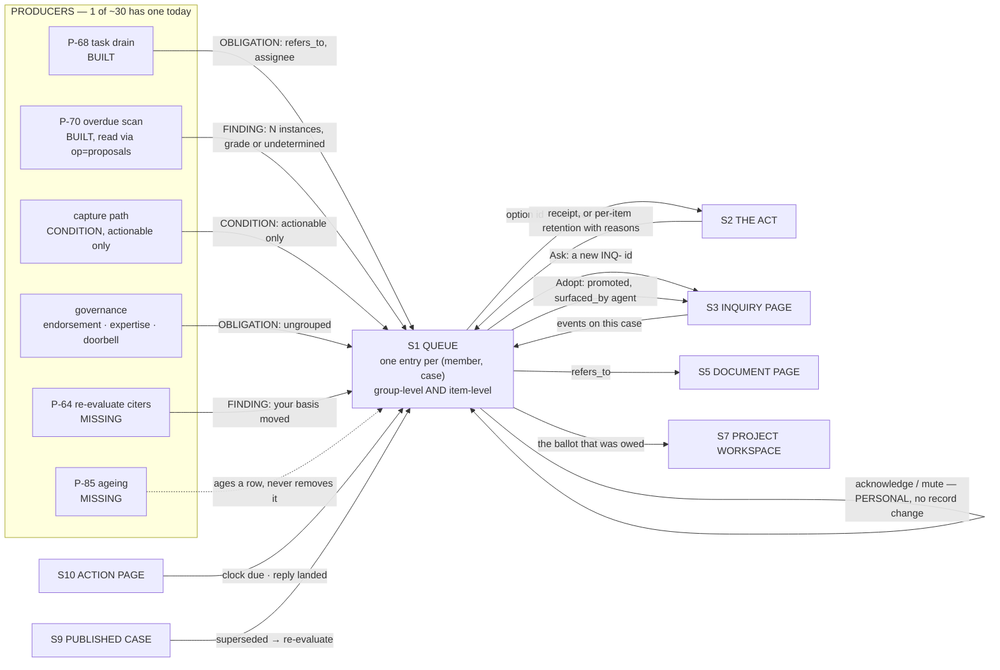
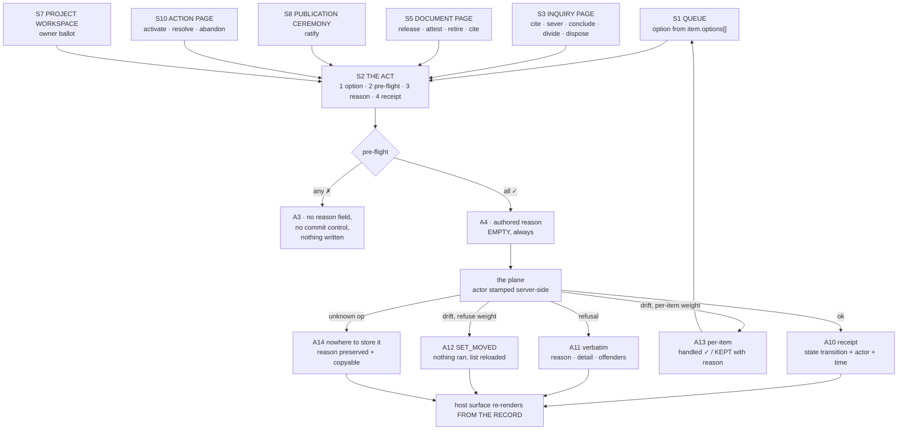
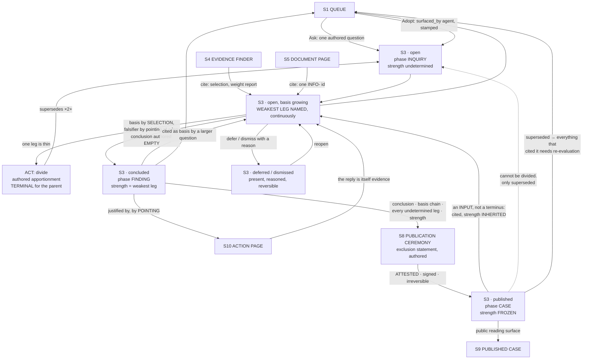

# SB-CORE — storyboards for the three core surfaces: QUEUE · ACT · INQUIRY PAGE

Written 2026-08-01 (design pass). **This is DESIGN, not measurement.** Where a surface
draws against something that exists today it names the file, line or op, taken from the
Round A foundations. Where it needs something that does not exist it is marked **GAP**
with the op or column it would need. Where I could not settle a question from the
repository I write *I don't know* rather than inventing an answer.

**Read first, and this file does not restate them:** `UI-BASELINE.md` (what exists
TODAY — every wireframe below is drawn against that reality, not against the plan),
`DATA-MODEL.md` (the inquiry tables and columns), `PROCESS-CATALOGUE.md` (the P-numbers),
`CAPABILITIES.md` (what gates each act), `NOTIFICATIONS.md` (the item contract and the
three classes), `architecture/BIO_Interaction_Constructs_v0_1.md` v0.2 (ONE queue grouped
by case, ONE act, the weight ladder, `undetermined`), `architecture/BIO_Case_Making_v0_1.md`
(the collapse, division, strength, completeness), `civicos-ui/tokens.css`.
Sibling: `JOURNEY-PRIMARY.md`, whose S1 / S2 / S3 these three surfaces are.

This file claimed no area in `CLAIMS.md`: it creates one document and edits nothing else,
following the precedent its four Round A siblings set in their own headers.

---

## 0 · The constraints every frame below is answerable against

A violation here is a defect, not a trade-off. Each surface carries a CONSTRAINT CHECK
naming where it discharges each one.

| # | constraint |
| --- | --- |
| **C1** | Never prefill, draft, template or suggest a justification, reason or framing. A surface MAY assemble a member's own prior authored words; it may not generate new ones. |
| **C2** | `undetermined` is STATED, never hidden, guessed past, or dressed as an error. |
| **C3** | A SUPPORTED case is easy to state; an UNSUPPORTED one is hard to state. |
| **C4** | A technical complication the system can classify is never surfaced to a member as a choice. |
| **C5** | Options on an item come from the PRODUCER, never from a surface-side map. |

### 0.1 How to read the wireframes

Real content throughout. The bundle ids are the ones `JOURNEY-PRIMARY.md` §6 read from
`BIOSMOKE6-MIGRATION.log` and are **real ids in this record**; as there, **I have not read
those documents and make no claim about what they say** — the substance of the sewer
scenario is a plausible construction for the purpose of showing the surfaces.

Type register, from `tokens.css:60-64` — **serif = judgment, sans = plain speech,
mono = machine fact**. In the frames:

```
«…»    serif   --font-record  · titles, questions, conclusions, the strength sentence
 …     sans    --font-ui      · everything the surface says in its own voice
 ⟨…⟩   mono    --font-fact    · ids, hashes, grades, dates, counts, capability tokens
```

Rules, never shadows (`--hair`, `--hair-strong`); radius ceiling 2px (`--r-2`), so nothing
below is a pill; `--signal` (`#B3441E`) is attention ONLY — clock, changed source,
refusal — and is drawn here as `‼`; `--verdigris` is the one primary action, drawn as a
`[ button ]`. `--tint-muted` (deferred, dismissed, aged) is drawn as `·grey·`.

### 0.2 State counts

| surface | states drawn |
| --- | --- |
| **S1 QUEUE** | **15** |
| **S2 ACT** | **15** |
| **S3 INQUIRY PAGE** | **16** |

---
---

# S1 · THE QUEUE

## 1.1 STORYBOARD

**Q0 · Loading.** One line, no skeleton, no spinner past `--dur-2` (200 ms ceiling).
Three feeds are read in parallel and each may answer or fail on its own (the pattern
`renderMembers` already uses, `app.html:4907-4912`), so this state is brief and is
replaced feed by feed, never all at once.

```
┌────────────┬─────────────────────────────────────────────────────────────┐
│ Queue      │  «Your queue»                                               │
│ Record     │                                                             │
│ Search     │  Loading…                                                   │
│ Subjects   │                                                             │
│ Inquiries  │                                                             │
│ Projects   │                                                             │
│ Review     │                                                             │
│ Monitoring │                                                             │
│ Actions    │                                                             │
│            │                                                             │
│ + Ask      │                                                             │
└────────────┴─────────────────────────────────────────────────────────────┘
```

**Q1 · Empty — the all-clear.** Shown only when EVERY feed answered and every one was
empty. If any feed failed this is Q7, never this. (Today's Home has exactly this rule at
`app.html:5056-5060` and it is the right one.)

```
│  «Your queue»                                                            │
│  ─────────────────────────────────────────────────────────────────────── │
│  Nothing wants you right now.                                            │
│                                                                          │
│  Three feeds answered and all three are empty: nothing is addressed to   │
│  you, nothing is with anyone else that concerns your cases, and the      │
│  record has surfaced nothing you have not judged.                        │
│                                                                          │
│  [ Ask a question ]                                                      │
```

**Q2 · Populated — grouped by case, both item classes present.** The core frame. One
standing entry per `(member, case)` while that case has unhandled events (DEC-10). The
group is handled at group level AND item by item — the SELECTION-SCOPED modifier, used
here for the first time outside the record surfaces.

```
│  «Your queue»                                       ⟨7 items · 3 cases⟩   │
│  Things that want you, grouped by the case they belong to.               │
│  ═══════════════════════════════════════════════════════════════════════ │
│                                                                          │
│  ▾ «Is sewer service charge revenue being spent on things that are       │
│     not sewers?»                              ⟨INQ-2026-0004⟩  3 items   │
│    ┌───────────────────────────────────────────────────────────────────┐ │
│    │ ☐  OBLIGATION                                      ⟨N-03 · 2d⟩    │ │
│    │    The authority behind this capture is undetermined and needs    │ │
│    │    to be named.                                                   │ │
│    │    on ⟨INFO-2026-0116-ordinance-13035-cms⟩                        │ │
│    │    Yours · assigned by the record, not by a person                │ │
│    │    [ Name the authority ]  [ Forward… ]  [ Resolve… ]             │ │
│    ├───────────────────────────────────────────────────────────────────┤ │
│    │ ☐  FINDING · surfaced by the record — not yet judged  ⟨N-11 · 6d⟩ │ │
│    │    A required successor is missing: minutes have not followed     │ │
│    │    the 4 August meeting.                                          │ │
│    │    ⟨58 instances · progression: meeting → minutes⟩                │ │
│    │    Nobody has yet decided this is worth pursuing.                 │ │
│    │    [ Adopt as an inquiry ]  [ Defer… ]  [ Dismiss… ]              │ │
│    ├───────────────────────────────────────────────────────────────────┤ │
│    │ ☐  CONDITION                                       ⟨N-22 · 4h⟩ ‼  │ │
│    │    A capture stopped at this platform's ceiling with 14 parts     │ │
│    │    outstanding. Your action can finish it.                        │ │
│    │    on ⟨INFO-2026-0100-acfr-fy2023-24-fund-statements⟩             │ │
│    │    [ Finish collecting it ]  [ Acknowledge ]  [ Mute this kind ]  │ │
│    └───────────────────────────────────────────────────────────────────┘ │
│    3 selected on this case → [ Apply to selection ]   [ Mute this case ] │
│                                                                          │
│  ▸ «Whether Ordinance 13035 authorises that transfer»                    │
│                                               ⟨INQ-2026-0005⟩  2 items   │
│  ▸ «Sewer franchise diversion»       ⟨PROJ-2026-0002⟩  2 items           │
│                                                                          │
│  ─── Not attached to a case ──────────────────────────────────────────── │
│    ☐  OBLIGATION  You owe an endorsement on a pending administrator      │
│       addition.                                    ⟨N-16 · 1d⟩           │
│       [ Go to the ballot ]                                               │
```

TYPE — the case title is **serif** (a member's own authored question, which is judgment);
class labels, summaries and option labels are **sans**; ids, ages, instance counts, `N-`
kinds are **mono**. The `‼` is `--signal` and appears on exactly one row: the CONDITION
with a clock. No unread badge is the primary signal and no severity colour is used —
`--signal` marks the clock, not the importance.

**Q3 · Item expanded — detail and basis.** Disclosure in place, not a dialog. `detail`
and `basis` come from the producer (`NOTIFICATIONS.md` item contract); the surface
renders them and paraphrases nothing. D-57 is the cautionary case: the UI printed the
plane's basis verbatim and a member read a fabricated claim, so the fix is that the
PRODUCER must be able to show its derivation or say it cannot — not that the surface
should soften it.

```
│    │ ☑  FINDING · surfaced by the record — not yet judged  ⟨N-11 · 6d⟩ │ │
│    │    A required successor is missing: minutes have not followed     │ │
│    │    the 4 August meeting.                                          │ │
│    │    ▾ Why the record believes this                                 │ │
│    │      The progression ⟨meeting → minutes⟩ declares minutes as a    │ │
│    │      required successor within ⟨14 days⟩. A meeting was placed    │ │
│    │      at ⟨2026-08-04⟩ from ⟨INFO-2026-0109-legistar-sewer-…⟩.      │ │
│    │      No document has been threaded onto the successor stage.      │ │
│    │      ⟨basis: declared flow vs observed placements⟩                │ │
│    │    ▾ The other 57 instances                                       │ │
│    │      ⟨2026-07-21 · 2026-07-07 · 2026-06-16 · … show all⟩          │ │
│    │    [ Adopt as an inquiry ]  [ Defer… ]  [ Dismiss… ]              │ │
```

**Q4 · An item whose basis is `undetermined`.** The primitive, rendered identically to
its five other appearances. It is not an error tint and not a shrug.

```
│    │ ☐  FINDING                                        ⟨N-08 · 11d⟩    │ │
│    │    The source at this address was reached and its bytes differ    │ │
│    │    from what the record holds.                                    │ │
│    │    ▾ Why the record believes this                                 │ │
│    │      ⟨undetermined⟩ — the comparison ran and the recogniser        │ │
│    │      could not establish which of the two captures is the later.  │ │
│    │      What we do not know: which change came first.                │ │
│    │      Why we do not know it: neither capture carries a dated       │ │
│    │      server header the record could rely on.                      │ │
│    │    [ Open the document ]  [ Defer… ]  [ Dismiss… ]                │ │
```

**Q5 · Ungrouped.** Already visible at the foot of Q2. Stated separately because the
rule is load-bearing: an item whose `case` is `null` sits ungrouped and is NOT invented a
home. The relevance filter that decides an event is worth notifying at all is "does this
instance connect to an inquiry or a project" (DEC-10) and the grouping key is that SAME
connection, so an ungrouped item is by definition one that passed the filter another way
— governance and membership items, mostly.

**Q6 · An aged item.** D-79: unactioned, an item AGES with a recorded reason; it does not
vanish. Drawn `--tint-muted`, kept in place, carrying the reason.

```
│    │ ·  FINDING                            ⟨N-11 · 94d⟩          ·grey· │ │
│    │ ·  A required successor is missing: minutes have not followed      │ │
│    │ ·  the 3 May meeting.                                             │ │
│    │ ·  Aged to deferred on ⟨2026-07-30⟩ by the record.                 │ │
│    │ ·  Reason: no member acted on this for ⟨90 days⟩.                  │ │
│    │ ·  [ Reopen… ]  [ Dismiss… ]                                       │ │
```

**GAP — the ageing job does not exist.** `P-85` in `PROCESS-CATALOGUE.md` is MISSING;
`app.html:5126-5133` renders an ageing line only if the task's own history already
carries one, and nothing writes one. This frame is drawn because the row must have a
place to land; it will be empty on every plane until P-85 has a producer.

**Q7 · Partial — one feed did not answer.** Each feed degrades on its own and the surface
says which. No count is shown rather than a wrong one (the rule `app.html:4990-4991`
already states for the tasks card).

```
│  «Your queue»                                    ⟨5 items · 2 cases⟩     │
│  ───────────────────────────────────────────────────────────────────────  │
│  ⚠ Findings surfaced by the record could not be read with this account.  │
│    reason ⟨forbidden for token class⟩                                    │
│    Everything below is what IS readable. The count excludes findings.    │
│                                                                          │
│  ▾ «Is sewer service charge revenue being spent on things that are       │
│     not sewers?»                              ⟨INQ-2026-0004⟩  2 items   │
│    …                                                                     │
```

**Q8 · A feed's op is not on this plane.** Distinct from Q7 and it must be, because
today's Proposals screen maps both to one banner (`app.html:5849-5854`, `UI-BASELINE`
dead-end 11) and a member cannot tell a missing capability from a broken one.

```
│  ⓘ One kind of item cannot be listed on this instance.                   │
│    The record's derived findings are read through a capability this      │
│    plane has not shipped. The rendering and the acts are built and are   │
│    proven against the real item shape; nothing is being hidden from      │
│    you and nothing was lost.                                             │
│    [ Retry ]                                                             │
```

Note the retry: today there is none anywhere (`UI-BASELINE` §5.3 item 9) and its absence
is one of the two things that makes an error terminal.

**Q9 · Error, whole surface.** The rail survives; a Retry is offered; the crumb is not
destroyed. `errPane` today replaces `#content` wholesale with no retry, which is the
defect this frame corrects.

```
│  «Your queue»                                                            │
│  ─────────────────────────────────────────────────────────────────────── │
│  ‼ Could not reach the plane.                                            │
│    reason ⟨—⟩  error ⟨TypeError: Failed to fetch⟩                        │
│    detail ⟨—⟩                                                            │
│    Nothing was written and nothing was lost.                             │
│    [ Retry ]                                                             │
```

**Q10 · Selection made, group level.** The act about to run is named with its rung and
its APPLICATION MODE before anything is chosen, because a member must be able to tell
which kind they are about to perform.

```
│    ☑ 3 selected on «Is sewer service charge revenue…»                    │
│    ┌───────────────────────────────────────────────────────────────────┐ │
│    │ Apply to 3 items                                                  │ │
│    │ Only options every selected item offers are listed here.          │ │
│    │   ○ Defer…            reasoned · per-item                         │ │
│    │   ○ Dismiss…          reasoned · per-item                         │ │
│    │ Each item succeeds or is kept here with the reason it was kept.   │ │
│    │ [ Continue ]  [ Cancel ]                                          │ │
│    └───────────────────────────────────────────────────────────────────┘ │
```

**The intersection rule is C5's consequence and is the interesting part.** The surface may
offer at group level only the options **every** selected item's producer published. It may
not synthesise a union, and it may not offer an option no producer named. When the
intersection is empty the panel says so and offers nothing.

**Q11 · Mid-act, per-item outcome — some retained with a reason.** The third weight. This
is the frame `NOTIFICATIONS.md` calls the sharpest part, and it is the one a naive
implementation loses.

```
│    Applied «Defer» to 3 items · 2 handled · 1 kept here                  │
│    ┌───────────────────────────────────────────────────────────────────┐ │
│    │ ✓ Minutes have not followed the 4 August meeting.                 │ │
│    │   Deferred · your reason recorded · ⟨2026-08-01T14:22:07Z⟩        │ │
│    │ ✓ Minutes have not followed the 21 July meeting.                  │ │
│    │   Deferred · your reason recorded · ⟨2026-08-01T14:22:07Z⟩        │ │
│    │ ‼ The authority behind this capture is undetermined…              │ │
│    │   KEPT. reason ⟨NOT_YOURS⟩                                        │ │
│    │   detail ⟨this task is assigned to Marta⟩                         │ │
│    │   This one stayed in your queue so you can take a different       │ │
│    │   action on it.                                                   │ │
│    └───────────────────────────────────────────────────────────────────┘ │
```

Retention **must** carry the reason, or the member re-applies the same action and it fails
the same way in silence. The reasons are already named refusals in the plane and render in
its own words: lacks the capability for that item · the item moved under them (drift,
classified from the manifest's `writer` and `operation`) · doctrine refuses it
(`SEVERED_EDGE`, retire-refuses-cited, dispose-refuses-`elevated`) · a precondition is
absent (`NO_REASON`).

**Q12 · Refused whole — `refuse` weight, nothing ran.** Distinct from Q11 and the
distinction is the whole job of the SELECTION-SCOPED modifier.

```
│    ‼ Nothing was applied.                                                │
│      reason ⟨SET_MOVED⟩                                                  │
│      detail ⟨2 of the 3 items you selected changed after you chose them⟩ │
│      This act is all-or-nothing, so it stopped and handed over nothing.  │
│      It cannot half-run.                                                 │
│      ⟨INFO-2026-0116-ordinance-13035-cms⟩ moved · writer ⟨op=dispose⟩    │
│      ⟨INFO-2026-0100-acfr-fy2023-24-fund…⟩ moved · writer ⟨op=promote⟩   │
│      [ Reload the queue ]                                                │
```

**Q13 · Muted group, and snoozed.** Mute is PERSONAL; dismiss is a RECORD ACT; they are
never one control (D-125's first-named hazard). The mute is scoped to the kinds present
when it was made, and the surface says so in that sentence, because otherwise "mute this
case" becomes a permanent blindfold.

```
│  ▸ «Sewer franchise diversion»       ⟨PROJ-2026-0002⟩       ·muted·      │
│    Muted by you on ⟨2026-07-28⟩ for the 2 kinds present then.            │
│    A new kind of event on this case will still reach you.                │
│    This is yours only. Other members still see these items.              │
│    [ Unmute ]                                                            │
```

**Q14 · A credential that cannot act.** The options are **ABSENT**, not greyed. The item
still renders — reading is not gated — and one sentence says what is missing and what to
do about it, in the shape `NOT_CAPABLE` uses.

```
│    │ ☐  FINDING · surfaced by the record — not yet judged  ⟨N-11 · 6d⟩ │ │
│    │    A required successor is missing: minutes have not followed     │ │
│    │    the 4 August meeting.                                          │ │
│    │    Judging what the record surfaces is a named member's decision. │ │
│    │    This credential can read the queue and cannot act on it.       │ │
```

No checkbox column, no action row, no disabled buttons anywhere in this state.

**Q15 · The entry act.** The one thing a member may always start from the queue, and it
takes a question and nothing else — no type choice, no counterparty, no risk tier. It
always creates an `inquiry` (HARD 1).

```
│  ┌──────────────────────────────────────────────────────────────────┐    │
│  │ Ask                                                              │    │
│  │ «                                                              » │    │
│  │ «                                                              » │    │
│  │ Write the question in your own words. Nothing is suggested.      │    │
│  │                                                                  │    │
│  │ ▾ Questions you have asked about this subject before  ⟨2⟩         │    │
│  │   «Where does the sewer service charge go?»  ⟨INQ-2026-0002⟩      │    │
│  │   «Who signs a fund transfer?»               ⟨INQ-2026-0003⟩      │    │
│  │   Shown so you can see what you already asked. Not to copy.      │    │
│  │                                                                  │    │
│  │ reversible                                     [ Ask ]  [ Cancel ]│   │
│  └──────────────────────────────────────────────────────────────────┘    │
```

The prior-questions list is the **only** assistance offered and it is the permitted kind:
a member's OWN prior authored words, assembled, never generated. The label "Not to copy"
is the same fence `openProposalAdopt` already draws at `app.html:6055-6059`.

### CONSTRAINT CHECK · QUEUE

| | where discharged |
| --- | --- |
| **C1** | Q15 offers only the member's own prior questions, marked as such. No option label, summary or reason anywhere is composed by the surface. |
| **C2** | Q4 renders an undetermined basis in the primitive's one voice — *what we do not know, and why we do not know it*. |
| **C3** | Not this surface's job directly; it serves it by making a FINDING look derived (Q2, Q3) so nobody mistakes an unjudged machine output for a supported claim. |
| **C4** | CONDITIONs with disposition *recorded* never appear; *noticed* appear as status where the thing lives, not here. Only *actionable* earn a row — Q2's third item is one, and it says what the member's action changes. A paced governor is never a "Retry?" |
| **C5** | Every option in every frame is `item.options[]`. Q10's group panel intersects producer options and synthesises nothing. **This is the constraint the surface cannot honour today — see GAP-Q2.** |

## 1.2 JUSTIFICATION

**Why this surface exists.** It is the ATTENTION layer, and nothing else routes work to a
person. It is the sharpest measured gap in M8: the record can be obliged to ask a member
something and has nowhere to ask. The plane half already ships (`tasks`, `taskforward`,
`taskresolve`, routing through `member_expertise`, deduped on `(refers_to, kind)`).

**Path verb.** Primarily **questioning** — P-02 (orient), P-08 (ask), P-09 (triage),
P-12 (judge a derived proposal), plus the off-path P-13 (dispatch a task addressed to me).
It is also where every other verb RE-ENTERS: `JOURNEY-PRIMARY.md`'s flow has S10 → S1n and
S3b → S1n and S9 → S1n, so the queue is the return address of the whole journey.

**Journey step.** S1. It is the first surface in the journey and the one a member opens by
habit.

**What is lost if it is merged into a neighbour.**

- **Merged into the record list** (which is where a triage affordance would naturally
  drift): the record is what the group HOLDS; the queue is what wants a PERSON. A list of
  everything held, with some rows carrying buttons, cannot express "assigned to Marta",
  cannot age a row with a reason, and cannot hold a CONDITION about our own machinery
  at all — a condition is not a record row.
- **Merged into the inquiry page**: the grouping key would become the page you are on,
  which destroys the ungrouped items entirely (governance, membership, the doorbell) and
  makes the queue reachable only by already knowing which case you wanted.
- **Split back into three screens, which is the status quo** (Home + Tasks + Proposals,
  `app.html:5039`, `:5151`, `:5806`): the member learns three inboxes, three vocabularies
  of "handled", and the per-class scope rule — obligation resolved leaves everyone's list,
  finding disposed is a record act, condition acknowledged is personal — becomes three
  half-remembered conventions instead of one visible rule. That is exactly the drift the
  v0.2 collapse was for.

## 1.3 DATA MODEL BEHIND IT

### Reads, as built

| table · column | via op | what the surface does with it |
| --- | --- | --- |
| `tasks` — `id, kind, refers_to, capture_sha, subject_text, subject_desc, locators, assignee, assignee_role, status, created, resolved_at, history` (`schema.mjs:491`) | `op=tasks` | every OBLIGATION row. `status !== 'resolved'` is live; `assignee === me` is Yours; `assignee === 'unassigned'` is honest, never a phantom (D-98) |
| `members` — `member_id, cover, handle, role, status, capabilities` (`schema.mjs:145` + ALTERs) | `op=memberlist` | the forward picker (active members only); the "with **X**" sentence on someone else's item |
| `progression_defs` / `progression_stages` / `progression_instances` / `proposal_dispositions` (`schema.mjs:851`, `:867`, `:906`, `:1019`) | `op=proposals` | every derived FINDING row, aggregated by `(progression_key, stage_key)` into ONE item carrying N instances — one check across 58 contracts is ONE finding with 58 instances, never 58 items (D-79) |
| `bundles` — `bundle_id, object_type, title, current_state` (`schema.mjs:5`) | `op=list`, `op=projection` | the case title on each group header; the pointer target's title |
| session — `capabilities`, `member`, `handle`, `administer`, `session` | `op=whoami` | which options render at all (§1.4) |

### Writes, as built

| table · column | via op | rung |
| --- | --- | --- |
| `tasks.status`, `tasks.history` (append-only JSON array) | `op=taskresolve` (`store.mjs:7000`) | *unassigned by any document* — see F-5 |
| `tasks.assignee`, `tasks.assignee_role`, `tasks.history` | `op=taskforward` (`store.mjs:6980`) | *unassigned* |
| `proposal_dispositions` — `(progression_key, stage_key), state, reason, decided_by, at` (`schema.mjs:1019`) | `op=proposedispose` (`store.mjs:4384`) — refuses `NO_REASON` at `:4354`, `NO_DECIDER` at `:4363` | **reasoned**, enforced by the store though named by no document |
| `bundles` + `refs` + `files` + `history` + `manifest` (a whole-image write) | `op=promote` — the ADOPT path and the ASK path both mint a bundle | *unassigned* |
| `selections` / `selection_items` (`store.mjs:348`, `:363`) | `op=select` → the act (§2) | — |

### Ops it calls

`whoami` · `tasks` · `taskforward` · `taskresolve` · `proposals` · `proposedispose` ·
`memberlist` · `list` · `projection` · `allocid` · `promote` · `select`.

Nine of the twelve are reached by `app.html` today. `proposals` and `proposedispose` are
treated as delegated and may be absent (`UI-BASELINE` §1.12); `select` is reached only by
the release dialog.

### GAPs

| id | what is missing | the op or column it would need |
| --- | --- | --- |
| **GAP-Q1** | **The `class` axis.** `tasks` carries `kind` and nothing that says FINDING / OBLIGATION / CONDITION. Findings arrive from a different op entirely and CONDITIONs have no carrier at all. | a `class TEXT NOT NULL` column on the item producer, and one op that returns all three classes in the item contract's shape — call it `op=queue`. Until then a surface must decide the class from the op it came from, which is a surface-side map and breaks **C5** by a different door |
| **GAP-Q2** | **Producer-published `options[]`.** Nothing anywhere publishes what may be done to an object right now. `app.html`'s `TASK_KIND_UI` (`:5100-5106`) maps exactly one kind and title-cases the rest; `DISPOSITIONS` (`:4220`) is a surface-side table. | the `options: [{id, label, weight, needs}]` array on every item, published by the generator. Precedent: GitHub's Checks API declares `{label, description, identifier}` actions the surface renders and dispatches back. Same finding as `JG-9` |
| **GAP-Q3** | **The grouping key.** No column relates a task or a finding to the inquiry or project it belongs to. `tasks.refers_to` points at the SUBJECT, not the case. | `case TEXT` on the item (a bundle id), plus the relevance filter that populates it — `P-88`, MISSING |
| **GAP-Q4** | **Per-member notification state.** Snooze, mute-scoped-to-kinds, last-looked. `tasks` carries no per-member state and no clock. | a `queue_state (member_id, case_id, muted_kinds TEXT, snoozed_until TEXT, last_seen TEXT)` table, PK `(member_id, case_id)`; and `P-87` to re-notify on the stage's OWN declared interval, never a new constant |
| **GAP-Q5** | **`per-item` application weight.** The plane implements `refuse` and `report` (`store.mjs:1183-1192`). The third does not exist. | a third value in the weight vocabulary and a per-item outcome array on the response: `[{id, ok, reason, detail}]` |
| **GAP-Q6** | **~29 of ~30 generators have no producer.** P-68, the task drain, is the only one. | per-generator work, catalogued in `NOTIFICATIONS.md`; not a decision to take in the abstract |
| **GAP-Q7** | **Ageing.** P-85. Nothing moves an unactioned finding to deferred with a recorded reason. | a CLOCK consumer on the existing alarm; the interval is unruled |

## 1.4 CAPABILITIES

**What a member may do here.**

| act | capability | enforced at |
| --- | --- | --- |
| read the queue | none — any session of an admitted class | `op=tasks`, `op=proposals` are non-mutating and not in `NEEDS` |
| resolve or forward a task | **none — IDENTITY, not capability** | the store: `NOT_YOURS` (`store.mjs:6949`), `NO_ACTOR` (`:6963`), `ALREADY_RESOLVED` (`:6966`), `ALREADY_THEIRS` (`:6971`). The actor is stamped by the plane from the session, never sent |
| adopt / defer / dismiss a finding | `contribute` | `NEEDS.proposedispose` and `NEEDS.promote` (`index.mjs:503`, `:355`) |
| ask a question (mint an inquiry) | `contribute` | `NEEDS.promote`, `NEEDS.allocid`, `NEEDS.lease` |
| acknowledge or mute a condition | none — personal state | GAP-Q4; nothing enforces it today because nothing stores it |
| hold a selection | none stated (`NEEDS.select` is an explicit `null` with a written reason) | the store: `NO_OWNER` (`:1103`), `NOT_YOURS` (`:1284`) |

**What is ABSENT, not greyed.** §5 of Membership v2: *"a capability a member does not hold
is absent from their interface, not present and refused"*, and `index.mjs:676-680` accepts
both halves — the interface hides it AND the plane refuses it anyway, *"because a hidden
button is a courtesy and not a boundary."*

- Without `contribute`: **the entire action row on every item** (Q14), the group-level
  Apply panel, the checkbox column, and the `+ Ask` entry point. The items still render.
- The read-only sentence appears **once per surface**, not once per item, and it names the
  capability in plain speech, not as a token. This corrects a live defect: `app.html:4083`
  and `:6475` show the raw token `contribute` to a member on two screens.
- The rail's `+ Ask` button must be absent without `contribute`. `buildRail` appends
  `.add` unconditionally today (`app.html:862`) — finding **F-7**.

**Refusal wording when the plane refuses anyway.** Rendered VERBATIM with the offenders
named; the surface adds the routing sentence and nothing else.

```
‼ Refused. Nothing was written.
  reason ⟨NOT_CAPABLE⟩
  needs  ⟨contribute⟩       held ⟨—⟩
  detail ⟨ask an administrator to grant it rather than looking for another route⟩
```

For the four refusals that carry no `reason` (finding **F-3**), the surface can do nothing
but print the string, because there is no code to branch on:

```
‼ Refused.
  ⟨this operation requires a machine credential, not a signed-in session⟩
  There is no action available to you from here.
```

That last line is honest and is a defect being displayed, not designed. **F-3 should be
fixed in the plane rather than dressed in the surface.**

## 1.5 WORKFLOW EDGES

**INTO the queue**, and what each edge carries:

| from | carrying |
| --- | --- |
| P-68 the task drain (the one live generator) | an OBLIGATION with `refers_to`, `subject_text`, an assignee or `unassigned` |
| P-70 the overdue scan, read through `op=proposals` | a FINDING aggregated by `(progression_key, stage_key)` with N instances and a grade or `undetermined` |
| S3 the inquiry page | events on a case a member is working — this is the DEC-10 grouping key arriving |
| S10 the action page | the clock coming due, and a counterparty's reply landing |
| S9 the published case | supersession, and the re-evaluation obligation on everything that cited it (P-64) |
| the capture path | a CONDITION whose disposition is *actionable* — a ceiling reached with work outstanding |
| governance | endorsement owed, expertise awaiting confirmation, a knock at the doorbell |

**OUT of the queue**, and what each edge carries:

| to | carrying |
| --- | --- |
| S2 the ACT | one option id + the item(s) it applies to + the application mode |
| S3 the inquiry page | a new `INQ-` id (Ask), or an adopted finding promoted to an inquiry with `surfaced_by: agent` stamped by the plane |
| S5 the document page | `refers_to`, when the item's home is a document |
| S7 the project workspace | a ballot the item said was owed |
| nowhere — handled in place | a CONDITION acknowledged (personal), a group muted (personal) |



---
---

# S2 · THE ACT

One motion, instantiated inside S1, S3, S5, S8 and S10. Four panes in fixed order:
**the option chosen · the pre-flight refusal list · the authored reason · the receipt.**
It is not a screen and it has no route.

## 2.1 STORYBOARD

**A0 · Invoked — the option, restated.** The surface never re-labels the option; it
repeats the producer's own `label` and states the subject and the rung.

```
     ┌────────────────────────────────────────────────────────────────┐
     │ Defer this                                                     │
     │ ────────────────────────────────────────────────────────────── │
     │ «Is sewer service charge revenue being spent on things that    │
     │  are not sewers?»                          ⟨INQ-2026-0004⟩     │
     │                                                                │
     │ 1 · What you chose        ● Defer      ○ Dismiss               │
     │ 2 · What this will refuse          checking…                   │
     │ 3 · Your reason                    ─                           │
     │ 4 · Receipt                        ─                           │
     │                                                                │
     │ weight   reversible · REASONED · terminal · attested           │
     │                                            [ Cancel ]          │
     └────────────────────────────────────────────────────────────────┘
```

**A1 · Pre-flight running.** Brief, and it does not block the reason field from appearing
— but the commit button stays absent until it has answered.

**A2 · Pre-flight CLEAN.** ✓ rows, each naming what was checked, in the store's own
refusal order. This is a mirror of the plane's table, and the mirror is itself a hazard
worth naming: `disposePreflight` (`app.html:4232-4257`) is a pure function mirroring
`store.mjs`'s `LEGAL` table, and `store.mjs:1571-1579` holds a SECOND copy of that table
under a comment claiming it is the catalog's own. Three copies of one rule.

```
     │ 2 · What this will refuse                                      │
     │     ✓ Defer is a disposition this record recognises            │
     │     ✓ A reason will be given                                   │
     │     ✓ ⟨open → deferred⟩ is a legal move for this inquiry       │
     │     Nothing here will be refused.                              │
```

**A3 · Pre-flight REFUSED, BEFORE the act runs.** The required frame. The commit button
is **absent**, not disabled, and the offenders are NAMED.

```
     ┌────────────────────────────────────────────────────────────────┐
     │ Dismiss this                                                   │
     │ ────────────────────────────────────────────────────────────── │
     │ 1 · What you chose        ○ Defer      ● Dismiss               │
     │                                                                │
     │ 2 · What this will refuse                                      │
     │     ✓ Dismiss is a disposition this record recognises          │
     │     ✓ A reason will be given                                   │
     │     ‼ ⟨ILLEGAL_TRANSITION⟩                                     │
     │       This inquiry was published on ⟨2026-07-14⟩. A published  │
     │       case cannot be dismissed, divided or withdrawn. It can   │
     │       only be superseded by a later inquiry that cites it.     │
     │       offender ⟨INQ-2026-0004⟩  state ⟨published⟩              │
     │                                                                │
     │ 3 · Your reason                    not asked for               │
     │ 4 · Receipt                        ─                           │
     │                                                                │
     │ This will not run. Nothing has been written.                   │
     │                                            [ Close ]           │
     └────────────────────────────────────────────────────────────────┘
```

**Two properties of this frame are load-bearing.** First, the reason field is **not shown
at all** — a member must never author text into a dialog that was already going to refuse,
which is precisely the dead end `UI-BASELINE` §5.3 item 12 measures on the proposal path
("your reason was not lost — it simply has nowhere to be stored", with the reason stranded
in the box). Second, the pre-flight is re-run as the REAL gate at commit and refuses in
the surface without reaching the plane (`app.html:4355-4363`) — so the display and the
gate are one thing, not a preview of one.

**A4 · The authored reason.** Empty. Always empty.

```
     │ 3 · Your reason                                                │
     │     ┌────────────────────────────────────────────────────────┐ │
     │     │ «                                                    » │ │
     │     │ «                                                    » │ │
     │     └────────────────────────────────────────────────────────┘ │
     │     ⟨0 / 160⟩                                                  │
     │     This becomes part of the record and is read later as your  │
     │     own words. Nothing is suggested and nothing is drafted.    │
```

**A5 · Reason grammar refused, live.** The counter itself carries the refusal
(`relValidate`, `app.html:4136-4147`), so the member is not told at submit what they could
have been told at keystroke. **C4 note:** a quote character is not a technical complication
the system can classify away — it is a constraint on the record's own grammar, and stating
it is correct.

```
     │     ⟨41 / 160⟩  ‼ a double quote cannot be stored in this field │
```

**A6 · The four rungs.** One ladder, learned once, read everywhere. Rendered identically
on every act; only the emphasised rung moves.

```
  reversible   reversible · reasoned · terminal · attested
               This can be undone.

  reasoned     reversible · REASONED · terminal · attested
               A reason is required and becomes part of the record.

  terminal     reversible · reasoned · TERMINAL · attested
               This cannot be walked back inside the record.

  attested     reversible · reasoned · terminal · ATTESTED
               Irreversible, public, and it needs your key.
```

**A7 · The ATTESTED variant — the ceremony.** One thing to learn, two things to feel. The
top rung carries its own ceremony: what becomes permanent, what it does and does not
claim, an explicit key act. This is the compromise the v0.2 collapse actually supports.

```
     ┌════════════════════════════════════════════════════════════════┐
     ║ Publish this as a case                                         ║
     ║ ══════════════════════════════════════════════════════════════ ║
     ║ 1 · What becomes permanent                                     ║
     ║     «Sewer service charge revenue was transferred to the        ║
     ║      general fund in FY2023-24.»                                ║
     ║     ⟨INQ-2026-0004⟩ at ⟨sha256:9f2c…a107⟩                       ║
     ║     A published hash answers forever. This cannot be edited,    ║
     ║     divided, retracted or withdrawn.                            ║
     ║                                                                ║
     ║ 2 · What this claims, and what it does NOT                     ║
     ║     It claims: these bytes, at this address, retrieved on this  ║
     ║     date, by this route.                                        ║
     ║     It does NOT claim the documents are authentic municipal     ║
     ║     records, and it does not claim the conclusion is true.      ║
     ║                                                                ║
     ║ 3 · What this will refuse             ✓ ✓ ✓  nothing            ║
     ║ 4 · What you excluded, and why        ⟨authored · 2 items⟩      ║
     ║ 5 · Your key                                                    ║
     ║     ┌────────────────────────────────────────────────────────┐ ║
     ║     │ ⟨-----BEGIN SSH SIGNATURE-----                        ⟩ │ ║
     ║     └────────────────────────────────────────────────────────┘ ║
     ║     Signed on your own machine. Nothing is sent anywhere by     ║
     ║     the signing page.                                           ║
     ║                                                                ║
     ║ attested                             [ Sign and publish ]      ║
     └════════════════════════════════════════════════════════════════┘
```

The double rule is `--rule-strong`, the one place the fence band's weight is borrowed. No
other act uses it.

**A8 · The SELECTION-SCOPED variant.** Same four panes; the subject is a set and the
application mode is named before the member commits.

```
     │ Retire 12 documents                                            │
     │ ────────────────────────────────────────────────────────────── │
     │ 1 · The set you saw           ⟨12 items · held until 14:52Z⟩   │
     │     This acts on the 12 you selected, and never on rows that   │
     │     arrived after. A selection only ever shrinks.              │
     │ 2 · What this will refuse                                      │
     │     ‼ ⟨CITED⟩ 2 of these are still relied on by live citations │
     │       ⟨INFO-2026-0100-acfr-fy2023-24-fund-statements⟩          │
     │       ⟨INFO-2026-0099-auditor-report-feb-2022⟩                 │
     │     This act is all-or-nothing. It will stop and hand over     │
     │     nothing, so it cannot half-run.                            │
     │ weight  reversible · reasoned · TERMINAL · attested            │
     │ applies refuse — all or nothing                                │
```

**A9 · Committing.** The button is replaced by its own progress line, not by a spinner
overlay; a global busy guard prevents a double submit (the `TASKS_BUSY` pattern,
`app.html:5216`).

```
     │ 4 · Receipt                     writing…                       │
```

**A10 · Receipt, success.** What changed, and what this does NOT claim.

```
     │ 4 · Receipt                                                    │
     │     ✓ Deferred.                                                │
     │       ⟨INQ-2026-0004⟩  ⟨open → deferred⟩  ⟨2026-08-01T14:22Z⟩  │
     │       by ⟨ana⟩ — stamped by the record, not sent by this page  │
     │       Your reason is on the record and can be read by any       │
     │       member. Nothing was deleted.                              │
     │       This does not close the question. It says nobody is       │
     │       working it now, and why.                                  │
     │                              [ Open the inquiry ]  [ Done ]    │
```

**A11 · Plane refusal AFTER commit.** Verbatim, with offenders. Distinct from A3 because
the member has now authored text, and that text must be preserved in the field.

```
     │ 4 · Receipt                                                    │
     │     ‼ Refused. Nothing was written.                            │
     │       reason ⟨GATE_REFUSED⟩                                    │
     │       detail ⟨C-2.8, C-13.2⟩                                   │
     │       ⟨C-2.8⟩  a disposition requires a non-empty reason on the │
     │               bundle, and the reason did not reach the record   │
     │       ⟨C-13.2⟩ an update requires a Session Log entry           │
     │       Your reason is still in the box above.                   │
     │                              [ Try again ]  [ Close ]          │
```

**A12 · Drift — `SET_MOVED`.** The set changed under the member. On a `refuse`-weight act
nothing ran; the surface re-renders the list automatically (the behaviour
`releaseRefusal` already implements, `app.html:4170-4185`).

```
     │     ‼ Nothing was applied.                                     │
     │       reason ⟨SET_MOVED⟩                                       │
     │       ⟨2 of 12⟩ changed after you selected them.               │
     │       writer ⟨op=promote⟩ operation ⟨revision⟩                 │
     │       The list below has been reloaded. Choose again.          │
```

**A13 · `per-item` outcome.** The same shape as Q11, drawn inside the act because the act
owns it. Each item independently succeeds or is RETAINED WITH A REASON.

**A14 · The op is not on this plane.** The one state where the honest answer is that the
member's work has nowhere to go. It must not pretend, and it must not strand the text.

```
     │     ‼ This instance cannot record that decision yet.           │
     │       The capability that stores a disposition has not shipped │
     │       to this plane. Nothing was written.                      │
     │       Your reason has not been lost — it is still in the box,  │
     │       and there is nowhere for it to be stored until that      │
     │       lands. [ Copy my reason ]   [ Close ]                    │
```

The Copy control is the minimum honest exit and does not exist today
(`UI-BASELINE` §5.3 item 12). The op name is NOT shown: `app.html:5980` prints
`op=proposedispose` to a member's face, in direct contradiction of its own vocabulary
guard.

**A15 · Capability absent.** There is no frame. The act has no entry point, so this state
is the ABSENCE of every frame above. It is listed as a state because a storyboard that
omits it invites a disabled button.

### CONSTRAINT CHECK · ACT

| | where discharged |
| --- | --- |
| **C1** | A4. The field is empty in every rung, on every act, in every instantiation. A11 preserves the member's own text and adds none. |
| **C2** | Any `undetermined` in a pre-flight row renders as the primitive, never as a ✗. |
| **C3** | A7 states what the act does NOT claim, in the same pane as what it does. |
| **C4** | A5 is the boundary case and it is on the right side: a grammar constraint on the record is stated; a paced governor, a subrequest ceiling or a CID-font PDF would never appear here as a choice. |
| **C5** | A0 repeats the producer's own `label`; the surface composes no verb. **Not honourable today — GAP-A1.** |

## 2.2 JUSTIFICATION

**Why this surface exists.** Because the alternative is forty screens, one per capability,
and the audience is non-technical. The construct earns its place by the three tests: it
carries several capabilities (dispose, release, retire, sever, reinstate, cite, ratify,
attest, ballot, and every producer-published queue option); it has its own accountability
rule (*the system must never put words in a member's mouth*); and its refusals are all the
same shape (the plane's own words, offenders named, nothing written).

**Path verb.** All six. It is the motion by which every verb becomes a record act. There
is no verb it does not serve, which is the argument for it being one construct.

**Journey step.** S2 — and it has no step of its own. It instantiates inside S1 (dispatch,
triage), S3 (conclude, cite, sever, divide, dispose), S5 (release, attest, retire), S8
(publish) and S10 (activate, resolve).

**What is lost if it is merged into a neighbour.** The question is really "merged into
what" and there are two candidates.

- **Merged into each host surface** — i.e. no shared construct, each screen grows its own
  buttons. The v0.2 document names the cost precisely: **weight flattening.** If dismissing
  a focus and publishing a document are the same shape with different labels, the member's
  hand learns one motion and the difference stops being felt. That is a doctrine failure
  wearing a usability improvement. The pre-flight would also drift: it is already
  implemented three times (`store.mjs:1571-1579`, `app.html:4214-4219`, `app.html:4232`).
- **Split apart again into the v0.1 five** (ballot, proposal, justified transition,
  attestation, selection-scoped): the evidence is now in, and it says do not. Four
  instances have landed on this one construct — `op=dispose` (UI-2), `op=projectownerremove`
  (UI-3), `op=attest` (UI-6), `op=release` (U5) — and each arrived as **a type and a
  weight**, not as a bespoke surface. v0.2's own falsification test has passed four times.
  The one thing that must NOT collapse is the top rung's ceremony (A7), and it does not:
  it is a rung, and it feels different.

## 2.3 DATA MODEL BEHIND IT

The act writes wherever its op writes; it owns no table of its own, and that is the point.

### Reads

| table · column | via op | for |
| --- | --- | --- |
| session — `capabilities`, `vocabulary`, `member`, `session`, `tokenClass`, `administer`, `rootOfTrust` | `op=whoami` (`index.mjs:1146-1161`) | whether the act exists at all (§2.4) |
| `selections` — `handle, owner, kind, q, created, touched, expires, n, digest` (`store.mjs:348`) | `op=select`, `op=selection` | A8's "the set you saw", the published expiry, and the drift report |
| `selection_items` — `(handle, ord), bundle_id, bundle_sha` (`store.mjs:363`) | `op=selection` | exact drift detection — a changed `bundle_sha` is the drift |
| `manifest` — `writer`, `operation` (`schema.mjs:69-70`) | inside the drift classification | A12's "writer ⟨op=promote⟩ operation ⟨revision⟩" — drift is classified from the manifest, never absorbed |
| `bundles` — `current_state`, `prior_state`, `criticality`, `bundle_sha`, `row_version` | `op=projection`, `op=image` | the pre-flight's legality rows |
| `refs` — `(bundle_id, target_id, kind)` | `op=projection` | the `CITED` offender list on retire |
| `admin_votes` / `project_owner_votes` | `op=adminarith`, `op=projectownerarith` | the ballot variant's DENOMINATOR — computed, never transcribed |

### Writes — one per instantiation

| op | table · column | store refusal that enforces the rung |
| --- | --- | --- |
| `dispose` | `bundles.current_state`, `.prior_state`, `state_history` in `bundle.md` | `NO_REASON` `store.mjs:1591`, `BAD_REASON` `:1595`, `ILLEGAL_TRANSITION` `:1619` |
| `release` | same, `collected → verified` | `NO_ACKNOWLEDGMENT` `:1867`, `NO_MITIGATION` `:1872`, `CRUCIAL_IN_BATCH` `:1915`, `MACHINE_CANNOT_RELEASE` `:1860` |
| `retire` | same, `verified → retired` | `NO_REASON` `:1725`, **`CITED` `:1770`** |
| `sever` / `reinstate` | `refs` via the citing project's `bundle.md` | `NO_REASON` `:1407`, `SEVERED_EDGE` (on `cite`, `:2140`) |
| `cite` | the project's `bundle.md` `references[]` → `refs` | `NOT_INFORMATION` `:2104`, `CITATION_TOO_LARGE` `:2230` |
| `attest` | an attestation blob + `register` | shape only — **no identity refusal** |
| `ratify` | `published_bundles`, `published_shas` | `RATIFY_STALE` `index.mjs:2627`, `NO_SIGNERS` `:2632`, `SIG_*` `:2638`, `GATE_REFUSED` carrying C-numbers |
| `projectownerremove` | `project_owner_votes` | `NO_REASON` `:5092`, `LAST_OWNER` `:5097`, `TARGET_CANNOT_VOTE` `:5103`, `VOTES_SHORT` `:5121` |
| `taskresolve` / `taskforward` | `tasks.status`, `.assignee`, `.history` | `NOT_YOURS` `:6949` |
| `proposedispose` | `proposal_dispositions` | `NO_REASON` `:4354`, `NO_DECIDER` `:4363` |

### Ops it calls

`whoami` · `select` · `selection` · `selectionrelease` · and exactly one act op per
instantiation, from the list above.

### GAPs

| id | what is missing | the op or column it would need |
| --- | --- | --- |
| **GAP-A1** | **Nothing publishes what may be done to an object right now**, nor the object vocabularies (the seven `action_kind` values live in `bio-checks.mjs:1289` and are published by no op). The only vocabulary-publishing op in the plane is `searchfields`. | `op=affordances?target=<id>` returning `[{id, label, weight, needs, mode}]`, on the `searchfields` precedent. Same finding as `JG-9` |
| **GAP-A2** | **The weight ladder is not in the plane.** 7 of 57 mutating ops have a rung assigned by any document, and the `weight` field that DOES exist (`store.mjs:1183-1192`) is the orthogonal set-application mode. Two different things share one word. | a `rung` field beside `weight` in `OPS`, published through GAP-A1. Finding **F-5** |
| **GAP-A3** | **`NEEDS` is not published.** Every interface keeps a second copy of "which op needs which capability"; two copies exist and have already diverged (**F-6**). | `whoami` (or `op=needs`) returns the `NEEDS` map. Finding **F-9** |
| **GAP-A4** | **The pre-flight table is a third copy of the legality rule.** | export `STATES`/`LEGAL` from the catalog, and make `check-semantics.mjs` guard it — today it reads `app.html` and `store.mjs` and never `bio-checks.mjs`, while `app.html:1690-1693` claims otherwise |
| **GAP-A5** | `per-item` weight — as GAP-Q5 |
| **GAP-A6** | **Four refusals carry no `reason`** (`index.mjs:862`, `:1077`, `:1085`, `:1086`), breaking I3's contract, so the surface cannot route the member anywhere. Finding **F-3** |

## 2.4 CAPABILITIES

**What a member may do here.** Whatever the host surface's act needs, and nothing else.
The full mapping is `CAPABILITIES.md` §1; the acts this construct instantiates need
`contribute` (dispose, release, retire, sever, reinstate, cite, attest, promote,
proposedispose), `publish` (ratify), `create_projects` (a base-null `project` promote —
a SHAPE check at `index.mjs:2884-2889`), or **identity rather than capability**
(taskresolve, taskforward, select, selectionrelease, the seven §7 project ops).

**What is ABSENT, not greyed.**

- The act's **entry point** in the host surface. Not the act with a disabled button — the
  ROW, the option, the bar. A15 is the whole state.
- `setup.mjs` already does this correctly and is the model: `CAPS` starts EMPTY and
  `applyCaps()` runs BEFORE `whoami` answers (`:452-453`, `:460`), so the in-flight window
  shows nothing. **Fail closed.** `app.html` does not, and F-6 is the measured consequence:
  it offers the `project` Add type to every `contribute` holder and refuses at submit,
  which is precisely present-and-refused.

**Refusal wording when the plane refuses anyway.** Three distinct shapes, and the surface
must not flatten them into one:

```
capability     ‼ Refused. Nothing was written.
                 reason ⟨NOT_CAPABLE⟩  needs ⟨publish⟩  held ⟨contribute⟩
                 detail ⟨ask an administrator to grant it rather than
                         looking for another route⟩

identity       ‼ This isn't yours to resolve.
                 reason ⟨NOT_YOURS⟩
                 It is with ⟨Marta⟩. You can ask her, or an administrator
                 can move it.

doctrine       ‼ Refused. Nothing was written.
                 reason ⟨CITED⟩
                 detail ⟨2 live citations rely on this document⟩
                 offenders ⟨PROJ-2026-0002⟩ ⟨INQ-2026-0005⟩
                 Withdraw those citations first, with a reason, and this
                 becomes possible.
```

The third shape is the one worth protecting: a doctrine refusal names **what would make
the act possible**, because it is a refusal about the record's shape and not about the
member. `NOT_CAPABLE` and `NOT_YOURS` both already do this in the plane's own `detail`.

## 2.5 WORKFLOW EDGES

**INTO the act:** an option id, its subject (one bundle, or a selection handle), the rung,
and the application mode — all four from the PRODUCER. Nothing else. Specifically NOT a
verb the surface chose.

**OUT of the act:** a receipt with the plane's own state transition and the server-stamped
actor; or a refusal verbatim with its offenders; or a per-item outcome array. The host
surface re-renders from the record, never from what the act believed it did.



---
---

# S3 · THE INQUIRY PAGE

One question through its whole life — asked, gathering, concluded, published — in one
place with one identity. **This is the surface with the most gap under it:** the object it
displays does not exist. Every frame below is drawn against the design in
`BIO_Case_Making_v0_1.md` and the model in `DATA-MODEL.md` Part 2, and against today's
`focus` where anything at all exists.

## 3.1 STORYBOARD

**I0 · Loading.** The crumb renders first and survives every subsequent state, including
the error one — correcting today's document page, whose `errPane` replaces `#content`
wholesale and takes the crumb with it (`app.html:3920`).

```
│  The record › ⟨INQ-2026-0004⟩                                            │
│  Loading…                                                                │
```

**I1 · OPEN, no basis — the frame a member sees ten seconds after asking.** Every
unknown says `undetermined` and none of them is an error.

```
│  The record › ⟨INQ-2026-0004⟩                                            │
│  ─────────────────────────────────────────────────────────────────────── │
│  «Is money collected as a sewer service charge being spent on things     │
│   that are not sewers?»                                                  │
│                                                                          │
│  ⟨INQUIRY⟩ · open        asked by ⟨ana⟩ on ⟨2026-08-01⟩                  │
│  ┌──────────────────────────────────────────────────────────────────┐    │
│  │ WHAT IT RESTS ON      nothing yet                                │    │
│  │ STRENGTH              ⟨undetermined⟩ — nothing rests under this   │    │
│  │ CONCLUSION            ⟨undetermined⟩ — not answered yet           │    │
│  │ WHAT WOULD FALSIFY IT ⟨undetermined⟩                             │    │
│  └──────────────────────────────────────────────────────────────────┘    │
│                                                                          │
│  Nothing relies on this yet.                                             │
│                                                                          │
│  [ Find evidence ]   [ Defer… ]   [ Dismiss… ]                           │
│                                                                          │
│  ▾ The record                                                            │
│    ⟨2026-08-01T09:04:11Z⟩ created by ⟨ana⟩ · ⟨op=promote⟩                 │
```

**Conclude is not offered.** It is absent because its precondition — at least one basis
leg — is unmet, and offering it here would be an act that pre-flights to a certain refusal.

**I2 · OPEN, basis growing — the weakest leg NAMED.** The single most important frame in
this document, because it is where C3 is enforced. The weakest leg is named continuously
from the FIRST citation onward, not revealed at the gate. A rule that first appears at the
gate reads as an obstruction; the same rule visible throughout reads as a property of the
material.

```
│  «Is money collected as a sewer service charge being spent on things     │
│   that are not sewers?»                                                  │
│  ⟨INQUIRY⟩ · open                                                        │
│  ┌──────────────────────────────────────────────────────────────────┐    │
│  │ WHAT IT RESTS ON                                        ⟨4 legs⟩ │    │
│  │  supports  ⟨INFO-2026-0101-opengov-transfer-series⟩       ⟨B⟩     │    │
│  │  supports  ⟨INFO-2026-0100-acfr-fy2023-24-fund-state…⟩    ⟨B⟩     │    │
│  │  supports  ⟨INFO-2026-0099-auditor-report-feb-2022⟩       ⟨B⟩     │    │
│  │  supports  ⟨INFO-2026-0116-ordinance-13035-cms⟩           ⟨C⟩  ←  │    │
│  │                                              THE WEAKEST LEG     │    │
│  │                                                                  │    │
│  │ STRENGTH   ⟨C⟩ — no stronger than the weakest leg, which is       │    │
│  │            ⟨INFO-2026-0116-ordinance-13035-cms⟩                   │    │
│  │            «Plausible; the record does not establish it.»         │    │
│  │            Grade is how a leg was established, never how          │    │
│  │            credible it is.                                        │    │
│  └──────────────────────────────────────────────────────────────────┘    │
│                                                                          │
│  ⓘ One leg is weaker than the rest, and it is holding the whole          │
│    question down to ⟨C⟩. If these are really two questions, you can      │
│    separate them and state the stronger one at its own strength.        │
│    [ Divide this… ]                                                      │
│                                                                          │
│  [ Cite more evidence ]  [ Sever a leg… ]  [ Conclude… ]  [ Defer… ]     │
```

**No score, no percentage, no average, no bar.** The weakest leg is named with its own
grade and its own sentence. A confidence number would smooth an `undetermined` leg into
something it is not, which is C2, and would optimise compellingness, which is C3.

**The divide prompt is not a suggestion of framing.** It offers a structural act and states
what the act does; it proposes no wording, no split, and no apportionment. The line between
this and a forbidden suggestion is exact: the surface may name a STRUCTURAL consequence of
material the member already assembled; it may not name what the member should say.

**I3 · OPEN with an `undetermined` leg.** The composition does not smooth it. If one leg's
grade is `undetermined`, the whole strength reads `undetermined` and says which leg did it.

```
│  │  supports  ⟨INFO-2026-0001-sewer-transfer-series⟩  ⟨undetermined⟩ ←  │ │
│  │            The authority behind this capture could not be           │ │
│  │            established. What we do not know: who issued it.         │ │
│  │            Why: the source page names no issuing body and the       │ │
│  │            capture carries no attributable provenance hop.          │ │
│  │                                                                     │ │
│  │ STRENGTH   ⟨undetermined⟩ — one leg has no established grade, so    │ │
│  │            the chain has none. This is not a failure and it is      │ │
│  │            not a low score. It is what we do not know.              │ │
```

**GAP-I8 note:** `undetermined` today conflates *we could not determine* with *there is
positively none*, and a member deciding whether to re-capture, escalate or move on needs
to tell them apart (JG-13 / D-129). The frame above is the first kind. **I don't know** how
the second should render, and I am not inventing a second treatment for a primitive whose
whole value is that it renders identically everywhere.

**I4 · A leg that CUTS AGAINST.** Invariant 7's storage, and its display. A leg cutting
against the conclusion carries the same strength computation as one supporting it, so a
rendering cannot quietly drop it.

```
│  │  supports      ⟨INFO-2026-0101-opengov-transfer-series⟩    ⟨B⟩    │    │
│  │  CUTS AGAINST  ⟨INFO-2026-0121-council-memo-may-2024⟩      ⟨B⟩    │    │
│  │                This is in the basis and counts toward the         │    │
│  │                strength exactly as the others do. A rendering     │    │
│  │                that leaves it out must say it did.                │    │
```

**I5 · CONCLUDED — the phase is now `finding`.** Same object, different name, nothing else
about it changed.

```
│  «Is money collected as a sewer service charge being spent on things     │
│   that are not sewers?»                                                  │
│  ⟨FINDING⟩ · concluded          concluded by ⟨ana⟩ on ⟨2026-08-04⟩       │
│  ┌──────────────────────────────────────────────────────────────────┐    │
│  │ CONCLUSION                                                       │    │
│  │ «Sewer service charge revenue was transferred to the general      │    │
│  │  fund in FY2023-24.»                                              │    │
│  │                                                                   │    │
│  │ WHAT IT RESTS ON                                        ⟨3 legs⟩ │    │
│  │  supports ⟨INFO-2026-0101-opengov-transfer-series⟩        ⟨B⟩     │    │
│  │  supports ⟨INFO-2026-0100-acfr-fy2023-24-fund-state…⟩     ⟨B⟩  ←  │    │
│  │  supports ⟨INFO-2026-0099-auditor-report-feb-2022⟩        ⟨B⟩     │    │
│  │ STRENGTH  ⟨B⟩ «Records support this. The record does not          │    │
│  │           establish it.»                                          │    │
│  │                                                                   │    │
│  │ WHAT WOULD FALSIFY IT                                             │    │
│  │  ⟨INFO-2026-0100-acfr-fy2023-24-fund-statements⟩ showing          │    │
│  │  otherwise                                                        │    │
│  │  «and: a fund-transfer ordinance I have not found.»                │    │
│  └──────────────────────────────────────────────────────────────────┘    │
│                                                                          │
│  WHAT RELIES ON THIS                                                     │
│    ⟨INQ-2026-0007⟩ «Has the city complied with its own sewer            │
│    franchise agreement?» — cites this as basis                           │
│                                                                          │
│  [ Publish as a case… ]  [ Plan an action ]  [ Reopen… ]  [ Divide… ]    │
│  [ Defer… ]  [ Dismiss… ]                                                │
```

The falsifier is **two things by construction**: a named leg (a selection over the member's
own material) and a residual authored sentence. That split is the whole of HARD 2's answer
— make the empty field small and the selection large.

**I6 · The CONCLUDE act, mid-flight.** Drawn because the brief asks for the mid-act states
and because this is where C1 is most tested. Three panes, in this order, and the order is
the design.

```
     ┌────────────────────────────────────────────────────────────────┐
     │ Conclude                                          ⟨INQ-2026-0004⟩│
     │ ────────────────────────────────────────────────────────────── │
     │ 1 · Which legs does this rest on?                              │
     │     ☑ ⟨INFO-2026-0101-opengov-transfer-series⟩       ⟨B⟩       │
     │     ☑ ⟨INFO-2026-0100-acfr-fy2023-24-fund-state…⟩    ⟨B⟩       │
     │     ☑ ⟨INFO-2026-0099-auditor-report-feb-2022⟩       ⟨B⟩       │
     │     ☐ ⟨INFO-2026-0116-ordinance-13035-cms⟩           ⟨C⟩       │
     │     STRENGTH OF WHAT YOU HAVE PICKED   ⟨B⟩  ← updates live      │
     │     (ticking the ⟨C⟩ leg drops this to ⟨C⟩, visibly)            │
     │                                                                │
     │ 2 · Which of these, if it went the other way, breaks this?     │
     │     ☑ ⟨INFO-2026-0100-acfr-fy2023-24-fund-statements⟩          │
     │     ┌────────────────────────────────────────────────────────┐ │
     │     │ «and anything else that would change your mind:      » │ │
     │     └────────────────────────────────────────────────────────┘ │
     │                                                                │
     │ 3 · What did you find?                                         │
     │     ┌────────────────────────────────────────────────────────┐ │
     │     │ «                                                    » │ │
     │     └────────────────────────────────────────────────────────┘ │
     │     ⟨0 / —⟩  Written by you. Nothing is suggested, nothing is  │
     │     drafted, and there is no way around this field.            │
     │                                                                │
     │ weight  reversible · REASONED · terminal · attested            │
     │         A conclusion is provisional. You can reopen it.        │
     │                              [ Conclude ]      [ Cancel ]      │
     └────────────────────────────────────────────────────────────────┘
```

**The live strength panel in pane 1 is how a non-technical member learns the weakest-link
rule** — by watching it act on their own material. It is the only teaching mechanism in
the design that does not involve prose.

**I7 · DIVISION IN PROGRESS.** Required by the brief and it is the frame the design hangs
the most doctrine on. Division is a doctrine REQUIREMENT, not a convenience: without it a
member's only options are to overclaim or to stay silent.

```
     ┌────────────────────────────────────────────────────────────────┐
     │ Divide this inquiry                               ⟨INQ-2026-0004⟩│
     │ ────────────────────────────────────────────────────────────── │
     │ 1 · What this does                                             │
     │     This question was one question and is actually two. This    │
     │     inquiry does not continue: the ones you write below         │
     │     supersede it. Its ⟨4 legs⟩ must each be given a home.       │
     │                                                                │
     │ 2 · The questions it becomes                                   │
     │     A  «Was sewer service revenue transferred to the general  » │
     │        «fund in FY2023-24?                                   » │
     │     B  «Whether Ordinance 13035 authorises that transfer.    » │
     │     [ + another ]        Written by you. Nothing is suggested. │
     │                                                                │
     │ 3 · Apportion the evidence     ⟨4 legs · 0 unplaced⟩            │
     │     ┌──────────────────────────────────────────┬────┬────┐     │
     │     │ leg                                  grade│ A  │ B  │     │
     │     ├──────────────────────────────────────────┼────┼────┤     │
     │     │ ⟨INFO-2026-0101-opengov-transfer-…⟩   ⟨B⟩ │ ●  │ ○  │     │
     │     │ ⟨INFO-2026-0100-acfr-fy2023-24-f…⟩   ⟨B⟩ │ ●  │ ○  │     │
     │     │ ⟨INFO-2026-0099-auditor-report-f…⟩   ⟨B⟩ │ ●  │ ○  │     │
     │     │ ⟨INFO-2026-0116-ordinance-13035-…⟩   ⟨C⟩ │ ○  │ ●  │     │
     │     └──────────────────────────────────────────┴────┴────┘     │
     │     Both is allowed. Neither is not — every leg gets a home,    │
     │     and nothing is moved for you.                              │
     │     A would read ⟨B⟩    ·    B would read ⟨C⟩                   │
     │                                                                │
     │ 4 · What this will refuse                                      │
     │     ✓ this inquiry is not published                            │
     │     ✓ every leg is apportioned                                 │
     │     ✓ two or more questions were written                       │
     │                                                                │
     │ 5 · Why you are dividing this                                  │
     │     ┌────────────────────────────────────────────────────────┐ │
     │     │ «                                                    » │ │
     │     └────────────────────────────────────────────────────────┘ │
     │                                                                │
     │ weight  reversible · reasoned · TERMINAL · attested            │
     │         This inquiry stops here. It is superseded, not deleted.│
     │                              [ Divide ]        [ Cancel ]      │
     └────────────────────────────────────────────────────────────────┘
```

Three properties, all doctrine: **a machine cannot decide the apportionment** and this one
does not offer to; **evidence is never silently reassigned** — the table has no default and
`0 unplaced` is a precondition; and **the split records who apportioned what** — the
`apportioned_by` stamp is server-side.

**Refused variant of I7, on a published case:**

```
     │ 4 · What this will refuse                                      │
     │     ‼ ⟨PUBLISHED_CANNOT_DIVIDE⟩                                │
     │       This was published on ⟨2026-07-14⟩ and somebody may have │
     │       acted on it. A published hash answers forever. Dividing  │
     │       it now would be revision pretending to be housekeeping.  │
     │       What you can do instead: open a new inquiry that         │
     │       supersedes it and cites it.  [ Open one ]                │
     │     This will not run. Nothing has been written.               │
```

**I8 · DIVIDED — the terminal parent.** It does not continue and it does not vanish.

```
│  «Is money collected as a sewer service charge being spent on things     │
│   that are not sewers?»                                        ·grey·    │
│  ⟨INQUIRY⟩ · divided     divided by ⟨ana⟩ on ⟨2026-08-03⟩                │
│  This question was two questions. It does not continue.                  │
│  Reason: «the ordinance leg rests on a different kind of evidence and    │
│  was dragging the whole thing to ⟨C⟩.»                                   │
│                                                                          │
│  SUPERSEDED BY                                                           │
│    ⟨INQ-2026-0006⟩ «Was sewer service revenue transferred…»  ⟨B⟩         │
│    ⟨INQ-2026-0007⟩ «Whether Ordinance 13035 authorises…»     ⟨C⟩         │
│                                                                          │
│  APPORTIONMENT, as authored                                              │
│    ⟨INFO-2026-0101-…⟩ → ⟨INQ-2026-0006⟩                                  │
│    ⟨INFO-2026-0100-…⟩ → ⟨INQ-2026-0006⟩                                  │
│    ⟨INFO-2026-0099-…⟩ → ⟨INQ-2026-0006⟩                                  │
│    ⟨INFO-2026-0116-…⟩ → ⟨INQ-2026-0007⟩                                  │
│  No act is available on this inquiry.                                    │
```

**I9 · PUBLISHED — the phase is `case`.** The ground changes: `--sheet`, not `--paper`.
`data-space="published"` is structural in `tokens.css:145-151`.

```
│  «Sewer service charge revenue was transferred to the general fund       │
│   in FY2023-24.»                                                         │
│  ⟨CASE⟩ · published    ratified ⟨2026-08-12⟩ by ⟨ana⟩                    │
│                        ⟨sha256:9f2c8b41…a107⟩   [ copy ]                 │
│  ┌──────────────────────────────────────────────────────────────────┐    │
│  │ STRENGTH   ⟨B⟩ — frozen at publication. «Records support this.   │    │
│  │            The record does not establish it.»                    │    │
│  │ MATERIAL SET · what was EXCLUDED, and why      authored by ⟨ana⟩ │    │
│  │  «I set aside the question of whether the ordinance authorised   │    │
│  │   the transfer — it rests on a Grade C archive capture and is    │    │
│  │   open as ⟨INQ-2026-0007⟩.»                                      │    │
│  │  «A records request to the City Clerk is still outstanding and   │    │
│  │   may change this.»                                              │    │
│  │  ⟨2 exclusions named⟩                                            │    │
│  └──────────────────────────────────────────────────────────────────┘    │
│                                                                          │
│  What a published hash claims: these bytes, at this address, retrieved   │
│  on this date, by this route. It does NOT claim the documents are        │
│  authentic municipal records, and it does not claim this conclusion      │
│  is true.                                                                │
│                                                                          │
│  This cannot be edited, divided or withdrawn. It can be superseded by    │
│  a later inquiry that cites it.                                          │
│  [ Read the public case ↗ ]  [ Open an inquiry that supersedes this ]    │
```

**Strength is frozen here and that is not a contradiction with I2's live derivation.**
Derive until the record owes the world an answer, then stand behind the answer you gave.

**I10 · DEFERRED / DISMISSED.** `--tint-muted`, present, reason carried, reversible.

```
│  «Where does the sewer service charge go?»                     ·grey·    │
│  ⟨INQUIRY⟩ · deferred     deferred by ⟨ana⟩ on ⟨2026-07-19⟩              │
│  Reason: «superseded in practice by the fund-transfer question; I want   │
│  to keep it in case the framing turns out to matter.»                    │
│  Nothing was deleted. This is on the record and any member can read it.  │
│  [ Reopen… ]  [ Dismiss… ]                                               │
```

**I11 · NEEDS RE-EVALUATION — a leg moved under it.** R7's obligation, surfaced where the
member is.

```
│  ‼ Something this rests on has moved.                                    │
│    ⟨INQ-2026-0009⟩, which is leg 2 of this inquiry, was superseded on    │
│    ⟨2026-09-02⟩. Its strength as you cited it was ⟨B⟩; the case that     │
│    superseded it reads ⟨C⟩.                                             │
│    This inquiry's strength has not been changed for you.                 │
│    [ Look at leg 2 ]  [ Sever it… ]  [ Re-cite the superseding case ]    │
```

Nothing is recomputed silently, and no flag is stored — the obligation is a query
(`SELECT bundle_id FROM inquiry_basis WHERE target_id = <superseded>`), because a stored
"needs re-evaluation" flag would have to be swept and could drift.

**I12 · Partial — one panel could not be read.** Each panel degrades on its own.

```
│  │ WHAT IT RESTS ON                                        ⟨4 legs⟩ │    │
│  │  … the four legs …                                               │    │
│  │ STRENGTH   ⟨could not be read⟩                                   │    │
│  │            reason ⟨forbidden for token class⟩                    │    │
│  │            No strength is shown rather than a wrong one.         │    │
│  └──────────────────────────────────────────────────────────────────┘    │
│  WHAT RELIES ON THIS   ⟨not read⟩ — this account cannot walk backlinks.  │
```

**I13 · Error, whole surface. The crumb survives.**

```
│  The record › ⟨INQ-2026-0004⟩                                            │
│  ‼ Could not load this inquiry.                                          │
│    reason ⟨—⟩  error ⟨500⟩  detail ⟨store did not answer⟩                │
│    Nothing was written.                                                  │
│    [ Retry ]   [ Back to the record ]                                    │
```

**I14 · Read-only credential.** Every act bar is ABSENT. The page reads in full.

```
│  [ no act bar renders ]                                                  │
│  Acting on an inquiry is a named member's decision. This credential can  │
│  read the record and cannot change it.                                   │
```

**I15 · The whole object does not exist on this plane.** The honest state, and the one
every instance will be in until the type lands. This is the model `app.html:5641-5643`
already sets for the progression banner — *"a surface built to wait for a process"*, and
`UI-BASELINE` §7b calls it the good version of the shape.

```
│  The record › ⟨FOCUS-2026-0004⟩                                          │
│  «Is money collected as a sewer service charge being spent on things     │
│   that are not sewers?»                                                  │
│  ⟨FOCUS⟩ · surfaced                                                      │
│                                                                          │
│  ⓘ This record keeps questions, and does not yet keep answers.           │
│    A question here can be deferred or dismissed with a reason, and can   │
│    be promoted into a project. It cannot yet reach a conclusion, rest    │
│    on evidence, be divided, or be published.                             │
│    Nothing shown above is invented and nothing has been lost.            │
│                                                                          │
│  [ Defer… ]  [ Dismiss… ]                                                │
```

### CONSTRAINT CHECK · INQUIRY PAGE

| | where discharged |
| --- | --- |
| **C1** | I6 pane 3 and I7 panes 2 and 5 are empty and stay empty. I6 pane 1 (basis) and pane 2 (falsifier) are SELECTIONS over the member's own cited material, which is the permitted reduction, not a draft. I2's divide prompt names a structural act and never a framing. |
| **C2** | I3. An `undetermined` leg survives the composition as `undetermined` and takes the whole chain with it. |
| **C3** | I2, continuously. The weakest leg is named from the first citation, the strength never averages, and I7 exists so that the honest response to a mixed inquiry is division rather than overclaim-or-silence. I9's exclusion statement is the case-level version. |
| **C4** | A leg whose grade came through the archive fallback is stated as ⟨C⟩ with its two-hop chain on S5; it is never a choice here. |
| **C5** | The act bar in every frame is what the object's producer says is available. **Not honourable today — GAP-A1 applies here too, and hardest: `DISPOSITIONS` at `app.html:4220` is exactly the surface-side map C5 forbids.** |

## 3.2 JUSTIFICATION

**Why this surface exists.** Because documenting has no object and therefore no home. A
finding today is prose inside a project's `bundle.md`, or it is implicit in a citation
edge; it cannot be pointed at, cited, contradicted, graded or composed. The inquiry page is
the surface for the one object the collapse produced — *a question, which may gather
evidence and other inquiries, which may reach a conclusion, which may be published as
something the group stands behind*.

**Path verb.** It spans three: **questioning** (I1, the object at birth), **discovering**
(I2 — the basis accumulating and the strength recomputing), and **documenting** (I5, I6, I7
— the conclusion, the falsifier, the division). It hands off to **sharing** at I9. That
span is not scope creep: it is the object's own lifecycle, and the whole argument of the
collapse is that these are one thing with one identity.

**Journey step.** S3, in its three appearances — S3a (open), S3b (basis growing), S3c
(concluded). The journey re-enters itself here twice: a concluded finding is cited as basis
by a larger inquiry (S3c → S3a) and a published case is cited by the next one (S9 → S3a).
If either edge is missing the record is a series of dead ends rather than something
cumulative.

**What is lost if it is merged into a neighbour.**

- **Merged into the PROJECT workspace** — the most tempting merge, because both have
  lifecycle-shaped states. The design pass ruled against it and the reason is exact: a
  project is a CONTAINER WITH MEMBERSHIP AND ACCESS CONTROL; an inquiry is a CLAIM
  STRUCTURE. Merging them **puts access control on every question**, and it puts owners and
  visibility positions on a thing whose whole purpose is to be citable by anyone.
- **Merged into the DOCUMENT page** — lets a claim inherit a document's provenance without
  having a basis of its own, which is the overclaiming failure this project's entire
  discipline defends against. Information is a captured DOCUMENT; a finding is a claim
  DERIVED from documents.
- **Split back into three pages by phase** (a focus page, a finding page, a case page) —
  the recursion breaks. If a finding is a different object from the question it answers,
  then "a conclusion resting on conclusions" needs a second mechanism, division needs a
  third, and D-79's aggregation, ageing and must-look-derived rules need writing three
  times. The collapse buys all of that for nothing, and only if it is one surface with a
  changing name.
- **Merged into the QUEUE** — the queue is what wants me; the inquiry is what I am working
  on. A queue entry has no basis, no strength and no lifecycle of its own; it points at
  one.

## 3.3 DATA MODEL BEHIND IT

**Everything in this section except the first two rows is a GAP.** `inquiry` appears
nowhere in the code — 0 occurrences in `store.mjs`, `index.mjs`, `bio-checks.mjs`,
`app.html`.

### Reads — as built

| table · column | via op | for |
| --- | --- | --- |
| `bundles` — `bundle_id, object_type, title, current_state, prior_state, created, last_updated, bundle_sha, fm_json, row_version` (`schema.mjs:5` + the 17 ALTERs) | `op=projection`, `op=image` | I15's header, and everything the `focus` phase can show today |
| `files` — `(bundle_id, path), content, sha256` (`schema.mjs:34`) | `op=image` | `bundle.md`'s `## Statement` / `## Why It Matters` / `## Open Questions` |
| `history` / `manifest` — `snap_key, kind, base, author, created, writer, operation, files_json` (`:45`, `:57`) | `op=image` | I0's "The record" panel; the per-revision line diff |
| `refs` — `(bundle_id, target_id, kind)` (`:76`) | `op=projection` | outgoing edges; and the reverse walk for "what relies on this" (client-side today, `app.html:752-768`) |
| `published_bundles` — `bundle_sha, ratified_at, attestor_key, attestor_member, gate_version, sig_armored` (`:177`) | `op=publishedmanifest` | I9's ratification line |

### Reads and writes — the model `DATA-MODEL.md` Part 2 specifies, none of which exists

| table · column | via op | for which frame |
| --- | --- | --- |
| `bundles.inquiry_phase` TEXT — derived `current_state → inquiry\|finding\|case` | `op=promote` projection | the phase word in every frame |
| `bundles.inquiry_strength` TEXT + `inquiry_strength_determined` INTEGER | same | I2, I3, I5's strength line; `determined = 0` is what makes I3 a *value the query language can select*, not an absence |
| `bundles.inquiry_basis_count` INTEGER | same | "a conclusion with no basis" as a query, not a scan |
| `bundles.inquiry_excluded_count` INTEGER | same | I9; and invariant 7's auditability — a case asserting completeness with zero exclusions is a fact a reviewer must be able to FIND |
| `bundles.inquiry_superseded_by` TEXT | same | I8, I11 |
| **`inquiry_basis`** — `(bundle_id, ord), target_id, target_type, role, grade, grade_source, note, at` | projected whole at `op=promote`, delete-then-insert, same transaction as `refs` | I2, I3, I4, I5, I6 pane 1, I7 pane 3. `role ∈ supports\|cuts_against` is **invariant 7's storage**. `grade NULL` = undetermined and STATED |
| **`inquiry_exclusions`** — `(bundle_id, ord), target_id, description, reason, author, at` | same | I9's material set. `description` and `reason` NOT NULL: an exclusion that cannot say why is not an authored act. `author` stamped server-side |
| `bundle.md` frontmatter — `basis[]`, `conclusion`, `falsifier`, `disposition_reason`, `division{into,apportioned_by,at,reason}`, `completeness{statement,excluded[],author,at}` | `op=promote` | the authored source of all of the above — the tables are projections, never a second place to state it |
| `references[]` `rel: supersedes` → `refs` | `op=promote` | I8's "superseded by", I9's supersession route |

### Ops it calls

Today: `projection` · `image` · `list` · `dispose` · `promote` · `allocid` · `lease` ·
`publishedmanifest`.
Needed: `cite` (exists at `index.mjs:327`, **zero callers anywhere**) · `sever` /
`reinstate` (exist, no callers) · `ratify` (exists; reachable only from `setup.mjs`) ·
and three that do not exist at all.

### GAPs

| id | what is missing | the op or column it would need |
| --- | --- | --- |
| **GAP-I1** | **The `inquiry` type.** `focus` has `surfaced/elevated/deferred/dismissed` and `elevated` is a terminal PROMOTION, not a conclusion (its edges list is empty). There is no `concluded` phase, no `published` phase. | `OBJECT_TYPES.INQ`, `STATES.inquiry` with edges per `DATA-MODEL.md` §2.3, `HEADINGS.inquiry` = `## Question / ## What It Rests On / ## Conclusion / ## What Would Falsify This / ## Session Log / ## Review Notes`, the `INQ-` prefix, `inquiry@1`. The **third** name for this concept |
| **GAP-I2** | **Basis recursion.** `references[]` targets a bundle; nothing composes claims. | `inquiry_basis` + `basis[]` frontmatter + C-6.3 rewritten so `refs` and `inquiry_basis` cannot disagree |
| **GAP-I3** | **Strength at inquiry altitude.** `#GRADE_RANK` and `#weakerGrade` exist (`store.mjs:3210`, `:3444`) and `#assembleInstance` already derives-on-read and returns `grade: null, grade_determined: false` rather than inventing one — the right mechanism at the wrong altitude, with no consumer above it. | a walk of `inquiry_basis` reusing `#weakerGrade` unchanged, derived on read, projected as a cache, frozen at `op=publish`. **Open: where a document leg's grade comes from** — `DATA-MODEL.md` D1 recommends earned from `resolutions` with authored testimony admitted only at grade D, and flags it as needing Bob |
| **GAP-I4** | **Division.** `supersedes` has no producer and no consumer; it is a string in a list that C-6.1 will not refuse. `elevated_into` is the cautionary precedent — required by C-6.3 and written by no op, so the whole triage promotion is hand-authored. | `op=inquirydivide` writing the parent's `division` block and each child's `supersedes` reference through the ordinary promote path (D-21: `refs` is a projection of the document and is never written directly). Refusals: `PUBLISHED_CANNOT_DIVIDE`, `NO_APPORTIONMENT`, `TOO_FEW_CHILDREN` |
| **GAP-I5** | **Conclude.** No op moves an inquiry to `concluded`; `op=dispose` is focus-only and offers defer and dismiss (`DISPOSITIONS`, `app.html:4220`). | `op=conclude` on the `release` shape — a state transition carrying typed authored text, refusing `NO_CONCLUSION` and `NO_FALSIFIER`, with `MACHINE_CANNOT_CONCLUDE` on the author stamp's shape |
| **GAP-I6** | **The completeness / exclusion field.** No schema, no op, no field. It is the single surviving reason `case` exists as a phase. | `completeness{}` frontmatter + `inquiry_exclusions` + **a new C-21.1** that refuses when any field of `completeness` was carried forward byte-identical from the previous revision — the never-prefilled rule made mechanical, checkable against `history` the way C-5 and C-12 already compare live against history. **A gate that only checks presence IS a checkbox** |
| **GAP-I7** | **Inheritance.** A case built on a case cannot be stronger than the case beneath it. | **C-21.2**: a basis leg whose target is a `published` inquiry must carry `grade_source: 'inherited'` and a grade equal to the target's frozen strength — refused if stronger |
| **GAP-I8** | **`undetermined` conflates two things** — *we could not determine* and *there is positively none*. One is worth retrying and the other never will be. | D-129. **I don't know** how the second should render, and I will not invent a second treatment for a primitive whose value is uniformity |
| **GAP-I9** | **Contradiction held inside one inquiry.** D-80 rules contradiction is a thing to FIND rather than prevent, so a case must hold tension without resolving it. `role: cuts_against` (I4) is storage for a leg; it is not designed as a structure for two legs that contradict EACH OTHER. | not designed anywhere. Open question 5 of the design pass |
| **GAP-I10** | **`data/citations.json` is a second claim structure.** C-8.1 validates `{claims:[{claim_id, claim, cites[], snapshot, as_of, hash}]}` — a proto-finding, already specified, already gated, and written by nothing. | decide it in the same change: retire it, or bind it explicitly as the in-project draft of an inquiry basis. Doing neither leaves the record with two overlapping claim structures |
| **GAP-I11** | **`op=cite` has no caller anywhere** — built in the plane, weight `report`, selection-backed, and it is what puts a leg under a question. | a caller. This is UI-PLAN's U9, never built, and invisible because `QUEUE.md`'s UI-9 is a different item with a colliding name (JG-4) |

## 3.4 CAPABILITIES

**What a member may do here.**

| act | capability | precedent it copies |
| --- | --- | --- |
| read an inquiry | none | non-mutating |
| cite a leg onto it | `contribute` | `NEEDS.cite` (`index.mjs:327`) |
| sever or reinstate a leg | `contribute` | `NEEDS.sever` / `NEEDS.reinstate`; store refuses `NO_REASON` (`:1407`) |
| conclude | `contribute` | `release` — a state transition carrying typed authored text |
| divide | `contribute` | `retire` — the existing terminal transition, which already refuses on a downstream consequence (`CITED`) rather than on the actor |
| defer / dismiss | `contribute` | `dispose` |
| publish as a case | **`publish` AND a registered active signing key** | `ratify` exactly: `NEEDS.ratify = "publish"` governs the SURFACE; `NO_SIGNERS` / `SIG_*` govern the AUTHORITY. The two are different things and the comment at `index.mjs:761-764` records why |
| supersede a published case | `contribute` (on the NEW inquiry; nothing edits the old one) | `supersedes` in the closed vocabulary, policed by C-6.1/C-6.2 |

**Why `contribute` and not a new capability.** An inquiry IS a bundle in the working
corpus and concluding one is revising it. Every corpus-shaping act added since — the
subject registry, the recognisers, the progression definitions, the threading, the
discharges, the proposal dispositions — took `contribute` and recorded why at
`index.mjs:711-756`. **The strength of a claim is not a permission question**: weakest-link
composition governs what the claim is WORTH, and that is derived, not granted.

**What is ABSENT, not greyed.**

- Without `contribute`: the entire act bar (I14). Not disabled buttons — no bar.
- Without `publish`: **`[ Publish as a case… ]` is absent from I5's act bar**, and only
  that one. Everything else the member holds still renders. `setup.mjs:624` already does
  exactly this (`box.innerHTML = ""`) and is the model.
- Without a registered active signing key but WITH `publish`: this is the one case where
  absence is wrong, because the capability IS held and the remedy is a member's own act.
  The act renders and its pre-flight refuses at A3 with `NO_SIGNERS` and names the remedy.
  **I don't know** whether the plane can tell a surface, before the act, that the member
  has no active key — `op=signerlist` exists and is member-class, so it probably can, but
  nothing publishes the relation between a member and their own keys in `whoami`.

**Refusal wording when the plane refuses anyway.**

```
capability     ‼ Refused. Nothing was written.
                 reason ⟨NOT_CAPABLE⟩  needs ⟨publish⟩  held ⟨contribute⟩
                 detail ⟨ask an administrator to grant it rather than
                         looking for another route⟩

doctrine       ‼ Refused. Nothing was written.
                 reason ⟨PUBLISHED_CANNOT_DIVIDE⟩
                 A published hash answers forever and somebody may have
                 acted on this. What you can do instead: open an inquiry
                 that supersedes it and cites it.

the gate       ‼ Refused. Nothing was written.
                 reason ⟨GATE_REFUSED⟩  detail ⟨C-21.1⟩
                 ⟨C-21.1⟩ what you excluded, and why, is unchanged from the
                          previous revision. This field must be authored
                          for this publication, not carried forward.

authority      ‼ Refused. Nothing was written.
                 reason ⟨NO_SIGNERS⟩
                 detail ⟨no active signing key is registered for you⟩
                 An administrator registers a key; you generate it on your
                 own machine and nothing is sent anywhere.
```

## 3.5 WORKFLOW EDGES

**INTO the inquiry page:**

| from | carrying |
| --- | --- |
| S1 QUEUE · Ask | one authored question and nothing else — no type, no counterparty, no risk tier |
| S1 QUEUE · Adopt a finding | the derived question, `surfaced_by: agent` stamped by the plane and never sent, and the instances it aggregated |
| S4 EVIDENCE FINDER · cite | a selection handle over `information` bundles, weight `report` |
| S5 DOCUMENT PAGE · cite | one `INFO-` id, as a leg |
| S3 itself · a concluded finding cited as basis | an `INQ-` id, its frozen-or-derived strength, and its `role` |
| S9 PUBLISHED CASE · cited as basis | an `INQ-` id at `published`, `grade_source: inherited`, and the frozen strength |
| S10 ACTION PAGE · a counterparty's reply | a new `INFO-` id, citable as a leg — the consequence re-entering as evidence |
| S1 QUEUE · re-evaluation | the id of a leg that moved (I11) |

**OUT of the inquiry page:**

| to | carrying |
| --- | --- |
| S2 THE ACT | one option, its subject, its rung, its mode |
| S4 EVIDENCE FINDER | the inquiry id, as the destination a citation will land on |
| S3 (new) × 2+ | division: two or more new `INQ-` ids, each carrying its apportioned legs and a `supersedes` edge back |
| S8 PUBLICATION CEREMONY | a `concluded` inquiry, its full basis chain, every `undetermined` leg, and the derived strength |
| S10 ACTION PAGE | a concluded finding as the `justified by` of a planned action — populated by POINTING at it, never by retyping |
| S1 QUEUE | every event on this case, grouped |



---
---

## 4 · The three GAPs that block building, in order

Everything else in §§1–3 can be built against a plane that answers. These three cannot.

1. **GAP-I1 — the `inquiry` type does not exist.** Eleven of the twelve inquiry processes
   hang off one node that is not a process: the TYPE. `focus` has no `concluded` phase, no
   `published` phase, no basis and no completeness field, so S3 has nothing to display in
   fourteen of its sixteen states and S8 has nothing to publish. **This is a schema change,
   not eleven features**, and it is the single highest-fan-out unbuilt thing in the
   catalogue. It needs: `OBJECT_TYPES.INQ`, `STATES.inquiry`, `HEADINGS.inquiry`, the
   `INQ-` prefix, `inquiry@1`, `inquiry_basis`, `inquiry_exclusions`, six `bundles`
   projection columns, and C-2.8 → `checkInquiryExtension` with per-state entry
   requirements. `DATA-MODEL.md` §2.7 costs the whole migration at the `problem → focus`
   precedent — 6 files and 4 substantive lines in the plane, plus the UI catching up.

2. **GAP-A1 / GAP-Q2 — nothing publishes an object's available options.** No op says what
   may be done to a thing right now, with what weight, needing what capability. The
   precedent is established (`whoami` publishes capabilities, `searchfields` publishes the
   query language) and not extended. Without it, **every frame in §1 and §2 that renders an
   option is rendering it from a surface-side map**, which constraint C5 forbids outright
   and which is the exact drift already measured in the UI's hand-composed query syntax.
   This blocks the ACT construct from generalising honestly, which means it blocks the
   QUEUE entirely — a queue whose options come from a map is a second copy of every
   producer's rules.

3. **GAP-Q1 / GAP-Q3 — the item has no `class` and no `case`.** The queue's two organising
   axes do not exist as data. `tasks` carries `kind` and `refers_to`; nothing says FINDING /
   OBLIGATION / CONDITION, nothing relates an item to the inquiry or project it belongs to,
   and CONDITIONs have no carrier at all. Without both, the surface is today's three
   screens with a new heading — the grouping is the construct, and the grouping is the
   thing that is missing. It needs one op returning all three classes in the item
   contract's shape, a `case` key populated by the relevance filter (P-88, MISSING), and
   `queue_state` for the personal half (mute, snooze, last-seen).

## 5 · What I could not resolve

- **Where a basis leg's grade comes from.** `DATA-MODEL.md` D1 recommends earned from
  `resolutions` with member testimony admitted only at grade D — the pattern `resolutions`
  itself uses and states its reason for. That is a determination, not a citation, and the
  design pass does not say what a document leg's grade is. It is a doctrine call.
- **Whether division is owner-scoped or author-scoped.** An inquiry has no owner field,
  because ownership lives on `project`. The §7 pattern would say owners decide; the corpus
  pattern would say any `contribute` holder with the act attributed. The difference is
  material: division is how a member escapes an overclaiming mix, so owner-only would let
  an owner block an honest de-escalation. **I don't know** which is intended.
- **Whether `undetermined` should render differently for "could not determine" versus
  "positively none"** (GAP-I8 / D-129). A member deciding whether to re-capture, escalate
  or move on needs to tell them apart, and the primitive's whole value is that it looks the
  same in all six places it appears. I did not resolve the tension and did not invent a
  second treatment.
- **The queue's ordering rule within a class.** Class-sorted is settled; ordering by volume
  is rejected and nothing replaces it. Today's Home uses longest-waiting as an explicit
  proxy because the plane computes no priority (`app.html:4975`). Every frame in §1 is
  drawn in an arbitrary order for that reason.
- **Whether a surface can know, before the act, that a member holds no active signing key.**
  `op=signerlist` is member-class so it probably can, but `whoami` publishes no relation
  between a member and their keys, and I did not verify what `signerlist` returns to a
  non-admin session.
- **Whether `divided` should be a state or a disposition.** Modelled here as a terminal
  state because the parent was malformed rather than declined — but `deferred` and
  `dismissed` are also terminal-ish and are called dispositions, so the line is a judgment.
