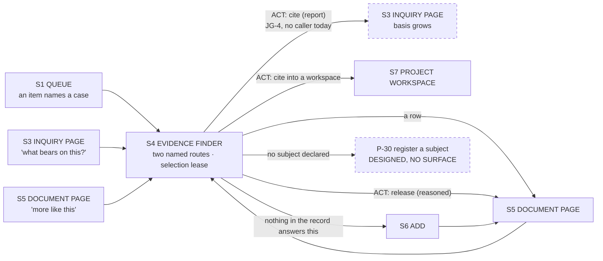
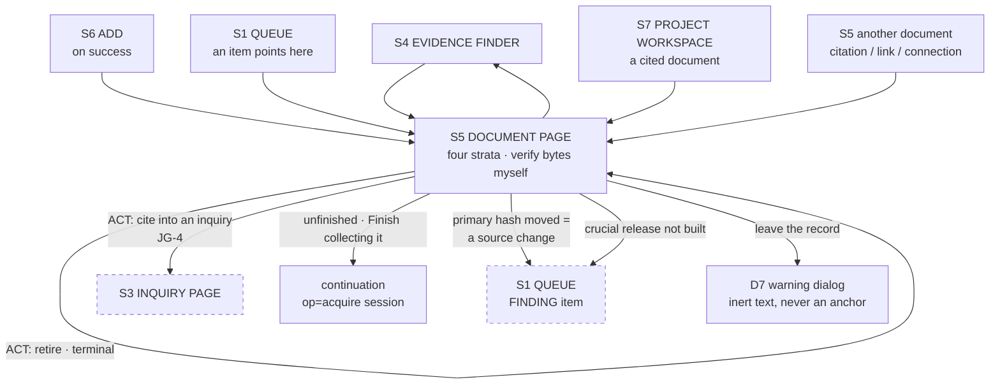
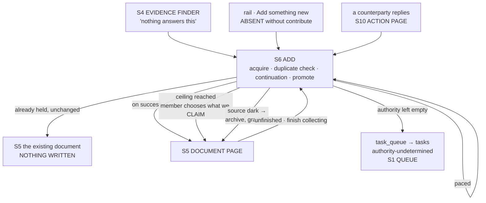
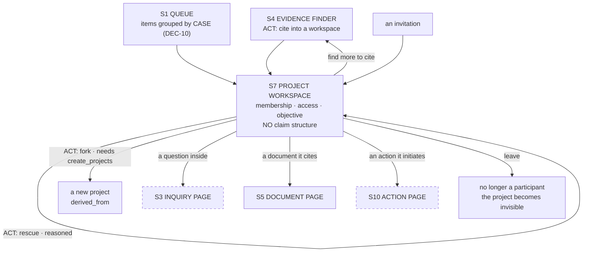

# SB-EVIDENCE — storyboards for the four surfaces that already exist

Written 2026-08-01 (Round B storyboard pass). Four surfaces: **EVIDENCE FINDER**
(search/browse), **DOCUMENT PAGE**, **ADD** (capture), **PROJECT WORKSPACE**. All four
have a built ancestor, so this is a REDRAW against the settled constructs rather than a
green field, and the load-bearing part of each section is the **DELTA TABLE**: what it
does today, what it must do, and whether the change is additive, a rework, or a
**removal**.

**Starting state** is `UI-BASELINE.md`, which is cited by section number throughout
(`UI-B §1.7` etc.) and by `app.html` line where the baseline gives one. Constructs are
`BIO_Interaction_Constructs_v0_1.md` v0.2 (QUEUE, ACT, the weight ladder, UNDETERMINED),
`BIO_Case_Making_v0_1.md` (the inquiry collapse), `UI-PLAN.md` U1–U14 and "Who this is
for". Data facts are `DATA-MODEL.md`; op/process facts are `PROCESS-CATALOGUE.md`;
capability facts are `CAPABILITIES.md`.

**Scenario content is a PLAUSIBLE CONSTRUCTION.** Bundle ids below are id-shaped, not
read from the live record, and no claim is made about what any real Oakland document
says. Saying so is the same discipline the surfaces enforce; a storyboard that quietly
overclaims would be the defect this design exists to prevent.

**Where I am unsure I write "I don't know".** There are five such places, collected in §6.

---

## 0 · The rules every wireframe below obeys

Five constraints, taken as given, plus how each is rendered.

| # | constraint | how it shows up in the wireframes |
| --- | --- | --- |
| 1 | **A justification is never prefilled or drafted.** Assembling a member's OWN prior words IS permitted (`Constructs:250-260`) | every authored field renders empty with a character budget and a `— you write this —` rule. Where the member has prior authored text, it appears in a clearly-labelled **`your earlier words`** picker that INSERTS on an explicit click and is never the field's initial value |
| 2 | **`undetermined` is stated identically everywhere** (`Constructs:306-316`) | one primitive, `[ undetermined ]` + `basis:` line + `retry:` line. Same three lines in every surface. §0.1 |
| 3 | **A classifiable technical complication is never a member's choice** (`UI-PLAN`, "Who this is for") | subrequest ceilings, governor pacing, CID fonts and per-render machinery are **stated as status where the thing lives**, never as a question. The one thing a member IS asked is what the record should CLAIM — §3 state A5 is the canonical case |
| 4 | **Options come from the producer** (`NOTIFICATIONS.md`, rule 1) | act rows are drawn as `[ options published by the producer ]` wherever no op publishes them today, and the gap is named **JG-9** rather than filled with a surface-side map |
| 5 | **A capability a member lacks is ABSENT, not greyed** (`Membership v2 §5`; `CAPABILITIES.md §6`) | every §4 below lists what disappears, including the entry point, not only the button |

### 0.1 The UNDETERMINED primitive, drawn once

```
┌────────────────────────────────────────────────────────────┐
│  undetermined                                              │
│  basis · no assertion was supplied and no mechanical       │
│          determination is implemented; recorded            │
│          2026-07-14T18:02Z for resolution through the      │
│          task list                                         │
│  retry  · a person can settle this — it is in the queue    │
└────────────────────────────────────────────────────────────┘
```

Three lines, always: the word, the dated basis, and whether looking again could change
it. The third line is where **D-129** bites: `undetermined` today conflates *we could not
determine* (a limit of our run — an over-envelope PDF, worth retrying) with *there is
positively none* (a property of the document — a scanned page with no text layer, never
worth retrying), and the difference survives only in a reason string. **The surface must
not invent the distinction.** Until the plane carries it as a field, the `retry` line
renders from the plane's own reason where the reason is one of the named ones, and
renders `retry · undetermined` where it is not. That is honest and it is ugly, and the
ugliness is the argument for closing D-129.

### 0.2 Delta vocabulary

- **additive** — new behaviour beside existing behaviour; nothing built is invalidated.
- **rework** — the same job, done differently; the old code path does not survive.
- **removal** — the behaviour goes and nothing replaces it, or what replaces it is a
  refusal. **A redesign that only adds has not made a choice**, so every surface below
  carries at least two.

---

# 1 · EVIDENCE FINDER

Journey surface **S4** (`JOURNEY-PRIMARY.md:190`). Today: `renderSearchScreen` /
`runSearch`, `app.html:3972-4025` (`UI-B §1.7`), plus the four list renderings
`renderRecord` / `renderFiltered` / `renderMonitoring` that P-03 collapses into one read.

## 1.1 The seam: retrieval is two disjoint systems

This is the finding the surface has to reckon with, and it is measured, not asserted
(`LAYERS.md §0.2`):

- `query.mjs` compiles a query language over **25 projected frontmatter fields**
  (`query.mjs:47-73`) and FTS5 over five text columns (`query.mjs:80`:
  `title, body, meta, locator, authority`). I read the field list: `id type group title
  state prior created updated criticality sha schema mode tier locator authority
  retrieved status hash monitored frequency checked annotations reeval since
  reevalsource`. **There is no `entity`, no `grade`, no `connection`, no `progression`,
  no `phase`.**
- The intent layer has its OWN reads — `op=concerns` (`index.mjs:458`), `op=connections`
  (`:469`), `op=resolutions` (`:457`), `op=instance` (`:479`), `op=captureprogressions`
  (`:513`) — over `resolutions`, `connections`, `progression_instances`, tables the query
  compiler cannot see.
- So **"every document that concerns this ordinance" is `op=concerns`, and `op=search`
  cannot answer it.** Two retrieval systems, no join, no shared field vocabulary.

### Can ONE surface hide that from a non-technical member?

**Partly, and the honest answer has three parts.**

**(a) YES for the LOOKUP case, today, with no plane change.** "Show me everything about
the sewer fund" is a UNION. The surface resolves the member's words to a subject first
(`op=entitybyalias`, falling through to `op=entity` on an `ENT-` prefix — the machinery
`renderSubjectView` already has, `app.html:5335-5354`), then fans out to `op=search` and
`op=concerns` in parallel and merges by `bundle_id`. A union over two independently
truncated result sets is still a valid union of what each route returned; it never claims
a row that is not there. The seam disappears from the member's view provided the surface
states each route's own count and never presents a combined total it cannot verify.

**(b) NO for the FILTERED case, and this is the part that must be said out loud.**
"Documents that concern ENT-0031 **and** are still `collected` **and** connect at grade B
or better" is an INTERSECTION across the seam. The browser can intersect two result sets;
it cannot intersect two result sets that were independently capped at `limit=500`. The
intersection of two truncated pages under-reports, and **it under-reports invisibly** —
the member sees a short, confident list. For a surface whose downstream consumer is a
case making a COMPLETENESS claim (`Case_Making:266-278`), a silently short evidence list
is the exact failure mode the whole record exists to prevent. So the surface must
**refuse to compose that query** rather than answer it approximately.

**(c) What must change underneath, named precisely.** Three things, in order:

1. **Project the intent layer onto `bundles` and admit it to `FIELDS`.** `entity`,
   `grade`, `connected`, `progression`, `phase` as projected columns plus indexes, by the
   same S-10 `ALTER TABLE … ADD COLUMN` precedent `DATA-MODEL.md §2.4.1` uses for
   `inquiry_strength` (`store.mjs:120-176`, `:199-201`). These are DERIVED and
   re-derivable, so projecting them costs compute and nothing else — but every new
   derived column must be added to `op=purge`'s whole-store arm or it is D-113 again
   (`DATA-MODEL.md §1.4`).
2. **`op=searchfields` must publish them**, and the UI must stop hand-composing query
   literals. Today the UI composes `type:information state:collected` by hand
   (`app.html:4030`) while `op=searchfields` (`index.mjs:306`) exists to prevent exactly
   that drift — measured as P-04 **PARTIAL** and as one of `UI-PLAN`'s "two drifts". That
   drift is the same defect class as constraint 4.
3. **Until 1 and 2, the finder shows two NAMED routes with their own counts**, and states
   `undetermined` for a route that could not answer. Not one blended list.

**I don't know** whether projecting a per-entity axis onto a per-bundle row is
well-defined for a document concerning several entities: `resolutions` is keyed
`(capture_sha, ref, entity_id)` and a bundle may carry many, so `bundles.entity` would
have to be a multi-value column or a join table, and that is a RECORD-area design call I
am not placed to settle here.

## 1.2 DELTA TABLE

| # | today (`UI-BASELINE`) | must do | kind |
| --- | --- | --- | --- |
| E-a | `runSearch` falls back to a **client-side substring filter over `op=list`** when `op=search` fails or returns an unrecognised shape, "so search always answers" (`UI-B §1.7`, `app.html:4015-4018`) | **DELETE the fallback.** Two reasons, either sufficient: (i) `op=list` bypasses the D-15 viewer gate (`CAPABILITIES.md` F-8 — `index.mjs:2823-2826` stamps the viewer only for `search`/`select`/edge actions), so the fallback leaks projects the member was never invited to; (ii) it answers a *different, weaker question* in a UI that looks identical, which is a surface telling a member something untrue. Replace with a stated refusal that names the plane's reason and offers retry | **removal** |
| E-b | scope pinned by a **server-side `q` prefix plus a client-side predicate** composed in the surface (`SEARCH_SCOPES`, `app.html:3979-3984`); Review composes `type:information state:collected` (`:4030`) | scope comes from `op=searchfields`; the surface composes no literal | **rework** (removal of the literals) |
| E-c | empty query **leaves the screen** (`backFromEmptySearch`, `app.html:3960-3963`, `:4006`) | **DELETE.** A finder that holds a selection lease cannot eject the member when they clear the box; the selection would be orphaned mid-act | **removal** |
| E-d | no selection anywhere. The UI calls `op=select` and never `op=selection`, so it holds no keep-alive and never learns what DRIFTED (`UI-PLAN`, families 6) | a live SELECTION held as a server-side lease, its **published expiry shown**, drift stated exactly and never absorbed; visibility may only ever SHRINK it (D-35) | **additive** |
| E-e | no cite. `op=cite` (`index.mjs:327`) has **no caller anywhere** — JG-4, UI-PLAN U9, never built | cite the selection into an inquiry or a project, weight `report`, with the note-grammar refusals (`NOT_INFORMATION`, `SEVERED_EDGE`, `CITATION_TOO_LARGE`, `UNSPLICEABLE_REFERENCES`, `EMPTY_SELECTION`) shown BEFORE it runs | **additive** |
| E-f | the entity/grade/connection axis is unreachable from search (§1.1) | subject route fanned out beside the text route, counts named per route; the intersection case REFUSED rather than approximated | **additive** now, **rework** once `FIELDS` grows |
| E-g | four separate list screens — Record, Focuses, Projects, Monitoring — each a rendering of the same read (`UI-B §1.4-1.6, §1.9`; P-03) | one finder with saved scopes. **DELETE `renderFiltered`** (`app.html:1240-1248`) and the Monitoring screen's list half; Monitoring's *acts* move to where the thing lives (§2) | **removal** |
| E-h | no result snippets, no relevance indicator, no facets on search (`facets:"none"` only on Review/Monitoring) | facets from `DEFAULT_FACETS` (`query.mjs:90`), which the plane already counts at ~5ms over 20k rows | **additive** |
| E-i | screen-level error replaces the whole screen with `errPane`, **no Retry on any of them** (`UI-B §5.3`) | refusal in place, with the plane's `reason` and a retry | **rework** |

## 1.3 STORYBOARD

### E1 · Empty — nothing typed yet

```
The record ›  Find evidence
════════════════════════════════════════════════════════════════════════
Find evidence

Search what the group holds. Two routes answer, and they answer
different questions:
  · WORDS AND FIELDS — title, body, source, state, dates
  · SUBJECTS         — a person, body or thing the record has been
                       told about, and every document that concerns it

┌──────────────────────────────────────────────────────────┐
│ 🔍  sewer fund                                           │  [ Find ]
└──────────────────────────────────────────────────────────┘
  scope · everything          nothing selected

Nothing searched yet.
```

### E2 · Searching — both routes in flight

```
🔍 sewer fund                                      [ Find ]
  scope · everything

  words and fields  …searching
  subjects          …searching
```

### E3 · Populated — both routes answered

```
🔍 sewer fund                                      [ Find ]
  scope · everything      ·      [ ] select all on this page

  WORDS AND FIELDS — 14 documents
  SUBJECTS — 1 subject matched: Sewer Service Fund (ENT-0031)
             31 documents concern it

  Type ▾   State ▾   Criticality ▾   Authority ▾        ← facets, from the plane

  ┌──┬──────────────────────────────────────────┬────────┬───────────┬──────────┐
  │  │ Item                                     │ Type   │ State     │ Updated  │
  ├──┼──────────────────────────────────────────┼────────┼───────────┼──────────┤
  │[✓]│ FY2024-25 Adopted Policy Budget         │ Info   │ ⬢verified │ 12 Jul   │
  │  │   words+fields · subject ENT-0031        │        │           │          │
  │[✓]│ Sewer Service Fund transfer schedule    │ Info   │ ○collected│ 14 Jul   │
  │  │   subject ENT-0031 only                  │        │           │          │
  │[ ]│ Ordinance 13xxx — franchise fee         │ Info   │ ⬢verified │ 02 Jul   │
  │  │   words+fields only                      │        │           │          │
  └──┴──────────────────────────────────────────┴────────┴───────────┴──────────┘

  Rows found by one route are marked. 38 documents in total across both
  routes; 7 were found by both. No combined ranking is shown, because the
  two routes rank on different things.

  ── 2 selected ───────────────────────────────────────────────────────────
     held until 18:41 (5 minutes) · nothing has moved under this selection
     [ Cite into… ]   [ Release selected… ]   [ Clear ]
```

### E4 · Partial — one route answered, the other did not

```
  WORDS AND FIELDS — 14 documents
  SUBJECTS —
      ┌──────────────────────────────────────────────────────┐
      │  undetermined                                        │
      │  basis · the subject route did not answer:           │
      │          reason NO_SUCH_ENTITY for "sewer fund"      │
      │  retry · nobody has declared this subject yet.       │
      │          Declaring one is an act with a name on it   │
      └──────────────────────────────────────────────────────┘

  The 14 below are what WORDS AND FIELDS found. They are not a complete
  answer to "everything about the sewer fund" and this surface is not
  claiming they are.
```

*This state is the ordinary one today, because P-30 (register a subject) has no surface
at all: `op=entitycreate` / `entityalias` / `relationdeclare` exist and nothing calls
them, so `renderSubjectView` reads a registry no surface writes (`PROCESS-CATALOGUE`
P-14 PARTIAL). The finder must be honest about that rather than hiding an empty
registry behind a text search that looks complete.*

### E5 · Ambiguous subject

```
  SUBJECTS — 3 subjects match "thao". Nothing is assumed.

     ○ Sheng Thao — person — 4 aliases — 61 documents  [ use this ]
     ○ Thao Nguyen — person — 1 alias — 2 documents    [ use this ]
     ○ THAO LLC — organisation — 1 alias — 0 documents [ use this ]

  The words-and-fields route is answering below in the meantime.
```

### E6 · Refused — the intersection the surface will not compose

```
🔍 concerns:ENT-0031 state:collected grade:>=B          [ Find ]

  ┌──────────────────────────────────────────────────────────────┐
  │  This surface will not answer that as one question.          │
  │                                                              │
  │  "concerns" and "grade" are read by a different part of the  │
  │  record from "state", and the two are not joined. Combining  │
  │  them here would give you a short list that LOOKS complete.  │
  │                                                              │
  │  What you can do now:                                        │
  │    [ every document that concerns ENT-0031 ]  → 31           │
  │    [ everything at state:collected ]          → 92           │
  │  and read them side by side.                                 │
  │                                                              │
  │  The record's own note: op=searchfields does not publish     │
  │  `concerns` or `grade`.                                      │
  └──────────────────────────────────────────────────────────────┘
```

*The last line names a plane op to a member, which the vocabulary guard forbids on five
screens (`UI-B §6.1`) and which three screens already violate (`UI-B §6.3.2`). It is
drawn here to be argued with: **I recommend it be cut** and the sentence end at "are not
joined", with the op name moved to a disclosure the member can open. A refusal that
cannot be acted on by a non-technical member gains nothing from naming the op.*

### E7 · No results

```
  WORDS AND FIELDS — no documents match "sewer franchise diversion".
  SUBJECTS — no subject has been declared under that name.

  The record holds 214 documents. Nothing in them matched, and nothing
  about them is being guessed at.

  [ widen: search everything ]      [ add a document → ]
```

### E8 · Scope pinned, with the widen escape

```
  scope · inside the project "Sewer fund, FY19–FY25"
          14 of 214 documents are in scope     [ search everything ]
```

### E9 · Selection drifted

```
  ── 12 selected ──────────────────────────────────────────────────────
     held until 18:44 · TWO ITEMS MOVED UNDER THIS SELECTION

     · INFO-2026-0114 was released to verified by another member at 18:39
     · INFO-2026-0117 is no longer visible to you (project membership)

     Your selection now stands at 11. A selection only ever shrinks;
     nothing was added on your behalf.
     [ Cite the 11 ]   [ Start again ]
```

*`selections` carries `digest` and drift is "detected exactly and classified from the
manifest's `writer` and `operation`, never absorbed" (`Constructs:291-298`;
`DATA-MODEL §1.3`). D-35 is the rule that a selection records INTENT, so visibility may
only shrink it.*

### E10 · Selection expired

```
  ── the selection you were holding expired at 18:41 ──────────────────
     Selections are held for 5 minutes. Nothing was written and nothing
     was lost from the record; the set you had is gone.
     [ Run the same search again ]
```

*`Store.SELECTION_TTL_MS = 300000` (`store.mjs:709`), published on `op=select` as
`ttlSeconds` (`:1164`). The number is the plane's, shown, not restated in the surface.*

### E11 · Cite — the ACT, pre-flight first

```
┌─ Cite 11 documents into… ────────────────────────────────────────────┐
│  ○ an inquiry            ○ a project                                 │
│     ▸ Sewer fund, FY19–FY25 (PROJ-2026-0004)                         │
│                                                                      │
│  WHAT THIS WILL REFUSE, BEFORE IT RUNS                               │
│    ✓ all 11 are information            (NOT_INFORMATION)             │
│    ✓ the project has a readable bundle (NO_BUNDLE_MD)                │
│    ✗ 1 edge was severed earlier        (SEVERED_EDGE)                │
│        INFO-2026-0088 — reinstating a severance is a separate act    │
│          that records its own reason                                 │
│    ✓ the citation fits inline          (CITATION_TOO_LARGE)          │
│                                                                      │
│  This act proceeds and reports what moved. It is weight `report`,    │
│  not all-or-nothing: 10 will be cited, 1 will be retained with the   │
│  reason above.                                                       │
│                                                                      │
│  WEIGHT   reversible · [reasoned] · terminal · attested              │
│                                                                      │
│  Why these support the work            0/280 — you write this        │
│  ┌────────────────────────────────────────────────────────────┐      │
│  │                                                            │      │
│  └────────────────────────────────────────────────────────────┘      │
│  your earlier words ▸  (3 reasons you have written on this project;  │
│                         opening inserts nothing until you click one) │
│                                                                      │
│                                   [ Cancel ]  [ Cite 10 documents ]  │
└──────────────────────────────────────────────────────────────────────┘
```

### E12 · Refused as a whole

```
  ┌──────────────────────────────────────────────────────────────┐
  │  The record did not answer.                                  │
  │  reason · STORE_UNREACHABLE                                  │
  │  detail · the plane answered 503 at 18:40:11                 │
  │  Nothing was written. Your search box is unchanged.          │
  │                                        [ Try again ]         │
  └──────────────────────────────────────────────────────────────┘
```

### E13 · Read-only credential

```
  ── 11 selected ──────────────────────────────────────────────────────
     held until 18:44 · nothing has moved
     [ Clear ]
```

*No `[ Cite… ]`, no `[ Release selected… ]` — absent, not greyed. §1.5.*

## 1.4 JUSTIFICATION — path verb and journey step

- **Path verb: EXPLORING**, which the coverage matrix gives 6 processes, all USER-driven,
  and zero machine drivers — recorded there as **a design position, not a gap**: a
  machine that explores on a member's behalf is a recommendation engine, and that is the
  "less narrative" constraint's natural enemy (`PROCESS-CATALOGUE §5`). The finder
  therefore does no ranking the member did not ask for and shows no "related documents".
- **Journey step: S4**, sitting on the edge `S3a → S4 → S5` and the act `A2` (cite) that
  carries EXPLORING into DISCOVERING (`JOURNEY-PRIMARY §1`). It is the surface where
  "find the material that bears on this question" becomes "put it under the question",
  and the second half is JG-4, unbuilt.
- **Processes served:** P-03 (read the record, four renderings collapsed to one), P-04
  (search — PARTIAL today), P-37 (hold a selection as a lease — DESIGNED, no caller),
  P-18 (cite — DESIGNED, no caller).
- **Construct:** it is not itself a construct; it hosts one **ACT** (cite), in the
  **SELECTION-SCOPED** modifier, at weight `report`.

## 1.5 DATA MODEL

**Reads.** `op=search` → `query.mjs` compiler → `bundles` (25 projected columns,
`query.mjs:47-73`) + `bundles_fts` (`title, body, meta, locator, authority`,
`query.mjs:80`) under the D-15 viewer gate (`query.mjs:121-167`, `GATE_MARK`). Facets from
`DEFAULT_FACETS` (`query.mjs:90`). `op=searchfields` for the vocabulary. `op=entitybyalias`
/ `op=entity` → `entities`, `entity_aliases`. `op=concerns` → `resolutions` joined to
`bundles`. `op=connections` → `connections` (`a_grade`, `b_grade`, `grade`,
`established`). `op=selection` → `selections`, `selection_items`.
`op=projectparticipants` → `project_participants`, only to decide scope labels.

**Writes.** `op=select` → `selections` (`handle, owner, kind, q, sort_field, sort_dir,
created, touched, expires, n, digest`) + `selection_items` (`handle, ord, bundle_id,
bundle_sha`), both **derived**, both purged in the whole-store arm
(`store.mjs:4544-4545`). `op=cite` → the PROJECT bundle's `bundle.md` `references[]`, and
through `op=promote` into `refs` (`bundle_id, target_id, kind='cites'`) — never written
directly (D-21, `index.mjs:325-326`). `op=release` writes `bundles.current_state` +
`state_history`.

**Ops called.** `search`, `searchfields`, `select`, `selection`, `selectionrelease`,
`entitybyalias`, `entity`, `concerns`, `connections`, `cite`, `release`, `whoami`.

**Ops deliberately NOT called, with the reason.** `op=list` — it bypasses the viewer gate
(F-8), and the whole point of E-a is that the finder must not read round the gate.
`op=projection` and `op=image` — same class, and the finder needs no bundle bodies.

## 1.6 CAPABILITIES — what is ABSENT without it

| capability | what disappears entirely |
| --- | --- |
| **no session** (raw `MEMBER_TOKEN` or probe) | the **selection column and the whole selection bar**. `op=select` is `SESSION_OPS` member+admin (`CAPABILITIES.md §1`), so a token-only credential cannot hold one. Searching and reading remain |
| **`contribute` not held** | `[ Cite into… ]` and `[ Release selected… ]` are absent. The selection bar itself survives, because a selection is a read-side lease |
| **`create_projects` not held** | the cite target list contains no "start a new project" entry. Today `app.html` offers project creation to everyone with `contribute` and refuses at submit — **F-6, present-and-refused, the thing §5 forbids** |
| **uninvited to a project (D-15 §7.9)** | the project does not appear in the scope list, its documents do not appear in results, and it is **not visible at all — not its existence, not its name** (`Membership v2:471-474`). This is the requirement E-a's removal exists to honour |
| **invited, not joined** | the project's SKELETON is in scope — the Focuses it stands above, the Information it cites, the Actions it initiates — and its own content, analysis record, session log and participant list are absent |

## 1.7 WORKFLOW EDGES



---

# 2 · DOCUMENT PAGE

Journey surface **S5**. Today: `openBundle`, `app.html:3738-3921` (`UI-B §1.15`) — four
strata, seals, link surface, `docKnows`, three act bars. It is the most complete surface
in the system and the redraw is mostly about **honesty at the edges**.

## 2.1 DELTA TABLE

| # | today (`UI-BASELINE`) | must do | kind |
| --- | --- | --- | --- |
| D-a | `reverseRefs` builds the reverse-citation index **client-side by walking every focus/problem/project projection** and caching it for the session (`UI-B §1.15`, `app.html:752-768`) | **DELETE.** §7.9 requires derived reverse edges into projects to be filtered by the VIEWER'S POSITION and names the index as "the one place the graph could escape" (`Membership v2:494-500`). An unfiltered index rebuilt in the browser is that leak by a different route, and it is F-8's second half. Replace with a plane-side backlink read that carries the gate | **removal** |
| D-b | an unrecognised state falls through `sem()` to `{chip: state, meaning: ""}` and renders **a seal whose mark is the state's first letter and whose disclosure is empty** — which is every `action` state and project `matured`/`closed` (`UI-B §1.0`) | **DELETE the fallthrough.** An invented seal is the surface asserting a standing the record never gave it. Render the UNDETERMINED primitive: the state verbatim, `basis · this surface has no meaning recorded for this state`, `retry · the record's own catalog carries it; the surface does not` | **removal** |
| D-c | the crucial release path ends in a **statement, not a route**: "that surface is not built yet" (`app.html:3862`, `4084`) | a dead end becomes a QUEUE item: the act is absent, and the surface says who can carry it and puts the obligation somewhere. U10 remains unbuilt; a dead end that names no next person is the failure `Constructs` calls "a finding that disappears" | **rework** |
| D-d | a screen-level error **replaces the whole screen including the crumb** (`app.html:3920`), so "The record ›" is gone too, with no retry (`UI-B §5.3`) | refusal renders INSIDE the page frame, crumb intact, with retry | **rework** |
| D-e | Trust stratum renders only if ≥1 row is present (`app.html:3835`); three-valued authority landed in 0.47.0/0.55.0 and **the surface has never been designed against it** (`UI-PLAN`, new capability) | the Trust stratum ALWAYS renders, and states `authority_state: undetermined` with its dated `authority_basis` (`index.mjs:2250-2253`) as a first-class fact rather than an absent row | **rework** |
| D-f | the archive fallback shipped 0.51.0–0.55.0 and **the surface shows nothing of it** | the two-hop `provenance_chain` rendered as two hops, grade C stated with "grade tracks directness, never technique", `capture.authority: Internet Archive` distinguished from the CONTENT authority, and the second hop marked `bound: false` with the reason it is unsigned | **additive** |
| D-g | PDF text state is not surfaced at all | `text-undetermined` with its reason (`no_text_layer`, `over_envelope`, `encrypted`, `tier2_extraction_error` — `INTERFACES.md:421`, `CLAIMS.md:185`) rendered through the §0.1 primitive | **additive** |
| D-h | Monitoring is a separate screen with **no control to enable, disable, reschedule, or clear a re-evaluate flag** and no link to the change that raised it (`UI-B §1.9`) | monitoring status and its acts live on the document — "status where the thing lives". The Monitoring screen's list half is deleted with E-g | **rework** |
| D-i | `continueCapture` refusing on a changed source leaves the member on the page with two hashes and **no control at all** (`UI-B §5.3.14`) | a changed primary IS a source change and a monitoring finding — it becomes a FINDING-class queue item on this document, with the two hashes as its basis, not a paragraph | **rework** |
| D-j | no cite-from-document, no retire, no sever/reinstate (`op=retire` `:335`, `sever` `:348`, `reinstate` `:349` all have no caller) | cite into an inquiry; retire (terminal rung); sever/reinstate with a required reason | **additive** |
| D-k | "Cited by" is citations only | **which inquiries rest on this document** — the extension of `load-bearing-for` the journey needs (`JOURNEY-PRIMARY:206`). Blocked on JG-1/JG-2 (no inquiry type) and stated as blocked rather than faked | **additive, blocked** |

## 2.2 STORYBOARD

### D1 · The ordinary case — direct capture, grade B, authority determined

```
The record › INFO-2026-0117
════════════════════════════════════════════════════════════════════════
Sewer Service Fund transfer schedule, FY2019–FY2025
  [PDF]  ○ collected   ⬢ crucial   👁 monitored          Open the document ↗

  What it says │ In the case │ Trust │ The record        ← strata, scroll-spied

── TRUST ───────────────────────────────────────────────────────────────
  Issued by     City of Oakland, Finance Department
                determined · asserted by the capturing member at intake,
                2026-07-14T18:02Z
  Source        https://cao-94612.s3.amazonaws.com/documents/…pdf   ↗
  Retrieved     14 July 2026, 18:02 UTC
  Source status unchanged
  Standing      Grade B · captured directly by this instance
                Grade tracks how the bytes reached us, never how credible
                the document is.
  Chain         1 hop
                ▸ instance biosmoke7 (CivicOS/0.55.0) asserts these bytes
                  were served for that address at that time.
                  evidence · first-party https fetch, hashed at receipt
                  bound · no
  Content hash  sha256:4f2c…  [copy]
  Bundle hash   sha256:9ba1…  [copy]
  Monitor       weekly · last checked 30 Jul · next 06 Aug
                [ pause monitoring ]  [ check now ]
```

### D2 · Text UNDETERMINED — scanned, no text layer (permanent)

```
── WHAT IT SAYS ────────────────────────────────────────────────────────
  ┌────────────────────────────────────────────────────────────┐
  │  undetermined                                              │
  │  basis · this document carries no text layer. It is a      │
  │          scanned image, and the reader returned nothing     │
  │          rather than guessing.                             │
  │  retry  · looking again will not change this. There is no  │
  │          text in the file to read.                         │
  └────────────────────────────────────────────────────────────┘

  The bytes are held and verifiable. 41 pages, 8.2 MB, sha256:1d90…
  You can open and read it yourself:                Open the document ↗

  [ Cite into an inquiry ]   [ Release… ]
```

### D3 · Text UNDETERMINED — over the envelope (retryable)

```
  ┌────────────────────────────────────────────────────────────┐
  │  undetermined                                              │
  │  basis · this document is larger than the reader's         │
  │          envelope (16 MB), so no text was extracted. It    │
  │          was not truncated; a partial read would be worse   │
  │          than none.                                        │
  │  retry  · there IS text in this file and we did not get    │
  │          it. A later run with a larger envelope would.     │
  └────────────────────────────────────────────────────────────┘
```

*D2 and D3 use the identical three-line primitive and differ only in the `basis` and
`retry` lines, which is what constraint 2 demands and what **D-129** currently makes
fragile: today both surface as `text-undetermined` and the difference lives in a reason
string. The surface renders the plane's reason and does not manufacture the distinction.
A member is never asked which one it is — that is a classifiable technical fact
(constraint 3).*

### D4 · Authority UNDETERMINED, with the task it raised

```
  Issued by     ┌──────────────────────────────────────────────┐
                │  undetermined                                │
                │  basis · no assertion was supplied and no    │
                │          mechanical determination is         │
                │          implemented; recorded               │
                │          2026-07-14T18:02Z for resolution    │
                │          through the task list               │
                │  retry  · a person can settle this. It is    │
                │          with Priya since 14 July (17 days). │
                └──────────────────────────────────────────────┘

  This document is held and can be read. It cannot be published until
  the chain of custody carries no unattributed hop — which is about WHO
  SERVED each hop, not about who issued the document. Content that is
  undetermined WITH a dated basis may be published; this one has its
  basis, above.
```

*The fence sits on the PROVENANCE chain, not the content axis, since 0.55.0 (D-114
resolved). Never invent an attribution to get past a gate.*

### D5 · Source gone dark, recovered from the archive — grade C, two hops

```
The record › INFO-2026-0121
════════════════════════════════════════════════════════════════════════
Sewer franchise fee — Council agenda report, 12 March 2019
  [HTML]  ⬢ verified   👁 monitored                      Open the document ↗

── TRUST ───────────────────────────────────────────────────────────────
  Source        https://www.oaklandca.gov/…/agenda-report-2019-03-12
                ⚠ this address no longer answers.
                  Last served us these bytes 09 July 2026.
                  22 attempts since, 22 failures, first failure 11 July.
                  Nothing about that is a judgement on the publisher.

  Standing      Grade C · recovered through a public archive
                Grade tracks how the bytes reached us, never how credible
                the document is. One more party stands between us and the
                publisher than for a direct capture, so it grades below
                one — even where the bytes are identical.
                Plausible, not established.

  Issued by     City of Oakland — determined · asserted by the capturing
                member at intake, 2026-03-14T09:40Z
  Served by     Internet Archive
                (who handed us the bytes; not who issued the document)

  Chain         2 hops — both disclosed
                ┌──────────────────────────────────────────────────────┐
                │ 1 ▸ instance biosmoke7 (CivicOS/0.55.0)              │
                │     asserts · these bytes were served for            │
                │       https://web.archive.org/web/20190314…/…        │
                │       at 2026-07-28T04:11Z                           │
                │     evidence · first-party https fetch, hashed at    │
                │       receipt                                        │
                │     bound · no          via · archive.org            │
                ├──────────────────────────────────────────────────────┤
                │ 2 ▸ Internet Archive                                 │
                │     asserts · it captured that address on            │
                │       2019-03-14 and replayed it unchanged           │
                │     evidence · CDX record, digest MFQ4…, status 200  │
                │     bound · NO — the archive does not sign its       │
                │       replays, so this hop is stated and not proved. │
                │       We accept it BECAUSE it is disclosed here.     │
                └──────────────────────────────────────────────────────┘

  Content hash  sha256:c07e…  [copy]     Bundle hash  sha256:22ab…  [copy]

  What this standing does and does not permit
    · it may be cited, and its grade travels with the citation
    · a case resting on it is no stronger than Grade C at that leg
    · it may be published, with this chain shown
```

### D6 · Unfinished capture — driven, not delegated

```
── WHAT IT SAYS ────────────────────────────────────────────────────────
  ┌──────────────────────────────────────────────────────────────┐
  │  This capture is not finished.                               │
  │  9 of 127 supporting files have not arrived. Seven are        │
  │  images and stylesheets that affect how the page LOOKS;       │
  │  two are load-bearing — the page will not render the same     │
  │  without them.                                                │
  │                                                               │
  │  [ Finish collecting it ]                                     │
  └──────────────────────────────────────────────────────────────┘
```

*Without `contribute`: the button is absent and the box reads "Finishing it needs a
member who can add to the record." No count of subrequests, no ceiling, no runtime — the
`capture-honesty` vocabulary guard forbids all of those words on this exact banner
(`UI-B §6.1`).*

### D7 · REFUSING TO OPEN — bytes do not match

```
  ┌──────────────────────────────────────────────────────────────┐
  │  REFUSING TO OPEN · BYTES_DO_NOT_MATCH_THE_RECORD            │
  │                                                              │
  │  the record holds  sha256:4f2c9a…                            │
  │  what arrived      sha256:81de07…                            │
  │                                                              │
  │  Nothing is shown, because a document missing or altered by  │
  │  one byte is a different document. This is not an error in    │
  │  your browser and there is nothing for you to fix.           │
  │                                                              │
  │  [ Report this ]   — raises a CONDITION on this document      │
  └──────────────────────────────────────────────────────────────┘
```

### D8 · REFUSING TO RENDER — a part is missing

```
  Refusing to render this page: 2 of its parts are not held.
    · /assets/site.css        outstanding, never collected
    · /img/table-3.png        outstanding, never collected
  A page missing a part renders as a different page.
  [ Finish collecting it ]        [ Open the primary file alone ↗ ]
```

### D9 · Unknown state — the fallthrough, redrawn

```
  [PDF]  ┌────────────────────────────────────────────────┐
         │  awaiting_response                             │
         │  undetermined                                  │
         │  basis · this surface has no meaning recorded  │
         │          for that state                        │
         │  retry  · the record's own catalogue carries   │
         │          it; the surface does not              │
         └────────────────────────────────────────────────┘
```

*Today this renders as a seal marked `a` with an empty disclosure — a mark the surface
invented. Every `action` state and project `matured`/`closed` hit it.*

### D10 · Acts, and acts refused

```
── WHAT YOU CAN DO ─────────────────────────────────────────────────────
  [ Release — collected → verified ]     reasoned
  [ Co-attest this capture ]             attested
  [ Cite into an inquiry ]               reversible
  [ Retire ]                             terminal

  ┌ Release, blocked ─────────────────────────────────────────────┐
  │  This document is CRUCIAL. Crucial material is never released │
  │  in bulk and never through this flow: it needs a second       │
  │  member's co-attestation on the release itself.               │
  │  That act is not built yet. It is with the group's            │
  │  administrators as an open obligation — see your queue.       │
  └───────────────────────────────────────────────────────────────┘
```

### D11 · Not found / loading / error

```
  The record › INFO-2026-9999
  This bundle was not found.

  The record › INFO-2026-0117
  ┌──────────────────────────────────────────────────────────┐
  │  Could not read this document.                           │
  │  reason · CAS_STALE   detail · row_version 4, sent 3     │
  │  Nothing was written.               [ Try again ]        │
  └──────────────────────────────────────────────────────────┘
```

*The crumb survives — D-d.*

## 2.3 JUSTIFICATION

- **Path verbs: EXPLORING and DISCOVERING.** Reading one document in depth is P-05
  (EXPLORING); verifying its bytes is P-06 (DISCOVERING, and PARTIAL today because it
  runs only as a side effect of rendering — **there is no explicit "verify this" act a
  member can choose**).
- **Journey step: S5**, on the edges `S4 → S5 → A2` and `S6 → S5`.
- **Processes served:** P-05, P-06, P-10 (release), P-11 (co-attest), P-19 (sever /
  reinstate, DESIGNED), P-20 (retire, DESIGNED), P-56 (rest an inquiry on evidence,
  MISSING), P-35/P-84 (monitoring, whose status belongs here).
- **Constructs:** hosts three **ACT**s at three different rungs — release (`reasoned`),
  retire (`terminal`), co-attest (`attested`) — which makes this the one surface where
  the weight ladder is FELT rather than described. It is also the densest user of the
  **UNDETERMINED** primitive: authority state, link verdict, contemporaneity, PDF text,
  capture completeness and reuse `not_attempted` all appear on this one page.

## 2.4 DATA MODEL

**Reads.** `op=image` → `files` (whole image) and `op=projection` → `bundles`
(`bundle_id, object_type, current_state, prior_state, criticality, title, created,
last_updated, source_locator, source_authority, source_retrieved, source_status,
content_hash, monitor_enabled, monitor_frequency, monitor_last_checked, annotations_open,
reeval_flag, reeval_since, reeval_source, fm_json`). `history` + `manifest` for the
revision list and the promotion log (`manifest.writer`, `manifest.operation` — the same
two columns drift classification reads). `op=capture` GET → `register` (`capture_sha,
bundle_id, path, encoding, bytes, registered`) and R2. `op=links` → `links` (`partition,
address, address_norm, citation_norm, fragment, origin, chrome, captured_at`) and
`link_verdicts` (`verdict, basis, target_bundle, target_capture, detail`).
`op=resolutions` → `resolutions` (`grade, method, basis, established, raised_from`).
`op=connections` → `connections` (`a_grade, b_grade, grade, established, asserted_by`).
`op=captureprogressions` → `progression_instances`. `op=sourcereach` →
`source_reachability` (`consecutive_failures, attempts, failures_total,
governed_refusals, last_success, last_failure, last_outcome, last_status,
first_failure_since`) — **this is what state D5's "22 attempts, 22 failures" comes from,
and it has no caller today** (P-38, DESIGNED). `op=pdfstructure` → text/tier state.
`op=archivelookup` / the `via: archive.org` arm of `op=acquire` → `captured_locators`
(`via`, `retrieval_locator`, `observations`).

**Writes.** `op=release` → `bundles.current_state` (+ `prior_state`, `state_history` in
`bundle.md`, projected). `op=attest` → the attestation blob + `register`. `op=retire` →
`bundles.current_state`, terminal, and refuses `CITED` if a live `cites` edge points at
it (`store.mjs:1770`). `op=sever` / `op=reinstate` → the CITING bundle's reference
`status` ∈ `{proposed, confirmed, severed}`, reason required (`NO_REASON`,
`store.mjs:1407`). `op=cite` → the target's `references[]` → `refs`. `op=monitor` →
`monitor_ticks` (P-35, no caller of any kind).

**Ops called.** `image`, `projection`, `capture`, `links`, `resolutions`, `connections`,
`captureprogressions`, `pdfstructure`, `sourcereach`, `release`, `attest`, `retire`,
`sever`, `reinstate`, `cite`, `select`, `monitor`, `whoami`. Of these, **eight have no
caller in `app.html` today**: `pdfstructure`, `sourcereach`, `retire`, `sever`,
`reinstate`, `cite`, `monitor`, and `op=instance`.

## 2.5 CAPABILITIES — what is ABSENT without it

| capability | what disappears entirely |
| --- | --- |
| **no session** | every act bar. `canRelease()` requires session AND `me.session` AND `contribute` (`app.html:722-725`) |
| **`contribute` not held** | Release, Co-attest, Retire, Cite, Sever/Reinstate, "Finish collecting it", the monitor pause/check controls. **The "WHAT YOU CAN DO" heading goes with them** — a heading over nothing is a greyed row wearing a different hat |
| **`publish` not held** | nothing on this page changes: publication is not a document act, it is S8. Worth stating because `publish` is consulted **nowhere in `app.html` today** (0 occurrences of "ratify") |
| **uninvited to the citing project** | the "Cited by" row for that project is absent, and the document does not disclose that the project exists. This is the §7.9 obligation D-a's removal exists to meet |
| **read-only (probe/token)** | everything above, plus: the verification path REMAINS — re-fetch by hash and refuse on mismatch is not gated, and must not be. Checking the bytes is the one thing anyone holding a document should be able to do |

## 2.6 WORKFLOW EDGES



---

# 3 · ADD

Journey surface **S6**. Today: `renderAdd` + `addGo`, `app.html:6469-6643` (`UI-B §1.14`).
U8, shipped 2026-07-30, and it carries **the two worst live defects in the member UI**.

## 3.1 DELTA TABLE

| # | today (`UI-BASELINE`) | must do | kind |
| --- | --- | --- | --- |
| A-a | the ceilinged-capture path **crashes**. `ADD_TICKS` is used at `app.html:6725` and `6825` and declared nowhere; the member sees a raw `ReferenceError` through `addGo`'s catch (`UI-B §1.14`, §5.3.13; **D-132**) | the driven continuation runs, and where the ceiling will not let it finish the member gets the ONE choice U8 was built to give them. **This is the single path where the surface's whole job is to keep a technical complication from becoming the member's problem, and it fails by surfacing the rawest possible form of one** | **removal** (the broken path) + **rework** |
| A-b | `heldMatch` and `addCapture` are **each declared twice** (6666/6766 and 6710/6810); the second wins and one body is dead (**D-133**) | one declaration each. The hazard is not the crash — it is that a later session fixes the dead copy, sees no change, and concludes something else is wrong | **removal** |
| A-c | the `project` type is offered to every member with `contribute` and **refused at submit** with `NOT_CAPABLE` from the shape check (`index.mjs:2884-2889`) — **F-6, present-and-refused** | the option is ABSENT without `create_projects`, as `setup.mjs:463` already does correctly | **removal** |
| A-d | the rail's `+ Add something new` button renders unconditionally (`app.html:862`) and without `contribute` the screen **explains rather than being absent** (F-7) | the rail entry is absent. §5 is written as a rule, not a preference; if the rule is wrong the place to change it is §5, not here. **I record the counter-argument: a vanishing entry may confuse more than one that explains** | **removal** |
| A-e | `mdFor` (`app.html:1752`) writes the literals `action_kind: other`, `risk_tier: 1`, `counterparty: to be named` for an action — satisfying C-2.10 with **a counterparty the record does not have** (P-48 PARTIAL and dishonest; JG-7) | **DELETE the placeholders.** Either the surface asks for the three fields the producer publishes, or the action type is absent from Add. A check passed by a stub is a check not running | **removal** |
| A-f | `ADD_TYPES` offers information / focus / project / action (`:6457`) while Adopt offers focus vs problem as two different things (`:6015`) and the display collapses them (`:1011`) — **a member can create a `problem` and only ever see it labelled "Focus"** | one vocabulary. Under the settled collapse the member-facing names are **inquiry / finding / case** by phase and the type is `inquiry` — blocked on JG-1, and stated as blocked | **rework, blocked** |
| A-g | a source that will not answer is not distinguished from a source that refused us, and the governor's pacing is invisible — a paced capture "still reads as broken" (P-39) | classify and STATE: unreachable · refused us · paced. None of the three is a question. `op=sourcereach` and `op=governorstate` exist and have no caller | **additive** |
| A-h | archive fallback is not offered from Add at all | where the source is dark and CDX has a record, **capturing at grade C is offered as an ACT with its standing stated** — because it changes what the record holds, not because the member should diagnose the failure | **additive** |
| A-i | duplicate detection, subresource capture, continuation, attest, the Grade B statement, "already held ⇒ nothing is written" | **keep, unchanged.** This is the best-tested writer in the system and `add-surface.test.mjs` runs what it assembles through the plane's own `checkBundle` | — |

## 3.2 STORYBOARD

### A1 · Capability absent — the whole entry point

```
  ┌─ rail ────────────────┐
  │  Home                 │
  │  The record           │
  │  Tasks                │
  │  Search               │
  │  Subjects             │
  │  Review               │
  │  ─────────────────    │
  │  View the public      │
  │  record               │
  └───────────────────────┘
```

*No `+ Add something new`. Nothing explains its absence, because the member never
navigated toward it. Today the button is present and the screen apologises — F-7.*

### A2 · The form, invalid, with the reason spoken

```
The record › Add something new
════════════════════════════════════════════════════════════════════════
Add something new

What is it?
  ● A document — something a public body published
  ○ A question worth pursuing
  ○ Something to do                       ← absent unless the producer
                                            publishes action_kind, risk_tier
                                            and counterparty (JG-9)
  (A line of work — absent without create_projects)

Title
  ┌────────────────────────────────────────────────────────────┐
  │ FY2024-25 Adopted Policy Budget                            │
  └────────────────────────────────────────────────────────────┘

What do you know?                                0/2000 — you write this
  ┌────────────────────────────────────────────────────────────┐
  │                                                            │
  └────────────────────────────────────────────────────────────┘

THE DOCUMENT
  Address   ┌──────────────────────────────────────────────────┐
            │ https://cao-94612.s3.amazonaws.com/…/budget.pdf  │
            └──────────────────────────────────────────────────┘
  Who issued it?
            ┌──────────────────────────────────────────────────┐
            │                                                  │
            └──────────────────────────────────────────────────┘
            Leave this empty and the record will say so, as
            `undetermined`, with today's date as its basis, and put
            the question to a person. It will never invent one.

  [x] Fetch the page's stylesheets and images too
  [ ] Ask a public archive to mirror it as well

  It will be captured at collected, Grade B, and appear in the record
  for review. Grade B is what a direct capture by this instance is
  worth; it is not Grade A and this surface will not say it is.

  [ Add it ]  ← disabled: tell us what you know about it first
```

### A3 · In flight

```
  Fetching…                                            18:41:02
  Fetched 368 KB. Checking whether we already hold it…  18:41:04
  Not held. Collecting supporting files…                18:41:05
  102 of 127 collected…                                 18:41:19
```

### A4 · The ceiling — driven, then the ONE choice (today: D-132 crash)

```
  Collecting supporting files… 118 of 127            18:41:31
  Still collecting…                                  18:41:44
  Still collecting…                                  18:41:58

  ┌───────────────────────────────────────────────────────────────┐
  │  We cannot finish collecting this page right now.             │
  │                                                               │
  │  118 of its 127 supporting files are held. Nine are not:      │
  │  seven affect how the page looks, and two are load-bearing —  │
  │  the page will not render the same without them.              │
  │                                                               │
  │  The primary document itself is complete and verified.        │
  │                                                               │
  │  This is ours to solve, not yours. What we need from you is   │
  │  what the RECORD should say:                                  │
  │                                                               │
  │    ● Record it as the unfinished capture it is                │
  │      The nine are named on the document as outstanding, and   │
  │      anyone can finish it later.                              │
  │                                                               │
  │    ○ Write nothing                                            │
  │      Nothing enters the record and nothing is lost; the       │
  │      address is still there to try again.                     │
  │                                                               │
  │  Recording it as complete is not on offer.                    │
  │                                                               │
  │                       [ Cancel ]   [ Record it as unfinished ]│
  └───────────────────────────────────────────────────────────────┘
```

*Constraint 3, exactly: the subrequest ceiling is classified and never named — the
`add-surface` vocabulary guard forbids `subrequest`, `runtime`, `ceiling`, `manifest`,
`sha256`, `C-18` and `Durable` in this form's HTML (`UI-B §6.1`). What the member decides
is a RECORD question — what we may claim — which is theirs and only theirs. **Today this
box does not appear: `ADD_TICKS` throws first and the member reads a JavaScript error.***

### A5 · Already held, unchanged — nothing is written

```
  ┌───────────────────────────────────────────────────────────────┐
  │  The record already holds these exact bytes.                  │
  │  INFO-2026-0002 · captured 30 July 2026 · unchanged since.    │
  │  Nothing was written. Opening it…                             │
  └───────────────────────────────────────────────────────────────┘
```

### A6 · Held, but changed

```
  We hold an earlier capture of this address, and the bytes have moved.
  The new capture will record that it follows INFO-2026-0002.
  What changed is a finding about the source, not a correction to what
  we already hold — the earlier capture stays exactly as it is.
  [ Continue ]
```

### A7 · The source is dark

```
  ┌───────────────────────────────────────────────────────────────┐
  │  That address does not answer.                                │
  │  22 attempts since 11 July; the last success was 09 July.     │
  │  Nothing about that is a judgement on the publisher.          │
  │                                                               │
  │  A public archive holds a capture of it from 14 March 2019.   │
  │                                                               │
  │  Taking it from the archive is a different act with a         │
  │  different standing: it lands at GRADE C, because one more    │
  │  party stands between us and the publisher. Plausible, not    │
  │  established. The chain will show both hops, and the second   │
  │  is stated rather than proved.                                │
  │                                                               │
  │        [ Don't capture it ]   [ Capture from the archive ]    │
  └───────────────────────────────────────────────────────────────┘
```

*The failure is classified (the member is never asked to diagnose it — constraint 3);
the CHOICE is offered because grade C changes what the record can claim, which is a
record question and therefore a member's.*

### A8 · Paced

```
  Waiting — this host is being approached slowly.
  We pace ourselves per source on purpose. Nothing is broken and there
  is nothing to retry. Started 18:41:02, resuming about 18:43.
```

### A9 · Refused — nothing was written

```
  ┌───────────────────────────────────────────────────────────────┐
  │  The record refused this.                                     │
  │  reason · GATE_REFUSED                                        │
  │    · C-2.7 — a verified document needs a content hash,        │
  │              a dataset record and at least one snapshot       │
  │    · C-18.3 — the register does not account for one part      │
  │                                                               │
  │  Nothing was written.                                         │
  │  [ Back to the form ]                                         │
  └───────────────────────────────────────────────────────────────┘
```

*The plane's own words, offenders NAMED, never paraphrased. The vocabulary guard's two
declared exemptions cover exactly this (`UI-B §6.1`).*

### A10 · Saved, partial

```
  ┌───────────────────────────────────────────────────────────────┐
  │  Saved as INFO-2026-0134, at collected, Grade B.              │
  │  Nine supporting files have not arrived yet and are named on   │
  │  the document. It is in the record for review.                │
  │  [ Open it ]                                                  │
  └───────────────────────────────────────────────────────────────┘
```

### A11 · Authority left empty — what the record then says

```
  Saved as INFO-2026-0134.
  Issued by · undetermined
  basis · no assertion was supplied and no mechanical determination is
          implemented; recorded 2026-08-01T18:41Z for resolution
          through the task list
  retry · a person can settle this. It is now with you.
```

## 3.3 JUSTIFICATION

- **Path verb: DOCUMENTING** — 13 processes, all USER-driven, and **zero machine drivers
  of any kind** (`PROCESS-CATALOGUE §5`, the catalogue's sharpest single number). ADD is
  one of the three built processes serving documenting, and all three act on
  `information`.
- **Journey step: S6**, on the edges `S4 → S6 → S5` ("nothing in the record answers
  this") and `BACK → S6` (a counterparty's reply arrives and re-enters as evidence).
- **Processes served:** P-07 (capture a document, BUILT), P-08 (write down a question or
  a line of work, BUILT for three of four types), P-48 (plan an outward action, PARTIAL
  and dishonest).
- **Construct:** an **ACT** in its heaviest reversible form. Adding is `reversible` on
  the ladder — nothing added is beyond withdrawal — but it is the only act that reaches
  OUT of the system to a third party, which is why the governor, the ceiling and the
  archive fallback all surface here as STATUS and only the record-claim question reaches
  the member.

## 3.4 DATA MODEL

**Reads.** `op=search` `hash:sha256:…` then by locator (duplicate detection) → `bundles`,
`register`. `op=capturelimit` → `capture_limits` (`observed, observed_at, samples,
since_probe, previous, moved_at`). `op=loadcapturesession` → `capture_sessions`
(`session, locator, primary_sha, primary_file, base, ticks, state, expires`).
`op=governorstate` → `host_governor` (`appetite_per_min, tokens, cooloff_until, refusals,
last_refusal_status`). `op=sourcereach` → `source_reachability`. `op=reusedparts` /
`op=siteassets` → `site_assets`, `site_asset_refs`. `op=whoami` for capabilities.

**Writes.** `op=acquire` → R2 bytes; `captured_locators` (`address_norm, capture_sha, via,
retrieval_locator, first_retrieved, last_retrieved, observations`); `links`;
`site_assets` / `site_asset_refs`; `capture_sessions`; `capture_limits` on a ceiling;
`source_reachability` (four sites in the acquire path). `op=attest` → the RFC-3161 token.
`op=allocid` → `seq` (**EXEMPT from purge so `allocid` never reissues an identifier**).
`op=lease` → `leases` (`actor` NOT NULL and stamped from the session — an unattended
writer cannot revise, D-61). `op=promote` → `files`, `history`, `manifest`, `refs`,
`register`, `bundles` (+ the 17 ALTER columns), `readings`, `reading_refs`, `bundles_fts`,
and `project_participants` on project creation. `op=taskenqueue` → `task_queue` — **the
only table the capture path can reach** (`schema.mjs:452-459`) — which is how an
undetermined authority becomes an obligation with a name on it.

**Ops called.** `acquire`, `capture`, `attest`, `allocid`, `lease`, `promote`, `search`,
`savecapturesession`, `loadcapturesession`, `sourcereach`, `governorstate`,
`archivelookup`, `capturelimit`, `whoami`.

## 3.5 CAPABILITIES — what is ABSENT without it

| capability | what disappears entirely |
| --- | --- |
| **`contribute` not held** | the rail entry, the screen, and every route to it. `acquire`, `capture`, `promote`, `allocid`, `lease` and `attest` all require it (`index.mjs:692-760`) |
| **`create_projects` not held** | the "A line of work" option — the OPTION, not a disabled row. F-6 today |
| **no session (raw token)** | everything. `SESSION_OPS` puts `promote`, `acquire`, `lease`, `allocid` behind member+admin sessions, so a machine credential cannot write at all — and `MACHINE_CANNOT_RELEASE` (`store.mjs:1860`) is the same principle one rung up |
| **producer publishes no `action_kind` / `risk_tier` / `counterparty` options** | the "Something to do" type is absent. **This is JG-9 and it is the honest consequence of constraint 4:** rather than keep a surface-side copy of the seven `action_kind` values that live in `bio-checks.mjs:1288`, the type does not appear until an op publishes them. It is also the only way to stop A-e's placeholder writes without inventing a vocabulary here |

## 3.6 WORKFLOW EDGES



---

# 4 · PROJECT WORKSPACE

Journey surface **S7**. Today there is **no project workspace.** "Projects" is
`renderFiltered` (`app.html:1240-1248`) — the same function as Focuses with a different
filter over the already-loaded `op=list` — with no ownership, no participant list, no
progress, no count line (`UI-B §1.6`). The governance arithmetic is rendered on the
Members screen, which has **no controls of any kind** (`UI-B §1.10`), and the ballot
dialog is fully built with **no call site anywhere** (`UI-B §5.2.6`).

**The job, and the thing this surface must not become:** say who is working on this and
who may see it — **and nothing about what is true**. A project is a CONTAINER WITH
MEMBERSHIP AND ACCESS CONTROL; an inquiry is a claim structure; the design pass ruled they
must not merge, because merging puts access control on every question
(`Case_Making:381-386`).

## 4.1 DELTA TABLE

| # | today (`UI-BASELINE`) | must do | kind |
| --- | --- | --- | --- |
| P-a | Projects is a filtered list of bundle rows and nothing else (`UI-B §1.6`) | **DELETE the Projects rendering of `renderFiltered`.** A project list is not a workspace, and the list half is already covered by the finder (E-g). A project ROW opens a workspace | **removal** |
| P-b | `openBallotDialog` (`:4546`) and `canBallot` (`:4457`) are **never referenced outside their own definitions**; the fully-built act — owner radios, denominator from `op=projectownerarith`'s `live` row, divergence table, pre-flight, weight ladder, receipt, `op=projectownerremove` — is reachable only from `act-ballot.test.mjs` | give it its call site, here | **additive** (wiring) |
| P-c | the two-owner divergence table renders on the **Members** screen (`:4841`), where there is no act to perform on it | move it to the project workspace, beside the ballot it explains. Removing the arithmetic from a screen with no acts is not cosmetic: showing a denominator where nobody can vote teaches that governance is something you read | **removal** (from Members) |
| P-d | the Members screen fans out `op=projectparticipants` over **the first 80 projects** client-side, with a cap note when more exist, and prints "not read" if the fan-out failed (`memberOwnership`, `:4853-4877`) | **DELETE the fan-out.** Participation is read per-project on the workspace, one call, no cap, no partial column | **removal** |
| P-e | seven of the ten `project*` ops have no caller: `projectinvite`, `projectjoin`, `projectleave`, `projectremove`, `projectowneradd`, `projectfork`, `projectownerrescue` — S-12, **seven releases of enforced-but-unusable rules** | all seven reachable from here | **additive** |
| P-f | the three D-15 visibility positions are enforced by `query.mjs` for `search`/`select` and **bypassed by `op=list`/`projection`/`image`** (F-8), which is what the Projects screen is built on | the workspace reads only gated ops; an uninvited member sees no trace of the project; an invited-not-joined member sees the SKELETON and not the participant list | **rework** |
| P-g | `SEMANTICS.types.project` covers **forming and investigating only** — `matured` and `closed` fall through to an invented seal (`UI-B §1.0`) | all four states carry a meaning, or render the UNDETERMINED primitive (D-b) | **rework** |
| P-h | no objective display, no readiness ladder, no evaluations | the `objective` (C-2.9 requires it non-empty), `workproduct_state` ∈ `{draft, internally_checked, externally_compliant, distributed}` and the `evaluations[]` the C-9.1 readiness ladder advances on — **all already in frontmatter and all invisible** | **additive** |
| P-i | nothing distinguishes a project's CONTAINER role from claim structure | the workspace lists the inquiries and actions inside it and shows **no strength, no grade, no conclusion** — those live on the inquiry. Named here because it is the easiest thing to get wrong once inquiry lands | **additive, constrained** |

## 4.2 STORYBOARD

### W1 · Uninvited — absent

```
The record › Find evidence
  scope · everything
  ...
```

*There is no state to draw. The project does not appear in the finder's scope list, its
rows do not appear in results, no document discloses that it cites them, and no error
says a project was hidden. **Not its existence, not its name, not its references, not
its participants** (`Membership v2:471-474`). Today `op=list` returns its id, title and
state to any signed-in member (F-8).*

### W2 · Invited, not joined — the SKELETON

```
The record › Sewer fund, FY19–FY25
════════════════════════════════════════════════════════════════════════
Sewer fund, FY19–FY25                              ◐ investigating
  You have been invited to this project and have not joined.

OBJECTIVE
  Establish whether sewer service fund transfers between FY2019 and
  FY2025 were authorised by the franchise ordinance.

WHAT IT STANDS ABOVE                          ← the skeleton, view only
  Questions   3   ▸ FOCUS-2026-0007, FOCUS-2026-0011, FOCUS-2026-0019
  Documents  31   ▸ open the list
  Actions     1   ▸ ACTN-2026-0002

  The project's own analysis record, its session log, its work product
  and its participant list are not part of what an invitation shows.

  [ Join this project ]      [ Decline ]
```

### W3 · Joined — the workspace

```
The record › Sewer fund, FY19–FY25
════════════════════════════════════════════════════════════════════════
Sewer fund, FY19–FY25                              ◐ investigating

OBJECTIVE
  Establish whether sewer service fund transfers between FY2019 and
  FY2025 were authorised by the franchise ordinance.

READINESS                        draft → internally checked →
                                 externally compliant → distributed
  ●────────○────────────────────○──────────────────○
  draft
  This ladder advances on RECORDED evaluations, not on a judgement
  made here. 0 evaluations recorded.

WHO IS WORKING ON THIS
  ┌────────────┬──────────┬────────────┬──────────────────────────┐
  │ Member     │ Standing │ Position   │                          │
  ├────────────┼──────────┼────────────┼──────────────────────────┤
  │ Ana R.     │ active   │ OWNER      │                          │
  │ Priya S.   │ active   │ OWNER      │  [ propose removal… ]    │
  │ Marcus L.  │ active   │ joined     │  [ remove from project ] │
  │ Dana K.    │ invited  │ invited    │  [ withdraw invitation ] │
  └────────────┴──────────┴────────────┴──────────────────────────┘
  [ Invite someone… ]        [ Leave this project ]

OWNERSHIP ARITHMETIC
  2 owners. Removing an owner needs 1 of 2 owners' votes.
  ┌──────────────────────────────────────────────────────────────┐
  │  AT EXACTLY TWO OWNERS THIS RULE DIVERGES from the           │
  │  administrator rule, and the divergence is shown rather than  │
  │  hidden because it is the row a shared implementation gets    │
  │  wrong.                                                       │
  │     owners   votes needed to remove   administrators would be │
  │        2              1                          2            │
  │        3              2                          2            │
  │        4              2                          3            │
  └──────────────────────────────────────────────────────────────┘

WHAT LIVES INSIDE THIS PROJECT
  Questions (3)   ▸ open each
  Documents (31)  ▸ open the list in the finder
  Actions (1)     ▸ ACTN-2026-0002 · awaiting_response since 12 Jul

  Nothing here says how strong anything is. Strength belongs to the
  question, not to the room it is worked in.
```

### W4 · The ballot — an ACT whose status shows a tally

```
┌─ Propose removing Priya S. as an owner ──────────────────────────────┐
│                                                                      │
│  THE ARITHMETIC, read from the record                                │
│    2 owners · 1 of 2 owners' votes carries it                        │
│    Priya is counted in the denominator and cannot vote on her        │
│    own removal.                                                      │
│    Your vote alone carries this.                                     │
│                                                                      │
│  WHAT THIS WILL REFUSE, BEFORE IT RUNS                               │
│    ✓ you are an owner of this project      (NOT_THE_OWNER)           │
│    ✓ you have not already voted            (ALREADY_VOTED)           │
│    ✓ a reason is present                   (NO_REASON)               │
│                                                                      │
│  WEIGHT   reversible · [reasoned] · terminal · attested              │
│                                                                      │
│  Your reason                            0/160 — you write this       │
│  ┌────────────────────────────────────────────────────────────┐      │
│  │                                                            │      │
│  └────────────────────────────────────────────────────────────┘      │
│                                                                      │
│                                    [ Cancel ]   [ Cast this vote ]   │
└──────────────────────────────────────────────────────────────────────┘
```

### W5 · Ballot cast, not decisive

```
  Recorded. 1 of 2 votes.
  This does not carry yet. Ana R. has not voted.
  reason · VOTES_SHORT — have 1, need 2
  Nothing changed about who owns this project.
```

### W6 · Refused

```
  ┌──────────────────────────────────────────────────────────────┐
  │  The record refused this.                                    │
  │  reason · NOT_A_PARTICIPANT                                  │
  │  Nothing was written.                                        │
  └──────────────────────────────────────────────────────────────┘
```

### W7 · Rescue available

```
  ┌──────────────────────────────────────────────────────────────┐
  │  Every owner of this project is inactive.                    │
  │  Ana R. — inactive since 02 May. Priya S. — inactive since   │
  │  19 June.                                                     │
  │  A participant may claim ownership so the work is not         │
  │  stranded. This is a governance act and it is recorded with   │
  │  your reason.                                                 │
  │  [ Claim ownership… ]                                         │
  └──────────────────────────────────────────────────────────────┘
```

### W8 · Arithmetic UNDETERMINED

```
OWNERSHIP ARITHMETIC
  ┌──────────────────────────────────────────────────────────────┐
  │  undetermined                                                │
  │  basis · the ownership arithmetic could not be read with     │
  │          this account                                        │
  │  retry  · an administrator can read it                       │
  └──────────────────────────────────────────────────────────────┘

  No ballot is offered, because a ballot without a denominator is
  "pending approval" — which is not a fact a member can check.
```

### W9 · Partial — participants unreadable

```
WHO IS WORKING ON THIS
  ┌──────────────────────────────────────────────────────────────┐
  │  This account cannot read the participant list.              │
  │  reason · NOT_A_PARTICIPANT                                  │
  └──────────────────────────────────────────────────────────────┘
  The objective and the skeleton above are what an invitation shows.
```

### W10 · Empty — forming

```
Sewer fund, FY19–FY25                              ○ forming

OBJECTIVE
  Establish whether sewer service fund transfers between FY2019 and
  FY2025 were authorised by the franchise ordinance.

  Nothing has been cited into this project yet, and no questions live
  in it. That is what `forming` means.

  [ Invite someone… ]     [ Find evidence to cite → ]
```

### W11 · `create_projects` absent

```
  (no [ Fork this project ] control, anywhere on this page)
```

*`op=projectfork` is the one op `create_projects` gates besides the promote shape check
(`index.mjs:792`). `create_projects` occurs **0 times** in `app.html` today.*

## 4.3 JUSTIFICATION

- **Path verb: OFF-PATH — governing.** This is deliberate and worth stating: P-26 and
  P-27 sit in the catalogue's off-path bucket beside joining and operations, not under
  exploring or documenting. A workspace that started asserting things about the world
  would be the merge the design pass forbade.
- **Journey step: S7**, which the flow reaches from `A2` (cite into a project) and from
  `S1` (a queue item grouped by case). **DEC-10 makes this surface load-bearing for the
  QUEUE**: the queue groups by CASE — a Focus or a Project — so the project id is the
  aggregation key for "three things need attention on the Sewer Fund project". If the
  workspace does not exist, the queue's grouping key points at a filtered list.
- **Processes served:** P-26 (join/leave/invite/remove, DESIGNED), P-27 (owner
  add/fork/rescue, DESIGNED), P-16 (vote to remove an owner — BUILT, and the ONLY ballot
  with a surface, which has no call site), P-15 (the arithmetic, currently on the wrong
  screen).
- **Construct:** one **ACT** with a tally — "endorsing an administrator and disposing of a
  focus are the same motion; what differs is that the ballot shows a tally and your act
  may not be decisive — that is a STATUS DISPLAY, not a different interaction"
  (`Constructs:36-39`). The accountability rule is that **a ballot shows the
  DENOMINATOR**, which is why W8 offers no ballot at all.

## 4.4 DATA MODEL

**Reads.** `op=projection` on the project bundle → `bundles` (`title, current_state,
created, last_updated`) + `fm_json` for `objective`, `workproduct_state`, `evaluations[]`,
`closed_reason`. `op=projectparticipants` → `project_participants` (`project_id,
member_id, state, owner, invited_by, comment, created, updated`). `op=projectownerarith`
→ computed over `project_participants` + `project_owner_votes` (`project_id, kind,
target, voter, reason, created`). `op=memberlist` → `members` (`member_id, cover, role,
status, handle, capabilities, expertise`). `refs` for what the project cites and what
cites it — **through a gated op, not a client-side walk** (D-a).

**Writes.** `op=projectinvite` / `projectjoin` / `projectleave` / `projectremove` /
`projectowneradd` / `projectownerremove` / `projectownerrescue` → `project_participants`
and `project_owner_votes`. `op=projectfork` → a new project bundle + a `derived_from`
edge (**produced and consumed by nothing else** — `DATA-MODEL §1.6`). `op=promote` on
project creation → `project_participants` (`store.mjs:2876`).

**A data-model defect this surface sits directly on top of.**
`project_participants` is created by hand in the DO constructor (`store.mjs:275-286`), not
in `schema.mjs`, so it is **invisible to the D-113 hygiene assertion**, is **not in
`op=purge`** and is **not in `EXEMPT`**. It is keyed on `project_id`, which is a bundle id
— so a per-bundle purge of a project leaves its participant rows orphaned, and a
whole-store purge that reports scope `ALL` leaves the entire participation graph standing
(`DATA-MODEL §1.2`). Building the workspace does not cause this and does make it
consequential: the surface makes the graph visible and editable.

**Ops called.** `projection`, `projectparticipants`, `projectownerarith`, `memberlist`,
`projectinvite`, `projectjoin`, `projectleave`, `projectremove`, `projectowneradd`,
`projectownerremove`, `projectownerrescue`, `projectfork`, `whoami`. **Twelve of these
thirteen have no caller in `app.html` today.**

## 4.5 CAPABILITIES — what is ABSENT without it

| position / capability | what disappears entirely |
| --- | --- |
| **uninvited** | the project. Everywhere. It is not in the finder, not in a scope list, not in a backlink, not in a count, and no message says something was hidden |
| **invited, not joined** | the participant list, the session log, the analysis record, the work product, the evaluations, and **every act except Join and Decline**. The skeleton — Focuses, Information, Actions — remains |
| **joined, not an owner** | `[ propose removal… ]`, `[ remove from project ]`, `[ withdraw invitation ]`, `[ Invite someone… ]`. `[ Leave this project ]` remains |
| **`create_projects` not held** | `[ Fork this project ]` |
| **arithmetic unreadable** | the ballot itself — not a disabled button. A ballot without a denominator is "pending approval", and `Constructs:207-210` names that as the thing a ballot must never be |
| **administrator** | sees all projects and all participant lists (`Membership v2:479`) — the one position that widens rather than narrows |

**One honest gap in honouring all of this.** `op=whoami` carries **no project
participation** (`CAPABILITIES.md §6.1`), so the surface cannot decide owner-shaped
affordances without a second call to `op=projectparticipants` per project. That is
tolerable for one workspace and is exactly what made the Members screen's 80-project
fan-out necessary (P-d). If a future surface needs participation across many projects at
once, `whoami` should carry it rather than the surface fanning out again.

## 4.6 WORKFLOW EDGES



---

# 5 · The deltas, collected — what gets DELETED

Fourteen removals across four surfaces. Collected here because a redesign is judged by
what it gives up.

| surface | deleted | why |
| --- | --- | --- |
| FINDER | the `op=list` client-side search fallback (`4015-4018`) | bypasses the D-15 viewer gate, and answers a different question in an identical UI |
| FINDER | the hand-composed query literals (`SEARCH_SCOPES` `3979-3984`, Review's `4030`) | the drift `op=searchfields` exists to prevent |
| FINDER | `backFromEmptySearch` (`3960-3963`) | a finder holding a selection lease cannot eject the member |
| FINDER | `renderFiltered` for Focuses and Projects (`1240-1248`); Monitoring's list half | four renderings of one read, replaced by scopes |
| DOCUMENT | `reverseRefs`, the client-side walk of every project projection (`752-768`) | §7.9's named leak, rebuilt in the browser |
| DOCUMENT | `sem()`'s state fallthrough to a first-letter seal (`1079`) | a mark the surface invented for a standing the record never gave |
| DOCUMENT | the crumb-destroying `errPane` on the document page (`3920`) | an error that removes the way out |
| DOCUMENT | "that surface is not built yet" as a terminus (`3862`, `4084`) | a dead end that names no next person |
| ADD | the `ADD_TICKS` continuation path (`6725`, `6825`) — D-132 | it crashes on the ordinary heavy-capture path |
| ADD | the duplicate `heldMatch` / `addCapture` declarations — D-133 | one body is dead and no tool says which |
| ADD | the `project` option without `create_projects` (`6457`, `6483`) — F-6 | present-and-refused, which §5 forbids |
| ADD | the unconditional rail Add button (`862`) and the apology screen (`6471-6475`) — F-7 | absent, not explained |
| ADD | `mdFor`'s `action_kind: other` / `risk_tier: 1` / `counterparty: to be named` (`1752`) | a check passed by a stub is a check not running |
| WORKSPACE | the Members screen's 80-project `memberOwnership` fan-out (`4853-4877`) and its divergence table (`4841`) | a capped, partial column, and a denominator on a screen with no acts |

---

# 6 · What I could not resolve

Five, stated rather than guessed.

1. **Whether the intent axis can be projected onto a bundle row at all.** `resolutions`
   is keyed `(capture_sha, ref, entity_id)` and one bundle may resolve to many entities,
   so a `bundles.entity` column is either multi-valued or a join table, and the choice
   changes what `op=searchfields` can honestly publish. **I don't know**, and it is a
   RECORD-area design call.

2. **Whether the Evidence Finder's refusal (state E6) may name an op.** Naming
   `op=searchfields` to a member contradicts the vocabulary guard on five screens while
   three shipped screens already do it (`UI-B §6.3.2`). I recommend cutting it and I
   cannot show that the recommendation is right.

3. **Whether removing the Add rail entry without `contribute` (A-d) helps or harms.**
   §5 is written as a rule; `CAPABILITIES.md` F-7 calls this instance "arguable" because
   a vanishing entry may confuse more than one that explains. **I don't know** which is
   better for a non-technical member, and the place to settle it is §5.

4. **How `undetermined` states the D-129 split without two treatments.** Constraint 2
   says one shape everywhere; D-129 says *we could not determine* and *there is
   positively none* are different claims a member needs to tell apart. §0.1 renders one
   shape with a `retry` line driven by the plane's reason — which works only for the
   reasons the plane names, and renders `retry · undetermined` for the rest. **I don't
   know** whether that is the right shape or a stopgap; the clean answer needs a field
   beside the reason, which is D-129's own recommendation and not mine to make.

5. **What the Project Workspace shows once `inquiry` lands.** Under the collapse a
   project holds inquiries and an inquiry carries strength; the workspace must show
   membership and *nothing about what is true*. Where the line falls between "3 questions
   live here" (a container fact) and "one of them is at grade C" (a claim fact) is not
   settled by any document I read, and drawing it wrong is how access control ends up on
   every question.
