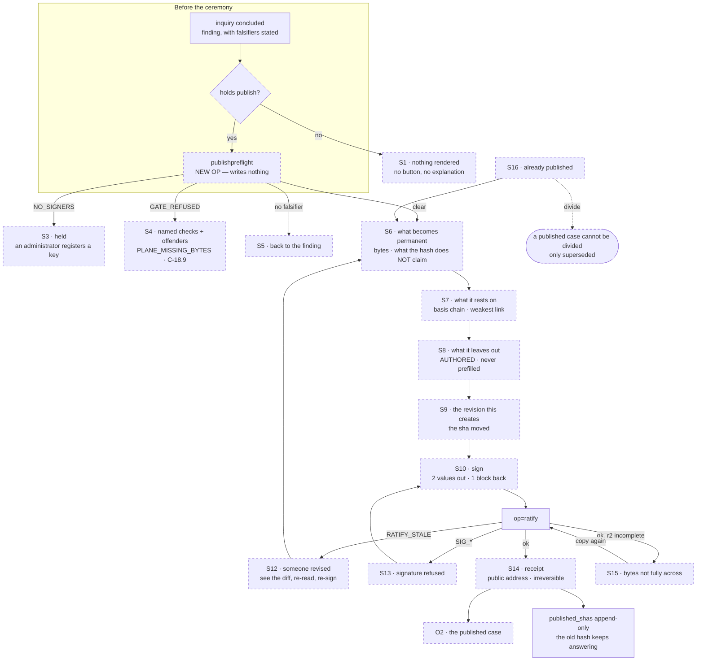

# SB-OUTPUT — storyboards for the three OUTPUT surfaces

Written 2026-08-01 (research pass, Round B). **None of these three surfaces
exists.** This file designs them; it changes no code and proposes no build order.

The three are the sharp end of the path Bob named — *questioning, exploring,
discovering, documenting, impacting* — because they are where the record stops
being ours and becomes answerable:

| | surface | the act it carries | ladder rung |
| --- | --- | --- | --- |
| **O1** | **PUBLICATION CEREMONY** | ratification — irreversible, signed, public | **attested** |
| **O2** | **PUBLISHED CASE** | none. A reader with no credential reads and checks | — |
| **O3** | **ACTION PAGE** | the outward ask, and what came back | reasoned → attested |

Every claim about the code names its file and, where it matters, its line.
Anything not established in this pass is written **I don't know** rather than
guessed. Where a storyboard shows text a member would have typed, it is marked
**[AUTHORED]** and the field ships **EMPTY** — the surface never drafts,
templates, suggests or completes a member's words
(`BIO_Interaction_Constructs_v0_1.md:262-266`).

**Read against:** `UI-BASELINE.md`, `DATA-MODEL.md`, `PROCESS-CATALOGUE.md`,
`CAPABILITIES.md`, `AUDIENCES.md`, `architecture/BIO_Case_Making_v0_1.md`,
`architecture/BIO_Interaction_Constructs_v0_1.md`, `UI-PLAN.md` U10/U12,
`civicos-ui/tokens.css`.

---

## 0. The ground these three stand on

### 0.1 Two grounds, and the design language already encodes the difference

`tokens.css:42-43` declares two page grounds and says which is which in the
token names themselves:

```
--paper: #EDEFE8;   /* WORKING ground; rag paper, warm */
--sheet: #FBFBF8;   /* PUBLISHED ground; the clean sheet */
```

and makes the split structural rather than decorative (`tokens.css:132-151`):
`[data-space="working"]` gets `--paper` and `--t-ui` (15px sans); the fence band
is standing and always rendered. `[data-space="published"]` gets `--sheet` and
`--t-pub-body` (18px, `--lh-read` 1.62) and **never references the fence**.

That gives the three surfaces their register without inventing anything:

- **O1 the ceremony is on `--paper`.** It is a working act. It must not look
  like the thing it produces, or a member will read the preview as the
  publication. The one exception is deliberate: the ceremony's step 1 renders
  the case body on `--sheet` inside a bordered frame, labelled *this is how it
  will read once it is public* — a quotation of the other ground, not a move to
  it.
- **O2 the published case is on `--sheet`** and carries no rail, no fence band,
  no act bar, and no working chrome of any kind.
- **O3 the action page is on `--paper`**, except for correspondence artifacts
  that have been published, which render as quoted `--sheet` cards.

`--signal` (`tokens.css:49`) is reserved for *attention ONLY: clock, changed
source, refusal*. All three surfaces obey that: an overdue statutory clock (O3)
and a refusal (O1) are the only places it appears. **Strength is never coloured
red or green.** A weak claim is not an error and colouring it as one is the
compellingness axis arriving through the back door.

### 0.2 What the three surfaces must NOT do, gathered in one place

These are the constraints every state below is checked against.

1. **Never draft, template, suggest or complete a member's words.** A surface
   MAY assemble the member's OWN prior authored text for them to work from —
   the boundary drawn at `BIO_Interaction_Constructs_v0_1.md:250-260` — and that
   assembly must be visually outside the field, never inside it.
2. **Make a SUPPORTED case easy to state and an UNSUPPORTED one hard**
   (`BIO_Case_Making_v0_1.md:159-164`). Never optimise for compellingness.
3. **`undetermined` is first-class and must be STATED**, rendered identically
   everywhere (`BIO_Interaction_Constructs_v0_1.md:306-316`). Never dressed as
   an error, never invented past, never averaged into a score.
4. **No per-audience relaxation of the ratification gate.** From `AUDIENCES.md`
   §5: *"there must be no administrator build with a relaxed gate, a 'government
   mode', or a different `C-` catalogue… If administrators need a lower
   threshold, that is a threshold on a RENDERING, and it must never be a
   threshold on RATIFICATION."*
5. **A rendering's threshold and exclusions travel IN-BAND** (`AUDIENCES.md` H4)
   — inside the artifact, in every rendering without exception, because files get
   forwarded.
6. **A rendering may drop CLAIMS and may never drop QUALIFIERS** (H5).
7. **A control that lets a member pass a gate by inventing a value is the
   defect class** — D-130, and D-97 before it.

### 0.3 The object these surfaces operate on does not exist yet

Stated plainly so nothing below reads as buildable today.
`bio-checks.mjs:24` declares `OBJECT_TYPES = { INFO: 'information', PROB:
'focus', FOCUS: 'focus', PROJ: 'project', ACTN: 'action' }`. There is no
`inquiry` type, no `concluded` phase, no `published` phase, no basis recursion
and no completeness field (`PROCESS-CATALOGUE.md` §4). `BUNDLE_ID_RE`
(`bio-checks.mjs:13`) is
`/^(INFO|PROB|FOCUS|PROJ|ACTN)-\d{4}-\d{4}-[a-z0-9]+(-[a-z0-9]+)*$/`, so an
`INQ-` id is refused by the catalogue today — the ids in the wireframes below
presume that regex gains `INQ`.

Bob has RULED the collapse and the naming: **the type is `inquiry`; the states
are `open → concluded → published`; `inquiry` / `finding` / `case` are the
member-facing names for those phases** (`BIO_Case_Making_v0_1.md:407-420`).
O1 and O2 are designed against that ruling. O3's object — `action` — DOES exist
and is validated by C-2.10 (`bio-checks.mjs:1285-1296`); what it lacks is every
op that would operate it.

---

## 1. THE RATIFICATION SPLIT, and how it resolves

Asked directly by the brief. Here is what is true today and what I determine.

### 1.1 What is true today, measured

- **Ratification exists in exactly one member-reachable place:** the ratify
  panel in `bio-plane/src/setup.mjs:617-667`, on the PLANE's own origin, gated
  by `can("publish")` (`setup.mjs:624`) which returns `box.innerHTML = ""` when
  absent — the correct absent-not-greyed shape.
- **Surface A has no ratification at all.** `CAPABILITIES.md` measures 0
  occurrences of `"ratify"` in `civicos-ui/app.html`. The capability `publish`
  gates exactly one op, `ratify` (`index.mjs:765`), and the member client never
  consults it.
- **The key act is on a third origin.** `/sign` (`bio-plane/src/signpage.mjs`)
  generates keys in the tab and states *"Runs entirely in this tab. Nothing is
  sent anywhere."* It is reached only from Surface B (`setup.mjs:306`, `:631`)
  and has no link back.
- **The signature is over a fixed statement.** `bio-ratify <bundleId>
  <expectedSha>\n`, produced identically by `signpage.mjs` and by
  `tools/sign-release.html:400`, verified at `index.mjs:2635` against the
  registered active signers.
- **`ratify` ratifies BUNDLES, not cases.** `PROCESS-CATALOGUE.md` P-62 calls
  this *"the boundary act… at the wrong granularity."*

**One correction to the record, since a later session will read it.**
`PROCESS-CATALOGUE.md` §7b item 3 says of `tools/sign-release.html:402` —
*"There is no ratify box."* **There is.** `setup.mjs:637` renders
`<textarea id="r-sig">` with the placeholder `-----BEGIN SSH SIGNATURE-----`,
and `setup.mjs:638` posts it to `op=ratify`. The tool's instruction resolves on
the plane's own page. What is true is the narrower claim: there is no ratify box
in the MEMBER client.

### 1.2 The split, named

There are two splits, not one, and conflating them is how a session builds the
wrong thing:

- **Split A — the ceremony is on the operator's surface, not the member's.**
  Publishing is reachable only by a member who knows to visit a second origin
  that is styled differently, speaks a different vocabulary (`UI-BASELINE.md`
  §6.3 item 5: B says "bundle" throughout, A never does), and consumes none of
  the design tokens.
- **Split B — the key act is deliberately on a third page that sends nothing.**

### 1.3 How it resolves

**The ceremony MOVES. The key act does NOT.**

1. **The ceremony moves to Surface A**, because the ceremony's whole content is
   context Surface B structurally cannot show. B's bundle screen renders facts,
   a markdown body, file download links and a history list (`setup.mjs:554-606`).
   A ceremony must show the BASIS CHAIN, the derived STRENGTH, the FALSIFIERS,
   the MATERIAL SET, and the member's own prior deferral and dismissal reasons
   assembled for them to work from. Every one of those is a graph read that
   Surface A already performs for the document page (`reverseRefs`,
   `op=connections`, `op=links`, `op=projection`) and Surface B performs none of.
   Moving the ceremony to where the context already lives costs a screen; moving
   the context to B costs the whole reading layer twice.

2. **The key act stays out-of-band.** `/sign` remains a separate page on the
   plane origin that generates and holds the key in the tab and sends nothing.
   Surface A hands it exactly two values — the bundle id and the sha it is
   ratifying — and takes back the armored block, which is precisely the protocol
   `setup.mjs:631-637` already uses. **The ceremony must not offer to hold, cache
   or transport the key**, and must not open `/sign` in a frame. A new tab,
   `rel="noopener"`, as B does.

3. **The granularity mismatch resolves without changing the op — by putting the
   completeness statement in the BYTES.** `ratify` takes `{bundleId,
   expectedSha, sig}` and copies every non-`_history/` file into the published
   bucket content-addressed (`index.mjs:2665-2705`). A case IS an inquiry
   bundle. If the exclusion statement is written into `bundle.md` under a
   required heading BEFORE the sha is computed, then ratifying the bundle
   ratifies the case *including what its author said they left out*, and the
   published hash covers it. If instead the exclusion lived in a side table it
   would not be covered by `bundle_sha`, and a reader verifying the hash would
   not receive the one field the whole gate exists to produce. **This is the
   load-bearing decision in O1** and it has a consequence that makes the
   ceremony a ceremony: authoring the exclusion CHANGES THE SHA, so the signature
   can only be taken afterwards. You cannot sign first and write the caveat
   later.

4. **Surface B's panel is DEMOTED, not deleted, and must say so.** It keeps
   working — an instance whose CivicOS worker is down must still be able to
   publish — and gains one line naming the member surface as where this is
   normally done. Two conditions on the demotion:
   - **B must stop being the only route to `s-edit`.** Today "Revise instead"
     is reachable only from the ratify panel (`setup.mjs:637`), which renders
     only for a `publish` holder (`:624`), so a member with `contribute` and not
     `publish` has no route to revise anything on either surface
     (`UI-BASELINE.md` §5.3 item 16). Demoting the panel without moving the
     revise entry point to `s-bundle` would delete revision for everyone.
   - **B's panel must run the same pre-flight** or the two surfaces will refuse
     differently for the same bundle.

5. **Until O1 ships, Surface A must not be silent.** Absent-not-greyed governs a
   capability a member LACKS. A member who HOLDS `publish` and cannot find it is
   a different failure. On a concluded inquiry, a `publish` holder should see one
   honest sentence naming where the act currently lives — not a disabled button,
   and not nothing.

**What this does NOT resolve, stated:** whether the ceremony should also be
reachable from Surface B's roster of published bundles for an administrator
recovering a broken instance. I don't know; it is an operator question, not a
member one.

---

## 2. O1 · PUBLICATION CEREMONY

### 2.1 STORYBOARD — sixteen states

All wireframes are Surface A, `data-space="working"`, `--paper` ground, entered
from a concluded inquiry's page. Serif for judgment, sans for plain speech, mono
for machine fact (`tokens.css:60-64`).

---

**S1 · ABSENT — the member does not hold `publish`**

There is no panel, no button, no greyed control and no explanation. The
inquiry's page ends at its act bar with the acts this member can take. §5 of
Membership v2: *"A capability a member does not hold is absent from their
interface, not present and refused."* Reference implementation:
`setup.mjs:624`.

```
┌─ INQ-2026-0007-sewer-fund-transfers ─────────────────────────────┐
│  Sewer fund transfers to the General Purpose Fund                │
│  ⬤ concluded · finding                                           │
│                                                                  │
│  … the finding, its basis, its falsifiers …                      │
│                                                                  │
│  ── Acts ────────────────────────────────────────────────────    │
│  [ Divide this into two or more… ]  [ Reopen with a reason… ]    │
└──────────────────────────────────────────────────────────────────┘
        ↑ nothing about publishing appears here at all
```

---

**S2 · NOTHING TO PUBLISH — the inquiry has not concluded**

The member holds `publish`, and the object is not ready. This is not a refusal;
it is a fact about the object, so it is stated where the state is, not in a
dialog.

```
┌─ INQ-2026-0011-parcel-tax-carryover ─────────────────────────────┐
│  ⬤ open · inquiry                                                │
│                                                                  │
│  ── Publishing ──────────────────────────────────────────────    │
│  An inquiry is published once it has concluded — once it states  │
│  what it found, what that rests on, and what would show it       │
│  wrong. This one is still open.                                  │
│                                                                  │
│  [ Conclude this inquiry… ]                                      │
└──────────────────────────────────────────────────────────────────┘
```

---

**S3 · HELD — no registered signing key on this instance (`NO_SIGNERS`)**

The member holds the capability and the instance holds no key. `index.mjs:2632`
refuses with `NO_SIGNERS`. **This is discovered at PRE-FLIGHT, not after the
member has authored an exclusion statement and gone to sign.** Today it is
discovered last (`setup.mjs` posts and translates the refusal at `:655-667`),
which is the wrong order for the ACT construct's own rule: *show what the action
will REFUSE and why before it runs.*

```
┌─ Publishing is not available on this copy ───────────────────────┐
│                                                                  │
│  Publishing needs a signature made with a key this group has      │
│  registered. No keys are registered here yet, so nothing can be   │
│  published.                                                       │
│                                                                  │
│  An administrator registers keys under Members and keys.          │
│                                                                  │
│  [ Close ]                                                        │
└──────────────────────────────────────────────────────────────────┘
```

---

**S4 · PRE-FLIGHT REFUSES — the gate would refuse these bytes**

`runGate` runs at ratification and refuses with `GATE_REFUSED` carrying the
findings (`index.mjs:2661`). Two of its refusals are the reason the pre-flight
must exist at all: `PLANE_MISSING_BYTES` and `PLANE_SIZE` (D-45 — an unbacked
register entry is refused at RATIFY, not at promote, so publication is the first
moment a member learns of it), and C-18.9's unattributed-hop rule (D-114).

The pre-flight paints every gate as ✓/✗ with its need sentence, in the plane's
own checking order, the same shape `disposePreflight` and `attestPreflight`
already use (`app.html:4232-4257`, `:6265-6287`). Refusals are rendered
**verbatim with their offenders named**.

```
┌─ Before this can be published ───────────────────────────────────┐
│  INQ-2026-0007-sewer-fund-transfers                              │
│                                                                  │
│  ✓  You may publish                                              │
│  ✓  A signing key is registered on this copy                     │
│  ✓  This finding states what would show it wrong                 │
│  ✓  This finding states what it rests on                         │
│  ✗  The record holds the bytes it claims to hold                 │
│       PLANE_MISSING_BYTES                                        │
│       data/acfr-fy2024-p112.pdf — the provenance register names   │
│       these bytes and this copy does not hold them.               │
│  ✗  Every step in the provenance chain names who took it          │
│       C-18.9 (data/provenance.json, entry 2)                     │
│                                                                  │
│  Publishing is blocked until those are fixed. Nothing has been    │
│  written and nothing has been signed.                             │
│                                                                  │
│  [ Close ]   [ Open the register ]                                │
└──────────────────────────────────────────────────────────────────┘
```

---

**S5 · PRE-FLIGHT REFUSES — no falsifier stated**

Deliberate design decision, and the reason it is here rather than in the
ceremony: **the ceremony must never be a place where a falsifier gets invented
under the pressure of a half-finished act.** A finding states what would show it
wrong when it CONCLUDES (`## What Would Falsify This`, a stage requirement on
`concluded`). The ceremony reads it, shows it, and refuses without it — and its
only exit is back to the finding.

```
┌─ Before this can be published ───────────────────────────────────┐
│  ✗  This finding states what would show it wrong                 │
│       This finding's "What would show this wrong" section is      │
│       empty. A case that cannot be checked cannot be published.   │
│       State it on the finding, where it belongs, and come back.   │
│                                                                  │
│  [ Close ]   [ Open the finding ]                                 │
└──────────────────────────────────────────────────────────────────┘
```

---

**S6 · STEP 1 of 5 — WHAT BECOMES PERMANENT**

The ceremony opens on consequence, not on a form. Two blocks: what the act does,
and — verbatim from the ATTESTATION construct's accountability rule
(`BIO_Interaction_Constructs_v0_1.md:285-288`) — **what a published hash does
and does NOT claim.**

```
┌─ Publishing a case · 1 of 5 ─────────────────────────  ATTESTED ─┐
│                                                                  │
│  WHAT BECOMES PERMANENT                                          │
│                                                                  │
│  Publishing copies this exact revision across the fence, where    │
│  anyone can check it against its hash without our cooperation.    │
│  It cannot be undone. A published hash answers forever, even      │
│  after later revisions, and even if this group stops existing.    │
│                                                                  │
│  These are the bytes that will answer:                            │
│  ┌────────────────────────────────────────────────────────────┐  │
│  │ bundle.md                                    14,208 bytes  │  │
│  │ data/provenance.json                          3,041 bytes  │  │
│  │ data/acfr-fy2024-p112.pdf                 1,884,332 bytes  │  │
│  │ data/ord-13842.html                          92,517 bytes  │  │
│  │ data/ord-13842.snapshot.json                 11,006 bytes  │  │
│  │                              5 files · 2,005,104 bytes     │  │
│  └────────────────────────────────────────────────────────────┘  │
│                                                                  │
│  WHAT THE PUBLISHED HASH CLAIMS — AND WHAT IT DOES NOT           │
│                                                                  │
│  Claims: that these exact bytes were held by this group, that     │
│  they were retrieved from the address recorded beside each one,   │
│  on the date recorded, by the route recorded.                     │
│                                                                  │
│  Does NOT claim: that any document here is an authentic           │
│  municipal record; that a public body agrees with any of it;      │
│  that the conclusion is correct. Those are not things a hash      │
│  can say, and nothing here says them for you.                     │
│                                                                  │
│  ┌── how it will read once it is public ────────────────────┐    │
│  │ ░ (rendered on the published ground, --sheet, at         │    │
│  │ ░  --t-pub-body, inside this frame and nowhere else)     │    │
│  └──────────────────────────────────────────────────────────┘    │
│                                                                  │
│                              [ Cancel ]   [ Continue → ]         │
└──────────────────────────────────────────────────────────────────┘
```

The `ATTESTED` mark in the header is the weight ladder's top rung
(`app.html:4261-4275` renders the ladder today for dispose at `reasoned`). The
member has met this ladder before at `reversible` and `reasoned`; this is the
first time they reach the top rung, and it should look like it — but it is the
same ladder, not a new vocabulary.

---

**S7 · STEP 2 of 5 — WHAT THIS RESTS ON**

Read-only. Not editable here — changing a basis at publication time would be
revising the argument inside the act that publishes it. Its job is to make the
member SEE the weakest leg, because that is what the case is worth
(`BIO_Case_Making_v0_1.md:453-460`).

```
┌─ Publishing a case · 2 of 5 ─────────────────────────  ATTESTED ─┐
│                                                                  │
│  WHAT THIS CASE RESTS ON                                         │
│                                                                  │
│  This case will be published at strength  ▪ C ▪                  │
│  A case is worth its weakest leg. This one's weakest leg is       │
│  the third below.                                                 │
│                                                                  │
│  ├── A · INFO-2026-0031-acfr-fy2024                              │
│  │     Annual Comprehensive Financial Report FY2024, p.112       │
│  │     verified · captured from the city's own address           │
│  │     grade A — the document says it itself                     │
│  │                                                               │
│  ├── B · INFO-2026-0044-council-ord-13842                        │
│  │     Ordinance 13842                                           │
│  │     verified · grade B — one document names the other         │
│  │                                                               │
│  ├── C · INQ-2026-0012-transfer-authority                        │
│  │     "Which body may authorise an inter-fund transfer"         │
│  │     published case · strength C                               │
│  │     ▸ this leg rests on three further legs — expand           │
│  │                                                               │
│  └── D · INFO-2026-0058-controller-memo                          │
│        Controller's memo, 12 March 2026                          │
│        collected · strength undetermined                         │
│        ⓘ undetermined — this has not been through review, so     │
│          the record does not yet say how it was established.     │
│                                                                  │
│  A case built on a case cannot be stronger than the case          │
│  beneath it. C is a published case at strength C, so this one     │
│  cannot exceed C.                                                 │
│                                                                  │
│                        [ ← Back ]   [ Continue → ]               │
└──────────────────────────────────────────────────────────────────┘
```

Note leg D: an `undetermined` leg is rendered with the UNDETERMINED primitive,
identically to authority-undetermined and link-verdict-undetermined
(`app.html:3310-3322` already renders that voice). It is **not** rendered as a
failure and it is **not** silently treated as the weakest link — I do not know
whether `undetermined` should floor the composition or suspend it, and that is a
real open question below.

---

**S8 · STEP 3 of 5 — WHAT YOU ARE LEAVING OUT** *(the gate)*

The single surviving reason the case object exists
(`BIO_Case_Making_v0_1.md:266-303`). The gate is not *are these findings true*
— each finding's own gate is already inherited. It is **has the author stated
what was excluded, and why.**

The field is EMPTY at ship. The assembly panel on the right holds the member's
OWN prior authored reasons — deferrals, dismissals, severances, apportionments —
verbatim, dated, each with a jump to where they said it. This is the one
auto-composition the prefill rule permits
(`BIO_Interaction_Constructs_v0_1.md:250-260`): *assembling what a member already
wrote is not a fabricated attribution; drafting a justification for them is.*
The panel is **outside** the textarea, has no "insert" button, and says so.

```
┌─ Publishing a case · 3 of 5 ─────────────────────────  ATTESTED ─┐
│                                                                  │
│  WHAT THIS CASE LEAVES OUT                                       │
│                                                                  │
│  Publishing asserts something no gate can check: that this is     │
│  the material set. No system can know what a group did not look   │
│  at. So the record does what it does with everything it cannot    │
│  establish — it makes the claim visible, attributable, and        │
│  stated, in your words, with your name on it.                     │
│                                                                  │
│  This goes into the published bytes. It is part of what the       │
│  hash answers for, and a reader sees it beside the conclusion.    │
│                                                                  │
│  ┌── Say what you left out, and why ────┐ ┌── YOUR OWN WORDS ──┐ │
│  │                                      │ │ For reference. None │ │
│  │  [EMPTY AT SHIP — never prefilled,   │ │ of this is copied   │ │
│  │   never templated, never suggested]  │ │ into the box; if    │ │
│  │                                      │ │ you want any of it  │ │
│  │                                      │ │ there, write it.    │ │
│  │                                      │ │                     │ │
│  │                                      │ │ 14 Jun · deferred   │ │
│  │                                      │ │ FOCUS-2026-0019     │ │
│  │                                      │ │ "The 2019 transfer  │ │
│  │                                      │ │  predates the       │ │
│  │                                      │ │  ordinance and I    │ │
│  │                                      │ │  could not find     │ │
│  │                                      │ │  the authorising    │ │
│  │                                      │ │  resolution."  ↗    │ │
│  │                                      │ │                     │ │
│  │                                      │ │ 2 Jul · dismissed   │ │
│  │                                      │ │ FOCUS-2026-0023 ↗   │ │
│  │                                      │ │ 9 Jul · severed     │ │
│  │                                      │ │ INFO-2026-0040 ↗    │ │
│  │  0 / 2000                            │ │                     │ │
│  └──────────────────────────────────────┘ └─────────────────────┘ │
│                                                                  │
│  ⓘ Nothing here checks whether what you say is complete. It       │
│    records who said it and when.                                  │
│                                                                  │
│                        [ ← Back ]   [ Continue → ]  (disabled)   │
└──────────────────────────────────────────────────────────────────┘
```

Grammar validation matches the release dialog's, which refuses quote, backslash
and newline in the counter itself (`app.html:4136-4147`) — the field bounds are
enforced at WRITE time, not at render time, because this text will be read in
clients we do not control (D-98's F5 reasoning).

---

**S9 · STEP 4 of 5 — THE REVISION THIS CREATES**

The consequence of putting the exclusion in the bytes, made explicit rather than
hidden. The member is shown that their words changed the hash, and that the hash
they are about to sign is the new one.

```
┌─ Publishing a case · 4 of 5 ─────────────────────────  ATTESTED ─┐
│                                                                  │
│  WHAT YOU JUST WROTE IS NOW PART OF THE CASE                     │
│                                                                  │
│  Your statement has been saved into this case as a revision, so   │
│  that it travels with the published bytes and a reader sees it    │
│  without asking us for it.                                        │
│                                                                  │
│  before      sha256:4c1f0aa9e2b7d5…                              │
│  now         sha256:9d0e77b31af4c2…   ← this is what you sign    │
│                                                                  │
│  Nothing is published yet. If you stop here, the statement stays  │
│  in the working record as a revision and the case is not public.  │
│                                                                  │
│                        [ ← Back ]   [ Continue → ]               │
└──────────────────────────────────────────────────────────────────┘
```

---

**S10 · STEP 5 of 5 — SIGN**

The handoff. Two values out, one block back. The surface never touches the key.

```
┌─ Publishing a case · 5 of 5 ─────────────────────────  ATTESTED ─┐
│                                                                  │
│  SIGN IT                                                         │
│                                                                  │
│  Publishing needs your key, and your key never comes here. Open   │
│  the signing page, unlock your key there, and paste back what it  │
│  hands you.                                                       │
│                                                                  │
│  Case    INQ-2026-0007-sewer-fund-transfers          [copy]      │
│  Hash    sha256:9d0e77b31af4c2…                      [copy]      │
│                                                                  │
│  [ Open the signing page ↗ ]  (new tab · nothing is sent there)  │
│                                                                  │
│  ┌──────────────────────────────────────────────────────────┐    │
│  │ -----BEGIN SSH SIGNATURE-----                            │    │
│  │                                                          │    │
│  └──────────────────────────────────────────────────────────┘    │
│                                                                  │
│  Once you press Publish this cannot be undone.                    │
│                                                                  │
│               [ ← Back ]   [ Publish this case ]  (disabled)     │
└──────────────────────────────────────────────────────────────────┘
```

---

**S11 · COMMITTING**

Single disabled button, one progress line at a time, no spinner theatre. The
lines name real steps because each can fail differently: checking → verifying
the signature → copying the bytes across the fence.

---

**S12 · REFUSED · `RATIFY_STALE`**

Somebody saved a newer revision while the member was signing. `index.mjs:2627`.
The sha they signed is no longer the live one. The refusal must NOT discard
their signature silently, and must not offer to re-sign the new bytes for them.

```
┌─ Not published ───────────────────────────────────── --signal ──┐
│  Someone saved a newer revision of this case while you were       │
│  signing, so the hash you signed is no longer the current one.     │
│                                                                    │
│  you signed   sha256:9d0e77b31af4c2…                              │
│  now current  sha256:e07b12ff9a3c40…                              │
│                                                                    │
│  Nothing was written and nothing was published. Read the case      │
│  again — what changed may change what you want to say about        │
│  what it leaves out — and sign the new hash.                       │
│                                                                    │
│  [ See what changed ]   [ Read it again ]                          │
└────────────────────────────────────────────────────────────────────┘
```

"See what changed" reuses the in-place LCS line diff the document page already
has (`app.html:1651-1679`).

---

**S13 · REFUSED · the signature**

`SIG_UNKNOWN_KEY`, `SIG_BAD_SIGNATURE`, `SIG_NAMESPACE`, `MALFORMED`. Each is
translated once, in the member surface, in the plane's checking order — the
eight translations `ratifyWhy` (`setup.mjs:655-667`) already carries, moved and
not re-derived. The plane's own `reason` is shown verbatim beneath the
translation, as `releaseRefusal` and `attestRefusalHtml` do.

```
┌─ Not published ───────────────────────────────────── --signal ──┐
│  That signature was made for something other than publishing.     │
│  Use the "Sign a ratification" tab on the signing page.            │
│                                                                    │
│  SIG_NAMESPACE                                                     │
│                                                                    │
│  Nothing was written and nothing was published.                    │
│  [ Try again ]                                                     │
└────────────────────────────────────────────────────────────────────┘
```

---

**S14 · RECEIPT — published**

The receipt states what is now true, gives the public address a stranger can
use, and restates the limit at the far end — the same both-ends honesty the
attest dialog uses (`app.html:6256-6259` before, `:6388-6408` after).

```
┌─ Published ────────────────────────────────────────  --tint-ok ─┐
│                                                                  │
│  This case is public, attested by Ruth Ferreira's key.            │
│  5 hashes are now verifiable by anyone.                           │
│                                                                  │
│  case     INQ-2026-0007-sewer-fund-transfers                     │
│  hash     sha256:9d0e77b31af4c2…                     [copy]      │
│  public   /published/INQ-2026-0007-sewer-fund-transfers [copy]   │
│  at       2026-08-01 17:42 UTC · catalogue 1.17.0                │
│                                                                  │
│  Anyone can check those bytes against that hash without our       │
│  cooperation, and will still be able to if this group stops       │
│  existing. This cannot be withdrawn. If it turns out to be        │
│  wrong, it is superseded by a new inquiry that says so — and      │
│  the old hash keeps answering.                                    │
│                                                                  │
│  [ Read it as the public reads it ↗ ]   [ Back to the record ]   │
└──────────────────────────────────────────────────────────────────┘
```

---

**S15 · RECEIPT — published, with the byte copy incomplete**

`index.mjs` tracks `r2state` and can report `"INCOMPLETE: capture vanished
between gate and copy"` (`index.mjs:2697`). The rows are committed; some bytes
are not across. **This must be stated, not swallowed** — a reader following a
hash to a missing object gets a worse experience than one told in advance.

```
┌─ Published, and one file has not crossed yet ────── --signal ───┐
│  The case is published and its hashes answer. One file's bytes    │
│  did not copy across:                                              │
│      data/acfr-fy2024-p112.pdf                                     │
│  Its hash is published and a reader asking for the bytes will be   │
│  told they are not there yet, rather than given something else.    │
│  Publishing again copies what is missing; it does not republish    │
│  or change anything already answered.                              │
│  [ Copy the remaining bytes ]                                      │
└────────────────────────────────────────────────────────────────────┘
```

---

**S16 · ALREADY PUBLISHED — a later revision, and division refused**

`published_shas` is append-only across re-ratifications (`schema.mjs:173-175`:
*"a hash once published stays verifiable forever"*), and `publish` upserts
`published_bundles` (`store.mjs:5934-5942`). So re-ratifying a revised case does
NOT retract the earlier one. The surface must say so, or a member will believe
republishing corrects the record.

```
┌─ This case is already published ─────────────────────────────────┐
│  published   2026-08-01 · sha256:9d0e77b31af4c2…                 │
│  since then  3 revisions in the working record                    │
│                                                                  │
│  Publishing again publishes the new revision. It does NOT         │
│  withdraw the one already published: that hash keeps answering,    │
│  because somebody may have relied on it.                           │
│                                                                  │
│  A published case cannot be divided. If it was the wrong          │
│  question, or the answer was wrong, that is a new inquiry that     │
│  supersedes this one and says why — and everything that cited      │
│  this case is flagged for a second look.                           │
│                                                                  │
│  [ Publish the new revision… ]  [ Open a superseding inquiry… ]   │
└──────────────────────────────────────────────────────────────────┘
```

The division refusal is `BIO_Case_Making_v0_1.md:448-451` verbatim in substance:
*"A published hash answers forever and somebody may already have acted on it;
retraction and revision are different acts, and dividing a case after the world
has relied on it would be revision pretending to be housekeeping."*

### 2.2 JUSTIFICATION

**Why a five-step ceremony rather than a dialog.** The ACT construct collapses
most acts into one motion — choose, pre-flight, author, receipt — and the
Constructs document names the one place collapsing costs something: *"People
arrive with a model for SIGNING that is not 'filling in a form': deliberate,
ceremonial, hard to do by accident. If ratification becomes a variation of the
act surface, the ceremony is lost — and the ceremony IS the safeguard"*
(`:47-53`). The five steps are not five screens for their own sake; each one is
a distinct thing the member must have MET before the irreversible act:
consequence (S6), what the claim is worth (S7), what it leaves out (S8), the
fact that their own words moved the hash (S9), and the key (S10). Remove any one
and something the member is accountable for has gone past them unread.

**Why the exclusion statement is authored at publication and the falsifier is
not.** Both are required. The difference is where inventing one is likely.
Completeness is a claim ONLY the publication act makes — a finding must not
assert it, or findings stop being reusable across cases
(`BIO_Case_Making_v0_1.md:282-288`) — so it has nowhere else to live. A
falsifier is a property of the claim itself and belongs to concluding. Asking
for it in the ceremony would place a hard intellectual question inside a
half-finished irreversible act, which is exactly the pressure that produces
`counterparty: to be named`.

**Why the pre-flight is separate from the ceremony.** Today the gate runs inside
`ratify`, so a member learns `GATE_REFUSED` *after* signing. That wastes a
signature, and worse, it puts the refusal after the point where the member has
already committed emotionally. `S · SELECTION-SCOPED`'s rule generalises:
*"the surface should show what the action will REFUSE and why before it runs,
not after."* The pre-flight is a read; it writes nothing; it can be re-run.

**Why the case body is quoted on `--sheet` inside the ceremony rather than
previewed as a page.** A full-page preview on the published ground is
indistinguishable from the published page. That is the one confusion that would
be catastrophic here: a member believing they have already published. The frame
keeps it a quotation.

**Why the exclusion goes in the bytes.** Argued in §1.3 item 3. The alternative
— a `published_exclusions` table — is cheaper to build and is wrong: the
statement would not be covered by `bundle_sha`, so §8.2's guarantee (published
material is reconstructible *"without the cooperation, permission, or continued
existence of the instance it came from"*) would hold for the conclusion and not
for its caveat. A rebuilt corpus would carry the claim and drop the qualifier,
which is H5's forbidden compression performed by the architecture.

**Why re-ratification is shown as accumulation, not correction.** Because that
is what `published_shas` does. A surface that let a member believe republishing
retracts would be the interface being looser than the check — the failure D-114
refused.

**What I did NOT do, and why.** No "publish to audience X" control anywhere in
the ceremony. `AUDIENCES.md` §5 forbids a threshold on ratification; putting an
audience selector in the ceremony would make the gate per-audience by
implication even if the code ignored it.

### 2.3 DATA MODEL

**Exists today.**

| table | columns (verbatim, `schema.mjs:177-194`) |
| --- | --- |
| `published_bundles` | `bundle_id` PK · `bundle_sha` · `ratified_at` · `attestor_key` · `attestor_member` · `gate_version` · `sig_armored` |
| `published_shas` | `(sha256, bundle_id, path)` PK · `kind` · `bytes` · `published`; index on `sha256` |
| `signers` | `key_b64` PK · `member_id` · `comment` · `status` · `added` |

Ops: `ratify` (`index.mjs:401`, `NEEDS.ratify = "publish"` at `:765`),
`publishedmanifest` (`:287`, `classes: null`), `verify` (`:544`, `classes:
null`), `signeradd`/`signerset`/`signerlist` (`:524-526`).

**What must change or be added.** Where `DATA-MODEL.md` Part 2 already proposes
a shape, this uses ITS name and ITS columns rather than inventing a second one.

| # | change | why |
| --- | --- | --- |
| P1 | `BUNDLE_ID_RE` gains `INQ` (`bio-checks.mjs:13`) | an inquiry cannot have an id today |
| P2 | `OBJECT_TYPES` gains `INQ: 'inquiry'`; states `open → concluded → published`; four copies of the type mapping must move together (`bio-checks.mjs:25-26`, `store.mjs:194`, `store.mjs:2807`, `query.mjs:411`) and two more in the surfaces | the object does not exist. `problem → focus` cost one commit, 18 files, and the UI drifted because it was not in it |
| P3 | heading set for `inquiry`: `## Conclusion` · `## Basis` · `## What Would Falsify This` · `## What This Excludes` · `## Session Log` · `## Review Notes` | C-3.1 refuses both a missing heading and an unexpected one, so the exclusion must be canonical or it cannot be written at all |
| P4 | **stage entry requirement** — `published` requires `## What This Excludes` non-empty, in the shape C-2.7 already uses to make `content_hash` an entry requirement for `verified` | presence. The completeness gate |
| P5 | **C-21.1 as proposed in `DATA-MODEL.md` §2.4.3** — no field of `completeness` carried forward byte-identical from the previous revision, checked against `history` | the never-prefilled rule made MECHANICAL. The doc's own sentence: *"A gate that only checks presence IS a checkbox"* |
| P6 | stage entry requirement — `concluded` requires `## What Would Falsify This` non-empty | S5 |
| P7 | `inquiry_basis(bundle_id, ord, target_id, target_type, role, grade, grade_source, note, at)` PK `(bundle_id, ord)`, indexed on `target_id` and `bundle_id` — **exactly `DATA-MODEL.md` §2.4** | the basis chain S7 renders. `refs` cannot carry it: its PK has no ordinal and no room for a grade. `role ∈ supports \| cuts_against` is what gives invariant 7 a mechanism |
| P8 | `inquiry_exclusions(bundle_id, ord, target_id, description, reason, author, at)` PK `(bundle_id, ord)` — **exactly `DATA-MODEL.md` §2.4** | the doc's D3 is right and my first pass was wrong: the prose in `bundle.md` makes the assertion **storable**; only the indexed projection makes it **auditable**, and without the index *"which published cases excluded this document"* cannot be asked at all. Both, not either |
| P9 | `bundles.inquiry_strength TEXT` + `inquiry_strength_determined INTEGER`, derived on read via the existing `#weakerGrade` / `#GRADE_RANK` (`store.mjs:3210`, `:3444-3445`), and **frozen into the frontmatter at publication** | `DATA-MODEL.md` is right that no column is added to `published_bundles` for this: a published case's strength must be whatever the group signed, inside the hash, forever. A live re-derivation would let the published page disagree with the bytes it serves |
| P10 | **`published_bundles` gains `title TEXT`** — and this is a DELIBERATE DIVERGENCE from `DATA-MODEL.md` §2.4.4's *"no column is added to either"* | that sentence is an argument about the completeness ASSERTION, and it is correct about assertions. A title is not an assertion; it is a label already inside the hashed bytes, and projecting it is a cache exactly as `bundles.title` is. Without it `publishedList()` (`store.mjs:5964-5966`) returns five columns and no title, which is why `pubOpen` (`app.html:6853`) can only render a bundle id as its `<h1>`. The alternative — one `publishedbundle` call per row to read a title — makes the public index N+1 |
| P11 | **new op `publishpreflight`** — non-mutating, `NEEDS = "publish"` | S3/S4/S5. Runs `runGate` + signer presence + P4/P6 and returns findings, writing nothing. Without it the member signs first and learns second |
| P12 | `ratify`'s response surfaces `r2state` in a member-renderable form | S15. `index.mjs:2691-2705` computes it and no surface shows it |

`ratify` itself needs no change. `{bundleId, expectedSha, sig}` with its own CAS
is exactly right, and it becomes case-granular for free once the completeness
statement is inside `bundle.md`.

**Precedent this ceremony copies rather than invents:** `op=release` already
takes `acknowledgment` and `mitigation` as caller-supplied, never-prefilled
strings at a gate (`store.mjs:7584-7588`). That is the U5 shape raised *"from a
document to an argument"*, and S8 is that shape one level up.

**House rules this must obey:** new tables go BEFORE the `host_governor` block in
`schema.mjs` (the hygiene test asserts the literal ends on `);`); both new tables
must be named in `op=purge`'s `TABLES` at `store.mjs:4516-4518` or D-113/D-137
recur; the author on an authored row is stamped server-side at the trust boundary
in `index.mjs`, never taken from the caller and never stamped in `store.mjs`.

**Ops the ceremony calls, in order:** `publishpreflight` → `lease` → `promote`
(the exclusion revision) → `image` (to recompute the sha) → `ratify`.

**Purge note, load-bearing for O2:** `published_bundles` and `published_shas` are
two of the fourteen EXEMPT tables (`hygiene.test.mjs:216-231`) — *kept verifiable
forever by doctrine*. A whole-store purge does not unpublish anything, which is
the same fact the receipt states to the member.

### 2.4 CAPABILITIES, and what is absent without them

| held | what the member gets |
| --- | --- |
| `publish` **and** a registered active key | the whole ceremony |
| `publish`, **no** registered key on the instance | S3 at pre-flight — the panel exists, the act is held, and the reason names an administrator's action, not the member's |
| `contribute`, not `publish` | **nothing.** No panel, no button, no explanation (S1). The inquiry page ends at the acts they can take |
| read-only credential | as above, plus no acts at all |
| administrator | holds every working capability implicitly (`store.mjs:4786`), so the ceremony renders |

**The key and the capability are two different things**, and `index.mjs:761-764`
records why: before `publish` existed, *"the key was doing the capability's
job."* The ceremony must keep them separate in what it says — S1 is a capability
absence and shows nothing; S3 is an authority absence and explains, because the
member has the right and the instance lacks the means.

**Absent without them, precisely:** without `publish` a member cannot reach
`op=ratify` at all — the plane refuses at gate 4 with `NOT_CAPABLE` carrying
`needs`, `held` and *"ask an administrator to grant it rather than looking for
another route"* (`index.mjs:1115-1117`). The hidden panel is a courtesy; the
refusal is the boundary (`index.mjs:676-680`).

**A hazard this surface creates and must not:** `CAPABILITIES.md` F-9 records
that the plane publishes `capabilities` and `vocabulary` but NOT the `NEEDS`
map, so every interface keeps its own copy and two copies have already diverged.
Building O1 in `app.html` creates a **third**. Either publish `NEEDS` from the
plane, or accept the third copy knowingly and name it in DEBT.

### 2.5 WORKFLOW EDGES



Everything dashed is unbuilt. `COMMIT` is the only solid node: `op=ratify` ships
and `setup.mjs:617-667` reaches it.
